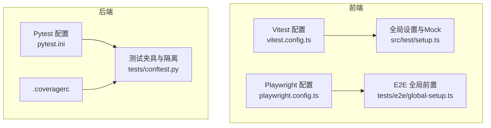
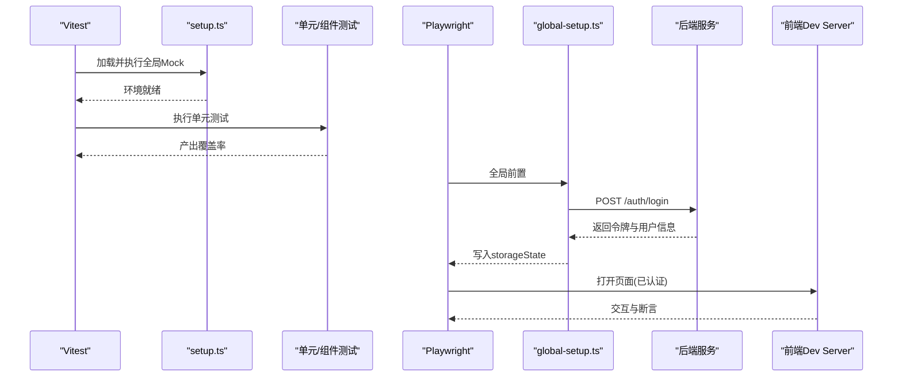
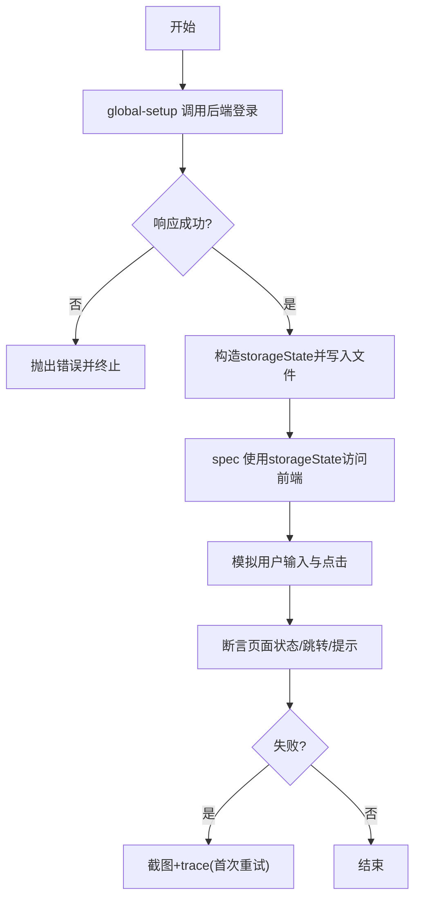
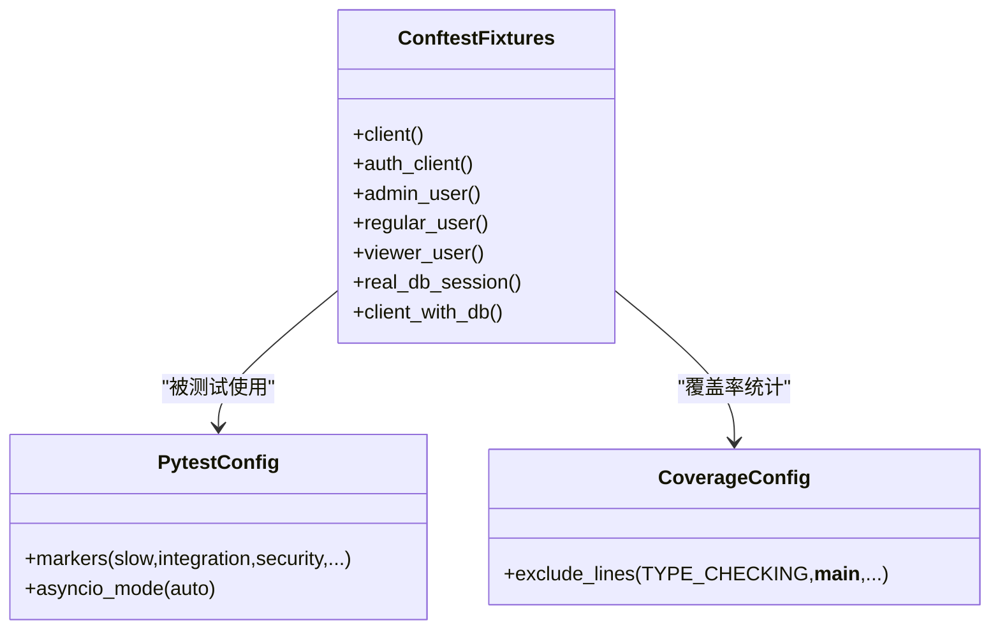
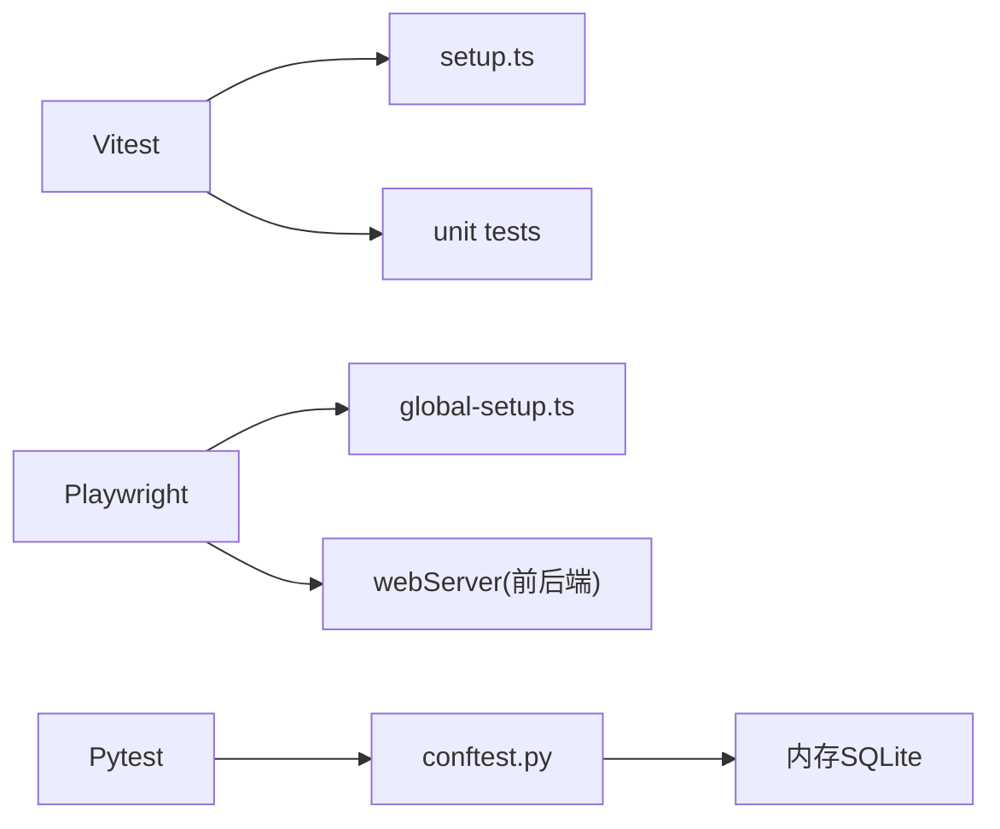

# 测试指南

<cite>
**本文引用的文件**
- [frontend/vitest.config.ts](file://frontend/vitest.config.ts)
- [frontend/src/test/setup.ts](file://frontend/src/test/setup.ts)
- [frontend/playwright.config.ts](file://frontend/playwright.config.ts)
- [frontend/tests/e2e/global-setup.ts](file://frontend/tests/e2e/global-setup.ts)
- [frontend/tests/unit/stores.test.ts](file://frontend/tests/unit/stores.test.ts)
- [backend/pytest.ini](file://backend/pytest.ini)
- [backend/.coveragerc](file://backend/.coveragerc)
- [backend/tests/conftest.py](file://backend/tests/conftest.py)
</cite>

## 目录
1. [简介](#简介)
2. [项目结构](#项目结构)
3. [核心组件](#核心组件)
4. [架构总览](#架构总览)
5. [详细组件分析](#详细组件分析)
6. [依赖关系分析](#依赖关系分析)
7. [性能考量](#性能考量)
8. [故障排查指南](#故障排查指南)
9. [结论](#结论)
10. [附录](#附录)

## 简介
本测试指南面向前端与后端，基于 Vitest（前端单元测试）与 Playwright（端到端测试），结合 Pytest（后端测试），提供从组件、工具函数、Store 到 E2E 的完整实践。内容涵盖 Mock 数据准备、异步测试处理、断言库使用、覆盖率收集、持续集成配置、报告生成，以及最佳实践、性能测试与安全测试要点。通过仓库中现有配置文件与测试用例，展示如何编写高质量、可维护、可复用的测试代码。

## 项目结构
前端测试：
- 单元测试：Vitest + jsdom，全局环境在 setup 文件中统一 Mock（localStorage、Element Plus 组件、Canvas、路由等）。
- 端到端测试：Playwright，自动启动后端与前端 dev server，隔离数据库，预置登录态 storageState，支持截图与追踪。

后端测试：
- 单元测试/集成测试：Pytest，内存 SQLite、会话级临时数据目录隔离、TestClient 注入认证、标记慢测/安全/性能等。

**图表来源**
- [frontend/vitest.config.ts:1-104](file://frontend/vitest.config.ts#L1-L104)
- [frontend/src/test/setup.ts:1-330](file://frontend/src/test/setup.ts#L1-L330)
- [frontend/playwright.config.ts:1-84](file://frontend/playwright.config.ts#L1-L84)
- [frontend/tests/e2e/global-setup.ts:1-61](file://frontend/tests/e2e/global-setup.ts#L1-L61)
- [backend/pytest.ini:1-39](file://backend/pytest.ini#L1-L39)
- [backend/.coveragerc:1-18](file://backend/.coveragerc#L1-L18)
- [backend/tests/conftest.py:1-737](file://backend/tests/conftest.py#L1-L737)

**章节来源**
- [frontend/vitest.config.ts:1-104](file://frontend/vitest.config.ts#L1-L104)
- [frontend/playwright.config.ts:1-84](file://frontend/playwright.config.ts#L1-L84)
- [backend/pytest.ini:1-39](file://backend/pytest.ini#L1-L39)

## 核心组件
- Vitest 运行环境与覆盖率
  - 使用 jsdom 环境、单线程执行、重试策略缓解时序抖动；覆盖率采用 v8 provider，按路径设定阈值（utils/stores/composables/api/views/components/router/config/directives 等均为 90%）。
  - 排除 e2e、类型定义、构建产物与无关目录，避免噪音。
- 全局测试设置
  - 统一 Mock localStorage/sessionStorage、matchMedia、IntersectionObserver、ResizeObserver、requestAnimationFrame、Canvas 2D 上下文、Element Plus 组件与指令、Vue Router 桩，确保组件测试稳定。
- Playwright E2E
  - 自动启动后端（端口 18000）与前端 dev server（端口 15173），使用独立测试数据库，预置 storageState 避免 UI 登录限流；失败时截图、首次重试开启 trace；工作进程串行化保证共享 SQLite 一致性。
- Pytest 后端测试
  - 内存 SQLite、会话级临时上传目录、强制 UTF-8、Agg 后端；集中清理超长环境变量；提供 TestClient、认证头、用户角色夹具；标记 slow/integration/security/performance 等。

**章节来源**
- [frontend/vitest.config.ts:7-89](file://frontend/vitest.config.ts#L7-L89)
- [frontend/src/test/setup.ts:16-239](file://frontend/src/test/setup.ts#L16-L239)
- [frontend/playwright.config.ts:11-83](file://frontend/playwright.config.ts#L11-L83)
- [backend/pytest.ini:1-39](file://backend/pytest.ini#L1-L39)
- [backend/.coveragerc:4-18](file://backend/.coveragerc#L4-L18)
- [backend/tests/conftest.py:6-113](file://backend/tests/conftest.py#L6-L113)

## 架构总览
前端测试链路：
- Vitest 加载 setup.ts 完成浏览器 API 与 UI 组件桩，随后执行 unit 测试；覆盖率由 v8 采集并按路径阈值校验。
- Playwright 在 globalSetup 中调用后端登录接口，写入 storageState；测试运行时复用该状态，避免频繁登录触发限流。

后端测试链路：
- conftest 在会话开始时隔离数据目录、设置内存数据库、创建表结构，并提供多种 TestClient 与认证夹具；测试通过标记分类执行。

**图表来源**
- [frontend/vitest.config.ts:7-20](file://frontend/vitest.config.ts#L7-L20)
- [frontend/src/test/setup.ts:16-239](file://frontend/src/test/setup.ts#L16-L239)
- [frontend/playwright.config.ts:29-39](file://frontend/playwright.config.ts#L29-L39)
- [frontend/tests/e2e/global-setup.ts:22-60](file://frontend/tests/e2e/global-setup.ts#L22-L60)

## 详细组件分析

### 前端单元测试（Vitest）
- 组件测试
  - 通过 setup.ts 全局 stub Element Plus 组件与指令，避免渲染副作用；使用 @vue/test-utils 挂载组件，断言 DOM 或事件。
  - 对路由相关组件，提供最小 router 桩，消除注入警告。
- 工具函数测试
  - 直接 import 被测模块，使用 expect 进行输入输出验证；必要时用 vi.mock 替换外部依赖。
- Store 测试
  - 使用 Pinia createPinia 与 setActivePinia 初始化 store；mock 网络请求（@/api/request 的 get/post/put/del），验证状态变化与错误分支。
- 异步测试
  - 使用 async/await 配合 mockResolvedValue/mockRejectedValue；合理设置超时与等待。
- 断言库
  - 使用 Vitest 内置 expect，支持 toBe、toEqual、toHaveLength、toHaveURL 等。

示例参考：
- Store 测试结构与断言模式参见 [frontend/tests/unit/stores.test.ts:1-84](file://frontend/tests/unit/stores.test.ts#L1-L84)。

**章节来源**
- [frontend/src/test/setup.ts:141-239](file://frontend/src/test/setup.ts#L141-L239)
- [frontend/tests/unit/stores.test.ts:1-84](file://frontend/tests/unit/stores.test.ts#L1-L84)

### 前端端到端测试（Playwright）
- 配置要点
  - 并行关闭、workers=1 避免共享 SQLite 竞争；失败截图、trace 仅在首次重试启用；locale zh-CN。
  - webServer 同时启动后端与前端，使用独立 DATABASE_URL 指向 e2e_test.db。
- 全局前置
  - global-setup 通过 HTTP 调用登录接口，提取 access_token/user/refreshToken，写入 storageState 的 localStorage 持久键，后续 spec 复用认证态。
- 用户交互模拟
  - 使用 locator 定位输入框与按钮，fill/click 模拟操作；断言 URL 跳转、提示元素可见性。
- 页面截图与跨浏览器
  - 仅失败时截图；当前项目配置为 Chromium（msedge channel），可按需扩展多浏览器项目。

**图表来源**
- [frontend/playwright.config.ts:11-83](file://frontend/playwright.config.ts#L11-L83)
- [frontend/tests/e2e/global-setup.ts:22-60](file://frontend/tests/e2e/global-setup.ts#L22-L60)

**章节来源**
- [frontend/playwright.config.ts:11-83](file://frontend/playwright.config.ts#L11-L83)
- [frontend/tests/e2e/global-setup.ts:1-61](file://frontend/tests/e2e/global-setup.ts#L1-L61)
- [frontend/tests/e2e/flows/login.spec.ts:1-132](file://frontend/tests/e2e/flows/login.spec.ts#L1-L132)

### 后端测试（Pytest）
- 数据与资源隔离
  - 强制设置 DATABASE_URL 为 sqlite:///./test.db；会话级临时 UPLOAD_DIR；移除超长环境变量防止 Windows 限制；Agg 后端避免 GUI 资源问题。
- 测试客户端与认证
  - 提供 client/auth_client/client_with_db 等夹具，覆盖 get_db 依赖注入；提供 admin/user/operator 角色 token headers。
- 标记与筛选
  - 标记 slow/integration/security/approval/e2e/stress/performance，便于选择性执行。
- 覆盖率豁免
  - .coveragerc 忽略 TYPE_CHECKING、__main__、abstractmethod、__repr__、NotImplementedError 等不可执行行。

**图表来源**
- [backend/tests/conftest.py:156-737](file://backend/tests/conftest.py#L156-L737)
- [backend/pytest.ini:1-39](file://backend/pytest.ini#L1-L39)
- [backend/.coveragerc:4-18](file://backend/.coveragerc#L4-L18)

**章节来源**
- [backend/tests/conftest.py:6-113](file://backend/tests/conftest.py#L6-L113)
- [backend/tests/conftest.py:156-737](file://backend/tests/conftest.py#L156-L737)
- [backend/pytest.ini:1-39](file://backend/pytest.ini#L1-L39)
- [backend/.coveragerc:4-18](file://backend/.coveragerc#L4-L18)

## 依赖关系分析
- 前端
  - Vitest 依赖 setup.ts 提供的浏览器 API 与 UI 桩；unit 测试通过 vi.mock 隔离网络与存储；覆盖率阈值约束关键目录质量。
  - Playwright 依赖 global-setup 生成的 storageState；webServer 启动前后端，端口固定避免冲突。
- 后端
  - conftest 在导入 app 前设置环境变量与路径，确保所有模块使用内存库与临时目录；TestClient 覆盖 get_db 以注入内存会话。

**图表来源**
- [frontend/vitest.config.ts:7-20](file://frontend/vitest.config.ts#L7-L20)
- [frontend/src/test/setup.ts:16-239](file://frontend/src/test/setup.ts#L16-L239)
- [frontend/playwright.config.ts:29-83](file://frontend/playwright.config.ts#L29-L83)
- [backend/tests/conftest.py:6-113](file://backend/tests/conftest.py#L6-L113)

**章节来源**
- [frontend/vitest.config.ts:7-20](file://frontend/vitest.config.ts#L7-L20)
- [frontend/playwright.config.ts:29-83](file://frontend/playwright.config.ts#L29-L83)
- [backend/tests/conftest.py:6-113](file://backend/tests/conftest.py#L6-L113)

## 性能考量
- 前端
  - Vitest 单线程执行减少 coverage 竞态；retry=1 缓解偶发时序问题；jsdom 下大量组件桩降低渲染开销。
  - Playwright workers=1 避免共享 SQLite 竞争；trace 仅在首次重试开启，控制体积。
- 后端
  - 内存 SQLite + StaticPool 提升并发稳定性；会话级临时目录避免磁盘 IO 瓶颈；Agg 后端避免 GUI 初始化成本。
- 建议
  - 将慢测标记 slow 并在 CI 中按需执行；对热点路径增加性能回归用例（如 E2E 响应时间）。

[本节为通用指导，不直接分析具体文件]

## 故障排查指南
- 前端
  - 组件解析警告：setup.ts 已抑制“Failed to resolve component/directive”警告；若仍出现，检查是否引入未 stub 的第三方组件。
  - Canvas 报错：setup.ts 提供 2D 上下文桩；如遇 clearRect 等缺失，确认 HTMLCanvasElement 已被正确 patch。
  - 路由注入警告：已提供最小 router 桩；如需真实路由，可在测试内自行 provide。
- Playwright
  - 登录失败：检查 global-setup 返回体是否包含 access_token/user；确认 E2E_API_URL/E2E_BASE_URL 与环境变量。
  - 随机失败：确认 workers=1 且 storageState 已写入；必要时开启 trace 定位。
- 后端
  - 数据库损坏：确保 conftest 清理 test.db；使用内存库或隔离目录；避免并发 pytest 进程写同一文件。
  - 认证失败：使用 auth_client 或注入 get_current_user；确认 token headers 格式。

**章节来源**
- [frontend/src/test/setup.ts:241-330](file://frontend/src/test/setup.ts#L241-L330)
- [frontend/tests/e2e/global-setup.ts:22-60](file://frontend/tests/e2e/global-setup.ts#L22-L60)
- [backend/tests/conftest.py:42-113](file://backend/tests/conftest.py#L42-L113)

## 结论
本项目在前端与后端均建立了完善的测试体系：前端通过 Vitest 与 Playwright 实现单元与 E2E 双轨保障，后端通过 Pytest 提供稳定的隔离与丰富的夹具。借助全局 Mock、覆盖率阈值与严格的 E2E 配置，测试具备高可靠性与可维护性。建议在 CI 中固化覆盖率门禁与 E2E 报告，持续演进性能与安全测试。

[本节为总结性内容，不直接分析具体文件]

## 附录

### 覆盖率收集与阈值
- 前端
  - v8 provider，文本/JSON/HTML 报告；按路径设置 90% 阈值；排除类型定义与构建产物。
- 后端
  - .coveragerc 忽略不可执行行；CI 可通过 --cov-fail-under 控制门禁。

**章节来源**
- [frontend/vitest.config.ts:37-86](file://frontend/vitest.config.ts#L37-L86)
- [backend/.coveragerc:4-18](file://backend/.coveragerc#L4-L18)

### 持续集成与报告
- 前端
  - Playwright 在 CI 使用 github reporter；失败截图与 trace 辅助定位。
- 后端
  - Pytest 标记筛选与严格模式；可结合 CI 生成覆盖率报告与告警。

**章节来源**
- [frontend/playwright.config.ts:26-39](file://frontend/playwright.config.ts#L26-L39)
- [backend/pytest.ini:1-18](file://backend/pytest.ini#L1-L18)

### 最佳实践清单
- 前端
  - 对所有命名导出进行 vi.mock；helpers 返回解包后的 body；get(url, params) 第二个参数为查询对象；不要 mock 不存在模块；下载走 downloadBlob 并断言其入参。
- 后端
  - 使用内存库与隔离目录；通过 fixture 注入认证；对慢测与敏感测试打标记；避免污染全局状态。

**章节来源**
- [AGENTS.md:422-428](file://AGENTS.md#L422-L428)
- [backend/tests/conftest.py:156-737](file://backend/tests/conftest.py#L156-L737)

### 性能测试方法
- 前端 E2E
  - 使用 performance 用例测量首屏与交互响应时间；结合 trace 分析瓶颈。
- 后端
  - 标记 performance 用例，使用内存库与批量操作；关注慢查询与锁竞争。

[本节为通用指导，不直接分析具体文件]

### 安全测试要点
- 后端
  - 标记 security 用例，覆盖权限、鉴权、数据隔离；利用 conftest 的角色夹具快速切换身份。
- 前端
  - E2E 覆盖登录、登出、越权访问；校验错误提示与跳转。

**章节来源**
- [backend/pytest.ini:7-16](file://backend/pytest.ini#L7-L16)
- [frontend/tests/e2e/flows/login.spec.ts:1-132](file://frontend/tests/e2e/flows/login.spec.ts#L1-L132)