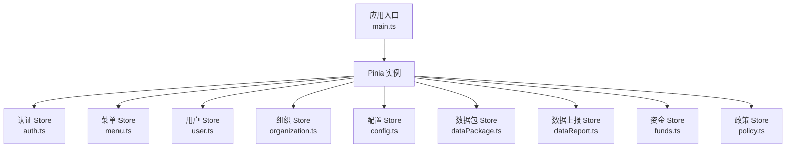
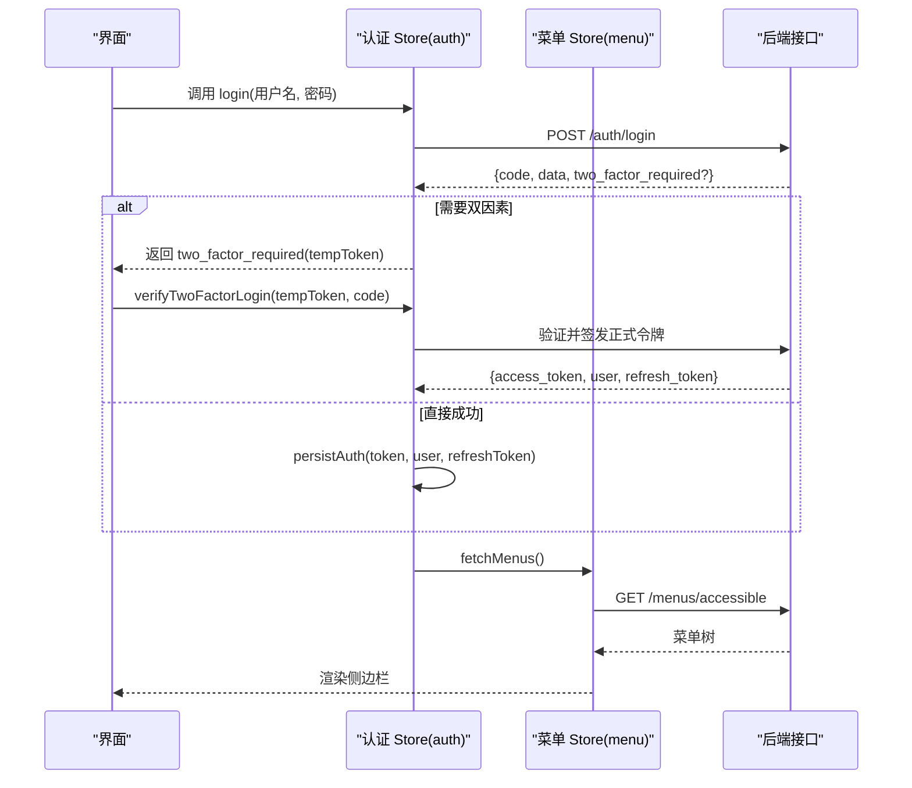
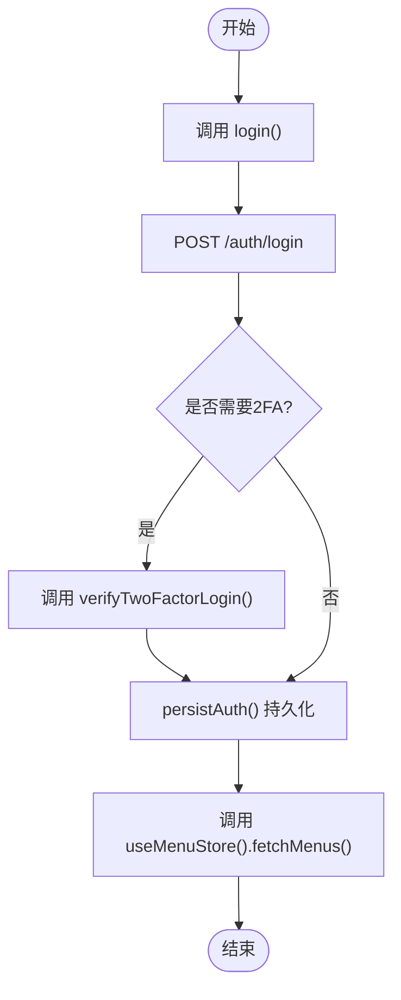
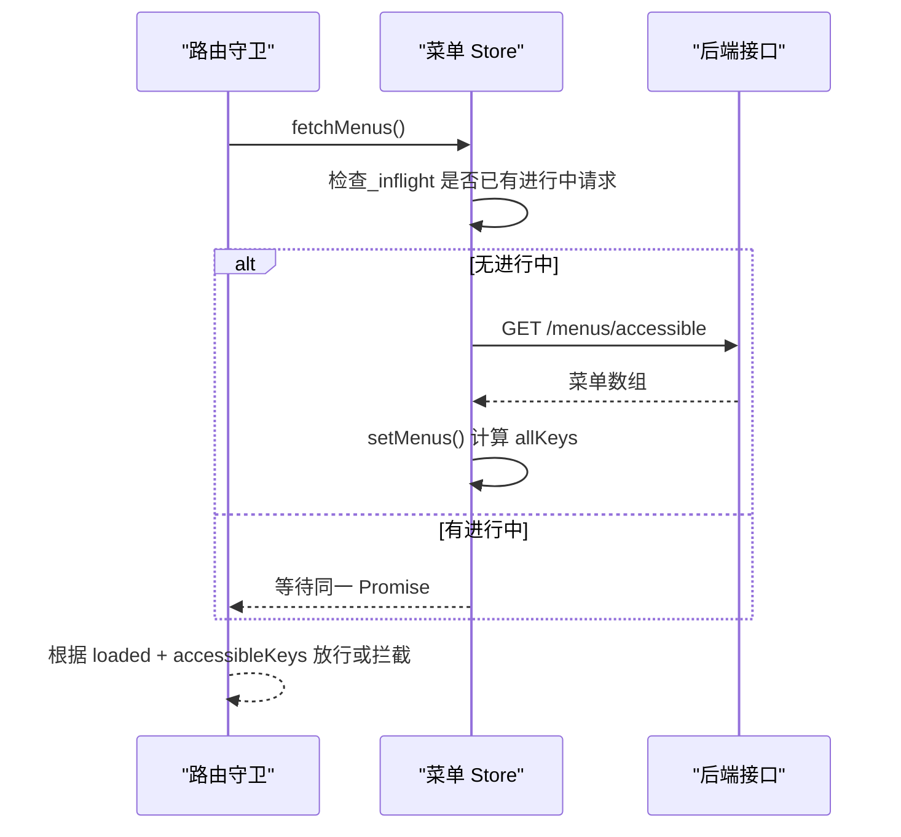
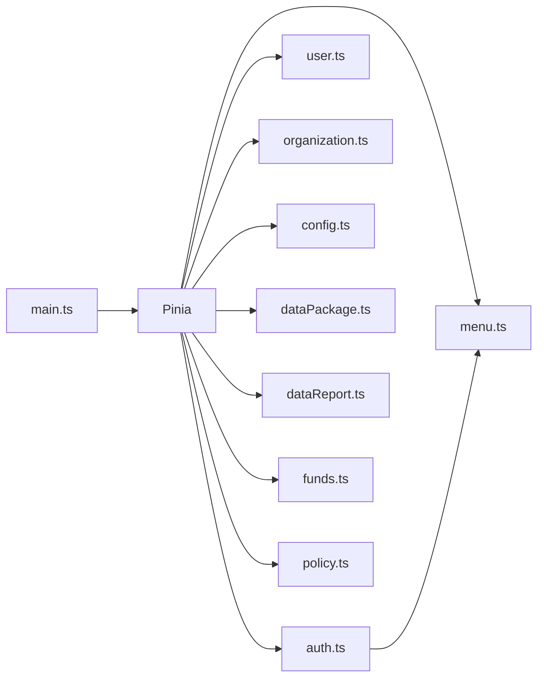

# 状态管理(Pinia)

<cite>
**本文引用的文件**
- [frontend/src/main.ts](file://frontend/src/main.ts)
- [frontend/package.json](file://frontend/package.json)
- [frontend/src/stores/auth.ts](file://frontend/src/stores/auth.ts)
- [frontend/src/stores/menu.ts](file://frontend/src/stores/menu.ts)
- [frontend/src/stores/user.ts](file://frontend/src/stores/user.ts)
- [frontend/src/stores/organization.ts](file://frontend/src/stores/organization.ts)
- [frontend/src/stores/config.ts](file://frontend/src/stores/config.ts)
- [frontend/src/stores/dataPackage.ts](file://frontend/src/stores/dataPackage.ts)
- [frontend/src/stores/dataReport.ts](file://frontend/src/stores/dataReport.ts)
- [frontend/src/stores/funds.ts](file://frontend/src/stores/funds.ts)
- [frontend/src/stores/policy.ts](file://frontend/src/stores/policy.ts)
</cite>

## 目录
1. [简介](#简介)
2. [项目结构](#项目结构)
3. [核心组件](#核心组件)
4. [架构总览](#架构总览)
5. [详细组件分析](#详细组件分析)
6. [依赖关系分析](#依赖关系分析)
7. [性能考虑](#性能考虑)
8. [故障排查指南](#故障排查指南)
9. [结论](#结论)
10. [附录](#附录)

## 简介
本文件围绕前端 Pinia 状态管理，结合 Vue 3 组合式 API 风格，系统阐述 Store 的设计模式与最佳实践。内容覆盖 State、Getters、Actions 的定义与使用，异步操作处理、状态持久化、模块化组织；多 Store 通信机制、状态更新追踪、调试工具使用；并给出复杂业务场景（用户认证、菜单权限、数据上报、资金管理等）的状态管理方案，以及性能优化技巧与常见陷阱规避方法。

## 项目结构
本项目在前端 src/stores 目录下按领域划分多个 Store：
- 认证与会话：auth.ts
- 菜单与模块策略：menu.ts
- 用户资料与列表：user.ts
- 组织架构：organization.ts
- 配置与主题：config.ts
- 数据包导入导出：dataPackage.ts
- 数据上报：dataReport.ts
- 资金管理：funds.ts
- 政策管理：policy.ts

应用入口在 main.ts 中创建并挂载 Pinia 实例，并在启动时应用已记忆的主题以避免首屏闪烁。

图表来源
- [frontend/src/main.ts:8-55](file://frontend/src/main.ts#L8-L55)
- [frontend/src/stores/auth.ts:1-31](file://frontend/src/stores/auth.ts#L1-L31)
- [frontend/src/stores/menu.ts:1-35](file://frontend/src/stores/menu.ts#L1-L35)
- [frontend/src/stores/user.ts:1-20](file://frontend/src/stores/user.ts#L1-L20)
- [frontend/src/stores/organization.ts:1-6](file://frontend/src/stores/organization.ts#L1-L6)
- [frontend/src/stores/config.ts:1-38](file://frontend/src/stores/config.ts#L1-L38)
- [frontend/src/stores/dataPackage.ts:1-18](file://frontend/src/stores/dataPackage.ts#L1-L18)
- [frontend/src/stores/dataReport.ts:1-6](file://frontend/src/stores/dataReport.ts#L1-L6)
- [frontend/src/stores/funds.ts:1-6](file://frontend/src/stores/funds.ts#L1-L6)
- [frontend/src/stores/policy.ts:1-5](file://frontend/src/stores/policy.ts#L1-L5)

章节来源
- [frontend/src/main.ts:8-55](file://frontend/src/main.ts#L8-L55)
- [frontend/package.json:26-39](file://frontend/package.json#L26-L39)

## 核心组件
- 认证与会话 Store（auth.ts）
  - State：token、refreshToken、user、error、mustChangePassword
  - Getters：isAuthenticated、isAdmin、canViewDeleted、modulePermissions
  - Actions：login、verifyTwoFactorLogin、logout、lockSession、unlockSession、fetchUser、getAuthData
  - 职责：登录流程、双因素验证、会话锁屏、权限派生、CSRF 预取、菜单联动加载
- 菜单与模块策略 Store（menu.ts）
  - State：menus、activeMenu、loaded、loading、loadFailed、allKeys、orgPolicies
  - Getters：accessibleKeys
  - Actions：setMenus、setActive、setOrgPolicies、canAccessMenu、canEditModule、isModuleDisabled、fetchMenus、fetchOrgPolicies
  - 职责：可访问菜单树、组织级可见性与编辑策略、防重复请求的并发控制
- 用户 Store（user.ts）
  - State：userList、currentUser、loading、error、total
  - Actions：CRUD、改密、角色分配、头像上传、个人资料获取与更新
- 组织 Store（organization.ts）
  - State：orgs、current、tree、subordinateOrganizations、loading
  - Actions：组织列表、详情、树形结构、子组织、增删改
- 配置 Store（config.ts）
  - State：appName、version、theme
  - Actions：setTheme（同步 localStorage 并应用到 DOM）
- 数据包 Store（dataPackage.ts）
  - State：packages、currentPackage、previewData、importResult、exportResult、loading、exporting、importing、error、total
  - Getters：validatedPackages、importedPackages、failedPackages
  - Actions：导入/导出/预览/确认/下载/删除等
- 数据上报 Store（dataReport.ts）
  - State：reports、currentReport、receivedReports、receivedTotal、loading、error
  - Actions：提交、接收、批准、拒绝、下载、预览
- 资金 Store（funds.ts）
  - State：fundList、current、loading、total
  - Getters：totalFunds、usedFunds、remainFunds
  - Actions：列表、统计概览、审批、增删改
- 政策 Store（policy.ts）
  - State：policyList、current、loading、total、filters
  - Actions：过滤、CRUD

章节来源
- [frontend/src/stores/auth.ts:31-294](file://frontend/src/stores/auth.ts#L31-L294)
- [frontend/src/stores/menu.ts:35-143](file://frontend/src/stores/menu.ts#L35-L143)
- [frontend/src/stores/user.ts:20-215](file://frontend/src/stores/user.ts#L20-L215)
- [frontend/src/stores/organization.ts:6-117](file://frontend/src/stores/organization.ts#L6-L117)
- [frontend/src/stores/config.ts:38-50](file://frontend/src/stores/config.ts#L38-L50)
- [frontend/src/stores/dataPackage.ts:18-263](file://frontend/src/stores/dataPackage.ts#L18-L263)
- [frontend/src/stores/dataReport.ts:6-125](file://frontend/src/stores/dataReport.ts#L6-L125)
- [frontend/src/stores/funds.ts:6-101](file://frontend/src/stores/funds.ts#L6-L101)
- [frontend/src/stores/policy.ts:5-86](file://frontend/src/stores/policy.ts#L5-L86)

## 架构总览
Pinia 作为全局状态容器，各 Store 通过 defineStore 以组合式 API 暴露响应式 state、computed getters 与 async actions。Store 之间通过相互引用实现跨域协作（如 auth 登录后触发 menu 加载）。所有网络请求统一通过封装的请求函数完成，便于拦截器集中处理错误、鉴权与重试。

图表来源
- [frontend/src/stores/auth.ts:171-259](file://frontend/src/stores/auth.ts#L171-L259)
- [frontend/src/stores/menu.ts:93-112](file://frontend/src/stores/menu.ts#L93-L112)

## 详细组件分析

### 认证与会话 Store（auth.ts）
- 设计要点
  - 使用 ref 管理 token、refreshToken、user、error，computed 派生 isAuthenticated、isAdmin、canViewDeleted、modulePermissions
  - 登录成功后持久化到本地存储，并预取 CSRF Token，随后触发菜单加载
  - 支持锁屏/解锁会话，登出时尝试通知服务端吊销刷新令牌
  - 页面刷新时若仅有 token 无 user，自动拉取当前用户信息恢复
- 关键流程
  - 登录：POST /auth/login → 可能进入 2FA 流程 → 成功后 persistAuth → 预取菜单
  - 2FA：verifyLoginTwoFactor → 成功后 persistAuth → 拉取菜单
  - 登出：尝试调用 /auth/logout 清理服务端，再清理本地状态
  - 恢复：fetchUser 从 /users/me 恢复用户信息

图表来源
- [frontend/src/stores/auth.ts:171-259](file://frontend/src/stores/auth.ts#L171-L259)
- [frontend/src/stores/menu.ts:93-112](file://frontend/src/stores/menu.ts#L93-L112)

章节来源
- [frontend/src/stores/auth.ts:31-294](file://frontend/src/stores/auth.ts#L31-L294)

### 菜单与模块策略 Store（menu.ts）
- 设计要点
  - 维护菜单树、活动项、加载状态、失败标记、可访问 key 集合、组织策略映射
  - canAccessMenu 优先依据组织策略 visibility，其次基于 allKeys
  - fetchMenus 内部使用 _inflight 变量保证同一时刻仅发起一次请求，避免守卫竞态
- 关键流程
  - 首次或登录后：fetchMenus → GET /menus/accessible → setMenus → 计算 allKeys
  - 组织策略：fetchOrgPolicies → GET /org-policies/current → setOrgPolicies

图表来源
- [frontend/src/stores/menu.ts:93-112](file://frontend/src/stores/menu.ts#L93-L112)

章节来源
- [frontend/src/stores/menu.ts:35-143](file://frontend/src/stores/menu.ts#L35-L143)

### 用户 Store（user.ts）
- 设计要点
  - 维护用户列表、当前用户、分页总数、加载与错误状态
  - 提供 CRUD、改密、角色分配、头像上传、个人资料获取/更新等方法
  - 兼容多种响应格式（裸对象或信封），提升健壮性
- 典型用法
  - 列表页：fetchUsers(params) → 设置 userList 与 total
  - 详情页：fetchUser(id) → 设置 currentUser
  - 修改后：updateUser/updateUserProfile → 局部合并更新 currentUser

章节来源
- [frontend/src/stores/user.ts:20-215](file://frontend/src/stores/user.ts#L20-L215)

### 组织 Store（organization.ts）
- 设计要点
  - 维护组织列表、当前组织、树形结构、下级组织、加载状态
  - 提供列表、详情、树、子组织、增删改等操作
- 典型用法
  - 初始化：fetchTree / fetchMyOrganization
  - 变更：create/update/delete → 刷新 tree 缓存

章节来源
- [frontend/src/stores/organization.ts:6-117](file://frontend/src/stores/organization.ts#L6-L117)

### 配置 Store（config.ts）
- 设计要点
  - 主题选项与默认值、localStorage 持久化、DOM 属性切换
  - applyThemeToDom 将主题应用到根节点，避免 FOUC
- 典型用法
  - 设置主题：setTheme → 写入 localStorage → 应用 DOM

章节来源
- [frontend/src/stores/config.ts:38-50](file://frontend/src/stores/config.ts#L38-L50)
- [frontend/src/main.ts:39-41](file://frontend/src/main.ts#L39-L41)

### 数据包 Store（dataPackage.ts）
- 设计要点
  - 维护数据包列表、当前包、预览数据、导入/导出结果、加载与错误状态
  - computed 派生不同状态的包集合，便于筛选展示
  - 导入成功后将新包加入列表，确认导入后更新状态
- 典型用法
  - 导入：importPackage → 校验通过后入队
  - 预览：previewPackage → 填充 previewData
  - 下载：downloadPackage → 生成临时链接触发下载

章节来源
- [frontend/src/stores/dataPackage.ts:18-263](file://frontend/src/stores/dataPackage.ts#L18-L263)

### 数据上报 Store（dataReport.ts）
- 设计要点
  - 维护上报列表、接收列表、加载与错误状态
  - 提供提交、接收、批准、拒绝、下载、预览等操作
- 典型用法
  - 列表：fetchReceivedReports / fetchReports → 解析 items/total
  - 审批流：receiveReport / rejectReport → 更新后端状态

章节来源
- [frontend/src/stores/dataReport.ts:6-125](file://frontend/src/stores/dataReport.ts#L6-L125)

### 资金 Store（funds.ts）
- 设计要点
  - 维护经费列表、当前项、加载与总数
  - computed 派生总额、已用额、剩余额
  - 提供统计概览、审批、增删改
- 典型用法
  - 列表：fetchFunds → unwrapList 解析
  - 审批：approveFund → 局部更新状态

章节来源
- [frontend/src/stores/funds.ts:6-101](file://frontend/src/stores/funds.ts#L6-L101)

### 政策 Store（policy.ts）
- 设计要点
  - 维护政策列表、当前项、加载与总数、过滤器
  - 提供过滤、CRUD 操作
- 典型用法
  - 列表：fetchPolicies → 合并 filters 与 params
  - 变更：create/update/delete → 局部更新列表与总数

章节来源
- [frontend/src/stores/policy.ts:5-86](file://frontend/src/stores/policy.ts#L5-L86)

## 依赖关系分析
- 应用层依赖
  - main.ts 创建并注册 Pinia 实例，安装路由与指令，应用主题
  - package.json 声明 pinia 与 vue 版本，确保运行时兼容
- Store 间依赖
  - auth.ts 依赖 menu.ts 进行登录后菜单预加载
  - 其他 Store 相对独立，通过统一的 api/request 封装进行网络交互
- 外部依赖
  - Element Plus 命令式消息样式在 main.ts 显式引入，避免按需导入缺失样式
  - 主题应用依赖 config.ts 提供的 applyThemeToDom

图表来源
- [frontend/src/main.ts:8-55](file://frontend/src/main.ts#L8-L55)
- [frontend/src/stores/auth.ts:1-31](file://frontend/src/stores/auth.ts#L1-L31)
- [frontend/src/stores/menu.ts:1-35](file://frontend/src/stores/menu.ts#L1-L35)

章节来源
- [frontend/src/main.ts:8-55](file://frontend/src/main.ts#L8-L55)
- [frontend/package.json:26-39](file://frontend/package.json#L26-L39)

## 性能考虑
- 减少重复请求
  - 菜单加载使用 _inflight 共享 Promise，避免守卫与登录后并发重复请求
- 合理拆分 Store
  - 按领域划分 Store，降低单 Store 臃肿，提高复用性与可测试性
- 计算属性派生
  - 使用 computed 派生只读视图（如权限映射、金额汇总），避免模板内重复计算
- 列表与分页
  - 使用 unwrapList 统一解析后端列表响应，减少分支判断
- 主题与首屏
  - 在应用启动前应用主题，避免 FOUC
- 资源释放
  - 下载完成后及时撤销 URL 对象，避免内存泄漏

[本节为通用指导，不直接分析具体文件]

## 故障排查指南
- 登录失败或 2FA 失败
  - 检查 auth.ts 的错误字段赋值与返回结构，确认后端返回码与 message
  - 确认网络超时与拦截器是否正确处理 401/403
- 菜单不可见或权限异常
  - 检查 menu.ts 的 loaded 与 loadFailed 状态，确认 fetchMenus 是否成功
  - 核对 orgPolicies 的 visibility 与 edit_mode 是否限制了模块
- 用户信息丢失
  - 页面刷新后若只有 token 无 user，确认 fetchUser 是否能正常拉取 /users/me
- 主题未生效
  - 检查 config.ts 的 setTheme 与 main.ts 的 applyThemeToDom 调用时机
- 数据包导入/导出失败
  - 查看 dataPackage.ts 的 error 字段与 loading/exporting/importing 状态
  - 确认后端返回结构与 unwrapList 的兼容性

章节来源
- [frontend/src/stores/auth.ts:171-259](file://frontend/src/stores/auth.ts#L171-L259)
- [frontend/src/stores/menu.ts:93-112](file://frontend/src/stores/menu.ts#L93-L112)
- [frontend/src/stores/user.ts:161-171](file://frontend/src/stores/user.ts#L161-L171)
- [frontend/src/stores/config.ts:38-50](file://frontend/src/stores/config.ts#L38-L50)
- [frontend/src/stores/dataPackage.ts:78-118](file://frontend/src/stores/dataPackage.ts#L78-L118)

## 结论
本项目采用 Pinia 的组合式 API 风格，按领域拆分 Store，清晰分离状态、计算与副作用。认证、菜单、用户、组织、配置、数据包、数据上报、资金、政策等模块各司其职，并通过统一的请求封装与路由守卫协同工作。通过 computed 派生、请求去重、主题预应用等手段保障性能与体验。建议继续遵循现有模式，保持 Store 粒度与职责单一，持续完善错误处理与可观测性。

[本节为总结性内容，不直接分析具体文件]

## 附录
- 多 Store 通信机制
  - 通过 import 其他 Store 并使用其方法（如 auth 调用 menu.fetchMenus）
  - 利用 computed 派生跨 Store 的视图数据（如 modulePermissions）
- 状态更新追踪
  - 借助浏览器 DevTools 的 Pinia 插件观察状态变化与 Action 调用栈
- 调试工具使用
  - 在开发环境启用 Pinia Devtools，配合日志输出定位问题
- 复杂业务场景方案
  - 用户认证：auth.ts 负责登录、2FA、会话锁屏与用户恢复
  - 菜单权限：menu.ts 负责可访问菜单与组织策略控制
  - 业务数据缓存：各 Store 通过本地 ref 缓存列表与详情，必要时刷新

[本节为概念性内容，不直接分析具体文件]