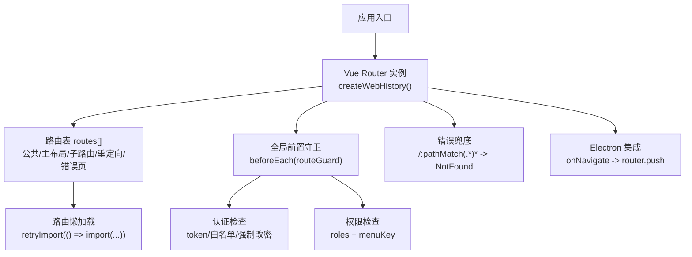
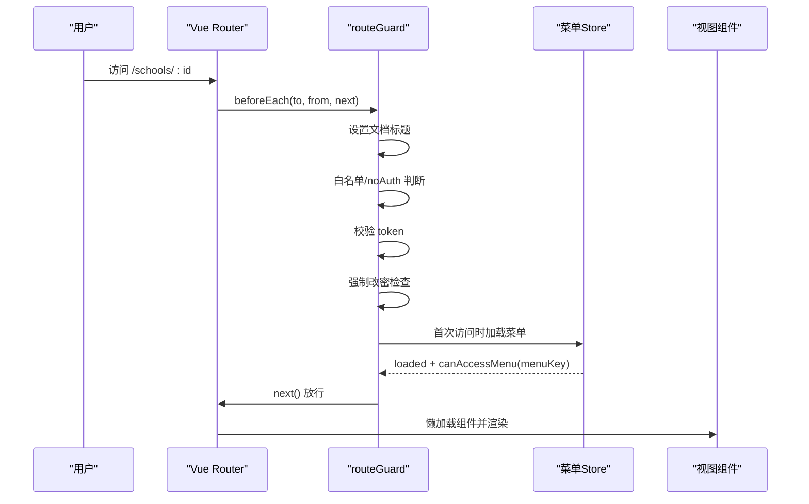
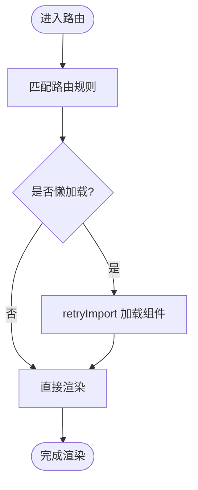
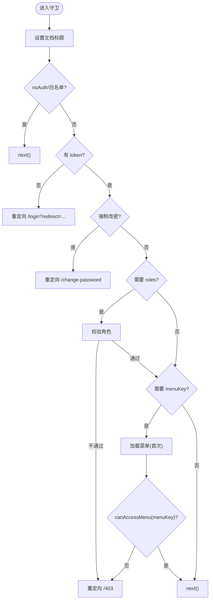
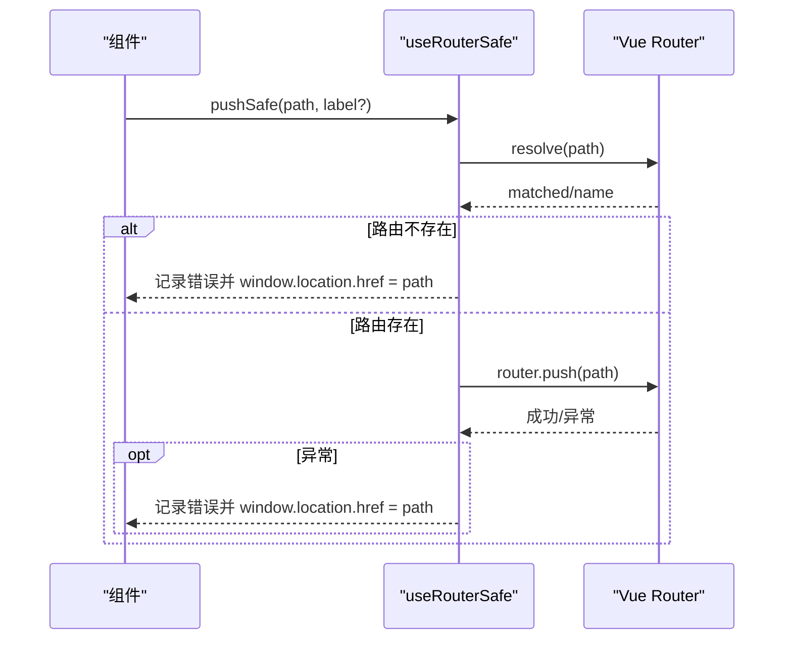
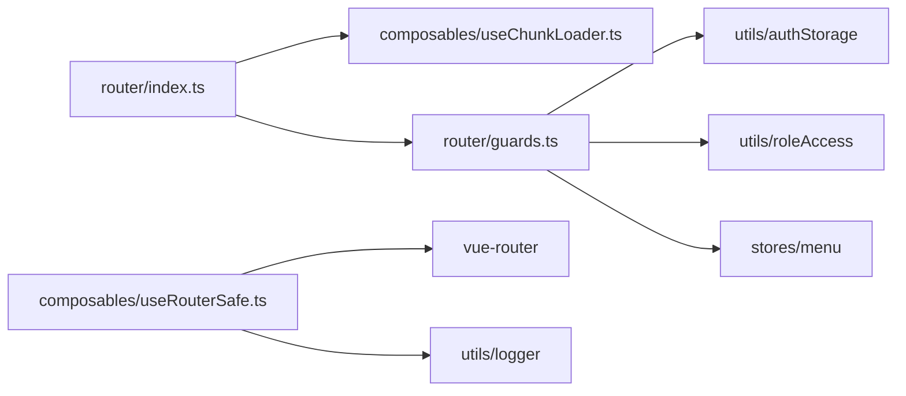

# 路由与导航

<cite>
**本文引用的文件**
- [frontend/src/router/index.ts](file://frontend/src/router/index.ts)
- [frontend/src/router/guards.ts](file://frontend/src/router/guards.ts)
- [frontend/src/composables/useRouterSafe.ts](file://frontend/src/composables/useRouterSafe.ts)
- [frontend/src/composables/useChunkLoader.ts](file://frontend/src/composables/useChunkLoader.ts)
</cite>

## 目录
1. [简介](#简介)
2. [项目结构](#项目结构)
3. [核心组件](#核心组件)
4. [架构总览](#架构总览)
5. [详细组件分析](#详细组件分析)
6. [依赖关系分析](#依赖关系分析)
7. [性能考虑](#性能考虑)
8. [故障排查指南](#故障排查指南)
9. [结论](#结论)
10. [附录](#附录)

## 简介
本章节面向前端路由与导航，围绕 Vue Router 的配置与使用展开，覆盖动态路由、嵌套路由、路由参数传递、路由守卫（权限控制、登录验证、数据预加载）、编程式导航、路由懒加载、路由元信息使用，以及 useRouterSafe 组合式函数在解决导航失败问题上的实践。同时给出路由性能优化、SEO 友好配置建议与移动端适配方案，并通过实际业务场景展示路由设计最佳实践。

## 项目结构
本项目的前端路由集中在 frontend/src/router 目录下：
- index.ts：集中定义所有路由表、历史模式、全局前置守卫、错误兜底与 Electron 集成。
- guards.ts：实现认证、强制改密、角色与菜单权限等路由守卫逻辑。
- composables/useChunkLoader.ts：提供重试导入能力，配合路由懒加载提升首屏与稳定性。
- composables/useRouterSafe.ts：封装安全跳转与参数解析，避免无效参数导致的异常请求或跳转失败。

图表来源
- [frontend/src/router/index.ts:881-915](file://frontend/src/router/index.ts#L881-L915)
- [frontend/src/router/guards.ts:13-85](file://frontend/src/router/guards.ts#L13-L85)

章节来源
- [frontend/src/router/index.ts:1-916](file://frontend/src/router/index.ts#L1-L916)
- [frontend/src/router/guards.ts:1-88](file://frontend/src/router/guards.ts#L1-L88)

## 核心组件
- 路由表与懒加载：通过 retryImport 包裹动态 import，实现按需加载与重试机制，降低首屏体积并提高容错性。
- 路由守卫：统一处理文档标题、白名单放行、登录态校验、强制改密限制、角色与菜单权限校验。
- 安全导航：useRouterSafe 提供 pushSafe 方法，包含路由存在性校验、异常捕获与回退到原生跳转的兜底策略；safeRouteParam 用于将路由参数安全转换为数字，避免 NaN 导致 API 异常。
- 历史模式与错误页：采用 createWebHistory，提供 403/500/404 等错误页面，并对 undefined/null 路径进行拦截与重定向。

章节来源
- [frontend/src/router/index.ts:1-916](file://frontend/src/router/index.ts#L1-L916)
- [frontend/src/router/guards.ts:1-88](file://frontend/src/router/guards.ts#L1-L88)
- [frontend/src/composables/useRouterSafe.ts:1-75](file://frontend/src/composables/useRouterSafe.ts#L1-L75)
- [frontend/src/composables/useChunkLoader.ts](file://frontend/src/composables/useChunkLoader.ts)

## 架构总览
下图展示了从用户访问到页面渲染的关键流程，包括路由匹配、懒加载、守卫校验与权限判断。

图表来源
- [frontend/src/router/guards.ts:13-85](file://frontend/src/router/guards.ts#L13-L85)
- [frontend/src/router/index.ts:881-915](file://frontend/src/router/index.ts#L881-L915)

## 详细组件分析

### 路由表与懒加载
- 公共路由：登录、注册、忘记密码、获取机器码、修改密码等，均标记 noAuth，允许未登录访问。
- 主布局与嵌套路由：以根路径为壳，挂载工作台、学校、项目、资金、政策、审批、数据中心、系统管理等模块的子路由，形成清晰的层级结构。
- 动态路由：如 /schools/:id、/projects/:id、/funds/lifecycle/:projectId 等，支持通过 params 传递标识。
- 路由懒加载：大量使用 retryImport(() => import(...))，结合重试机制提升稳定性。
- 重定向：旧路径到新路径的统一重定向，保证兼容性。
- 错误页：403/500/NotFound，确保异常体验可控。

图表来源
- [frontend/src/router/index.ts:6-879](file://frontend/src/router/index.ts#L6-L879)

章节来源
- [frontend/src/router/index.ts:6-879](file://frontend/src/router/index.ts#L6-L879)

### 路由守卫：认证、权限与数据预加载
- 文档标题：根据 meta.title 设置，提升 SEO 与用户体验。
- 白名单与 noAuth：对公开路由直接放行。
- 登录态校验：未登录时重定向至 /login?redirect=...，已登录访问登录页时自动跳转到工作台（锁屏状态除外）。
- 强制改密：must_change_password=true 时仅允许访问改密相关页面。
- 角色权限：meta.roles 非空时校验用户角色，不满足则跳转 /403。
- 菜单权限：首次访问时加载菜单，基于 menuKey 判断可见性；若菜单加载失败，不阻断导航，由后端接口兜底真实权限。
- 数据预加载：可在守卫中根据 to.meta 触发数据预取（例如根据路由参数拉取详情），再放行 next()。

图表来源
- [frontend/src/router/guards.ts:13-85](file://frontend/src/router/guards.ts#L13-L85)

章节来源
- [frontend/src/router/guards.ts:13-85](file://frontend/src/router/guards.ts#L13-L85)

### 编程式导航与安全跳转
- useRouterSafe 提供的 pushSafe：
  - 目标路由存在性校验：resolve 后若为 NotFound 或未匹配，记录错误并尝试 window.location.href 作为兜底。
  - 异常捕获：router.push 抛错时记录日志并回退到原生跳转。
  - 调试标签：开发环境可输出 debug 日志便于定位。
- safeRouteParam：
  - 将路由参数安全转换为数字，避免 undefined/null/NaN 导致 API 请求出现非法路径。

图表来源
- [frontend/src/composables/useRouterSafe.ts:29-73](file://frontend/src/composables/useRouterSafe.ts#L29-L73)

章节来源
- [frontend/src/composables/useRouterSafe.ts:1-75](file://frontend/src/composables/useRouterSafe.ts#L1-L75)

### 动态路由与参数传递
- 动态段：如 /schools/:id、/projects/:id、/funds/lifecycle/:projectId 等，通过 params 传递实体标识。
- 参数安全：使用 safeRouteParam 将 params.id 转为数字，避免 NaN 导致 API 异常。
- 兼容重定向：旧版 /villages/:id 等路径统一重定向到新版 /supported-villages/:id，保持书签与外链可用。

章节来源
- [frontend/src/router/index.ts:79-254](file://frontend/src/router/index.ts#L79-L254)
- [frontend/src/composables/useRouterSafe.ts:17-23](file://frontend/src/composables/useRouterSafe.ts#L17-L23)

### 嵌套路由与布局
- 根路径下挂载 DefaultLayoutSafe 作为主布局，内部包含多个业务模块的子路由，形成清晰的父子层级。
- 子路由通过 children 组织，便于侧边栏与面包屑生成。

章节来源
- [frontend/src/router/index.ts:49-858](file://frontend/src/router/index.ts#L49-L858)

### 路由元信息与权限
- meta.title：用于文档标题与 SEO。
- meta.noAuth：标记无需鉴权的路由。
- meta.roles：声明所需角色，守卫中进行角色校验。
- meta.menuKey：与菜单权限联动，控制菜单可见性与导航权限。

章节来源
- [frontend/src/router/index.ts:6-879](file://frontend/src/router/index.ts#L6-L879)
- [frontend/src/router/guards.ts:54-80](file://frontend/src/router/guards.ts#L54-L80)

### Electron 集成
- 监听主进程发送的 onNavigate 事件，将字符串路径交给 router.push 进行导航，增强桌面端交互能力。

章节来源
- [frontend/src/router/index.ts:906-913](file://frontend/src/router/index.ts#L906-L913)

## 依赖关系分析
- 路由表依赖懒加载工具 retryImport，实现组件级按需加载与重试。
- 守卫依赖 AuthStorage、roleAccess、menuStore，完成认证、角色与菜单权限校验。
- 安全导航依赖 vue-router 与 logger，提供健壮的错误处理与调试能力。

图表来源
- [frontend/src/router/index.ts:1-916](file://frontend/src/router/index.ts#L1-L916)
- [frontend/src/router/guards.ts:1-88](file://frontend/src/router/guards.ts#L1-L88)
- [frontend/src/composables/useRouterSafe.ts:1-75](file://frontend/src/composables/useRouterSafe.ts#L1-L75)

章节来源
- [frontend/src/router/index.ts:1-916](file://frontend/src/router/index.ts#L1-L916)
- [frontend/src/router/guards.ts:1-88](file://frontend/src/router/guards.ts#L1-L88)
- [frontend/src/composables/useRouterSafe.ts:1-75](file://frontend/src/composables/useRouterSafe.ts#L1-L75)

## 性能考虑
- 路由懒加载：通过 retryImport 包裹动态 import，减少首屏包体并提升加载速度。
- 菜单权限缓存：首次访问时加载菜单，后续基于 store 判断，避免重复请求。
- 错误兜底：对 undefined/null 路径进行拦截并重定向，减少无效请求与渲染开销。
- 历史模式：使用 createWebHistory，利于 SEO 与分享链接。
- 建议：
  - 对大型页面进一步拆分路由，按功能域划分模块。
  - 对高频访问的页面可考虑预加载关键资源。
  - 结合服务端缓存与 CDN 加速静态资源。

[本节为通用指导，不直接分析具体文件]

## 故障排查指南
- 导航失败：
  - 使用 useRouterSafe 的 pushSafe，查看控制台错误日志，必要时回退到 window.location.href。
  - 检查目标路由是否在路由表中注册，避免跳转到 NotFound。
- 参数异常：
  - 使用 safeRouteParam 转换路由参数，避免 NaN 导致 API 请求异常。
- 权限问题：
  - 检查 meta.roles 与用户角色是否匹配。
  - 检查 meta.menuKey 是否在菜单中可见；若菜单加载失败，确认后端接口可用性。
- 强制改密：
  - must_change_password=true 时仅允许访问改密相关页面，需引导用户完成改密。
- 历史兼容：
  - 旧路径重定向到新路径，确保书签与外链正常跳转。

章节来源
- [frontend/src/composables/useRouterSafe.ts:29-73](file://frontend/src/composables/useRouterSafe.ts#L29-L73)
- [frontend/src/router/guards.ts:22-80](file://frontend/src/router/guards.ts#L22-L80)
- [frontend/src/router/index.ts:886-904](file://frontend/src/router/index.ts#L886-L904)

## 结论
本项目通过集中式路由表、懒加载与重试机制、完善的路由守卫与安全导航，构建了稳定高效的前端路由体系。结合 meta 元信息实现灵活的权限控制与 SEO 友好配置，并通过 useRouterSafe 提升导航鲁棒性。建议在后续迭代中继续细化模块路由拆分、加强性能监控与错误埋点，进一步提升用户体验与可维护性。

[本节为总结性内容，不直接分析具体文件]

## 附录
- 最佳实践示例（业务场景）：
  - 学校详情页：动态路由 /schools/:id，使用 safeRouteParam 解析 id，守卫中根据 menuKey 控制可见性，懒加载 Detail 组件。
  - 经费生命周期：/funds/lifecycle/:projectId，登录后根据角色与菜单权限访问，必要时在守卫中预加载项目数据。
  - 旧路径兼容：/villages/:id 重定向到 /supported-villages/:id，保证历史链接可用。

[本节为概念性说明，不直接分析具体文件]