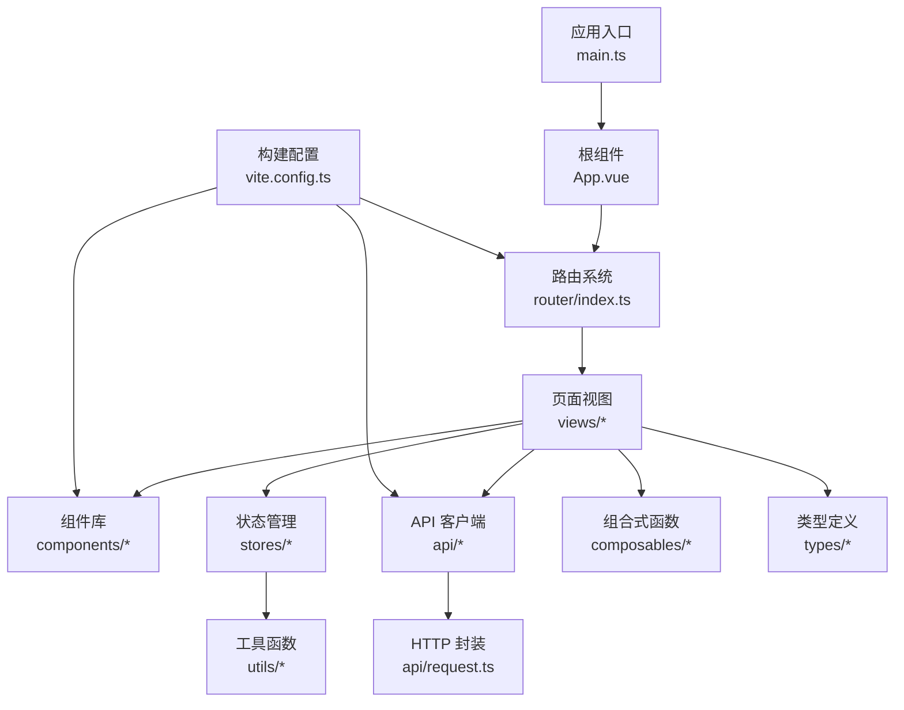
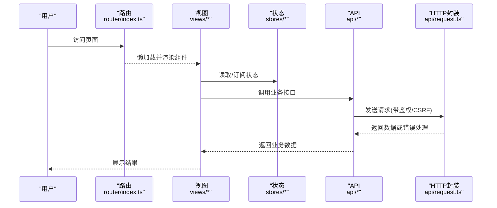
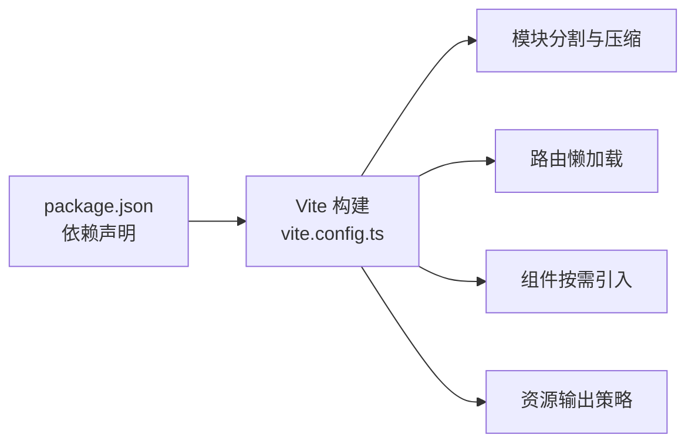

# 项目结构说明

<cite>
**本文引用的文件**
- [frontend/src/main.ts](file://frontend/src/main.ts)
- [frontend/vite.config.ts](file://frontend/vite.config.ts)
- [frontend/package.json](file://frontend/package.json)
- [frontend/src/App.vue](file://frontend/src/App.vue)
- [frontend/src/router/index.ts](file://frontend/src/router/index.ts)
- [frontend/src/stores/auth.ts](file://frontend/src/stores/auth.ts)
- [frontend/src/api/request.ts](file://frontend/src/api/request.ts)
</cite>

## 目录
1. [简介](#简介)
2. [项目结构](#项目结构)
3. [核心组件](#核心组件)
4. [架构总览](#架构总览)
5. [详细组件分析](#详细组件分析)
6. [依赖关系分析](#依赖关系分析)
7. [性能考量](#性能考量)
8. [故障排查指南](#故障排查指南)
9. [结论](#结论)
10. [附录](#附录)

## 简介
本说明聚焦前端项目的目录组织与模块职责，覆盖 src 下各子目录（api、components、views、stores、router、composables、utils、types）的职责划分、命名规范、导入导出约定、资源管理策略，以及新增模块的最佳实践与代码组织模式。同时结合构建配置与入口文件，给出可操作的落地建议。

## 项目结构
前端基于 Vite + Vue 3 + TypeScript，采用模块化分层：
- api：API 客户端层，封装 HTTP 请求、鉴权、错误处理、下载等能力，并按业务域拆分文件。
- components：组件库层，包含通用组件、业务组件、布局组件等，支持自动按需注册。
- views：页面视图层，按业务域分目录组织路由级页面。
- stores：状态管理层，使用 Pinia 管理认证、菜单、业务数据等全局状态。
- router：路由配置层，集中定义路由、懒加载、守卫与元信息。
- composables：组合式函数层，封装跨组件复用的逻辑（如上传头、版本检查、键盘快捷键等）。
- utils：工具函数层，提供日志、错误处理、存储、图表主题、脱敏等通用能力。
- types：类型定义层，统一 API 响应、领域模型等 TypeScript 类型。

图示来源
- [frontend/src/main.ts:1-69](file://frontend/src/main.ts#L1-L69)
- [frontend/src/App.vue:1-109](file://frontend/src/App.vue#L1-L109)
- [frontend/src/router/index.ts:1-800](file://frontend/src/router/index.ts#L1-L800)
- [frontend/vite.config.ts:1-472](file://frontend/vite.config.ts#L1-L472)

章节来源
- [frontend/src/main.ts:1-69](file://frontend/src/main.ts#L1-L69)
- [frontend/vite.config.ts:1-472](file://frontend/vite.config.ts#L1-L472)
- [frontend/package.json:1-73](file://frontend/package.json#L1-L73)

## 核心组件
- 应用入口 main.ts
  - 创建 Vue 应用实例，挂载 Pinia、Router，安装全局指令（权限、水印），注入全局样式与主题，设置 ElMessage 默认行为，并启动全局错误处理。
- 根组件 App.vue
  - 提供 Element Plus 全局配置（语言、尺寸），实现错误边界捕获与恢复，路由切换时清理错误状态。
- 路由 index.ts
  - 集中声明所有路由，使用懒加载与重试导入，通过 meta 描述标题、菜单键、角色限制等；提供旧路径重定向与功能整合。
- 状态 auth.ts
  - 管理登录态、用户信息、权限映射、会话锁定/解锁、2FA 流程、菜单预取等。
- HTTP 封装 request.ts
  - Axios 实例化、拦截器（请求/响应）、CSRF Token 管理、401 刷新与排队、离线回退、错误提示策略、下载与文件名解析、取消与超时控制等。

章节来源
- [frontend/src/main.ts:1-69](file://frontend/src/main.ts#L1-L69)
- [frontend/src/App.vue:1-109](file://frontend/src/App.vue#L1-L109)
- [frontend/src/router/index.ts:1-800](file://frontend/src/router/index.ts#L1-L800)
- [frontend/src/stores/auth.ts:1-295](file://frontend/src/stores/auth.ts#L1-L295)
- [frontend/src/api/request.ts:1-746](file://frontend/src/api/request.ts#L1-L746)

## 架构总览
前端以“视图驱动”的 SPA 架构运行：
- 入口初始化应用、插件与全局样式后，进入路由系统。
- 路由根据 meta 与守卫决定页面渲染，页面通过 stores 获取/更新状态，调用 api 层发起网络请求。
- 构建层通过 Vite 进行代码分割、按需引入、压缩与资源优化。

图示来源
- [frontend/src/router/index.ts:1-800](file://frontend/src/router/index.ts#L1-L800)
- [frontend/src/stores/auth.ts:1-295](file://frontend/src/stores/auth.ts#L1-L295)
- [frontend/src/api/request.ts:1-746](file://frontend/src/api/request.ts#L1-L470)

## 详细组件分析

### API 客户端层（api）
- 职责
  - 按业务域拆分文件（如 funds.ts、projects.ts、auth 相关等），对外暴露 get/post/patch/del 等便捷方法或直接封装业务接口。
  - 复用统一的 HTTP 封装（request.ts），确保鉴权、CSRF、错误处理、下载、取消等一致。
- 命名规范
  - 文件以小写下划线或驼峰命名，按业务域划分；测试文件置于同级 __tests__ 目录。
- 导入导出约定
  - 优先使用相对路径导入同模块内工具；跨模块使用 @ 别名；避免循环依赖。
- 最佳实践
  - 对复杂响应做类型标注；对需要静默失败的请求使用 silent 配置；对大文件下载使用 downloadBlob/parseContentDisposition。

章节来源
- [frontend/src/api/request.ts:1-746](file://frontend/src/api/request.ts#L1-L746)

### 组件库层（components）
- 职责
  - 通用 UI 组件（common）、业务组件（business）、布局组件（layout）、地图/资金等垂直领域组件。
- 命名规范
  - 组件文件使用 PascalCase；目录按领域划分；公共组件尽量无副作用、纯展示与事件派发。
- 导入导出约定
  - 通过 unplugin-vue-components 自动注册，无需手动 import；如需命令式 API（如 ElMessage），显式引入。
- 最佳实践
  - 保持组件粒度小、职责单一；样式使用 scoped 或 CSS 变量；避免在组件中直接操作全局状态，通过 props/events 或 composables 解耦。

章节来源
- [frontend/vite.config.ts:101-131](file://frontend/vite.config.ts#L101-L131)
- [frontend/src/main.ts:16-22](file://frontend/src/main.ts#L16-L22)

### 页面视图层（views）
- 职责
  - 按业务域组织页面（如 funds、projects、system、data-analysis 等），负责页面级状态编排与交互。
- 命名规范
  - 目录使用小写短横线或驼峰；页面文件使用语义化名称（List.vue、Detail.vue、Edit.vue）。
- 导入导出约定
  - 通过路由懒加载引入；使用 composables 抽取复用逻辑；通过 stores 管理状态；通过 api 层发起请求。
- 最佳实践
  - 页面内仅保留必要状态；复杂表单/列表逻辑下沉到 composables；使用路由 meta 控制标题与权限。

章节来源
- [frontend/src/router/index.ts:1-800](file://frontend/src/router/index.ts#L1-L800)

### 状态管理层（stores）
- 职责
  - 使用 Pinia 管理认证、菜单、业务数据等全局状态；提供持久化、计算属性、异步动作。
- 命名规范
  - 每个 store 对应一个业务域；导出 useXxxStore 工厂函数。
- 导入导出约定
  - 通过 defineStore 定义；在组件中使用 setup 语法调用；避免在 store 中直接操作 DOM。
- 最佳实践
  - 将易变且跨组件共享的数据放入 store；将一次性或局部状态留在组件内；对敏感数据使用安全存储。

章节来源
- [frontend/src/stores/auth.ts:1-295](file://frontend/src/stores/auth.ts#L1-L295)

### 路由配置层（router）
- 职责
  - 集中定义路由表、懒加载、元信息（title、menuKey、roles）、旧路径重定向与功能整合。
- 命名规范
  - 路由 name 使用 PascalCase；path 使用小写短横线；meta 字段保持一致性。
- 导入导出约定
  - 使用 retryImport 包裹动态 import，提升加载稳定性；通过 @ 别名引用视图。
- 最佳实践
  - 将权限判断放在守卫中；将页面标题与菜单键集中在 meta；避免在路由文件中放置业务逻辑。

章节来源
- [frontend/src/router/index.ts:1-800](file://frontend/src/router/index.ts#L1-L800)

### 组合式函数层（composables）
- 职责
  - 封装跨组件复用的逻辑，如自动锁屏、备份计划、分块加载、去抖/防抖、键盘快捷键、路由安全跳转、版本检查等。
- 命名规范
  - 文件以 useXxx.ts 命名；导出函数名与文件名一致。
- 导入导出约定
  - 通过相对路径导入；避免引入重型依赖；必要时提供可选参数与默认值。
- 最佳实践
  - 保持函数幂等与可测试；对副作用进行隔离；为复杂逻辑提供单元测试。

章节来源
- [frontend/src/composables/useVersionCheck.ts](file://frontend/src/composables/useVersionCheck.ts)
- [frontend/src/composables/useChunkLoader.ts](file://frontend/src/composables/useChunkLoader.ts)

### 工具函数层（utils）
- 职责
  - 提供日志、错误处理、存储、脱敏、图表主题、导出、时间处理等通用能力。
- 命名规范
  - 文件以小写下划线或驼峰命名；导出具名函数；避免隐式全局。
- 导入导出约定
  - 通过 @ 别名导入；避免在 utils 中引入业务逻辑；保持无副作用。
- 最佳实践
  - 对输入进行校验；对异常进行兜底；对耗时操作提供超时与取消机制。

章节来源
- [frontend/src/utils/errorHandler.ts](file://frontend/src/utils/errorHandler.ts)
- [frontend/src/utils/logger.ts](file://frontend/src/utils/logger.ts)
- [frontend/src/utils/authStorage.ts](file://frontend/src/utils/authStorage.ts)

### 类型定义层（types）
- 职责
  - 统一 API 响应、领域模型、枚举等类型，保证前后端契约一致性。
- 命名规范
  - 文件按领域划分；类型使用 PascalCase；枚举使用大写常量。
- 导入导出约定
  - 通过 @ 别名导入；避免循环依赖；在 api 层与 stores 中复用。
- 最佳实践
  - 类型变更需同步文档与测试；对后端字段变更使用兼容处理。

章节来源
- [frontend/src/types/api.ts](file://frontend/src/types/api.ts)
- [frontend/src/types/analytics.ts](file://frontend/src/types/analytics.ts)

## 依赖关系分析
- 运行时依赖
  - Vue、Vue Router、Pinia、Element Plus、Axios、ECharts、Chart.js、Day.js、DOMPurify 等。
- 开发依赖
  - Vite、TypeScript、ESLint、Prettier、Vitest、Playwright、unplugin-auto-import、unplugin-vue-components 等。
- 构建优化
  - 代码分割（vue-core、vue-router、pinia、echarts、xlsx、vendor 等）、Gzip/Brotli 压缩、CSS 代码分割、资源分类输出、预构建优化。

图示来源
- [frontend/package.json:26-67](file://frontend/package.json#L26-L67)
- [frontend/vite.config.ts:286-410](file://frontend/vite.config.ts#L286-L410)

章节来源
- [frontend/package.json:1-73](file://frontend/package.json#L1-L73)
- [frontend/vite.config.ts:1-472](file://frontend/vite.config.ts#L1-L472)

## 性能考量
- 首屏优化
  - 路由懒加载与重试导入；第三方库独立 chunk（echarts、xlsx、chartjs、driver、sortable）；Element Plus 按需引入。
- 网络优化
  - 生产环境启用 Gzip/Brotli；请求去重（GET）；401 刷新排队；CSRF 懒加载与重试；离线回退。
- 资源优化
  - CSS 代码分割；静态资源按类型输出；小资源内联；禁用不必要的 source map。
- 构建优化
  - Terser 移除 console/debugger；目标 es2020；预构建常用依赖；抑制无关警告。

章节来源
- [frontend/vite.config.ts:133-153](file://frontend/vite.config.ts#L133-L153)
- [frontend/vite.config.ts:211-265](file://frontend/vite.config.ts#L211-L265)
- [frontend/vite.config.ts:286-410](file://frontend/vite.config.ts#L286-L410)
- [frontend/src/api/request.ts:172-203](file://frontend/src/api/request.ts#L172-L203)
- [frontend/src/api/request.ts:342-449](file://frontend/src/api/request.ts#L342-L449)

## 故障排查指南
- 401 登录过期
  - 现象：多次 401 导致重复提示或无限刷新。
  - 处理：统一走 _handleSessionExpired，先关闭历史提示，延迟跳转；refresh 失败则清理状态并跳转。
- CSRF 校验失败
  - 现象：POST/PUT/DELETE/PATCH 报 403。
  - 处理：自动重试一次，重新获取 CSRF token 并重发；若仍失败，提示用户重试。
- 网络异常
  - 现象：断网或服务重启。
  - 处理：尝试离线 Mock；否则延迟重试一次；最终提示网络连接失败。
- 组件错误白屏
  - 现象：某页面崩溃导致白屏。
  - 处理：App.vue 错误边界捕获并显示重试按钮；路由切换时清除错误状态。

章节来源
- [frontend/src/api/request.ts:85-101](file://frontend/src/api/request.ts#L85-L101)
- [frontend/src/api/request.ts:451-469](file://frontend/src/api/request.ts#L451-L469)
- [frontend/src/api/request.ts:474-494](file://frontend/src/api/request.ts#L474-L494)
- [frontend/src/App.vue:44-55](file://frontend/src/App.vue#L44-L55)

## 结论
本项目采用清晰的分层与模块化组织，配合 Vite 的构建优化与完善的 HTTP 封装，实现了高内聚、低耦合的前端架构。遵循本文的命名规范、导入导出约定与资源管理策略，可有效提升可维护性与扩展性。新增模块时，建议按业务域划分目录，复用 composables 与 utils，并通过路由懒加载与代码分割保障性能。

## 附录
- 新模块添加最佳实践
  - 新增 API：在 api 目录下按业务域创建文件，复用 request.ts 的便捷方法；为响应定义类型。
  - 新增页面：在 views 下创建目录与页面文件，在 router/index.ts 中添加路由与 meta；使用懒加载。
  - 新增状态：在 stores 下创建 store，封装状态与动作；在页面中通过 setup 调用。
  - 新增组件：在 components 下按领域创建组件；通过自动注册直接使用。
  - 新增工具：在 utils 下创建工具函数；保持无副作用与可测试性。
  - 新增类型：在 types 下定义类型；在 api 与 stores 中复用。
  - 资源管理：静态资源放入 public；图片/字体/样式按构建规则输出；避免硬编码路径。
  - 权限与安全：使用路由 meta.roles 与 v-permission 指令；敏感数据使用安全存储；注意 CSRF 与 401 处理。
  - 性能：优先懒加载；避免在大组件中引入重型依赖；合理使用缓存与去重。