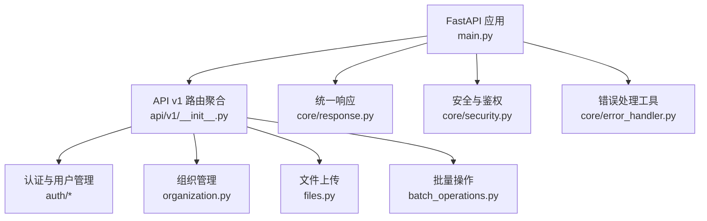
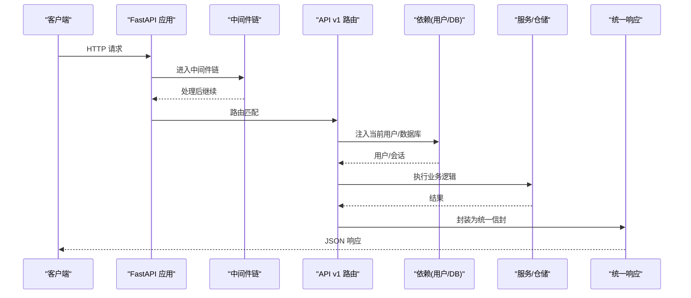
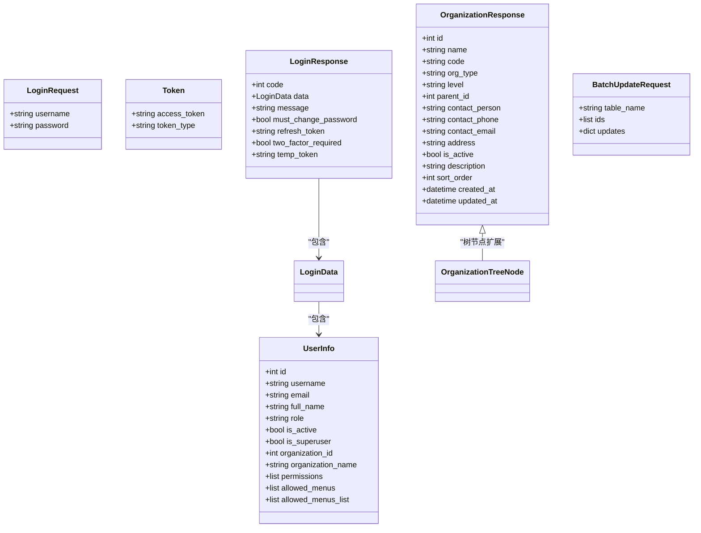
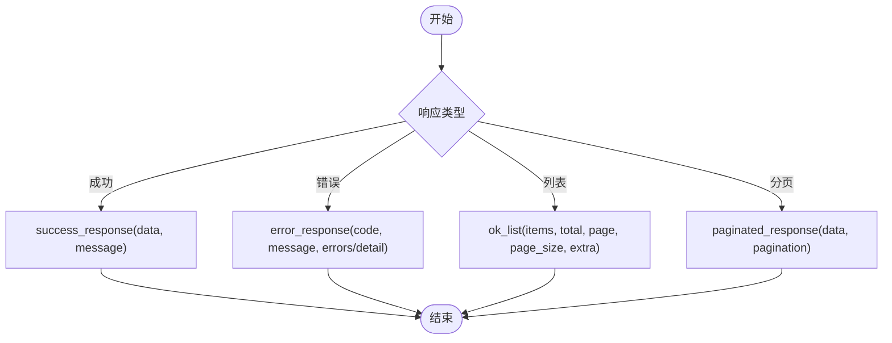
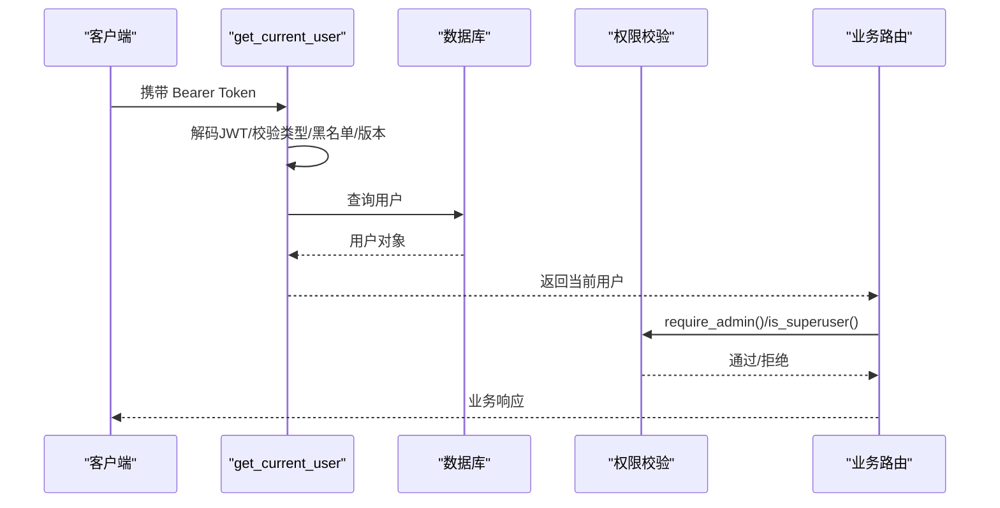
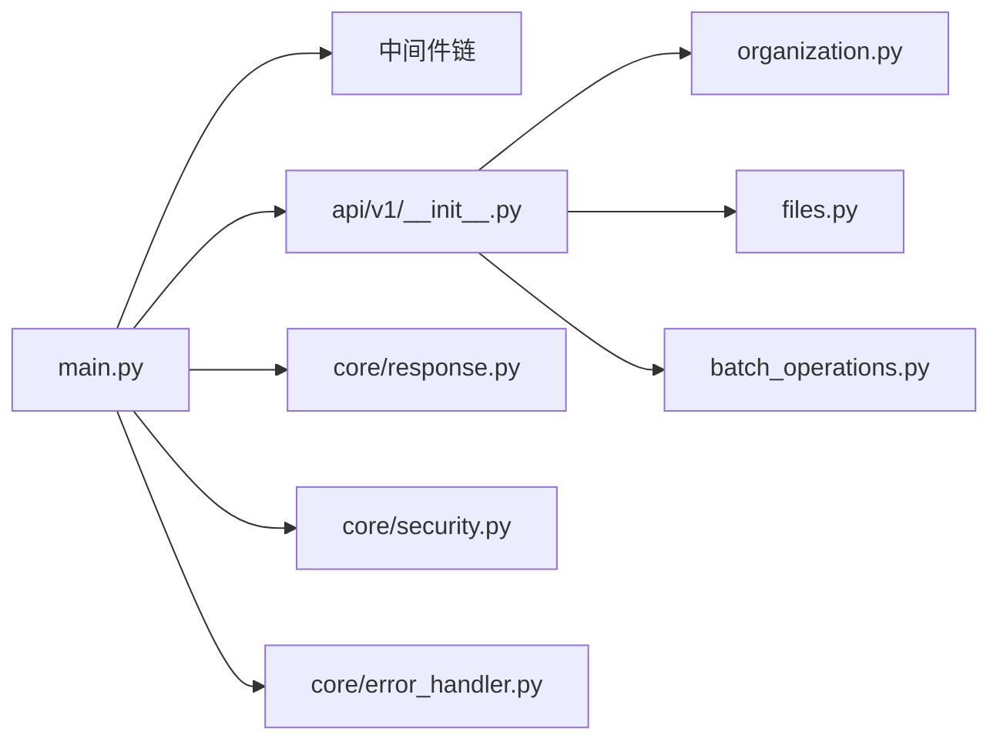

# API接口开发

<cite>
**本文引用的文件**
- [backend/app/main.py](file://backend/app/main.py)
- [backend/app/api/v1/__init__.py](file://backend/app/api/v1/__init__.py)
- [backend/app/core/response.py](file://backend/app/core/response.py)
- [backend/app/core/security.py](file://backend/app/core/security.py)
- [backend/app/core/error_handler.py](file://backend/app/core/error_handler.py)
- [backend/app/schemas/auth.py](file://backend/app/schemas/auth.py)
- [backend/app/schemas/user.py](file://backend/app/schemas/user.py)
- [backend/app/api/v1/organization.py](file://backend/app/api/v1/organization.py)
- [backend/app/api/v1/files.py](file://backend/app/api/v1/files.py)
- [backend/app/api/v1/batch_operations.py](file://backend/app/api/v1/batch_operations.py)
</cite>

## 目录
1. [简介](#简介)
2. [项目结构](#项目结构)
3. [核心组件](#核心组件)
4. [架构总览](#架构总览)
5. [详细组件分析](#详细组件分析)
6. [依赖关系分析](#依赖关系分析)
7. [性能考虑](#性能考虑)
8. [故障排查指南](#故障排查指南)
9. [结论](#结论)
10. [附录](#附录)

## 简介
本文件面向基于 FastAPI 的 RESTful API 开发，围绕路由定义、参数验证、响应格式标准化展开，系统说明 Pydantic Schema 的设计模式（请求校验、响应序列化、嵌套对象处理），统一响应信封的实现（成功、错误、分页），以及认证授权集成、权限控制与数据范围隔离在 API 层的落地方式。同时提供完整的 CRUD 示例要点，涵盖文件上传、批量操作、异步处理等高级特性，并给出 API 版本管理与向后兼容性策略建议。

## 项目结构
后端采用模块化分层：
- 应用入口与中间件注册：FastAPI 实例、生命周期、全局中间件、静态资源挂载、健康检查等
- API v1 路由聚合：按业务模块静态导入并集中注册，保证可维护性与打包稳定性
- 核心能力：安全认证、统一响应、异常处理、数据库事务、缓存、审计等
- Schemas：Pydantic 模型用于请求校验与响应序列化
- 业务路由：组织、文件、批量操作等典型场景

图表来源
- [backend/app/main.py:100-181](file://backend/app/main.py#L100-L181)
- [backend/app/api/v1/__init__.py:29-140](file://backend/app/api/v1/__init__.py#L29-L140)

章节来源
- [backend/app/main.py:100-181](file://backend/app/main.py#L100-L181)
- [backend/app/api/v1/__init__.py:29-140](file://backend/app/api/v1/__init__.py#L29-L140)

## 核心组件
- 统一响应信封：success_response、error_response、ok_list、paginated_response、not_found_response、forbidden_response、server_error_response
- 认证与授权：JWT 生成/解码、Bearer 依赖、当前用户获取、管理员角色校验、令牌黑名单与版本校验
- 路由与中间件：CORS、CSRF、请求日志、审计、慢请求监控、请求ID、驼峰转蛇形、安全头、大小限制
- 参数与响应 Schema：Pydantic 模型用于输入校验与输出序列化，支持嵌套与可选字段
- 业务路由示例：组织列表（分页+缓存）、文件上传（类型白名单+内容嗅探）、批量更新/删除（白名单表名+敏感字段保护）

章节来源
- [backend/app/core/response.py:12-178](file://backend/app/core/response.py#L12-L178)
- [backend/app/core/security.py:210-371](file://backend/app/core/security.py#L210-L371)
- [backend/app/api/v1/organization.py:126-185](file://backend/app/api/v1/organization.py#L126-L185)
- [backend/app/api/v1/files.py:39-127](file://backend/app/api/v1/files.py#L39-L127)
- [backend/app/api/v1/batch_operations.py:23-200](file://backend/app/api/v1/batch_operations.py#L23-L200)

## 架构总览
从请求到响应的关键路径：
- 客户端发起 HTTP 请求
- 中间件链依次处理（请求ID、安全头、CORS、CSRF、日志、审计、限流/慢请求监控等）
- 路由匹配进入具体端点，执行依赖注入（数据库会话、当前用户、权限校验）
- 调用服务层或仓储层完成业务逻辑
- 通过统一响应封装返回；异常由全局处理器转换为标准错误信封

图表来源
- [backend/app/main.py:113-165](file://backend/app/main.py#L113-L165)
- [backend/app/api/v1/__init__.py:102-140](file://backend/app/api/v1/__init__.py#L102-L140)
- [backend/app/core/security.py:243-336](file://backend/app/core/security.py#L243-L336)
- [backend/app/core/response.py:134-178](file://backend/app/core/response.py#L134-L178)

## 详细组件分析

### 路由定义与参数验证
- 路由组织：v1 路由通过静态导入集中注册，避免动态导入导致的打包缺失问题，且任一模块损坏即启动失败，便于快速定位
- 查询参数：使用 Query 进行约束（如 page/page_size 范围），结合 Pydantic 模型对复杂请求体进行强校验
- 路径参数：RESTful 风格，配合依赖注入实现权限与数据范围过滤

章节来源
- [backend/app/api/v1/__init__.py:29-140](file://backend/app/api/v1/__init__.py#L29-L140)
- [backend/app/api/v1/organization.py:126-185](file://backend/app/api/v1/organization.py#L126-L185)

### Pydantic Schema 设计模式
- 请求模型：LoginRequest、UserCreate/UserUpdate、BatchUpdateRequest 等，使用 Field 描述约束（长度、必填、枚举等）
- 响应模型：Token、UserInfo、LoginResponse、OrganizationResponse 等，使用 from_attributes 将 ORM 对象转为字典
- 嵌套对象：登录响应包含 UserInfo；组织树节点包含 children 递归结构
- 校验扩展：自定义 field_validator 对表名白名单、ID 列表、更新字段白名单等进行严格校验

图表来源
- [backend/app/schemas/auth.py:8-77](file://backend/app/schemas/auth.py#L8-L77)
- [backend/app/schemas/user.py:9-53](file://backend/app/schemas/user.py#L9-L53)
- [backend/app/api/v1/organization.py:45-121](file://backend/app/api/v1/organization.py#L45-L121)
- [backend/app/api/v1/batch_operations.py:23-63](file://backend/app/api/v1/batch_operations.py#L23-L63)

章节来源
- [backend/app/schemas/auth.py:8-77](file://backend/app/schemas/auth.py#L8-L77)
- [backend/app/schemas/user.py:9-53](file://backend/app/schemas/user.py#L9-L53)
- [backend/app/api/v1/organization.py:45-121](file://backend/app/api/v1/organization.py#L45-L121)
- [backend/app/api/v1/batch_operations.py:23-63](file://backend/app/api/v1/batch_operations.py#L23-L63)

### 统一响应信封
- 成功响应：success_response(data, message, **kwargs)
- 错误响应：error_response(code, message, errors, detail, **kwargs)，并提供 not_found_response、forbidden_response、server_error_response
- 列表分页：ok_list(items, total, page, page_size, message, extra) 与 paginated_response(data, pagination, message)
- 前端契约：data 内包含 items/total/page/page_size，meta.pagination 提供分页元信息

图表来源
- [backend/app/core/response.py:52-178](file://backend/app/core/response.py#L52-L178)

章节来源
- [backend/app/core/response.py:52-178](file://backend/app/core/response.py#L52-L178)

### 认证授权与权限控制
- 认证流程：从 Authorization: Bearer 提取 JWT，解码后校验类型、黑名单、token_version，再查询用户并写入审计上下文
- 权限控制：require_admin() 依赖工厂，基于角色与超级管理员标志进行访问控制
- 数据范围隔离：在路由或服务层根据 current_user.organization_id 与 is_superuser 进行数据过滤（例如批量操作的 organization_id 传递）

图表来源
- [backend/app/core/security.py:243-371](file://backend/app/core/security.py#L243-L371)
- [backend/app/api/v1/batch_operations.py:121-200](file://backend/app/api/v1/batch_operations.py#L121-L200)

章节来源
- [backend/app/core/security.py:243-371](file://backend/app/core/security.py#L243-L371)
- [backend/app/api/v1/batch_operations.py:121-200](file://backend/app/api/v1/batch_operations.py#L121-L200)

### 数据范围隔离在 API 层
- 路由与服务协作：在批量更新/删除中，将 current_user.organization_id 传入服务，确保仅操作所属组织数据
- 超级管理员豁免：is_superuser(current_user) 作为条件，允许跨组织操作
- 审计与追踪：写操作记录工作日志，便于追溯数据变更范围

章节来源
- [backend/app/api/v1/batch_operations.py:121-200](file://backend/app/api/v1/batch_operations.py#L121-L200)

### 完整 CRUD 示例要点
- 读取（List/Get）：组织列表支持分页、过滤、搜索与缓存命中；返回 ok_list 统一信封
- 创建（Create）：用户创建使用 UserCreate Schema，密码强度与长度校验
- 更新（Update）：用户更新使用 UserUpdate Schema，支持部分字段更新
- 删除（Delete）：批量删除支持软删除开关，限制最大 ID 数量与敏感字段
- 文件上传：通用上传端点，支持分类子目录、扩展名白名单、内容头嗅探、大小限制，返回 /uploads 相对 URL
- 异步处理：任务队列在应用生命周期中启动/停止，适合导出、报表等耗时任务

章节来源
- [backend/app/api/v1/organization.py:126-185](file://backend/app/api/v1/organization.py#L126-L185)
- [backend/app/schemas/user.py:21-36](file://backend/app/schemas/user.py#L21-L36)
- [backend/app/api/v1/batch_operations.py:164-200](file://backend/app/api/v1/batch_operations.py#L164-L200)
- [backend/app/api/v1/files.py:39-127](file://backend/app/api/v1/files.py#L39-L127)
- [backend/app/main.py:68-98](file://backend/app/main.py#L68-L98)

### 高级特性：文件上传、批量操作、异步处理
- 文件上传：
  - 大小限制：依据配置的最大文件大小
  - 类型白名单：按类别分组，图片额外进行内容头校验防绕过
  - 存储与访问：保存到 uploads/generic[/category]，返回 /uploads/... 静态 URL
- 批量操作：
  - 表名白名单：TABLE_MODEL_MAP 限定可操作表
  - 敏感字段保护：禁止更新角色、权限、密码等关键字段
  - 审计日志：记录操作详情与影响行数
- 异步处理：
  - 任务队列：应用启动时初始化，支持后台任务执行与优雅关闭

章节来源
- [backend/app/api/v1/files.py:39-127](file://backend/app/api/v1/files.py#L39-L127)
- [backend/app/api/v1/batch_operations.py:23-200](file://backend/app/api/v1/batch_operations.py#L23-L200)
- [backend/app/main.py:68-98](file://backend/app/main.py#L68-L98)

### API 版本管理与向后兼容
- 版本前缀：所有业务路由集中在 /api/v1，便于未来演进至 v2
- 路由注册顺序：静态导入与 include_router 顺序决定匹配优先级，避免动态路由误匹配
- 兼容策略：
  - 查询参数兼容：如 keyword/search 双字段兼容
  - 响应结构稳定：统一信封与分页元信息保持不变
  - 中间件降级：CSRF 等中间件可按配置启用/禁用，不影响主流程

章节来源
- [backend/app/api/v1/__init__.py:29-140](file://backend/app/api/v1/__init__.py#L29-L140)
- [backend/app/api/v1/organization.py:126-185](file://backend/app/api/v1/organization.py#L126-L185)
- [backend/app/main.py:134-140](file://backend/app/main.py#L134-L140)

## 依赖关系分析
- 应用入口依赖：
  - 中间件：QueryCounterMiddleware、SlowRequestMiddleware、MetricsMiddleware、AuditMiddleware、RequestLoggerMiddleware、CSRFMiddleware、CamelToSnakeMiddleware、CacheHeadersMiddleware、CORSMiddleware、SecurityHeadersMiddleware、BodySizeLimitMiddleware、RequestIDMiddleware
  - 路由：api_v1_router 聚合所有业务模块
- 安全依赖：
  - get_current_user 依赖 JWT 解码、黑名单、token_version 校验
  - require_admin 依赖角色与超级管理员标志
- 响应依赖：
  - success_response、error_response、ok_list、paginated_response 统一封装

图表来源
- [backend/app/main.py:113-181](file://backend/app/main.py#L113-L181)
- [backend/app/api/v1/__init__.py:102-140](file://backend/app/api/v1/__init__.py#L102-L140)
- [backend/app/core/response.py:52-178](file://backend/app/core/response.py#L52-L178)
- [backend/app/core/security.py:243-371](file://backend/app/core/security.py#L243-L371)
- [backend/app/core/error_handler.py:38-108](file://backend/app/core/error_handler.py#L38-L108)

章节来源
- [backend/app/main.py:113-181](file://backend/app/main.py#L113-L181)
- [backend/app/api/v1/__init__.py:102-140](file://backend/app/api/v1/__init__.py#L102-L140)
- [backend/app/core/response.py:52-178](file://backend/app/core/response.py#L52-L178)
- [backend/app/core/security.py:243-371](file://backend/app/core/security.py#L243-L371)
- [backend/app/core/error_handler.py:38-108](file://backend/app/core/error_handler.py#L38-L108)

## 性能考虑
- 缓存策略：
  - 组织列表默认无过滤请求使用缓存（TTL 5 分钟），减少重复查询
  - 静态资源长期缓存（immutable），提升前端加载性能
- 查询优化：
  - 分页与排序：limit/offset 与 order_by 组合，避免全表扫描
  - 索引：启动时创建性能优化索引
- 中间件开销：
  - 慢请求监控与 SQL 查询计数，便于定位瓶颈
  - CSRF 仅在启用时注册，避免不必要的开销

章节来源
- [backend/app/api/v1/organization.py:140-182](file://backend/app/api/v1/organization.py#L140-L182)
- [backend/app/main.py:207-224](file://backend/app/main.py#L207-L224)
- [backend/app/main.py:429-433](file://backend/app/main.py#L429-L433)
- [backend/app/main.py:118-124](file://backend/app/main.py#L118-L124)

## 故障排查指南
- 认证失败：
  - 检查 Authorization 头是否携带有效 Bearer Token
  - 确认 token 未被加入黑名单，token_version 与用户一致
- 权限不足：
  - 确认当前用户角色是否为 admin 或 super_admin
- 批量操作失败：
  - 检查 table_name 是否在白名单
  - 检查 IDs 是否为正整数且不超过上限
  - 检查 updates 是否包含敏感字段
- 文件上传失败：
  - 检查文件大小是否超过限制
  - 检查扩展名是否在白名单，图片需匹配内容头
- 响应异常：
  - 使用 error_response 构造的错误信封，查看 code/message/errors/detail

章节来源
- [backend/app/core/security.py:243-336](file://backend/app/core/security.py#L243-L336)
- [backend/app/api/v1/batch_operations.py:23-119](file://backend/app/api/v1/batch_operations.py#L23-L119)
- [backend/app/api/v1/files.py:54-84](file://backend/app/api/v1/files.py#L54-L84)
- [backend/app/core/error_handler.py:38-108](file://backend/app/core/error_handler.py#L38-L108)

## 结论
本项目以 FastAPI 为核心，构建了清晰的 API 分层与统一的响应规范，借助 Pydantic 实现严格的参数校验与响应序列化，结合 JWT 认证与角色权限控制，保障数据安全与访问可控。通过中间件链实现可观测性与安全性增强，利用缓存与索引提升性能。文件上传与批量操作提供了实用的业务能力，任务队列支撑异步处理。版本化路由与兼容策略为后续演进奠定基础。

## 附录
- 健康检查：/health 暴露版本与迁移状态，便于运维监控
- 关闭端点：/api/v1/shutdown 仅限本机与内部密钥调用，用于优雅关闭
- SPA 回退：非 API/静态路径 GET 请求返回 index.html，支持前端路由

章节来源
- [backend/app/main.py:237-262](file://backend/app/main.py#L237-L262)
- [backend/app/main.py:265-292](file://backend/app/main.py#L265-L292)
- [backend/app/main.py:354-376](file://backend/app/main.py#L354-L376)