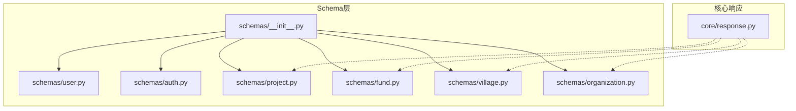
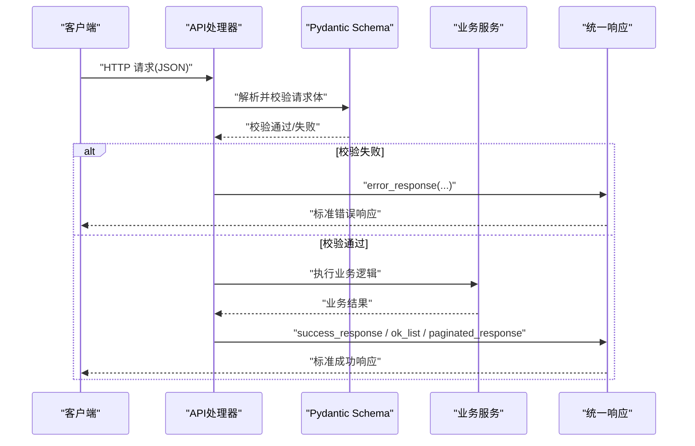
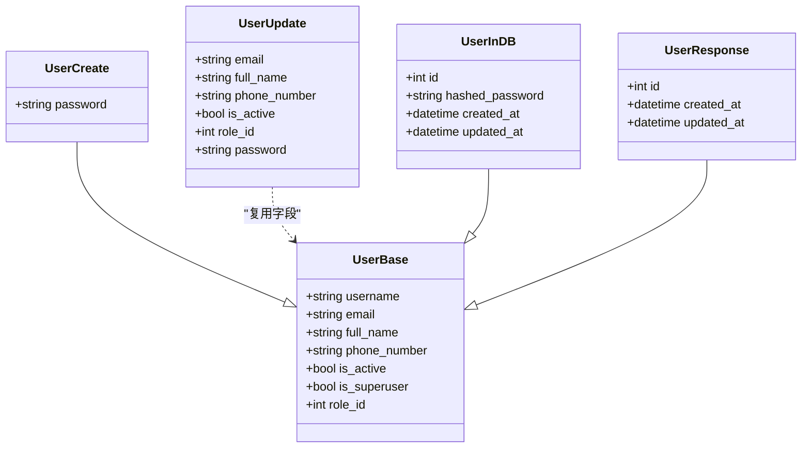
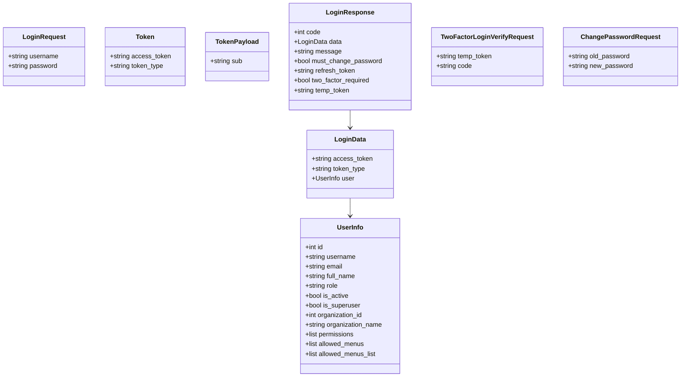
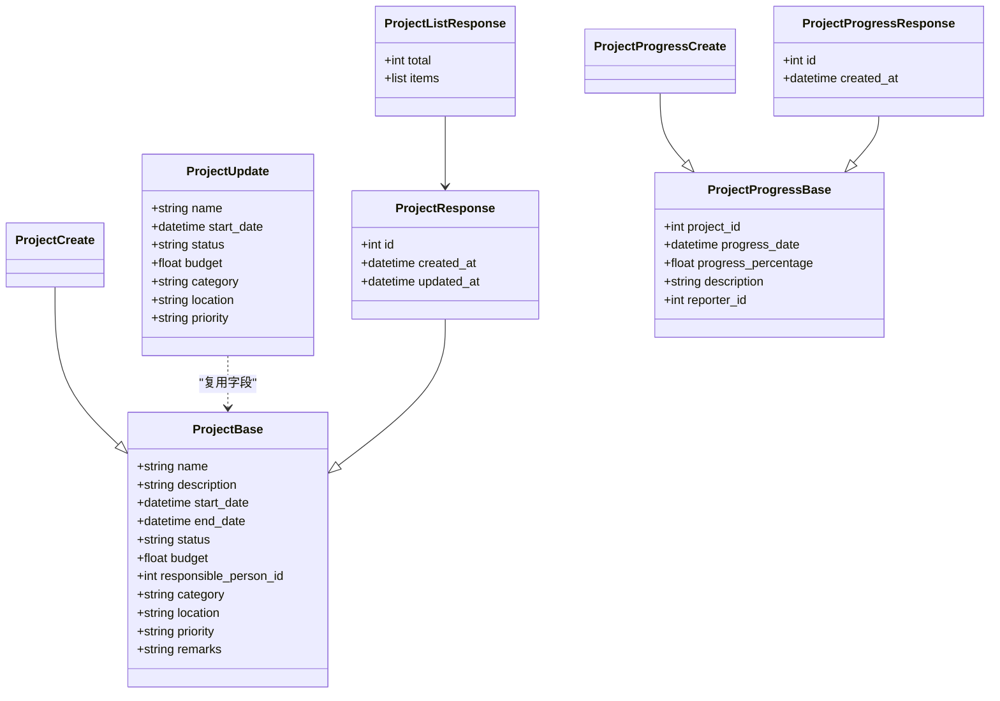
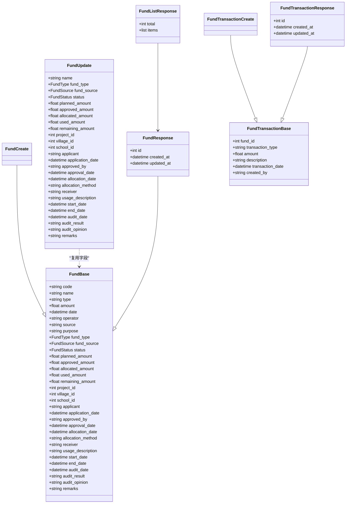
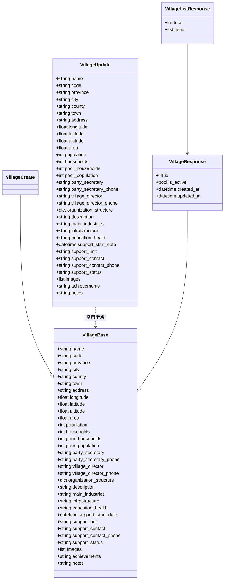
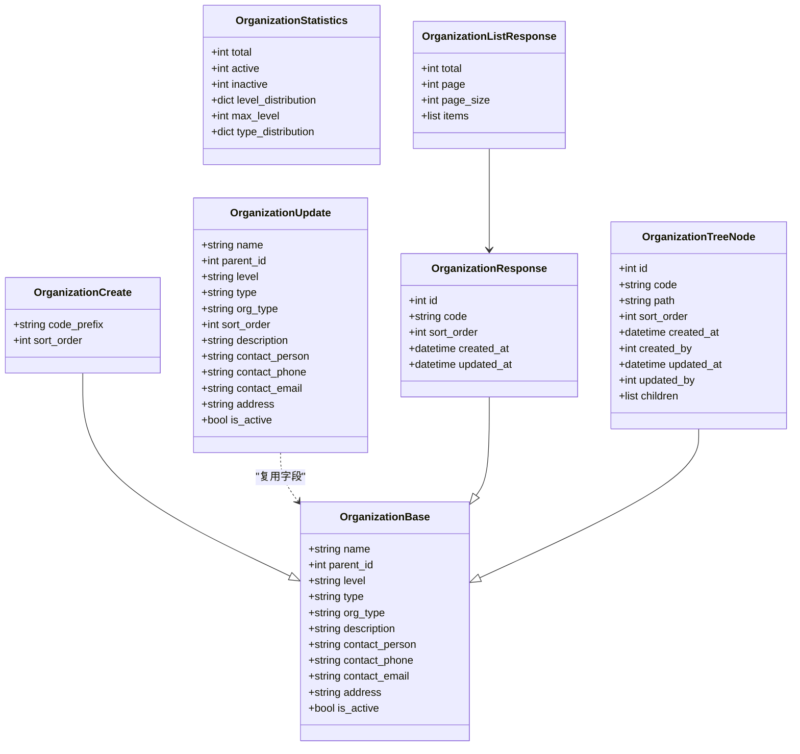
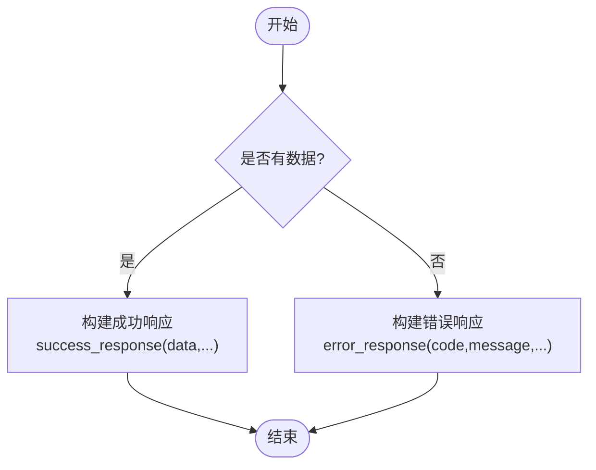
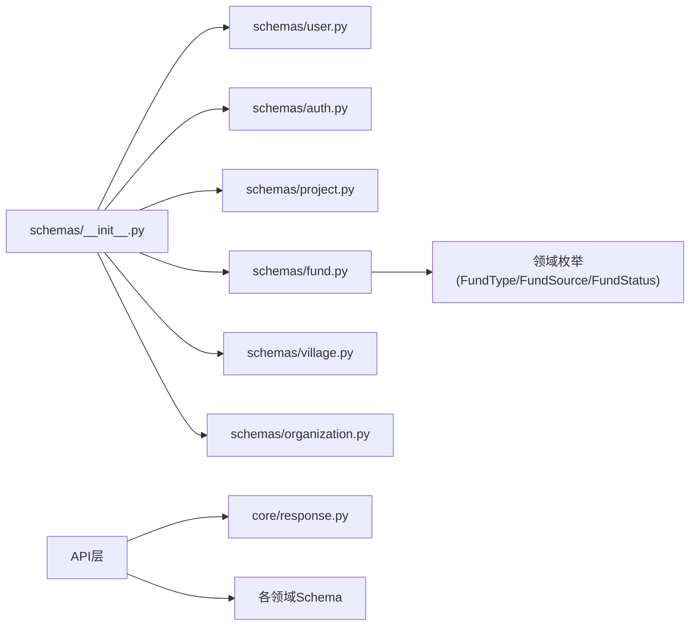

# 数据验证与Schema

<cite>
**本文引用的文件**
- [backend/app/core/response.py](file://backend/app/core/response.py)
- [backend/app/schemas/__init__.py](file://backend/app/schemas/__init__.py)
- [backend/app/schemas/user.py](file://backend/app/schemas/user.py)
- [backend/app/schemas/auth.py](file://backend/app/schemas/auth.py)
- [backend/app/schemas/project.py](file://backend/app/schemas/project.py)
- [backend/app/schemas/fund.py](file://backend/app/schemas/fund.py)
- [backend/app/schemas/village.py](file://backend/app/schemas/village.py)
- [backend/app/schemas/organization.py](file://backend/app/schemas/organization.py)
</cite>

## 目录
1. [简介](#简介)
2. [项目结构](#项目结构)
3. [核心组件](#核心组件)
4. [架构总览](#架构总览)
5. [详细组件分析](#详细组件分析)
6. [依赖关系分析](#依赖关系分析)
7. [性能考量](#性能考量)
8. [故障排查指南](#故障排查指南)
9. [结论](#结论)
10. [附录](#附录)

## 简介
本章节聚焦后端的数据验证与Schema设计，系统阐述Pydantic模型的设计模式、请求与响应Schema的分离策略、嵌套对象处理、自定义验证与复合条件校验、以及统一响应格式的封装。文档以仓库中实际实现的Schema与响应工具为依据，帮助读者在复杂业务场景下构建健壮、可维护的数据契约。

## 项目结构
本项目将数据契约集中在 backend/app/schemas 目录下，按领域划分模块（用户、认证、项目、经费、村庄、组织等），并通过统一的 __init__ 动态注册导出。统一响应格式集中在 backend/app/core/response.py，提供成功、失败、分页等标准返回结构。

图表来源
- [backend/app/schemas/__init__.py:15-50](file://backend/app/schemas/__init__.py#L15-L50)
- [backend/app/core/response.py:52-98](file://backend/app/core/response.py#L52-L98)

章节来源
- [backend/app/schemas/__init__.py:1-53](file://backend/app/schemas/__init__.py#L1-L53)
- [backend/app/core/response.py:1-178](file://backend/app/core/response.py#L1-L178)

## 核心组件
- Pydantic BaseModel 继承：所有Schema均继承自BaseModel，通过字段标注与Field约束实现强类型校验。
- 字段类型与默认值：使用Optional、枚举、datetime、数值范围等类型；为可选字段设置None或合理默认值。
- 验证规则：利用Field内置约束（如min_length、max_length、ge、le）进行基础校验；复杂逻辑可通过类方法或后续服务层组合实现。
- 请求/响应分离：每个领域通常包含Create/Update/Response三类模型，避免泄露敏感字段并明确输入输出契约。
- 嵌套对象：通过引用其他Schema或Dict/List类型表达关联关系，配合from_attributes配置支持ORM对象到Schema的转换。
- 统一响应：使用success_response、ok_list、paginated_response等函数生成一致的结构化响应体。

章节来源
- [backend/app/schemas/user.py:9-53](file://backend/app/schemas/user.py#L9-L53)
- [backend/app/schemas/auth.py:8-77](file://backend/app/schemas/auth.py#L8-L77)
- [backend/app/schemas/project.py:9-75](file://backend/app/schemas/project.py#L9-L75)
- [backend/app/schemas/fund.py:41-148](file://backend/app/schemas/fund.py#L41-L148)
- [backend/app/schemas/village.py:11-113](file://backend/app/schemas/village.py#L11-L113)
- [backend/app/schemas/organization.py:9-100](file://backend/app/schemas/organization.py#L9-L100)
- [backend/app/core/response.py:52-178](file://backend/app/core/response.py#L52-L178)

## 架构总览
下图展示了从请求进入、Schema校验、到统一响应返回的整体流程，体现“请求Schema -> 业务处理 -> 响应Schema/统一响应”的分层解耦。

图表来源
- [backend/app/core/response.py:101-178](file://backend/app/core/response.py#L101-L178)
- [backend/app/schemas/user.py:9-53](file://backend/app/schemas/user.py#L9-L53)
- [backend/app/schemas/auth.py:8-77](file://backend/app/schemas/auth.py#L8-L77)

## 详细组件分析

### 用户领域Schema（user.py）
- 设计模式
  - UserBase：定义公共字段（用户名、邮箱、姓名、电话、角色ID、激活状态等），作为创建/更新/响应的基类。
  - UserCreate：继承UserBase，增加密码字段，用于创建用户。
  - UserUpdate：仅包含可更新字段，全部为可选，便于增量更新。
  - UserInDB：表示数据库中的用户实体，包含哈希密码与时间戳。
  - UserResponse：对外暴露的用户信息，不包含敏感字段。
- 字段与验证
  - 使用Field进行长度限制与描述；Optional标记可选字段；布尔字段提供默认值。
- 嵌套与序列化
  - 通过继承复用字段，减少重复；响应模型屏蔽内部字段，保证安全。

图表来源
- [backend/app/schemas/user.py:9-53](file://backend/app/schemas/user.py#L9-L53)

章节来源
- [backend/app/schemas/user.py:1-53](file://backend/app/schemas/user.py#L1-L53)

### 认证领域Schema（auth.py）
- 设计模式
  - LoginRequest：登录输入，包含用户名与密码的长度约束。
  - Token/TokenPayload：令牌结构与载荷。
  - UserInfo：用户基本信息，包含权限与菜单列表。
  - LoginData/LoginResponse：登录返回体，包含token与用户信息，以及二次认证相关字段。
  - TwoFactorLoginVerifyRequest：2FA验证码校验请求。
  - ChangePasswordRequest：修改密码请求，包含新旧密码约束。
- 字段与验证
  - 使用Field进行最小/最大长度限制；Optional用于可选字段；布尔字段提供默认值。
- 嵌套与序列化
  - LoginResponse嵌套UserInfo，体现请求/响应分层。

图表来源
- [backend/app/schemas/auth.py:8-77](file://backend/app/schemas/auth.py#L8-L77)

章节来源
- [backend/app/schemas/auth.py:1-77](file://backend/app/schemas/auth.py#L1-L77)

### 项目领域Schema（project.py）
- 设计模式
  - ProjectBase：项目基础字段（名称、描述、起止日期、状态、预算、负责人、分类、位置、优先级、备注）。
  - ProjectCreate/ProjectUpdate/ProjectResponse：分别对应创建、更新、响应视图。
  - ProjectListResponse：列表包装，包含total与items。
  - ProjectProgressBase/Create/Response：进度记录。
- 字段与验证
  - 使用Field进行长度与数值范围约束（如预算非负、进度百分比0-100）。
- 嵌套与序列化
  - 列表响应通过items聚合多个响应对象。

图表来源
- [backend/app/schemas/project.py:9-75](file://backend/app/schemas/project.py#L9-L75)

章节来源
- [backend/app/schemas/project.py:1-75](file://backend/app/schemas/project.py#L1-L75)

### 经费领域Schema（fund.py）
- 设计模式
  - FundBase：经费主表字段，包含编号、名称、类型、金额、日期、经办人、来源、用途、状态、计划/批准/分配/使用/剩余金额、关联ID、审批信息等。
  - FundCreate/FundUpdate/FundResponse：创建、更新、响应视图。
  - FundListResponse：列表包装。
  - FundTransactionBase/Create/Response：交易流水。
- 字段与验证
  - 使用枚举类型（FundType、FundSource、FundStatus）约束取值；数值字段使用ge=0确保非负。
  - ConfigDict(from_attributes=True)支持从ORM对象直接填充。
- 嵌套与序列化
  - 列表响应通过items聚合多个响应对象。

图表来源
- [backend/app/schemas/fund.py:41-148](file://backend/app/schemas/fund.py#L41-L148)

章节来源
- [backend/app/schemas/fund.py:1-148](file://backend/app/schemas/fund.py#L1-L148)

### 村庄领域Schema（village.py）
- 设计模式
  - VillageBase：村庄基础字段，包含地址、地理坐标、面积、人口、贫困指标、联系人、组织结构(JSON)、描述、产业、基础设施、教育医疗、帮扶信息、图片、成果、备注等。
  - VillageCreate/VillageUpdate/VillageResponse：创建、更新、响应视图。
  - VillageListResponse：列表包装。
- 字段与验证
  - 使用Field进行长度与数值范围约束；支持JSON字段（Dict[str, Any]）；Optional标记可选字段。
  - ConfigDict(from_attributes=True)支持从ORM对象直接填充。
- 嵌套与序列化
  - 列表响应通过items聚合多个响应对象。

图表来源
- [backend/app/schemas/village.py:11-113](file://backend/app/schemas/village.py#L11-L113)

章节来源
- [backend/app/schemas/village.py:1-113](file://backend/app/schemas/village.py#L1-L113)

### 组织领域Schema（organization.py）
- 设计模式
  - OrganizationBase：组织公共字段（名称、父级、层级、类型、描述、联系人、地址、是否激活）。
  - OrganizationCreate/OrganizationUpdate/OrganizationResponse：创建、更新、响应视图。
  - OrganizationTreeNode：树形节点，包含children递归结构。
  - OrganizationStatistics：统计信息，支持别名与忽略额外字段。
  - OrganizationListResponse：列表包装。
- 字段与验证
  - 使用Field进行长度限制；布尔字段提供默认值；ConfigDict(populate_by_name=True, extra="ignore")提升兼容性。
- 嵌套与序列化
  - 树节点通过children实现递归嵌套；统计信息使用别名映射。

图表来源
- [backend/app/schemas/organization.py:9-100](file://backend/app/schemas/organization.py#L9-L100)

章节来源
- [backend/app/schemas/organization.py:1-100](file://backend/app/schemas/organization.py#L1-L100)

### 统一响应封装（response.py）
- 设计要点
  - success_response：标准成功响应，包含code、message、success、data及扩展字段。
  - error_response：标准错误响应，包含code、message、success、errors、detail及扩展字段。
  - not_found_response/forbidden_response/server_error_response：快捷错误响应。
  - ok_list：列表信封，包含items、total、page、page_size，并可合并extra（如summary）。
  - paginated_response：分页元信息封装，附加meta.pagination。
- 使用建议
  - 所有列表接口统一使用ok_list，避免裸结构混用。
  - 分页接口使用paginated_response，前端据此渲染分页控件。
  - 错误处理统一走error_response，便于前端集中处理。

图表来源
- [backend/app/core/response.py:101-178](file://backend/app/core/response.py#L101-L178)

章节来源
- [backend/app/core/response.py:1-178](file://backend/app/core/response.py#L1-L178)

## 依赖关系分析
- Schema模块通过__init__.py动态导入各领域模块，并将BaseModel子类导出至包级别，便于上层统一引用。
- 部分Schema（如fund.py）引入领域内枚举（FundType、FundSource、FundStatus），若导入失败则提供本地回退定义，增强鲁棒性。
- 响应模块独立于Schema，被API层调用以生成统一结构，降低耦合。

图表来源
- [backend/app/schemas/__init__.py:15-50](file://backend/app/schemas/__init__.py#L15-L50)
- [backend/app/schemas/fund.py:11-39](file://backend/app/schemas/fund.py#L11-L39)
- [backend/app/core/response.py:52-178](file://backend/app/core/response.py#L52-L178)

章节来源
- [backend/app/schemas/__init__.py:1-53](file://backend/app/schemas/__init__.py#L1-L53)
- [backend/app/schemas/fund.py:1-148](file://backend/app/schemas/fund.py#L1-L148)
- [backend/app/core/response.py:1-178](file://backend/app/core/response.py#L1-L178)

## 性能考量
- 使用Enum与Field约束可减少运行时校验开销，提高一致性。
- from_attributes=True允许直接从ORM对象填充Schema，减少手动映射成本。
- 列表响应统一使用ok_list/paginated_response，避免重复构造逻辑，提升可维护性与性能。
- 对大对象（如VillageBase）谨慎使用深层嵌套，必要时拆分响应视图以减少传输体积。

[本节为通用指导，不直接分析具体文件]

## 故障排查指南
- 常见校验错误
  - 必填字段缺失：检查Schema中未设置default且无Optional的字段。
  - 长度越界：确认Field的min_length/max_length是否符合业务要求。
  - 数值范围：确保ge/le约束与实际业务一致（如预算非负、进度0-100）。
  - 枚举值非法：核对传入值是否在枚举定义范围内。
- 响应问题
  - 列表结构不一致：确保使用ok_list而非裸字典；分页接口使用paginated_response。
  - 顶层字段误放：注意ok_list的extra参数会并入data层，不要通过**kwargs传附加数据到顶层。
- 调试建议
  - 捕获error_response中的errors字段，定位具体字段与错误原因。
  - 在API层打印请求体与Schema校验结果，快速定位问题。

章节来源
- [backend/app/core/response.py:101-178](file://backend/app/core/response.py#L101-L178)

## 结论
本项目采用清晰的Pydantic Schema分层与统一响应封装，实现了强类型、可验证、可扩展的数据契约。通过BaseModel继承、Field约束、枚举类型、from_attributes配置以及ok_list/paginated_response等工具，既保证了数据一致性，又提升了开发效率与可维护性。建议在复杂业务场景中继续遵循“请求/响应分离”“嵌套适度”“统一响应”的原则，并结合服务层进行复合条件校验与业务规则落地。

[本节为总结性内容，不直接分析具体文件]

## 附录
- 最佳实践
  - 始终为必填字段提供Field约束与description，便于自动生成文档与前端提示。
  - 使用Optional与默认值明确可选字段语义，避免歧义。
  - 对数值型字段使用ge/le约束，防止非法数据进入业务层。
  - 对枚举字段优先使用Enum类型，提升可读性与安全性。
  - 列表与分页统一使用ok_list/paginated_response，保持前后端契约一致。
- 常见陷阱
  - 在响应模型中泄露敏感字段（如密码、哈希）。
  - 在Update模型中遗漏可选标记，导致部分更新失败。
  - 滥用嵌套导致响应过大或解析困难。
  - 忽略from_attributes配置，导致ORM对象无法直接填充Schema。

[本节为通用指导，不直接分析具体文件]