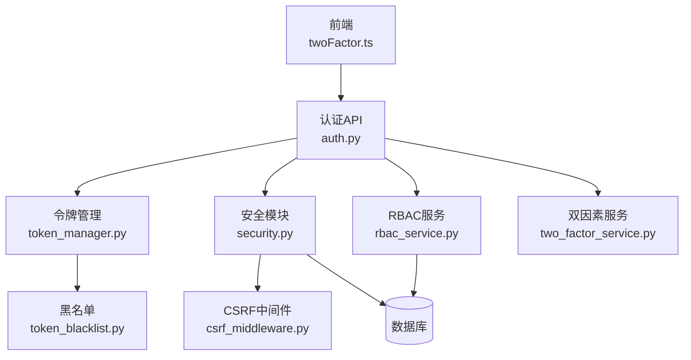
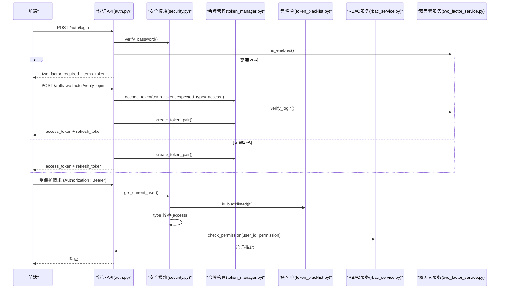
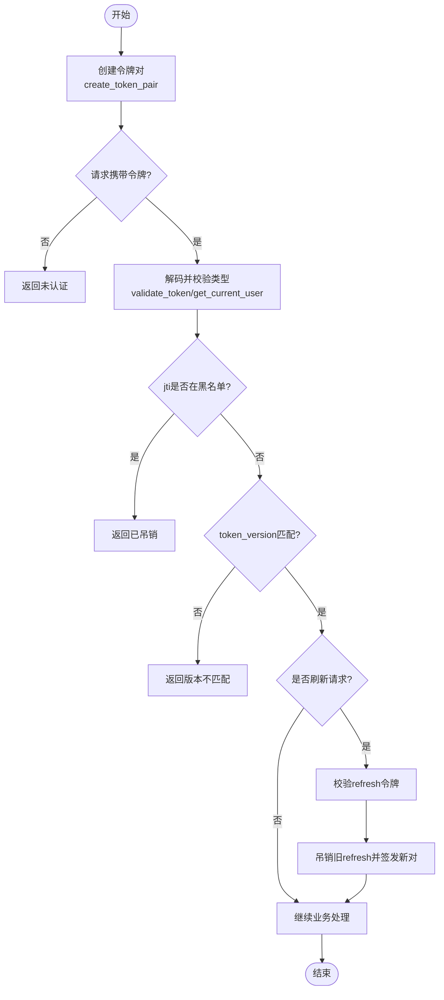
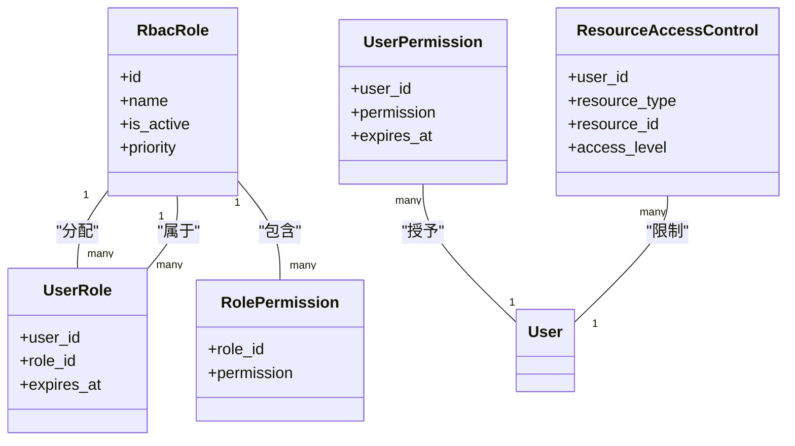
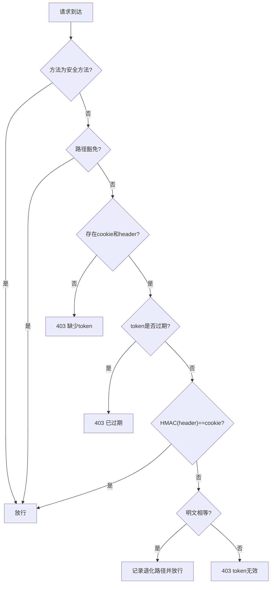
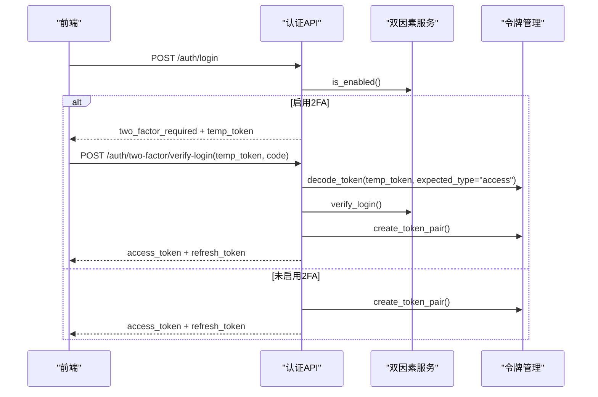
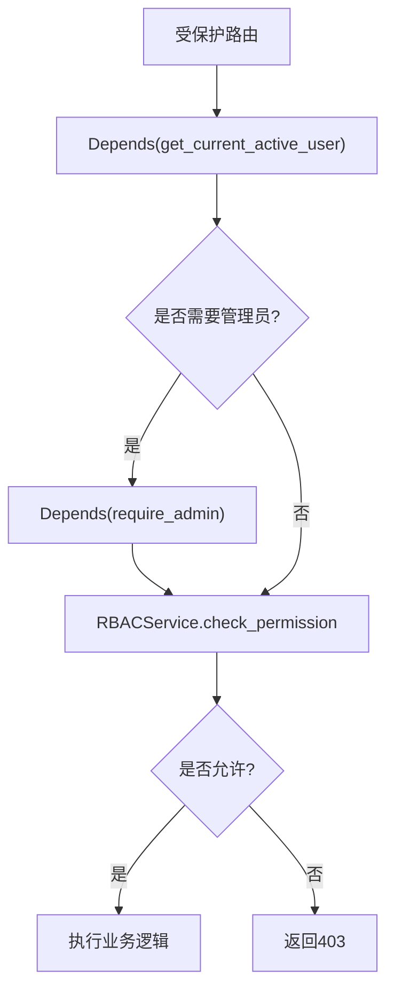
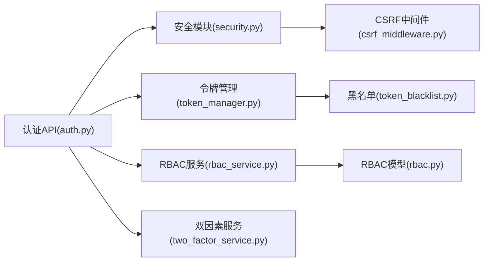

# 认证授权集成

<cite>
**本文引用的文件**
- [backend/app/core/token_manager.py](file://backend/app/core/token_manager.py)
- [backend/app/core/security.py](file://backend/app/core/security.py)
- [backend/app/middleware/csrf_middleware.py](file://backend/app/middleware/csrf_middleware.py)
- [backend/app/models/rbac.py](file://backend/app/models/rbac.py)
- [backend/app/services/rbac_service.py](file://backend/app/services/rbac_service.py)
- [backend/app/api/v1/auth/auth.py](file://backend/app/api/v1/auth/auth.py)
- [backend/app/services/two_factor_service.py](file://backend/app/services/two_factor_service.py)
- [backend/app/core/token_blacklist.py](file://backend/app/core/token_blacklist.py)
- [frontend/src/api/twoFactor.ts](file://frontend/src/api/twoFactor.ts)
</cite>

## 目录
1. [简介](#简介)
2. [项目结构](#项目结构)
3. [核心组件](#核心组件)
4. [架构总览](#架构总览)
5. [详细组件分析](#详细组件分析)
6. [依赖关系分析](#依赖关系分析)
7. [性能与安全考量](#性能与安全考量)
8. [故障排查指南](#故障排查指南)
9. [结论](#结论)
10. [附录](#附录)

## 简介
本文件面向“认证与授权集成”的完整实现，覆盖以下主题：
- JWT 令牌的生成、验证、刷新与吊销机制（含过期处理与安全存储）
- RBAC 角色权限控制（细粒度权限检查、数据范围隔离）
- CSRF/XSS/SQL 注入等安全中间件配置与使用
- 双因素认证（2FA）扩展方式与登录流程
- API 级权限控制（装饰器模式、依赖注入、动态权限检查）
- 安全最佳实践（密码加密、敏感信息保护、安全头配置）

## 项目结构
后端采用分层设计：API 层（FastAPI）、服务层（业务逻辑）、模型层（ORM）、核心安全模块（JWT、CSRF、安全头、速率限制等）。前端提供双因素认证 API 封装与认证状态管理。

**图示来源**
- [backend/app/api/v1/auth/auth.py:101-200](file://backend/app/api/v1/auth/auth.py#L101-L200)
- [backend/app/core/token_manager.py:64-127](file://backend/app/core/token_manager.py#L64-L127)
- [backend/app/core/security.py:243-336](file://backend/app/core/security.py#L243-L336)
- [backend/app/services/rbac_service.py:133-222](file://backend/app/services/rbac_service.py#L133-L222)
- [backend/app/services/two_factor_service.py:103-148](file://backend/app/services/two_factor_service.py#L103-L148)
- [backend/app/core/token_blacklist.py:27-70](file://backend/app/core/token_blacklist.py#L27-L70)
- [backend/app/middleware/csrf_middleware.py:177-284](file://backend/app/middleware/csrf_middleware.py#L177-L284)
- [frontend/src/api/twoFactor.ts:39-78](file://frontend/src/api/twoFactor.ts#L39-L78)

**章节来源**
- [backend/app/api/v1/auth/auth.py:101-200](file://backend/app/api/v1/auth/auth.py#L101-L200)
- [backend/app/core/token_manager.py:64-127](file://backend/app/core/token_manager.py#L64-L127)
- [backend/app/core/security.py:243-336](file://backend/app/core/security.py#L243-L336)
- [backend/app/services/rbac_service.py:133-222](file://backend/app/services/rbac_service.py#L133-L222)
- [backend/app/services/two_factor_service.py:103-148](file://backend/app/services/two_factor_service.py#L103-L148)
- [backend/app/core/token_blacklist.py:27-70](file://backend/app/core/token_blacklist.py#L27-L70)
- [backend/app/middleware/csrf_middleware.py:177-284](file://backend/app/middleware/csrf_middleware.py#L177-L284)
- [frontend/src/api/twoFactor.ts:39-78](file://frontend/src/api/twoFactor.ts#L39-L78)

## 核心组件
- 令牌管理（TokenManager）：统一签发 access/refresh 令牌对、校验类型与黑名单、吊销与刷新。
- 安全模块（Security）：密码哈希、Bearer 认证依赖、管理员依赖、速率限制、安全响应头、输入清洗。
- CSRF 中间件：HMAC 签名增强、路径豁免、过期检测、降级兼容。
- RBAC 模型与服务：角色、用户-角色、角色-权限、用户直接权限、资源访问控制、访问日志；权限计算包含机器码限制与白名单交集。
- 双因素认证（2FA）：TOTP 密钥生成、二维码、备用码、启用/验证/禁用、登录二次验证。
- 令牌黑名单：内存+可选数据库持久化，支持重启后恢复。

**章节来源**
- [backend/app/core/token_manager.py:64-127](file://backend/app/core/token_manager.py#L64-L127)
- [backend/app/core/security.py:107-149](file://backend/app/core/security.py#L107-L149)
- [backend/app/middleware/csrf_middleware.py:65-124](file://backend/app/middleware/csrf_middleware.py#L65-L124)
- [backend/app/models/rbac.py:31-188](file://backend/app/models/rbac.py#L31-L188)
- [backend/app/services/rbac_service.py:104-222](file://backend/app/services/rbac_service.py#L104-L222)
- [backend/app/services/two_factor_service.py:23-148](file://backend/app/services/two_factor_service.py#L23-L148)
- [backend/app/core/token_blacklist.py:27-70](file://backend/app/core/token_blacklist.py#L27-L70)

## 架构总览
认证授权链路从前端发起，经 FastAPI 路由进入认证 API，调用令牌管理与安全模块完成鉴权，再通过 RBAC 服务进行权限判定，必要时触发 2FA 流程。所有写操作可审计，关键令牌状态通过黑名单持久化保障一致性。

**图示来源**
- [backend/app/api/v1/auth/auth.py:101-200](file://backend/app/api/v1/auth/auth.py#L101-L200)
- [backend/app/api/v1/auth/auth.py:298-340](file://backend/app/api/v1/auth/auth.py#L298-L340)
- [backend/app/core/security.py:243-336](file://backend/app/core/security.py#L243-L336)
- [backend/app/core/token_manager.py:64-127](file://backend/app/core/token_manager.py#L64-L127)
- [backend/app/core/token_blacklist.py:27-70](file://backend/app/core/token_blacklist.py#L27-L70)
- [backend/app/services/rbac_service.py:133-222](file://backend/app/services/rbac_service.py#L133-L222)
- [backend/app/services/two_factor_service.py:180-215](file://backend/app/services/two_factor_service.py#L180-L215)

## 详细组件分析

### JWT 令牌生命周期（生成、验证、刷新、吊销）
- 签发：create_token_pair 生成 access/refresh 令牌对，附带 jti、type、exp、iat 及额外声明（如 token_version）。
- 验证：validate_token 解码并校验类型与黑名单；get_current_user 在认证依赖中再次校验类型与黑名单，并校验 token_version。
- 刷新：refresh_access_token 校验 refresh 令牌、吊销旧 refresh、签发新令牌对。
- 吊销：revoke_token 将 jti 加入内存黑名单并持久化到数据库，确保重启后仍有效。

**图示来源**
- [backend/app/core/token_manager.py:64-127](file://backend/app/core/token_manager.py#L64-L127)
- [backend/app/core/token_manager.py:135-169](file://backend/app/core/token_manager.py#L135-L169)
- [backend/app/core/token_manager.py:176-210](file://backend/app/core/token_manager.py#L176-L210)
- [backend/app/core/token_manager.py:218-240](file://backend/app/core/token_manager.py#L218-L240)
- [backend/app/core/security.py:243-336](file://backend/app/core/security.py#L243-L336)
- [backend/app/core/token_blacklist.py:27-70](file://backend/app/core/token_blacklist.py#L27-L70)

**章节来源**
- [backend/app/core/token_manager.py:64-127](file://backend/app/core/token_manager.py#L64-L127)
- [backend/app/core/token_manager.py:135-169](file://backend/app/core/token_manager.py#L135-L169)
- [backend/app/core/token_manager.py:176-210](file://backend/app/core/token_manager.py#L176-L210)
- [backend/app/core/token_manager.py:218-240](file://backend/app/core/token_manager.py#L218-L240)
- [backend/app/core/security.py:243-336](file://backend/app/core/security.py#L243-L336)
- [backend/app/core/token_blacklist.py:27-70](file://backend/app/core/token_blacklist.py#L27-L70)

### 角色与权限控制（RBAC）
- 模型：角色、用户-角色、角色-权限、用户直接权限、资源访问控制、访问日志。
- 权限计算：管理员优先、直接权限、角色权限、资源级权限；支持机器码限制与用户白名单交集；请求级缓存减少重复查询。
- 数据范围隔离：通过 ResourceAccessControl 限定用户对特定资源的访问级别（read/write/delete），结合业务查询条件实现数据范围过滤。

**图示来源**
- [backend/app/models/rbac.py:31-188](file://backend/app/models/rbac.py#L31-L188)

**章节来源**
- [backend/app/models/rbac.py:31-188](file://backend/app/models/rbac.py#L31-L188)
- [backend/app/services/rbac_service.py:133-222](file://backend/app/services/rbac_service.py#L133-L222)
- [backend/app/services/rbac_service.py:256-320](file://backend/app/services/rbac_service.py#L256-L320)

### CSRF 防护
- 模式：Double Submit Cookie + HMAC 签名增强；Cookie 存签名，Header 存原始 token；常量时间比较防时序攻击。
- 豁免：GET/HEAD/OPTIONS、指定路径前缀（如 /api/v1/auth/csrf-token、/health 等）。
- 过期：token 内嵌时间戳，超过阈值拒绝；兼容旧版明文比对并记录警告。
- 代理信任：仅在配置可信代理时读取 X-Forwarded-For，否则回退直连 IP。

**图示来源**
- [backend/app/middleware/csrf_middleware.py:65-124](file://backend/app/middleware/csrf_middleware.py#L65-L124)
- [backend/app/middleware/csrf_middleware.py:177-284](file://backend/app/middleware/csrf_middleware.py#L177-L284)

**章节来源**
- [backend/app/middleware/csrf_middleware.py:65-124](file://backend/app/middleware/csrf_middleware.py#L65-L124)
- [backend/app/middleware/csrf_middleware.py:177-284](file://backend/app/middleware/csrf_middleware.py#L177-L284)

### 双因素认证（2FA）
- 启用：生成 TOTP 密钥、二维码、备用码；密钥加密存储；需验证后才启用。
- 登录二次验证：若用户启用 2FA，登录返回临时令牌（temp_token）；前端调用 /auth/two-factor/verify-login 提交验证码或备用码，成功后签发正式令牌对。
- 前端接口：封装 enable/verify/disable/status/verifyLogin 等方法。

**图示来源**
- [backend/app/api/v1/auth/auth.py:298-340](file://backend/app/api/v1/auth/auth.py#L298-L340)
- [backend/app/services/two_factor_service.py:103-148](file://backend/app/services/two_factor_service.py#L103-L148)
- [backend/app/services/two_factor_service.py:180-215](file://backend/app/services/two_factor_service.py#L180-L215)
- [frontend/src/api/twoFactor.ts:39-78](file://frontend/src/api/twoFactor.ts#L39-L78)

**章节来源**
- [backend/app/api/v1/auth/auth.py:298-340](file://backend/app/api/v1/auth/auth.py#L298-L340)
- [backend/app/services/two_factor_service.py:103-148](file://backend/app/services/two_factor_service.py#L103-L148)
- [backend/app/services/two_factor_service.py:180-215](file://backend/app/services/two_factor_service.py#L180-L215)
- [frontend/src/api/twoFactor.ts:39-78](file://frontend/src/api/twoFactor.ts#L39-L78)

### API 级权限控制（装饰器、依赖注入、动态检查）
- 依赖注入：get_current_user、require_admin 作为 FastAPI 依赖，自动完成认证与角色检查。
- 动态检查：RBACService.check_permission 支持按资源类型与 ID 进行细粒度权限判断，并在请求级缓存受限权限集合。
- 装饰器模式：通过 Depends(require_admin()) 实现管理员端点保护；业务端点可组合 RBAC 检查。

**图示来源**
- [backend/app/core/security.py:339-371](file://backend/app/core/security.py#L339-L371)
- [backend/app/services/rbac_service.py:133-222](file://backend/app/services/rbac_service.py#L133-L222)

**章节来源**
- [backend/app/core/security.py:339-371](file://backend/app/core/security.py#L339-L371)
- [backend/app/services/rbac_service.py:133-222](file://backend/app/services/rbac_service.py#L133-L222)

### 安全中间件与最佳实践
- XSS 防护：SecurityHeadersMiddleware 设置 X-XSS-Protection、X-Frame-Options、Referrer-Policy 等安全头。
- SQL 注入防护：sanitize_input 清理常见危险字符；建议始终使用参数化查询（ORM 默认安全）。
- 密码策略：PasswordPolicy 强制长度、复杂度、弱口令检查；bcrypt 兼容补丁避免高版本异常。
- 敏感信息脱敏：sanitize_log_data 对日志中的敏感字段进行遮蔽。
- 速率限制：check_rate_limit 基于滑动窗口，防止暴力破解与滥用。

**章节来源**
- [backend/app/core/security.py:598-636](file://backend/app/core/security.py#L598-L636)
- [backend/app/core/security.py:379-411](file://backend/app/core/security.py#L379-L411)
- [backend/app/core/security.py:524-590](file://backend/app/core/security.py#L524-L590)
- [backend/app/core/security.py:180-202](file://backend/app/core/security.py#L180-L202)
- [backend/app/core/security.py:439-488](file://backend/app/core/security.py#L439-L488)

## 依赖关系分析
- 令牌管理依赖安全模块获取密钥与算法，依赖黑名单模块进行吊销检查。
- 认证 API 依赖安全模块进行密码校验、速率限制、当前用户提取；依赖 RBAC 服务进行权限判定；依赖双因素服务进行二次验证。
- CSRF 中间件依赖配置与签名函数，提供请求级防护。
- RBAC 服务依赖模型层进行权限计算，并可通过机器码权限服务施加限制。

**图示来源**
- [backend/app/api/v1/auth/auth.py:101-200](file://backend/app/api/v1/auth/auth.py#L101-L200)
- [backend/app/core/token_manager.py:64-127](file://backend/app/core/token_manager.py#L64-L127)
- [backend/app/core/security.py:243-336](file://backend/app/core/security.py#L243-L336)
- [backend/app/services/rbac_service.py:133-222](file://backend/app/services/rbac_service.py#L133-L222)
- [backend/app/services/two_factor_service.py:103-148](file://backend/app/services/two_factor_service.py#L103-L148)
- [backend/app/core/token_blacklist.py:27-70](file://backend/app/core/token_blacklist.py#L27-L70)
- [backend/app/middleware/csrf_middleware.py:177-284](file://backend/app/middleware/csrf_middleware.py#L177-L284)
- [backend/app/models/rbac.py:31-188](file://backend/app/models/rbac.py#L31-L188)

**章节来源**
- [backend/app/api/v1/auth/auth.py:101-200](file://backend/app/api/v1/auth/auth.py#L101-L200)
- [backend/app/core/token_manager.py:64-127](file://backend/app/core/token_manager.py#L64-L127)
- [backend/app/core/security.py:243-336](file://backend/app/core/security.py#L243-L336)
- [backend/app/services/rbac_service.py:133-222](file://backend/app/services/rbac_service.py#L133-L222)
- [backend/app/services/two_factor_service.py:103-148](file://backend/app/services/two_factor_service.py#L103-L148)
- [backend/app/core/token_blacklist.py:27-70](file://backend/app/core/token_blacklist.py#L27-L70)
- [backend/app/middleware/csrf_middleware.py:177-284](file://backend/app/middleware/csrf_middleware.py#L177-L284)
- [backend/app/models/rbac.py:31-188](file://backend/app/models/rbac.py#L31-L188)

## 性能与安全考量
- 性能
  - 令牌验证与黑名单检查在高并发下频繁调用，建议使用缓存（如 Redis）扩展黑名单与权限缓存。
  - RBAC 权限计算在请求级缓存受限权限集合，减少重复查询；批量授予/撤销使用预查询与批量写入降低 IO。
  - CSRF 中间件 HMAC 校验为轻量操作，注意避免在高频路径引入额外开销。
- 安全
  - 令牌必须带 jti 与 type，并通过黑名单与版本校验防止重放与绕过。
  - 密码使用 bcrypt，配合 PasswordPolicy 强制复杂度；敏感字段日志脱敏。
  - 安全头统一配置，静态资源与变更数据差异化缓存策略。
  - 速率限制与账户锁定机制抵御暴力破解。

[本节为通用指导，不直接分析具体文件]

## 故障排查指南
- 令牌相关
  - 401 未认证：检查 Authorization 头是否正确、令牌是否过期、是否被吊销（黑名单）。
  - 403 禁止：检查用户是否激活、是否达到账户锁定阈值、是否具备所需权限。
  - 刷新失败：确认传入的是 refresh 类型令牌，且未被吊销；服务端会吊销旧 refresh 并签发新对。
- CSRF 相关
  - 403 CSRF 验证失败：确认前端已调用 /api/v1/auth/csrf-token 获取 token，并在请求头携带 X-CSRF-Token；检查 cookie 与 header 是否匹配。
  - 令牌过期：检查 token 时间戳是否超过有效期。
- 权限相关
  - 权限不足：检查用户直接权限、角色权限、资源访问控制；确认机器码限制与用户白名单交集。
- 双因素认证
  - 2FA 验证失败：确认 temp_token 有效且标记为 two_factor_pending；验证码或备用码正确；服务解密密钥成功。

**章节来源**
- [backend/app/core/token_manager.py:135-169](file://backend/app/core/token_manager.py#L135-L169)
- [backend/app/core/token_manager.py:176-210](file://backend/app/core/token_manager.py#L176-L210)
- [backend/app/core/token_manager.py:218-240](file://backend/app/core/token_manager.py#L218-L240)
- [backend/app/middleware/csrf_middleware.py:177-284](file://backend/app/middleware/csrf_middleware.py#L177-L284)
- [backend/app/services/rbac_service.py:133-222](file://backend/app/services/rbac_service.py#L133-L222)
- [backend/app/services/two_factor_service.py:180-215](file://backend/app/services/two_factor_service.py#L180-L215)

## 结论
本项目实现了完整的认证授权体系：以 JWT 为核心，结合黑名单与版本控制确保令牌安全；以 RBAC 为基础，支持细粒度权限与资源级访问控制；通过 CSRF、安全头、速率限制与密码策略构建纵深防御；双因素认证增强登录安全性。建议在大规模部署中引入分布式缓存优化黑名单与权限缓存，并持续监控安全事件与性能指标。

[本节为总结性内容，不直接分析具体文件]

## 附录
- OAuth2 集成与第三方登录扩展建议
  - 在认证 API 层增加 OAuth2 回调处理器，解析第三方令牌并映射为本系统用户与角色。
  - 复用现有 RBAC 服务进行权限判定，保持统一鉴权入口。
  - 使用相同令牌管理机制签发系统 access/refresh 令牌对，确保会话一致性与吊销能力。
- 多因素认证扩展
  - 在 TwoFactorService 中扩展短信/邮箱验证码流程，复用 TOTP 的密钥管理与备用码机制。
  - 在登录流程中根据用户配置动态选择第二因素通道。

[本节为概念性扩展建议，不直接分析具体文件]