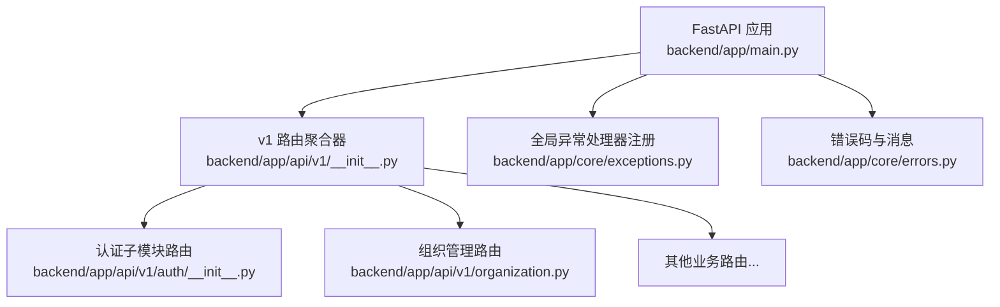
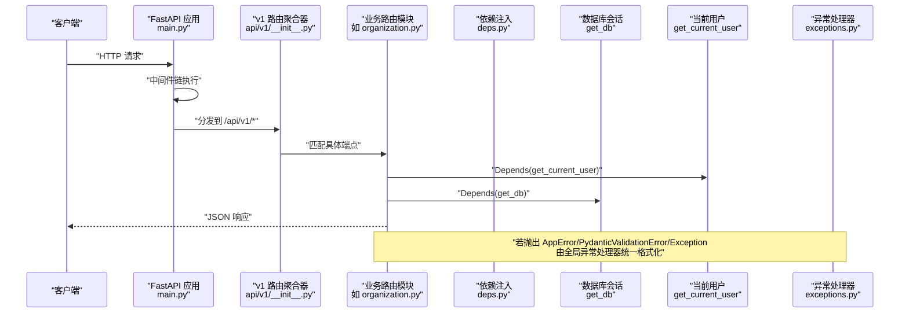
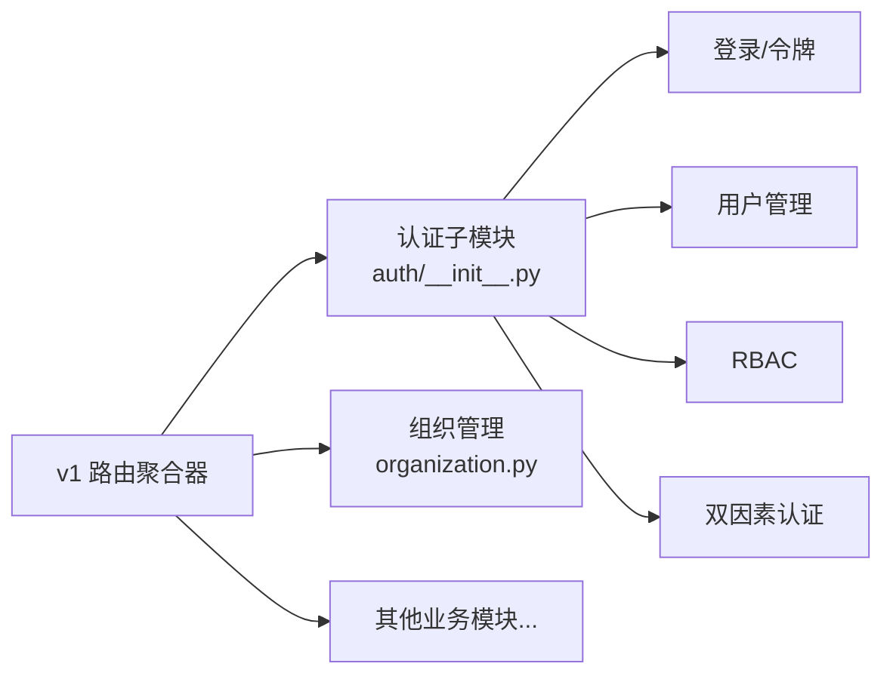
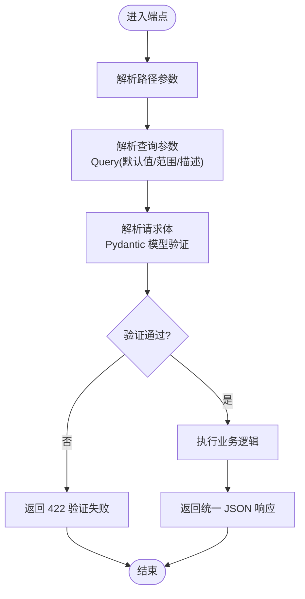
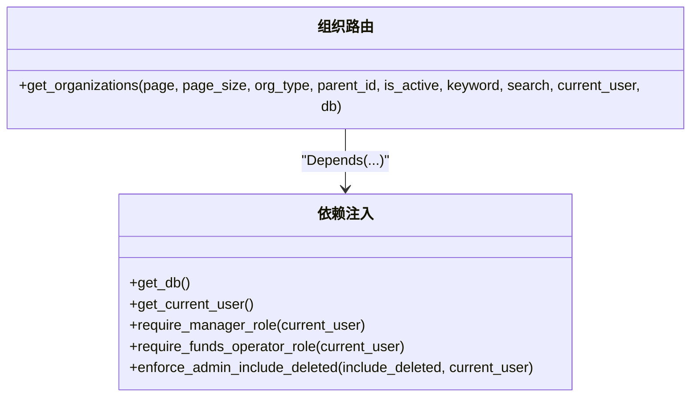
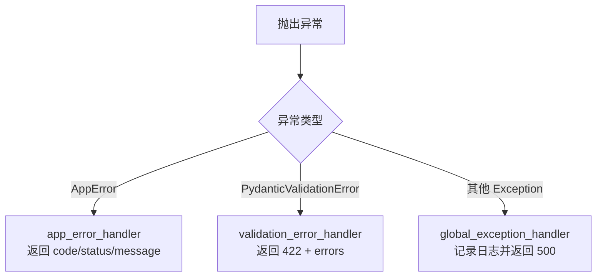
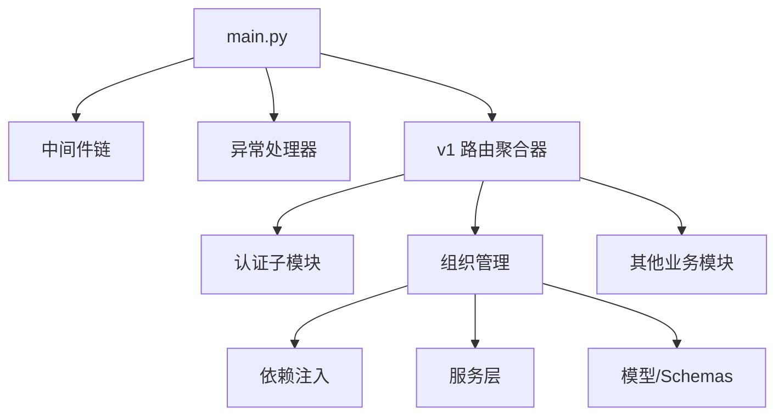

# 路由设计规范

<cite>
**本文引用的文件**
- [backend/app/main.py](file://backend/app/main.py)
- [backend/app/api/v1/__init__.py](file://backend/app/api/v1/__init__.py)
- [backend/app/api/v1/deps.py](file://backend/app/api/v1/deps.py)
- [backend/app/api/v1/auth/__init__.py](file://backend/app/api/v1/auth/__init__.py)
- [backend/app/core/errors.py](file://backend/app/core/errors.py)
- [backend/app/core/exceptions.py](file://backend/app/core/exceptions.py)
- [backend/app/api/v1/organization.py](file://backend/app/api/v1/organization.py)
- [backend/app/schemas/user.py](file://backend/app/schemas/user.py)
</cite>

## 目录
1. [引言](#引言)
2. [项目结构](#项目结构)
3. [核心组件](#核心组件)
4. [架构总览](#架构总览)
5. [详细组件分析](#详细组件分析)
6. [依赖关系分析](#依赖关系分析)
7. [性能考虑](#性能考虑)
8. [故障排查指南](#故障排查指南)
9. [结论](#结论)
10. [附录](#附录)

## 引言
本规范面向 FastAPI 后端的路由设计与实现，聚焦以下目标：
- 统一路径参数、查询参数、请求体参数的类型标注与验证方式
- 明确路由分组与命名空间管理，按业务模块组织路由文件
- 在路由中声明式注入公共依赖（数据库会话、用户认证、权限检查等）
- 规范 HTTP 状态码使用与错误处理统一化
- 配置并启用 OpenAPI/Swagger/ReDoc 文档自动生成
- 给出 RESTful API 设计最佳实践（资源命名、动词选择、嵌套资源处理）

## 项目结构
后端采用“应用入口 + 版本化路由聚合 + 业务模块路由”的分层组织方式：
- 应用入口负责中间件注册、异常处理器注册、静态资源挂载、健康检查、以及将 v1 路由聚合到主应用
- v1 路由聚合器集中引入各业务模块的 router，并按顺序 include_router，保证匹配优先级与可维护性
- 每个业务模块以独立文件定义 APIRouter，并通过 tags 进行功能分组
- 认证相关子模块通过子包聚合多个子路由，形成清晰的命名空间

**图表来源**
- [backend/app/main.py:100-181](file://backend/app/main.py#L100-L181)
- [backend/app/api/v1/__init__.py:29-141](file://backend/app/api/v1/__init__.py#L29-L141)
- [backend/app/api/v1/auth/__init__.py:16-22](file://backend/app/api/v1/auth/__init__.py#L16-L22)
- [backend/app/api/v1/organization.py:30-30](file://backend/app/api/v1/organization.py#L30-L30)
- [backend/app/core/exceptions.py:123-145](file://backend/app/core/exceptions.py#L123-L145)
- [backend/app/core/errors.py:10-87](file://backend/app/core/errors.py#L10-L87)

**章节来源**
- [backend/app/main.py:100-181](file://backend/app/main.py#L100-L181)
- [backend/app/api/v1/__init__.py:29-141](file://backend/app/api/v1/__init__.py#L29-L141)

## 核心组件
- 路由聚合器：在 v1 层级集中引入并注册所有业务模块的 router，确保加载顺序与匹配优先级可控
- 依赖注入：提供统一的数据库会话、当前用户、角色权限校验等依赖项，供各路由复用
- 错误体系：统一错误码枚举、人类可读消息、自定义异常类与全局异常处理器
- 文档生成：在应用初始化时根据调试开关暴露 /docs、/redoc、/openapi.json

**章节来源**
- [backend/app/api/v1/__init__.py:29-141](file://backend/app/api/v1/__init__.py#L29-L141)
- [backend/app/api/v1/deps.py:1-103](file://backend/app/api/v1/deps.py#L1-L103)
- [backend/app/core/errors.py:10-87](file://backend/app/core/errors.py#L10-L87)
- [backend/app/core/exceptions.py:123-145](file://backend/app/core/exceptions.py#L123-L145)
- [backend/app/main.py:100-109](file://backend/app/main.py#L100-L109)

## 架构总览
下图展示从客户端请求到路由处理的完整链路，包括中间件、认证、依赖注入、服务调用与响应返回。

**图表来源**
- [backend/app/main.py:113-165](file://backend/app/main.py#L113-L165)
- [backend/app/api/v1/__init__.py:103-141](file://backend/app/api/v1/__init__.py#L103-L141)
- [backend/app/api/v1/organization.py:126-185](file://backend/app/api/v1/organization.py#L126-L185)
- [backend/app/api/v1/deps.py:1-103](file://backend/app/api/v1/deps.py#L1-L103)
- [backend/app/core/exceptions.py:123-145](file://backend/app/core/exceptions.py#L123-L145)

## 详细组件分析

### 路由分组与命名空间管理
- 版本化前缀：v1 路由统一以 /api/v1 为前缀，便于未来版本演进
- 模块级路由：每个业务模块定义独立的 APIRouter，并通过 tags 标识功能域
- 子模块聚合：认证相关路由拆分为 auth 子包，内部再聚合多个子路由，形成清晰命名空间
- 加载顺序：v1 聚合器按固定顺序 include_router，避免动态导入导致的打包与启动问题

**图表来源**
- [backend/app/api/v1/__init__.py:31-48](file://backend/app/api/v1/__init__.py#L31-L48)
- [backend/app/api/v1/auth/__init__.py:16-22](file://backend/app/api/v1/auth/__init__.py#L16-L22)

**章节来源**
- [backend/app/api/v1/__init__.py:29-141](file://backend/app/api/v1/__init__.py#L29-L141)
- [backend/app/api/v1/auth/__init__.py:16-22](file://backend/app/api/v1/auth/__init__.py#L16-L22)

### 路径参数、查询参数、请求体参数的类型标注与验证
- 路径参数：使用 FastAPI 路径参数语法，结合 Pydantic 模型或原生类型标注，自动完成类型转换与校验
- 查询参数：通过 Query 注解设置默认值、范围约束与描述信息；示例见组织列表分页与过滤
- 请求体参数：使用 Pydantic BaseModel 定义入参与出参，支持可选字段、长度限制、必填校验等
- 统一响应：通过 success_response/ok_list 等封装统一返回结构，便于前端解析

**图表来源**
- [backend/app/api/v1/organization.py:126-185](file://backend/app/api/v1/organization.py#L126-L185)
- [backend/app/schemas/user.py:9-53](file://backend/app/schemas/user.py#L9-L53)
- [backend/app/core/exceptions.py:131-136](file://backend/app/core/exceptions.py#L131-L136)

**章节来源**
- [backend/app/api/v1/organization.py:126-185](file://backend/app/api/v1/organization.py#L126-L185)
- [backend/app/schemas/user.py:9-53](file://backend/app/schemas/user.py#L9-L53)

### 依赖注入在路由中的使用
- 数据库会话：通过 get_db 依赖注入 SQLAlchemy Session，确保请求级生命周期与事务控制
- 用户认证：通过 get_current_user 依赖注入当前登录用户，用于后续权限判断
- 权限检查：提供 require_manager_role、require_funds_operator_role 等依赖函数，集中管理角色与权限策略
- 软删除可见性：enforce_admin_include_deleted 统一收敛 include_deleted 参数权限，防止越权查看已软删记录

**图表来源**
- [backend/app/api/v1/deps.py:1-103](file://backend/app/api/v1/deps.py#L1-L103)
- [backend/app/api/v1/organization.py:126-185](file://backend/app/api/v1/organization.py#L126-L185)

**章节来源**
- [backend/app/api/v1/deps.py:1-103](file://backend/app/api/v1/deps.py#L1-L103)
- [backend/app/api/v1/organization.py:126-185](file://backend/app/api/v1/organization.py#L126-L185)

### HTTP 状态码与错误处理统一化
- 错误码枚举：ErrorCode 集中定义通用与领域错误码，便于日志与响应一致化
- 自定义异常：AppError 及其子类（BusinessError、NotFoundError、ConflictError、DatabaseError 等）承载业务语义
- 全局异常处理器：
  - AppError：返回标准错误结构
  - PydanticValidationError：返回 422 及详细验证错误
  - Exception：兜底捕获未处理异常，返回 500
- 错误消息：ERROR_MESSAGES 提供中文可读消息，便于前端提示与运维定位

**图表来源**
- [backend/app/core/errors.py:10-87](file://backend/app/core/errors.py#L10-L87)
- [backend/app/core/exceptions.py:123-145](file://backend/app/core/exceptions.py#L123-L145)

**章节来源**
- [backend/app/core/errors.py:10-87](file://backend/app/core/errors.py#L10-L87)
- [backend/app/core/exceptions.py:123-145](file://backend/app/core/exceptions.py#L123-L145)

### API 文档自动生成配置
- 在 FastAPI 应用初始化时，根据调试开关暴露 /docs、/redoc、/openapi.json
- 建议生产环境关闭文档访问，或通过反向代理与鉴权保护
- 路由 tags 与 Pydantic 模型将自动反映到 OpenAPI Schema，便于前端联调与测试

**章节来源**
- [backend/app/main.py:100-109](file://backend/app/main.py#L100-L109)

### RESTful API 设计最佳实践
- 资源命名：使用复数名词表示资源集合，如 /api/v1/organizations；避免动词出现在路径中
- 动词选择：GET 获取资源、POST 创建资源、PUT/PATCH 更新资源、DELETE 删除资源
- 嵌套资源：使用路径层次表达资源关系，如 /api/v1/organizations/{org_id}/users
- 查询参数：分页、过滤、排序通过查询参数表达，保持路径简洁
- 状态码：
  - 200/201/204 成功场景
  - 400 参数错误
  - 401 未认证
  - 403 无权限
  - 404 资源不存在
  - 422 验证失败
  - 500 服务器内部错误
- 错误体：统一包含 code、message、details/errors，便于前端处理

[本节为概念性指导，不直接分析具体文件]

## 依赖关系分析
- 应用入口依赖：
  - 中间件：审计、请求日志、CORS、安全头、请求 ID、慢请求监控、查询计数、CSRF、驼峰转蛇形、缓存头、请求体大小限制
  - 异常处理器：统一注册 AppError、验证异常、全局异常
  - 路由聚合：加载 v1 路由并 include_router
- v1 路由聚合器依赖：
  - 认证子模块、数据模块、导入导出、系统、监控、通知、提醒等子路由
  - 业务模块：组织、政策、项目、学校、村庄、资金、工作日志、评估、AI、地图、审批、消息、待办等
- 业务路由依赖：
  - 依赖注入：数据库会话、当前用户、角色权限校验
  - 服务层：组织服务、工作日志服务等
  - 模型与 Schemas：ORM 模型与 Pydantic 模型

**图表来源**
- [backend/app/main.py:113-181](file://backend/app/main.py#L113-L181)
- [backend/app/api/v1/__init__.py:31-141](file://backend/app/api/v1/__init__.py#L31-L141)
- [backend/app/api/v1/organization.py:126-185](file://backend/app/api/v1/organization.py#L126-L185)

**章节来源**
- [backend/app/main.py:113-181](file://backend/app/main.py#L113-L181)
- [backend/app/api/v1/__init__.py:31-141](file://backend/app/api/v1/__init__.py#L31-L141)
- [backend/app/api/v1/organization.py:126-185](file://backend/app/api/v1/organization.py#L126-L185)

## 性能考虑
- 中间件顺序：最外层先执行（如请求 ID），最内层后执行（如慢请求监控），确保全链路追踪与性能指标采集
- 路由匹配：静态导入与固定 include_router 顺序，减少动态导入开销并提升启动稳定性
- 缓存策略：对读多写少的列表接口使用缓存键与 TTL，写操作后主动失效相关缓存
- 查询优化：合理使用分页、过滤条件与索引，避免全表扫描
- 静态资源：带 hash 的文件名设置长期缓存与 immutable，非 hash 资源禁用强缓存

[本节为通用性能建议，不直接分析具体文件]

## 故障排查指南
- 启动阶段：
  - 检查 v1 路由聚合器是否成功加载所有业务模块，任一模块损坏会快速失败
  - 确认中间件注册顺序与依赖可用（如 CSRF、CORS、安全头）
- 运行时：
  - 422 验证失败：查看 Pydantic 验证错误详情，修正请求体或查询参数
  - 401/403 权限问题：检查当前用户角色与依赖注入的权限校验逻辑
  - 500 内部错误：查看全局异常处理器日志，定位未捕获异常
- 文档：
  - 若 /docs 不可用，检查调试开关与反向代理配置

**章节来源**
- [backend/app/api/v1/__init__.py:142-145](file://backend/app/api/v1/__init__.py#L142-L145)
- [backend/app/core/exceptions.py:123-145](file://backend/app/core/exceptions.py#L123-L145)
- [backend/app/main.py:100-109](file://backend/app/main.py#L100-L109)

## 结论
本规范基于现有代码库的路由组织、依赖注入与错误处理实践，总结了 FastAPI 路由设计的统一方式与最佳实践。通过版本化路由聚合、模块化管理、声明式依赖注入与统一错误体系，可实现高内聚、低耦合、易维护的 API 服务。建议在新增业务模块时遵循本规范，确保一致性、可测试性与可扩展性。

[本节为总结性内容，不直接分析具体文件]

## 附录
- 参考示例：
  - 组织列表端点展示了查询参数分页与过滤、依赖注入、缓存与统一响应的组合用法
  - 用户 Schemas 展示了 Pydantic 模型的字段约束与可选字段设计
- 扩展建议：
  - 为复杂查询增加查询构建器或服务层封装，避免在路由中堆砌过滤逻辑
  - 为敏感操作增加审计日志与幂等性保障
  - 为外部依赖调用增加超时与重试策略

[本节为补充说明，不直接分析具体文件]