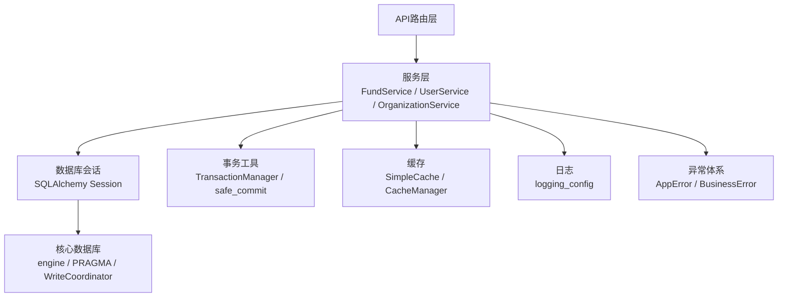
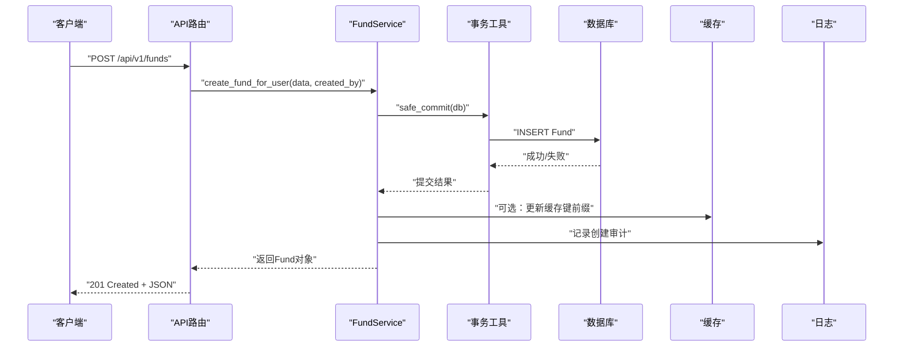
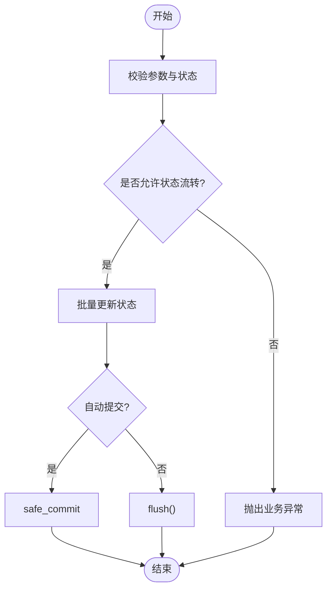
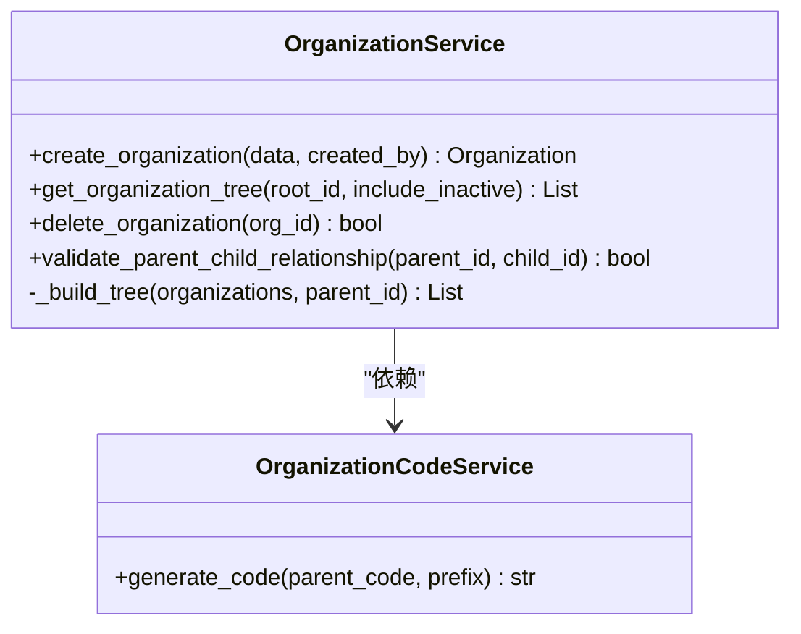
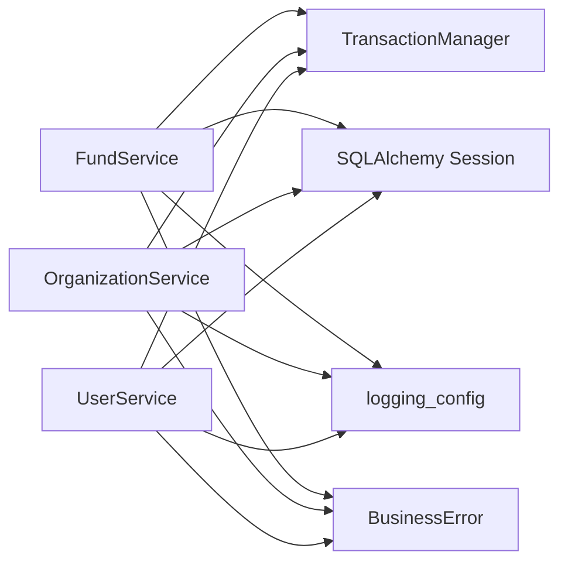
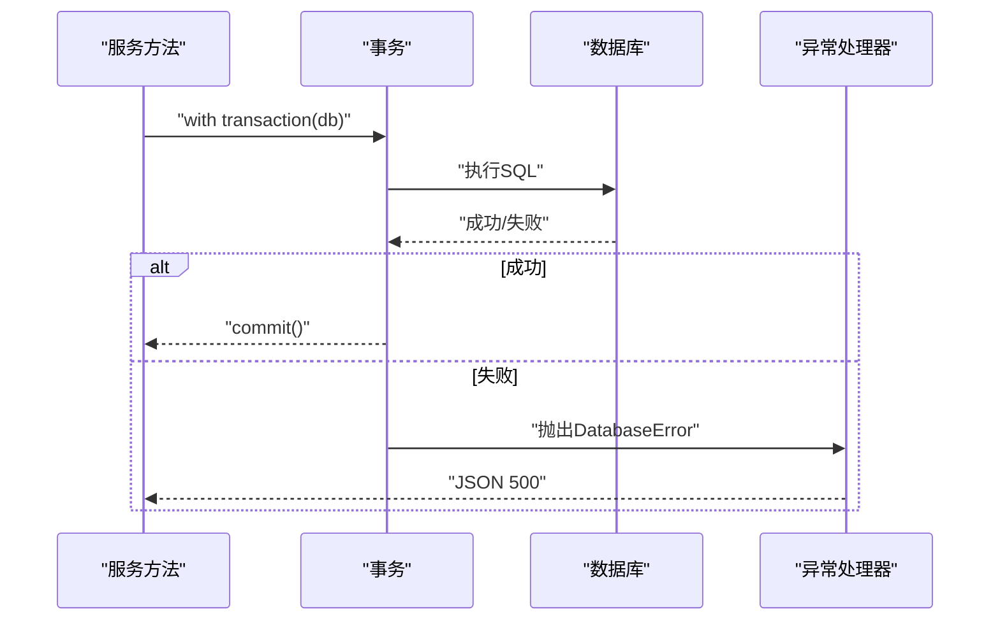
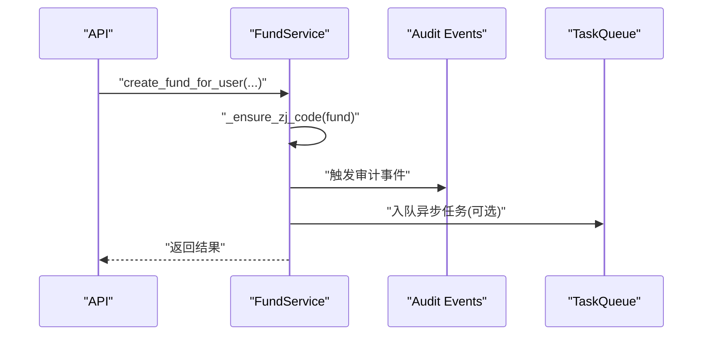

# 业务服务实现

<cite>
**本文引用的文件**
- [backend/app/main.py](file://backend/app/main.py)
- [backend/app/core/config.py](file://backend/app/core/config.py)
- [backend/app/core/database.py](file://backend/app/core/database.py)
- [backend/app/core/transaction.py](file://backend/app/core/transaction.py)
- [backend/app/core/cache.py](file://backend/app/core/cache.py)
- [backend/app/core/logging_config.py](file://backend/app/core/logging_config.py)
- [backend/app/core/exceptions.py](file://backend/app/core/exceptions.py)
- [backend/app/services/fund_service.py](file://backend/app/services/fund_service.py)
- [backend/app/services/user_service.py](file://backend/app/services/user_service.py)
- [backend/app/services/organization_service.py](file://backend/app/services/organization_service.py)
- [backend/tests/unit/conftest.py](file://backend/tests/unit/conftest.py)
</cite>

## 目录
1. [简介](#简介)
2. [项目结构](#项目结构)
3. [核心组件](#核心组件)
4. [架构总览](#架构总览)
5. [详细组件分析](#详细组件分析)
6. [依赖关系分析](#依赖关系分析)
7. [性能与并发](#性能与并发)
8. [事务、异常与日志](#事务异常与日志)
9. [缓存策略](#缓存策略)
10. [复杂业务流程编排](#复杂业务流程编排)
11. [单元测试与Mock策略](#单元测试与mock策略)
12. [故障排查指南](#故障排查指南)
13. [结论](#结论)

## 简介
本文件面向“乡村振兴帮扶管理系统”后端的服务层实现，围绕DDD领域驱动设计思想，系统化说明业务服务的职责划分、接口设计、依赖注入、事务管理、异常处理、日志记录、复杂流程编排、缓存与性能优化、并发控制、数据一致性保障与错误恢复机制，并给出单元测试编写指导与Mock策略。目标是帮助开发者在现有代码基础上扩展与维护业务服务时，遵循一致的模式与最佳实践。

## 项目结构
系统采用分层架构：API路由层 → 服务层（业务逻辑）→ 仓储/模型层（数据访问）→ 基础设施（数据库、缓存、配置、日志等）。服务层以领域聚合为中心组织，例如资金、用户、组织等，每个服务聚焦单一职责，并通过依赖注入获取数据库会话与协作服务。

**图表来源**
- [backend/app/services/fund_service.py:29-130](file://backend/app/services/fund_service.py#L29-L130)
- [backend/app/services/user_service.py:20-118](file://backend/app/services/user_service.py#L20-L118)
- [backend/app/services/organization_service.py:70-156](file://backend/app/services/organization_service.py#L70-L156)
- [backend/app/core/database.py:55-67](file://backend/app/core/database.py#L55-L67)
- [backend/app/core/transaction.py:48-197](file://backend/app/core/transaction.py#L48-L197)
- [backend/app/core/cache.py:14-137](file://backend/app/core/cache.py#L14-L137)
- [backend/app/core/logging_config.py:161-274](file://backend/app/core/logging_config.py#L161-L274)
- [backend/app/core/exceptions.py:11-145](file://backend/app/core/exceptions.py#L11-L145)

**章节来源**
- [backend/app/main.py:100-181](file://backend/app/main.py#L100-L181)
- [backend/app/core/config.py:54-183](file://backend/app/core/config.py#L54-L183)

## 核心组件
- 应用入口与生命周期：FastAPI应用初始化、中间件注册、路由加载、健康检查、启动任务（备份调度、资源监控、数据库健康监控、任务队列等）。
- 配置中心：集中式Settings，支持环境变量、加密密钥、路径动态化、生产环境安全基线强制。
- 数据库核心：SQLite深度调优（WAL、PRAGMA）、连接池、写入协调器（长事务独占写）、磁盘空间检查。
- 事务管理：上下文管理器、装饰器、保存点、批量操作、死锁重试。
- 缓存：线程安全内存缓存、TTL、异步包装、装饰器缓存。
- 日志：结构化JSON日志、按天/大小轮转、敏感信息脱敏、Windows兼容。
- 异常：统一异常体系与全局处理器，业务错误分类清晰。

**章节来源**
- [backend/app/main.py:68-181](file://backend/app/main.py#L68-L181)
- [backend/app/core/config.py:54-383](file://backend/app/core/config.py#L54-L383)
- [backend/app/core/database.py:55-187](file://backend/app/core/database.py#L55-L187)
- [backend/app/core/transaction.py:48-197](file://backend/app/core/transaction.py#L48-L197)
- [backend/app/core/cache.py:14-137](file://backend/app/core/cache.py#L14-L137)
- [backend/app/core/logging_config.py:161-274](file://backend/app/core/logging_config.py#L161-L274)
- [backend/app/core/exceptions.py:11-145](file://backend/app/core/exceptions.py#L11-L145)

## 架构总览
服务层作为DDD的“应用服务”与“领域服务”的结合体，负责编排领域对象与基础设施调用，保证业务规则、事务边界、异常语义与可观测性。

**图表来源**
- [backend/app/services/fund_service.py:132-185](file://backend/app/services/fund_service.py#L132-L185)
- [backend/app/core/transaction.py:200-234](file://backend/app/core/transaction.py#L200-L234)
- [backend/app/core/cache.py:98-137](file://backend/app/core/cache.py#L98-L137)
- [backend/app/core/logging_config.py:161-274](file://backend/app/core/logging_config.py#L161-L274)

## 详细组件分析

### 资金服务（FundService）
- 职责：经费实体的CRUD、状态机流转、批量更新、查询优化（joinedload/selectinload避免N+1）。
- 事务：默认自动提交；复杂流程可通过auto_commit=False挂起事务由外层统一提交。
- 状态机：定义合法状态转移表，批量更新时校验每条记录的当前状态到目标状态的合法性，任一非法则整体拒绝。
- 性能：使用SQLAlchemy 2.0语句构建查询，count与data分离，unique去重避免笛卡尔积。

**图表来源**
- [backend/app/services/fund_service.py:230-288](file://backend/app/services/fund_service.py#L230-L288)
- [backend/app/core/transaction.py:200-234](file://backend/app/core/transaction.py#L200-L234)

**章节来源**
- [backend/app/services/fund_service.py:29-130](file://backend/app/services/fund_service.py#L29-L130)
- [backend/app/services/fund_service.py:132-185](file://backend/app/services/fund_service.py#L132-L185)
- [backend/app/services/fund_service.py:230-288](file://backend/app/services/fund_service.py#L230-L288)

### 用户服务（UserService）
- 职责：用户CRUD、角色规范化、密码哈希、列表过滤与分页。
- 事务：每次写操作通过safe_commit确保提交或回滚。
- 验证：角色集合来自常量，防止非法角色值。

**章节来源**
- [backend/app/services/user_service.py:20-118](file://backend/app/services/user_service.py#L20-L118)

### 组织服务（OrganizationService）
- 职责：组织树构建、层级管理、编码生成、统计、搜索、父子关系校验（防循环引用）、删除前引用检查。
- 事务：创建/更新/删除均通过safe_commit提交。
- 业务规则：删除前检查是否存在激活的下级单位或被项目/用户引用，抛出明确业务异常。

**图表来源**
- [backend/app/services/organization_service.py:70-156](file://backend/app/services/organization_service.py#L70-L156)
- [backend/app/services/organization_service.py:466-486](file://backend/app/services/organization_service.py#L466-L486)

**章节来源**
- [backend/app/services/organization_service.py:70-156](file://backend/app/services/organization_service.py#L70-L156)
- [backend/app/services/organization_service.py:318-398](file://backend/app/services/organization_service.py#L318-L398)
- [backend/app/services/organization_service.py:466-486](file://backend/app/services/organization_service.py#L466-L486)

## 依赖关系分析
- 服务层依赖：
  - 数据库会话：通过构造函数注入Session，避免全局状态耦合。
  - 事务工具：safe_commit、TransactionManager提供统一事务边界。
  - 缓存：SimpleCache/CacheManager用于读多写少场景的加速。
  - 日志：统一日志配置，所有服务模块使用标准logger。
  - 异常：业务异常继承BusinessError，便于全局处理器统一响应。
- 外部依赖：
  - SQLAlchemy引擎与PRAGMA调优。
  - FastAPI中间件链（请求ID、审计、CSRF、CORS、限流等）。

**图表来源**
- [backend/app/services/fund_service.py:29-130](file://backend/app/services/fund_service.py#L29-L130)
- [backend/app/services/organization_service.py:70-156](file://backend/app/services/organization_service.py#L70-L156)
- [backend/app/services/user_service.py:20-118](file://backend/app/services/user_service.py#L20-L118)
- [backend/app/core/transaction.py:48-197](file://backend/app/core/transaction.py#L48-L197)
- [backend/app/core/logging_config.py:161-274](file://backend/app/core/logging_config.py#L161-L274)
- [backend/app/core/exceptions.py:47-145](file://backend/app/core/exceptions.py#L47-L145)

**章节来源**
- [backend/app/core/database.py:55-187](file://backend/app/core/database.py#L55-L187)
- [backend/app/core/config.py:54-183](file://backend/app/core/config.py#L54-L183)

## 性能与并发
- 数据库并发：
  - SQLite WAL模式与PRAGMA优化（cache_size、mmap_size、busy_timeout、optimize）。
  - 长事务独占写：SQLiteWriteCoordinator.exclusive_write避免大批量导入时的忙锁冲突。
  - 连接池：QueuePool限制连接数，预检与回收策略降低连接抖动。
- 查询优化：
  - joinedload/selectinload预加载关联，避免N+1。
  - count与data分离查询，unique去重。
- 缓存：
  - SimpleCache线程安全，支持TTL与按前缀删除，适合热点数据。
  - cache_result装饰器简化方法级缓存。
- 中间件：
  - 慢请求监控、查询计数、请求ID链路追踪，辅助定位瓶颈。

**章节来源**
- [backend/app/core/database.py:78-172](file://backend/app/core/database.py#L78-L172)
- [backend/app/core/database.py:198-285](file://backend/app/core/database.py#L198-L285)
- [backend/app/services/fund_service.py:55-99](file://backend/app/services/fund_service.py#L55-L99)
- [backend/app/core/cache.py:14-137](file://backend/app/core/cache.py#L14-L137)
- [backend/app/main.py:117-165](file://backend/app/main.py#L117-L165)

## 事务、异常与日志
- 事务管理：
  - TransactionManager.transaction/safe_commit提供统一提交/回滚语义。
  - nested_transaction/savepoint支持复杂流程中的局部回滚。
  - with_transaction装饰器支持隔离级别与只读事务（非SQLite直接短路）。
  - retry_on_deadlock对死锁进行有限重试。
- 异常处理：
  - AppError/BusinessError/DatabaseError等分类清晰。
  - register_exception_handlers统一映射为JSON响应，包含code/message/details。
  - PydanticValidationError与全局Exception捕获兜底。
- 日志记录：
  - init_logging统一配置，JSON格式输出，按天/大小轮转。
  - SensitiveDataFilter对身份证、手机号、邮箱、密钥等脱敏。
  - Windows兼容的文件轮转处理，避免WinError 32。

**图表来源**
- [backend/app/core/transaction.py:48-197](file://backend/app/core/transaction.py#L48-L197)
- [backend/app/core/exceptions.py:123-145](file://backend/app/core/exceptions.py#L123-L145)
- [backend/app/core/logging_config.py:161-274](file://backend/app/core/logging_config.py#L161-L274)

**章节来源**
- [backend/app/core/transaction.py:48-197](file://backend/app/core/transaction.py#L48-L197)
- [backend/app/core/exceptions.py:11-145](file://backend/app/core/exceptions.py#L11-L145)
- [backend/app/core/logging_config.py:161-274](file://backend/app/core/logging_config.py#L161-L274)

## 缓存策略
- 适用场景：读多写少的配置项、字典数据、统计摘要。
- 策略：
  - SimpleCache：线程安全、TTL过期、最大容量淘汰。
  - CacheManager：异步包装，支持await语法。
  - cache_result装饰器：方法级缓存，key可由自定义函数构建。
- 失效：按前缀删除（如实体变更时清理相关缓存）。

**章节来源**
- [backend/app/core/cache.py:14-137](file://backend/app/core/cache.py#L14-L137)

## 复杂业务流程编排
- 多步骤操作：通过auto_commit=False将多个服务调用纳入同一事务，外层统一提交，避免半截子数据。
- 状态机管理：资金状态机FUND_TRANSITIONS约束合法流转，批量更新时整体校验。
- 事件驱动：
  - 审计事件监听：setup_audit_events在启动时注册SQLAlchemy写操作审计钩子。
  - 后台任务：task_queue.start/stop管理异步导出等任务。
- 编排示例：创建经费→生成编号→写入历史→发布审计事件→更新缓存。

**图表来源**
- [backend/app/main.py:167-181](file://backend/app/main.py#L167-L181)
- [backend/app/services/fund_service.py:132-185](file://backend/app/services/fund_service.py#L132-L185)

**章节来源**
- [backend/app/main.py:68-98](file://backend/app/main.py#L68-L98)
- [backend/app/services/fund_service.py:132-185](file://backend/app/services/fund_service.py#L132-L185)

## 单元测试与Mock策略
- 测试配置：conftest中Mock重型依赖（sklearn、scipy），平台相关用例在Linux CI跳过。
- Mock建议：
  - 数据库：使用pytest-mock或unittest.mock替换SessionLocal/get_db，断言SQL或ORM调用。
  - 缓存：注入SimpleCache实例，验证set/get/delete行为。
  - 事务：验证safe_commit被调用次数与参数。
  - 异常：断言抛出的BusinessError类型与消息。
- 覆盖范围：服务方法、状态机流转、批量操作、边界条件（空列表、非法状态、重复编码）。

**章节来源**
- [backend/tests/unit/conftest.py:1-67](file://backend/tests/unit/conftest.py#L1-L67)

## 故障排查指南
- 迁移失败：
  - /health暴露migration.at_head与error_type，生产环境迁移失败中止启动。
  - 查看日志中的Alembic升级错误栈。
- 数据库忙锁：
  - 长事务使用exclusive_write包裹；短事务依赖busy_timeout自动重试。
  - 检查是否有未提交的长事务阻塞写入。
- 缓存不一致：
  - 写操作后按前缀删除缓存；确认TTL设置合理。
- 日志缺失：
  - 检查init_logging是否调用；确认LOG_FILE路径存在且可写；Windows下轮转失败会降级继续写入。
- 异常未捕获：
  - 确认register_exception_handlers已注册；检查全局Exception处理器是否返回友好JSON。

**章节来源**
- [backend/app/main.py:237-262](file://backend/app/main.py#L237-L262)
- [backend/app/main.py:436-507](file://backend/app/main.py#L436-L507)
- [backend/app/core/database.py:198-285](file://backend/app/core/database.py#L198-L285)
- [backend/app/core/logging_config.py:161-274](file://backend/app/core/logging_config.py#L161-L274)
- [backend/app/core/exceptions.py:123-145](file://backend/app/core/exceptions.py#L123-L145)

## 结论
该系统的服务层以DDD为核心，结合清晰的职责划分、统一的事务与异常处理、完善的日志与缓存机制，支撑了复杂的业务编排与高并发场景下的稳定性。通过状态机、批量操作、独占写协调器等手段，保证了数据一致性与性能。建议在新增业务服务时遵循相同模式：单一职责、显式事务边界、健壮的错误恢复、可观测的日志与指标、以及充分的单元测试覆盖。