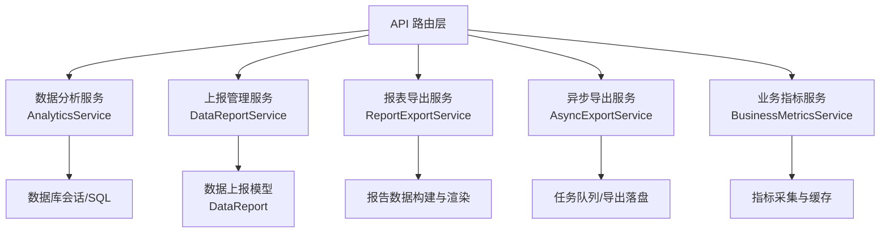
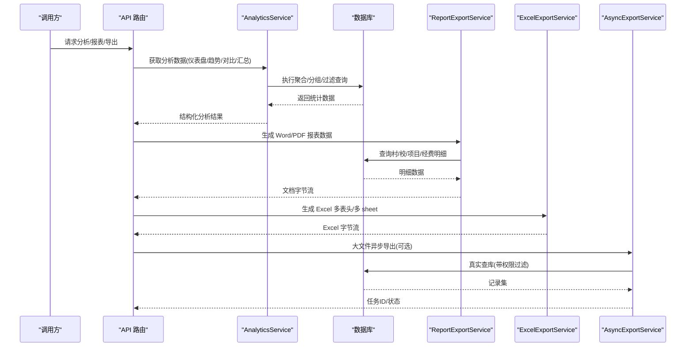
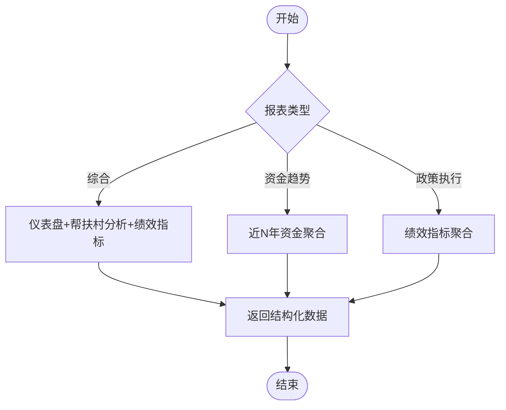
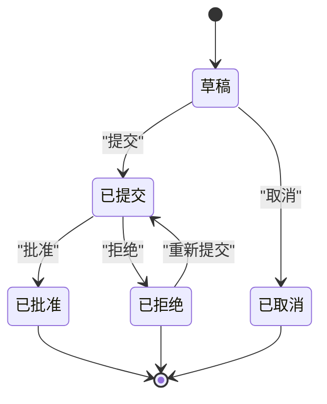
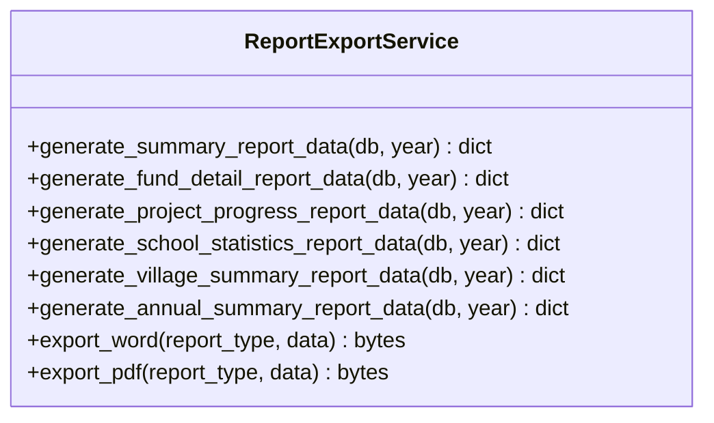
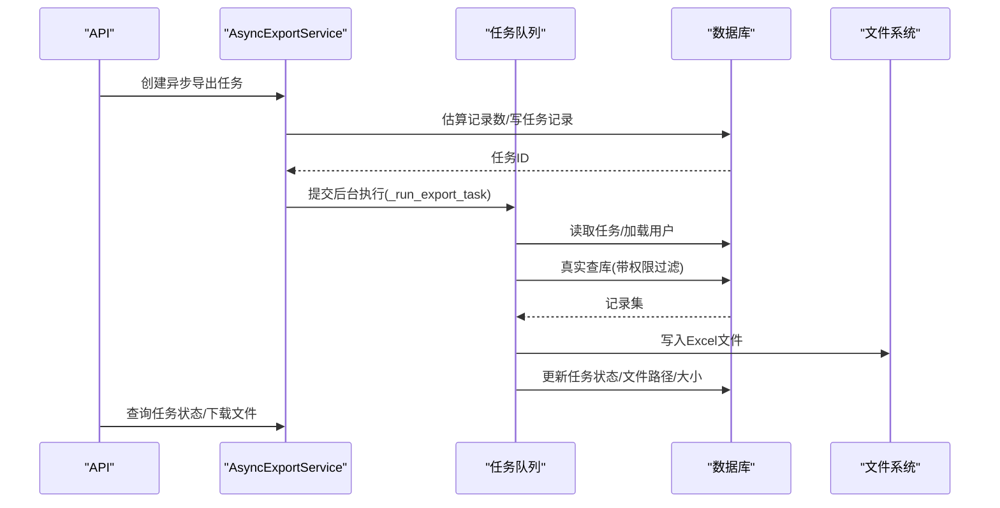
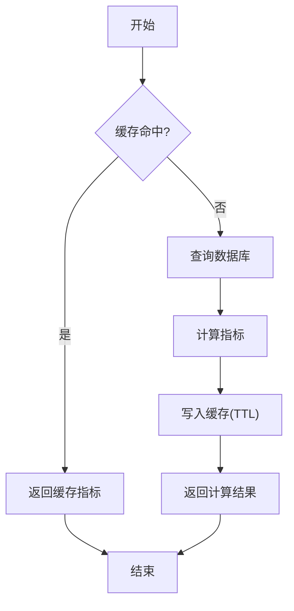
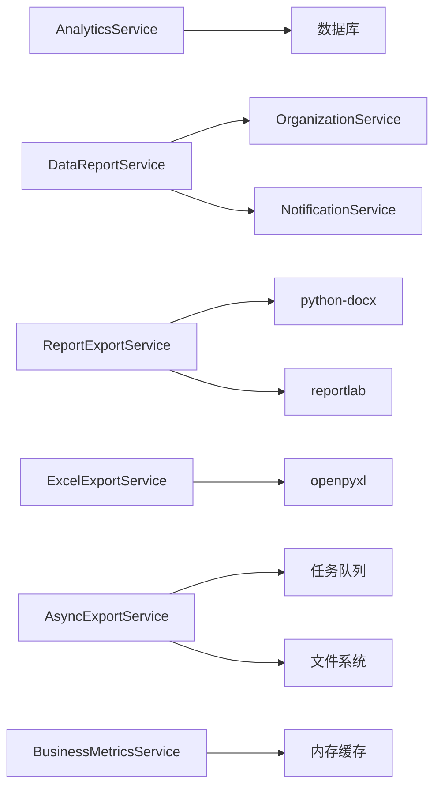

# 分析报表服务

<cite>
**本文引用的文件**
- [analytics_service.py](file://backend/app/services/analytics_service.py)
- [data_report_service.py](file://backend/app/services/data_report_service.py)
- [report_export_service.py](file://backend/app/services/report_export_service.py)
- [export_service.py](file://backend/app/services/export_service.py)
- [async_export_service.py](file://backend/app/services/async_export_service.py)
- [business_metrics_service.py](file://backend/app/services/business_metrics_service.py)
- [data_report.py](file://backend/app/models/data_report.py)
- [report_template.py](file://backend/app/models/report_template.py)
</cite>

## 目录
1. [简介](#简介)
2. [项目结构](#项目结构)
3. [核心组件](#核心组件)
4. [架构总览](#架构总览)
5. [详细组件分析](#详细组件分析)
6. [依赖关系分析](#依赖关系分析)
7. [性能考虑](#性能考虑)
8. [故障排查指南](#故障排查指南)
9. [结论](#结论)
10. [附录](#附录)

## 简介
本文件面向“分析报表服务”，系统性说明数据分析算法、报表生成流程、导出服务实现、业务指标监控、可视化后端支持以及性能优化与质量保障方法。内容基于仓库中数据分析、上报管理、报表导出、异步导出、业务指标等服务的实际实现进行梳理，帮助读者快速理解并正确使用相关能力。

## 项目结构
围绕分析报表的核心代码主要分布在 services 层（分析与导出）、models 层（数据模型）以及若干 API 路由与服务协作：
- 数据分析与分析聚合：AnalyticsService
- 数据上报与审批流：DataReportService + DataReport 模型
- 报表模板与格式配置：ReportTemplate 模型
- 报表导出（Word/PDF）：ReportExportService
- Excel 导出与多 Sheet 综合报表：ExcelExportService
- 大文件异步导出与任务追踪：AsyncExportService
- 业务指标监控与 Prometheus 导出：BusinessMetricsService

**图表来源**
- [analytics_service.py:22-385](file://backend/app/services/analytics_service.py#L22-L385)
- [data_report_service.py:81-492](file://backend/app/services/data_report_service.py#L81-L492)
- [report_export_service.py:46-448](file://backend/app/services/report_export_service.py#L46-L448)
- [async_export_service.py:390-516](file://backend/app/services/async_export_service.py#L390-L516)
- [business_metrics_service.py:22-376](file://backend/app/services/business_metrics_service.py#L22-L376)

**章节来源**
- [analytics_service.py:22-385](file://backend/app/services/analytics_service.py#L22-L385)
- [data_report_service.py:81-492](file://backend/app/services/data_report_service.py#L81-L492)
- [report_export_service.py:46-448](file://backend/app/services/report_export_service.py#L46-L448)
- [async_export_service.py:390-516](file://backend/app/services/async_export_service.py#L390-L516)
- [business_metrics_service.py:22-376](file://backend/app/services/business_metrics_service.py#L22-L376)

## 核心组件
- 数据分析服务：提供仪表盘总览、帮扶村分析、资金趋势、绩效指标、对比分析、汇总统计、筛选与钻取、对比与年度对比、筛选选项、导出入口等能力。
- 上报管理服务：负责上报创建、提交、审批、查询、统计与下级单位仪表板，包含状态机校验与通知机制。
- 报表导出服务：统一数据结构构建（村/校/项目/经费），支持 Word/PDF 渲染输出。
- Excel 导出服务：通用工作簿构建、多 sheet 综合报表导出、列宽自适应与页脚水印。
- 异步导出服务：按实体类型真实查库、阈值判断是否异步、后台执行体落盘、任务状态流转与下载。
- 业务指标服务：资金审批、资金使用、数据上报、用户活跃度、系统错误率等指标计算与 Prometheus 导出。

**章节来源**
- [analytics_service.py:22-703](file://backend/app/services/analytics_service.py#L22-L703)
- [data_report_service.py:81-492](file://backend/app/services/data_report_service.py#L81-L492)
- [report_export_service.py:46-448](file://backend/app/services/report_export_service.py#L46-L448)
- [export_service.py:10-190](file://backend/app/services/export_service.py#L10-L190)
- [async_export_service.py:30-516](file://backend/app/services/async_export_service.py#L30-L516)
- [business_metrics_service.py:22-376](file://backend/app/services/business_metrics_service.py#L22-L376)

## 架构总览
分析报表服务采用“服务层”为核心，向上对接 API 路由，向下通过 SQLAlchemy 访问数据库，并通过任务队列完成大文件异步导出；同时提供业务指标采集与导出能力。

**图表来源**
- [analytics_service.py:28-385](file://backend/app/services/analytics_service.py#L28-L385)
- [report_export_service.py:55-300](file://backend/app/services/report_export_service.py#L55-L300)
- [export_service.py:134-186](file://backend/app/services/export_service.py#L134-L186)
- [async_export_service.py:330-387](file://backend/app/services/async_export_service.py#L330-L387)

## 详细组件分析

### 数据分析服务（AnalyticsService）
- 统计指标计算
  - 仪表盘总览：按省份统计帮扶村数量、振兴梯队分布、总数统计。
  - 帮扶村分析：投资总额/均值/最大值、人口总量/常住人口/常住比例、人均收入与县域平均收入、基础设施投资分类汇总。
  - 资金趋势：近 N 年资金总额、军地/地方资金拆分、覆盖村数。
  - 绩效指标：政策发布情况、示范村统计、产业/基建/医疗/教育投资分类汇总。
  - 对比分析：按省份或梯队维度对比投资与收入。
  - 汇总统计：按年份与筛选条件聚合村特征、人口、收入、产业/基建/教育投资等。
- 趋势分析与相关性
  - 资金趋势以年份为时间轴，聚合资金与村数，便于趋势观察。
  - 对比分析提供跨维度比较，辅助发现差异与关联。
- 报表数据生成
  - 综合报表：整合仪表盘、帮扶村分析、绩效指标。
  - 专项报表：资金趋势、政策执行等。
- 筛选与钻取
  - 多维度筛选：省份、梯队、区域范围、部门、三区三州、重点县等，结合数据权限过滤。
  - 数据钻取：按维度（如省份）展开具体村庄列表。
  - 对比与年度对比：支持多村对比与多年指标对比接口。
- 导出入口
  - 将分析结果转换为 Excel 列表导出。

**图表来源**
- [analytics_service.py:28-385](file://backend/app/services/analytics_service.py#L28-L385)

**章节来源**
- [analytics_service.py:28-703](file://backend/app/services/analytics_service.py#L28-L703)

### 数据上报管理服务（DataReportService）
- 上报生命周期
  - 创建：校验数据包与上下级组织关系，生成唯一上报编码，写入草稿。
  - 提交：状态机校验，更新提交信息与时间，通知上级。
  - 审批：根据动作更新批准/拒绝状态，记录审批人与意见，通知下级。
- 查询与统计
  - 下级上报列表、本单位提交列表分页查询。
  - 上报统计：各状态计数、逾期数、批准率、按来源组织与月份分布。
  - 下级单位仪表板：一次性批量查询避免 N+1，统计上报率、待审数、逾期数等。
- 通知机制
  - 简化通知服务，记录通知内容与发送时间。

**图表来源**
- [data_report_service.py:87-103](file://backend/app/services/data_report_service.py#L87-L103)
- [data_report.py:19-27](file://backend/app/models/data_report.py#L19-L27)

**章节来源**
- [data_report_service.py:110-492](file://backend/app/services/data_report_service.py#L110-L492)
- [data_report.py:29-141](file://backend/app/models/data_report.py#L29-L141)

### 报表导出服务（ReportExportService）
- 数据构建
  - 年度帮扶工作总结：合并村/校/项目/经费四部分。
  - 经费明细：按经费类型分组聚合，含合计行。
  - 项目进度：按状态分组，含平均进度、预算与实际花费。
  - 学校统计：学校数、学生数、教师数。
  - 帮扶村汇总：在册村数。
  - 年度综合总结：合并上述模块形成完整报告。
- 渲染输出
  - Word：使用 python-docx，设置中文字体、标题居中、表格样式。
  - PDF：使用 reportlab，注册内置 CID 中文字体，段落/表格样式化。
  - 空数据处理：无数据时输出“暂无数据”提示，避免空文件。

**图表来源**
- [report_export_service.py:46-448](file://backend/app/services/report_export_service.py#L46-L448)

**章节来源**
- [report_export_service.py:55-448](file://backend/app/services/report_export_service.py#L55-L448)

### Excel 导出服务（ExcelExportService）
- 通用工作簿构建：表头样式、边框、对齐、自适应列宽、页脚水印（审计溯源）。
- 多场景导出：用户列表、村庄列表、学校列表、项目列表、经费列表。
- 综合报表：多 sheet（汇总/村庄/项目/经费），键值对展示摘要。

**章节来源**
- [export_service.py:10-190](file://backend/app/services/export_service.py#L10-L190)

### 异步导出服务（AsyncExportService）
- 阈值判断：超过阈值（默认 5000 条）自动走异步通道。
- 真实查库：按实体类型（村/校/项目/经费/政策）与筛选条件查询，应用数据权限过滤。
- 综合报表：生成摘要与有限明细（限制条数）的多 sheet 工作簿。
- 任务执行体：独立会话、状态流转（pending→processing→completed/failed）、落盘与元信息更新。
- 同步导出：直接生成 Excel 字节流返回。
- 任务查询与下载：按 task_id 查询任务状态与下载文件。

**图表来源**
- [async_export_service.py:330-387](file://backend/app/services/async_export_service.py#L330-L387)
- [async_export_service.py:390-516](file://backend/app/services/async_export_service.py#L390-L516)

**章节来源**
- [async_export_service.py:30-516](file://backend/app/services/async_export_service.py#L30-L516)

### 业务指标服务（BusinessMetricsService）
- 关键指标定义
  - 资金审批：成功率、平均审批时间、待审批数。
  - 资金使用：拨付率、各状态分布、总金额。
  - 数据上报：完成率、及时率。
  - 用户活跃度：7天活跃用户、30天新增用户、活动率。
  - 系统错误率：24小时错误率、总请求数。
- 缓存策略：内存缓存（TTL=60秒）降低重复查询压力。
- Prometheus 导出：将指标序列化为标准格式供监控系统抓取。

**图表来源**
- [business_metrics_service.py:22-376](file://backend/app/services/business_metrics_service.py#L22-L376)

**章节来源**
- [business_metrics_service.py:22-376](file://backend/app/services/business_metrics_service.py#L22-L376)

### 报表模板（ReportTemplate）
- 模板类型：导入模板、导出模板。
- 关联模块：村、校、经费、项目、农村工作、综合。
- 字段映射与格式配置：JSON 存储，用于 Excel 列与数据库字段映射及页面/打印格式控制。
- 启用状态与创建人：便于管理与审计。

**章节来源**
- [report_template.py:26-73](file://backend/app/models/report_template.py#L26-L73)

## 依赖关系分析
- AnalyticsService 依赖数据库会话与 ORM/SQL 聚合查询，产出结构化分析数据。
- DataReportService 依赖组织服务与通知服务，维护上报状态机与统计。
- ReportExportService 依赖数据库查询与文档渲染库（python-docx、reportlab）。
- ExcelExportService 依赖 openpyxl，提供通用工作簿构建与多 sheet 导出。
- AsyncExportService 依赖任务队列、数据库会话与文件系统，实现大文件异步导出。
- BusinessMetricsService 依赖数据库与内存缓存，提供指标计算与 Prometheus 导出。

**图表来源**
- [analytics_service.py:22-703](file://backend/app/services/analytics_service.py#L22-L703)
- [data_report_service.py:81-492](file://backend/app/services/data_report_service.py#L81-L492)
- [report_export_service.py:46-448](file://backend/app/services/report_export_service.py#L46-L448)
- [export_service.py:10-190](file://backend/app/services/export_service.py#L10-L190)
- [async_export_service.py:390-516](file://backend/app/services/async_export_service.py#L390-L516)
- [business_metrics_service.py:22-376](file://backend/app/services/business_metrics_service.py#L22-L376)

**章节来源**
- [analytics_service.py:22-703](file://backend/app/services/analytics_service.py#L22-L703)
- [data_report_service.py:81-492](file://backend/app/services/data_report_service.py#L81-L492)
- [report_export_service.py:46-448](file://backend/app/services/report_export_service.py#L46-L448)
- [export_service.py:10-190](file://backend/app/services/export_service.py#L10-L190)
- [async_export_service.py:390-516](file://backend/app/services/async_export_service.py#L390-L516)
- [business_metrics_service.py:22-376](file://backend/app/services/business_metrics_service.py#L22-L376)

## 性能考虑
- 查询优化
  - 使用聚合函数与分组减少数据回传量（如 SUM/COUNT/AVG）。
  - 限定最新年份与软删除过滤，避免全表扫描。
  - 批量查询与一次性加载避免 N+1 问题（如下级单位仪表板）。
- 缓存策略
  - 业务指标服务使用内存缓存（TTL=60秒）降低高频指标查询压力。
  - 可结合 Redis 扩展为分布式缓存（当前实现为进程内缓存）。
- 异步处理
  - 大文件导出采用异步任务队列，后台线程执行，避免阻塞主请求。
  - 任务状态持久化，支持进度查询与失败重试。
- 分页与限流
  - 列表与筛选接口支持分页，防止大数据量导致内存溢出。
  - 异步导出限制最大导出行数，避免超大文件影响稳定性。
- 渲染优化
  - Word/PDF 渲染按需生成表格与段落，空数据时输出提示而非空文件。
  - Excel 自适应列宽与样式预定义，提升生成效率与可读性。

[本节为通用指导，不直接分析具体文件]

## 故障排查指南
- 导出不可用（历史修复点）
  - 异步任务只创建记录未提交队列：现已通过任务队列提交后台执行。
  - 同步导出依赖预置 items：现改为按实体类型真实查库。
  - 报表导出为空文件：统一数据结构构建，空数据输出“暂无数据”。
- 常见错误定位
  - 上报状态错误：检查状态转换规则与当前状态。
  - 数据权限过滤异常：确认用户数据权限与筛选条件。
  - 指标计算异常：检查缓存 TTL 与数据库连接，必要时清理缓存。
- 日志与观测
  - 导出任务失败会记录异常堆栈与任务状态回写。
  - 报表数据查询失败会记录警告日志，保证报表仍可生成但标注失败说明。

**章节来源**
- [async_export_service.py:1-13](file://backend/app/services/async_export_service.py#L1-L13)
- [async_export_service.py:330-387](file://backend/app/services/async_export_service.py#L330-L387)
- [report_export_service.py:140-146](file://backend/app/services/report_export_service.py#L140-L146)
- [report_export_service.py:202-208](file://backend/app/services/report_export_service.py#L202-L208)
- [report_export_service.py:227-230](file://backend/app/services/report_export_service.py#L227-L230)
- [data_report_service.py:448-453](file://backend/app/services/data_report_service.py#L448-L453)

## 结论
分析报表服务通过清晰的服务分层与模块化设计，实现了从数据采集、聚合分析到报表生成与导出的完整闭环。数据分析服务提供多维统计与趋势对比；上报管理服务确保数据流转的合规性与可追溯；报表导出服务支持 Word/PDF 公文级输出；异步导出服务保障大文件处理的稳定性；业务指标服务提供实时监控与标准化导出。整体方案兼顾性能、可靠性与可扩展性，适合在复杂业务场景中持续演进。

[本节为总结性内容，不直接分析具体文件]

## 附录
- 数据准确性验证建议
  - 对关键指标增加单元测试与集成测试，覆盖边界条件（空数据、零除、负数等）。
  - 对导出文件进行抽样校验，核对表头、合计行与数值精度。
  - 对上报流程进行端到端测试，验证状态机与通知链路。
- 可视化后端支持
  - 数据分析服务返回的结构化数据可直接用于前端图表渲染。
  - 可通过定时任务刷新缓存指标，支撑实时数据更新。
  - 交互式分析可通过筛选与钻取接口组合实现。

[本节为补充说明，不直接分析具体文件]