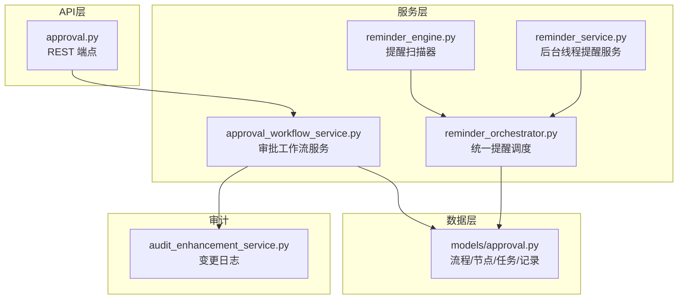
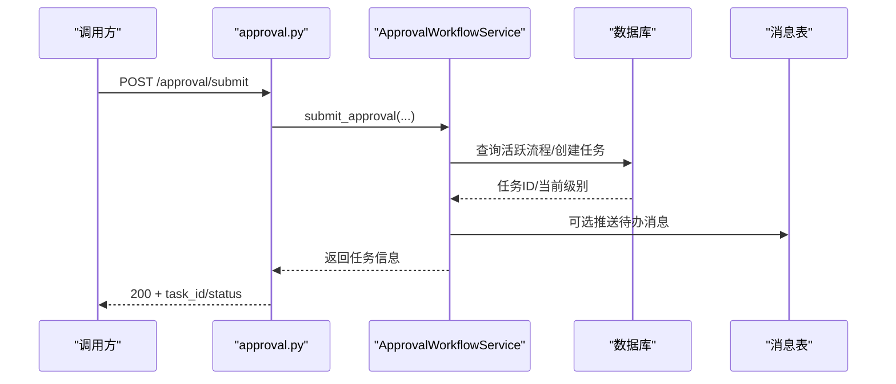
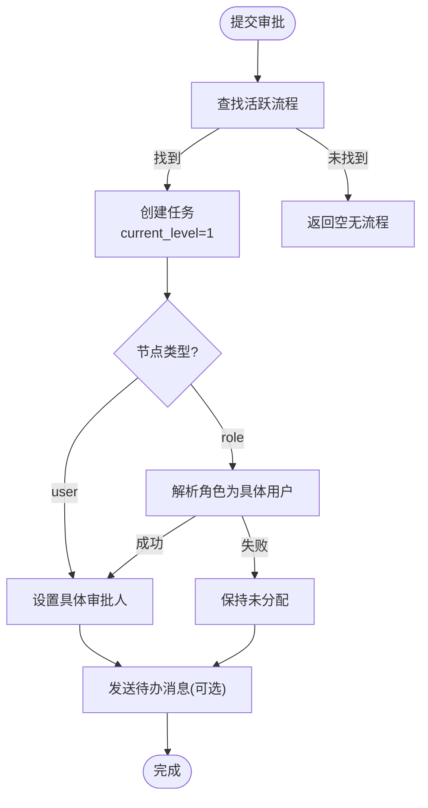
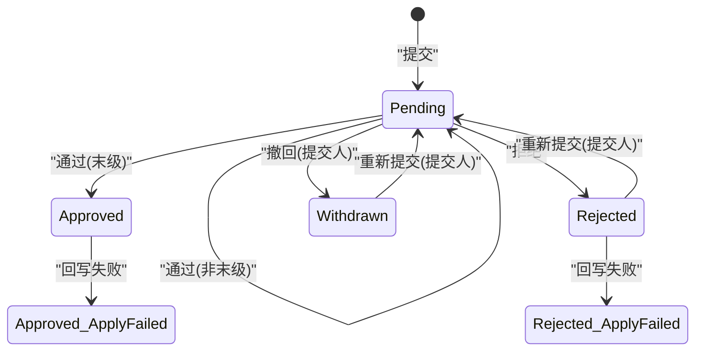
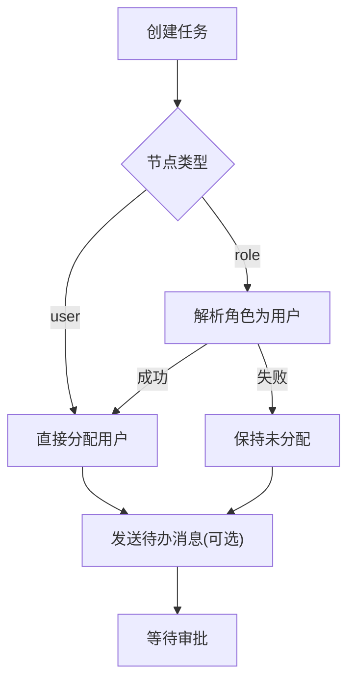
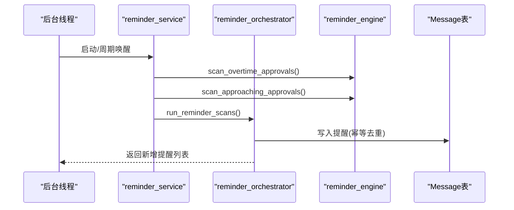
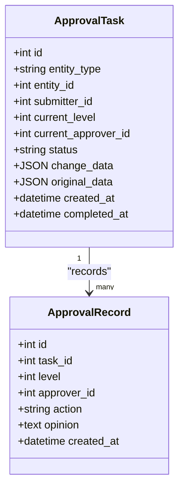
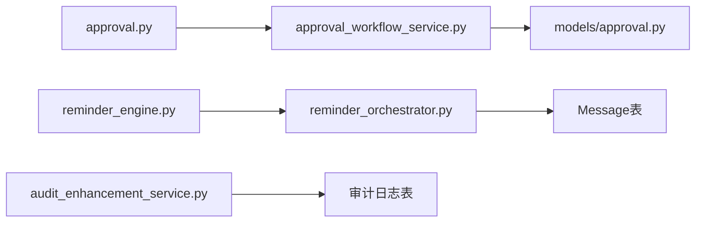

# 审批工作流服务

<cite>
**本文引用的文件**
- [backend/app/services/approval_workflow_service.py](file://backend/app/services/approval_workflow_service.py)
- [backend/app/models/approval.py](file://backend/app/models/approval.py)
- [backend/app/api/v1/approval.py](file://backend/app/api/v1/approval.py)
- [backend/app/services/reminder_engine.py](file://backend/app/services/reminder_engine.py)
- [backend/app/services/reminder_service.py](file://backend/app/services/reminder_service.py)
- [backend/app/services/reminder_orchestrator.py](file://backend/app/services/reminder_orchestrator.py)
- [backend/app/services/audit_enhancement_service.py](file://backend/app/services/audit_enhancement_service.py)
</cite>

## 目录
1. [简介](#简介)
2. [项目结构](#项目结构)
3. [核心组件](#核心组件)
4. [架构总览](#架构总览)
5. [详细组件分析](#详细组件分析)
6. [依赖关系分析](#依赖关系分析)
7. [性能与监控](#性能与监控)
8. [故障排查指南](#故障排查指南)
9. [结论](#结论)
10. [附录](#附录)

## 简介
本文件面向“审批工作流服务”，系统性说明多级审批流程设计、状态机管理、任务自动分配、提醒引擎、审计追踪以及监控优化方法。内容基于后端代码实现，覆盖从流程配置到执行、通知、审计的完整闭环，帮助读者理解并正确使用该能力。

## 项目结构
审批工作流相关代码主要分布在以下模块：
- 数据模型：定义审批流程、节点、任务、记录等实体及状态枚举
- 服务层：封装审批流程编排、任务流转、历史查询、重试回写等核心逻辑
- API 层：暴露创建工作流、提交审批、审批通过/拒绝、转交、撤回、批量操作等接口
- 提醒引擎：扫描超时/即将超时任务、项目截止、预算告警，并写入统一消息中心
- 审计增强：记录业务变更明细，支持字段级变更追溯

图表来源
- [backend/app/api/v1/approval.py:1-120](file://backend/app/api/v1/approval.py#L1-L120)
- [backend/app/services/approval_workflow_service.py:1-120](file://backend/app/services/approval_workflow_service.py#L1-L120)
- [backend/app/models/approval.py:1-120](file://backend/app/models/approval.py#L1-L120)
- [backend/app/services/reminder_engine.py:1-60](file://backend/app/services/reminder_engine.py#L1-L60)
- [backend/app/services/reminder_service.py:1-80](file://backend/app/services/reminder_service.py#L1-L80)
- [backend/app/services/reminder_orchestrator.py:1-80](file://backend/app/services/reminder_orchestrator.py#L1-L80)

章节来源
- [backend/app/api/v1/approval.py:1-120](file://backend/app/api/v1/approval.py#L1-L120)
- [backend/app/services/approval_workflow_service.py:1-120](file://backend/app/services/approval_workflow_service.py#L1-L120)
- [backend/app/models/approval.py:1-120](file://backend/app/models/approval.py#L1-L120)

## 核心组件
- 审批工作流服务：负责流程CRUD、任务创建与流转、历史记录、重试回写、批量操作等
- 数据模型：ApprovalWorkflow（流程）、ApprovalNode（节点）、ApprovalTask（任务）、ApprovalRecord（记录）
- 提醒引擎：扫描超时/即将超时、项目截止、预算告警，生成统一提醒
- 审计增强：记录实体变更字段级差异，支撑审计追溯

章节来源
- [backend/app/services/approval_workflow_service.py:1-120](file://backend/app/services/approval_workflow_service.py#L1-L120)
- [backend/app/models/approval.py:1-120](file://backend/app/models/approval.py#L1-L120)
- [backend/app/services/reminder_engine.py:1-60](file://backend/app/services/reminder_engine.py#L1-L60)
- [backend/app/services/audit_enhancement_service.py:100-140](file://backend/app/services/audit_enhancement_service.py#L100-L140)

## 架构总览
审批工作流采用“流程-节点-任务-记录”的分层设计，配合API层提供对外能力；提醒引擎以定时扫描方式驱动消息推送；审计增强在关键业务变更时落库可追溯。

图表来源
- [backend/app/api/v1/approval.py:380-414](file://backend/app/api/v1/approval.py#L380-L414)
- [backend/app/services/approval_workflow_service.py:203-278](file://backend/app/services/approval_workflow_service.py#L203-L278)

## 详细组件分析

### 多级审批流程设计
- 流程配置：支持为不同实体类型配置最多5级的审批链，每级可指定具体用户或角色，并可设置超时时间
- 节点解析：当节点类型为角色时，系统会将角色标识解析为具体用户（单机版优先解析管理员），若解析失败则保持未分配，由待审批板块兜底可见
- 提交流程：提交时匹配实体类型的活跃流程，创建任务并设置当前级别和审批人；若未分配审批人，跳过消息推送以避免外键约束错误
- 默认流程：若无活跃流程，系统可自动创建单节点默认流程，便于单机模式快速使用

图表来源
- [backend/app/services/approval_workflow_service.py:76-124](file://backend/app/services/approval_workflow_service.py#L76-L124)
- [backend/app/services/approval_workflow_service.py:203-278](file://backend/app/services/approval_workflow_service.py#L203-L278)
- [backend/app/services/approval_workflow_service.py:280-307](file://backend/app/services/approval_workflow_service.py#L280-L307)

章节来源
- [backend/app/services/approval_workflow_service.py:76-124](file://backend/app/services/approval_workflow_service.py#L76-L124)
- [backend/app/services/approval_workflow_service.py:203-278](file://backend/app/services/approval_workflow_service.py#L203-L278)
- [backend/app/services/approval_workflow_service.py:280-307](file://backend/app/services/approval_workflow_service.py#L280-L307)

### 审批状态机管理
- 状态定义：pending（待审批）、approved（已通过）、rejected（已拒绝）、withdrawn（已撤回）
- 转换规则：
  - 提交后进入 pending
  - 审批通过：推进至下一级；若为最后一级则标记 approved，并尝试回写业务实体状态；若回写失败，标记为 approved_apply_failed（可查询、可重试）
  - 拒绝：标记 rejected，并尝试回写业务实体状态；失败则标记 rejected_apply_failed
  - 撤回：仅提交人可在 pending 状态下撤回，标记 withdrawn
  - 重新提交：被拒绝或撤回的任务可由提交人重置为 pending，回到第一级
- 权限校验：非 standalone 模式下需校验当前用户是否为任务当前审批人或任务未分配；standalone=True（单机模式）跳过校验

图表来源
- [backend/app/models/approval.py:36-51](file://backend/app/models/approval.py#L36-L51)
- [backend/app/services/approval_workflow_service.py:447-539](file://backend/app/services/approval_workflow_service.py#L447-L539)
- [backend/app/services/approval_workflow_service.py:568-625](file://backend/app/services/approval_workflow_service.py#L568-L625)

章节来源
- [backend/app/models/approval.py:36-51](file://backend/app/models/approval.py#L36-L51)
- [backend/app/services/approval_workflow_service.py:447-539](file://backend/app/services/approval_workflow_service.py#L447-L539)
- [backend/app/services/approval_workflow_service.py:568-625](file://backend/app/services/approval_workflow_service.py#L568-L625)

### 审批任务的自动分配机制
- 基于角色的路由：节点类型为 role 时，将角色标识解析为具体用户（如 admin/super_admin），解析失败则保持未分配
- 负载均衡：当前实现按流程顺序逐级分配，未实现多审批人并发时的负载策略；可通过扩展节点配置（如多人并行）与服务层逻辑实现
- 超时处理：节点支持 timeout_hours；提醒引擎会扫描超过阈值的 pending 任务并生成提醒；API层也提供一键批量自动审批（单机模式）

图表来源
- [backend/app/services/approval_workflow_service.py:230-236](file://backend/app/services/approval_workflow_service.py#L230-L236)
- [backend/app/services/approval_workflow_service.py:280-307](file://backend/app/services/approval_workflow_service.py#L280-L307)
- [backend/app/services/reminder_engine.py:15-63](file://backend/app/services/reminder_engine.py#L15-L63)

章节来源
- [backend/app/services/approval_workflow_service.py:230-236](file://backend/app/services/approval_workflow_service.py#L230-L236)
- [backend/app/services/approval_workflow_service.py:280-307](file://backend/app/services/approval_workflow_service.py#L280-L307)
- [backend/app/services/reminder_engine.py:15-63](file://backend/app/services/reminder_engine.py#L15-L63)

### 提醒引擎的实现
- 定时扫描：后台线程周期性检查超时与即将超时的审批任务，以及项目截止、预算告警
- 消息推送：将扫描结果写入统一消息中心，前端聚合展示；去重键为 type:entity_id，避免重复提醒
- 多渠道通知：当前实现为站内消息；可扩展对接邮件、短信、IM等渠道
- 接收人解析：优先 current_approver_id，其次按节点解析，再次回退到提交人；无法确定接收人时跳过，避免整批失败

图表来源
- [backend/app/services/reminder_service.py:27-83](file://backend/app/services/reminder_service.py#L27-L83)
- [backend/app/services/reminder_engine.py:15-128](file://backend/app/services/reminder_engine.py#L15-L128)
- [backend/app/services/reminder_orchestrator.py:31-82](file://backend/app/services/reminder_orchestrator.py#L31-L82)

章节来源
- [backend/app/services/reminder_service.py:27-83](file://backend/app/services/reminder_service.py#L27-L83)
- [backend/app/services/reminder_engine.py:15-128](file://backend/app/services/reminder_engine.py#L15-L128)
- [backend/app/services/reminder_orchestrator.py:31-82](file://backend/app/services/reminder_orchestrator.py#L31-L82)

### 审批历史追踪
- 操作记录：每次审批通过/拒绝/转交均记录 ApprovalRecord，包含级别、操作人、意见、时间等
- 变更对比：任务存储 change_data/original_data，提供 diff 查询以展示前后差异
- 审计追溯：结合审计增强服务，对业务实体变更进行字段级记录，形成完整的审计轨迹

图表来源
- [backend/app/models/approval.py:138-223](file://backend/app/models/approval.py#L138-L223)
- [backend/app/models/approval.py:225-286](file://backend/app/models/approval.py#L225-L286)

章节来源
- [backend/app/models/approval.py:138-223](file://backend/app/models/approval.py#L138-L223)
- [backend/app/models/approval.py:225-286](file://backend/app/models/approval.py#L225-L286)
- [backend/app/services/audit_enhancement_service.py:109-136](file://backend/app/services/audit_enhancement_service.py#L109-L136)

### 复杂审批场景下的异常处理与恢复
- 回写失败处理：审批终态（通过/拒绝）后尝试回写业务实体状态；失败时将任务状态追加 _apply_failed 后缀，便于查询与重试
- 重试机制：提供 retry_apply_entity_change 接口，管理员可手动重试失败的回写；成功后恢复为对应终态
- 幂等性：提醒消息写入采用 type:entity_id 去重，避免重复推送；批量审批每个任务独立事务，单个失败不影响其余任务

章节来源
- [backend/app/services/approval_workflow_service.py:49-71](file://backend/app/services/approval_workflow_service.py#L49-L71)
- [backend/app/services/approval_workflow_service.py:541-566](file://backend/app/services/approval_workflow_service.py#L541-L566)
- [backend/app/services/reminder_orchestrator.py:26-82](file://backend/app/services/reminder_orchestrator.py#L26-L82)

## 依赖关系分析
- API 层依赖服务层：approval.py 调用 ApprovalWorkflowService 完成业务逻辑
- 服务层依赖数据模型：通过 SQLAlchemy ORM 访问 approval 相关表
- 提醒引擎依赖消息表：将扫描结果写入 Message 表，供前端提醒中心展示
- 审计增强依赖审计日志表：记录实体变更字段级差异

图表来源
- [backend/app/api/v1/approval.py:1-120](file://backend/app/api/v1/approval.py#L1-L120)
- [backend/app/services/approval_workflow_service.py:1-120](file://backend/app/services/approval_workflow_service.py#L1-L120)
- [backend/app/models/approval.py:1-120](file://backend/app/models/approval.py#L1-L120)
- [backend/app/services/reminder_engine.py:1-60](file://backend/app/services/reminder_engine.py#L1-L60)
- [backend/app/services/reminder_orchestrator.py:1-80](file://backend/app/services/reminder_orchestrator.py#L1-L80)

章节来源
- [backend/app/api/v1/approval.py:1-120](file://backend/app/api/v1/approval.py#L1-L120)
- [backend/app/services/approval_workflow_service.py:1-120](file://backend/app/services/approval_workflow_service.py#L1-L120)
- [backend/app/models/approval.py:1-120](file://backend/app/models/approval.py#L1-L120)
- [backend/app/services/reminder_engine.py:1-60](file://backend/app/services/reminder_engine.py#L1-L60)
- [backend/app/services/reminder_orchestrator.py:1-80](file://backend/app/services/reminder_orchestrator.py#L1-L80)

## 性能与监控
- 查询优化：服务层使用 joinedload 预加载关联对象，减少 N+1 查询；分页参数 skip/limit 控制返回量
- 索引设计：模型中为 workflow_id、entity_type/entity_id、status、priority/created_at 等建立索引，提升常用查询效率
- 批量操作：批量审批与自动审批所有待处理任务采用逐条独立事务，避免一次 commit 失败导致全流程失败
- 监控建议：
  - 关注 pending 任务数量与平均处理时长，识别瓶颈环节
  - 统计 *_apply_failed 任务比例，评估回写稳定性
  - 提醒消息去重成功率与失败率，确保通知可靠性

章节来源
- [backend/app/models/approval.py:192-199](file://backend/app/models/approval.py#L192-L199)
- [backend/app/services/approval_workflow_service.py:727-753](file://backend/app/services/approval_workflow_service.py#L727-L753)

## 故障排查指南
- 任务无法审批：检查任务状态是否为 pending；确认当前用户是否为当前审批人或任务未分配；单机模式可使用 standalone=True 跳过校验
- 驳回失败：API 层要求必须填写原因；若为空将返回 400
- 回写失败：查看任务状态是否包含 _apply_failed；使用重试接口恢复；检查业务处理器是否正确注册
- 提醒未送达：确认提醒接收人是否可解析；检查消息表是否存在重复去重；查看后台线程是否正常运行

章节来源
- [backend/app/api/v1/approval.py:453-483](file://backend/app/api/v1/approval.py#L453-L483)
- [backend/app/services/approval_workflow_service.py:541-566](file://backend/app/services/approval_workflow_service.py#L541-L566)
- [backend/app/services/reminder_service.py:133-181](file://backend/app/services/reminder_service.py#L133-L181)

## 结论
审批工作流服务提供了完整的多级审批能力，涵盖流程配置、状态机管理、任务分配、提醒通知、审计追踪与异常恢复。通过合理的索引设计与批量操作策略，系统在易用性与性能之间取得平衡。建议在生产环境中持续监控关键指标，并结合业务需求扩展并行审批、多渠道通知等能力。

## 附录
- 常用接口路径参考：
  - 提交审批：POST /approval/submit
  - 审批通过：POST /approval/tasks/{id}/approve
  - 审批拒绝：POST /approval/tasks/{id}/reject
  - 转交审批：POST /approval/tasks/{id}/transfer
  - 撤回申请：POST /approval/tasks/{id}/withdraw
  - 重新提交：POST /approval/tasks/{id}/resubmit
  - 批量审批：POST /approval/tasks/batch
  - 一键自动审批（单机版）：POST /approval/tasks/auto-approve-all

章节来源
- [backend/app/api/v1/approval.py:226-718](file://backend/app/api/v1/approval.py#L226-L718)