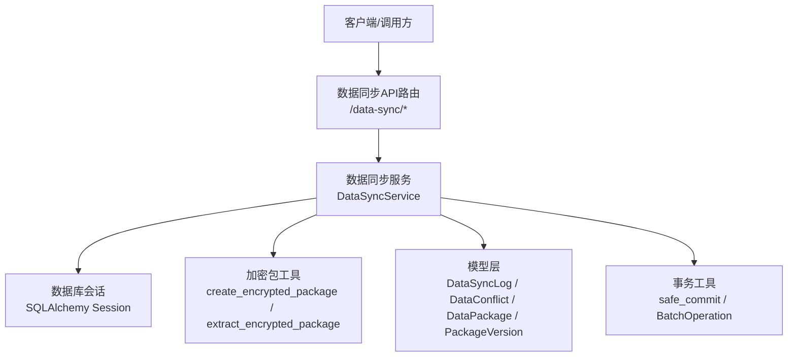
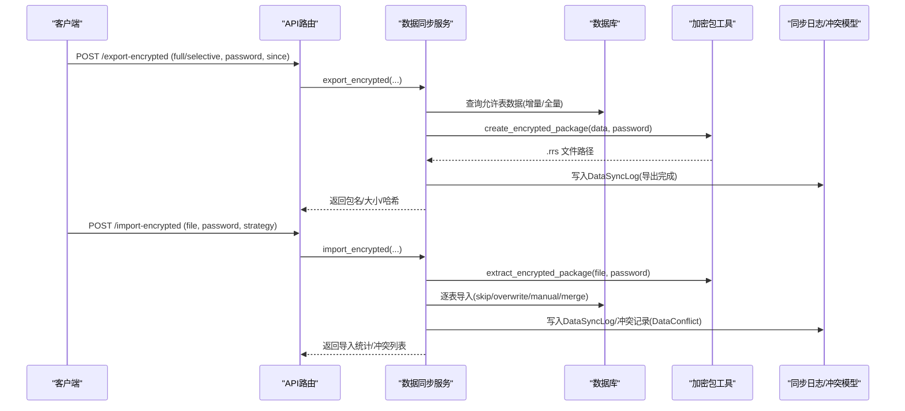
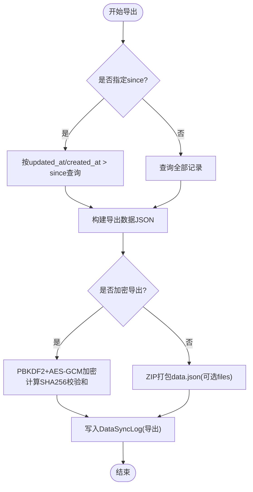
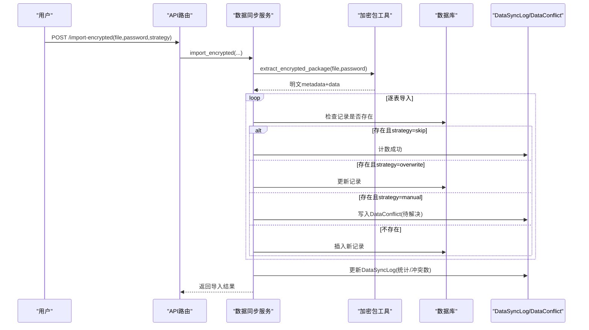
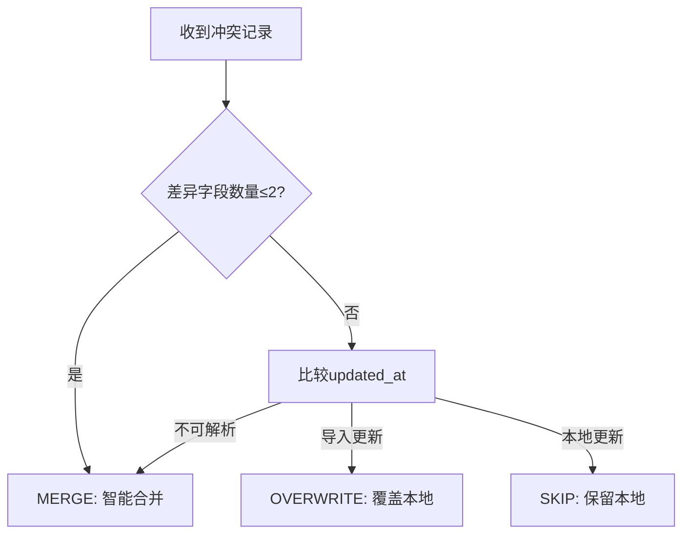
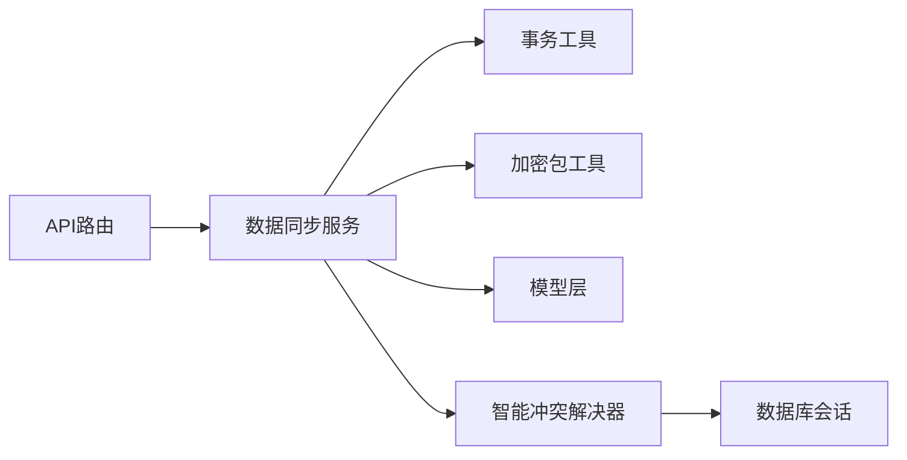

# 数据同步服务

<cite>
**本文引用的文件**
- [backend/app/services/data_sync_service.py](file://backend/app/services/data_sync_service.py)
- [backend/app/api/v1/data_sync.py](file://backend/app/api/v1/data_sync.py)
- [backend/app/models/data_sync.py](file://backend/app/models/data_sync.py)
- [backend/app/services/encrypted_package.py](file://backend/app/services/encrypted_package.py)
- [backend/app/models/data_package.py](file://backend/app/models/data_package.py)
- [backend/app/models/package_version.py](file://backend/app/models/package_version.py)
- [backend/app/core/transaction.py](file://backend/app/core/transaction.py)
- [backend/app/services/smart_conflict_resolver.py](file://backend/app/services/smart_conflict_resolver.py)
</cite>

## 目录
1. [简介](#简介)
2. [项目结构](#项目结构)
3. [核心组件](#核心组件)
4. [架构总览](#架构总览)
5. [详细组件分析](#详细组件分析)
6. [依赖关系分析](#依赖关系分析)
7. [性能考虑](#性能考虑)
8. [故障排查指南](#故障排查指南)
9. [结论](#结论)
10. [附录](#附录)

## 简介
本文件面向“多机数据同步”场景，系统化说明增量与全量同步、数据包生成与处理（打包、加密传输、版本管理）、冲突检测与解决（时间戳比较、优先级判断、合并策略）、同步状态管理（进度跟踪、失败重试、断点续传）、一致性保证（事务边界、回滚机制、补偿操作）以及性能优化（批量处理、压缩传输、并行同步）和监控排障方法。内容基于仓库中数据同步相关代码实现进行提炼与归纳。

## 项目结构
数据同步能力由 API 路由层、服务层、模型层与加密工具共同构成：
- API 路由层：提供导出/导入（含加密）、下载、冲突查询与解决、日志查询等接口。
- 服务层：封装增量/全量导出、导入、冲突处理、加密包创建与解析、表级读写等核心逻辑。
- 模型层：定义同步日志、冲突记录、数据包及版本管理等持久化实体。
- 加密工具：实现 .rrs 格式的数据包加密/解密与完整性校验。
- 事务工具：提供安全提交、嵌套事务、保存点、死锁重试与批量操作工具。

**图表来源**
- [backend/app/api/v1/data_sync.py:82-337](file://backend/app/api/v1/data_sync.py#L82-L337)
- [backend/app/services/data_sync_service.py:87-933](file://backend/app/services/data_sync_service.py#L87-L933)
- [backend/app/services/encrypted_package.py:1-120](file://backend/app/services/encrypted_package.py#L1-L120)
- [backend/app/models/data_sync.py:8-72](file://backend/app/models/data_sync.py#L8-L72)
- [backend/app/models/data_package.py:38-123](file://backend/app/models/data_package.py#L38-L123)
- [backend/app/models/package_version.py:15-44](file://backend/app/models/package_version.py#L15-L44)
- [backend/app/core/transaction.py:200-457](file://backend/app/core/transaction.py#L200-L457)

**章节来源**
- [backend/app/api/v1/data_sync.py:82-337](file://backend/app/api/v1/data_sync.py#L82-L337)
- [backend/app/services/data_sync_service.py:87-933](file://backend/app/services/data_sync_service.py#L87-L933)

## 核心组件
- 数据同步服务（DataSyncService）
  - 增量导出：按 since 时间筛选更新或新增记录，生成 ZIP 数据包并记录同步日志。
  - 全量导出：支持导出全部允许表的数据。
  - 导入数据包：ZIP/.rrs 两种格式；支持 skip/overwrite/manual/merge 策略；敏感表禁止导入。
  - 冲突处理：记录冲突到 data_conflicts，并提供查询与解决接口。
  - 加密包：使用 AES-256-GCM + PBKDF2-SHA256 创建/解析 .rrs 包，附带 SHA256 完整性校验。
- 智能冲突解决器（SmartConflictResolver）
  - 基于业务唯一键检测冲突，支持 SKIP/OVERWRITE/KEEP_BOTH/MERGE/AUTO 策略。
  - AUTO 策略依据差异字段数量与 updated_at 时间戳比较选择最优策略。
- 事务与批量工具（Transaction/BatchOperation）
  - safe_commit 确保提交异常时回滚并重抛；支持嵌套事务与保存点。
  - 批量插入/更新/删除，提升导入性能。
- 模型与版本管理
  - DataSyncLog：记录每次同步的元信息、统计与详情。
  - DataConflict：记录冲突明细与解决结果。
  - DataPackage/PackageVersion：数据包与版本管理，支持校验和与加密参数记录。

**章节来源**
- [backend/app/services/data_sync_service.py:128-933](file://backend/app/services/data_sync_service.py#L128-L933)
- [backend/app/services/smart_conflict_resolver.py:17-459](file://backend/app/services/smart_conflict_resolver.py#L17-L459)
- [backend/app/core/transaction.py:200-457](file://backend/app/core/transaction.py#L200-L457)
- [backend/app/models/data_sync.py:8-72](file://backend/app/models/data_sync.py#L8-L72)
- [backend/app/models/data_package.py:38-123](file://backend/app/models/data_package.py#L38-L123)
- [backend/app/models/package_version.py:15-44](file://backend/app/models/package_version.py#L15-L44)

## 架构总览
下图展示从 API 到服务、再到数据库与加密工具的完整调用链，涵盖导出、导入、冲突处理与日志记录。

**图表来源**
- [backend/app/api/v1/data_sync.py:115-255](file://backend/app/api/v1/data_sync.py#L115-L255)
- [backend/app/services/data_sync_service.py:576-800](file://backend/app/services/data_sync_service.py#L576-L800)
- [backend/app/services/encrypted_package.py:37-119](file://backend/app/services/encrypted_package.py#L37-L119)
- [backend/app/models/data_sync.py:8-72](file://backend/app/models/data_sync.py#L8-L72)

## 详细组件分析

### 增量与全量导出（ZIP/.rrs）
- 增量导出：通过 since 时间过滤 updated_at/created_at 大于阈值的记录，按白名单表逐一导出，组装为 JSON 后打包为 ZIP，可选包含上传文件。
- 全量导出：遍历所有允许表导出数据。
- 加密导出：在导出完成后，将 metadata 与 data 序列化为 JSON，使用 PBKDF2 派生密钥与 AES-256-GCM 加密，附加 SHA256 校验和，输出 .rrs 文件。
- 日志记录：每次导出均创建 DataSyncLog，记录模块、时间、记录数、文件大小与哈希等。

**图表来源**
- [backend/app/services/data_sync_service.py:128-303](file://backend/app/services/data_sync_service.py#L128-L303)
- [backend/app/services/data_sync_service.py:576-704](file://backend/app/services/data_sync_service.py#L576-L704)
- [backend/app/services/encrypted_package.py:37-74](file://backend/app/services/encrypted_package.py#L37-L74)

**章节来源**
- [backend/app/services/data_sync_service.py:128-303](file://backend/app/services/data_sync_service.py#L128-L303)
- [backend/app/services/data_sync_service.py:576-704](file://backend/app/services/data_sync_service.py#L576-L704)
- [backend/app/services/encrypted_package.py:37-74](file://backend/app/services/encrypted_package.py#L37-L74)

### 导入与冲突处理（ZIP/.rrs）
- 导入流程：读取 ZIP 或 .rrs（需密码），按表循环导入；敏感表（如 users、machine_codes、audit_logs）禁止导入。
- 冲突策略：
  - skip：跳过已有记录。
  - overwrite：覆盖本地记录。
  - manual：记录冲突至 data_conflicts，等待人工解决。
  - merge：智能合并（优先非空值，必要时比较 updated_at）。
- 冲突解决：提供 get_conflicts 与 resolve_conflict 接口，支持 keep_local/use_import/merge 三种方式，并记录解决人与时间。

**图表来源**
- [backend/app/api/v1/data_sync.py:222-255](file://backend/app/api/v1/data_sync.py#L222-L255)
- [backend/app/services/data_sync_service.py:304-472](file://backend/app/services/data_sync_service.py#L304-L472)
- [backend/app/services/data_sync_service.py:706-800](file://backend/app/services/data_sync_service.py#L706-L800)
- [backend/app/models/data_sync.py:8-72](file://backend/app/models/data_sync.py#L8-L72)

**章节来源**
- [backend/app/services/data_sync_service.py:304-472](file://backend/app/services/data_sync_service.py#L304-L472)
- [backend/app/services/data_sync_service.py:706-800](file://backend/app/services/data_sync_service.py#L706-L800)
- [backend/app/models/data_sync.py:8-72](file://backend/app/models/data_sync.py#L8-L72)

### 智能冲突检测与自动策略
- 业务键检测：根据数据类型映射的业务唯一键（如 villages.village_name、projects.code）检测冲突。
- 差异比较：忽略 id/created_at/updated_at 等系统字段，比较其余字段差异。
- 自动策略（AUTO）：
  - 差异字段 ≤ 2：MERGE（智能合并）。
  - 否则比较 updated_at：导入更新则 OVERWRITE，本地更新则 SKIP。
  - 无法解析时间戳时回退 MERGE。
- 策略执行：
  - SKIP：保留本地。
  - OVERWRITE：用导入覆盖。
  - KEEP_BOTH：复制导入记录并修改业务键避免冲突。
  - MERGE：优先填充本地空值，必要时以较新的 updated_at 覆盖。

**图表来源**
- [backend/app/services/smart_conflict_resolver.py:179-338](file://backend/app/services/smart_conflict_resolver.py#L179-L338)

**章节来源**
- [backend/app/services/smart_conflict_resolver.py:82-177](file://backend/app/services/smart_conflict_resolver.py#L82-L177)
- [backend/app/services/smart_conflict_resolver.py:179-338](file://backend/app/services/smart_conflict_resolver.py#L179-L338)

### 数据包与版本管理
- 数据包模型（DataPackage）：记录包编码、组织、文件路径/名称/大小、状态、类型、版本、数据类型清单、校验和、错误信息等，支持加密算法与盐值记录。
- 版本管理（PackageVersion）：关联数据包，记录版本号、变更描述与创建人。
- 用途：用于任务分发、上报、增量更新等场景的版本追踪与审计。

**章节来源**
- [backend/app/models/data_package.py:38-123](file://backend/app/models/data_package.py#L38-L123)
- [backend/app/models/package_version.py:15-44](file://backend/app/models/package_version.py#L15-L44)

### 加密传输与完整性校验
- 加密算法：PBKDF2-SHA256 派生密钥，AES-256-GCM 加密 metadata 与 data。
- 完整性校验：对明文 metadata+data 计算 SHA256 校验和，写入 .rrs 末尾；解析时验证一致。
- 防篡改：版本头与魔数校验，防止非法格式与篡改。

**章节来源**
- [backend/app/services/encrypted_package.py:1-120](file://backend/app/services/encrypted_package.py#L1-L120)

## 依赖关系分析
- API 路由依赖数据同步服务与权限校验。
- 服务层依赖数据库会话、事务工具、加密包工具与模型。
- 智能冲突解决器依赖具体业务模型（villages/projects/funds/schools）与数据库会话。
- 事务工具提供统一的事务边界与批量操作能力，保障导入/导出的原子性与可恢复性。

**图表来源**
- [backend/app/api/v1/data_sync.py:82-337](file://backend/app/api/v1/data_sync.py#L82-L337)
- [backend/app/services/data_sync_service.py:87-933](file://backend/app/services/data_sync_service.py#L87-L933)
- [backend/app/services/smart_conflict_resolver.py:76-459](file://backend/app/services/smart_conflict_resolver.py#L76-L459)
- [backend/app/core/transaction.py:200-457](file://backend/app/core/transaction.py#L200-L457)

**章节来源**
- [backend/app/api/v1/data_sync.py:82-337](file://backend/app/api/v1/data_sync.py#L82-L337)
- [backend/app/services/data_sync_service.py:87-933](file://backend/app/services/data_sync_service.py#L87-L933)
- [backend/app/services/smart_conflict_resolver.py:76-459](file://backend/app/services/smart_conflict_resolver.py#L76-L459)
- [backend/app/core/transaction.py:200-457](file://backend/app/core/transaction.py#L200-L457)

## 性能考虑
- 批量处理：使用 BatchOperation 的 bulk_insert_mappings/bulk_update_mappings 分批写入，降低内存占用与 IO 开销。
- 压缩传输：ZIP 打包 data.json 与可选 files；.rrs 采用二进制格式减少体积。
- 并行同步：服务层按表顺序串行处理以保证一致性；可在上层调度不同表的导出/导入并发执行（注意外键依赖顺序）。
- 增量同步：通过 since 时间过滤减少数据传输量。
- 大文件处理：API 层分块保存上传文件，避免一次性加载到内存。

**章节来源**
- [backend/app/core/transaction.py:366-457](file://backend/app/core/transaction.py#L366-L457)
- [backend/app/api/v1/data_sync.py:51-71](file://backend/app/api/v1/data_sync.py#L51-L71)
- [backend/app/services/data_sync_service.py:275-303](file://backend/app/services/data_sync_service.py#L275-L303)

## 故障排查指南
- 查看同步日志：通过 /data-sync/logs 获取最近同步记录，关注 status、total_records、failed_records、conflicts_count 与 details。
- 冲突列表与解决：通过 /data-sync/conflicts/{sync_log_id} 获取未解决冲突，使用 /data-sync/resolve-conflict 指定 resolution（keep_local/use_import/merge）并记录 resolved_by。
- 常见错误定位：
  - 导入失败：检查 errors 列表中的表级错误消息。
  - 冲突过多：评估策略是否为 manual，必要时调整策略或修复数据。
  - 加密失败：确认密码正确性与 .rrs 完整性（校验和失败提示可能被篡改）。
- 事务与回滚：若导入过程中出现异常，safe_commit 会回滚并抛出异常；可通过日志中的错误堆栈定位问题。
- 死锁与重试：事务工具提供死锁重试装饰器，可在高并发导入时启用。

**章节来源**
- [backend/app/api/v1/data_sync.py:258-337](file://backend/app/api/v1/data_sync.py#L258-L337)
- [backend/app/services/data_sync_service.py:515-574](file://backend/app/services/data_sync_service.py#L515-L574)
- [backend/app/core/transaction.py:200-363](file://backend/app/core/transaction.py#L200-L363)

## 结论
该数据同步服务提供了完整的增量/全量导出、ZIP/.rrs 导入、冲突检测与解决、加密传输与完整性校验、事务与批量操作等能力，适用于多机环境下的数据同步与离线交换。通过白名单表、敏感表保护、业务键冲突检测与 AUTO 策略，系统在安全性与易用性之间取得平衡。结合日志与冲突接口，运维人员可高效定位与处理问题。建议在高并发场景下合理配置批量大小与并发度，并结合 WAL 与备份策略保障数据一致性。

## 附录
- 安全要点
  - 表名校验与白名单：防止 SQL 注入。
  - 敏感表禁止导入：避免提权与数据篡改。
  - 文件名净化与扩展名白名单：防止路径遍历与恶意文件。
- 最佳实践
  - 使用 since 进行增量同步，减少带宽与存储压力。
  - 对关键数据使用 .rrs 加密传输，确保机密性与完整性。
  - 导入前评估冲突策略，必要时采用 manual 模式人工审核。
  - 利用 BatchOperation 提高导入吞吐，同时控制批次大小以避免内存峰值。