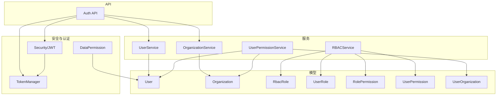
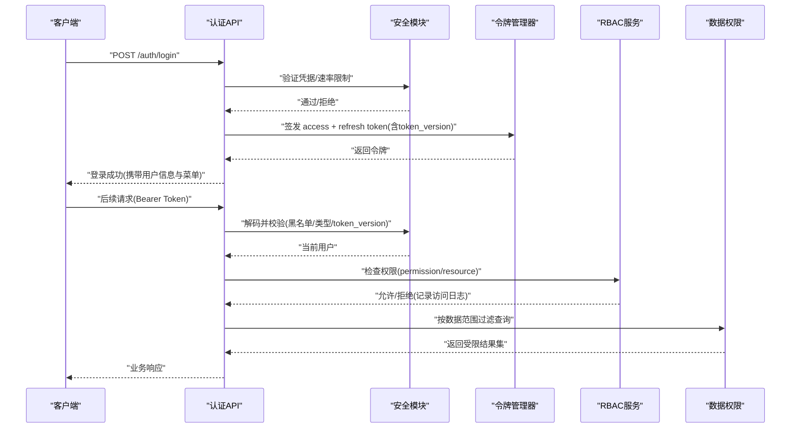
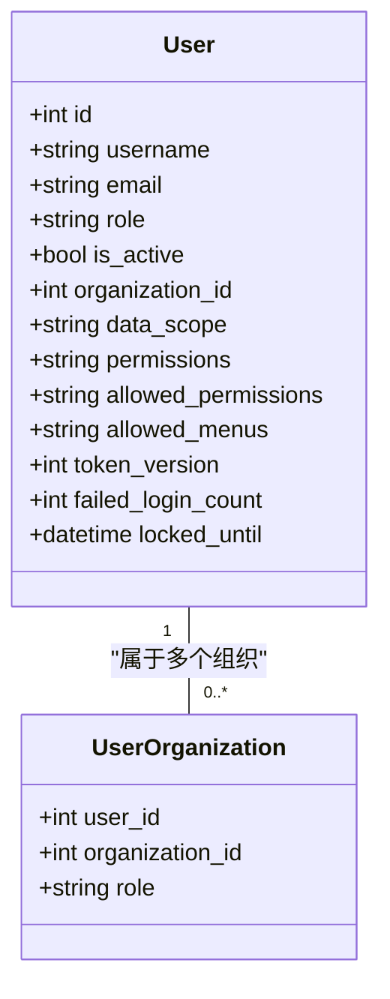
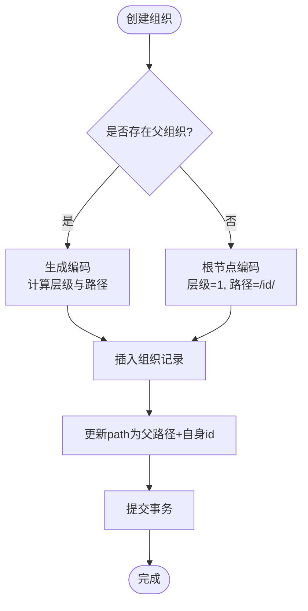
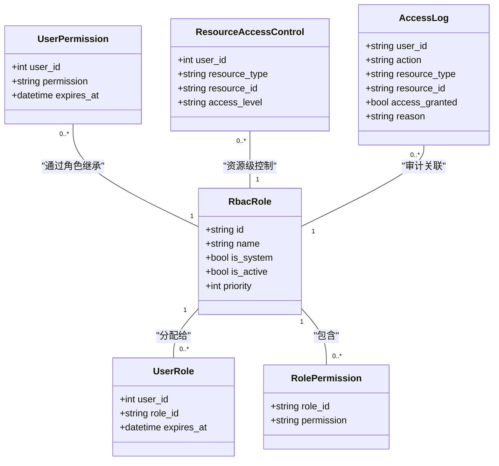
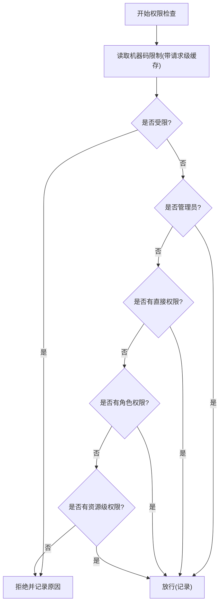
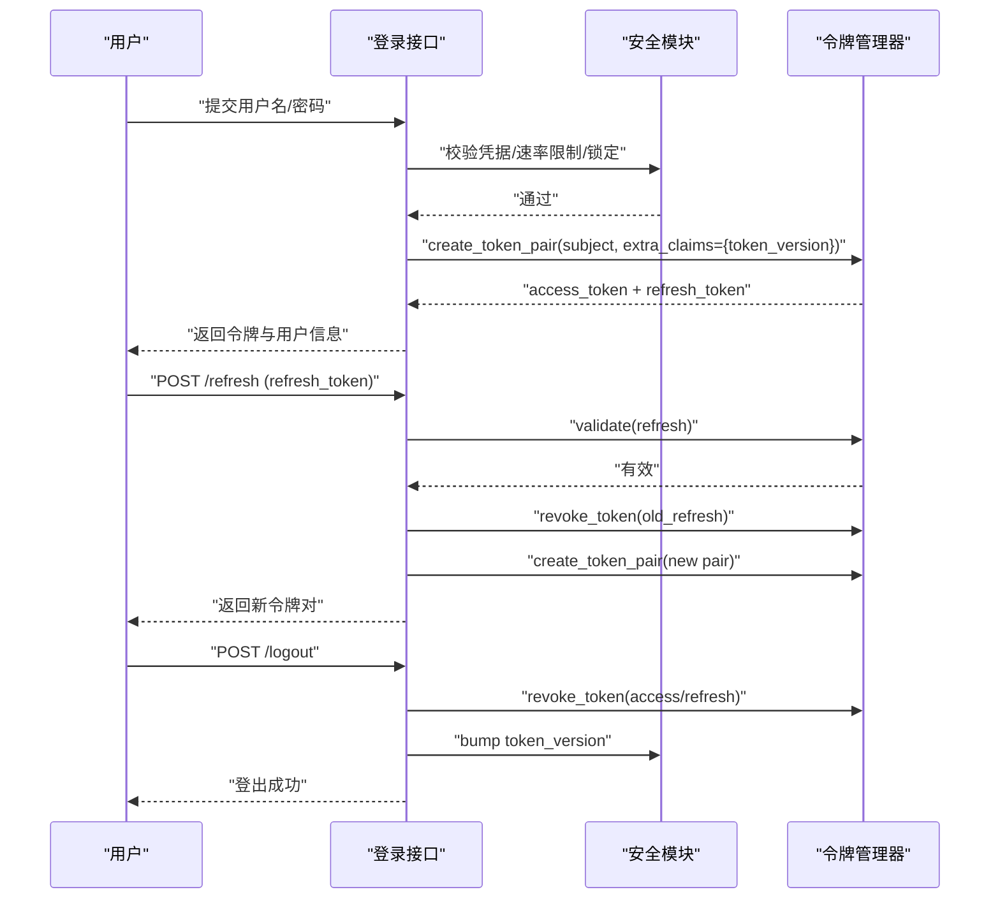
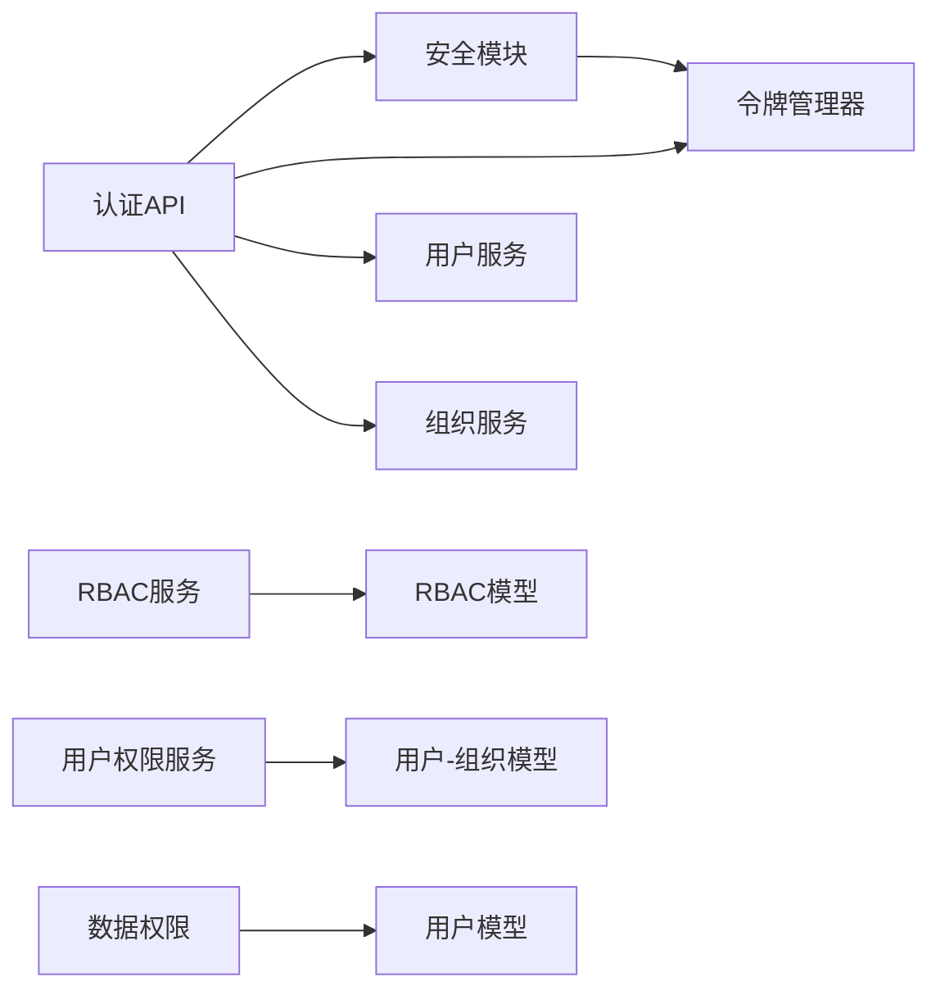

# 用户组织服务

<cite>
**本文引用的文件**
- [user.py](file://backend/app/models/user.py)
- [organization.py](file://backend/app/models/organization.py)
- [rbac.py](file://backend/app/models/rbac.py)
- [user_organization.py](file://backend/app/models/user_organization.py)
- [user_service.py](file://backend/app/services/user_service.py)
- [organization_service.py](file://backend/app/services/organization_service.py)
- [rbac_service.py](file://backend/app/services/rbac_service.py)
- [security.py](file://backend/app/core/security.py)
- [data_permission.py](file://backend/app/core/data_permission.py)
- [token_manager.py](file://backend/app/core/token_manager.py)
- [auth.py](file://backend/app/api/v1/auth/auth.py)
- [user.py（schemas）](file://backend/app/schemas/user.py)
- [organization.py（schemas）](file://backend/app/schemas/organization.py)
</cite>

## 目录
1. [简介](#简介)
2. [项目结构](#项目结构)
3. [核心组件](#核心组件)
4. [架构总览](#架构总览)
5. [详细组件分析](#详细组件分析)
6. [依赖关系分析](#依赖关系分析)
7. [性能考虑](#性能考虑)
8. [故障排查指南](#故障排查指南)
9. [结论](#结论)
10. [附录](#附录)

## 简介
本文件面向“用户与组织”领域，系统性说明用户管理、组织管理、RBAC 权限模型、数据范围隔离、会话与令牌管理、行为审计以及权限变更同步与缓存策略。目标是帮助开发者快速理解并正确扩展该子系统。

## 项目结构
围绕用户与组织的核心代码分布在以下层次：
- 模型层：用户、组织、RBAC 角色/权限、用户-组织关联
- 服务层：用户服务、组织服务、RBAC 服务、用户权限服务
- 安全与认证：JWT 生成/校验、黑名单、速率限制、密码策略、审计日志
- API 层：登录、刷新、登出等认证接口
- Schema：请求/响应数据结构定义

图表来源
- [user.py:26-85](file://backend/app/models/user.py#L26-L85)
- [organization.py:31-78](file://backend/app/models/organization.py#L31-L78)
- [rbac.py:31-263](file://backend/app/models/rbac.py#L31-L263)
- [user_organization.py:21-69](file://backend/app/models/user_organization.py#L21-L69)
- [user_service.py:20-124](file://backend/app/services/user_service.py#L20-L124)
- [organization_service.py:70-521](file://backend/app/services/organization_service.py#L70-L521)
- [rbac_service.py:104-746](file://backend/app/services/rbac_service.py#L104-L746)
- [security.py:210-347](file://backend/app/core/security.py#L210-L347)
- [token_manager.py:64-283](file://backend/app/core/token_manager.py#L64-L283)
- [auth.py:101-800](file://backend/app/api/v1/auth/auth.py#L101-L800)

章节来源
- [user.py:26-85](file://backend/app/models/user.py#L26-L85)
- [organization.py:31-78](file://backend/app/models/organization.py#L31-L78)
- [rbac.py:31-263](file://backend/app/models/rbac.py#L31-L263)
- [user_organization.py:21-69](file://backend/app/models/user_organization.py#L21-L69)
- [user_service.py:20-124](file://backend/app/services/user_service.py#L20-L124)
- [organization_service.py:70-521](file://backend/app/services/organization_service.py#L70-L521)
- [rbac_service.py:104-746](file://backend/app/services/rbac_service.py#L104-L746)
- [security.py:210-347](file://backend/app/core/security.py#L210-L347)
- [token_manager.py:64-283](file://backend/app/core/token_manager.py#L64-L283)
- [auth.py:101-800](file://backend/app/api/v1/auth/auth.py#L101-L800)

## 核心组件
- 用户模型与属性：包含用户名、邮箱、角色、是否激活、所属组织、数据范围、白名单权限、可见菜单、令牌版本、双因素与锁定等字段，并提供权限列表与菜单解析方法。
- 组织模型：支持树形层级（parent_id、level、path），类型与状态，联系人信息加密存储，行政区划编码用于数据权限前缀匹配。
- RBAC 模型：角色、用户-角色、角色-权限、用户直接权限、资源访问控制、访问日志、机器码权限。
- 用户-组织关联：多对多关系，支持用户在多个组织中的角色与主组织标记。
- 用户服务：提供用户查询、创建、更新、删除等基础 CRUD。
- 组织服务：提供组织的创建、树构建、下级组织获取、统计、搜索、排序批量更新、删除保护等。
- RBAC 服务：统一权限计算、角色分配/撤销、权限授予/撤销、访问日志记录、机器码限制集成。
- 安全与认证：JWT 签发/校验、黑名单、速率限制、密码策略、审计日志、CSRF。
- 数据权限：基于角色的数据范围过滤（全部、本部门、本人）。

章节来源
- [user.py:26-152](file://backend/app/models/user.py#L26-L152)
- [organization.py:31-78](file://backend/app/models/organization.py#L31-L78)
- [rbac.py:31-263](file://backend/app/models/rbac.py#L31-L263)
- [user_organization.py:21-69](file://backend/app/models/user_organization.py#L21-L69)
- [user_service.py:20-124](file://backend/app/services/user_service.py#L20-L124)
- [organization_service.py:70-521](file://backend/app/services/organization_service.py#L70-L521)
- [rbac_service.py:104-746](file://backend/app/services/rbac_service.py#L104-L746)
- [security.py:210-347](file://backend/app/core/security.py#L210-L347)
- [data_permission.py:20-187](file://backend/app/core/data_permission.py#L20-L187)

## 架构总览
下图展示从登录到权限校验的端到端流程，涵盖认证、令牌、RBAC 与数据范围。

图表来源
- [auth.py:101-287](file://backend/app/api/v1/auth/auth.py#L101-L287)
- [security.py:243-347](file://backend/app/core/security.py#L243-L347)
- [token_manager.py:64-127](file://backend/app/core/token_manager.py#L64-L127)
- [rbac_service.py:133-222](file://backend/app/services/rbac_service.py#L133-L222)
- [data_permission.py:83-170](file://backend/app/core/data_permission.py#L83-L170)

## 详细组件分析

### 用户管理与CRUD
- 用户模型包含角色、数据范围、白名单权限、可见菜单、令牌版本、锁定与失败计数等关键属性，便于细粒度控制。
- 用户服务提供按用户名/邮箱/ID 查询、分页列表、创建（含密码哈希与角色归一化）、更新、删除等操作。
- 用户-组织关联支持多组织成员身份与主组织设置，影响数据范围与可见性。

图表来源
- [user.py:26-85](file://backend/app/models/user.py#L26-L85)
- [user_organization.py:21-69](file://backend/app/models/user_organization.py#L21-L69)

章节来源
- [user.py:26-152](file://backend/app/models/user.py#L26-L152)
- [user_organization.py:21-69](file://backend/app/models/user_organization.py#L21-L69)
- [user_service.py:20-124](file://backend/app/services/user_service.py#L20-L124)

### 组织架构与层级管理
- 组织采用自引用树结构，使用 parent_id、level、path 维护层级与路径，支持高效子树查询。
- 组织服务提供创建（自动编码与排序）、树构建、下级组织获取、祖先获取、统计、搜索、批量排序、删除保护（存在下级或仍被业务引用时禁止硬删）。
- 支持组织类型、状态、联系人信息加密存储与行政区划编码用于数据权限前缀匹配。

图表来源
- [organization_service.py:82-156](file://backend/app/services/organization_service.py#L82-L156)

章节来源
- [organization.py:31-78](file://backend/app/models/organization.py#L31-L78)
- [organization_service.py:82-521](file://backend/app/services/organization_service.py#L82-L521)

### RBAC 权限模型与实现
- 角色与权限：角色可绑定多项权限；用户可通过角色继承或直接授权获得权限；支持过期时间与授权人。
- 管理员特权：拥有 admin:all 的用户视为全权限。
- 资源级权限：可对具体资源类型与ID进行读写删级别控制。
- 访问日志：每次权限检查均记录，便于审计与安全监控。
- 机器码限制：可在用户维度限制特定功能权限，并在权限计算中扣除。

图表来源
- [rbac.py:31-263](file://backend/app/models/rbac.py#L31-L263)

章节来源
- [rbac.py:31-263](file://backend/app/models/rbac.py#L31-L263)
- [rbac_service.py:104-746](file://backend/app/services/rbac_service.py#L104-L746)

### 权限验证机制（接口级、数据范围、动态调整）
- 接口级权限控制：在权限检查流程中依次判断机器码限制、管理员权限、直接权限、角色权限、资源权限，任一满足即放行，否则拒绝并记录原因。
- 数据范围隔离：根据用户角色与数据范围（all/own_dept/own）对查询附加过滤器，确保仅返回允许的数据。
- 动态权限调整：支持直接授予/撤销权限、批量保存权限集合、角色分配/撤销，均通过原子事务保证一致性；同时结合白名单权限取交集与机器码限制做最终裁剪。

图表来源
- [rbac_service.py:133-222](file://backend/app/services/rbac_service.py#L133-L222)
- [rbac_service.py:224-320](file://backend/app/services/rbac_service.py#L224-L320)
- [data_permission.py:83-170](file://backend/app/core/data_permission.py#L83-L170)

章节来源
- [rbac_service.py:133-320](file://backend/app/services/rbac_service.py#L133-L320)
- [data_permission.py:83-170](file://backend/app/core/data_permission.py#L83-L170)

### 用户会话管理（登录认证、令牌刷新、安全退出）
- 登录：校验用户名/密码、账户锁定、机器码绑定、可选双因素认证；成功后签发 access + refresh 令牌，附带 token_version。
- 刷新：仅接受 refresh_token，校验后吊销旧令牌并签发新令牌对，防止重放攻击。
- 登出：将当前 access_token 加入黑名单，可选吊销 refresh_token，并递增 token_version 使该用户所有现存 JWT 立即失效；记录登出审计日志。
- 鉴权中间件：解码 JWT，校验类型、黑名单、token_version 与用户状态，写入审计上下文。

图表来源
- [auth.py:101-287](file://backend/app/api/v1/auth/auth.py#L101-L287)
- [auth.py:594-690](file://backend/app/api/v1/auth/auth.py#L594-L690)
- [auth.py:570-591](file://backend/app/api/v1/auth/auth.py#L570-L591)
- [security.py:243-347](file://backend/app/core/security.py#L243-L347)
- [token_manager.py:64-283](file://backend/app/core/token_manager.py#L64-L283)

章节来源
- [auth.py:101-800](file://backend/app/api/v1/auth/auth.py#L101-L800)
- [security.py:243-347](file://backend/app/core/security.py#L243-L347)
- [token_manager.py:64-283](file://backend/app/core/token_manager.py#L64-L283)

### 用户行为审计（操作日志、访问记录、安全监控）
- 登录/登出审计：记录成功/失败、IP、UA、失败原因。
- 权限访问日志：每次权限检查记录动作、资源、是否授权及原因。
- 通用审计日志：支持写入操作元数据，便于追踪与合规。

章节来源
- [auth.py:77-99](file://backend/app/api/v1/auth/auth.py#L77-L99)
- [auth.py:221-287](file://backend/app/api/v1/auth/auth.py#L221-L287)
- [auth.py:524-591](file://backend/app/api/v1/auth/auth.py#L524-L591)
- [rbac_service.py:716-742](file://backend/app/services/rbac_service.py#L716-L742)
- [security.py:644-687](file://backend/app/core/security.py#L644-L687)

### 权限变更同步与缓存更新策略
- 请求级缓存：RBAC 服务使用 ContextVar 缓存当前请求内的机器码限制权限，避免重复查询。
- 白名单权限：用户可设置 allowed_permissions，最终权限为其角色/直接权限与白名单的交集。
- 机器码限制：在权限计算阶段扣除受限权限，并在多次检查中复用缓存。
- 令牌版本：通过 token_version 实现全局强制下线，配合黑名单确保即时失效。

章节来源
- [rbac_service.py:45-47](file://backend/app/services/rbac_service.py#L45-L47)
- [rbac_service.py:224-320](file://backend/app/services/rbac_service.py#L224-L320)
- [security.py:306-323](file://backend/app/core/security.py#L306-L323)
- [token_manager.py:176-210](file://backend/app/core/token_manager.py#L176-L210)

## 依赖关系分析
- 模型依赖：User 与 Organization 通过外键关联；RBAC 模型之间通过角色、用户、权限形成网状关系；UserOrganization 连接用户与组织。
- 服务依赖：UserService 依赖 User 模型；OrganizationService 依赖 Organization 模型与编码服务；RBACService 依赖 RBAC 模型与 MachineCodePermissionService；UserPermissionService 组合上述模型提供服务能力。
- 安全依赖：Security 模块提供 JWT、密码策略、速率限制、审计；TokenManager 封装令牌生命周期；DataPermission 提供数据范围过滤。
- API 依赖：认证 API 串联 Security、TokenManager、UserService、OrganizationService，并调用审计与锁服务。

图表来源
- [auth.py:101-800](file://backend/app/api/v1/auth/auth.py#L101-L800)
- [security.py:210-347](file://backend/app/core/security.py#L210-L347)
- [token_manager.py:64-283](file://backend/app/core/token_manager.py#L64-L283)
- [rbac_service.py:104-746](file://backend/app/services/rbac_service.py#L104-L746)
- [user_permission_service.py:21-592](file://backend/app/services/user_permission_service.py#L21-L592)
- [data_permission.py:20-187](file://backend/app/core/data_permission.py#L20-L187)

章节来源
- [auth.py:101-800](file://backend/app/api/v1/auth/auth.py#L101-L800)
- [security.py:210-347](file://backend/app/core/security.py#L210-L347)
- [token_manager.py:64-283](file://backend/app/core/token_manager.py#L64-L283)
- [rbac_service.py:104-746](file://backend/app/services/rbac_service.py#L104-L746)
- [user_permission_service.py:21-592](file://backend/app/services/user_permission_service.py#L21-L592)
- [data_permission.py:20-187](file://backend/app/core/data_permission.py#L20-L187)

## 性能考虑
- 组织树查询：利用 path 前缀匹配与 level/code 排序，减少递归开销。
- 权限计算：请求级缓存避免重复查询机器码限制；批量授予/撤销权限使用预查询与批量 INSERT/DELETE。
- 数据范围过滤：在 SQL 层附加过滤器，避免应用层二次过滤。
- 令牌管理：黑名单持久化与 LRU 缓存结合，降低重复校验成本。

[本节为通用指导，不直接分析具体文件]

## 故障排查指南
- 登录失败：检查速率限制、账户锁定、密码策略、机器码绑定、双因素认证流程。
- 权限不足：查看 RBAC 访问日志，确认是否受机器码限制、白名单交集、角色/直接权限缺失。
- 数据不可见：确认数据范围配置与模型字段是否具备 owner/dept 字段，必要时回退到更严格范围。
- 令牌问题：核对 token_version、黑名单、类型校验；刷新接口仅接受 refresh_token。

章节来源
- [auth.py:77-99](file://backend/app/api/v1/auth/auth.py#L77-L99)
- [auth.py:174-200](file://backend/app/api/v1/auth/auth.py#L174-L200)
- [rbac_service.py:716-742](file://backend/app/services/rbac_service.py#L716-L742)
- [data_permission.py:120-134](file://backend/app/core/data_permission.py#L120-L134)
- [security.py:243-347](file://backend/app/core/security.py#L243-L347)

## 结论
本子系统以 RBAC 为核心，结合用户-组织关联、数据范围隔离与令牌版本机制，实现了灵活的权限控制与强一致的安全会话管理。通过请求级缓存与批量操作优化了性能，并通过完善的审计日志保障可追溯性与合规性。建议在新增功能时遵循现有模式：明确权限标识、合理设置数据范围、使用批量接口与事务边界、记录审计日志。

[本节为总结，不直接分析具体文件]

## 附录
- 用户 Schema：定义创建/更新/响应的字段约束与描述。
- 组织 Schema：定义创建/更新/响应/树节点/统计的结构与别名映射。

章节来源
- [user.py（schemas）:9-53](file://backend/app/schemas/user.py#L9-L53)
- [organization.py（schemas）:9-100](file://backend/app/schemas/organization.py#L9-L100)