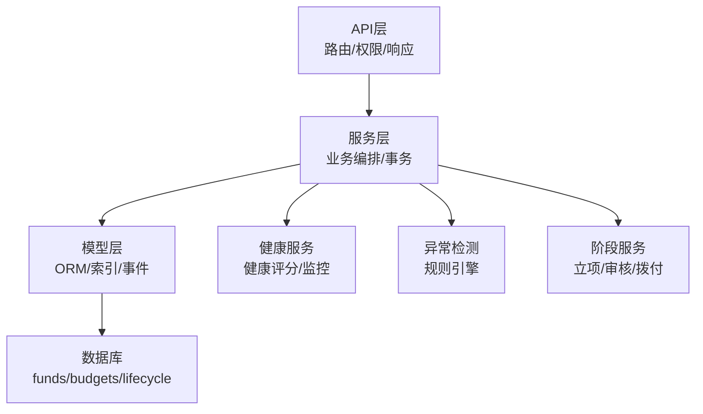
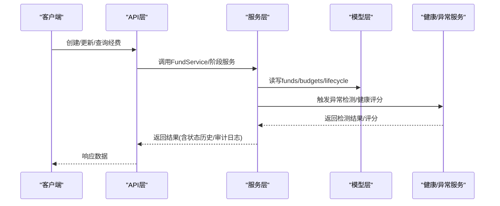
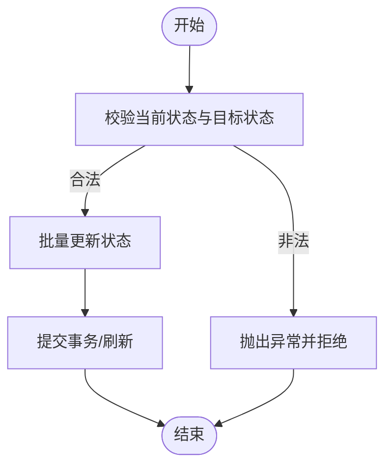
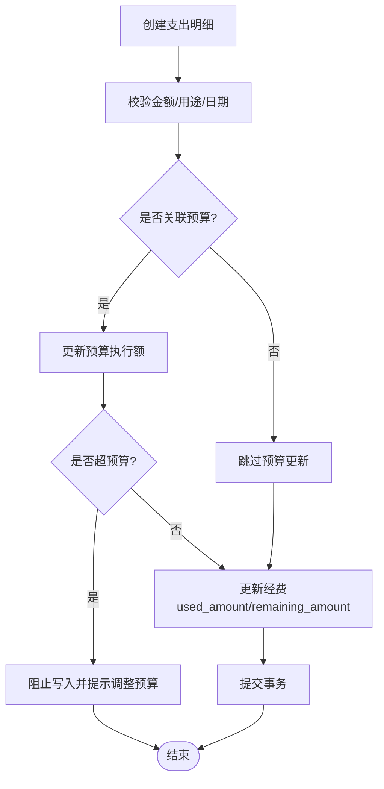
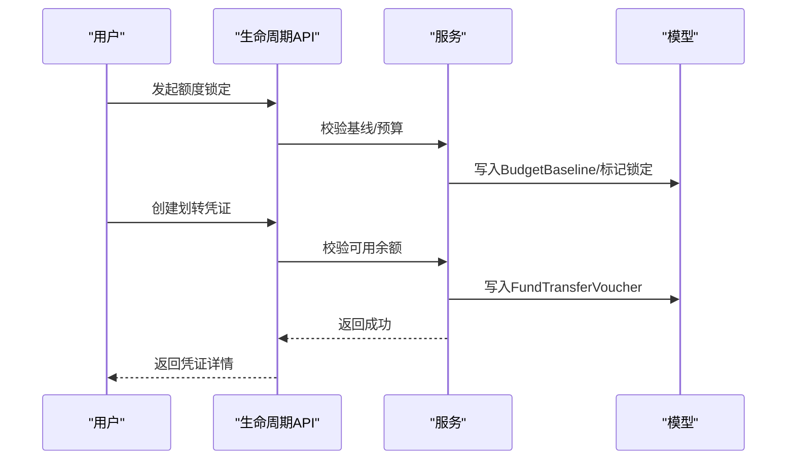
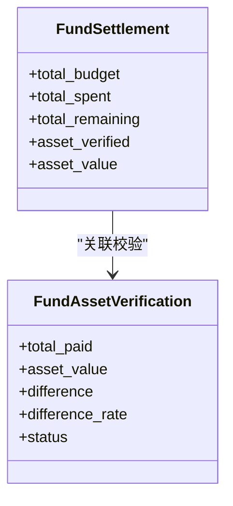
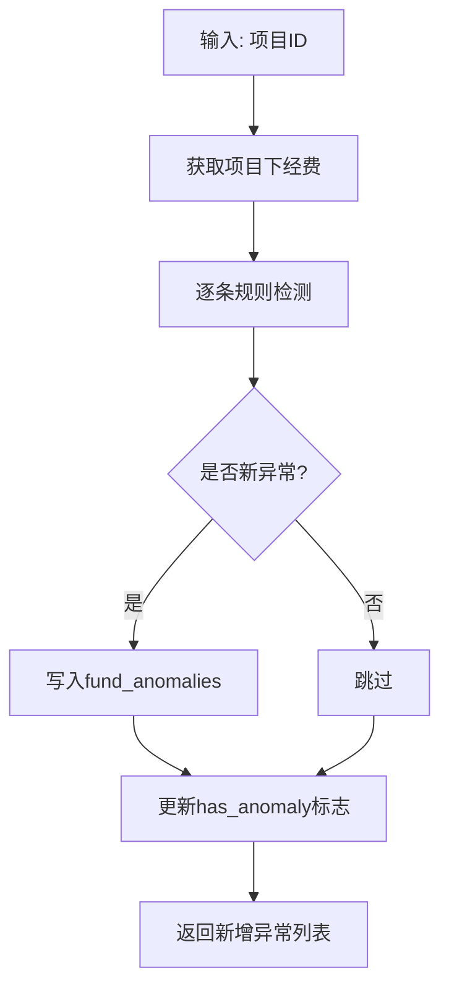
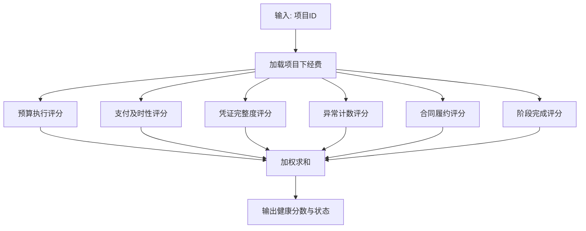
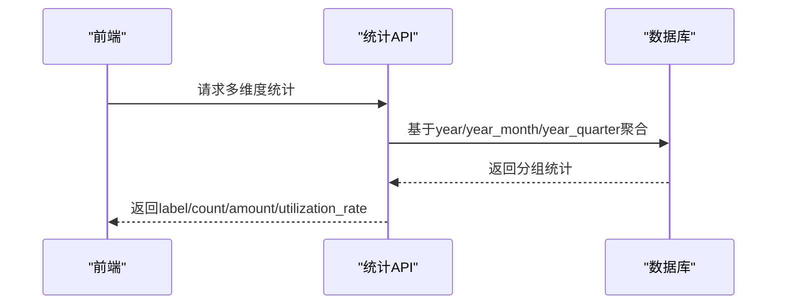
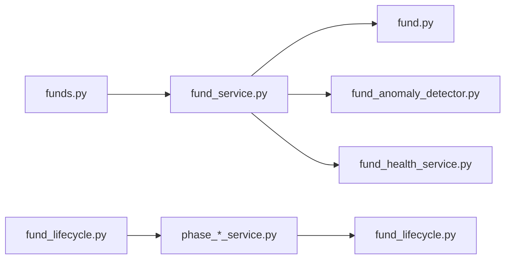

# 经费管理服务

<cite>
**本文引用的文件**
- [backend/app/models/fund.py](file://backend/app/models/fund.py)
- [backend/app/models/fund_budget.py](file://backend/app/models/fund_budget.py)
- [backend/app/models/fund_lifecycle.py](file://backend/app/models/fund_lifecycle.py)
- [backend/app/models/fund_allocation_order.py](file://backend/app/models/fund_allocation_order.py)
- [backend/app/models/fund_asset_verification.py](file://backend/app/models/fund_asset_verification.py)
- [backend/app/services/fund_service.py](file://backend/app/services/fund_service.py)
- [backend/app/services/fund_anomaly_detector.py](file://backend/app/services/fund_anomaly_detector.py)
- [backend/app/services/fund_health_service.py](file://backend/app/services/fund_health_service.py)
- [backend/app/services/funding/phase_init_service.py](file://backend/app/services/funding/phase_init_service.py)
- [backend/app/services/funding/phase_budget_service.py](file://backend/app/services/funding/phase_budget_service.py)
- [backend/app/api/v1/funds.py](file://backend/app/api/v1/funds.py)
- [backend/app/api/v1/fund_budgets.py](file://backend/app/api/v1/fund_budgets.py)
- [backend/app/api/v1/fund_lifecycle.py](file://backend/app/api/v1/fund_lifecycle.py)
</cite>

## 目录
1. [简介](#简介)
2. [项目结构](#项目结构)
3. [核心组件](#核心组件)
4. [架构总览](#架构总览)
5. [详细组件分析](#详细组件分析)
6. [依赖关系分析](#依赖关系分析)
7. [性能考量](#性能考量)
8. [故障排查指南](#故障排查指南)
9. [结论](#结论)
10. [附录](#附录)

## 简介
本文件面向“经费管理服务”，系统性说明预算编制、资金拨付、资产核查、财务报表等核心业务逻辑；阐述经费状态机与生命周期管理（申请、审批、执行、结算）；解释资金流转追踪（拨款记录、使用记录、结余计算）；覆盖异常检测算法（超支预警、违规识别、风险评分）与健康检查机制（数据完整性、一致性、性能监控）；提供报表生成方法（多维度统计、趋势预测、可视化展示）；并给出单元测试编写指导与Mock策略。

## 项目结构
经费管理采用分层架构：API层负责路由与入参校验，服务层封装业务规则与事务控制，模型层定义数据表结构与约束，辅助服务提供健康度、异常检测、阶段管理等能力。

**图表来源**
- [backend/app/api/v1/funds.py:360-445](file://backend/app/api/v1/funds.py#L360-L445)
- [backend/app/services/fund_service.py:29-130](file://backend/app/services/fund_service.py#L29-L130)
- [backend/app/models/fund.py:61-167](file://backend/app/models/fund.py#L61-L167)

**章节来源**
- [backend/app/api/v1/funds.py:360-445](file://backend/app/api/v1/funds.py#L360-L445)
- [backend/app/services/fund_service.py:29-130](file://backend/app/services/fund_service.py#L29-L130)
- [backend/app/models/fund.py:61-167](file://backend/app/models/fund.py#L61-L167)

## 核心组件
- 经费主数据与聚合字段：Fund 模型包含金额、状态、时间维度冗余字段（year/year_month/year_quarter），通过事件自动填充以优化聚合查询。
- 预算与明细：FundBudget 年度预算与 FundTransaction 支出明细，支持预算预警阈值与执行率计算。
- 生命周期与凭证：ProjectFundPhase/BudgetBaseline/FundTransferVoucher/FundContract/FundSettlement 等支撑七阶段管理与闭环。
- 拨款指令：FundAllocationOrder/AllocationOrderItem 实现指标文数字化解析与下级单位虚拟账户分配。
- 资产联动：FundAssetVerification 在项目决算前校验已付款与转固资产价值。
- 服务层：FundService 处理CRUD与状态机；FundHealthService 计算健康评分；FundAnomalyDetector 运行异常检测规则；PhaseInitService/PhaseBudgetService 管理阶段与基线。

**章节来源**
- [backend/app/models/fund.py:61-167](file://backend/app/models/fund.py#L61-L167)
- [backend/app/models/fund_budget.py:19-141](file://backend/app/models/fund_budget.py#L19-L141)
- [backend/app/models/fund_lifecycle.py:119-449](file://backend/app/models/fund_lifecycle.py#L119-L449)
- [backend/app/models/fund_allocation_order.py:23-113](file://backend/app/models/fund_allocation_order.py#L23-L113)
- [backend/app/models/fund_asset_verification.py:22-60](file://backend/app/models/fund_asset_verification.py#L22-L60)
- [backend/app/services/fund_service.py:29-289](file://backend/app/services/fund_service.py#L29-L289)
- [backend/app/services/fund_health_service.py:14-199](file://backend/app/services/fund_health_service.py#L14-L199)
- [backend/app/services/fund_anomaly_detector.py:34-94](file://backend/app/services/fund_anomaly_detector.py#L34-L94)
- [backend/app/services/funding/phase_init_service.py:19-70](file://backend/app/services/funding/phase_init_service.py#L19-L70)
- [backend/app/services/funding/phase_budget_service.py:14-45](file://backend/app/services/funding/phase_budget_service.py#L14-L45)

## 架构总览
经费管理从API到服务再到模型的调用链如下：

**图表来源**
- [backend/app/api/v1/funds.py:483-531](file://backend/app/api/v1/funds.py#L483-L531)
- [backend/app/services/fund_service.py:114-185](file://backend/app/services/fund_service.py#L114-L185)
- [backend/app/services/fund_anomaly_detector.py:34-94](file://backend/app/services/fund_anomaly_detector.py#L34-L94)
- [backend/app/services/fund_health_service.py:142-199](file://backend/app/services/fund_health_service.py#L142-L199)

## 详细组件分析

### 经费状态机与生命周期
- 状态机白名单：pending→planned/approved/rejected；planned→approved/rejected；approved→allocated/rejected；rejected→pending/planned；allocated→in_use；in_use→completed；completed→audited。
- 批量状态更新带合法性校验，非法流转整体拒绝。
- 生命周期七阶段：论证立项、汇总审核、计划下达与资金拨付、对接与资金划转、组织实施与过程监管、核查督查与效益评估、常态监管与项目决算。阶段推进需无严重异常。

**图表来源**
- [backend/app/services/fund_service.py:230-289](file://backend/app/services/fund_service.py#L230-L289)
- [backend/app/api/v1/fund_lifecycle.py:188-229](file://backend/app/api/v1/fund_lifecycle.py#L188-L229)

**章节来源**
- [backend/app/services/fund_service.py:230-289](file://backend/app/services/fund_service.py#L230-L289)
- [backend/app/api/v1/fund_lifecycle.py:188-229](file://backend/app/api/v1/fund_lifecycle.py#L188-L229)

### 预算编制与执行
- 预算科目与额度：FundBudget 支持按年度/类别/村/组织维度管理预算金额与执行额，并提供剩余金额与执行率计算。
- 预算预警：超过80%黄灯、90%橙灯、100%红灯禁止继续核销。
- 使用明细：FundTransaction 记录支出用途、日期、凭证号等，写入时自动回写预算执行额与经费已用金额、结余。

**图表来源**
- [backend/app/api/v1/fund_budgets.py:324-376](file://backend/app/api/v1/fund_budgets.py#L324-L376)
- [backend/app/models/fund_budget.py:143-202](file://backend/app/models/fund_budget.py#L143-L202)

**章节来源**
- [backend/app/api/v1/fund_budgets.py:324-376](file://backend/app/api/v1/fund_budgets.py#L324-L376)
- [backend/app/models/fund_budget.py:143-202](file://backend/app/models/fund_budget.py#L143-L202)

### 资金拨付与划转
- 额度锁定：阶段3需先锁定预算基线，拨付额度不得超基线。
- 划转凭证：FundTransferVoucher 记录方向、金额、账户、日期与状态，创建时校验可用预算余额。
- 拨款指令：FundAllocationOrder/AllocationOrderItem 将指标文拆分至下级单位虚拟账户，跟踪接收与确认。

**图表来源**
- [backend/app/api/v1/fund_lifecycle.py:549-578](file://backend/app/api/v1/fund_lifecycle.py#L549-L578)
- [backend/app/api/v1/fund_lifecycle.py:693-741](file://backend/app/api/v1/fund_lifecycle.py#L693-L741)
- [backend/app/models/fund_allocation_order.py:23-113](file://backend/app/models/fund_allocation_order.py#L23-L113)

**章节来源**
- [backend/app/api/v1/fund_lifecycle.py:549-578](file://backend/app/api/v1/fund_lifecycle.py#L549-L578)
- [backend/app/api/v1/fund_lifecycle.py:693-741](file://backend/app/api/v1/fund_lifecycle.py#L693-L741)
- [backend/app/models/fund_allocation_order.py:23-113](file://backend/app/models/fund_allocation_order.py#L23-L113)

### 资产核查与决算
- 资产联动：FundAssetVerification 在项目决算前校验已付款总额与转固资产价值差异及差异率。
- 决算：FundSettlement 汇总总预算、总支出、总结余，并与资产校验联动作为销号前置条件。

**图表来源**
- [backend/app/models/fund_lifecycle.py:364-409](file://backend/app/models/fund_lifecycle.py#L364-L409)
- [backend/app/models/fund_asset_verification.py:22-60](file://backend/app/models/fund_asset_verification.py#L22-L60)

**章节来源**
- [backend/app/models/fund_lifecycle.py:364-409](file://backend/app/models/fund_lifecycle.py#L364-L409)
- [backend/app/models/fund_asset_verification.py:22-60](file://backend/app/models/fund_asset_verification.py#L22-L60)

### 异常检测算法
- 规则集：超支预警（使用/批准比例）、进度偏差、资金闲置（拨付后N天未动用）、重复支付（凭证号或相近金额+日期）、缺失凭证、大额提现、合同拆分、单一来源采购。
- 去重写入：同项目+同类型+同经费且未解决的异常不重复落库；同时更新经费的 has_anomaly 标志。

**图表来源**
- [backend/app/services/fund_anomaly_detector.py:34-94](file://backend/app/services/fund_anomaly_detector.py#L34-L94)
- [backend/app/services/fund_anomaly_detector.py:99-315](file://backend/app/services/fund_anomaly_detector.py#L99-L315)

**章节来源**
- [backend/app/services/fund_anomaly_detector.py:34-94](file://backend/app/services/fund_anomaly_detector.py#L34-L94)
- [backend/app/services/fund_anomaly_detector.py:99-315](file://backend/app/services/fund_anomaly_detector.py#L99-L315)

### 健康检查机制
- 健康评分：综合预算执行、支付及时性、凭证完整度、异常数量、合同履约、阶段完成度加权计算，输出健康分数与状态（healthy/warning/critical）。
- 项目级聚合：calculate_project_health_sync 对某项目下全部经费进行健康度聚合。

**图表来源**
- [backend/app/services/fund_health_service.py:142-199](file://backend/app/services/fund_health_service.py#L142-L199)

**章节来源**
- [backend/app/services/fund_health_service.py:142-199](file://backend/app/services/fund_health_service.py#L142-L199)

### 报表生成与可视化
- 概览统计：单次聚合查询返回总量、各状态计数、已用/已拨金额、预算总额/执行/剩余/使用率。
- 多维度统计：支持按周期（月/季/年）、类型、来源、状态分组，利用冗余字段避免全表扫描。
- 预算汇总：按年度/类别/村/单位/组织维度聚合，提供饼图与柱状图预计算数据。

**图表来源**
- [backend/app/api/v1/funds.py:617-760](file://backend/app/api/v1/funds.py#L617-L760)
- [backend/app/api/v1/fund_lifecycle.py:435-541](file://backend/app/api/v1/fund_lifecycle.py#L435-L541)

**章节来源**
- [backend/app/api/v1/funds.py:617-760](file://backend/app/api/v1/funds.py#L617-L760)
- [backend/app/api/v1/fund_lifecycle.py:435-541](file://backend/app/api/v1/fund_lifecycle.py#L435-L541)

### 单元测试编写指导与Mock策略
- 测试范围建议：
  - 状态机流转：覆盖所有合法/非法流转路径，验证批量更新的原子性与错误信息。
  - 预算预警：构造不同执行率场景，验证阈值与禁止核销行为。
  - 异常检测：注入各类异常数据（超支、闲置、重复凭证、缺失凭证、大额提现、合同拆分、单一来源），验证去重与标志位更新。
  - 健康评分：构造不同权重场景，验证最终分数与状态分类。
  - 生命周期阶段：初始化、推进、退回、危险异常阻断。
- Mock策略：
  - 数据库会话：使用pytest fixture提供内存SQLite或Mock Session，隔离外部依赖。
  - 第三方服务：如审批工作流服务失败不影响主流程，应Mock其提交/审批接口并验证日志分支。
  - 文件上传：Mock保存与路径生成，仅验证元数据写入。
  - 时间相关：冻结时间以稳定闲置天数与季度计算。

**章节来源**
- [backend/app/services/fund_service.py:230-289](file://backend/app/services/fund_service.py#L230-L289)
- [backend/app/api/v1/fund_budgets.py:226-243](file://backend/app/api/v1/fund_budgets.py#L226-L243)
- [backend/app/services/fund_anomaly_detector.py:34-94](file://backend/app/services/fund_anomaly_detector.py#L34-L94)
- [backend/app/services/fund_health_service.py:142-199](file://backend/app/services/fund_health_service.py#L142-L199)
- [backend/app/api/v1/fund_lifecycle.py:188-229](file://backend/app/api/v1/fund_lifecycle.py#L188-L229)

## 依赖关系分析
- 模块耦合：
  - API层依赖服务层与模型层，服务层依赖模型与辅助服务（健康/异常/阶段）。
  - 模型间通过外键关联（如Fund与Project/Village/Organization，Fund与FundTransaction等）。
- 直接/间接依赖：
  - FundService 直接依赖 Fund 模型与事务工具；FundAnomalyDetector 依赖 Fund/FundTransaction/FundAnomaly；FundHealthService 依赖 Fund/FundAnomaly/ProjectFundPhase。
- 外部集成点：
  - 审批工作流服务（创建/完结任务）；上传服务（附件存储）；数据权限适配器（组织树展开）。

**图表来源**
- [backend/app/api/v1/funds.py:483-531](file://backend/app/api/v1/funds.py#L483-L531)
- [backend/app/services/fund_service.py:29-130](file://backend/app/services/fund_service.py#L29-L130)
- [backend/app/services/funding/phase_init_service.py:19-70](file://backend/app/services/funding/phase_init_service.py#L19-L70)
- [backend/app/services/funding/phase_budget_service.py:14-45](file://backend/app/services/funding/phase_budget_service.py#L14-L45)

**章节来源**
- [backend/app/api/v1/funds.py:483-531](file://backend/app/api/v1/funds.py#L483-L531)
- [backend/app/services/fund_service.py:29-130](file://backend/app/services/fund_service.py#L29-L130)
- [backend/app/services/funding/phase_init_service.py:19-70](file://backend/app/services/funding/phase_init_service.py#L19-L70)
- [backend/app/services/funding/phase_budget_service.py:14-45](file://backend/app/services/funding/phase_budget_service.py#L14-L45)

## 性能考量
- 聚合优化：在 Fund 模型中引入 year/year_month/year_quarter 冗余字段，配合复合索引，避免 strftime 全表扫描，提升大屏统计与多维度分析性能。
- N+1 消除：列表与详情查询使用 joinedload/selectinload 预加载关联对象，减少额外查询。
- 批量操作：批量状态更新使用 bulk update，避免循环逐条更新。
- 分页策略：支持 offset 与 keyset 两种分页，keyset 适合大数据量滚动加载。

**章节来源**
- [backend/app/models/fund.py:66-86](file://backend/app/models/fund.py#L66-L86)
- [backend/app/models/fund.py:199-226](file://backend/app/models/fund.py#L199-L226)
- [backend/app/api/v1/funds.py:360-445](file://backend/app/api/v1/funds.py#L360-L445)
- [backend/app/services/fund_service.py:40-99](file://backend/app/services/fund_service.py#L40-L99)

## 故障排查指南
- 常见错误定位：
  - 状态流转非法：检查当前状态与目标状态是否在白名单内，查看批量更新抛出的样本记录。
  - 预算超支：核对预算执行额与阈值，确认是否已锁定基线；检查是否存在重复凭证或大额提现。
  - 健康评分低：查看异常数量、预算执行率、凭证完整度、阶段完成度等细节得分。
- 日志与审计：
  - 状态变更历史：FundStatusHistory 记录每次状态流转的操作人与备注。
  - 字段变更留痕：FundFieldChange 记录具体字段的旧值与新值。
  - 工作日志：write_work_log 记录关键操作（如创建划转凭证、支出明细）。

**章节来源**
- [backend/app/api/v1/funds.py:768-800](file://backend/app/api/v1/funds.py#L768-L800)
- [backend/app/api/v1/fund_budgets.py:324-376](file://backend/app/api/v1/fund_budgets.py#L324-L376)
- [backend/app/services/fund_health_service.py:142-199](file://backend/app/services/fund_health_service.py#L142-L199)

## 结论
经费管理服务通过严谨的状态机与生命周期管理、完善的预算与明细台账、健壮的异常检测与健康评分机制，以及高性能的多维度统计与报表能力，实现了从预算编制、资金拨付、资产核查到决算的全流程闭环。系统在设计上注重性能优化与可维护性，为后续扩展与运维提供了坚实基础。

## 附录
- 术语说明：
  - 预算基线：阶段2锁定的预算快照，用于后续拨付与执行约束。
  - 划转凭证：记录军地之间资金划转方向的凭据，含金额、账户与状态。
  - 资产联动：决算前对已付款与转固资产价值的比对校验。
- 参考端点：
  - 经费列表/详情/创建/更新/删除：/api/v1/funds/*
  - 预算与明细：/api/v1/fund-budgets/*
  - 生命周期：/api/v1/fund-lifecycle/*