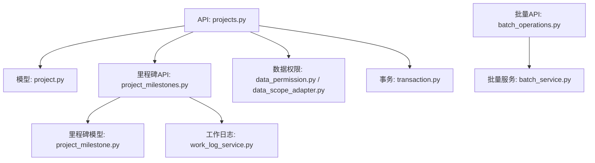
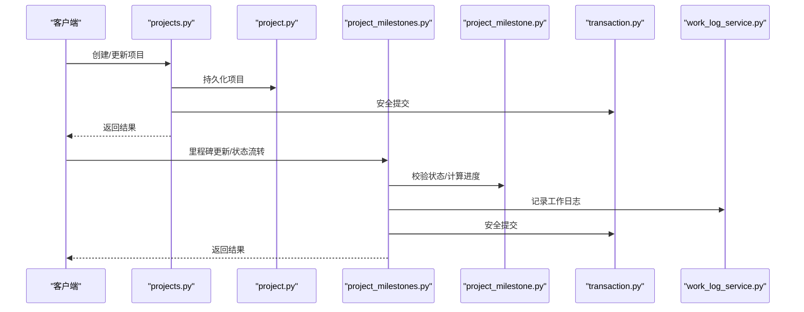
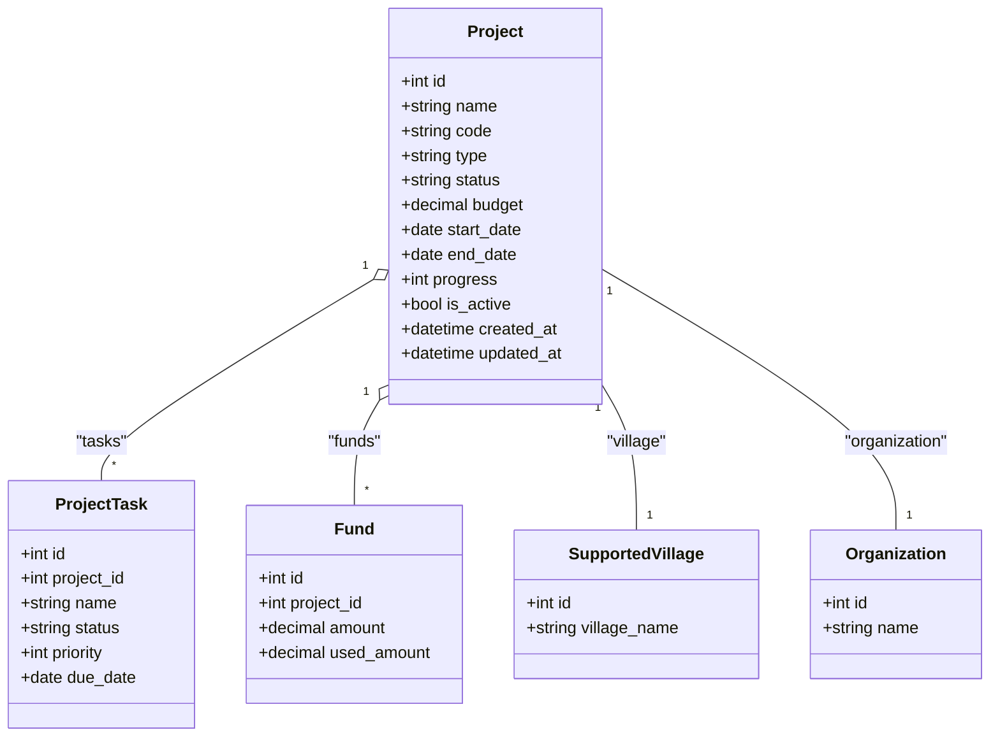
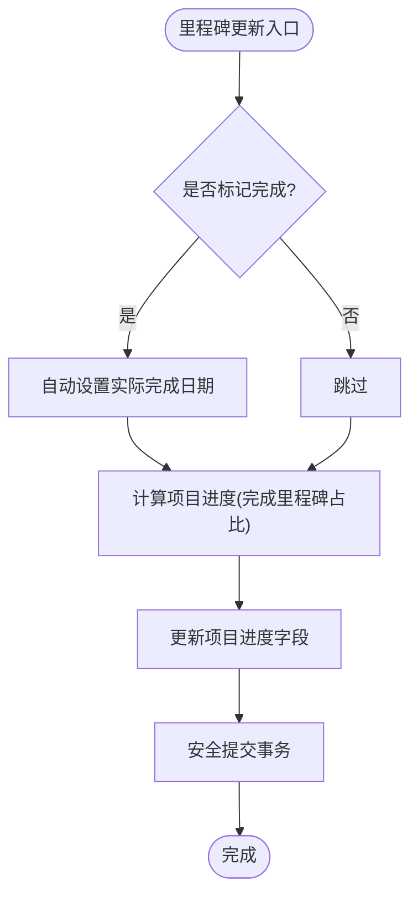
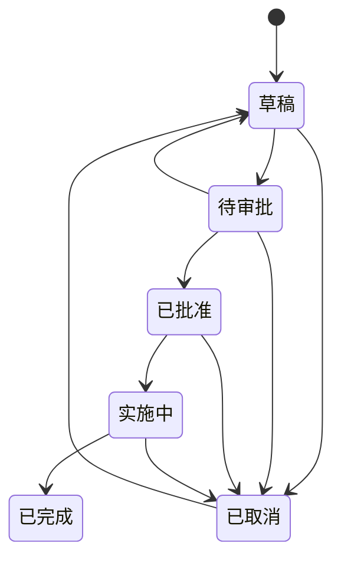
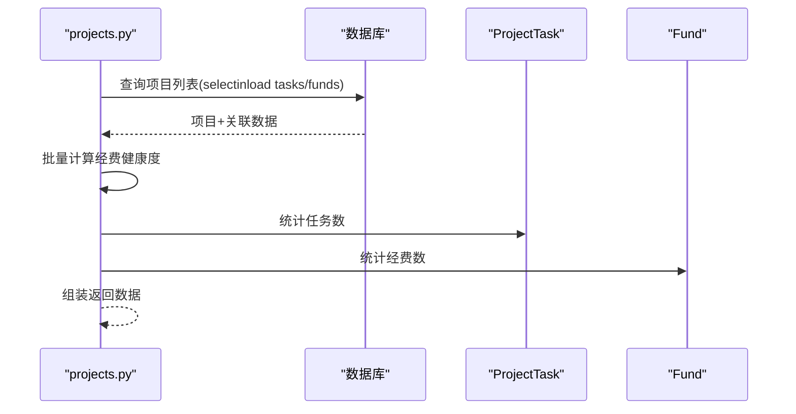
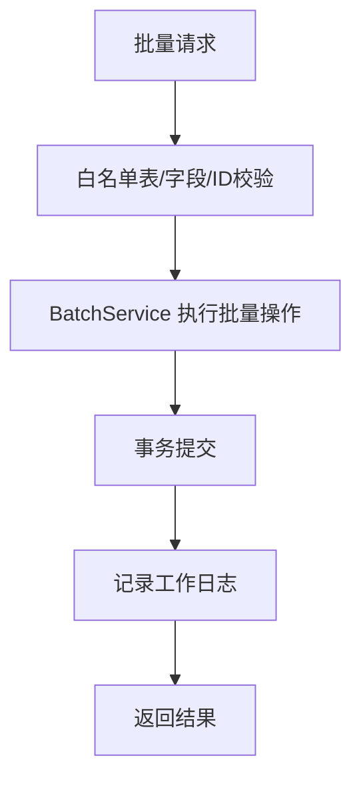
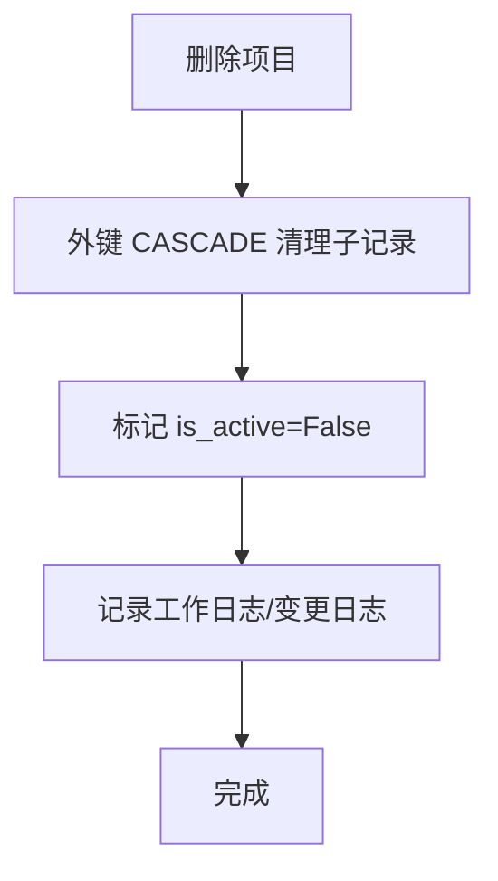
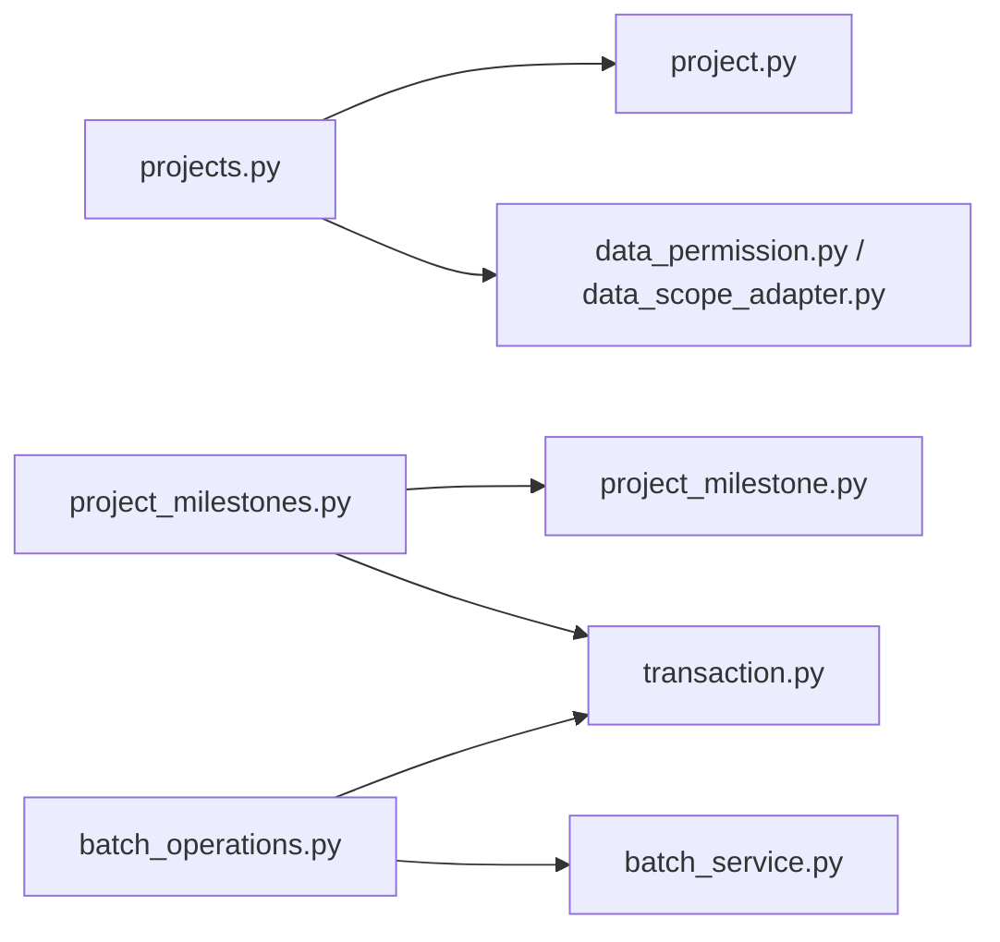

# 项目服务

<cite>
**本文引用的文件**
- [backend/app/models/project.py](file://backend/app/models/project.py)
- [backend/app/models/project_milestone.py](file://backend/app/models/project_milestone.py)
- [backend/app/api/v1/projects.py](file://backend/app/api/v1/projects.py)
- [backend/app/api/v1/project_milestones.py](file://backend/app/api/v1/project_milestones.py)
- [backend/app/api/v1/batch_operations.py](file://backend/app/api/v1/batch_operations.py)
- [backend/app/services/batch_service.py](file://backend/app/services/batch_service.py)
- [backend/app/core/transaction.py](file://backend/app/core/transaction.py)
- [backend/app/core/data_permission.py](file://backend/app/core/data_permission.py)
- [backend/app/core/data_scope_adapter.py](file://backend/app/core/data_scope_adapter.py)
- [backend/app/core/security.py](file://backend/app/core/security.py)
- [backend/app/services/work_log_service.py](file://backend/app/services/work_log_service.py)
</cite>

## 目录
1. [简介](#简介)
2. [项目结构](#项目结构)
3. [核心组件](#核心组件)
4. [架构总览](#架构总览)
5. [详细组件分析](#详细组件分析)
6. [依赖关系分析](#依赖关系分析)
7. [性能考虑](#性能考虑)
8. [故障排查指南](#故障排查指南)
9. [结论](#结论)
10. [附录](#附录)

## 简介
本文件面向“项目服务”的全生命周期管理，覆盖项目创建、编辑、状态跟踪、里程碑管理、关联关系（任务、经费）、批量操作与事务保证、级联删除与审计日志、以及查询优化与缓存策略等。文档以代码为依据，提供可追溯的章节来源与图示，帮助读者快速理解并落地使用。

## 项目结构
后端采用分层设计：API 路由层负责请求解析与响应封装；领域模型位于 models；业务规则集中在 milestone 状态机与 API 层的编排；数据权限与范围过滤通过 core 模块统一注入；批量操作由通用 batch 服务支撑；工作日志记录贯穿关键变更点。

**图表来源**
- [backend/app/api/v1/projects.py:1-120](file://backend/app/api/v1/projects.py#L1-L120)
- [backend/app/models/project.py:47-175](file://backend/app/models/project.py#L47-L175)
- [backend/app/api/v1/project_milestones.py:1-40](file://backend/app/api/v1/project_milestones.py#L1-L40)
- [backend/app/models/project_milestone.py:12-58](file://backend/app/models/project_milestone.py#L12-L58)
- [backend/app/core/data_permission.py:1-200](file://backend/app/core/data_permission.py#L1-L200)
- [backend/app/core/data_scope_adapter.py:1-200](file://backend/app/core/data_scope_adapter.py#L1-L200)
- [backend/app/core/transaction.py:1-200](file://backend/app/core/transaction.py#L1-L200)
- [backend/app/services/work_log_service.py:1-200](file://backend/app/services/work_log_service.py#L1-L200)
- [backend/app/api/v1/batch_operations.py:1-120](file://backend/app/api/v1/batch_operations.py#L1-L120)
- [backend/app/services/batch_service.py:1-200](file://backend/app/services/batch_service.py#L1-L200)

**章节来源**
- [backend/app/api/v1/projects.py:1-120](file://backend/app/api/v1/projects.py#L1-L120)
- [backend/app/models/project.py:47-175](file://backend/app/models/project.py#L47-L175)
- [backend/app/api/v1/project_milestones.py:1-40](file://backend/app/api/v1/project_milestones.py#L1-L40)
- [backend/app/models/project_milestone.py:12-58](file://backend/app/models/project_milestone.py#L12-L58)
- [backend/app/api/v1/batch_operations.py:1-120](file://backend/app/api/v1/batch_operations.py#L1-L120)

## 核心组件
- 项目模型与索引：定义项目主表及常用查询索引，支持按状态、类型、村庄、组织、时间等多维筛选。
- 里程碑与变更记录：里程碑用于进度追踪，变更记录用于审计；内置状态流转校验与进度计算。
- 项目API：提供列表、详情、统计、导出、CRUD、任务与经费关联、权限与范围过滤。
- 里程碑API：里程碑增删改查、状态流转、变更记录查询、即将到期与逾期里程碑。
- 批量操作API：批量更新、删除、导出与校验，基于白名单表与严格字段限制。
- 事务与工作日志：关键写操作使用安全提交，工作日志记录里程碑与批量操作。

**章节来源**
- [backend/app/models/project.py:47-175](file://backend/app/models/project.py#L47-L175)
- [backend/app/models/project_milestone.py:12-105](file://backend/app/models/project_milestone.py#L12-L105)
- [backend/app/api/v1/projects.py:513-787](file://backend/app/api/v1/projects.py#L513-L787)
- [backend/app/api/v1/project_milestones.py:105-336](file://backend/app/api/v1/project_milestones.py#L105-L336)
- [backend/app/api/v1/batch_operations.py:121-245](file://backend/app/api/v1/batch_operations.py#L121-L245)

## 架构总览
项目服务遵循“API 路由 → 领域模型 + 权限/范围 → 事务 → 日志/审计”的链路。里程碑状态机作为独立能力被里程碑API调用，同时影响项目进度。批量操作通过统一服务实现跨表一致性与安全控制。

**图表来源**
- [backend/app/api/v1/projects.py:790-800](file://backend/app/api/v1/projects.py#L790-L800)
- [backend/app/models/project.py:47-175](file://backend/app/models/project.py#L47-L175)
- [backend/app/api/v1/project_milestones.py:121-180](file://backend/app/api/v1/project_milestones.py#L121-L180)
- [backend/app/models/project_milestone.py:144-187](file://backend/app/models/project_milestone.py#L144-L187)
- [backend/app/core/transaction.py:1-200](file://backend/app/core/transaction.py#L1-L200)
- [backend/app/services/work_log_service.py:1-200](file://backend/app/services/work_log_service.py#L1-L200)

## 详细组件分析

### 项目模型与数据访问
- 项目主表包含基础信息、预算与资金相关字段、软删除标记与审计字段。
- 为常见查询组合建立单列与复合索引，提升列表、统计、导出等场景性能。
- 通过 relationship 关联任务、经费、帮扶村与组织，默认 lazy="noload"，在 API 层按需 selectinload 避免 N+1。

**图表来源**
- [backend/app/models/project.py:47-175](file://backend/app/models/project.py#L47-L175)

**章节来源**
- [backend/app/models/project.py:47-175](file://backend/app/models/project.py#L47-L175)

### 里程碑管理与进度计算
- 里程碑记录计划与实际完成日期、负责人、状态与排序，支持自动填充完成日期。
- 项目进度根据里程碑完成比例自动计算，并在里程碑更新/删除时触发。
- 变更记录表记录关键字段变更历史，便于审计与回溯。

**图表来源**
- [backend/app/api/v1/project_milestones.py:143-180](file://backend/app/api/v1/project_milestones.py#L143-L180)
- [backend/app/models/project_milestone.py:181-187](file://backend/app/models/project_milestone.py#L181-L187)
- [backend/app/api/v1/project_milestones.py:458-465](file://backend/app/api/v1/project_milestones.py#L458-L465)

**章节来源**
- [backend/app/models/project_milestone.py:12-105](file://backend/app/models/project_milestone.py#L12-L105)
- [backend/app/api/v1/project_milestones.py:121-180](file://backend/app/api/v1/project_milestones.py#L121-L180)
- [backend/app/api/v1/project_milestones.py:458-465](file://backend/app/api/v1/project_milestones.py#L458-L465)

### 项目状态机设计与转换规则
- 合法流转路径：草稿→待审批→已批准→实施中→已完成；取消态可回退至草稿。
- 阶段准入条件：提交审批需填写必要字段；启动需实际开始日期；完成需实际结束日期与成果。
- 校验函数集中维护规则，API 层在流转前执行校验，失败则回滚临时写入字段。

**图表来源**
- [backend/app/models/project_milestone.py:111-118](file://backend/app/models/project_milestone.py#L111-L118)
- [backend/app/models/project_milestone.py:121-141](file://backend/app/models/project_milestone.py#L121-L141)
- [backend/app/models/project_milestone.py:144-178](file://backend/app/models/project_milestone.py#L144-L178)

**章节来源**
- [backend/app/models/project_milestone.py:111-178](file://backend/app/models/project_milestone.py#L111-L178)
- [backend/app/api/v1/project_milestones.py:218-306](file://backend/app/api/v1/project_milestones.py#L218-L306)

### 项目关联关系管理（任务、资源、进度汇报）
- 任务分配：ProjectTask 与 Project 一对多关联，支持优先级、截止日期与状态。
- 资源调度：Fund 与 Project 一对多关联，列表接口批量获取经费健康度指标，避免 N+1。
- 进度汇报：里程碑完成驱动项目进度自动更新；列表/详情接口聚合任务与经费数量。

**图表来源**
- [backend/app/api/v1/projects.py:657-753](file://backend/app/api/v1/projects.py#L657-L753)
- [backend/app/api/v1/projects.py:756-787](file://backend/app/api/v1/projects.py#L756-L787)
- [backend/app/models/project.py:167-175](file://backend/app/models/project.py#L167-L175)

**章节来源**
- [backend/app/api/v1/projects.py:657-787](file://backend/app/api/v1/projects.py#L657-L787)
- [backend/app/models/project.py:167-175](file://backend/app/models/project.py#L167-L175)

### 批量操作处理（导入、更新、删除的事务保证）
- 批量更新/删除/导出：统一通过 BatchService 实现，表名白名单校验、敏感字段保护、ID 范围限制。
- 事务与一致性：批量操作在服务层进行批量写入，结合安全提交确保原子性；异常时抛出统一错误类型。
- 审计日志：批量操作成功后记录工作日志，失败不阻断主流程但记录告警。

**图表来源**
- [backend/app/api/v1/batch_operations.py:23-87](file://backend/app/api/v1/batch_operations.py#L23-L87)
- [backend/app/api/v1/batch_operations.py:121-245](file://backend/app/api/v1/batch_operations.py#L121-L245)
- [backend/app/services/batch_service.py:1-200](file://backend/app/services/batch_service.py#L1-L200)
- [backend/app/core/transaction.py:1-200](file://backend/app/core/transaction.py#L1-L200)

**章节来源**
- [backend/app/api/v1/batch_operations.py:23-245](file://backend/app/api/v1/batch_operations.py#L23-L245)
- [backend/app/services/batch_service.py:1-200](file://backend/app/services/batch_service.py#L1-L200)

### 级联删除与数据清理、审计日志
- 外键级联：项目删除时，里程碑、任务、附件等通过 ondelete="CASCADE" 自动清理。
- 软删除：项目主表使用 is_active 标记软删，列表/统计默认排除软删记录，管理员可通过参数查看。
- 审计日志：里程碑与批量操作均记录工作日志，便于追踪变更。

**图表来源**
- [backend/app/models/project.py:239-320](file://backend/app/models/project.py#L239-L320)
- [backend/app/models/project_milestone.py:23-58](file://backend/app/models/project_milestone.py#L23-L58)
- [backend/app/api/v1/project_milestones.py:183-212](file://backend/app/api/v1/project_milestones.py#L183-L212)
- [backend/app/api/v1/batch_operations.py:164-199](file://backend/app/api/v1/batch_operations.py#L164-L199)

**章节来源**
- [backend/app/models/project.py:239-320](file://backend/app/models/project.py#L239-L320)
- [backend/app/models/project_milestone.py:23-58](file://backend/app/models/project_milestone.py#L23-L58)
- [backend/app/api/v1/project_milestones.py:183-212](file://backend/app/api/v1/project_milestones.py#L183-L212)
- [backend/app/api/v1/batch_operations.py:164-199](file://backend/app/api/v1/batch_operations.py#L164-L199)

### 复杂业务场景的错误处理与恢复
- 状态流转失败：校验未通过时回滚临时写入字段，返回明确错误与缺失字段提示。
- 权限与范围：跨组织访问拒绝，统一通过数据权限与范围适配器过滤。
- 批量操作异常：区分验证错误、数据库错误与未预期错误，分别抛出或记录日志。

**章节来源**
- [backend/app/api/v1/project_milestones.py:249-306](file://backend/app/api/v1/project_milestones.py#L249-L306)
- [backend/app/api/v1/projects.py:118-146](file://backend/app/api/v1/projects.py#L118-L146)
- [backend/app/api/v1/batch_operations.py:121-245](file://backend/app/api/v1/batch_operations.py#L121-L245)

## 依赖关系分析
- API 层依赖模型与权限/范围模块，确保数据隔离与访问控制。
- 里程碑API依赖状态机与进度计算逻辑，保障业务规则一致性。
- 批量操作依赖统一服务与事务模块，确保跨表一致性与安全性。

**图表来源**
- [backend/app/api/v1/projects.py:1-120](file://backend/app/api/v1/projects.py#L1-L120)
- [backend/app/api/v1/project_milestones.py:1-40](file://backend/app/api/v1/project_milestones.py#L1-L40)
- [backend/app/api/v1/batch_operations.py:1-120](file://backend/app/api/v1/batch_operations.py#L1-L120)
- [backend/app/core/data_permission.py:1-200](file://backend/app/core/data_permission.py#L1-L200)
- [backend/app/core/data_scope_adapter.py:1-200](file://backend/app/core/data_scope_adapter.py#L1-L200)
- [backend/app/core/transaction.py:1-200](file://backend/app/core/transaction.py#L1-L200)

**章节来源**
- [backend/app/api/v1/projects.py:1-120](file://backend/app/api/v1/projects.py#L1-L120)
- [backend/app/api/v1/project_milestones.py:1-40](file://backend/app/api/v1/project_milestones.py#L1-L40)
- [backend/app/api/v1/batch_operations.py:1-120](file://backend/app/api/v1/batch_operations.py#L1-L120)

## 性能考虑
- 查询优化：
  - 列表接口使用 selectinload 预加载关联数据，避免 N+1。
  - 批量获取经费健康度指标，内存分组计算减少多次查询。
  - 为状态、类型、村庄、组织、时间等常用查询建立索引。
- 缓存策略：
  - 可在统计与列表接口引入缓存层（如 Redis），对热点数据（如统计概览）做短期缓存。
  - 注意缓存失效策略与数据一致性，尤其在状态流转与里程碑更新后。
- 异步处理：
  - 导出大文件可采用流式响应或后台任务，避免阻塞请求。
  - 里程碑进度计算与审计日志写入可考虑异步化，降低主流程延迟。

[本节为通用指导，不直接分析具体文件]

## 故障排查指南
- 状态流转失败：检查当前状态与目标状态是否在合法路径内，确认必填字段是否满足准入条件。
- 权限问题：确认用户角色与数据范围，跨组织访问会被拒绝。
- 批量操作失败：检查表名白名单、ID 范围与敏感字段限制；查看工作日志中的失败原因。
- 进度不同步：确认里程碑更新是否触发进度计算，检查事务提交是否成功。

**章节来源**
- [backend/app/models/project_milestone.py:144-178](file://backend/app/models/project_milestone.py#L144-L178)
- [backend/app/api/v1/projects.py:118-146](file://backend/app/api/v1/projects.py#L118-L146)
- [backend/app/api/v1/batch_operations.py:121-245](file://backend/app/api/v1/batch_operations.py#L121-L245)
- [backend/app/api/v1/project_milestones.py:458-465](file://backend/app/api/v1/project_milestones.py#L458-L465)

## 结论
项目服务通过清晰的模型设计、严谨的状态机与权限控制、完善的批量操作与事务保证，实现了从立项到归档的全生命周期管理。里程碑驱动的进度计算与变更记录提供了可追溯的审计能力。配合查询优化与缓存策略，系统在高并发与大数据量场景下具备良好性能与稳定性。

[本节为总结性内容，不直接分析具体文件]

## 附录
- 关键接口参考：
  - 项目列表/详情/统计/导出：projects.py
  - 里程碑管理/状态流转/变更记录：project_milestones.py
  - 批量操作：batch_operations.py
- 数据权限与范围：
  - data_permission.py、data_scope_adapter.py
- 事务与工作日志：
  - transaction.py、work_log_service.py

[本节为补充说明，不直接分析具体文件]