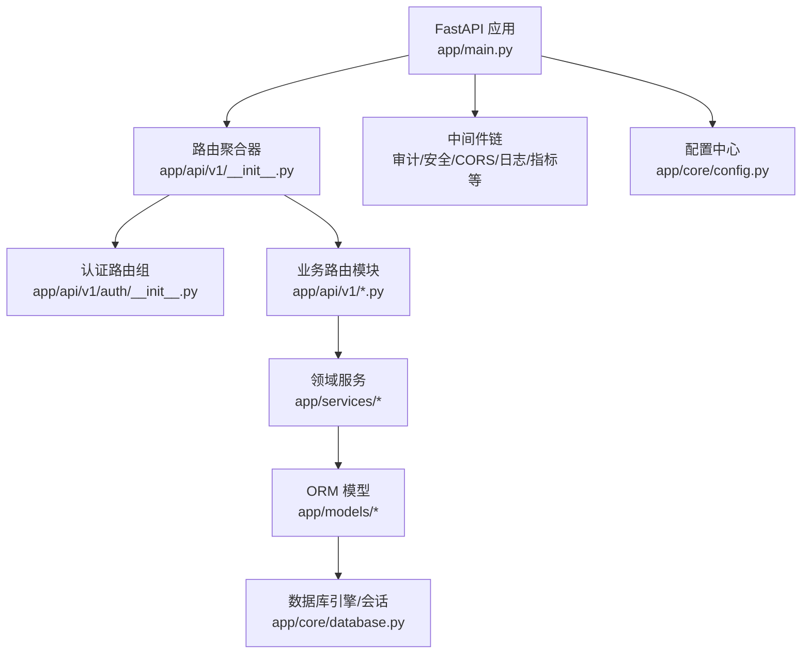
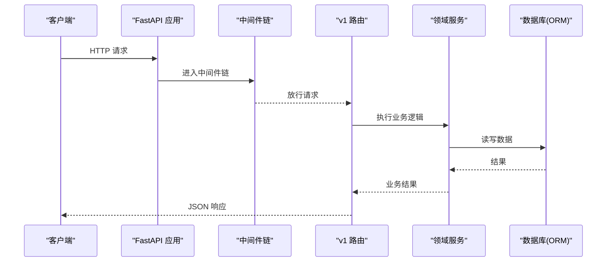
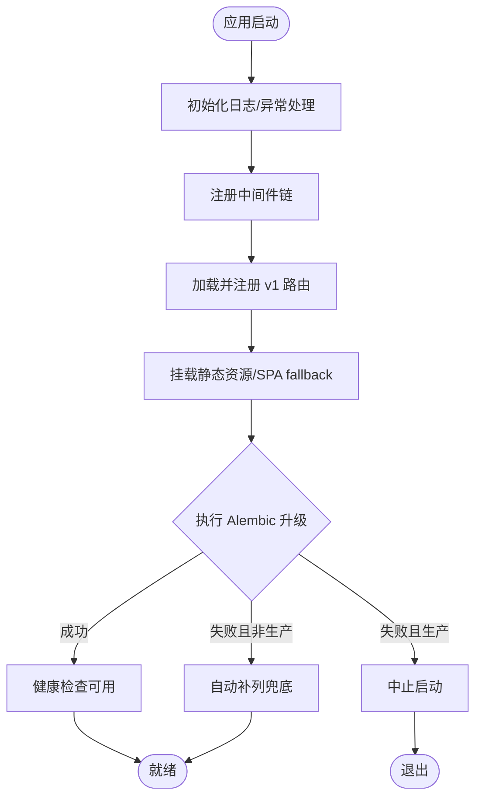
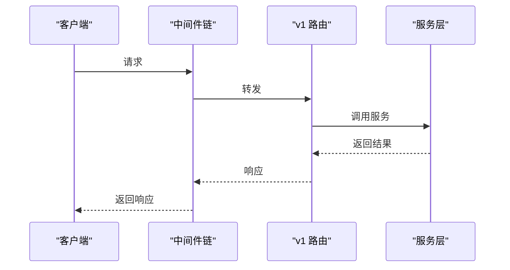
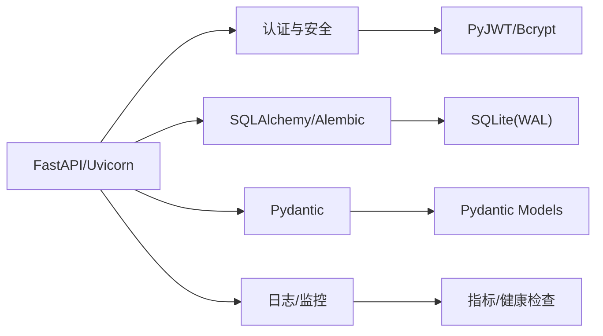

# 后端开发指南

<cite>
**本文引用的文件列表**
- [backend/app/main.py](file://backend/app/main.py)
- [backend/app/core/config.py](file://backend/app/core/config.py)
- [backend/app/core/database.py](file://backend/app/core/database.py)
- [backend/app/models/base.py](file://backend/app/models/base.py)
- [backend/app/api/v1/__init__.py](file://backend/app/api/v1/__init__.py)
- [backend/app/api/v1/auth/__init__.py](file://backend/app/api/v1/auth/__init__.py)
- [backend/alembic.ini](file://backend/alembic.ini)
- [backend/requirements.txt](file://backend/requirements.txt)
- [backend/pyproject.toml](file://backend/pyproject.toml)
- [backend/app/middleware/audit_context.py](file://backend/app/middleware/audit_context.py)
</cite>

## 目录
1. [简介](#简介)
2. [项目结构](#项目结构)
3. [核心组件](#核心组件)
4. [架构总览](#架构总览)
5. [详细组件分析](#详细组件分析)
6. [依赖关系分析](#依赖关系分析)
7. [性能考虑](#性能考虑)
8. [故障排查指南](#故障排查指南)
9. [结论](#结论)
10. [附录](#附录)

## 简介
本指南面向使用 FastAPI 的后端开发者，围绕“开发环境搭建、项目结构说明、DDD 分层实现、API 接口开发流程、数据模型设计、业务服务实现、代码规范、调试技巧、测试编写方法、数据库迁移管理”等主题，提供可操作的实践与最佳实践。系统采用 SQLite（WAL）作为默认数据库，结合 Alembic 进行版本化迁移；通过中间件链实现审计、安全头、CORS、请求日志、指标采集等横切能力；以 Pydantic 做数据校验，SQLAlchemy 做 ORM，统一配置由 Settings 管理。

## 项目结构
后端位于 backend/app 下，按职责划分：
- app/api/v1：REST API 路由层，按功能域拆分模块，集中注册到 v1 路由器
- app/services：领域服务与跨领域能力（如审批流、资金、AI、备份、任务队列等）
- app/models：ORM 模型定义，基于 Base 基类扩展时间戳、软删除、版本号等通用能力
- app/schemas：Pydantic 请求/响应模型，用于入参校验与出参序列化
- app/core：基础设施（配置、数据库引擎、安全、异常处理、加密、缓存、事务等）
- app/middleware：横切中间件（审计上下文、请求ID、慢请求监控、CSRF、CORS、安全头、请求体大小限制等）
- alembic：数据库迁移脚本目录
- tests：单元测试、集成测试与安全测试

图表来源
- [backend/app/main.py:100-180](file://backend/app/main.py#L100-L180)
- [backend/app/api/v1/__init__.py:29-148](file://backend/app/api/v1/__init__.py#L29-L148)
- [backend/app/core/database.py:55-67](file://backend/app/core/database.py#L55-L67)
- [backend/app/core/config.py:54-105](file://backend/app/core/config.py#L54-L105)

章节来源
- [backend/app/main.py:100-180](file://backend/app/main.py#L100-L180)
- [backend/app/api/v1/__init__.py:29-148](file://backend/app/api/v1/__init__.py#L29-L148)
- [backend/app/core/database.py:55-67](file://backend/app/core/database.py#L55-L67)
- [backend/app/core/config.py:54-105](file://backend/app/core/config.py#L54-L105)

## 核心组件
- 应用入口与生命周期：在启动时初始化数据库表、执行 Alembic 升级、创建索引、加载黑名单、启动监控与定时任务，并在关闭时优雅释放资源。
- 配置管理：基于 pydantic-settings 的 Settings，支持环境变量覆盖、运行时密钥生成与持久化、路径动态解析（Windows 安装兼容）。
- 数据库：SQLAlchemy 引擎 + QueuePool，SQLite WAL 模式，连接级 PRAGMA 调优，长事务独占写协调器，磁盘空间检查。
- 路由与中间件：统一的 v1 路由聚合，中间件顺序明确（请求ID→安全头→CORS→驼峰转换→CSRF→请求日志→审计→指标），并挂载静态资源与 SPA fallback。
- 模型基类：BaseModel 提供 id、created_at、updated_at、to_dict(camelCase)；TimestampMixin、SoftDeleteMixin、VersionMixin 增强通用能力。
- 测试与覆盖率：pytest + coverage，覆盖率目标 100%（排除特定行），便于质量门禁。

章节来源
- [backend/app/main.py:68-180](file://backend/app/main.py#L68-L180)
- [backend/app/core/config.py:54-105](file://backend/app/core/config.py#L54-L105)
- [backend/app/core/database.py:55-67](file://backend/app/core/database.py#L55-L67)
- [backend/app/models/base.py:158-185](file://backend/app/models/base.py#L158-L185)
- [backend/pyproject.toml:1-34](file://backend/pyproject.toml#L1-L34)

## 架构总览
系统采用分层架构与横切关注点解耦：
- 表现层：FastAPI 路由（v1），负责参数校验、权限控制、调用服务、返回标准化响应
- 领域层：services 封装业务流程与规则，复用 repositories（如有）与外部服务
- 数据层：models + database 提供 ORM 访问与数据库优化
- 横切：中间件链（审计、安全、日志、指标、限流）、配置、异常处理、加密、缓存

图表来源
- [backend/app/main.py:113-165](file://backend/app/main.py#L113-L165)
- [backend/app/api/v1/__init__.py:102-140](file://backend/app/api/v1/__init__.py#L102-L140)
- [backend/app/core/database.py:174-186](file://backend/app/core/database.py#L174-L186)

## 详细组件分析

### 应用启动与生命周期
- 启动阶段：初始化日志、注册异常处理器、注册中间件、导入并挂载所有 v1 路由、挂载静态资源与 SPA fallback、启动后台任务（健康监控、备份调度、任务队列等）。
- 迁移策略：优先执行 Alembic upgrade head；若存在业务表但无 alembic_version 表则 stamp 到 head；生产环境失败直接中止启动，开发/测试环境降级为自动补列兜底。
- 健康检查：/health 暴露版本、构建信息与迁移状态（at_head/head/error_type），无需认证。

图表来源
- [backend/app/main.py:68-180](file://backend/app/main.py#L68-L180)
- [backend/app/main.py:436-507](file://backend/app/main.py#L436-L507)
- [backend/app/main.py:237-262](file://backend/app/main.py#L237-L262)

章节来源
- [backend/app/main.py:68-180](file://backend/app/main.py#L68-L180)
- [backend/app/main.py:436-507](file://backend/app/main.py#L436-L507)
- [backend/app/main.py:237-262](file://backend/app/main.py#L237-L262)

### 配置管理（Settings）
- 环境变量优先级：支持 .env 与进程环境变量覆盖，忽略未知字段。
- 路径动态化：根据运行环境与平台自动解析 data/cache/uploads/logs 等目录，避免 Windows 安装版权限问题。
- 安全基线：生产环境强制关闭 DB_ECHO；未配置 ENCRYPTION_KEY 时自动生成并持久化；SECRET_KEY/CSRF_SECRET_KEY 缺失时自动生成并持久化。
- 关键开关：ENABLE_AUTO_MIGRATION、CSRF_ENABLED、RATE_LIMIT_*、CORS_* 等。

章节来源
- [backend/app/core/config.py:54-105](file://backend/app/core/config.py#L54-L105)
- [backend/app/core/config.py:208-241](file://backend/app/core/config.py#L208-L241)
- [backend/app/core/config.py:296-364](file://backend/app/core/config.py#L296-L364)

### 数据库与 ORM
- 引擎与会话：QueuePool 连接池，SQLite 禁用线程检查；SessionLocal 配合 get_db() 依赖注入，异常时回滚并关闭。
- PRAGMA 调优：WAL、外键开启、NORMAL 同步、busy_timeout=10s、cache_size/mmap_size/temp_store、wal_autocheckpoint、automatic_index、optimize。
- 写入协调器：exclusive_write() 用于长事务独占写，避免 SQLITE_BUSY；向后兼容 enqueue。
- 模型基类：BaseModel 提供 id、时间戳、to_dict(camelCase)；TimestampMixin 自动递增 sync_version；SoftDeleteMixin 提供软删除与恢复；EncryptedText 透明加密 PII。

图表来源
- [backend/app/models/base.py:23-57](file://backend/app/models/base.py#L23-L57)
- [backend/app/models/base.py:65-155](file://backend/app/models/base.py#L65-L155)
- [backend/app/models/base.py:158-185](file://backend/app/models/base.py#L158-L185)

章节来源
- [backend/app/core/database.py:55-67](file://backend/app/core/database.py#L55-L67)
- [backend/app/core/database.py:78-157](file://backend/app/core/database.py#L78-L157)
- [backend/app/core/database.py:174-186](file://backend/app/core/database.py#L174-L186)
- [backend/app/core/database.py:198-285](file://backend/app/core/database.py#L198-L285)
- [backend/app/models/base.py:23-57](file://backend/app/models/base.py#L23-L57)
- [backend/app/models/base.py:65-155](file://backend/app/models/base.py#L65-L155)
- [backend/app/models/base.py:158-185](file://backend/app/models/base.py#L158-L185)

### API 路由与中间件
- 路由组织：v1 路由聚合器静态导入所有业务模块，按序 include_router，确保匹配优先级（如 supported_village_export 先于 supported_village）。
- 中间件顺序：从外层到内层依次是 RequestID → SecurityHeaders → CORS → CamelToSnake → CSRF（可选）→ RequestLogger → Audit → Metrics；另有查询计数与慢请求监控。
- 静态资源与 SPA：assets/images/static 分别挂载，index.html 每次请求重新读取以避免缓存旧版本；非 API/文档/静态路径 GET 请求返回 index.html。

图表来源
- [backend/app/api/v1/__init__.py:29-148](file://backend/app/api/v1/__init__.py#L29-L148)
- [backend/app/main.py:113-165](file://backend/app/main.py#L113-L165)
- [backend/app/main.py:295-376](file://backend/app/main.py#L295-L376)

章节来源
- [backend/app/api/v1/__init__.py:29-148](file://backend/app/api/v1/__init__.py#L29-L148)
- [backend/app/main.py:113-165](file://backend/app/main.py#L113-L165)
- [backend/app/main.py:295-376](file://backend/app/main.py#L295-L376)

### 认证与授权
- 认证路由组：auth 子模块聚合登录、用户管理、RBAC、双因素认证等路由，统一对外暴露。
- 令牌与黑名单：启动时从数据库恢复 token 黑名单到内存；/shutdown 仅本机+内部密钥可调用。
- 安全头与 CSRF：SecurityHeadersMiddleware 为所有响应添加安全头；CSRF 保护默认启用，需前端携带 X-CSRF-Token。

章节来源
- [backend/app/api/v1/auth/__init__.py:1-25](file://backend/app/api/v1/auth/__init__.py#L1-L25)
- [backend/app/main.py:265-292](file://backend/app/main.py#L265-L292)
- [backend/app/main.py:134-158](file://backend/app/main.py#L134-L158)

### 审计与追踪
- 审计上下文：通过 ContextVar 存储当前用户 ID 与请求 ID，供审计记录与链路追踪使用。
- 审计事件：启动时尝试设置 SQLAlchemy 事件监听，记录写操作；失败不影响主应用启动。

章节来源
- [backend/app/middleware/audit_context.py:1-58](file://backend/app/middleware/audit_context.py#L1-L58)
- [backend/app/main.py:167-173](file://backend/app/main.py#L167-L173)

### 数据库迁移管理
- Alembic 配置：script_location=alembic，sqlalchemy.url 默认指向 SQLite 文件，运行时被 settings.DATABASE_URL 覆盖。
- 启动迁移：编程式执行 alembic upgrade head；若已有业务表但无 alembic_version，则 stamp 到 head；生产环境失败中止启动。
- 自动补列：ENABLE_AUTO_MIGRATION=true 时检测并 ALTER TABLE ADD COLUMN 补齐缺失列（已弃用，建议逐步迁移到纯 Alembic）。

章节来源
- [backend/alembic.ini:1-40](file://backend/alembic.ini#L1-L40)
- [backend/app/main.py:436-507](file://backend/app/main.py#L436-L507)
- [backend/app/main.py:510-664](file://backend/app/main.py#L510-L664)

## 依赖关系分析
- Web 框架：FastAPI + Uvicorn + Starlette，HTTP 栈稳定高效。
- 数据库：SQLAlchemy 2.x + Alembic，SQLite WAL 模式，QueuePool 连接池。
- 认证与安全：PyJWT、passlib、bcrypt、cryptography、pyotp。
- 数据验证：Pydantic v2 + pydantic-settings。
- 数据处理：pandas、numpy、scikit-learn、joblib。
- 文件与报告：openpyxl、reportlab、mammoth、python-docx。
- 日志与监控：python-json-logger、diskcache、psutil。
- 开发与测试：pytest、coverage（目标 100%）。

图表来源
- [backend/requirements.txt:1-137](file://backend/requirements.txt#L1-L137)
- [backend/pyproject.toml:1-34](file://backend/pyproject.toml#L1-L34)

章节来源
- [backend/requirements.txt:1-137](file://backend/requirements.txt#L1-L137)
- [backend/pyproject.toml:1-34](file://backend/pyproject.toml#L1-L34)

## 性能考虑
- 数据库层面：
  - WAL 模式与 NORMAL 同步平衡安全与性能
  - busy_timeout=10s 降低 SQLITE_BUSY 概率
  - cache_size/mmap_size/temp_store 提升内存利用
  - wal_autocheckpoint=1000 控制 WAL 增长
  - exclusive_write() 保障长事务串行写入
- 应用层面：
  - 中间件链最小化开销，按需启用（如 CSRF）
  - 静态资源长期缓存（带 hash 的文件名 immutable）
  - 连接池大小与超时合理配置（DB_POOL_SIZE/MAX_OVERFLOW/TIMEOUT）
  - 慢请求监控与查询计数辅助定位瓶颈
- 部署层面：
  - 生产环境关闭 DB_ECHO，避免敏感 SQL 泄露
  - 资源监控与备份调度保障稳定性

章节来源
- [backend/app/core/database.py:78-157](file://backend/app/core/database.py#L78-L157)
- [backend/app/core/database.py:198-285](file://backend/app/core/database.py#L198-L285)
- [backend/app/main.py:207-224](file://backend/app/main.py#L207-L224)
- [backend/app/core/config.py:95-105](file://backend/app/core/config.py#L95-L105)

## 故障排查指南
- 启动失败：
  - 检查 /health 输出中的 migration.at_head 与 error_type，确认 Alembic 是否达到 head
  - 生产环境迁移失败会中止启动，查看日志中 ERROR/CRITICAL 信息
- 数据库问题：
  - 确认 SQLite WAL 模式与 PRAGMA 生效
  - 长事务导致 SQLITE_BUSY：使用 exclusive_write() 包裹批量写入
  - 磁盘空间不足：使用 check_disk_space() 检查剩余空间
- 认证与安全：
  - CSRF 请求失败：确认前端获取并携带 X-CSRF-Token
  - 令牌失效：检查黑名单与过期时间
- 性能问题：
  - 使用慢请求监控与查询计数定位热点接口
  - 调整连接池与超时参数，观察压测效果

章节来源
- [backend/app/main.py:237-262](file://backend/app/main.py#L237-L262)
- [backend/app/main.py:436-507](file://backend/app/main.py#L436-L507)
- [backend/app/core/database.py:292-343](file://backend/app/core/database.py#L292-L343)
- [backend/app/main.py:117-124](file://backend/app/main.py#L117-L124)

## 结论
本后端以 FastAPI 为核心，结合 Alembic、SQLAlchemy、Pydantic 构建了高内聚、低耦合的分层架构。通过严格的中间件链、完善的配置管理与健壮的数据库优化，满足单机/多机协同场景下的稳定性与性能要求。遵循本指南的开发规范与实践，可快速上手并持续交付高质量功能。

## 附录
- 开发环境搭建
  - 安装依赖：pip install -r requirements.txt（或 requirements-dev.txt）
  - 配置环境变量：复制 .env 模板，设置 DATABASE_URL、SECRET_KEY、CSRF_SECRET_KEY 等
  - 启动应用：uvicorn app.main:app --host 127.0.0.1 --port 8000
- 数据库迁移
  - 生成迁移：alembic revision --autogenerate -m "描述"
  - 应用迁移：alembic upgrade head
  - 回滚迁移：alembic downgrade -1
- 测试
  - 运行测试：pytest
  - 覆盖率：pytest --cov=app --cov-report=html
- 调试技巧
  - 启用 DB_ECHO（仅开发环境）查看 SQL
  - 使用 /health 检查迁移与健康状态
  - 通过慢请求监控与查询计数定位性能瓶颈