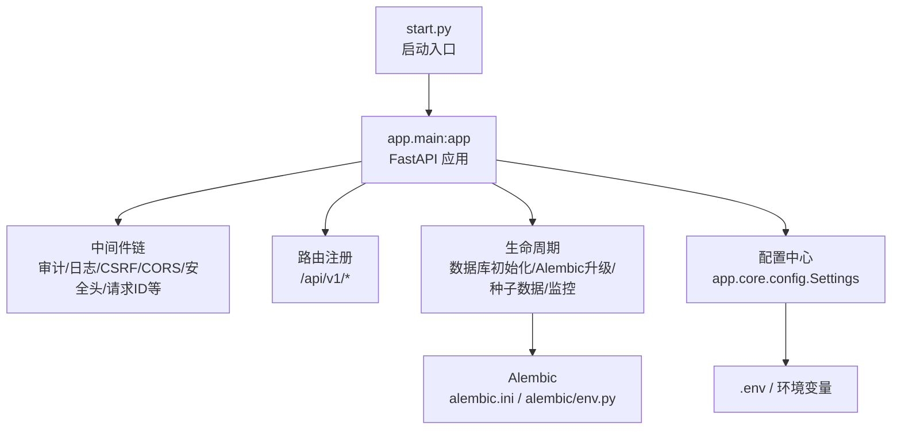
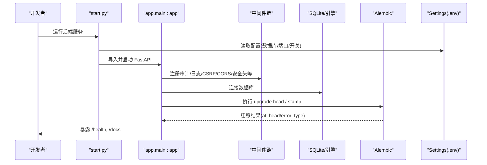
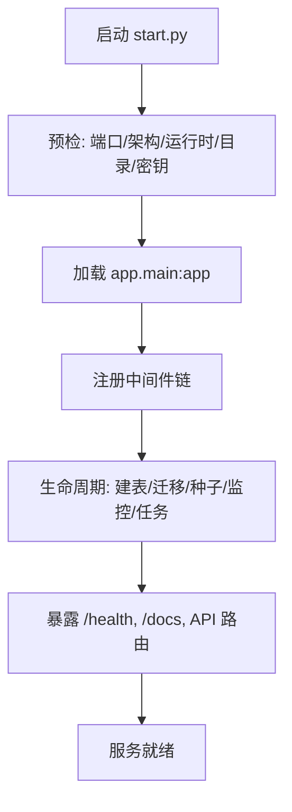

# 开发环境搭建

<cite>
**本文引用的文件**
- [backend/requirements.txt](file://backend/requirements.txt)
- [backend/pyproject.toml](file://backend/pyproject.toml)
- [backend/app/core/config.py](file://backend/app/core/config.py)
- [backend/app/main.py](file://backend/app/main.py)
- [backend/start.py](file://backend/start.py)
- [backend/alembic.ini](file://backend/alembic.ini)
- [backend/alembic/env.py](file://backend/alembic/env.py)
- [docker/Dockerfile](file://docker/Dockerfile)
- [docker-compose.yml](file://docker-compose.yml)
- [scripts/dev-setup.sh](file://scripts/dev-setup.sh)
- [scripts/dev-setup.bat](file://scripts/dev-setup.bat)
- [Makefile](file://Makefile)
- [README.md](file://README.md)
- [backend/.env.example](file://backend/.env.example)
- [frontend/.env.example](file://frontend/.env.example)
</cite>

## 目录
1. [简介](#简介)
2. [项目结构](#项目结构)
3. [核心组件](#核心组件)
4. [架构总览](#架构总览)
5. [详细组件分析](#详细组件分析)
6. [依赖分析](#依赖分析)
7. [性能考虑](#性能考虑)
8. [故障排除指南](#故障排除指南)
9. [结论](#结论)
10. [附录](#附录)

## 简介
本指南面向后端开发者，提供基于 FastAPI 的后端开发环境搭建与运行说明。内容涵盖：Python 版本要求、虚拟环境创建、依赖安装、环境变量配置；数据库初始化与 Alembic 迁移执行；服务启动流程；跨平台（Windows/Linux/macOS）注意事项；常用命令与调试建议；以及 Docker 容器化开发与最佳实践。

## 项目结构
后端位于 backend 目录，采用 FastAPI + SQLAlchemy 2.0 + Pydantic 技术栈，使用 SQLite 作为默认数据库，并通过 Alembic 管理数据库迁移。应用入口为 start.py，内部加载 app.main:app 并启动 Uvicorn。配置集中通过 pydantic-settings 从 .env 与环境变量注入。

**图示来源**
- [backend/start.py:484-559](file://backend/start.py#L484-L559)
- [backend/app/main.py:68-181](file://backend/app/main.py#L68-L181)
- [backend/alembic.ini:1-40](file://backend/alembic.ini#L1-L40)
- [backend/alembic/env.py:1-110](file://backend/alembic/env.py#L1-L110)
- [backend/app/core/config.py:54-383](file://backend/app/core/config.py#L54-L383)

**章节来源**
- [backend/start.py:484-559](file://backend/start.py#L484-L559)
- [backend/app/main.py:68-181](file://backend/app/main.py#L68-L181)
- [backend/app/core/config.py:54-383](file://backend/app/core/config.py#L54-L383)
- [backend/alembic.ini:1-40](file://backend/alembic.ini#L1-L40)
- [backend/alembic/env.py:1-110](file://backend/alembic/env.py#L1-L110)

## 核心组件
- 应用入口与启动器
  - start.py：负责运行时预检（端口占用、VC++ 运行时、ProactorEventLoop 修复）、目录与密钥准备、前端资源校验、Uvicorn 启动。
  - app.main：构建 FastAPI 实例、注册中间件、挂载静态资源、定义健康检查与健康探针、生命周期内执行数据库初始化与迁移、后台任务调度。
- 配置中心
  - app.core.config.Settings：集中读取 .env 与环境变量，动态计算数据/缓存/上传/导出路径，生产环境强制关闭 DB_ECHO，支持加密密钥加载。
- 数据库与迁移
  - alembic.ini：默认 SQLite 路径与日志级别。
  - alembic/env.py：在迁移前补齐缺失列（兼容旧库），确保 autogenerate 看到完整结构。
  - app.main._run_alembic_upgrade：编程式执行 upgrade head，失败时记录状态并在生产环境中止启动。
- 依赖与环境
  - requirements.txt：锁定 FastAPI、SQLAlchemy、Alembic、Pydantic、加密与数据处理等核心包。
  - .env.example：提供全部可配置项的模板（SECRET_KEY、DATABASE_URL、CORS、CSRF、日志、缓存、上传等）。

**章节来源**
- [backend/start.py:126-214](file://backend/start.py#L126-L214)
- [backend/start.py:484-559](file://backend/start.py#L484-L559)
- [backend/app/main.py:68-181](file://backend/app/main.py#L68-L181)
- [backend/app/main.py:402-508](file://backend/app/main.py#L402-L508)
- [backend/app/core/config.py:54-383](file://backend/app/core/config.py#L54-L383)
- [backend/alembic.ini:1-40](file://backend/alembic.ini#L1-L40)
- [backend/alembic/env.py:1-110](file://backend/alembic/env.py#L1-L110)
- [backend/requirements.txt:1-137](file://backend/requirements.txt#L1-L137)
- [backend/.env.example:1-80](file://backend/.env.example#L1-L80)

## 架构总览
下图展示开发环境下的关键组件交互：启动器 -> FastAPI 应用 -> 中间件 -> 路由 -> 数据库与迁移 -> 配置中心。

**图示来源**
- [backend/start.py:484-559](file://backend/start.py#L484-L559)
- [backend/app/main.py:68-181](file://backend/app/main.py#L68-L181)
- [backend/app/main.py:402-508](file://backend/app/main.py#L402-L508)
- [backend/app/core/config.py:54-383](file://backend/app/core/config.py#L54-L383)

## 详细组件分析

### 启动流程与生命周期
- 启动前检查
  - 端口占用检测与自动清理残留进程（Windows）。
  - Python 架构与 VC++ 运行时检查（Windows）。
  - ProactorEventLoop ConnectionResetError 修复（Windows）。
  - 创建必要目录（uploads/cache/exports/logs/db 目录）。
  - 生成或加载运行时密钥（runtime_secrets）。
  - 前端静态资源完整性校验（可选）。
- 应用生命周期
  - 创建表并执行 Alembic upgrade head。
  - 恢复 token 黑名单、检查版本变更、创建默认管理员。
  - 启动资源监控、数据库健康监控、备份调度、WAL checkpoint 定时任务。
  - 启动本地任务队列（异步导出等）。

**图示来源**
- [backend/start.py:126-214](file://backend/start.py#L126-L214)
- [backend/start.py:484-559](file://backend/start.py#L484-L559)
- [backend/app/main.py:68-181](file://backend/app/main.py#L68-L181)
- [backend/app/main.py:402-508](file://backend/app/main.py#L402-L508)

**章节来源**
- [backend/start.py:126-214](file://backend/start.py#L126-L214)
- [backend/start.py:484-559](file://backend/start.py#L484-L559)
- [backend/app/main.py:68-181](file://backend/app/main.py#L68-L181)
- [backend/app/main.py:402-508](file://backend/app/main.py#L402-L508)

### 数据库初始化与 Alembic 迁移
- 默认数据库
  - SQLite，默认路径由 Settings 动态解析到用户数据目录，避免权限问题。
- 迁移策略
  - 启动时调用 _run_alembic_upgrade：若 alembic_version 不存在但业务表存在，则 stamp 到 head；否则执行 upgrade head。
  - 失败处理：记录 error_type 与 at_head，生产环境直接中止启动，开发/测试环境降级为自动补列兜底。
  - 兼容旧库：在 env.py 中于 autogenerate 前执行 _migrate_missing_columns，保证迁移脚本生成准确。
- 索引优化
  - 启动后统一创建性能索引。

**图示来源**
- [backend/app/main.py:436-508](file://backend/app/main.py#L436-L508)
- [backend/alembic/env.py:60-104](file://backend/alembic/env.py#L60-L104)
- [backend/app/core/config.py:331-364](file://backend/app/core/config.py#L331-L364)

**章节来源**
- [backend/app/main.py:436-508](file://backend/app/main.py#L436-L508)
- [backend/alembic/env.py:60-104](file://backend/alembic/env.py#L60-L104)
- [backend/app/core/config.py:331-364](file://backend/app/core/config.py#L331-L364)

### 配置与环境变量
- 配置文件优先级
  - Settings 从 backend/.env、根 .env、../.env 读取，合并环境变量覆盖。
- 关键配置项
  - 数据库：DATABASE_URL、DB_POOL_*、DB_ECHO、ENABLE_AUTO_MIGRATION。
  - 服务器：HOST、PORT、DEBUG、ENVIRONMENT、API_PREFIX。
  - 安全：SECRET_KEY、CSRF_ENABLED、ACCESS_TOKEN_EXPIRE_MINUTES、BCRYPT_ROUNDS。
  - CORS：CORS_ORIGINS、ALLOW_METHODS、ALLOW_HEADERS。
  - 日志：LOG_LEVEL、LOG_FILE、LOG_FORMAT、LOG_ROTATION。
  - 缓存/上传：CACHE_DIR、UPLOAD_DIR、EXPORT_DIR、MAX_FILE_SIZE。
- 动态路径
  - 数据/缓存/上传/导出目录在运行时被规范化为绝对路径，避免写入只读目录。

**章节来源**
- [backend/app/core/config.py:54-383](file://backend/app/core/config.py#L54-L383)
- [backend/.env.example:1-80](file://backend/.env.example#L1-L80)

### 常用命令与开发工作流
- 一键初始化
  - Windows: scripts/dev-setup.bat
  - Linux/macOS: bash scripts/dev-setup.sh
- 启动服务
  - 后端: cd backend && python start.py
  - 前端: cd frontend && npm run dev
- 测试与质量门禁
  - 后端测试: make test-backend
  - 覆盖率: make coverage
  - 部署前检查: make deploy-check
- 构建与打包
  - Windows 安装包: make build-win-x64 / build-win-all
  - DEB 包: make build-deb / build-deb-all
  - 麒麟 ARM64: make build-kylin

**章节来源**
- [scripts/dev-setup.sh:1-50](file://scripts/dev-setup.sh#L1-L50)
- [scripts/dev-setup.bat:1-71](file://scripts/dev-setup.bat#L1-L71)
- [Makefile:80-110](file://Makefile#L80-L110)
- [Makefile:126-160](file://Makefile#L126-L160)
- [Makefile:170-224](file://Makefile#L170-L224)
- [Makefile:248-285](file://Makefile#L248-L285)

### 调试与 IDE 推荐
- VS Code
  - 使用 Python 解释器指向 backend/.venv/bin/python（Linux/macOS）或 .venv\Scripts\python.exe（Windows）。
  - 启动配置：program 指向 backend/start.py，cwd 指向 backend。
  - 断点调试：在 app.main 与 services 模块设置断点，配合 /health 观察迁移状态。
- PyCharm
  - 配置 Run/Debug 配置：Script path 指向 backend/start.py，Working directory 指向 backend。
  - 环境变量：复制 backend/.env.example 为 backend/.env 并填写所需值。
- 日志与诊断
  - 查看 logs/app.log 获取结构化日志。
  - 访问 http://localhost:8000/docs 进行接口调试。
  - 使用 /health 检查迁移是否达到 head 及错误类型。

[本节为通用指导，不直接分析具体代码文件]

## 依赖分析
- 核心依赖
  - Web 框架：fastapi、uvicorn、starlette。
  - 数据库：sqlalchemy、alembic、greenlet、async-timeout。
  - 认证与安全：PyJWT、passlib、bcrypt、cryptography、pyotp。
  - 数据验证：pydantic、pydantic-settings。
  - 文件处理：aiofiles、pillow、openpyxl、reportlab、mammoth、qrcode、lxml。
  - 数据处理：numpy、pandas、scikit-learn、joblib。
  - 工具与日志：python-json-logger、diskcache、psutil、requests、urllib3、PyYAML。
- 开发与测试工具
  - pytest、pytest-cov、pytest-asyncio、flake8、bandit、pre-commit。

**章节来源**
- [backend/requirements.txt:1-137](file://backend/requirements.txt#L1-L137)
- [backend/pyproject.toml:1-34](file://backend/pyproject.toml#L1-L34)

## 性能考虑
- 数据库连接池
  - 默认 DB_POOL_SIZE=40、DB_MAX_OVERFLOW=20，适合 SQLite WAL 多读者并发场景。
- 慢查询阈值
  - SLOW_QUERY_THRESHOLD_MS=200ms，结合慢请求监控中间件定位瓶颈。
- 静态资源缓存
  - 带 hash 的资源启用长期缓存与 immutable，index.html 禁用缓存以保障更新。
- 资源监控
  - 启动资源监控与数据库健康监控，便于发现异常与容量瓶颈。

[本节为通用指导，不直接分析具体代码文件]

## 故障排除指南
- 端口占用
  - Windows 下会自动尝试终止残留的 python.exe 进程；非本项目进程不会强杀，需手动释放。
- 数据库完整性
  - 启动时执行 PRAGMA integrity_check，失败时优先从备份恢复；无备份且未设置 ALLOW_DB_RESET=1 将停止启动并保留现场。
- 迁移失败
  - /health 返回 migration.at_head 与 error_type；生产环境迁移失败会中止启动，需先排查 alembic current/heads 后重试。
- 前端静态资源缺失
  - 启动前校验 index.html 及其引用资源，缺失则拒绝启动并提示重新构建前端。
- Windows 运行时问题
  - 缺少 VC++ 运行时 DLL 会给出安装指引；ProactorEventLoop 异常已内置三层修复。

**章节来源**
- [backend/start.py:126-214](file://backend/start.py#L126-L214)
- [backend/start.py:241-348](file://backend/start.py#L241-L348)
- [backend/app/main.py:237-262](file://backend/app/main.py#L237-L262)
- [backend/app/main.py:436-508](file://backend/app/main.py#L436-L508)
- [backend/start.py:376-482](file://backend/start.py#L376-L482)

## 结论
本指南提供了从零开始搭建后端开发环境的完整步骤，包括环境准备、依赖安装、配置与迁移、服务启动与调试，以及跨平台与容器化选项。遵循上述流程可快速获得稳定可用的开发环境，并通过 /health 与日志持续观测系统健康状态。

[本节为总结性内容，不直接分析具体代码文件]

## 附录

### 环境变量参考（后端）
- 安全密钥：SECRET_KEY、CSRF_SECRET_KEY
- 数据库：DATABASE_URL、DB_POOL_*、DB_ECHO、ENABLE_AUTO_MIGRATION
- 服务器：HOST、PORT、DEBUG、ENVIRONMENT、API_PREFIX
- 认证：ACCESS_TOKEN_EXPIRE_MINUTES、REFRESH_TOKEN_EXPIRE_DAYS、BCRYPT_ROUNDS、PASSWORD_EXPIRE_DAYS、MAX_FAILED_LOGIN_ATTEMPTS、ACCOUNT_LOCKOUT_MINUTES
- CORS：CORS_ORIGINS、CORS_ALLOW_CREDENTIALS、CORS_ALLOW_METHODS、CORS_ALLOW_HEADERS
- CSRF：CSRF_ENABLED
- 速率限制：RATE_LIMIT_ENABLED、RATE_LIMIT_PER_MINUTE、RATE_LIMIT_PER_HOUR
- 日志：LOG_LEVEL、LOG_FILE、LOG_FORMAT、LOG_ROTATION、LOG_RETENTION
- 缓存：CACHE_ENABLED、CACHE_DIR、CACHE_DEFAULT_TTL
- 上传：UPLOAD_DIR、EXPORT_DIR、MAX_FILE_SIZE、ALLOWED_FILE_TYPES
- 加密：USE_ENCRYPTED_SECRETS、ENCRYPTION_BACKEND、ENCRYPTION_KEY_DERIVATION
- 监控：METRICS_ENABLED、METRICS_PORT、HEALTH_CHECK_ENABLED、SLOW_QUERY_THRESHOLD_MS

**章节来源**
- [backend/.env.example:1-80](file://backend/.env.example#L1-L80)

### 环境变量参考（前端）
- API：VITE_API_BASE_URL、VITE_WS_BASE_URL
- 应用：VITE_APP_TITLE、VITE_APP_VERSION、VITE_APP_MODE
- 调试：VITE_DEBUG、VITE_ENABLE_PERFORMANCE_MONITOR、VITE_ENABLE_ERROR_TRACKING
- 网络：VITE_REQUEST_TIMEOUT
- 认证：VITE_TOKEN_KEY、VITE_REFRESH_TOKEN_KEY、VITE_TOKEN_REFRESH_THRESHOLD
- 功能：VITE_CSRF_ENABLED、VITE_OFFLINE_MODE
- 地图：VITE_MAP_TILE_DIR、VITE_MAP_CENTER、VITE_MAP_ZOOM

**章节来源**
- [frontend/.env.example:1-51](file://frontend/.env.example#L1-L51)

### Docker 与 Compose 开发
- 镜像构建
  - 前端构建阶段：Node.js 22，npm install 并构建。
  - 后端构建阶段：Python 3.11，安装依赖并使用 PyInstaller 打包。
  - 运行阶段：仅安装运行时依赖，包含 serve 用于托管前端静态资源。
- Compose 服务
  - assistance-system：主应用，映射 8000/3000，挂载 data/logs/backups/config，健康检查 /health。
  - postgres（可选）：PostgreSQL 15，profile full/postgres。
  - redis（可选）：Redis 7，持久化与内存策略配置。
  - nginx（可选）：反向代理，profile production。
- 启动方式
  - docker compose up -d
  - 访问：前端 http://localhost:3000，后端 http://localhost:8000，API 文档 http://localhost:8000/docs

**章节来源**
- [docker/Dockerfile:1-173](file://docker/Dockerfile#L1-L173)
- [docker-compose.yml:1-214](file://docker-compose.yml#L1-L214)

### 快速开始与默认账号
- 一键启动：scripts/start-all.bat / scripts/stop-all.bat
- 默认账号：admin / admin123（首次登录后请修改密码）
- 访问地址：前端开发 http://localhost:5173，生产 http://localhost:8000，API 文档 http://localhost:8000/docs

**章节来源**
- [README.md:30-69](file://README.md#L30-L69)