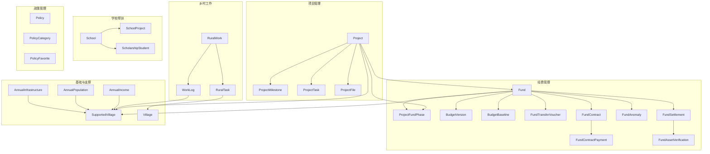
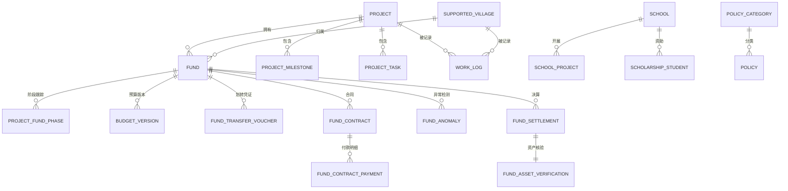
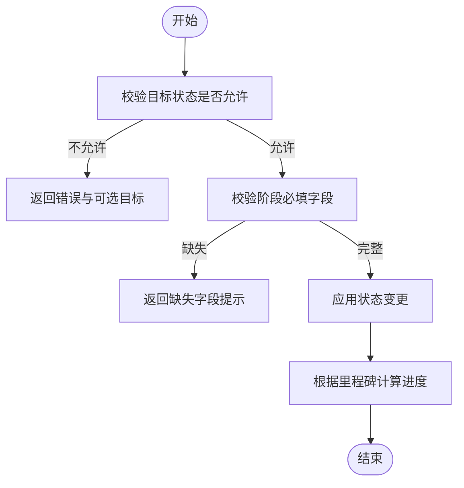
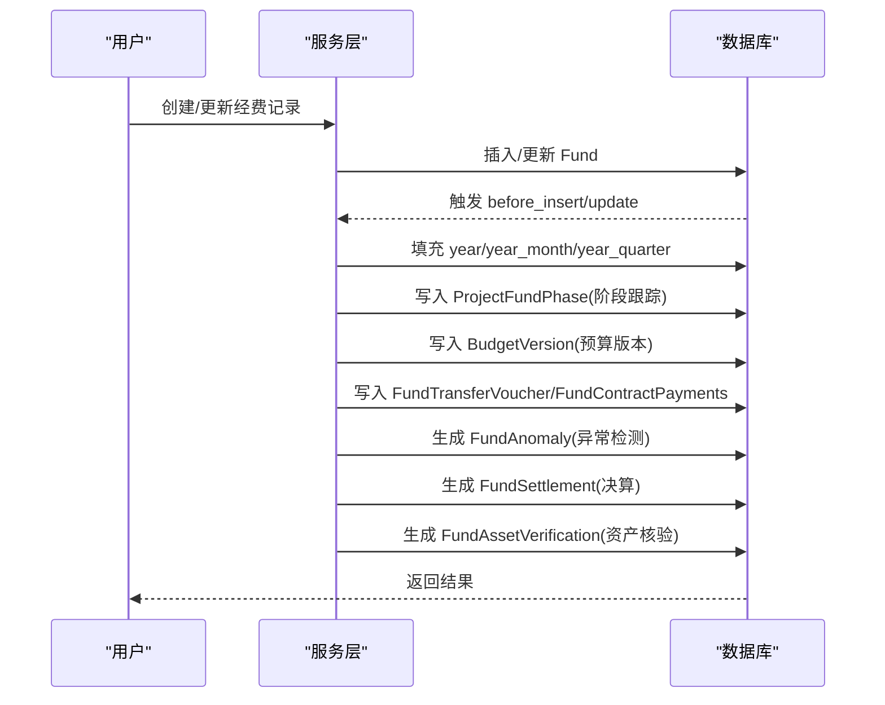
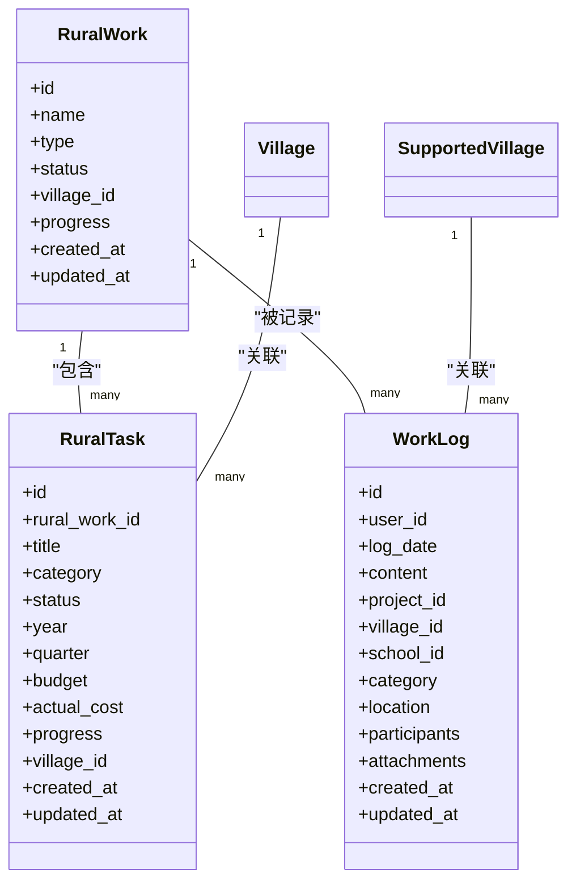
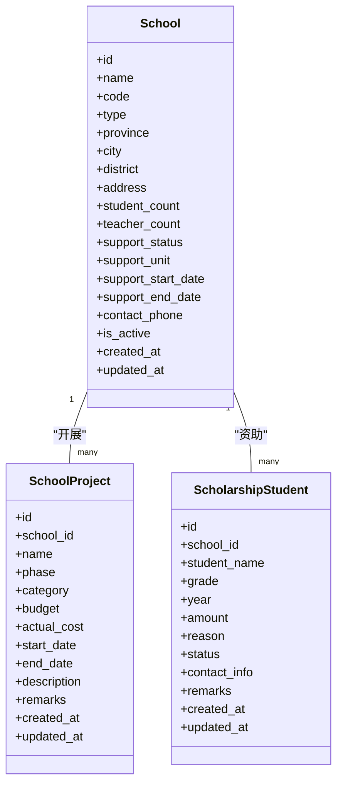
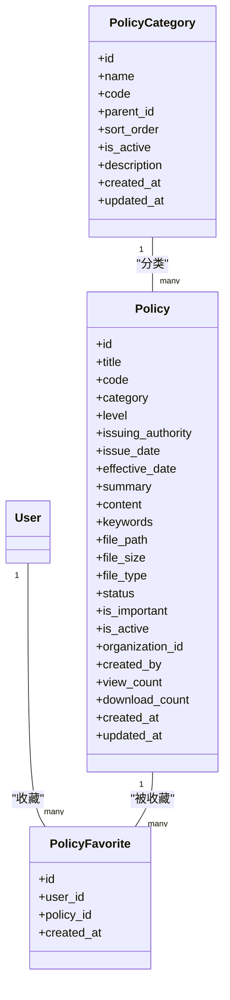
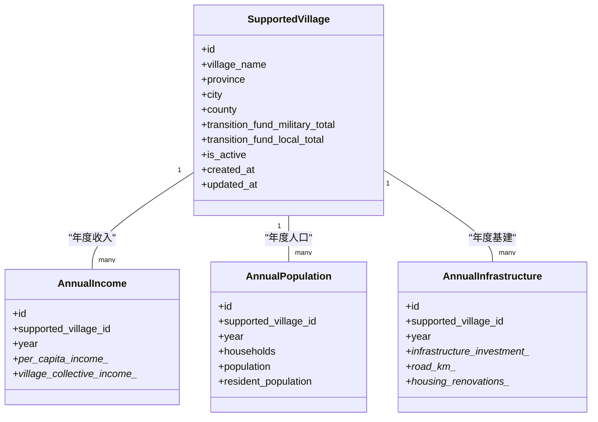
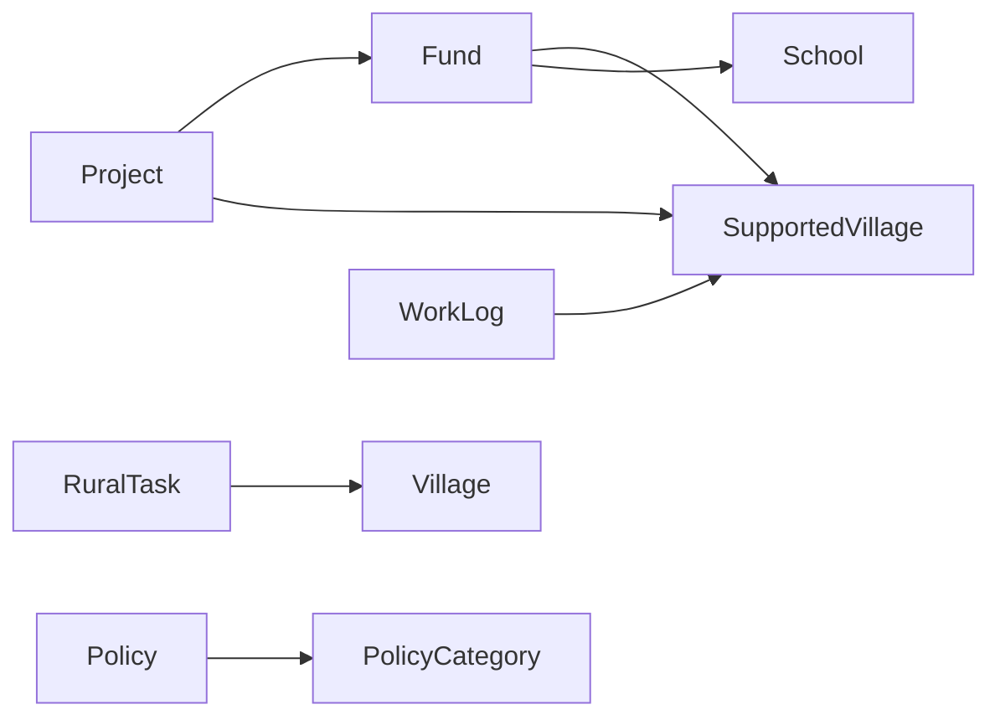

# 业务数据模型

<cite>
**本文引用的文件**
- [backend/app/models/project.py](file://backend/app/models/project.py)
- [backend/app/models/project_milestone.py](file://backend/app/models/project_milestone.py)
- [backend/app/models/fund.py](file://backend/app/models/fund.py)
- [backend/app/models/fund_lifecycle.py](file://backend/app/models/fund_lifecycle.py)
- [backend/app/models/fund_asset_verification.py](file://backend/app/models/fund_asset_verification.py)
- [backend/app/models/rural_work.py](file://backend/app/models/rural_work.py)
- [backend/app/models/rural_task.py](file://backend/app/models/rural_task.py)
- [backend/app/models/school.py](file://backend/app/models/school.py)
- [backend/app/models/policy.py](file://backend/app/models/policy.py)
- [backend/app/models/supported_village.py](file://backend/app/models/supported_village.py)
- [backend/app/models/village.py](file://backend/app/models/village.py)
- [backend/app/models/work_log.py](file://backend/app/models/work_log.py)
- [backend/app/models/annual_income.py](file://backend/app/models/annual_income.py)
- [backend/app/models/annual_population.py](file://backend/app/models/annual_population.py)
- [backend/app/models/annual_infrastructure.py](file://backend/app/models/annual_infrastructure.py)
</cite>

## 目录
1. [引言](#引言)
2. [项目结构](#项目结构)
3. [核心组件](#核心组件)
4. [架构总览](#架构总览)
5. [详细组件分析](#详细组件分析)
6. [依赖关系分析](#依赖关系分析)
7. [性能考虑](#性能考虑)
8. [故障排查指南](#故障排查指南)
9. [结论](#结论)
10. [附录](#附录)

## 引言
本文件面向业务数据模型，围绕项目管理、经费管理、乡村工作、学校帮扶、政策管理等核心领域，系统阐述实体设计、生命周期与状态流转、里程碑与进度跟踪、预算编制与资金拨付、资产核查与决算、工作报告与任务分解、政策法规发布与版本控制等关键能力。同时给出业务规则验证、数据完整性保证与复杂查询优化的实现思路，帮助读者快速理解并正确使用该数据模型。

## 项目结构
后端数据模型集中在 backend/app/models 目录下，按业务域划分：
- 项目管理：project.py、project_milestone.py
- 经费管理：fund.py、fund_lifecycle.py、fund_asset_verification.py
- 乡村工作：rural_work.py、rural_task.py、work_log.py
- 学校帮扶：school.py
- 政策管理：policy.py
- 基础与支撑：supported_village.py、village.py、年度指标表（annual_*）

图表来源
- [backend/app/models/project.py:47-175](file://backend/app/models/project.py#L47-L175)
- [backend/app/models/project_milestone.py:12-104](file://backend/app/models/project_milestone.py#L12-L104)
- [backend/app/models/fund.py:61-167](file://backend/app/models/fund.py#L61-L167)
- [backend/app/models/fund_lifecycle.py:119-449](file://backend/app/models/fund_lifecycle.py#L119-L449)
- [backend/app/models/fund_asset_verification.py:22-60](file://backend/app/models/fund_asset_verification.py#L22-L60)
- [backend/app/models/rural_work.py:34-76](file://backend/app/models/rural_work.py#L34-L76)
- [backend/app/models/rural_task.py:56-133](file://backend/app/models/rural_task.py#L56-L133)
- [backend/app/models/school.py:43-375](file://backend/app/models/school.py#L43-L375)
- [backend/app/models/policy.py:38-145](file://backend/app/models/policy.py#L38-L145)
- [backend/app/models/supported_village.py:42-195](file://backend/app/models/supported_village.py#L42-L195)
- [backend/app/models/village.py:14-130](file://backend/app/models/village.py#L14-L130)
- [backend/app/models/annual_income.py:10-49](file://backend/app/models/annual_income.py#L10-L49)
- [backend/app/models/annual_population.py:10-37](file://backend/app/models/annual_population.py#L10-L37)
- [backend/app/models/annual_infrastructure.py:18-51](file://backend/app/models/annual_infrastructure.py#L18-L51)

章节来源
- [backend/app/models/project.py:47-175](file://backend/app/models/project.py#L47-L175)
- [backend/app/models/fund.py:61-167](file://backend/app/models/fund.py#L61-L167)
- [backend/app/models/rural_work.py:34-76](file://backend/app/models/rural_work.py#L34-L76)
- [backend/app/models/school.py:43-375](file://backend/app/models/school.py#L43-L375)
- [backend/app/models/policy.py:38-145](file://backend/app/models/policy.py#L38-L145)

## 核心组件
- 项目管理：Project 定义项目主数据、状态、预算与时间线；ProjectTask 管理子任务；ProjectFile 管理阶段附件；ProjectMilestone 管理里程碑与变更记录；内置状态流转校验与进度计算。
- 经费管理：Fund 记录经费全量流水，含申请、批准、拨付、使用、剩余等金额字段；内置 year/year_month/year_quarter 聚合冗余字段与事件监听自动填充，优化统计查询；FundLifecycle 提供七阶段跟踪、预算基线、凭证、合同付款、异常检测、决算与预算版本快照；FundAssetVerification 将已付款与转固资产价值联动校验。
- 乡村工作：RuralWork 为工作项，RuralTask 为其子任务，支持年度/季度、审批流、进度与资金；WorkLog 记录走访、会议、检查等工作日志，关联项目/村庄/学校。
- 学校帮扶：School 维护学校基本信息与帮扶信息；SchoolProject 记录助学兴教项目阶段；ScholarshipStudent 记录资助学生及发放状态。
- 政策管理：Policy 记录政策法规发布、级别、分类、关键词、附件与访问统计；PolicyCategory 支持多级分类；PolicyFavorite 支持用户收藏。

章节来源
- [backend/app/models/project.py:47-175](file://backend/app/models/project.py#L47-L175)
- [backend/app/models/project_milestone.py:12-187](file://backend/app/models/project_milestone.py#L12-L187)
- [backend/app/models/fund.py:61-299](file://backend/app/models/fund.py#L61-L299)
- [backend/app/models/fund_lifecycle.py:119-449](file://backend/app/models/fund_lifecycle.py#L119-L449)
- [backend/app/models/fund_asset_verification.py:22-60](file://backend/app/models/fund_asset_verification.py#L22-L60)
- [backend/app/models/rural_work.py:34-76](file://backend/app/models/rural_work.py#L34-L76)
- [backend/app/models/rural_task.py:56-133](file://backend/app/models/rural_task.py#L56-L133)
- [backend/app/models/work_log.py:10-79](file://backend/app/models/work_log.py#L10-L79)
- [backend/app/models/school.py:43-375](file://backend/app/models/school.py#L43-L375)
- [backend/app/models/policy.py:38-145](file://backend/app/models/policy.py#L38-L145)

## 架构总览
下图展示项目、经费、乡村工作、学校帮扶、政策之间的核心关系与数据流向。

图表来源
- [backend/app/models/project.py:47-175](file://backend/app/models/project.py#L47-L175)
- [backend/app/models/fund.py:61-167](file://backend/app/models/fund.py#L61-L167)
- [backend/app/models/fund_lifecycle.py:119-449](file://backend/app/models/fund_lifecycle.py#L119-L449)
- [backend/app/models/school.py:43-375](file://backend/app/models/school.py#L43-L375)
- [backend/app/models/policy.py:38-145](file://backend/app/models/policy.py#L38-L145)
- [backend/app/models/supported_village.py:42-195](file://backend/app/models/supported_village.py#L42-L195)
- [backend/app/models/work_log.py:10-79](file://backend/app/models/work_log.py#L10-L79)

## 详细组件分析

### 项目管理与里程碑
- 项目主数据：包含名称、类型、状态、预算与实际花费、起止日期、进度、负责人、资金来源与账户信息等；软删标记与审计字段完善。
- 里程碑与变更：里程碑记录计划与实际完成日期、负责人、状态与排序；变更记录追踪状态、预算、进度、人员等变更原因与操作人。
- 状态流转与准入条件：内置合法流转路径与必填字段校验，确保从草稿到提交、启动、完成等阶段的业务约束。
- 进度计算：根据里程碑完成比例计算项目整体进度百分比。

图表来源
- [backend/app/models/project_milestone.py:110-187](file://backend/app/models/project_milestone.py#L110-L187)
- [backend/app/models/project.py:47-175](file://backend/app/models/project.py#L47-L175)

章节来源
- [backend/app/models/project.py:47-175](file://backend/app/models/project.py#L47-L175)
- [backend/app/models/project_milestone.py:12-187](file://backend/app/models/project_milestone.py#L12-L187)

### 经费管理与全生命周期
- 经费主表：涵盖申请、批准、拨付、使用、剩余金额，以及项目/村庄/学校维度关联；内置 year/year_month/year_quarter 聚合字段，配合索引优化大屏统计与报表查询。
- 生命周期七阶段：论证立项、汇总审核、计划下达与资金拨付、对接与资金划转、组织实施与过程监管、核查督查与效益评估、常态监管与项目决算；每阶段有进入/完成时间与状态。
- 预算与版本：预算基线在阶段2锁定；预算版本记录每次调整、审批与快照数据，支持追溯。
- 凭证与合同：资金划转凭证记录方向、金额、账户与确认信息；合同与付款明细联动，支持WBS与任务关联。
- 异常与决算：异常检测记录类型、严重程度、解决状态；决算汇总预算、支出、结余，并与资产核验联动。
- 资产核验：对比已付款总额与转固资产价值，差异率作为销号前置校验。

图表来源
- [backend/app/models/fund.py:61-299](file://backend/app/models/fund.py#L61-L299)
- [backend/app/models/fund_lifecycle.py:119-449](file://backend/app/models/fund_lifecycle.py#L119-L449)
- [backend/app/models/fund_asset_verification.py:22-60](file://backend/app/models/fund_asset_verification.py#L22-L60)

章节来源
- [backend/app/models/fund.py:61-299](file://backend/app/models/fund.py#L61-L299)
- [backend/app/models/fund_lifecycle.py:119-449](file://backend/app/models/fund_lifecycle.py#L119-L449)
- [backend/app/models/fund_asset_verification.py:22-60](file://backend/app/models/fund_asset_verification.py#L22-L60)

### 乡村工作任务与工作日志
- 工作项与任务：RuralWork 定义工作项类型与状态；RuralTask 作为子任务，支持年度/季度、审批流、预算与实际花费、进度与责任人；可关联帮扶村。
- 工作日志：WorkLog 记录工作日期、内容、类别、地点、参与人员与附件，可关联项目、村庄或学校，便于多域协同。

图表来源
- [backend/app/models/rural_work.py:34-76](file://backend/app/models/rural_work.py#L34-L76)
- [backend/app/models/rural_task.py:56-133](file://backend/app/models/rural_task.py#L56-L133)
- [backend/app/models/work_log.py:10-79](file://backend/app/models/work_log.py#L10-L79)
- [backend/app/models/village.py:14-130](file://backend/app/models/village.py#L14-L130)
- [backend/app/models/supported_village.py:42-195](file://backend/app/models/supported_village.py#L42-L195)

章节来源
- [backend/app/models/rural_work.py:34-76](file://backend/app/models/rural_work.py#L34-L76)
- [backend/app/models/rural_task.py:56-133](file://backend/app/models/rural_task.py#L56-L133)
- [backend/app/models/work_log.py:10-79](file://backend/app/models/work_log.py#L10-L79)

### 学校帮扶模型
- 学校信息：包含基本信息、地理位置、师生规模、帮扶单位与起止时间、联系人加密字段等。
- 帮扶项目：SchoolProject 记录项目名称、阶段、类别、预算与实际投入、起止时间与描述。
- 资助学生：ScholarshipStudent 记录学生姓名、年级、年度、金额、原因、状态与联系方式。

图表来源
- [backend/app/models/school.py:43-375](file://backend/app/models/school.py#L43-L375)

章节来源
- [backend/app/models/school.py:43-375](file://backend/app/models/school.py#L43-L375)

### 政策管理模型
- 政策发布：Policy 记录标题、文号、级别、发布机关、发布日期、生效日期、摘要、全文、关键词、附件与访问统计。
- 分类标签：PolicyCategory 支持多级分类与排序，便于检索与组织。
- 版本控制：通过 Policy.status 与创建/更新时间戳实现版本演进；结合 PolicyFavorite 支持用户收藏与学习统计。

图表来源
- [backend/app/models/policy.py:38-145](file://backend/app/models/policy.py#L38-L145)

章节来源
- [backend/app/models/policy.py:38-145](file://backend/app/models/policy.py#L38-L145)

### 基础与支撑：村庄与年度指标
- 帮扶村：SupportedVillage 承载帮扶村基本信息、区域标记、过渡期经费汇总与软删；提供 latest_year 属性用于列表页最近年度展示。
- 村庄基础：Village 与 Villager、Industry 构成基础地理与经济信息。
- 年度指标：AnnualIncome、AnnualPopulation、AnnualInfrastructure 以 village_id + year 唯一约束记录年度收入、人口与基础设施投入明细。

图表来源
- [backend/app/models/supported_village.py:42-195](file://backend/app/models/supported_village.py#L42-L195)
- [backend/app/models/annual_income.py:10-49](file://backend/app/models/annual_income.py#L10-L49)
- [backend/app/models/annual_population.py:10-37](file://backend/app/models/annual_population.py#L10-L37)
- [backend/app/models/annual_infrastructure.py:18-51](file://backend/app/models/annual_infrastructure.py#L18-L51)

章节来源
- [backend/app/models/supported_village.py:42-195](file://backend/app/models/supported_village.py#L42-L195)
- [backend/app/models/annual_income.py:10-49](file://backend/app/models/annual_income.py#L10-L49)
- [backend/app/models/annual_population.py:10-37](file://backend/app/models/annual_population.py#L10-L37)
- [backend/app/models/annual_infrastructure.py:18-51](file://backend/app/models/annual_infrastructure.py#L18-L51)

## 依赖关系分析
- 项目与经费：Project 与 Fund 双向关联，项目预算与实际花费与经费流水对应；ProjectTask 与 FundContractPayment 可通过 WBS/task_id 关联，形成任务-付款闭环。
- 经费与村庄/学校：Fund.village_id 指向帮扶村，Fund.school_id 指向学校，便于按地域与教育帮扶维度统计。
- 政策与分类：Policy.category 与 PolicyCategory.parent_id 形成树形分类，便于检索与导航。
- 乡村工作与村庄：RuralTask.village_id 与 WorkLog.village_id 分别关联普通村庄与帮扶村，区分不同业务场景。

图表来源
- [backend/app/models/project.py:47-175](file://backend/app/models/project.py#L47-L175)
- [backend/app/models/fund.py:61-167](file://backend/app/models/fund.py#L61-L167)
- [backend/app/models/rural_task.py:56-133](file://backend/app/models/rural_task.py#L56-L133)
- [backend/app/models/work_log.py:10-79](file://backend/app/models/work_log.py#L10-L79)
- [backend/app/models/policy.py:38-145](file://backend/app/models/policy.py#L38-L145)

章节来源
- [backend/app/models/project.py:47-175](file://backend/app/models/project.py#L47-L175)
- [backend/app/models/fund.py:61-167](file://backend/app/models/fund.py#L61-L167)
- [backend/app/models/rural_task.py:56-133](file://backend/app/models/rural_task.py#L56-L133)
- [backend/app/models/work_log.py:10-79](file://backend/app/models/work_log.py#L10-L79)
- [backend/app/models/policy.py:38-145](file://backend/app/models/policy.py#L38-L145)

## 性能考虑
- 索引策略：
  - 项目：按 status、type、village_id、organization_id、created_by、start_date、end_date 建立单列与复合索引，优化常见过滤与排序。
  - 经费：针对 year_month/status、year_quarter/type、year/source 建立“杀手级”复合索引，直接命中聚合查询，避免全表扫描。
  - 乡村工作：按 type、status、village_id 建立索引；任务按 work_id+year、status、category、village_id 建立索引。
  - 学校：按 name、type、support_status、district、support_unit 建立索引。
  - 政策：按 status、level、category、issue_date、status+level 建立索引。
- 聚合冗余字段：Fund 的 year/year_month/year_quarter 在插入/更新前自动填充，减少运行时函数计算开销。
- 懒加载关系：多处 relationship 使用 lazy="noload" 或 selectinload，避免 N+1 查询问题。
- 软删除：统一 is_active 标记与 deleted_at，便于回收站与保留期计算，同时不影响历史数据查询。

章节来源
- [backend/app/models/project.py:52-68](file://backend/app/models/project.py#L52-L68)
- [backend/app/models/fund.py:66-86](file://backend/app/models/fund.py#L66-L86)
- [backend/app/models/fund.py:156-226](file://backend/app/models/fund.py#L156-L226)
- [backend/app/models/rural_work.py:71-76](file://backend/app/models/rural_work.py#L71-L76)
- [backend/app/models/rural_task.py:126-133](file://backend/app/models/rural_task.py#L126-L133)
- [backend/app/models/school.py:48-56](file://backend/app/models/school.py#L48-L56)
- [backend/app/models/policy.py:96-102](file://backend/app/models/policy.py#L96-L102)

## 故障排查指南
- 状态流转失败：
  - 检查当前状态与目标状态是否在合法路径内；若不在，返回错误与可选目标状态。
  - 检查阶段必填字段是否齐全；缺失时返回缺失字段列表与提示信息。
- 统计查询缓慢：
  - 确认 Fund.year_month/status、year_quarter/type、year/source 索引是否存在且命中。
  - 避免在 WHERE 中对 date 字段使用函数转换，优先使用预计算的 year/year_month/year_quarter。
- 资产核验不通过：
  - 核对 FundSettlement.total_spent 与 FundAssetVerification.asset_value 的差异率阈值；必要时豁免或补充说明。
- 敏感字段泄露：
  - 确认 EncryptedText 字段（如 contact_phone、身份证号）是否正确加密存储与读取。
- 软删除误用：
  - 检查 is_active 与 deleted_at 的使用一致性，确保列表与详情接口正确过滤已删除数据。

章节来源
- [backend/app/models/project_milestone.py:110-187](file://backend/app/models/project_milestone.py#L110-L187)
- [backend/app/models/fund.py:66-86](file://backend/app/models/fund.py#L66-L86)
- [backend/app/models/fund_asset_verification.py:22-60](file://backend/app/models/fund_asset_verification.py#L22-L60)
- [backend/app/models/supported_village.py:103-105](file://backend/app/models/supported_village.py#L103-L105)

## 结论
该数据模型围绕乡村振兴的核心业务构建了完整、可扩展且高性能的数据结构。通过明确的状态机与里程碑机制保障项目推进质量；通过经费全生命周期与预算版本控制实现资金合规与可追溯；通过乡村工作、学校帮扶与政策管理覆盖多维度业务场景；通过索引与聚合冗余字段优化复杂查询性能。建议在新增业务时遵循现有模式，保持枚举与索引的一致性，确保数据完整性与查询效率。

## 附录
- 术语说明：
  - 软删除：通过 is_active=False 与 deleted_at 标记逻辑删除，便于恢复与审计。
  - 聚合冗余：在写入时预计算常用分组键（如 year_month），提升查询性能。
  - 阶段跟踪：对经费七阶段进行进入/完成时间与状态记录，支持可视化看板。
- 最佳实践：
  - 新增字段时同步更新 to_dict 与前端契约，避免前后端不一致。
  - 新增枚举值需评估历史数据兼容性与迁移脚本。
  - 复杂查询优先使用已有索引，避免全表扫描。