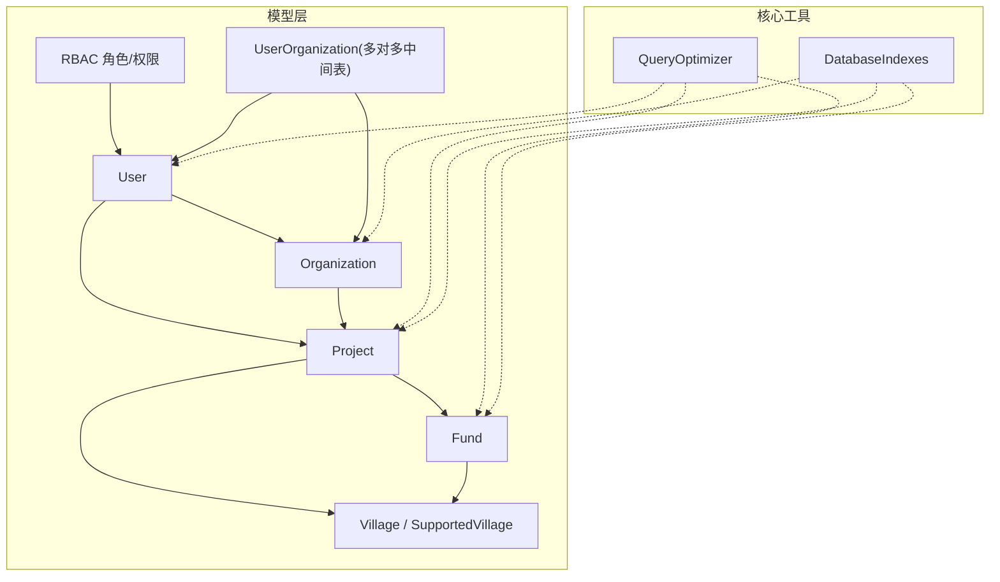
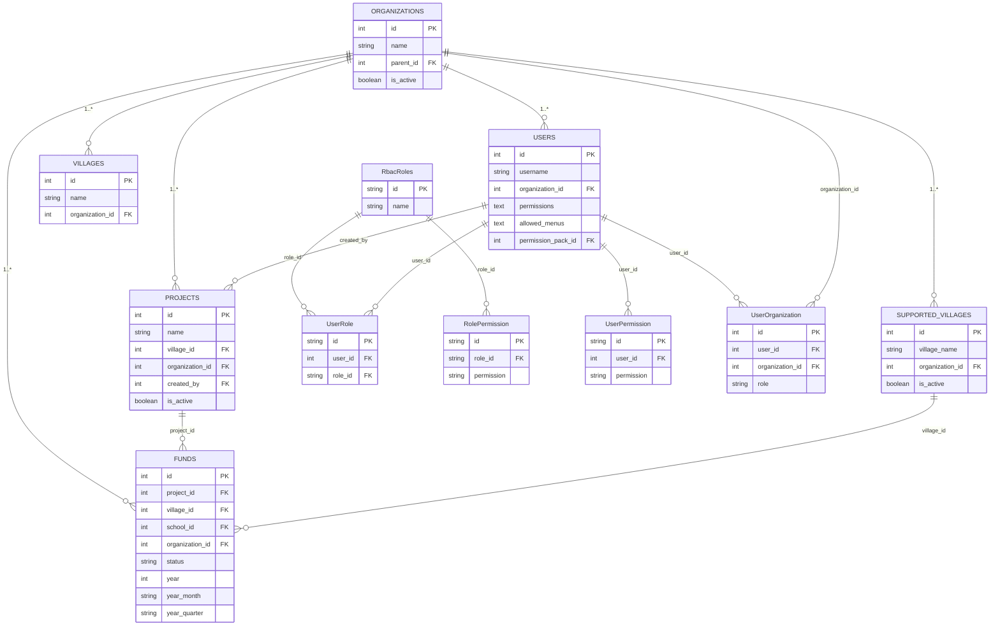
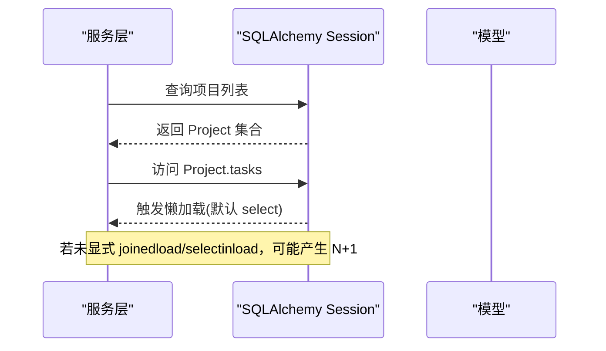
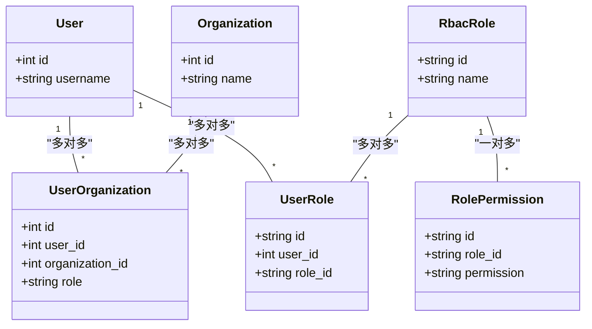
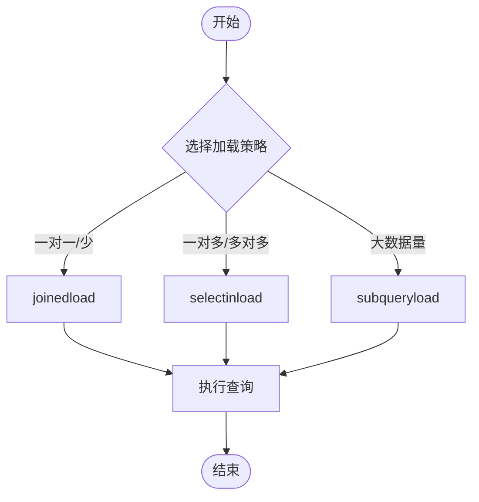
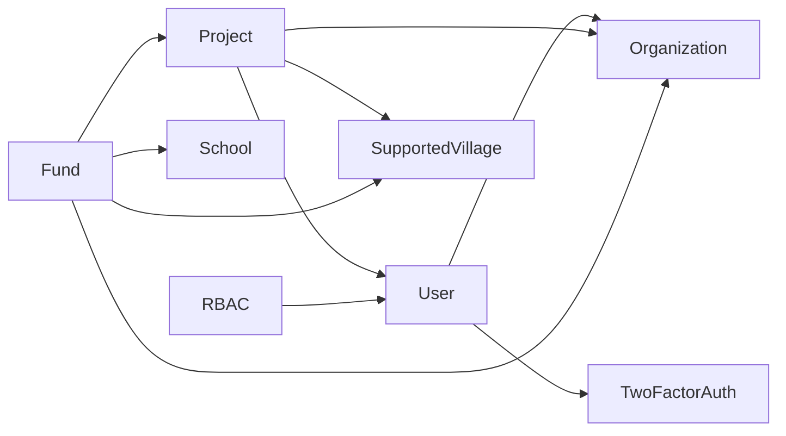

# 关系建模设计

<cite>
**本文引用的文件**
- [base.py](file://backend/app/models/base.py)
- [user.py](file://backend/app/models/user.py)
- [organization.py](file://backend/app/models/organization.py)
- [project.py](file://backend/app/models/project.py)
- [fund.py](file://backend/app/models/fund.py)
- [village.py](file://backend/app/models/village.py)
- [supported_village.py](file://backend/app/models/supported_village.py)
- [rbac.py](file://backend/app/models/rbac.py)
- [user_organization.py](file://backend/app/models/user_organization.py)
- [query_optimizer.py](file://backend/app/core/query_optimizer.py)
- [database_indexes.py](file://backend/app/core/database_indexes.py)
</cite>

## 目录
1. [简介](#简介)
2. [项目结构](#项目结构)
3. [核心组件](#核心组件)
4. [架构总览](#架构总览)
5. [详细组件分析](#详细组件分析)
6. [依赖分析](#依赖分析)
7. [性能考虑](#性能考虑)
8. [故障排查指南](#故障排查指南)
9. [结论](#结论)
10. [附录](#附录)

## 简介
本文件围绕 SQLAlchemy 的关系建模进行系统化说明，覆盖一对一、一对多、多对多关系的实现方式；外键约束与级联策略（CASCADE、SET NULL）；空值处理与索引优化；反向引用（backref/back_populates）与懒加载策略；复杂场景（自引用树、复合外键、条件关系）；查询性能优化（joinedload/selectinload/subqueryload）；以及最佳实践与常见问题诊断。

## 项目结构
本项目在 backend/app/models 下按业务域拆分模型文件，并通过 SQLAlchemy 的 relationship 建立实体间关联；在 backend/app/core 提供查询优化与索引管理工具；Alembic 迁移负责数据库结构与索引演进。

图表来源
- [user.py:26-90](file://backend/app/models/user.py#L26-L90)
- [organization.py:31-74](file://backend/app/models/organization.py#L31-L74)
- [project.py:47-175](file://backend/app/models/project.py#L47-L175)
- [fund.py:61-167](file://backend/app/models/fund.py#L61-L167)
- [supported_village.py:42-194](file://backend/app/models/supported_village.py#L42-L194)
- [rbac.py:31-132](file://backend/app/models/rbac.py#L31-L132)
- [user_organization.py:21-69](file://backend/app/models/user_organization.py#L21-L69)
- [query_optimizer.py:23-49](file://backend/app/core/query_optimizer.py#L23-L49)
- [database_indexes.py:26-52](file://backend/app/core/database_indexes.py#L26-L52)

章节来源
- [base.py:15-185](file://backend/app/models/base.py#L15-L185)
- [user.py:26-90](file://backend/app/models/user.py#L26-L90)
- [organization.py:31-74](file://backend/app/models/organization.py#L31-L74)
- [project.py:47-175](file://backend/app/models/project.py#L47-L175)
- [fund.py:61-167](file://backend/app/models/fund.py#L61-L167)
- [supported_village.py:42-194](file://backend/app/models/supported_village.py#L42-L194)
- [rbac.py:31-132](file://backend/app/models/rbac.py#L31-L132)
- [user_organization.py:21-69](file://backend/app/models/user_organization.py#L21-L69)
- [query_optimizer.py:23-49](file://backend/app/core/query_optimizer.py#L23-L49)
- [database_indexes.py:26-52](file://backend/app/core/database_indexes.py#L26-L52)

## 核心组件
- 基类与混入：BaseModel 提供 id、时间戳等通用字段；TimestampMixin 自动维护 created_at/updated_at 并递增 sync_version；SoftDeleteMixin 提供软删除能力；EncryptedText 用于敏感字段透明加密。
- 用户与组织：User 通过 organization_id 外键关联 Organization；支持数据范围、权限包绑定等。
- 项目与任务/附件：Project 与 ProjectTask、ProjectFile 形成一对多；与 Fund、SupportedVillage、Organization 存在多向关联。
- 经费：Fund 与 Project、SupportedVillage、School、Organization 关联，并提供统计冗余字段与事件监听自动填充。
- 村庄体系：Village 与 Villager、Industry 一对多；SupportedVillage 聚合大量年度子表，统一使用 selectin 懒加载。
- RBAC：RbacRole、UserRole、RolePermission、UserPermission、ResourceAccessControl、AccessLog、MachineCodePermission 构成完整权限模型。
- 多对多：UserOrganization 作为用户与组织的关联表，支持角色维度。

章节来源
- [base.py:15-185](file://backend/app/models/base.py#L15-L185)
- [user.py:26-90](file://backend/app/models/user.py#L26-L90)
- [organization.py:31-74](file://backend/app/models/organization.py#L31-L74)
- [project.py:47-175](file://backend/app/models/project.py#L47-L175)
- [fund.py:61-167](file://backend/app/models/fund.py#L61-L167)
- [village.py:14-130](file://backend/app/models/village.py#L14-L130)
- [supported_village.py:42-194](file://backend/app/models/supported_village.py#L42-L194)
- [rbac.py:31-263](file://backend/app/models/rbac.py#L31-L263)
- [user_organization.py:21-69](file://backend/app/models/user_organization.py#L21-L69)

## 架构总览
下图展示核心实体间的关系与外键方向，体现一对一、一对多、多对多的建模方式，以及自引用树形结构。

图表来源
- [user.py:57-90](file://backend/app/models/user.py#L57-L90)
- [organization.py:47-74](file://backend/app/models/organization.py#L47-L74)
- [project.py:81-175](file://backend/app/models/project.py#L81-L175)
- [fund.py:104-167](file://backend/app/models/fund.py#L104-L167)
- [supported_village.py:107-194](file://backend/app/models/supported_village.py#L107-L194)
- [village.py:47-70](file://backend/app/models/village.py#L47-L70)
- [rbac.py:31-132](file://backend/app/models/rbac.py#L31-L132)
- [user_organization.py:21-69](file://backend/app/models/user_organization.py#L21-L69)

## 详细组件分析

### 一对一关系
- 用户与双因素认证：User 与 TwoFactorAuth 通过 uselist=False 配置为一对一关系，避免列表加载开销。
- 建议：一对一通常将外键放在“从属”侧，或使用唯一外键；若双向访问频繁，可在两端均定义 relationship，但注意循环导入问题，可使用字符串引用或延迟导入。

章节来源
- [user.py:87-91](file://backend/app/models/user.py#L87-L91)

### 一对多关系
- 组织到用户：Organization 与 User 通过 organization_id 外键形成一对多；User.organization 使用 lazy="select"，默认按需加载。
- 组织到项目：Organization 与 Project 通过 organization_id 外键形成一对多。
- 项目到任务/附件：Project 与 ProjectTask、ProjectFile 一对多，且设置 cascade="all, delete-orphan"，删除项目时级联清理子记录。
- 村庄到村民/产业：Village 与 Villager、Industry 一对多，同样采用级联删除。
- 帮扶村到年度数据：SupportedVillage 与各年度子表（人口、收入、投入等）一对多，统一使用 lazy="selectin"，配合列表页批量加载，减少 N+1。

图表来源
- [project.py:167-175](file://backend/app/models/project.py#L167-L175)
- [query_optimizer.py:23-49](file://backend/app/core/query_optimizer.py#L23-L49)

章节来源
- [user.py:87-90](file://backend/app/models/user.py#L87-L90)
- [project.py:167-175](file://backend/app/models/project.py#L167-L175)
- [village.py:65-70](file://backend/app/models/village.py#L65-L70)
- [supported_village.py:130-194](file://backend/app/models/supported_village.py#L130-L194)

### 多对多关系
- 用户与组织：通过 UserOrganization 中间表实现多对多，包含角色维度；可结合 RBAC 的角色-权限体系进行细粒度控制。
- 用户与角色：通过 UserRole 中间表实现多对多；角色与权限通过 RolePermission 关联。
- 建议：在多对多关系中，中间表应包含必要的审计字段（创建/更新时间）、唯一约束（防止重复关联），并为常用查询列添加索引。

图表来源
- [user_organization.py:21-69](file://backend/app/models/user_organization.py#L21-L69)
- [rbac.py:31-132](file://backend/app/models/rbac.py#L31-L132)

章节来源
- [user_organization.py:21-69](file://backend/app/models/user_organization.py#L21-L69)
- [rbac.py:31-132](file://backend/app/models/rbac.py#L31-L132)

### 自引用关系（树形结构）
- 组织树：Organization.parent_id 自引用外键，children 使用 backref 暴露 parent；cascade="all, delete-orphan" 保证删除父节点时级联删除子节点。
- 建议：树形结构需配合 path 或 level 字段加速层级查询；为 parent_id 建索引以优化递归遍历。

章节来源
- [organization.py:47-74](file://backend/app/models/organization.py#L47-L74)

### 复合外键与条件关系
- 复合外键：当前模型未见显式复合主键/外键，但可通过 UniqueConstraint 实现业务唯一性（如年度数据表的 supported_village_id + year）。
- 条件关系：SupportedVillage 的各年度子表通过 back_populates 与 village 关联，并使用 selectin 懒加载；可按年份过滤后批量加载，避免 N+1。

章节来源
- [supported_village.py:313-390](file://backend/app/models/supported_village.py#L313-L390)

### 外键约束与级联策略
- CASCADE：用于强依赖的子记录（如项目删除→任务/附件删除；帮扶村删除→年度数据删除）。
- SET NULL：用于弱依赖（如项目删除→创建人置空；组织删除→用户/项目所属组织置空），保持数据可追溯。
- 空值处理：外键允许 NULL 时，需在应用层保证业务语义；对于必填关联，建议使用 NOT NULL 并在插入前校验。

章节来源
- [project.py:81-92](file://backend/app/models/project.py#L81-L92)
- [project.py:147-152](file://backend/app/models/project.py#L147-L152)
- [fund.py:104-110](file://backend/app/models/fund.py#L104-L110)
- [user.py:57-62](file://backend/app/models/user.py#L57-L62)

### 反向引用与懒加载策略
- back_populates：推荐在两端明确声明，便于 ORM 正确识别关系方向。
- backref：适用于简单场景（如组织 children 的 parent 反向）。
- 懒加载策略：
  - select：默认按需加载，适合单条详情。
  - selectin：适合列表批量加载一对多/多对多，减少 N+1。
  - noload：仅占位，不自动加载，需在 API 层显式 eager load。
  - joined：内连接加载，适合小结果集且关联表较小。
  - subquery：子查询加载，适合大结果集且关联表较大。

章节来源
- [organization.py:68-74](file://backend/app/models/organization.py#L68-L74)
- [project.py:167-175](file://backend/app/models/project.py#L167-L175)
- [supported_village.py:126-194](file://backend/app/models/supported_village.py#L126-L194)

### 查询性能优化（joinedload/selectinload/subqueryload）
- joinedload：适合一对一/一对少，生成 JOIN 语句，减少往返次数。
- selectinload：适合一对多/多对多，先查主表再批量查关联表，避免笛卡尔积膨胀。
- subqueryload：类似 selectin，但使用子查询，适合大数据量场景。
- 项目实践：
  - SupportedVillage 的年度子表统一使用 selectin，列表页直接可用，无需额外 eager load。
  - Project 的 village/organization 使用 noload，仅在需要时显式加载，降低默认负载。
  - QueryOptimizer 提供分页、慢查询监控与 N+1 检测装饰器，辅助定位性能瓶颈。

章节来源
- [query_optimizer.py:23-49](file://backend/app/core/query_optimizer.py#L23-L49)
- [supported_village.py:130-194](file://backend/app/models/supported_village.py#L130-L194)
- [project.py:167-175](file://backend/app/models/project.py#L167-L175)

## 依赖分析
- 模型耦合：
  - User 依赖 Organization、TwoFactorAuth、PermissionPack（字符串引用避免循环导入）。
  - Project 依赖 User、SupportedVillage、Organization、Fund。
  - Fund 依赖 Project、SupportedVillage、School、Organization。
  - RBAC 模块与 User 解耦，通过 UserRole/UserPermission 间接关联。
- 外部依赖：
  - Alembic 迁移负责索引与结构变更。
  - QueryOptimizer 提供查询监控与分析。
  - DatabaseIndexes 集中管理索引定义与创建。

图表来源
- [user.py:17-22](file://backend/app/models/user.py#L17-L22)
- [project.py:20-23](file://backend/app/models/project.py#L20-L23)
- [fund.py:25-28](file://backend/app/models/fund.py#L25-L28)
- [rbac.py:24-25](file://backend/app/models/rbac.py#L24-L25)

章节来源
- [user.py:17-22](file://backend/app/models/user.py#L17-L22)
- [project.py:20-23](file://backend/app/models/project.py#L20-L23)
- [fund.py:25-28](file://backend/app/models/fund.py#L25-L28)
- [rbac.py:24-25](file://backend/app/models/rbac.py#L24-L25)

## 性能考虑
- 索引策略：
  - 单列索引：username、email、status、type、village_id、organization_id 等高频过滤列。
  - 复合索引：status+type、status+created_at、village_id+status、year_month+status 等组合查询优化。
  - 统计冗余：Fund 中 year/year_month/year_quarter 字段配合事件监听自动填充，避免 GROUP BY 函数计算导致全表扫描。
- 懒加载与 Eager Loading：
  - 列表页优先使用 selectinload/joinedload 预加载关联，避免 N+1。
  - 详情页按需加载，减少不必要的数据传输。
- 慢查询监控：
  - 使用 track_query 包装关键查询，记录耗时并告警。
  - analyze_n_plus_one 装饰器检测潜在 N+1 模式。

章节来源
- [project.py:52-68](file://backend/app/models/project.py#L52-L68)
- [fund.py:66-86](file://backend/app/models/fund.py#L66-L86)
- [fund.py:199-226](file://backend/app/models/fund.py#L199-L226)
- [query_optimizer.py:62-93](file://backend/app/core/query_optimizer.py#L62-L93)
- [query_optimizer.py:137-177](file://backend/app/core/query_optimizer.py#L137-L177)
- [database_indexes.py:26-52](file://backend/app/core/database_indexes.py#L26-L52)

## 故障排查指南
- N+1 查询问题：
  - 现象：列表接口响应慢，日志中出现多次关联查询。
  - 解决：在 Service 层使用 joinedload/selectinload；或在模型中设置合适的 lazy 策略。
  - 工具：analyze_n_plus_one 装饰器、track_query 慢查询监控。
- 外键约束冲突：
  - 现象：删除父记录时报外键约束错误。
  - 解决：检查 ondelete 策略（CASCADE/SET NULL），必要时调整业务逻辑或迁移。
- 索引缺失：
  - 现象：WHERE/ORDER BY 性能差。
  - 解决：使用 database_indexes 工具检查并创建缺失索引；Alembic 迁移确保幂等。
- 循环导入：
  - 现象：模型导入失败。
  - 解决：使用字符串引用（relationship("Model")）或延迟导入，避免顶层循环依赖。

章节来源
- [query_optimizer.py:62-93](file://backend/app/core/query_optimizer.py#L62-L93)
- [query_optimizer.py:137-177](file://backend/app/core/query_optimizer.py#L137-L177)
- [database_indexes.py:26-52](file://backend/app/core/database_indexes.py#L26-L52)
- [user.py:17-22](file://backend/app/models/user.py#L17-L22)

## 结论
本项目在关系建模上遵循清晰的外键设计与合理的级联策略，广泛使用索引与懒加载优化查询性能。通过统一的基类与混入提升模型一致性，借助 QueryOptimizer 与 DatabaseIndexes 工具实现可观测性与可维护性。建议在新增关系时遵循以下原则：明确外键语义、选择合适的懒加载策略、为高频查询列添加索引、避免循环导入、使用 Eager Loading 消除 N+1。

## 附录
- 最佳实践清单：
  - 一对一：uselist=False，避免列表加载。
  - 一对多：合理使用 cascade，避免孤儿记录。
  - 多对多：中间表包含审计字段与唯一约束。
  - 自引用：parent_id 索引 + path/level 字段。
  - 条件关系：按业务维度拆分表，使用 back_populates 明确方向。
  - 懒加载：列表用 selectin，详情用 select，大数据用 subquery。
  - 索引：单列+复合索引结合，关注 WHERE/ORDER BY/GROUP BY。
  - 监控：track_query 与 analyze_n_plus_one 常态化使用。