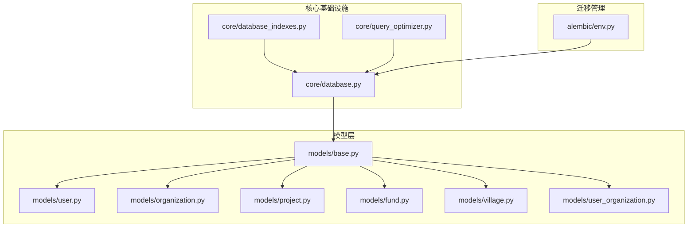
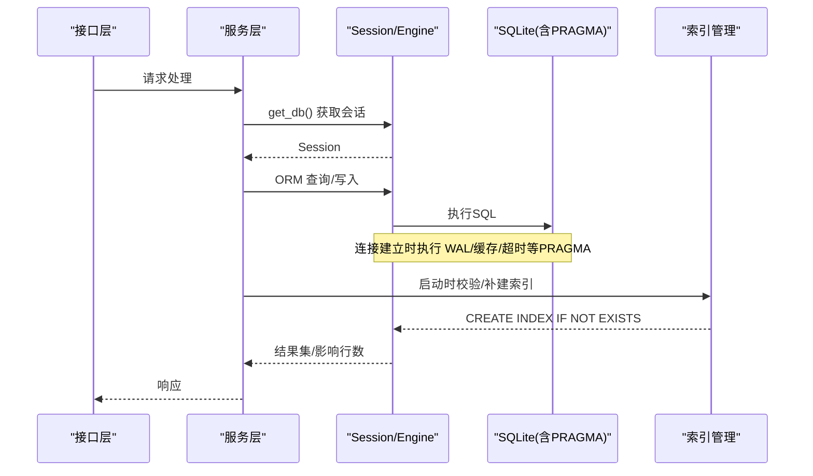
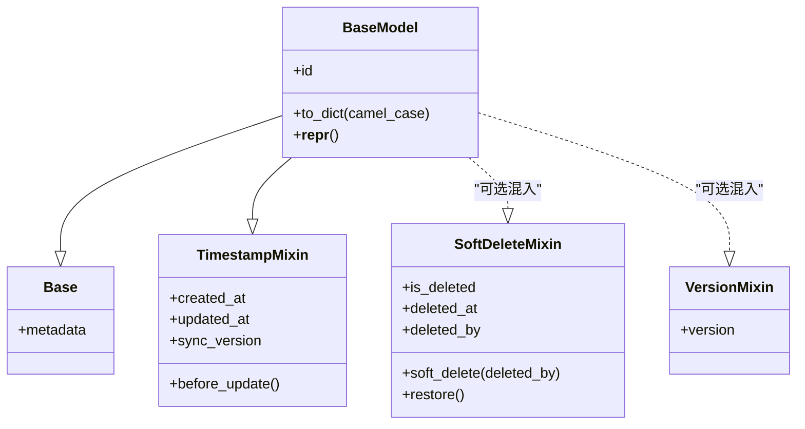
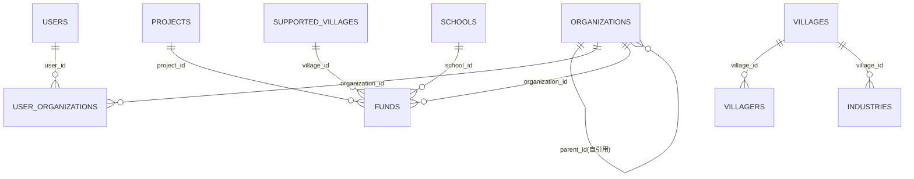
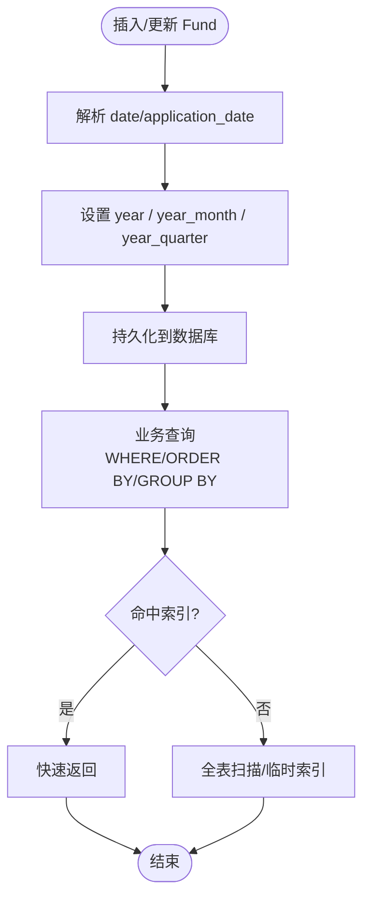
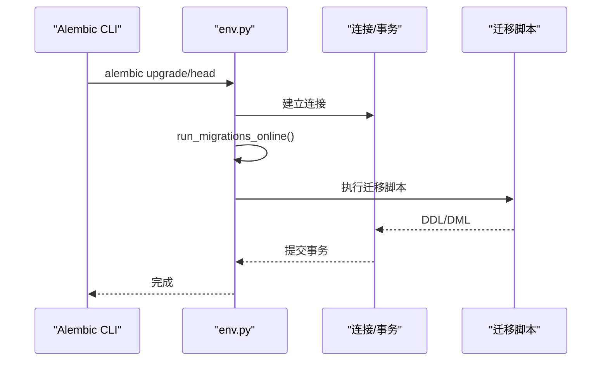
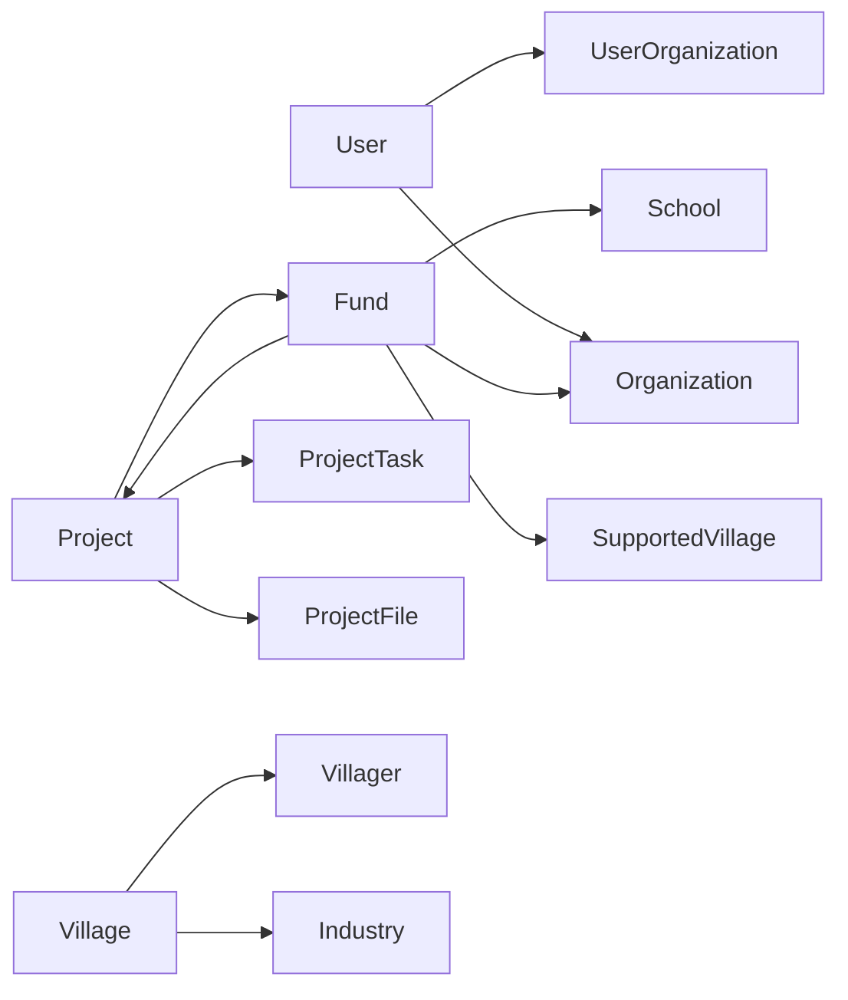

# 数据库模型设计

<cite>
**本文引用的文件**
- [backend/app/models/base.py](file://backend/app/models/base.py)
- [backend/app/core/database.py](file://backend/app/core/database.py)
- [backend/app/core/database_indexes.py](file://backend/app/core/database_indexes.py)
- [backend/app/models/user.py](file://backend/app/models/user.py)
- [backend/app/models/organization.py](file://backend/app/models/organization.py)
- [backend/app/models/project.py](file://backend/app/models/project.py)
- [backend/app/models/fund.py](file://backend/app/models/fund.py)
- [backend/app/models/village.py](file://backend/app/models/village.py)
- [backend/app/models/user_organization.py](file://backend/app/models/user_organization.py)
- [backend/alembic/env.py](file://backend/alembic/env.py)
- [backend/app/core/query_optimizer.py](file://backend/app/core/query_optimizer.py)
</cite>

## 目录
1. [简介](#简介)
2. [项目结构](#项目结构)
3. [核心组件](#核心组件)
4. [架构总览](#架构总览)
5. [详细组件分析](#详细组件分析)
6. [依赖关系分析](#依赖关系分析)
7. [性能考虑](#性能考虑)
8. [故障排查指南](#故障排查指南)
9. [结论](#结论)
10. [附录](#附录)

## 简介
本文件围绕基于 SQLAlchemy ORM 的数据库模型设计，系统阐述表结构定义、字段类型映射、关系建模、基类与混入（通用字段、软删除、审计）、索引策略、查询优化、数据迁移管理（Alembic）以及事务与并发控制的最佳实践。内容以仓库中实际实现为依据，帮助读者在不深入代码细节的情况下理解整体设计与关键优化点。

## 项目结构
后端采用分层组织：
- 模型层：位于 backend/app/models，包含基础基类、业务实体及关系定义。
- 核心基础设施：位于 backend/app/core，提供数据库引擎、会话、SQLite 调优、索引管理与查询优化工具。
- 迁移管理：位于 backend/alembic，负责版本化 schema 变更与启动时索引补建。

图表来源
- [backend/app/models/base.py:1-185](file://backend/app/models/base.py#L1-L185)
- [backend/app/core/database.py:1-343](file://backend/app/core/database.py#L1-L343)
- [backend/app/core/database_indexes.py:1-148](file://backend/app/core/database_indexes.py#L1-L148)
- [backend/alembic/env.py:1-110](file://backend/alembic/env.py#L1-L110)

章节来源
- [backend/app/models/base.py:1-185](file://backend/app/models/base.py#L1-L185)
- [backend/app/core/database.py:1-343](file://backend/app/core/database.py#L1-L343)
- [backend/app/core/database_indexes.py:1-148](file://backend/app/core/database_indexes.py#L1-L148)
- [backend/alembic/env.py:1-110](file://backend/alembic/env.py#L1-L110)

## 核心组件
- 基类与混入
  - Base：SQLAlchemy 声明式基类，统一元数据注册入口。
  - TimestampMixin：提供 created_at、updated_at 与同步版本号 sync_version；通过事件在每次更新前自动递增版本号，支撑增量同步。
  - SoftDeleteMixin：提供 is_deleted、deleted_at、deleted_by 与 soft_delete()/restore() 方法，支持软删除与审计追踪。
  - VersionMixin：version 乐观锁字段。
  - BaseModel：继承 Base 与 TimestampMixin，提供 id 主键与 to_dict 序列化能力。
- 透明加密类型
  - EncryptedText：自定义 TypeDecorator，写入时透明加密、读取时透明解密，用于 PII 字段（如电话、身份证号等）。
- 数据库连接与 SQLite 调优
  - 引擎与会话：使用 QueuePool 限制连接数，启用 pool_pre_ping、pool_recycle 等。
  - PRAGMA 调优：WAL、foreign_keys=ON、synchronous=NORMAL、busy_timeout、cache_size、mmap_size、temp_store=MEMORY、wal_autocheckpoint、automatic_index、optimize。
  - SQLCipher 支持：连接建立时探测并加载密钥，失败快速失败。
  - 长事务独占写协调器：exclusive_write() 上下文管理器，避免大批量导入时的 SQLITE_BUSY。
- 索引管理
  - 运行时索引清单 EXTRA_INDEXES：对高频 FK、状态、日期列创建单列/复合索引，启动时幂等创建。
  - analyze_table_stats：ANALYZE 统计信息收集。
- 查询优化
  - paginate：分页封装。
  - track_query/get_slow_queries：慢查询记录与分析。
  - N+1 检测：analyze_n_plus_one 装饰器，结合 query_counter 中间件计数。

章节来源
- [backend/app/models/base.py:1-185](file://backend/app/models/base.py#L1-L185)
- [backend/app/core/database.py:1-343](file://backend/app/core/database.py#L1-L343)
- [backend/app/core/database_indexes.py:1-148](file://backend/app/core/database_indexes.py#L1-L148)
- [backend/app/core/query_optimizer.py:1-177](file://backend/app/core/query_optimizer.py#L1-L177)

## 架构总览
下图展示从应用到数据库的关键路径：FastAPI 依赖注入获取 Session，业务服务调用 ORM 模型，ORM 通过 Engine 执行 SQL；连接建立时自动完成 PRAGMA 调优与可选加密；启动时校验并补建索引；长事务通过独占写协调器串行化。

图表来源
- [backend/app/core/database.py:70-157](file://backend/app/core/database.py#L70-L157)
- [backend/app/core/database_indexes.py:59-95](file://backend/app/core/database_indexes.py#L59-L95)
- [backend/alembic/env.py:79-103](file://backend/alembic/env.py#L79-L103)

## 详细组件分析

### 基类模型与通用字段
- 通用字段
  - id：自增主键，默认带索引。
  - created_at/updated_at：UTC 时间戳，onupdate 自动更新时间；server_default/server_onupdate 保证数据库侧一致性。
  - sync_version：每次 UPDATE 前自动 +1，用于增量同步过滤。
- 软删除与审计
  - SoftDeleteMixin：is_deleted、deleted_at、deleted_by；soft_delete(deleted_by) 记录操作人；restore 清除审计字段。
  - 历史兼容：部分模型使用 is_active 作为软删标记，新模型建议迁移至 SoftDeleteMixin。
- 乐观锁
  - VersionMixin：version 字段，配合应用层条件更新实现并发控制。
- 序列化
  - BaseModel.to_dict：将 datetime 转为 ISO 字符串，并提供 camelCase 转换。

图表来源
- [backend/app/models/base.py:19-185](file://backend/app/models/base.py#L19-L185)

章节来源
- [backend/app/models/base.py:60-185](file://backend/app/models/base.py#L60-L185)

### 一对一、一对多、多对多关系建模
- 一对一
  - User 与 TwoFactorAuth：uselist=False 表示一对一关系。
- 一对多
  - Organization 树形自引用：children 与 backref(parent)，级联 all, delete-orphan。
  - Project 与 ProjectTask、ProjectFile：一对多，外键 ondelete=CASCADE。
  - Fund 与 Project/Village/School/Organization：一对多，外键 ondelete=CASCADE/SET NULL。
  - Village 与 Villager/Industry：一对多，级联 all, delete-orphan。
- 多对多
  - UserOrganization：用户与组织的多对多关联表，含角色与唯一约束，便于按组织维度进行数据权限与资源隔离。

图表来源
- [backend/app/models/organization.py:31-78](file://backend/app/models/organization.py#L31-L78)
- [backend/app/models/user_organization.py:21-69](file://backend/app/models/user_organization.py#L21-L69)
- [backend/app/models/project.py:47-175](file://backend/app/models/project.py#L47-L175)
- [backend/app/models/fund.py:61-167](file://backend/app/models/fund.py#L61-L167)
- [backend/app/models/village.py:14-130](file://backend/app/models/village.py#L14-L130)

章节来源
- [backend/app/models/user.py:87-91](file://backend/app/models/user.py#L87-L91)
- [backend/app/models/organization.py:31-78](file://backend/app/models/organization.py#L31-L78)
- [backend/app/models/project.py:47-175](file://backend/app/models/project.py#L47-L175)
- [backend/app/models/fund.py:61-167](file://backend/app/models/fund.py#L61-L167)
- [backend/app/models/village.py:14-130](file://backend/app/models/village.py#L14-L130)
- [backend/app/models/user_organization.py:21-69](file://backend/app/models/user_organization.py#L21-L69)

### 字段类型映射与敏感数据保护
- 数值与金额：Numeric(15,4) 用于预算、金额等高精度场景。
- 日期与时间：Date/DateTime(timezone=True)，统一 UTC 存储与显示。
- 文本：String/Text，敏感字段使用 EncryptedText 透明加密。
- 布尔与枚举：Boolean 与 String 枚举值（如状态、类型），便于跨库兼容。
- 外键与约束：ForeignKey(ondelete=...) 明确级联行为；UniqueConstraint 保障唯一性。

章节来源
- [backend/app/models/base.py:23-46](file://backend/app/models/base.py#L23-L46)
- [backend/app/models/project.py:70-165](file://backend/app/models/project.py#L70-L165)
- [backend/app/models/fund.py:88-167](file://backend/app/models/fund.py#L88-L167)
- [backend/app/models/user_organization.py:21-69](file://backend/app/models/user_organization.py#L21-L69)

### 索引设计与查询性能优化
- 单列索引：常用过滤列（status、type、fund_source、date、organization_id、created_by 等）。
- 复合索引：针对常见查询组合（如 project_id+status、village_id+status、year_month+status、year_quarter+fund_type 等）。
- 冗余聚合字段：Fund 中 year、year_month、year_quarter 由 before_insert/before_update 事件自动填充，使 GROUP BY 直接命中索引，避免函数计算导致的扫描。
- 运行时索引补建：启动时根据 EXTRA_INDEXES 列表幂等创建缺失索引，确保查询计划稳定。
- 查询工具：track_query 记录慢查询；paginate 安全分页；analyze_n_plus_one 检测 N+1。

图表来源
- [backend/app/models/fund.py:199-227](file://backend/app/models/fund.py#L199-L227)
- [backend/app/core/database_indexes.py:18-42](file://backend/app/core/database_indexes.py#L18-L42)
- [backend/app/core/query_optimizer.py:62-93](file://backend/app/core/query_optimizer.py#L62-L93)

章节来源
- [backend/app/models/fund.py:66-86](file://backend/app/models/fund.py#L66-L86)
- [backend/app/core/database_indexes.py:59-95](file://backend/app/core/database_indexes.py#L59-L95)
- [backend/app/core/query_optimizer.py:23-49](file://backend/app/core/query_optimizer.py#L23-L49)

### 数据完整性、事务与并发控制
- 数据完整性
  - 外键约束：ondelete=CASCADE/SET NULL，保证级联一致性与孤儿记录防护。
  - 唯一约束：用户名、邮箱、单位编号、用户-组织关联等。
  - 非空与默认值：关键字段强制非空，状态/类型提供默认值。
- 事务处理
  - SessionLocal 默认 autocommit=False，异常时显式 rollback，避免脏事务复用。
  - 长事务独占写：exclusive_write() 防止大事务被 busy_timeout 截断，提升导入稳定性。
- 并发控制
  - 乐观锁：VersionMixin 的 version 字段，配合 WHERE version = ? 更新。
  - SQLite 特性：WAL 模式、busy_timeout=10s、NORMAl 同步级别，平衡并发与安全。
  - 连接池：QueuePool 限制连接数，pool_pre_ping 健康检查，pool_recycle 定期回收。

章节来源
- [backend/app/core/database.py:174-186](file://backend/app/core/database.py#L174-L186)
- [backend/app/core/database.py:198-285](file://backend/app/core/database.py#L198-L285)
- [backend/app/models/base.py:150-155](file://backend/app/models/base.py#L150-L155)
- [backend/app/models/user_organization.py:58-64](file://backend/app/models/user_organization.py#L58-L64)

### 数据迁移管理（Alembic）
- 环境配置
  - 目标元数据：Base.metadata，自动发现所有模型。
  - 离线/在线模式：支持生成 SQL 或直接执行迁移。
  - render_as_batch：适配 SQLite 的 DDL 语法差异。
- 前置补列
  - 在 revision --autogenerate 前运行 _migrate_missing_columns，确保能识别完整表结构，避免重复 DDL。
- 版本控制与回滚
  - 每个迁移文件对应一次 schema 变更；downgrade 可回滚。
  - 索引与额外 DDL 可通过迁移或启动时脚本统一管理。

图表来源
- [backend/alembic/env.py:79-103](file://backend/alembic/env.py#L79-L103)
- [backend/alembic/env.py:45-57](file://backend/alembic/env.py#L45-L57)

章节来源
- [backend/alembic/env.py:1-110](file://backend/alembic/env.py#L1-L110)

## 依赖关系分析
- 模型间耦合
  - 高内聚：每个模型聚焦自身职责，关系通过 relationship/back_populates 解耦。
  - 低耦合：字符串引用延迟解析，避免循环导入；必要时在文件末尾导入依赖模型。
- 外部依赖
  - SQLAlchemy：ORM、事件监听、索引定义。
  - Alembic：迁移与环境配置。
  - SQLite：WAL、PRAGMA 调优、SQLCipher 加密。
- 潜在风险
  - 循环导入：通过延迟 import 与字符串引用规避。
  - 索引缺失：启动时校验并补建，降低运行时性能波动。

图表来源
- [backend/app/models/user.py:87-91](file://backend/app/models/user.py#L87-L91)
- [backend/app/models/organization.py:68-75](file://backend/app/models/organization.py#L68-L75)
- [backend/app/models/project.py:167-175](file://backend/app/models/project.py#L167-L175)
- [backend/app/models/fund.py:162-167](file://backend/app/models/fund.py#L162-L167)
- [backend/app/models/village.py:65-71](file://backend/app/models/village.py#L65-L71)

章节来源
- [backend/app/models/user.py:87-91](file://backend/app/models/user.py#L87-L91)
- [backend/app/models/organization.py:68-75](file://backend/app/models/organization.py#L68-L75)
- [backend/app/models/project.py:167-175](file://backend/app/models/project.py#L167-L175)
- [backend/app/models/fund.py:162-167](file://backend/app/models/fund.py#L162-L167)
- [backend/app/models/village.py:65-71](file://backend/app/models/village.py#L65-L71)

## 性能考虑
- 连接与内存
  - WAL 模式与 NORMAL 同步：兼顾并发与写入性能。
  - cache_size/mmap_size/temp_store：放大内存缓存，减少磁盘 IO。
  - busy_timeout：放宽锁等待，降低 SQLITE_BUSY 概率。
- 索引与查询
  - 复合索引覆盖常见过滤与排序组合。
  - 冗余聚合字段替代函数计算，提升 GROUP BY 效率。
  - 慢查询监控与 N+1 检测，定位瓶颈。
- 批量与长事务
  - exclusive_write() 串行化长事务，避免阻塞短事务读取。
  - 分批提交与 bulk 操作减少往返开销。

[本节为通用指导，不直接分析具体文件]

## 故障排查指南
- 常见问题
  - SQLITE_BUSY：长事务或并发写入导致；使用 exclusive_write() 包裹导入任务，或调整 busy_timeout。
  - 慢查询：通过 track_query 与 get_slow_queries 定位；检查是否命中索引，必要时补充复合索引。
  - N+1 查询：使用 analyze_n_plus_one 装饰器检测，改用 selectinload/joinedload 或批量查询。
  - 加密密钥错误：连接建立时即失败，检查 db.key 内容与驱动是否支持 SQLCipher。
- 诊断步骤
  - 查看日志中的慢查询与警告。
  - 使用 analyze_table_stats 收集统计信息。
  - 验证索引是否存在且有效（EXTRA_INDEXES）。
  - 检查外键约束与级联行为是否符合预期。

章节来源
- [backend/app/core/database.py:70-157](file://backend/app/core/database.py#L70-L157)
- [backend/app/core/database_indexes.py:59-95](file://backend/app/core/database_indexes.py#L59-L95)
- [backend/app/core/query_optimizer.py:62-93](file://backend/app/core/query_optimizer.py#L62-L93)

## 结论
本项目基于 SQLAlchemy 构建了稳健、可扩展的数据库模型体系：统一的基类与混入提供通用能力；精细的索引与冗余聚合字段显著提升复杂查询性能；Alembic 与启动时索引补建确保 schema 演进的可控性；SQLite 深度调优与独占写协调器保障了单机/多机协同下的稳定性与并发能力。遵循本文最佳实践，可在保证数据完整性与可维护性的同时，获得良好的查询与写入性能。

## 附录
- 术语
  - 软删除：逻辑删除，保留历史数据并支持恢复。
  - 乐观锁：通过版本号控制并发更新，避免锁竞争。
  - WAL：预写日志模式，提升并发读写能力。
- 参考路径
  - 基类与混入：[backend/app/models/base.py](file://backend/app/models/base.py)
  - 数据库配置与调优：[backend/app/core/database.py](file://backend/app/core/database.py)
  - 索引管理：[backend/app/core/database_indexes.py](file://backend/app/core/database_indexes.py)
  - 查询优化：[backend/app/core/query_optimizer.py](file://backend/app/core/query_optimizer.py)
  - 迁移环境：[backend/alembic/env.py](file://backend/alembic/env.py)