# 核心数据模型

<cite>
**本文引用的文件**
- [backend/app/models/base.py](file://backend/app/models/base.py)
- [backend/app/models/user.py](file://backend/app/models/user.py)
- [backend/app/models/organization.py](file://backend/app/models/organization.py)
- [backend/app/models/rbac.py](file://backend/app/models/rbac.py)
- [backend/app/models/user_organization.py](file://backend/app/models/user_organization.py)
- [backend/app/models/permission_pack.py](file://backend/app/models/permission_pack.py)
- [backend/app/core/data_permission.py](file://backend/app/core/data_permission.py)
- [backend/app/core/unified_data_scope.py](file://backend/app/core/unified_data_scope.py)
- [backend/app/models/validation_rule.py](file://backend/app/models/validation_rule.py)
- [backend/app/core/database_indexes.py](file://backend/app/core/database_indexes.py)
</cite>

## 目录
1. [简介](#简介)
2. [项目结构](#项目结构)
3. [核心组件](#核心组件)
4. [架构总览](#架构总览)
5. [详细组件分析](#详细组件分析)
6. [依赖关系分析](#依赖关系分析)
7. [性能考虑](#性能考虑)
8. [故障排查指南](#故障排查指南)
9. [结论](#结论)
10. [附录](#附录)

## 简介
本文件聚焦系统核心数据模型的设计与实现，覆盖用户、组织、角色权限（RBAC）、基类模型 BaseModel 的通用能力，以及数据范围控制、菜单权限管理、模型关联关系、验证规则与约束、默认值设置等。同时给出复杂查询场景下的性能优化策略与最佳实践，帮助读者快速理解并正确使用这些模型。

## 项目结构
围绕核心数据模型的代码主要分布在以下位置：
- 基础模型与混入：base.py
- 业务主模型：user.py、organization.py
- RBAC 权限模型：rbac.py、permission_pack.py
- 多对多关联：user_organization.py
- 数据范围与权限工具：data_permission.py、unified_data_scope.py
- 校验规则模型：validation_rule.py
- 索引与性能：database_indexes.py

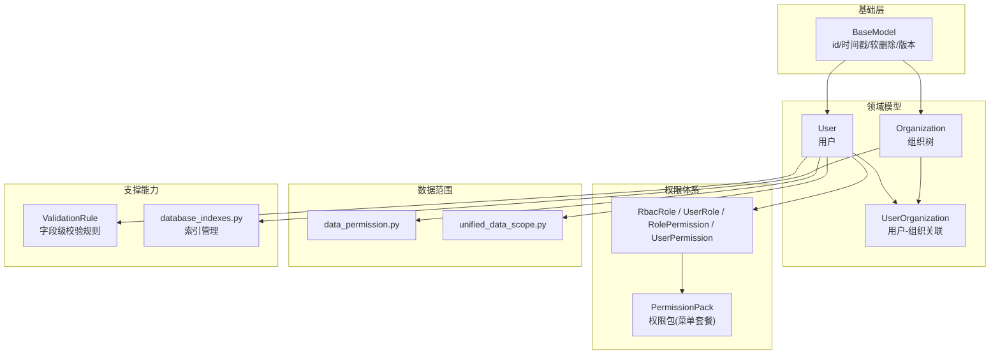

图表来源
- [backend/app/models/base.py:158-185](file://backend/app/models/base.py#L158-L185)
- [backend/app/models/user.py:26-90](file://backend/app/models/user.py#L26-L90)
- [backend/app/models/organization.py:31-78](file://backend/app/models/organization.py#L31-L78)
- [backend/app/models/rbac.py:31-160](file://backend/app/models/rbac.py#L31-L160)
- [backend/app/models/permission_pack.py:16-47](file://backend/app/models/permission_pack.py#L16-L47)
- [backend/app/models/user_organization.py:21-69](file://backend/app/models/user_organization.py#L21-L69)
- [backend/app/core/data_permission.py:20-187](file://backend/app/core/data_permission.py#L20-L187)
- [backend/app/core/unified_data_scope.py:43-184](file://backend/app/core/unified_data_scope.py#L43-L184)
- [backend/app/models/validation_rule.py:31-55](file://backend/app/models/validation_rule.py#L31-L55)
- [backend/app/core/database_indexes.py:18-45](file://backend/app/core/database_indexes.py#L18-L45)

章节来源
- [backend/app/models/base.py:158-185](file://backend/app/models/base.py#L158-L185)
- [backend/app/models/user.py:26-90](file://backend/app/models/user.py#L26-L90)
- [backend/app/models/organization.py:31-78](file://backend/app/models/organization.py#L31-L78)
- [backend/app/models/rbac.py:31-160](file://backend/app/models/rbac.py#L31-L160)
- [backend/app/models/permission_pack.py:16-47](file://backend/app/models/permission_pack.py#L16-L47)
- [backend/app/models/user_organization.py:21-69](file://backend/app/models/user_organization.py#L21-L69)
- [backend/app/core/data_permission.py:20-187](file://backend/app/core/data_permission.py#L20-L187)
- [backend/app/core/unified_data_scope.py:43-184](file://backend/app/core/unified_data_scope.py#L43-L184)
- [backend/app/models/validation_rule.py:31-55](file://backend/app/models/validation_rule.py#L31-L55)
- [backend/app/core/database_indexes.py:18-45](file://backend/app/core/database_indexes.py#L18-L45)

## 核心组件
- 基类模型与混入：提供 id、创建/更新时间戳、同步版本号、软删除、乐观锁、字典转换等通用能力。
- 用户模型：包含身份、角色、数据范围、白名单权限、可见菜单、绑定权限包、登录安全等字段与属性。
- 组织模型：支持树形层级、类型、排序、联系人信息、区域编码、启用状态等，并提供自引用父子关系。
- RBAC 模型：角色、用户-角色、角色-权限、用户直接权限、资源访问控制、访问日志、机器码功能权限。
- 用户-组织关联：支持用户属于多个组织，并在不同组织中拥有不同角色。
- 权限包：预定义菜单 key 集合，可批量绑定给普通用户，用于菜单可见性控制。
- 数据范围：基于角色的数据可见范围（全部/本部门/本人）与基于组织树的范围过滤。
- 校验规则：可配置的字段级校验规则，支持多种规则类型与参数。
- 索引管理：启动时校验并补建关键索引，保障查询性能。

章节来源
- [backend/app/models/base.py:65-185](file://backend/app/models/base.py#L65-L185)
- [backend/app/models/user.py:26-152](file://backend/app/models/user.py#L26-L152)
- [backend/app/models/organization.py:13-78](file://backend/app/models/organization.py#L13-L78)
- [backend/app/models/rbac.py:31-263](file://backend/app/models/rbac.py#L31-L263)
- [backend/app/models/user_organization.py:21-69](file://backend/app/models/user_organization.py#L21-L69)
- [backend/app/models/permission_pack.py:16-47](file://backend/app/models/permission_pack.py#L16-L47)
- [backend/app/core/data_permission.py:20-187](file://backend/app/core/data_permission.py#L20-L187)
- [backend/app/core/unified_data_scope.py:43-343](file://backend/app/core/unified_data_scope.py#L43-L343)
- [backend/app/models/validation_rule.py:15-55](file://backend/app/models/validation_rule.py#L15-L55)
- [backend/app/core/database_indexes.py:18-148](file://backend/app/core/database_indexes.py#L18-L148)

## 架构总览
下图展示了核心数据模型之间的关系与权限/数据范围在系统中的协作方式。

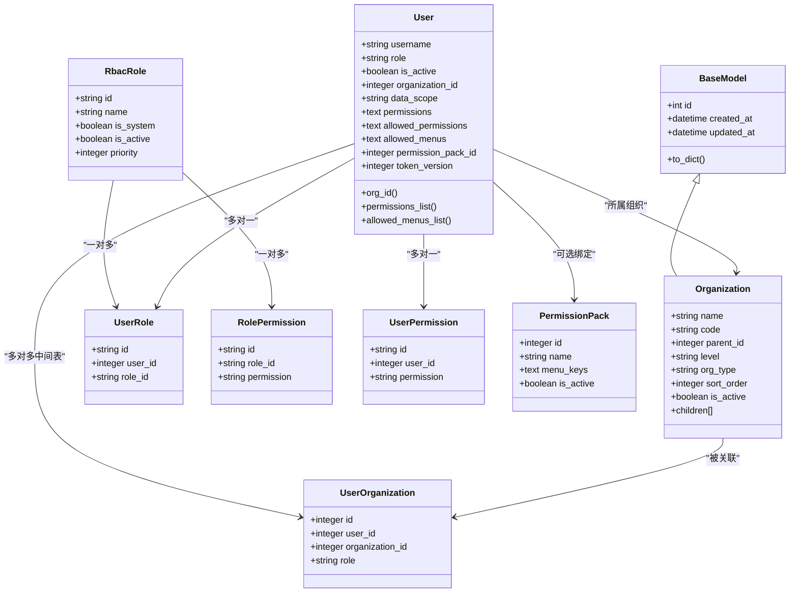

图表来源
- [backend/app/models/base.py:158-185](file://backend/app/models/base.py#L158-L185)
- [backend/app/models/user.py:26-90](file://backend/app/models/user.py#L26-L90)
- [backend/app/models/organization.py:31-78](file://backend/app/models/organization.py#L31-L78)
- [backend/app/models/rbac.py:31-160](file://backend/app/models/rbac.py#L31-L160)
- [backend/app/models/permission_pack.py:16-47](file://backend/app/models/permission_pack.py#L16-L47)
- [backend/app/models/user_organization.py:21-69](file://backend/app/models/user_organization.py#L21-L69)

## 详细组件分析

### 基类模型 BaseModel 与混入
- 主键与时间戳：统一 id 自增主键；created_at/updated_at 使用 UTC 时间，更新时自动刷新。
- 同步版本号：sync_version 在每次更新前自动递增，便于增量同步与数据包过滤。
- 软删除：is_deleted/deleted_at/deleted_by 与 soft_delete()/restore() 方法，支持审计追踪。
- 乐观锁：version 字段用于并发控制。
- 字典转换：to_dict 支持 camelCase 输出，便于前端消费。

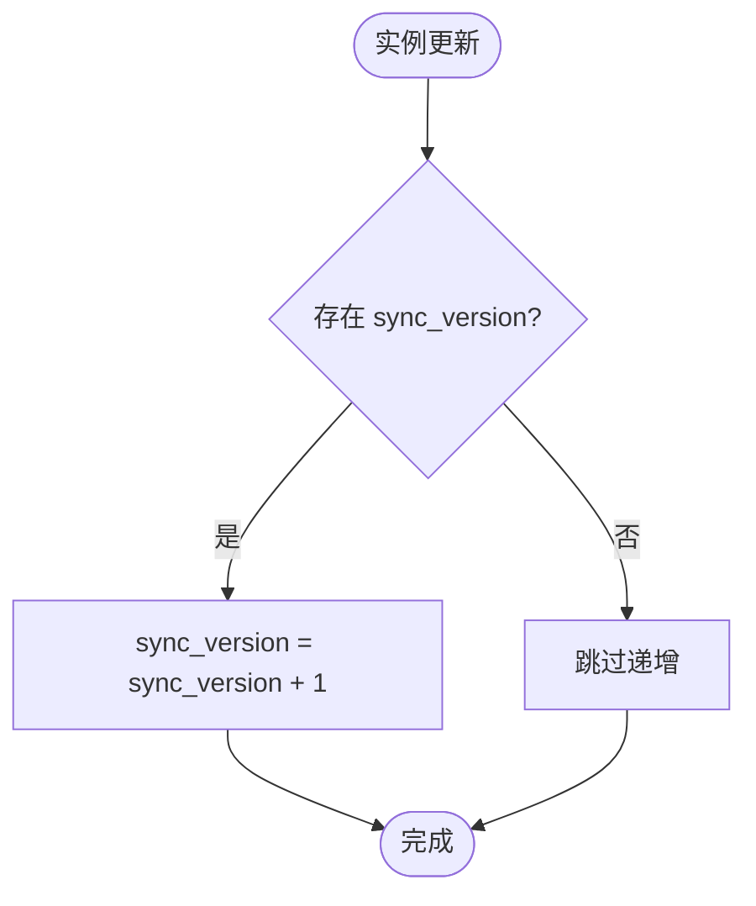

图表来源
- [backend/app/models/base.py:94-106](file://backend/app/models/base.py#L94-L106)

章节来源
- [backend/app/models/base.py:65-185](file://backend/app/models/base.py#L65-L185)

### 用户模型 User
- 身份与角色：username/email/hashed_password/full_name/role/is_active/is_superuser。
- 个人信息：phone(透明加密)/department/position/avatar/gender/birthday/address/remark。
- 组织与数据范围：organization_id(data_scope=all/org/org_children/self)。
- 权限与菜单：permissions(逗号分隔)/allowed_permissions(JSON数组)/allowed_menus(JSON数组)/permission_pack_id。
- 安全与审计：token_version/must_change_password/failed_login_count/locked_until/password_changed_at/last_login/created_at/updated_at。
- 关系：projects/organization/two_factor_auth。
- 便捷属性：org_id/permissions_list/organization_name/allowed_permissions_list/allowed_menus_list/token_version_safe/revoke_all_tokens。

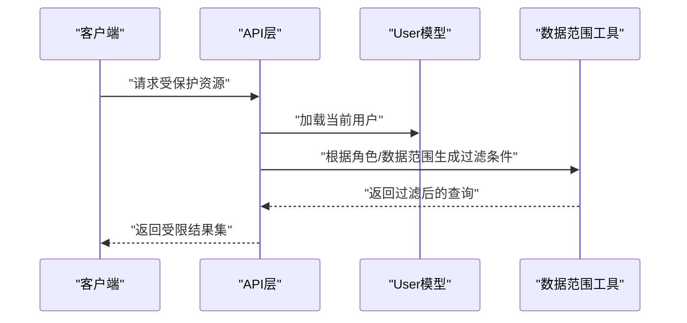

图表来源
- [backend/app/models/user.py:26-152](file://backend/app/models/user.py#L26-L152)
- [backend/app/core/data_permission.py:54-134](file://backend/app/core/data_permission.py#L54-L134)
- [backend/app/core/unified_data_scope.py:56-160](file://backend/app/core/unified_data_scope.py#L56-L160)

章节来源
- [backend/app/models/user.py:26-152](file://backend/app/models/user.py#L26-L152)

### 组织模型 Organization
- 基本信息：name/code/level/type/org_type/sort_order/description/contact_person/contact_email/address。
- 联系信息：contact_phone(透明加密)。
- 区域与状态：region_code/is_active/path/created_by/updated_by。
- 树形结构：parent_id 自引用，children/backref 支持层级遍历。
- 关系：funds。

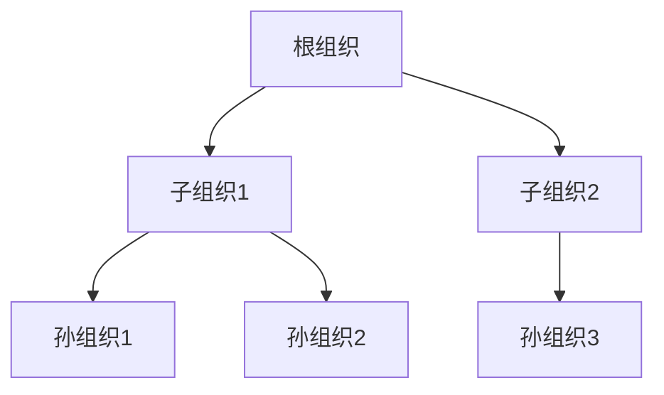

图表来源
- [backend/app/models/organization.py:31-78](file://backend/app/models/organization.py#L31-L78)

章节来源
- [backend/app/models/organization.py:31-78](file://backend/app/models/organization.py#L31-L78)

### RBAC 权限模型
- 角色：RbacRole(name/description/is_system/is_active/priority/时间戳)。
- 用户-角色：UserRole(user_id/role_id/granted_by/expires_at/时间戳)。
- 角色-权限：RolePermission(role_id/permission/时间戳)。
- 用户直接权限：UserPermission(user_id/permission/granted_by/expires_at/时间戳)。
- 资源访问控制：ResourceAccessControl(user_id/resource_type/resource_id/access_level/granted_by/expires_at/时间戳)。
- 访问日志：AccessLog(user_id/action/resource_type/resource_id/access_granted/reason/ip/user_agent/时间戳)。
- 机器码功能权限：MachineCodePermission(machine_code_id/permission/granted_by/expires_at/时间戳)。

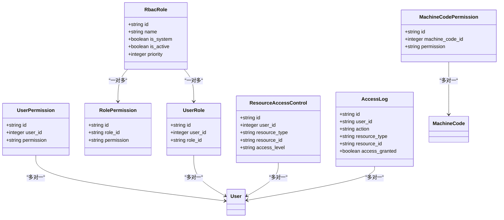

图表来源
- [backend/app/models/rbac.py:31-263](file://backend/app/models/rbac.py#L31-L263)

章节来源
- [backend/app/models/rbac.py:31-263](file://backend/app/models/rbac.py#L31-L263)

### 用户-组织关联 UserOrganization
- 支持用户属于多个组织，并在不同组织中拥有不同角色（admin/member/viewer）。
- 唯一约束：同一用户在同一组织仅一条记录。
- 索引：user_id、organization_id 复合与单列索引。

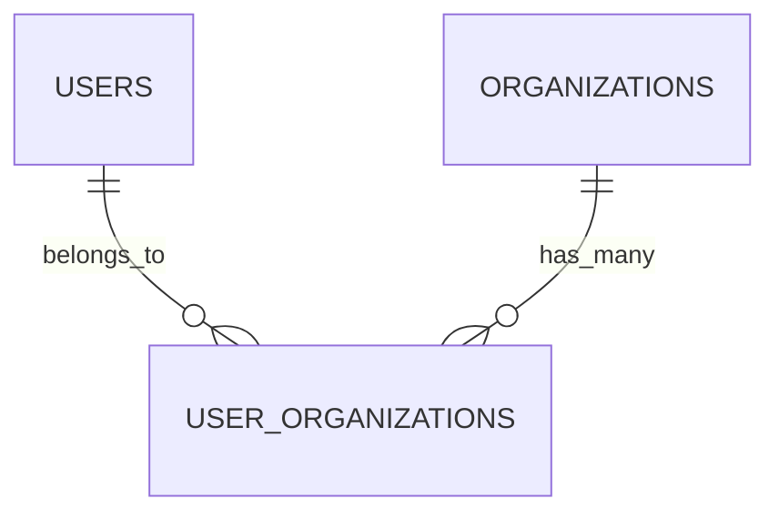

图表来源
- [backend/app/models/user_organization.py:21-69](file://backend/app/models/user_organization.py#L21-L69)

章节来源
- [backend/app/models/user_organization.py:21-69](file://backend/app/models/user_organization.py#L21-L69)

### 权限包 PermissionPack
- 用途：预定义一组菜单 key，批量绑定给普通用户，用于菜单可见性控制。
- 解析优先级：用户级 allowed_menus > 绑定的启用中权限包 > 角色默认菜单。
- 字段：name/description/menu_keys(is_active)/created_by/时间戳。

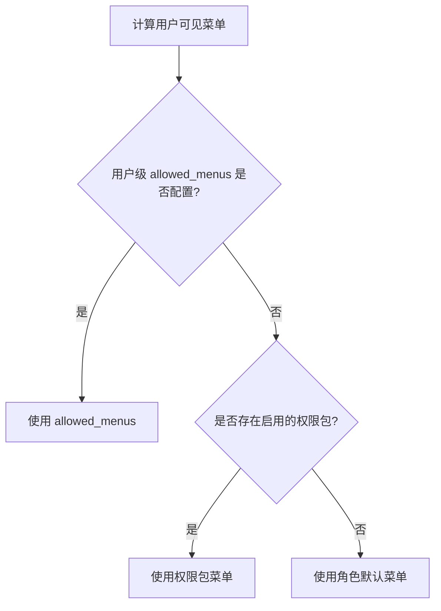

图表来源
- [backend/app/models/permission_pack.py:16-47](file://backend/app/models/permission_pack.py#L16-L47)
- [backend/app/models/user.py:71-77](file://backend/app/models/user.py#L71-L77)

章节来源
- [backend/app/models/permission_pack.py:16-47](file://backend/app/models/permission_pack.py#L16-L47)
- [backend/app/models/user.py:71-77](file://backend/app/models/user.py#L71-L77)

### 数据范围控制（Data Scope）
- 基于角色的数据范围：all/own_dept/own，通过 get_data_scope 判定。
- 查询过滤：apply_scope_to_query 将范围转换为 SQL 过滤条件。
- 记录访问检查：check_record_access 判断单个记录是否可访问。
- 统一入口：unified_data_scope.py 整合两套数据范围机制（角色型与组织树型），对外暴露一致接口。

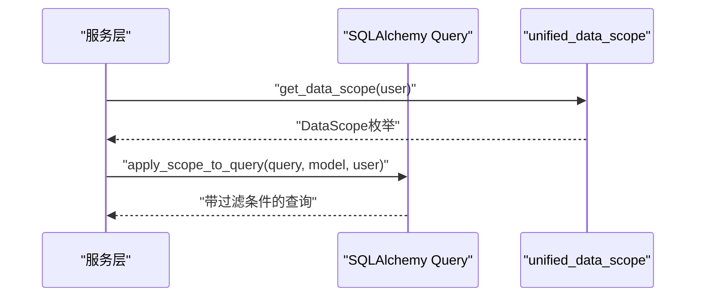

图表来源
- [backend/app/core/unified_data_scope.py:56-160](file://backend/app/core/unified_data_scope.py#L56-L160)
- [backend/app/core/data_permission.py:54-134](file://backend/app/core/data_permission.py#L54-L134)

章节来源
- [backend/app/core/unified_data_scope.py:56-160](file://backend/app/core/unified_data_scope.py#L56-L160)
- [backend/app/core/data_permission.py:54-134](file://backend/app/core/data_permission.py#L54-L134)

### 模型间的关联关系
- 用户与组织：
  - 直接归属：User.organization_id → Organization.id。
  - 多对多：UserOrganization(user_id, organization_id)，支持在不同组织中的不同角色。
- 角色与权限：
  - 角色-权限：RolePermission(role_id, permission)。
  - 用户直接权限：UserPermission(user_id, permission)。
  - 用户-角色：UserRole(user_id, role_id)。
- 组织层级：Organization.parent_id 自引用，children 关系支持树形遍历。

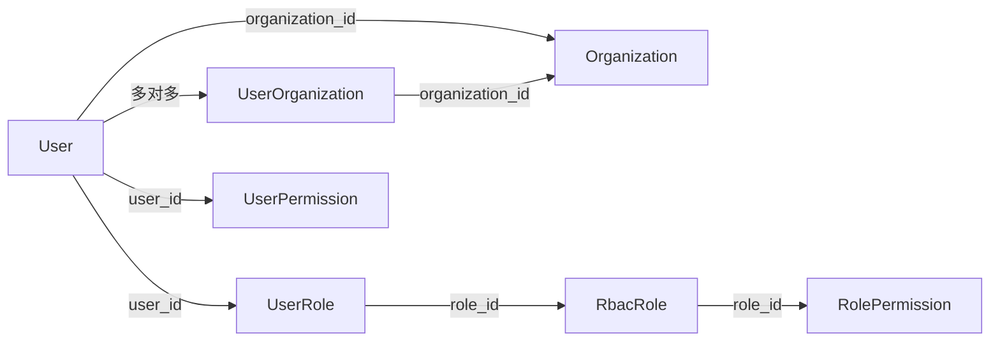

图表来源
- [backend/app/models/user.py:26-90](file://backend/app/models/user.py#L26-L90)
- [backend/app/models/organization.py:31-78](file://backend/app/models/organization.py#L31-L78)
- [backend/app/models/rbac.py:31-160](file://backend/app/models/rbac.py#L31-L160)
- [backend/app/models/user_organization.py:21-69](file://backend/app/models/user_organization.py#L21-L69)

章节来源
- [backend/app/models/user.py:26-90](file://backend/app/models/user.py#L26-L90)
- [backend/app/models/organization.py:31-78](file://backend/app/models/organization.py#L31-L78)
- [backend/app/models/rbac.py:31-160](file://backend/app/models/rbac.py#L31-L160)
- [backend/app/models/user_organization.py:21-69](file://backend/app/models/user_organization.py#L21-L69)

### 模型验证规则与约束
- 字段级校验规则：ValidationRule 支持 required/positive/non_negative/date_format/file_type/max_length/min_length/range/regex/cross_field/enum_values 等规则类型，配合 params JSON 参数与 error_message。
- 模型约束：
  - 唯一性：如 users.username、organizations.code、rbac_roles.name 等。
  - 外键约束：如 User.organization_id → Organizations.id、UserRole.user_id/role_id 等。
  - 默认值：如 role="user"、is_active=True、sort_order=0、menu_keys="[]" 等。
  - 敏感字段加密：EncryptedText 用于 phone、contact_phone 等 PII 字段。

章节来源
- [backend/app/models/validation_rule.py:15-55](file://backend/app/models/validation_rule.py#L15-L55)
- [backend/app/models/user.py:31-85](file://backend/app/models/user.py#L31-L85)
- [backend/app/models/organization.py:36-66](file://backend/app/models/organization.py#L36-L66)
- [backend/app/models/rbac.py:35-160](file://backend/app/models/rbac.py#L35-L160)
- [backend/app/models/permission_pack.py:21-33](file://backend/app/models/permission_pack.py#L21-L33)
- [backend/app/models/base.py:23-46](file://backend/app/models/base.py#L23-L46)

## 依赖关系分析
- 模块内依赖：
  - base.py 为所有模型提供基础能力。
  - user.py 引用 base、two_factor_auth、organization、permission_pack。
  - rbac.py 引用 base、machine_code。
  - user_organization.py 引用 base。
  - permission_pack.py 引用 base。
- 跨模块依赖：
  - data_permission.py 与 unified_data_scope.py 依赖 permission_utils/constants/security 等核心工具。
  - database_indexes.py 在应用启动时校验并补建索引。

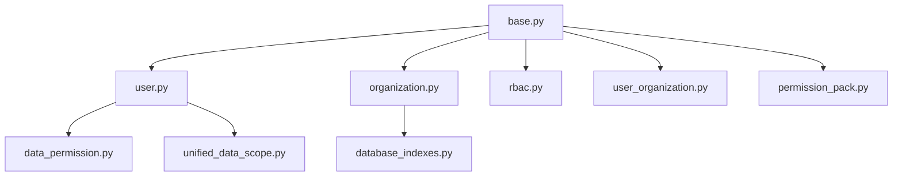

图表来源
- [backend/app/models/base.py:158-185](file://backend/app/models/base.py#L158-L185)
- [backend/app/models/user.py:26-90](file://backend/app/models/user.py#L26-L90)
- [backend/app/models/organization.py:31-78](file://backend/app/models/organization.py#L31-L78)
- [backend/app/models/rbac.py:31-160](file://backend/app/models/rbac.py#L31-L160)
- [backend/app/models/user_organization.py:21-69](file://backend/app/models/user_organization.py#L21-L69)
- [backend/app/models/permission_pack.py:16-47](file://backend/app/models/permission_pack.py#L16-L47)
- [backend/app/core/data_permission.py:20-187](file://backend/app/core/data_permission.py#L20-L187)
- [backend/app/core/unified_data_scope.py:43-343](file://backend/app/core/unified_data_scope.py#L43-L343)
- [backend/app/core/database_indexes.py:18-148](file://backend/app/core/database_indexes.py#L18-L148)

章节来源
- [backend/app/models/base.py:158-185](file://backend/app/models/base.py#L158-L185)
- [backend/app/models/user.py:26-90](file://backend/app/models/user.py#L26-L90)
- [backend/app/models/organization.py:31-78](file://backend/app/models/organization.py#L31-L78)
- [backend/app/models/rbac.py:31-160](file://backend/app/models/rbac.py#L31-L160)
- [backend/app/models/user_organization.py:21-69](file://backend/app/models/user_organization.py#L21-L69)
- [backend/app/models/permission_pack.py:16-47](file://backend/app/models/permission_pack.py#L16-L47)
- [backend/app/core/data_permission.py:20-187](file://backend/app/core/data_permission.py#L20-L187)
- [backend/app/core/unified_data_scope.py:43-343](file://backend/app/core/unified_data_scope.py#L43-L343)
- [backend/app/core/database_indexes.py:18-148](file://backend/app/core/database_indexes.py#L18-L148)

## 性能考虑
- 索引策略：
  - 模型 __table_args__ 中声明常用查询列的索引（如 users.role+is_active、organizations.parent_id、organizations.org_type 等）。
  - 运行时索引管理：database_indexes.py 在启动时校验并补建关键索引（FK 列、状态/日期列、审计日志列等），避免全表扫描。
- 查询优化：
  - 使用 apply_scope_to_query/filter_by_data_scope 将数据范围限制下推到 SQL 层，减少不必要的数据传输。
  - 利用 sync_version 进行增量同步，降低全量拉取开销。
- 并发与一致性：
  - 使用 version 字段实现乐观锁，避免写冲突。
  - EncryptedText 透明加解密，保证敏感字段安全的同时不影响查询语义。
- 组织树遍历：
  - unified_data_scope.py 中 _get_org_subtree 限制最大深度，防止循环引用导致的无限递归。

章节来源
- [backend/app/models/user.py:31-35](file://backend/app/models/user.py#L31-L35)
- [backend/app/models/organization.py:36-43](file://backend/app/models/organization.py#L36-L43)
- [backend/app/core/database_indexes.py:18-95](file://backend/app/core/database_indexes.py#L18-L95)
- [backend/app/core/unified_data_scope.py:245-276](file://backend/app/core/unified_data_scope.py#L245-L276)
- [backend/app/models/base.py:85-106](file://backend/app/models/base.py#L85-L106)
- [backend/app/models/base.py:23-46](file://backend/app/models/base.py#L23-L46)

## 故障排查指南
- 数据范围异常：
  - 确认用户 role 与 data_scope 是否正确设置；super_admin/admin 分别对应 all/own_dept，普通用户为 own。
  - 若模型缺少 owner/部门字段，数据范围会 fail-closed（返回空集），需补充字段或调整逻辑。
- 权限包与菜单：
  - 检查 allowed_menus 是否为 null/空数组/非法 JSON；权限包是否启用且包含所需菜单 key。
- 软删除与恢复：
  - 使用 soft_delete(deleted_by=user.id) 记录审计；restore() 清除审计字段。
- 索引缺失导致慢查询：
  - 启动时调用 create_indexes 补建索引；检查 EXTRA_INDEXES 列表是否覆盖高频查询列。

章节来源
- [backend/app/core/data_permission.py:110-134](file://backend/app/core/data_permission.py#L110-L134)
- [backend/app/core/unified_data_scope.py:297-343](file://backend/app/core/unified_data_scope.py#L297-L343)
- [backend/app/models/permission_pack.py:35-43](file://backend/app/models/permission_pack.py#L35-L43)
- [backend/app/models/base.py:108-148](file://backend/app/models/base.py#L108-L148)
- [backend/app/core/database_indexes.py:59-95](file://backend/app/core/database_indexes.py#L59-L95)

## 结论
本系统通过 BaseModel 提供统一的基类能力，结合 User、Organization、RBAC、PermissionPack 等核心模型，构建了灵活且可扩展的用户-组织-权限体系。数据范围控制与菜单权限管理贯穿查询与展示层，确保数据安全与最小权限原则。通过索引管理与查询优化策略，系统在复杂查询场景下具备良好的性能表现。建议在实际使用中严格遵循数据范围与权限包的配置规范，并结合 ValidationRule 进行字段级校验，以保障数据质量与安全。

## 附录
- 术语说明：
  - 数据范围：all（全部）、own_dept（本部门）、own（本人）。
  - 权限包：预定义的菜单 key 集合，用于批量控制用户可见菜单。
  - 软删除：不物理删除记录，而是标记 is_deleted 并记录 deleted_at/deleted_by。
- 参考路径：
  - 基类与混入：[backend/app/models/base.py](file://backend/app/models/base.py)
  - 用户模型：[backend/app/models/user.py](file://backend/app/models/user.py)
  - 组织模型：[backend/app/models/organization.py](file://backend/app/models/organization.py)
  - RBAC 模型：[backend/app/models/rbac.py](file://backend/app/models/rbac.py)
  - 用户-组织关联：[backend/app/models/user_organization.py](file://backend/app/models/user_organization.py)
  - 权限包：[backend/app/models/permission_pack.py](file://backend/app/models/permission_pack.py)
  - 数据范围：[backend/app/core/data_permission.py](file://backend/app/core/data_permission.py)、[backend/app/core/unified_data_scope.py](file://backend/app/core/unified_data_scope.py)
  - 校验规则：[backend/app/models/validation_rule.py](file://backend/app/models/validation_rule.py)
  - 索引管理：[backend/app/core/database_indexes.py](file://backend/app/core/database_indexes.py)