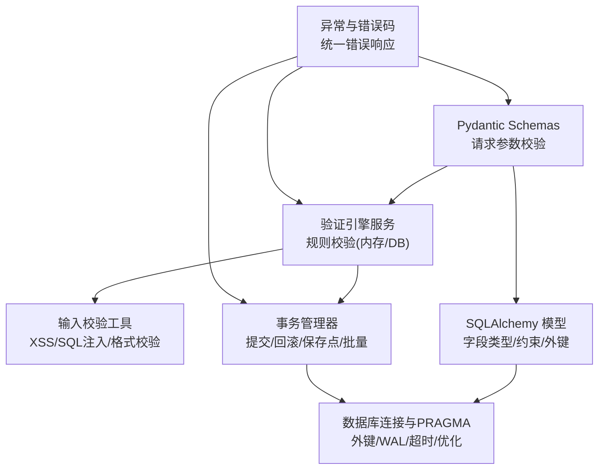
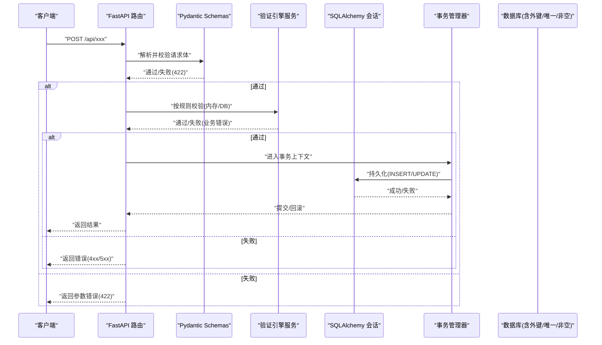
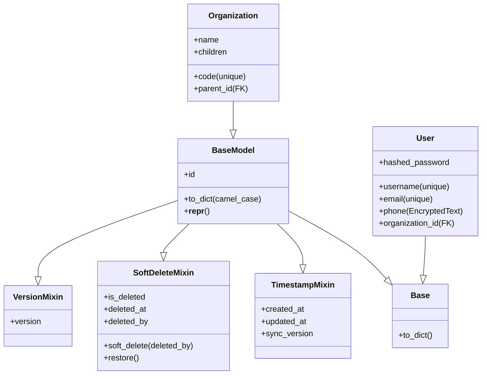
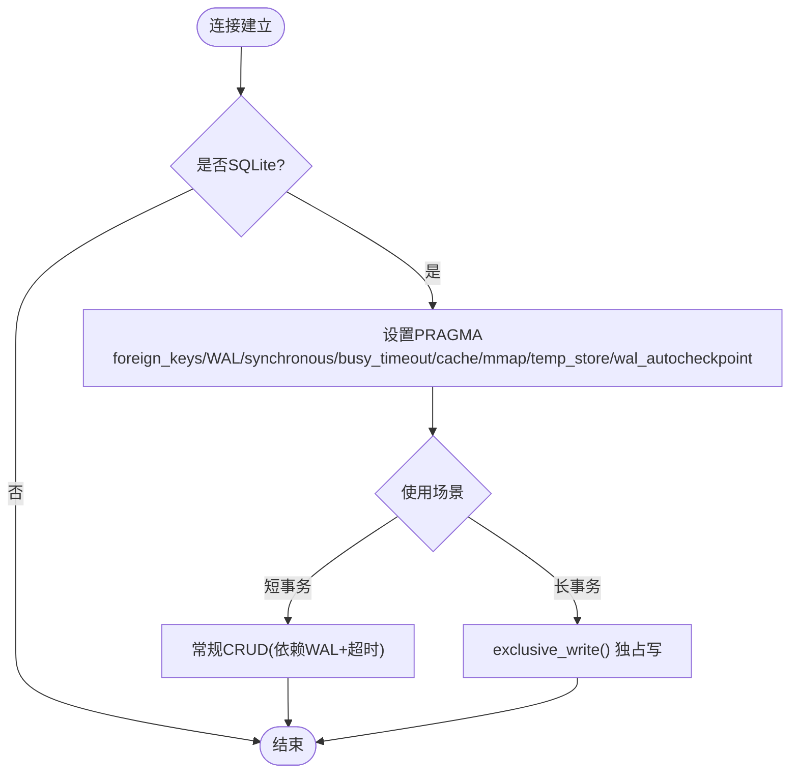
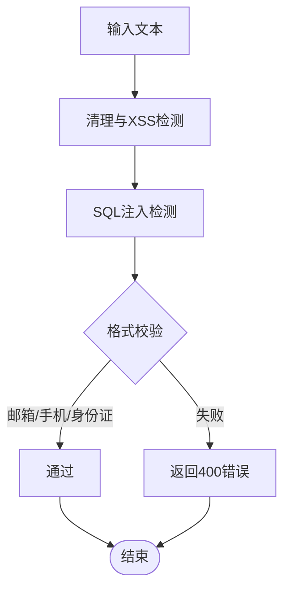
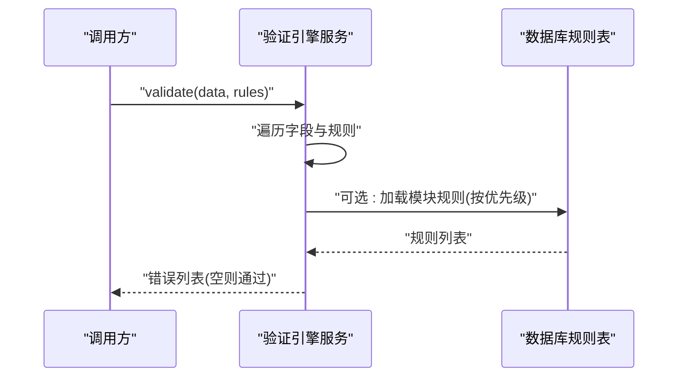
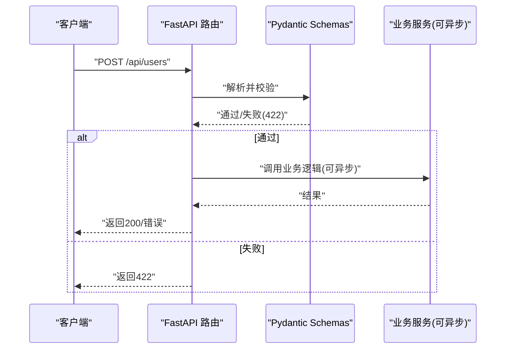
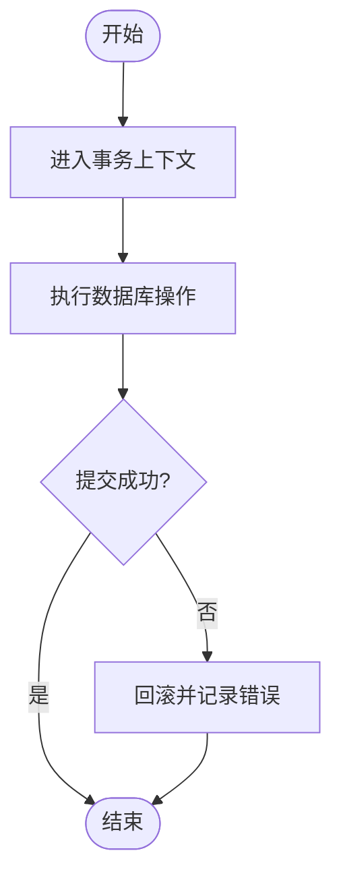
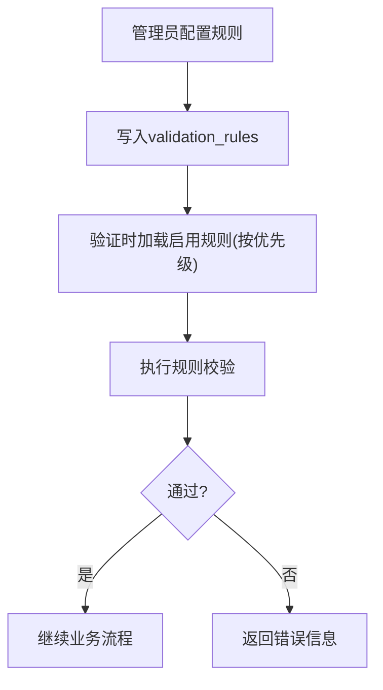
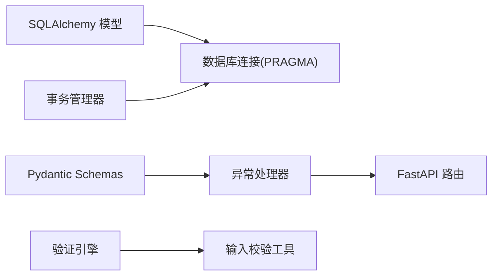

# 验证与约束

<cite>
**本文引用的文件**
- [backend/app/models/base.py](file://backend/app/models/base.py)
- [backend/app/core/database.py](file://backend/app/core/database.py)
- [backend/app/services/validation_engine_service.py](file://backend/app/services/validation_engine_service.py)
- [backend/app/models/validation_rule.py](file://backend/app/models/validation_rule.py)
- [backend/app/utils/input_validator.py](file://backend/app/utils/input_validator.py)
- [backend/app/core/transaction.py](file://backend/app/core/transaction.py)
- [backend/app/core/errors.py](file://backend/app/core/errors.py)
- [backend/app/core/exceptions.py](file://backend/app/core/exceptions.py)
- [backend/app/models/user.py](file://backend/app/models/user.py)
- [backend/app/models/organization.py](file://backend/app/models/organization.py)
- [backend/app/schemas/user.py](file://backend/app/schemas/user.py)
- [backend/app/schemas/organization.py](file://backend/app/schemas/organization.py)
</cite>

## 目录
1. [简介](#简介)
2. [项目结构](#项目结构)
3. [核心组件](#核心组件)
4. [架构总览](#架构总览)
5. [详细组件分析](#详细组件分析)
6. [依赖关系分析](#依赖关系分析)
7. [性能考虑](#性能考虑)
8. [故障排除指南](#故障排除指南)
9. [结论](#结论)
10. [附录](#附录)

## 简介
本文件聚焦于系统的数据验证与约束体系，覆盖以下方面：
- SQLAlchemy 模型中的字段类型、格式校验、业务规则约束（唯一性、非空、检查、外键等）
- Pydantic Schema 层的前置校验与错误统一处理
- 可配置验证引擎（从数据库加载规则并执行）
- 事务与原子操作、并发控制策略（SQLite 场景下的 WAL、独占写协调器、死锁重试）
- 动态验证规则管理（配置驱动、规则热更新）
- 验证性能优化（缓存、批量、异步）
- 常见问题调试与排障

## 项目结构
围绕“验证与约束”的关键代码分布在如下模块：
- 数据模型与基类：定义字段类型、约束、加密列、软删除、乐观锁等
- 数据库连接与 SQLite 调优：开启外键约束、WAL、内存映射、超时与自动优化
- 输入校验工具：XSS/SQL注入防护、邮箱/手机/身份证/文件大小等格式校验
- 验证引擎服务：基于规则字典或数据库规则进行字段级校验
- 事务管理器：上下文事务、保存点、批量操作、死锁重试
- 异常与错误码：统一的异常类型、HTTP 异常处理器、错误码映射
- Pydantic Schemas：API 入参/出参的强类型校验与文档生成

图表来源
- [backend/app/schemas/user.py:1-53](file://backend/app/schemas/user.py#L1-L53)
- [backend/app/services/validation_engine_service.py:1-217](file://backend/app/services/validation_engine_service.py#L1-L217)
- [backend/app/utils/input_validator.py:1-124](file://backend/app/utils/input_validator.py#L1-L124)
- [backend/app/models/base.py:1-185](file://backend/app/models/base.py#L1-L185)
- [backend/app/core/database.py:1-343](file://backend/app/core/database.py#L1-L343)
- [backend/app/core/transaction.py:1-457](file://backend/app/core/transaction.py#L1-L457)
- [backend/app/core/exceptions.py:1-145](file://backend/app/core/exceptions.py#L1-L145)
- [backend/app/core/errors.py:1-176](file://backend/app/core/errors.py#L1-L176)

章节来源
- [backend/app/models/base.py:1-185](file://backend/app/models/base.py#L1-L185)
- [backend/app/core/database.py:1-343](file://backend/app/core/database.py#L1-L343)
- [backend/app/services/validation_engine_service.py:1-217](file://backend/app/services/validation_engine_service.py#L1-L217)
- [backend/app/models/validation_rule.py:1-55](file://backend/app/models/validation_rule.py#L1-L55)
- [backend/app/utils/input_validator.py:1-124](file://backend/app/utils/input_validator.py#L1-L124)
- [backend/app/core/transaction.py:1-457](file://backend/app/core/transaction.py#L1-L457)
- [backend/app/core/errors.py:1-176](file://backend/app/core/errors.py#L1-L176)
- [backend/app/core/exceptions.py:1-145](file://backend/app/core/exceptions.py#L1-L145)
- [backend/app/models/user.py:1-152](file://backend/app/models/user.py#L1-L152)
- [backend/app/models/organization.py:1-78](file://backend/app/models/organization.py#L1-L78)
- [backend/app/schemas/user.py:1-53](file://backend/app/schemas/user.py#L1-L53)
- [backend/app/schemas/organization.py:1-100](file://backend/app/schemas/organization.py#L1-L100)

## 核心组件
- 模型基类与混入：提供时间戳、软删除、乐观锁、PII 透明加密列等通用能力
- 数据库连接与 PRAGMA：强制外键约束、WAL、同步模式、超时、内存映射、自动优化
- 输入校验工具：XSS/SQL注入防护、邮箱/手机/身份证/文件扩展名/大小/数值范围/必填字段
- 验证引擎服务：支持内存规则与数据库规则两种模式，涵盖 required/range/regex/enum/length/positive/non_negative 等
- 事务管理器：上下文事务、保存点、批量插入/更新/删除、死锁重试装饰器
- 异常与错误码：AppError、BusinessError、ValidationError、DatabaseError 及全局异常处理器
- Pydantic Schemas：字段长度、必填、可选、枚举等强类型校验，配合 FastAPI 自动生成文档

章节来源
- [backend/app/models/base.py:1-185](file://backend/app/models/base.py#L1-L185)
- [backend/app/core/database.py:1-343](file://backend/app/core/database.py#L1-L343)
- [backend/app/utils/input_validator.py:1-124](file://backend/app/utils/input_validator.py#L1-L124)
- [backend/app/services/validation_engine_service.py:1-217](file://backend/app/services/validation_engine_service.py#L1-L217)
- [backend/app/core/transaction.py:1-457](file://backend/app/core/transaction.py#L1-L457)
- [backend/app/core/exceptions.py:1-145](file://backend/app/core/exceptions.py#L1-L145)
- [backend/app/core/errors.py:1-176](file://backend/app/core/errors.py#L1-L176)
- [backend/app/schemas/user.py:1-53](file://backend/app/schemas/user.py#L1-L53)
- [backend/app/schemas/organization.py:1-100](file://backend/app/schemas/organization.py#L1-L100)

## 架构总览
下图展示了从请求到落库的完整验证与约束链路，包括前端入参校验、规则引擎校验、数据库约束与事务保障。

图表来源
- [backend/app/core/exceptions.py:121-145](file://backend/app/core/exceptions.py#L121-L145)
- [backend/app/services/validation_engine_service.py:38-123](file://backend/app/services/validation_engine_service.py#L38-L123)
- [backend/app/core/transaction.py:31-197](file://backend/app/core/transaction.py#L31-L197)
- [backend/app/core/database.py:78-157](file://backend/app/core/database.py#L78-L157)

## 详细组件分析

### SQLAlchemy 模型验证与约束
- 字段类型与默认值：使用 String/Integer/Boolean/DateTime/Text 等类型，结合 default/server_default 保证初始值
- 非空约束：通过 nullable=False 在模型层强制
- 唯一性约束：通过 unique=True 实现（如用户名、邮箱、组织编码）
- 外键约束：通过 ForeignKey 建立关联，并设置 ondelete 行为（CASCADE/SET NULL）
- 检查约束：可通过 Column 的 check 或数据库 CHECK 约束实现；当前仓库更多依赖应用层校验与数据库外键/唯一约束
- PII 透明加密：EncryptedText 类型在写入时加密、读取时解密，保证敏感字段安全存储
- 软删除与乐观锁：SoftDeleteMixin 提供 is_deleted/deleted_at/deleted_by 与便捷方法；VersionMixin 提供 version 字段用于并发控制
- 时间戳：TimestampMixin 提供 created_at/updated_at，并在更新时自动递增 sync_version 以支持增量同步

图表来源
- [backend/app/models/base.py:19-185](file://backend/app/models/base.py#L19-L185)
- [backend/app/models/user.py:26-85](file://backend/app/models/user.py#L26-L85)
- [backend/app/models/organization.py:31-78](file://backend/app/models/organization.py#L31-L78)

章节来源
- [backend/app/models/base.py:19-185](file://backend/app/models/base.py#L19-L185)
- [backend/app/models/user.py:26-85](file://backend/app/models/user.py#L26-L85)
- [backend/app/models/organization.py:31-78](file://backend/app/models/organization.py#L31-L78)

### 数据库连接与约束生效
- 强制外键约束：连接建立时执行 PRAGMA foreign_keys=ON，确保 SQLite 下外键约束生效
- WAL 模式与同步策略：journal_mode=WAL、synchronous=NORMAL，兼顾并发读写与写入性能
- 超时与缓存：busy_timeout=10000ms，cache_size/mmap_size 可调，temp_store=MEMORY，wal_autocheckpoint=1000
- 自动优化：连接关闭时执行 PRAGMA optimize，帮助查询计划优化
- 长事务独占写协调器：针对大批量导入/更新场景，提供 exclusive_write 上下文管理器避免 SQLITE_BUSY

图表来源
- [backend/app/core/database.py:78-157](file://backend/app/core/database.py#L78-L157)
- [backend/app/core/database.py:198-289](file://backend/app/core/database.py#L198-L289)

章节来源
- [backend/app/core/database.py:78-157](file://backend/app/core/database.py#L78-L157)
- [backend/app/core/database.py:198-289](file://backend/app/core/database.py#L198-L289)

### 输入校验与格式验证
- XSS/SQL注入防护：对输入文本进行模式匹配与转义，发现风险直接返回 400
- 格式校验：邮箱、手机号、身份证号、文件扩展名、文件大小、数值范围、必填字段
- 集成方式：可在业务逻辑中直接调用 InputValidator 静态方法，或在验证引擎中复用

图表来源
- [backend/app/utils/input_validator.py:31-124](file://backend/app/utils/input_validator.py#L31-L124)

章节来源
- [backend/app/utils/input_validator.py:31-124](file://backend/app/utils/input_validator.py#L31-L124)

### 验证引擎服务（规则驱动）
- 内存规则：支持 required/range/regex/enum/min_length/max_length 等规则字典校验
- 数据库规则：从 validation_rules 表加载启用规则，按优先级排序执行，支持正数、非负数、正则、枚举、长度等
- 自定义验证器：提供 register_validator/add_rule 机制，可扩展新的规则类型
- 错误收集：累积所有字段错误，便于一次性反馈

图表来源
- [backend/app/services/validation_engine_service.py:38-123](file://backend/app/services/validation_engine_service.py#L38-L123)
- [backend/app/models/validation_rule.py:15-55](file://backend/app/models/validation_rule.py#L15-L55)

章节来源
- [backend/app/services/validation_engine_service.py:38-123](file://backend/app/services/validation_engine_service.py#L38-L123)
- [backend/app/models/validation_rule.py:15-55](file://backend/app/models/validation_rule.py#L15-L55)

### Pydantic 模型集成与异步/批量验证
- Pydantic 校验：在 FastAPI 路由层通过 Pydantic Model 进行强类型校验，缺失/越界/类型不符将返回 422
- 异步验证：Pydantic 校验本身为同步，但可在异步路由中调用；复杂规则可封装为异步函数并通过任务队列执行
- 批量验证：可对列表型入参逐项校验，或使用验证引擎批量处理；结合事务与批量操作提升吞吐

图表来源
- [backend/app/core/exceptions.py:121-145](file://backend/app/core/exceptions.py#L121-L145)
- [backend/app/schemas/user.py:9-35](file://backend/app/schemas/user.py#L9-L35)
- [backend/app/schemas/organization.py:9-47](file://backend/app/schemas/organization.py#L9-L47)

章节来源
- [backend/app/core/exceptions.py:121-145](file://backend/app/core/exceptions.py#L121-L145)
- [backend/app/schemas/user.py:9-35](file://backend/app/schemas/user.py#L9-L35)
- [backend/app/schemas/organization.py:9-47](file://backend/app/schemas/organization.py#L9-L47)

### 数据完整性与事务处理
- 事务上下文：提供 transaction/nested_transaction/savepoint 等上下文管理器，异常自动回滚
- 安全提交：safe_commit 封装提交逻辑，失败时回滚并记录日志
- 批量操作：BatchOperation 提供批量插入/更新/删除，分批 flush 与提交，避免内存压力
- 死锁重试：retry_on_deadlock 装饰器对包含 deadlock/lock 的异常进行有限次重试
- 隔离级别：在非 SQLite 环境下可设置事务隔离级别与只读事务

图表来源
- [backend/app/core/transaction.py:31-197](file://backend/app/core/transaction.py#L31-L197)
- [backend/app/core/transaction.py:200-234](file://backend/app/core/transaction.py#L200-L234)
- [backend/app/core/transaction.py:366-457](file://backend/app/core/transaction.py#L366-L457)
- [backend/app/core/transaction.py:322-362](file://backend/app/core/transaction.py#L322-L362)

章节来源
- [backend/app/core/transaction.py:31-197](file://backend/app/core/transaction.py#L31-L197)
- [backend/app/core/transaction.py:200-234](file://backend/app/core/transaction.py#L200-L234)
- [backend/app/core/transaction.py:322-362](file://backend/app/core/transaction.py#L322-L362)
- [backend/app/core/transaction.py:366-457](file://backend/app/core/transaction.py#L366-L457)

### 动态验证规则管理
- 规则模型：validation_rules 表存储模块、字段、规则类型、参数、消息、优先级、启用状态等
- 规则加载：验证引擎按 module 与 is_active 过滤，按 priority 降序执行
- 热更新：修改规则后无需重启服务，下次验证即生效（建议结合缓存失效策略）
- 扩展性：支持新增 rule_type 并在 _check_typed_rule 中实现对应逻辑

图表来源
- [backend/app/models/validation_rule.py:15-55](file://backend/app/models/validation_rule.py#L15-L55)
- [backend/app/services/validation_engine_service.py:93-123](file://backend/app/services/validation_engine_service.py#L93-L123)

章节来源
- [backend/app/models/validation_rule.py:15-55](file://backend/app/models/validation_rule.py#L15-L55)
- [backend/app/services/validation_engine_service.py:93-123](file://backend/app/services/validation_engine_service.py#L93-L123)

## 依赖关系分析
- 模型依赖基类：User/Organization 继承 Base/BaseModel，获得通用字段与能力
- 数据库依赖 PRAGMA：连接事件监听设置外键、WAL、超时、缓存等
- 验证引擎依赖输入校验工具：复用邮箱/手机/身份证/范围等校验
- 事务管理器依赖数据库会话：封装提交/回滚/保存点/批量
- 异常处理器依赖错误码：统一错误响应格式

图表来源
- [backend/app/models/base.py:19-185](file://backend/app/models/base.py#L19-L185)
- [backend/app/core/database.py:78-157](file://backend/app/core/database.py#L78-L157)
- [backend/app/services/validation_engine_service.py:38-123](file://backend/app/services/validation_engine_service.py#L38-L123)
- [backend/app/utils/input_validator.py:31-124](file://backend/app/utils/input_validator.py#L31-L124)
- [backend/app/core/transaction.py:31-197](file://backend/app/core/transaction.py#L31-L197)
- [backend/app/core/exceptions.py:121-145](file://backend/app/core/exceptions.py#L121-L145)

章节来源
- [backend/app/models/base.py:19-185](file://backend/app/models/base.py#L19-L185)
- [backend/app/core/database.py:78-157](file://backend/app/core/database.py#L78-L157)
- [backend/app/services/validation_engine_service.py:38-123](file://backend/app/services/validation_engine_service.py#L38-L123)
- [backend/app/utils/input_validator.py:31-124](file://backend/app/utils/input_validator.py#L31-L124)
- [backend/app/core/transaction.py:31-197](file://backend/app/core/transaction.py#L31-L197)
- [backend/app/core/exceptions.py:121-145](file://backend/app/core/exceptions.py#L121-L145)

## 性能考虑
- 数据库层面
  - WAL 模式与 NORMAL 同步：提升并发写入性能
  - busy_timeout 与自动 checkpoint：降低锁冲突概率
  - cache_size/mmap_size/temp_store：提高内存利用率与 I/O 效率
  - 连接关闭时 optimize：改善查询计划
- 验证层面
  - 规则缓存：对高频模块的规则可引入本地缓存（如内存字典），减少 DB 读取
  - 批量验证：对列表型数据逐条校验，合并错误信息
  - 异步验证：耗时规则（如远程校验）放入后台任务，避免阻塞主流程
- 事务与批量
  - 分批 flush/commit：避免大事务占用过多内存
  - 死锁重试：对偶发冲突进行有限次重试，提高成功率

[本节为通用指导，不直接分析具体文件]

## 故障排除指南
- 参数校验失败（422）
  - 现象：Pydantic 校验未通过，返回 errors 列表
  - 排查：检查请求体字段类型、长度、必填项是否符合 Schema 定义
  - 参考：异常处理器对 PydanticValidationError 的处理
- 业务规则违反（4xx/5xx）
  - 现象：验证引擎或业务逻辑抛出 BusinessError/AppError
  - 排查：查看错误码与消息，定位具体规则或业务条件
  - 参考：错误码定义与异常类型
- 数据库写入失败
  - 现象：提交失败或出现 SQLITE_BUSY/死锁
  - 排查：确认是否处于长事务场景，必要时使用 exclusive_write；检查死锁重试配置
  - 参考：事务管理器与数据库协调器
- 外键约束失败
  - 现象：插入/更新时报外键约束错误
  - 排查：确认关联记录是否存在，ondelete 行为是否符合预期
  - 参考：数据库 PRAGMA 已开启外键约束

章节来源
- [backend/app/core/exceptions.py:121-145](file://backend/app/core/exceptions.py#L121-L145)
- [backend/app/core/errors.py:10-142](file://backend/app/core/errors.py#L10-L142)
- [backend/app/core/database.py:78-157](file://backend/app/core/database.py#L78-L157)
- [backend/app/core/database.py:198-289](file://backend/app/core/database.py#L198-L289)
- [backend/app/core/transaction.py:322-362](file://backend/app/core/transaction.py#L322-L362)

## 结论
本系统在多层实现了严谨的验证与约束：
- 模型层：字段类型、非空、唯一、外键、软删除、乐观锁、PII 加密
- 连接层：强制外键、WAL、超时与缓存优化，保障一致性与性能
- 应用层：Pydantic 强类型校验 + 规则引擎（内存/数据库）+ 输入安全校验
- 事务层：上下文事务、保存点、批量操作、死锁重试，确保原子性与健壮性
- 动态规则：可配置、可热更新，满足业务快速变化需求
- 性能：缓存、批量、异步策略，兼顾吞吐与延迟

[本节为总结，不直接分析具体文件]

## 附录
- 常见规则示例（来自验证引擎与输入校验工具）
  - required：必填字段
  - range：数值范围
  - regex：正则表达式
  - enum：枚举值
  - length：字符串长度
  - positive/non_negative：正数/非负数
  - email/phone/id_card：格式校验
  - file_extension/file_size：文件限制
- 事务最佳实践
  - 使用上下文事务包裹多步操作
  - 大事务拆分为批次，定期 flush/commit
  - 对可能冲突的操作使用死锁重试
- 动态规则最佳实践
  - 合理设置优先级，避免规则冲突
  - 对高频规则引入缓存，注意失效策略
  - 规则变更需记录审计信息（created_by/updated_at）

[本节为补充说明，不直接分析具体文件]