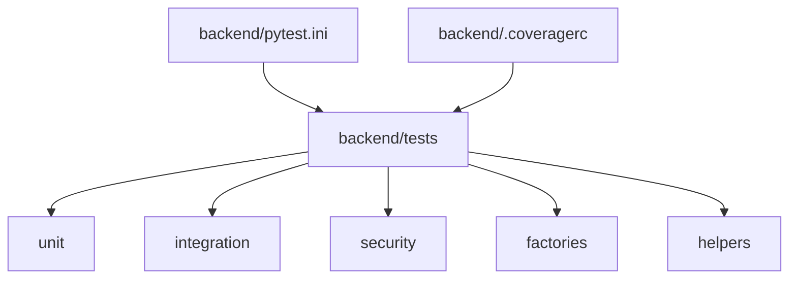
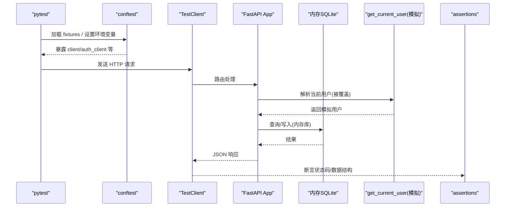
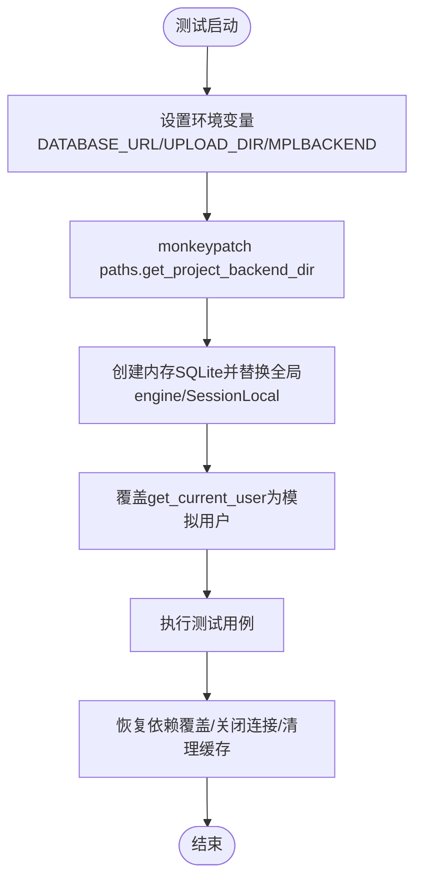
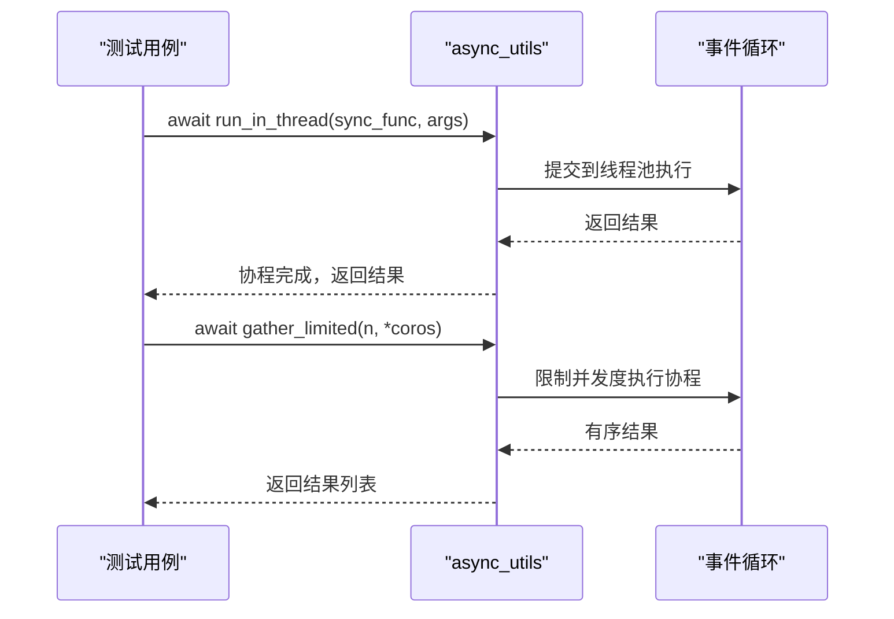
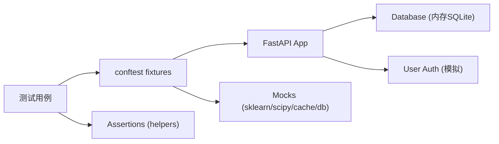

# 单元测试

<cite>
**本文引用的文件**
- [pytest.ini](file://backend/pytest.ini)
- [conftest.py](file://backend/tests/conftest.py)
- [unit/conftest.py](file://backend/tests/unit/conftest.py)
- [factories/__init__.py](file://backend/tests/factories/__init__.py)
- [factories/user_factory.py](file://backend/tests/factories/user_factory.py)
- [helpers/assertions.py](file://backend/tests/helpers/assertions.py)
- [test_core.py](file://backend/tests/unit/test_core.py)
- [test_async_utils.py](file://backend/tests/unit/test_async_utils.py)
- [test_api_error.py](file://backend/tests/unit/test_api_error.py)
- [test_common_utils.py](file://backend/tests/unit/test_common_utils.py)
- [.coveragerc](file://backend/.coveragerc)
</cite>

## 目录
1. [简介](#简介)
2. [项目结构](#项目结构)
3. [核心组件](#核心组件)
4. [架构总览](#架构总览)
5. [详细组件分析](#详细组件分析)
6. [依赖关系分析](#依赖关系分析)
7. [性能考虑](#性能考虑)
8. [故障排查指南](#故障排查指南)
9. [结论](#结论)
10. [附录](#附录)

## 简介
本章节面向后端 Python 项目的单元测试体系，围绕 pytest 框架的使用、测试夹具（Fixture）、Mock 隔离、异步代码测试、覆盖率收集与报告，以及基于工厂模式与辅助断言工具的高质量测试套件构建方法，提供系统化说明与实践建议。内容严格基于仓库中现有测试配置与实现进行归纳，避免臆测。

## 项目结构
后端测试位于 backend/tests 下，按类型划分为 unit、integration、security 等子目录；测试公共配置集中在 conftest.py，单元测试额外在 unit/conftest.py 中屏蔽重型可选依赖并处理平台差异。工厂数据生成器位于 tests/factories，统一封装模型实例的构造与入库；通用断言与响应校验工具位于 tests/helpers。

图表来源
- [pytest.ini:1-39](file://backend/pytest.ini#L1-L39)
- [.coveragerc:1-18](file://backend/.coveragerc#L1-L18)

章节来源
- [pytest.ini:1-39](file://backend/pytest.ini#L1-L39)
- [conftest.py:1-737](file://backend/tests/conftest.py#L1-L737)
- [unit/conftest.py:1-67](file://backend/tests/unit/conftest.py#L1-L67)

## 核心组件
- pytest 配置与标记：定义测试路径、命名约定、标记（unit/integration/security 等）与异步模式。
- 全局测试环境隔离：通过环境变量与 monkeypatch 将数据库、上传目录、应用数据根目录重定向到内存或临时目录，确保测试互不干扰。
- FastAPI 测试客户端：内置 TestClient，注入内存数据库会话，覆盖 get_db 依赖，支持带认证头的请求。
- 用户与权限夹具：提供 admin/user/operator 等模拟用户与对应请求头，便于权限类用例快速构造。
- 工厂模式：集中生成领域对象（用户、组织、村庄、项目、资金、审批、学校等），支持 build/create 两种模式。
- 断言助手：统一 Envelope/Bare 响应格式校验、分页校验、数据隔离校验、审计日志校验、加密字段校验等。
- 覆盖率配置：排除不可执行行，聚焦“可覆盖集”的覆盖率目标。

章节来源
- [pytest.ini:1-39](file://backend/pytest.ini#L1-L39)
- [conftest.py:62-113](file://backend/tests/conftest.py#L62-L113)
- [conftest.py:157-255](file://backend/tests/conftest.py#L157-L255)
- [conftest.py:258-389](file://backend/tests/conftest.py#L258-L389)
- [conftest.py:392-501](file://backend/tests/conftest.py#L392-L501)
- [conftest.py:561-673](file://backend/tests/conftest.py#L561-L673)
- [factories/__init__.py:1-38](file://backend/tests/factories/__init__.py#L1-L38)
- [factories/user_factory.py:1-86](file://backend/tests/factories/user_factory.py#L1-L86)
- [helpers/assertions.py:1-190](file://backend/tests/helpers/assertions.py#L1-L190)
- [.coveragerc:1-18](file://backend/.coveragerc#L1-L18)

## 架构总览
下图展示测试运行时的关键交互：pytest 收集用例 → 加载 conftest 初始化环境与夹具 → 通过 TestClient 发起请求 → 依赖注入内存数据库与模拟当前用户 → 业务逻辑执行 → 返回响应 → 使用 helpers 断言。

图表来源
- [conftest.py:392-501](file://backend/tests/conftest.py#L392-L501)
- [helpers/assertions.py:9-190](file://backend/tests/helpers/assertions.py#L9-L190)

## 详细组件分析

### pytest 配置与标记
- 测试路径与命名：指定 tests 为测试根目录，识别 test_*.py、Test* 类与 test_* 函数。
- 标记集合：slow、unit、integration、security、approval、e2e、stress、performance、real_backend_dir 等，用于筛选与分组执行。
- 异步模式：开启 asyncio_mode=auto 与默认 fixture 循环作用域，简化协程测试编写。
- 警告过滤：针对第三方弃用与特定场景的 RuntimeWarning 进行精准忽略，避免噪音掩盖真实问题。

章节来源
- [pytest.ini:1-39](file://backend/pytest.ini#L1-L39)

### 测试夹具（Fixture）与环境隔离
- 数据目录隔离：通过 monkeypatch 将 app.utils.paths.get_project_backend_dir 指向临时目录，防止测试写回真实 data/uploads/logs。
- 数据库隔离：创建内存 SQLite 引擎，替换模块级 engine/SessionLocal，保证审计落库链路在测试中可断言。
- 认证隔离：通过 dependency_overrides 覆盖 get_current_user，注入不同角色用户，无需真实登录流程。
- 自动清理：会话级清理遗留 test.db，函数级恢复原始依赖覆盖，避免跨测试污染。
- 平台兼容：在 unit/conftest.py 中跳过 Windows 专属行为测试，保障 CI 稳定性。

图表来源
- [conftest.py:62-113](file://backend/tests/conftest.py#L62-L113)
- [conftest.py:392-501](file://backend/tests/conftest.py#L392-L501)
- [unit/conftest.py:25-67](file://backend/tests/unit/conftest.py#L25-L67)

章节来源
- [conftest.py:62-113](file://backend/tests/conftest.py#L62-L113)
- [conftest.py:392-501](file://backend/tests/conftest.py#L392-L501)
- [unit/conftest.py:1-67](file://backend/tests/unit/conftest.py#L1-L67)

### Mock 对象与外部依赖隔离
- 模拟数据库会话：提供 mock_db fixture，支持 query/filter/all/count/add/refresh/delete/rollback/close 等常用 ORM 操作链式调用。
- 模拟缓存服务：mock_cache fixture 提供 get/set/delete/clear 的默认行为。
- 模拟第三方库：在 unit/conftest.py 中为 sklearn/scipy 等重型可选依赖提供 MagicMock 占位，避免安装负担。
- 环境变量与配置覆盖：通过 monkeypatch 与 settings 属性覆盖，控制生产/开发行为差异（如错误信息是否包含内部详情）。

章节来源
- [conftest.py:157-255](file://backend/tests/conftest.py#L157-L255)
- [conftest.py:561-569](file://backend/tests/conftest.py#L561-L569)
- [unit/conftest.py:1-23](file://backend/tests/unit/conftest.py#L1-L23)
- [test_api_error.py:11-46](file://backend/tests/unit/test_api_error.py#L11-L46)

### 参数化测试与断言语法
- 参数化测试：可使用 pytest.mark.parametrize 对输入输出组合进行批量验证（例如多组用户、多页分页参数）。
- 断言策略：
  - 基础断言：status_code、JSON body 字段存在性与取值。
  - 响应格式：Envelope（code/message/data）与 Bare（total/page/page_size/items）的统一断言。
  - 分页断言：meta.pagination 中的 page/page_size/total 一致性检查。
  - 数据隔离：校验返回项均属于允许的组织范围。
  - 审计日志：根据 user_id/action/entity_type/entity_id 断言记录存在。
  - 加密字段：断言敏感字段非明文。
- 示例参考：
  - 响应断言与分页断言见 helpers/assertions.py。
  - 异常与错误处理断言见 test_api_error.py。
  - 通用工具断言见 test_common_utils.py。

章节来源
- [helpers/assertions.py:9-190](file://backend/tests/helpers/assertions.py#L9-L190)
- [test_api_error.py:1-141](file://backend/tests/unit/test_api_error.py#L1-L141)
- [test_common_utils.py:1-545](file://backend/tests/unit/test_common_utils.py#L1-L545)

### 异步代码测试（asyncio）
- 协程测试：使用 async def 测试函数，配合 @pytest.mark.asyncio 或直接由 pytest 自动发现（已启用 asyncio_mode=auto）。
- 事件循环管理：测试中可直接 await 协程；对于无运行循环的场景，使用 get_event_loop_safe 获取或创建循环。
- 并发与限流：gather_limited 提供有界并发执行，测试可验证顺序与并发度。
- 线程池执行：run_in_thread/run_in_executor 将同步函数放入线程池执行，测试可验证参数传递与返回值。
- 背景任务：create_background_task 在无运行循环时也能正确调度任务。

图表来源
- [test_async_utils.py:42-123](file://backend/tests/unit/test_async_utils.py#L42-L123)
- [test_async_utils.py:138-217](file://backend/tests/unit/test_async_utils.py#L138-L217)

章节来源
- [test_async_utils.py:1-217](file://backend/tests/unit/test_async_utils.py#L1-L217)

### 覆盖率收集与报告
- 覆盖率配置：.coveragerc 中 exclude_lines 排除了 pragma: no cover、TYPE_CHECKING、__main__、abstractmethod、__repr__、NotImplementedError 等不可执行或仅类型检查的行。
- 报告口径：以“可覆盖集”的 100% 为目标，避免对无法覆盖的代码产生误判。
- 实践建议：结合 CI 命令 --cov=app 指定源路径，生成 HTML/终端报告，并在门禁中设置阈值（例如最低 80% 或 90%）。

章节来源
- [.coveragerc:1-18](file://backend/.coveragerc#L1-L18)

### 基于工厂模式与辅助工具的测试套件构建
- 工厂模式：
  - 统一入口：tests/factories/__init__.py 汇总所有工厂类，便于按需导入。
  - 典型用法：UserFactory.build()/create() 生成用户对象，支持 build_admin/build_operator/build_viewer 快捷构造；其他领域对象（组织、村庄、项目、资金、审批、学校等）同理。
  - 优势：减少重复样板代码，提升可读性；create(db) 直接持久化，便于集成测试。
- 辅助断言：
  - 响应断言：assert_envelope_response/assert_bare_response/assert_pagination 统一 API 响应契约。
  - 安全与合规：assert_permission_denied/assert_not_found/assert_validation_error 覆盖常见错误场景。
  - 审计与加密：assert_audit_logged/assert_fields_encrypted 保障审计与隐私要求。
- 最佳实践：
  - 测试命名：以被测功能为中心，描述清晰（如 test_create_user_success）。
  - 断言策略：先断言状态码，再断言数据结构，最后断言业务语义（如数据隔离、审计记录）。
  - 数据管理：优先使用工厂构造数据，必要时用 create(db) 持久化；避免硬编码 ID。
  - 隔离原则：每个测试只关注单一职责，使用夹具准备最小必要环境。

章节来源
- [factories/__init__.py:1-38](file://backend/tests/factories/__init__.py#L1-L38)
- [factories/user_factory.py:1-86](file://backend/tests/factories/user_factory.py#L1-L86)
- [helpers/assertions.py:1-190](file://backend/tests/helpers/assertions.py#L1-L190)

## 依赖关系分析
- 测试与应用的耦合点：
  - FastAPI 依赖注入：通过 dependency_overrides 覆盖 get_current_user 与 get_db，解耦认证与数据库。
  - 模块级替换：替换 app.core.database.engine/SessionLocal，确保审计等直连路径也走内存库。
  - 路径解析：monkeypatch paths.get_project_backend_dir，统一数据根目录。
- 外部依赖隔离：
  - 可选重型库（sklearn/scipy）在 unit/conftest.py 中以 MagicMock 替代，降低安装成本。
  - 第三方弃用警告精准过滤，避免噪声。

图表来源
- [conftest.py:392-501](file://backend/tests/conftest.py#L392-L501)
- [unit/conftest.py:1-23](file://backend/tests/unit/conftest.py#L1-L23)
- [helpers/assertions.py:1-190](file://backend/tests/helpers/assertions.py#L1-L190)

章节来源
- [conftest.py:392-501](file://backend/tests/conftest.py#L392-L501)
- [unit/conftest.py:1-23](file://backend/tests/unit/conftest.py#L1-L23)

## 性能考虑
- 内存数据库：使用 SQLite in-memory 提升 I/O 速度，适合单元与集成测试。
- 固定并发：gather_limited 限制并发度，避免资源争用导致不稳定。
- 插件与标记：通过标记（slow/performance/stress）选择性执行，缩短反馈周期。
- 警告过滤：精准忽略第三方弃用与良性警告，减少日志开销。

[本节为通用指导，不直接分析具体文件]

## 故障排查指南
- 测试间污染：
  - 现象：某些测试偶发失败，尤其是涉及 asyncio 或全局状态的测试。
  - 解决：conftest 已将敏感测试文件前置执行；必要时使用 real_backend_dir 标记豁免路径隔离。
- 数据库损坏：
  - 现象：并发 pytest 进程写坏真实数据库。
  - 解决：会话级清理遗留 test.db；强制使用内存库与临时数据根目录。
- 认证失败：
  - 现象：接口返回 401/403。
  - 解决：使用 auth_client/client_with_mocked_auth 等夹具覆盖 get_current_user。
- 第三方库缺失：
  - 现象：导入 sklearn/scipy 失败。
  - 解决：unit/conftest.py 已提供 MagicMock 占位，确保测试可运行。

章节来源
- [conftest.py:42-113](file://backend/tests/conftest.py#L42-L113)
- [conftest.py:392-501](file://backend/tests/conftest.py#L392-L501)
- [unit/conftest.py:1-23](file://backend/tests/unit/conftest.py#L1-L23)

## 结论
本项目构建了完善的 pytest 测试体系：通过严格的夹具与环境隔离、统一的工厂与断言工具、对异步与外部依赖的良好支持，以及明确的覆盖率目标，形成了高质量、可维护、可扩展的单元测试套件。建议在新增功能时遵循“工厂优先、断言明确、隔离充分”的原则，持续保持测试质量与覆盖率达标。

[本节为总结性内容，不直接分析具体文件]

## 附录
- 常用夹具速查：
  - client：无认证的 FastAPI 测试客户端（内存数据库）。
  - auth_client：管理员认证的测试客户端。
  - admin_token_headers/user_token_headers/operator_token_headers：不同角色的请求头。
  - mock_db/mock_cache：轻量模拟数据库与缓存。
  - real_db_session：真实内存数据库会话（服务层测试）。
- 工厂类速查：
  - UserFactory/UserOrganizationFactory：用户与组织关联。
  - OrganizationFactory/VillageFactory/ProjectFactory/FundFactory/ApprovalFactory/SchoolFactory/CommonFactory：各领域对象构造。
- 断言工具速查：
  - assert_envelope_response/assert_bare_response/assert_pagination：响应与分页断言。
  - assert_permission_denied/assert_not_found/assert_validation_error：错误场景断言。
  - assert_audit_logged/assert_fields_encrypted：审计与加密断言。

章节来源
- [conftest.py:258-673](file://backend/tests/conftest.py#L258-L673)
- [factories/__init__.py:1-38](file://backend/tests/factories/__init__.py#L1-L38)
- [helpers/assertions.py:1-190](file://backend/tests/helpers/assertions.py#L1-L190)