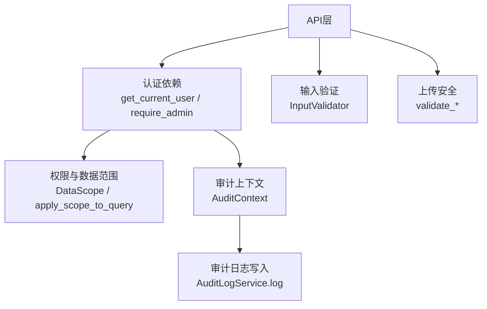
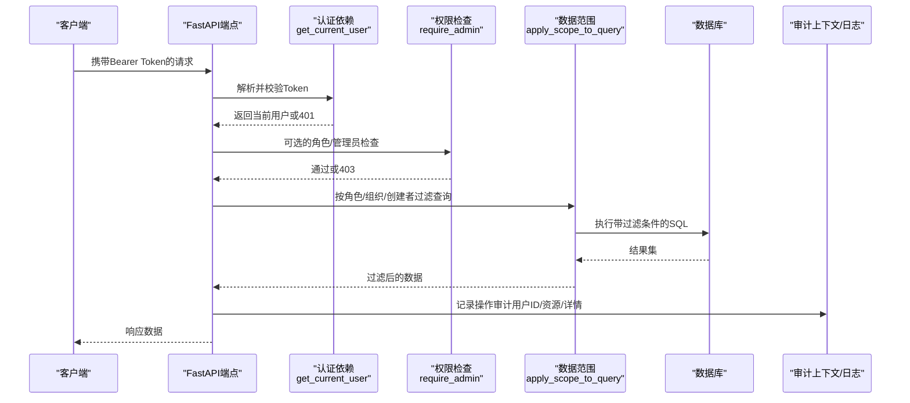
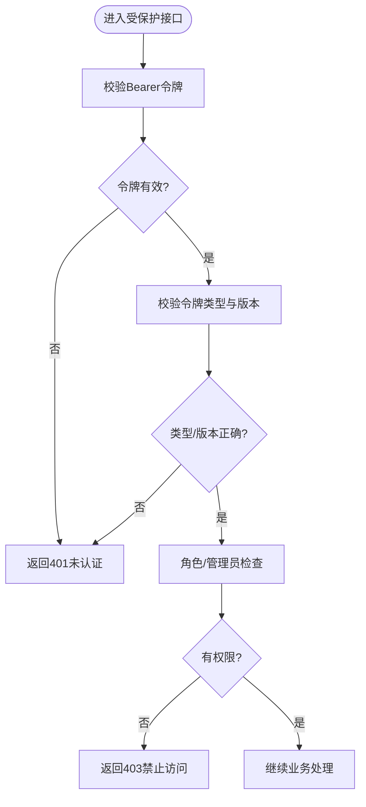
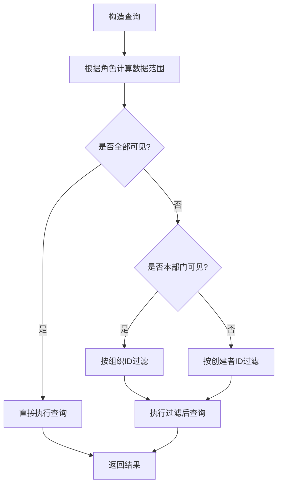
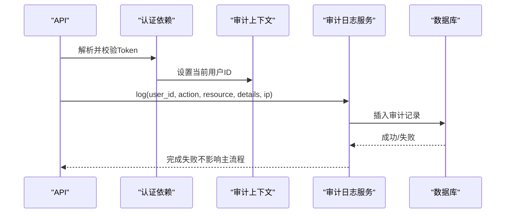
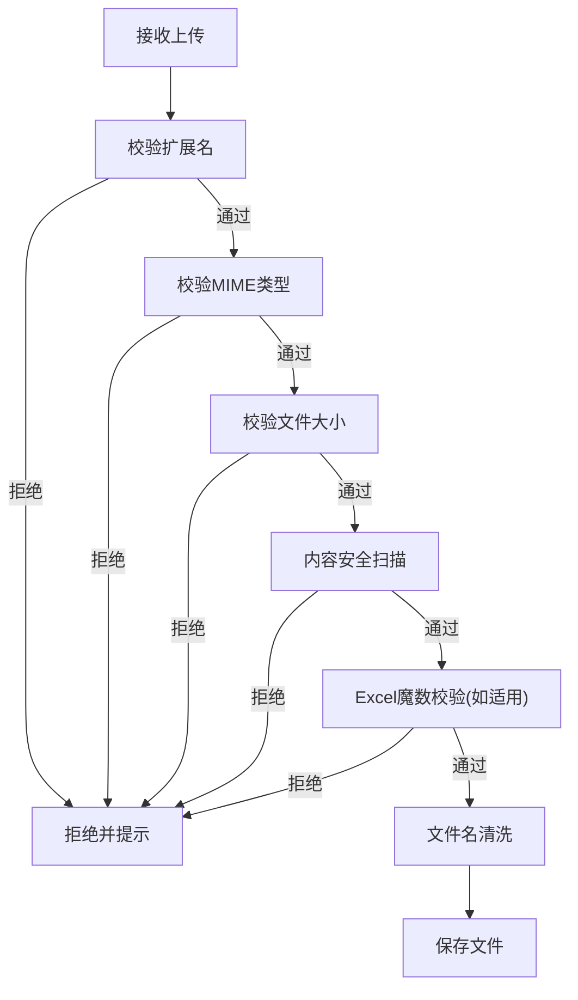
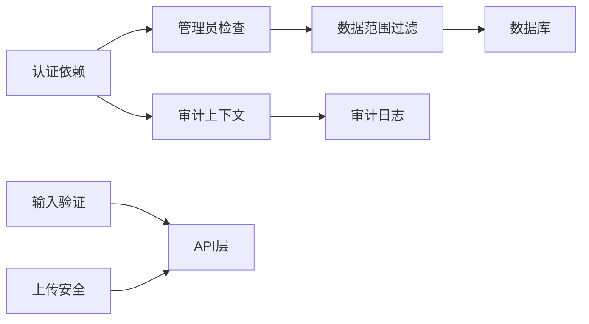

# 安全测试

<cite>
**本文引用的文件**
- [security.py](file://backend/app/core/security.py)
- [data_permission.py](file://backend/app/core/data_permission.py)
- [upload_security.py](file://backend/app/core/upload_security.py)
- [audit_context.py](file://backend/app/middleware/audit_context.py)
- [input_validator.py](file://backend/app/utils/input_validator.py)
- [test_data_isolation.py](file://backend/tests/security/test_data_isolation.py)
- [test_audit.py](file://backend/tests/security/test_audit.py)
</cite>

## 目录
1. [简介](#简介)
2. [项目结构](#项目结构)
3. [核心组件](#核心组件)
4. [架构总览](#架构总览)
5. [详细组件分析](#详细组件分析)
6. [依赖关系分析](#依赖关系分析)
7. [性能考虑](#性能考虑)
8. [故障排查指南](#故障排查指南)
9. [结论](#结论)
10. [附录](#附录)

## 简介
本文件面向“军事乡村振兴系统”的安全测试，聚焦认证授权、数据安全、审计日志、安全边界与渗透测试，并结合项目中的审计与数据隔离实现给出可落地的测试方法。文档以代码级事实为依据，提供流程图与时序图帮助理解关键流程，并给出自动化与回归建议。

## 项目结构
与安全相关的核心能力分布在以下模块：
- 认证与令牌：JWT 生成/校验、密码策略、速率限制、安全响应头
- 权限与数据隔离：角色归一化、数据范围（全部/本部门/本人）、查询过滤
- 上传安全：扩展名白名单、MIME 校验、内容安全扫描、文件名清洗
- 输入验证：XSS/SQL注入检测、格式校验、必填字段校验
- 审计上下文：请求级用户ID与请求ID传播，支撑审计事件写入
- 安全测试用例：数据隔离冒烟、审计合规扫描

图表来源
- [security.py:243-371](file://backend/app/core/security.py#L243-L371)
- [data_permission.py:20-170](file://backend/app/core/data_permission.py#L20-L170)
- [input_validator.py:12-124](file://backend/app/utils/input_validator.py#L12-L124)
- [upload_security.py:57-195](file://backend/app/core/upload_security.py#L57-L195)
- [audit_context.py:15-58](file://backend/app/middleware/audit_context.py#L15-L58)
- [security.py:644-687](file://backend/app/core/security.py#L644-L687)

章节来源
- [security.py:243-371](file://backend/app/core/security.py#L243-L371)
- [data_permission.py:20-170](file://backend/app/core/data_permission.py#L20-L170)
- [upload_security.py:57-195](file://backend/app/core/upload_security.py#L57-L195)
- [input_validator.py:12-124](file://backend/app/utils/input_validator.py#L12-L124)
- [audit_context.py:15-58](file://backend/app/middleware/audit_context.py#L15-L58)
- [security.py:644-687](file://backend/app/core/security.py#L644-L687)

## 核心组件
- 认证与授权
  - JWT 访问令牌签发与解码、刷新令牌、黑名单校验、令牌版本控制
  - 管理员权限检查依赖
  - 速率限制与客户端IP获取
- 数据权限与隔离
  - 数据范围枚举（全部/本部门/本人）
  - 基于角色的数据范围判定与查询过滤
  - 记录级访问检查
- 上传安全
  - 扩展名白名单与禁止列表
  - MIME类型校验
  - 文件大小限制
  - 内容安全扫描（可执行签名、脚本头）
  - Excel 魔数校验与文件名清洗
- 输入验证
  - XSS 模式检测与字符串清理
  - SQL注入风险检测
  - 邮箱/手机/身份证等格式校验
  - 必填字段校验
- 审计上下文与日志
  - 请求级用户ID与请求ID传播
  - 审计日志写入封装

章节来源
- [security.py:210-371](file://backend/app/core/security.py#L210-L371)
- [security.py:439-516](file://backend/app/core/security.py#L439-L516)
- [data_permission.py:20-170](file://backend/app/core/data_permission.py#L20-L170)
- [upload_security.py:57-195](file://backend/app/core/upload_security.py#L57-L195)
- [input_validator.py:12-124](file://backend/app/utils/input_validator.py#L12-L124)
- [audit_context.py:15-58](file://backend/app/middleware/audit_context.py#L15-L58)
- [security.py:644-687](file://backend/app/core/security.py#L644-L687)

## 架构总览
下图展示一次受保护API请求从认证到数据访问与审计的关键路径。

图表来源
- [security.py:243-371](file://backend/app/core/security.py#L243-L371)
- [data_permission.py:83-134](file://backend/app/core/data_permission.py#L83-L134)
- [audit_context.py:15-58](file://backend/app/middleware/audit_context.py#L15-L58)
- [security.py:644-687](file://backend/app/core/security.py#L644-L687)

## 详细组件分析

### 认证授权测试
- JWT 令牌验证
  - 覆盖点：有效/过期/伪造/黑名单/类型不匹配/版本不匹配
  - 依据：令牌签发、解码、黑名单检查、类型与版本校验
- 权限控制测试
  - 覆盖点：普通用户访问受限接口、管理员访问管理接口
  - 依据：管理员依赖、角色常量集合
- 角色访问控制测试
  - 覆盖点：不同角色对资源的可见性差异
  - 依据：角色归一化与数据范围判定

图表来源
- [security.py:243-371](file://backend/app/core/security.py#L243-L371)

章节来源
- [security.py:210-371](file://backend/app/core/security.py#L210-L371)

### 数据安全测试
- 数据隔离验证
  - 覆盖点：超级管理员可见全部；管理员可见本部门；普通用户仅本人
  - 依据：数据范围枚举、查询过滤函数、记录级访问检查
- 敏感信息保护
  - 覆盖点：日志脱敏、密码哈希、密钥来源保障
  - 依据：敏感字段清单与脱敏函数、密码哈希、密钥回退逻辑
- SQL注入防护测试
  - 覆盖点：输入中危险关键字检测、ORM参数化使用
  - 依据：输入验证器SQL注入模式、安全模块SQL注入模式

图表来源
- [data_permission.py:54-134](file://backend/app/core/data_permission.py#L54-L134)

章节来源
- [data_permission.py:20-170](file://backend/app/core/data_permission.py#L20-L170)
- [security.py:180-202](file://backend/app/core/security.py#L180-L202)
- [security.py:394-411](file://backend/app/core/security.py#L394-L411)
- [input_validator.py:12-71](file://backend/app/utils/input_validator.py#L12-L71)

### 审计日志测试
- 操作记录验证
  - 覆盖点：写操作触发审计、用户ID归属、资源标识与元数据
  - 依据：审计日志服务封装
- 日志完整性检查
  - 覆盖点：异常时回滚、避免主流程阻塞
  - 依据：审计写入的异常处理
- 审计事件触发测试
  - 覆盖点：认证成功后设置上下文用户ID，后续写操作可追踪
  - 依据：认证依赖中设置审计上下文

图表来源
- [security.py:243-334](file://backend/app/core/security.py#L243-L334)
- [audit_context.py:15-58](file://backend/app/middleware/audit_context.py#L15-L58)
- [security.py:644-687](file://backend/app/core/security.py#L644-L687)

章节来源
- [security.py:243-334](file://backend/app/core/security.py#L243-L334)
- [audit_context.py:15-58](file://backend/app/middleware/audit_context.py#L15-L58)
- [security.py:644-687](file://backend/app/core/security.py#L644-L687)

### 安全边界测试
- 越权访问检测
  - 覆盖点：跨组织访问、非本人记录访问、管理员越权尝试
  - 依据：数据范围与记录级访问检查
- 输入验证测试
  - 覆盖点：XSS/SQL注入、非法格式、超长输入、缺失必填
  - 依据：输入验证器与SQL注入模式
- 文件上传安全检查
  - 覆盖点：扩展名白名单/禁止列表、MIME校验、大小限制、内容扫描、Excel魔数、文件名清洗
  - 依据：上传安全模块

图表来源
- [upload_security.py:57-195](file://backend/app/core/upload_security.py#L57-L195)

章节来源
- [upload_security.py:57-195](file://backend/app/core/upload_security.py#L57-L195)
- [input_validator.py:12-124](file://backend/app/utils/input_validator.py#L12-L124)
- [data_permission.py:137-170](file://backend/app/core/data_permission.py#L137-L170)

### 渗透测试方法
- 漏洞扫描
  - 使用静态安全扫描工具对应用代码进行扫描，确保无高危问题
  - 参考：审计测试中对静态扫描的执行与结果断言
- 安全弱点识别
  - 结合输入验证、上传安全、权限控制进行针对性验证
- 攻击向量测试
  - 针对JWT伪造/重放、越权、SQL注入、XSS、恶意文件上传等进行用例设计

章节来源
- [test_audit.py:11-52](file://backend/tests/security/test_audit.py#L11-L52)

### 安全测试最佳实践
- 安全测试自动化
  - 将静态扫描、输入校验、上传校验、权限边界用例纳入CI
- 安全回归测试
  - 每次变更对认证、权限、审计、上传、输入校验进行回归
- 合规性检查
  - 定期执行安全扫描与权限基线核对，确保配置与策略一致

章节来源
- [test_audit.py:11-52](file://backend/tests/security/test_audit.py#L11-L52)

## 依赖关系分析
- 认证依赖与权限
  - get_current_user 负责令牌校验、黑名单与版本检查，并设置审计上下文
  - require_admin 在认证基础上增加管理员角色检查
- 数据权限与查询
  - DataScope 决定过滤策略，apply_scope_to_query 将范围注入SQL
- 输入与上传安全
  - InputValidator 与 upload_security 分别在文本与文件层面提供防护
- 审计上下文
  - AuditContext 在请求生命周期内传播用户ID与请求ID，供审计写入

图表来源
- [security.py:243-371](file://backend/app/core/security.py#L243-L371)
- [data_permission.py:83-134](file://backend/app/core/data_permission.py#L83-L134)
- [input_validator.py:12-124](file://backend/app/utils/input_validator.py#L12-L124)
- [upload_security.py:57-195](file://backend/app/core/upload_security.py#L57-L195)
- [audit_context.py:15-58](file://backend/app/middleware/audit_context.py#L15-L58)

章节来源
- [security.py:243-371](file://backend/app/core/security.py#L243-L371)
- [data_permission.py:83-134](file://backend/app/core/data_permission.py#L83-L134)
- [input_validator.py:12-124](file://backend/app/utils/input_validator.py#L12-L124)
- [upload_security.py:57-195](file://backend/app/core/upload_security.py#L57-L195)
- [audit_context.py:15-58](file://backend/app/middleware/audit_context.py#L15-L58)

## 性能考虑
- 令牌校验与黑名单检查为高频路径，应保证低延迟与高可用
- 数据范围过滤应在数据库层完成，减少内存过滤开销
- 上传内容扫描仅检查头部字节，避免全量读取大文件
- 审计日志写入采用事务安全提交，失败不应影响主流程

[本节为通用指导，无需特定文件引用]

## 故障排查指南
- 认证失败
  - 检查令牌是否过期、类型是否为access、是否在黑名单、token_version是否匹配
- 权限不足
  - 确认角色是否满足管理员要求，数据范围是否符合预期
- 审计缺失
  - 检查认证阶段是否正确设置审计上下文，审计写入是否被异常捕获
- 上传失败
  - 检查扩展名、MIME、大小、内容扫描与魔数校验结果

章节来源
- [security.py:243-371](file://backend/app/core/security.py#L243-L371)
- [security.py:644-687](file://backend/app/core/security.py#L644-L687)
- [upload_security.py:57-195](file://backend/app/core/upload_security.py#L57-L195)

## 结论
本项目在认证授权、数据隔离、输入与上传安全、审计日志方面具备完善的基础设施。通过系统化测试（认证、权限、数据隔离、审计、边界与渗透）可有效保障系统安全。建议在CI中固化安全扫描与回归用例，持续验证安全策略与实现的一致性。

[本节为总结性内容，无需特定文件引用]

## 附录
- 数据隔离测试要点
  - 验证数据范围枚举存在且可导入
  - 验证is_admin/is_superuser可用性
  - 验证filter_by_data_scope可调用
- 审计合规测试要点
  - 运行静态扫描并确保无高危问题
  - 验证ORM参数化使用
  - 验证运行时密钥文件权限

章节来源
- [test_data_isolation.py:4-41](file://backend/tests/security/test_data_isolation.py#L4-L41)
- [test_audit.py:11-52](file://backend/tests/security/test_audit.py#L11-L52)