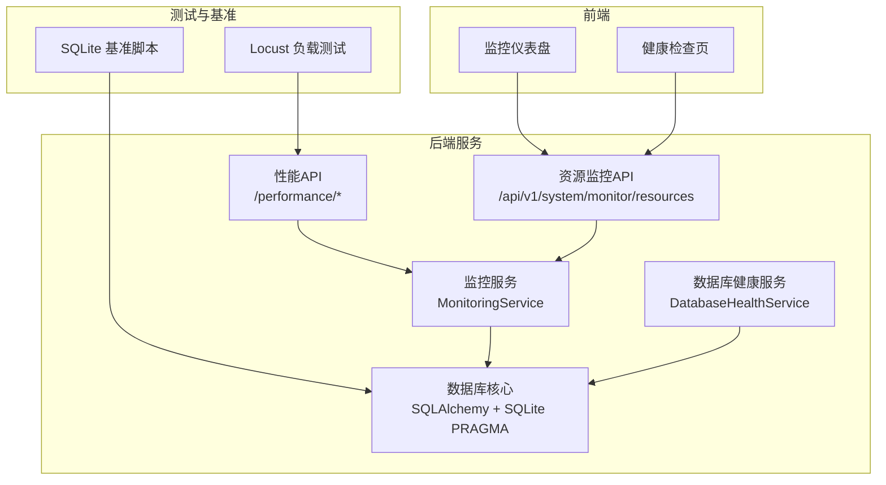
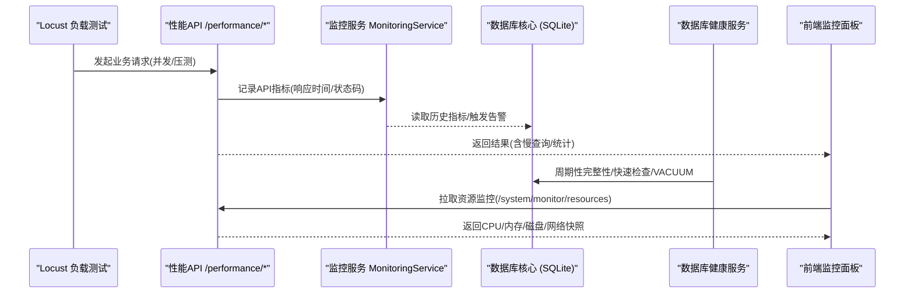
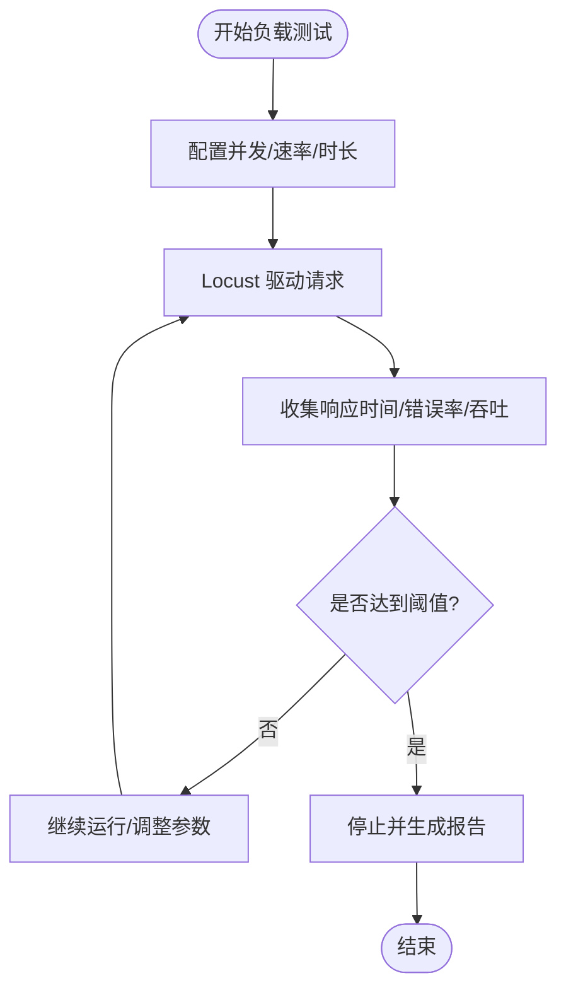
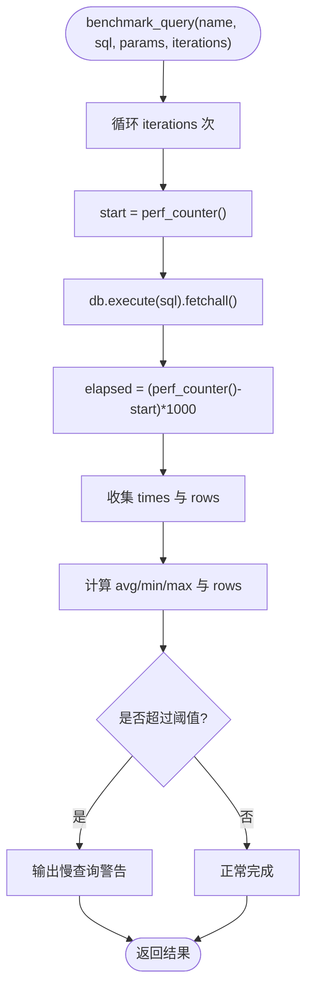
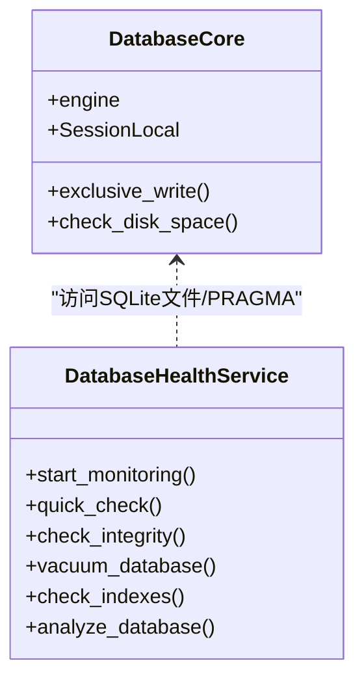
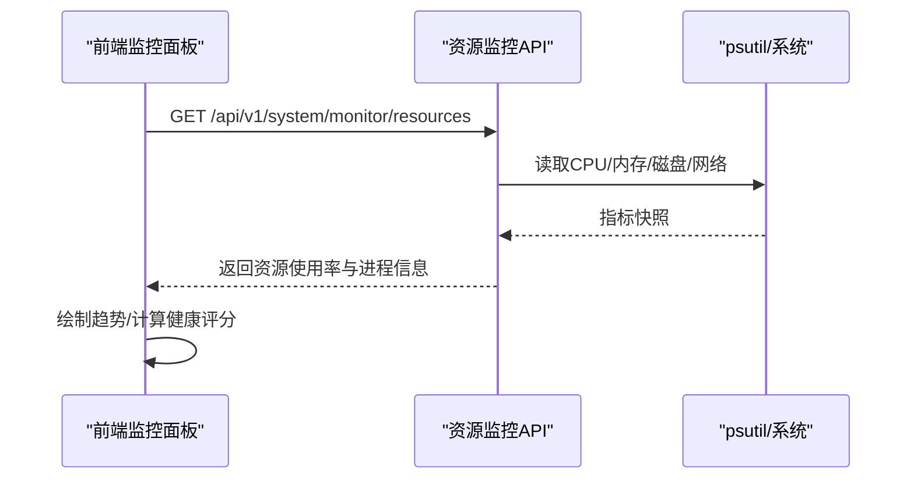
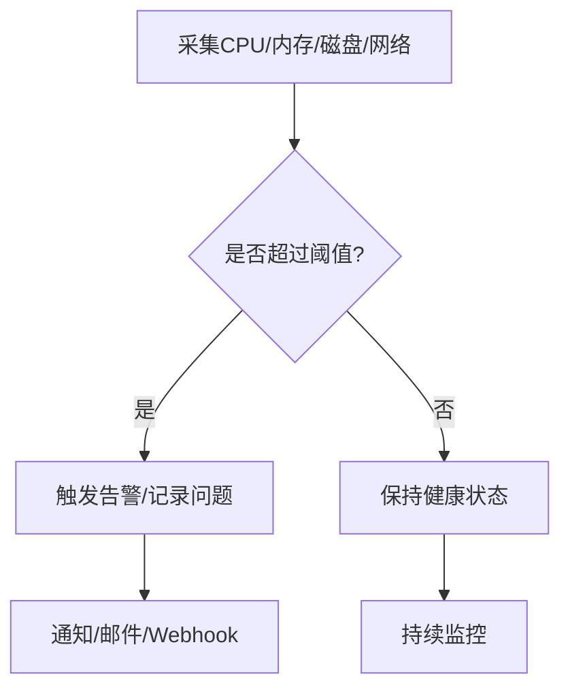
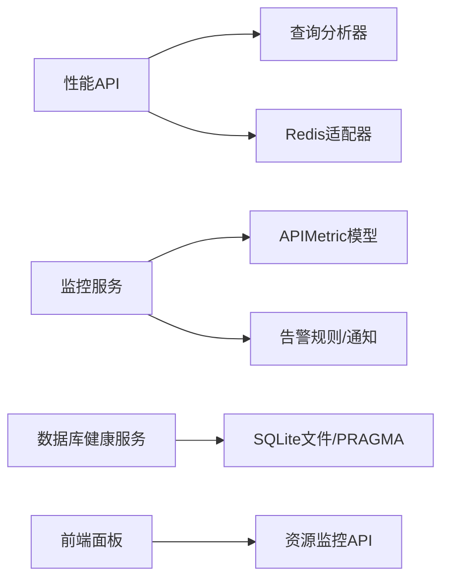

# 性能测试

<cite>
**本文引用的文件**
- [backend/scripts/performance_benchmark.py](file://backend/scripts/performance_benchmark.py)
- [backend/app/services/database_health_service.py](file://backend/app/services/database_health_service.py)
- [backend/tests/test_database_health.py](file://backend/tests/test_database_health.py)
- [backend/app/api/v1/performance.py](file://backend/app/api/v1/performance.py)
- [backend/app/services/query_analyzer_service.py](file://backend/app/services/query_analyzer_service.py)
- [backend/app/core/database.py](file://backend/app/core/database.py)
- [docker/docker-compose.e2e.yml](file://docker/docker-compose.e2e.yml)
- [docs/test-report-gb25000.md](file://docs/test-report-gb25000.md)
- [backend/app/api/v1/system/monitor.py](file://backend/app/api/v1/system/monitor.py)
- [backend/app/services/monitoring_service.py](file://backend/app/services/monitoring_service.py)
- [frontend/src/views/system/MonitoringDashboard.vue](file://frontend/src/views/system/MonitoringDashboard.vue)
- [frontend/src/views/system/HealthCheck.vue](file://frontend/src/views/system/HealthCheck.vue)
</cite>

## 目录
1. [简介](#简介)
2. [项目结构](#项目结构)
3. [核心组件](#核心组件)
4. [架构总览](#架构总览)
5. [详细组件分析](#详细组件分析)
6. [依赖关系分析](#依赖关系分析)
7. [性能考量](#性能考量)
8. [故障排查指南](#故障排查指南)
9. [结论](#结论)
10. [附录](#附录)

## 简介
本文件面向“军事乡村振兴系统”的性能测试与优化，覆盖负载测试、压力测试、容量规划、基准测试、数据库性能测试、内存泄漏检测、瓶颈分析与最佳实践。文档基于仓库中已有的性能基准脚本、数据库健康服务、监控API与前端监控面板等实现，提供可落地的测试方法与验收标准。

## 项目结构
围绕性能测试的关键位置：
- 后端基准脚本：用于SQLite查询性能对比与慢查询阈值检查
- 数据库健康服务：周期性完整性检查、快速检查、VACUUM优化、索引检查与分析
- 性能监控API：慢查询列表、查询统计、缓存统计与清空
- 资源监控API：CPU/内存/磁盘/网络快照
- 监控服务：API指标聚合、错误率统计、告警规则检查与通知
- Docker编排：集成Locust进行负载测试
- 前端监控面板：实时展示系统资源与健康评分

**图表来源**
- [docker/docker-compose.e2e.yml:37-58](file://docker/docker-compose.e2e.yml#L37-L58)
- [backend/scripts/performance_benchmark.py:21-43](file://backend/scripts/performance_benchmark.py#L21-L43)
- [backend/app/api/v1/performance.py:19-95](file://backend/app/api/v1/performance.py#L19-L95)
- [backend/app/api/v1/system/monitor.py:58-97](file://backend/app/api/v1/system/monitor.py#L58-L97)
- [backend/app/services/monitoring_service.py:29-181](file://backend/app/services/monitoring_service.py#L29-L181)
- [backend/app/services/database_health_service.py:80-331](file://backend/app/services/database_health_service.py#L80-L331)
- [backend/app/core/database.py:78-157](file://backend/app/core/database.py#L78-L157)
- [frontend/src/views/system/MonitoringDashboard.vue:389-434](file://frontend/src/views/system/MonitoringDashboard.vue#L389-L434)

**章节来源**
- [docker/docker-compose.e2e.yml:37-58](file://docker/docker-compose.e2e.yml#L37-L58)
- [backend/scripts/performance_benchmark.py:21-43](file://backend/scripts/performance_benchmark.py#L21-L43)
- [backend/app/api/v1/performance.py:19-95](file://backend/app/api/v1/performance.py#L19-L95)
- [backend/app/api/v1/system/monitor.py:58-97](file://backend/app/api/v1/system/monitor.py#L58-L97)
- [backend/app/services/monitoring_service.py:29-181](file://backend/app/services/monitoring_service.py#L29-L181)
- [backend/app/services/database_health_service.py:80-331](file://backend/app/services/database_health_service.py#L80-L331)
- [backend/app/core/database.py:78-157](file://backend/app/core/database.py#L78-L157)
- [frontend/src/views/system/MonitoringDashboard.vue:389-434](file://frontend/src/views/system/MonitoringDashboard.vue#L389-L434)

## 核心组件
- 性能基准脚本：对典型SQL（全表、条件、JOIN、聚合、分页、Keyset分页、年度数据、Dashboard聚合）执行多次并输出平均/最小/最大耗时与行数，支持慢查询阈值判定。
- 数据库健康服务：周期性执行完整性检查、快速检查、VACUUM优化、索引检查、ANALYZE统计信息更新，并提供健康状态与统计。
- 性能监控API：暴露慢查询列表、查询统计、缓存统计与清空能力，供管理员查看与操作。
- 资源监控API：采集CPU、内存、磁盘、网络与进程级指标，返回主机信息与进程线程数。
- 监控服务：聚合API响应时间、错误率、端点统计，支持告警规则检查与通知。
- 前端监控面板：可视化CPU/内存/磁盘使用率、响应时间与数据库大小，计算健康评分。

**章节来源**
- [backend/scripts/performance_benchmark.py:21-43](file://backend/scripts/performance_benchmark.py#L21-L43)
- [backend/app/services/database_health_service.py:80-331](file://backend/app/services/database_health_service.py#L80-L331)
- [backend/app/api/v1/performance.py:19-95](file://backend/app/api/v1/performance.py#L19-L95)
- [backend/app/api/v1/system/monitor.py:58-97](file://backend/app/api/v1/system/monitor.py#L58-L97)
- [backend/app/services/monitoring_service.py:29-181](file://backend/app/services/monitoring_service.py#L29-L181)
- [frontend/src/views/system/MonitoringDashboard.vue:389-434](file://frontend/src/views/system/MonitoringDashboard.vue#L389-L434)

## 架构总览
下图展示了从负载测试到后端API、监控服务与数据库的完整链路，以及前端监控面板的数据消费。

**图表来源**
- [docker/docker-compose.e2e.yml:37-58](file://docker/docker-compose.e2e.yml#L37-L58)
- [backend/app/api/v1/performance.py:19-95](file://backend/app/api/v1/performance.py#L19-L95)
- [backend/app/services/monitoring_service.py:29-181](file://backend/app/services/monitoring_service.py#L29-L181)
- [backend/app/services/database_health_service.py:80-331](file://backend/app/services/database_health_service.py#L80-L331)
- [backend/app/api/v1/system/monitor.py:58-97](file://backend/app/api/v1/system/monitor.py#L58-L97)

## 详细组件分析

### 负载测试方法（并发用户模拟、压力测试、容量规划）
- 工具与环境：使用 Locust 2.28 在独立容器中运行，通过 docker-compose profile 启动，目标为 assistance-system:8000。
- 场景设计：日常业务查询（权重60%）、大数据量分页（15%）、数据导出（10%）、搜索筛选（10%）、压力测试（5%）。
- 运行方式：本地Web UI、无头模式（CI/CD）、Docker模式；支持CSV/HTML报告输出。
- 验收标准：P95响应时间（查询类<500ms，导出类<2000ms）、错误率<0.1%、吞吐量≥50 req/s（50并发）。
- 稳定性监控：提供长稳测试脚本，支持7天或24小时持续监控。

**图表来源**
- [docs/test-report-gb25000.md:148-199](file://docs/test-report-gb25000.md#L148-L199)
- [docker/docker-compose.e2e.yml:37-58](file://docker/docker-compose.e2e.yml#L37-L58)

**章节来源**
- [docs/test-report-gb25000.md:148-199](file://docs/test-report-gb25000.md#L148-L199)
- [docker/docker-compose.e2e.yml:37-58](file://docker/docker-compose.e2e.yml#L37-L58)

### 基准测试实现（性能指标、响应时间、吞吐量）
- 指标采集：对每个SQL执行多次，记录平均/最小/最大耗时与返回行数。
- 阈值判定：依据配置的慢查询阈值（SLOW_QUERY_THRESHOLD_MS），输出超阈查询清单。
- 典型用例：COUNT、条件查询、JOIN、GROUP BY、OFFSET分页、Keyset分页、年度收入查询、Dashboard聚合。

**图表来源**
- [backend/scripts/performance_benchmark.py:21-43](file://backend/scripts/performance_benchmark.py#L21-L43)
- [backend/scripts/performance_benchmark.py:123-144](file://backend/scripts/performance_benchmark.py#L123-L144)

**章节来源**
- [backend/scripts/performance_benchmark.py:21-43](file://backend/scripts/performance_benchmark.py#L21-L43)
- [backend/scripts/performance_benchmark.py:123-144](file://backend/scripts/performance_benchmark.py#L123-L144)

### 数据库性能测试（查询优化验证、索引效果评估、连接池性能）
- 查询优化验证：通过基准脚本对比不同SQL策略（如Keyset vs OFFSET）的耗时差异，结合慢查询阈值识别退化。
- 索引效果评估：健康服务提供索引完整性检查与统计信息分析（ANALYZE），辅助判断索引有效性。
- 连接池性能：数据库核心使用QueuePool，配置pool_size、max_overflow、pre_ping、recycle、timeout；WAL+PRAGMA调优提升并发读写性能。

**图表来源**
- [backend/app/core/database.py:53-65](file://backend/app/core/database.py#L53-L65)
- [backend/app/core/database.py:78-157](file://backend/app/core/database.py#L78-L157)
- [backend/app/services/database_health_service.py:80-331](file://backend/app/services/database_health_service.py#L80-L331)

**章节来源**
- [backend/app/core/database.py:53-65](file://backend/app/core/database.py#L53-L65)
- [backend/app/core/database.py:78-157](file://backend/app/core/database.py#L78-L157)
- [backend/app/services/database_health_service.py:80-331](file://backend/app/services/database_health_service.py#L80-L331)
- [backend/tests/test_database_health.py:13-104](file://backend/tests/test_database_health.py#L13-L104)

### 内存泄漏检测（内存使用监控、垃圾回收分析、资源泄漏识别）
- 内存使用监控：资源监控API返回进程内存占用与系统内存使用率；前端面板以卡片形式展示趋势。
- 垃圾回收分析：性能需求定义GC时间与频率阈值，建议结合系统日志与外部工具（如Python tracemalloc）定位增长热点。
- 资源泄漏识别：通过健康检查与监控告警（CPU/内存/磁盘异常）识别潜在泄漏；数据库健康服务周期性VACUUM减少碎片。

**图表来源**
- [backend/app/api/v1/system/monitor.py:58-97](file://backend/app/api/v1/system/monitor.py#L58-L97)
- [frontend/src/views/system/MonitoringDashboard.vue:504-551](file://frontend/src/views/system/MonitoringDashboard.vue#L504-L551)

**章节来源**
- [backend/app/api/v1/system/monitor.py:58-97](file://backend/app/api/v1/system/monitor.py#L58-L97)
- [frontend/src/views/system/MonitoringDashboard.vue:504-551](file://frontend/src/views/system/MonitoringDashboard.vue#L504-L551)
- [docs/test-report-gb25000.md:105-124](file://docs/test-report-gb25000.md#L105-L124)

### 性能瓶颈分析（CPU使用率、I/O性能、网络延迟）
- CPU使用率：监控服务与资源API提供CPU百分比；前端面板设置阈值（如>90%标记异常）。
- I/O性能：数据库核心启用WAL与PRAGMA优化；健康服务定期VACUUM与ANALYZE；磁盘空间检查防止写失败。
- 网络延迟：内部通信延迟要求<5ms；可通过监控面板的网络收发字节与接口响应时间间接评估。

**图表来源**
- [backend/app/services/monitoring_service.py:157-181](file://backend/app/services/monitoring_service.py#L157-L181)
- [backend/app/core/database.py:133-157](file://backend/app/core/database.py#L133-L157)
- [frontend/src/views/system/MonitoringDashboard.vue:389-434](file://frontend/src/views/system/MonitoringDashboard.vue#L389-L434)

**章节来源**
- [backend/app/services/monitoring_service.py:157-181](file://backend/app/services/monitoring_service.py#L157-L181)
- [backend/app/core/database.py:133-157](file://backend/app/core/database.py#L133-L157)
- [frontend/src/views/system/MonitoringDashboard.vue:389-434](file://frontend/src/views/system/MonitoringDashboard.vue#L389-L434)

### 性能测试最佳实践（环境搭建、基线建立、持续监控）
- 环境搭建：使用Docker Compose profile启动Locust与系统服务，隔离测试流量。
- 基线建立：通过基准脚本与负载测试形成P95/P99响应时间、吞吐量的基线；记录慢查询阈值。
- 持续监控：启用数据库健康监控与资源监控API，前端面板可视化健康评分；结合告警规则实现自动通知。

**章节来源**
- [docker/docker-compose.e2e.yml:37-58](file://docker/docker-compose.e2e.yml#L37-L58)
- [backend/scripts/performance_benchmark.py:123-144](file://backend/scripts/performance_benchmark.py#L123-L144)
- [backend/app/services/database_health_service.py:80-133](file://backend/app/services/database_health_service.py#L80-L133)
- [backend/app/services/monitoring_service.py:183-312](file://backend/app/services/monitoring_service.py#L183-L312)
- [frontend/src/views/system/MonitoringDashboard.vue:389-434](file://frontend/src/views/system/MonitoringDashboard.vue#L389-L434)

## 依赖关系分析
- 性能API依赖查询分析器与Redis适配器，提供慢查询与缓存统计。
- 监控服务依赖数据库模型APIMetric与AlertRule，聚合指标并触发告警。
- 数据库健康服务直接操作SQLite文件与PRAGMA，提供健康状态。
- 前端面板依赖资源监控API与数据库健康信息，计算健康评分。

**图表来源**
- [backend/app/api/v1/performance.py:19-95](file://backend/app/api/v1/performance.py#L19-L95)
- [backend/app/services/monitoring_service.py:29-181](file://backend/app/services/monitoring_service.py#L29-L181)
- [backend/app/services/database_health_service.py:80-331](file://backend/app/services/database_health_service.py#L80-L331)
- [backend/app/api/v1/system/monitor.py:58-97](file://backend/app/api/v1/system/monitor.py#L58-L97)

**章节来源**
- [backend/app/api/v1/performance.py:19-95](file://backend/app/api/v1/performance.py#L19-L95)
- [backend/app/services/monitoring_service.py:29-181](file://backend/app/services/monitoring_service.py#L29-L181)
- [backend/app/services/database_health_service.py:80-331](file://backend/app/services/database_health_service.py#L80-L331)
- [backend/app/api/v1/system/monitor.py:58-97](file://backend/app/api/v1/system/monitor.py#L58-L97)

## 性能考量
- 数据库层：WAL模式、NORMAL同步、busy_timeout放宽、cache_size与mmap_size放大、临时存储内存化、自动索引开启、连接池健康检查与回收。
- 应用层：慢查询记录与统计、端点聚合、错误率统计、告警规则检查与通知。
- 前端层：资源使用率可视化、健康评分计算、阈值提示。
- 测试层：Locust负载测试、基准脚本多场景对比、长稳测试脚本。

**章节来源**
- [backend/app/core/database.py:78-157](file://backend/app/core/database.py#L78-L157)
- [backend/app/services/monitoring_service.py:29-181](file://backend/app/services/monitoring_service.py#L29-L181)
- [frontend/src/views/system/MonitoringDashboard.vue:389-434](file://frontend/src/views/system/MonitoringDashboard.vue#L389-L434)
- [docs/test-report-gb25000.md:148-199](file://docs/test-report-gb25000.md#L148-L199)

## 故障排查指南
- 慢查询排查：通过性能API获取慢查询列表与统计，结合查询计划分析定位N+1或低效SQL。
- 数据库健康：执行完整性检查与快速检查，必要时VACUUM与ANALYZE恢复性能。
- 资源异常：监控CPU/内存/磁盘使用率，结合告警规则与通知定位瓶颈。
- 连接问题：检查数据库连接池配置与PRAGMA设置，确保WAL与超时合理。

**章节来源**
- [backend/app/api/v1/performance.py:19-95](file://backend/app/api/v1/performance.py#L19-L95)
- [backend/app/services/database_health_service.py:80-331](file://backend/app/services/database_health_service.py#L80-L331)
- [backend/app/services/monitoring_service.py:183-312](file://backend/app/services/monitoring_service.py#L183-L312)
- [backend/app/core/database.py:78-157](file://backend/app/core/database.py#L78-L157)

## 结论
本项目已具备完善的性能测试与监控基础设施：基准脚本与Locust支撑负载与压力测试；数据库健康服务保障数据层稳定；监控服务与前端面板提供可视化与告警。建议将性能基线与阈值纳入CI流程，持续回归与预警，确保系统在预期负载下稳定高效运行。

## 附录
- 运行示例参考：
  - 负载测试：见文档中的Locust命令与Docker模式说明
  - 基准脚本：按迭代次数执行典型SQL并输出汇总
  - 健康检查：启动数据库健康监控，周期性执行检查任务

**章节来源**
- [docs/test-report-gb25000.md:148-199](file://docs/test-report-gb25000.md#L148-L199)
- [backend/scripts/performance_benchmark.py:21-43](file://backend/scripts/performance_benchmark.py#L21-L43)
- [backend/app/services/database_health_service.py:80-133](file://backend/app/services/database_health_service.py#L80-L133)