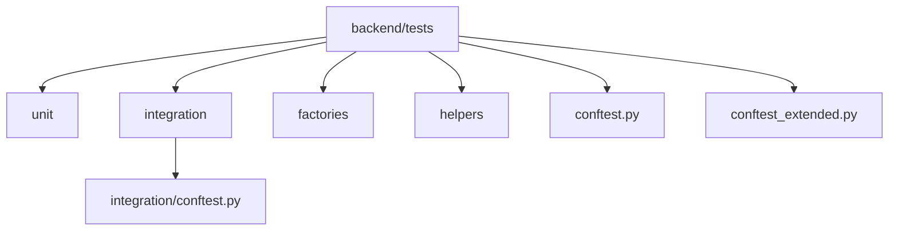
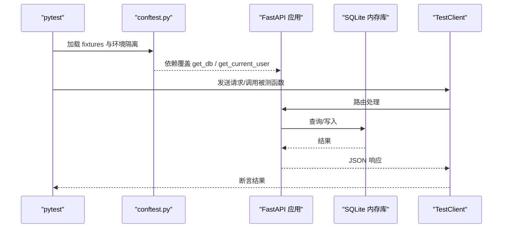
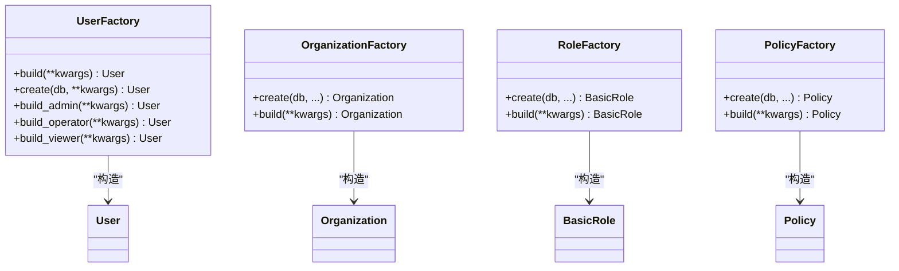
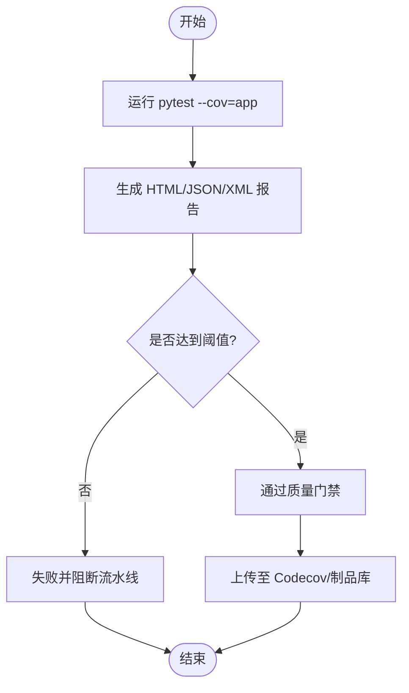
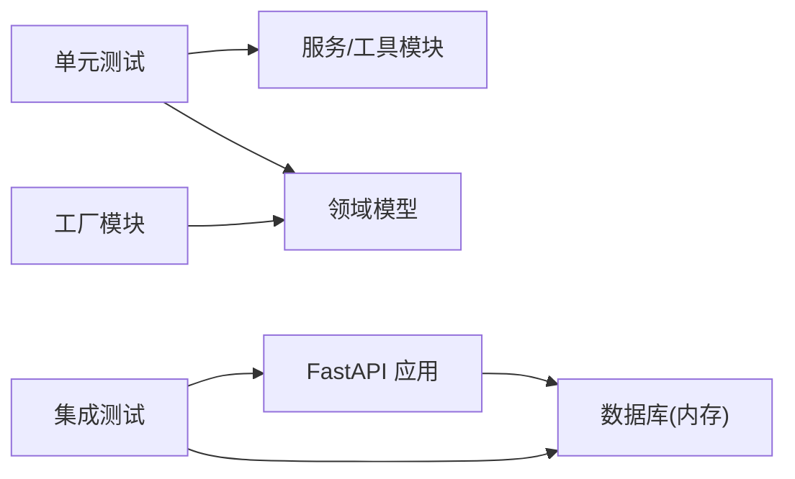

# 测试指南

<cite>
**本文引用的文件**
- [pytest.ini](file://backend/pytest.ini)
- [.coveragerc](file://backend/.coveragerc)
- [pyproject.toml](file://backend/pyproject.toml)
- [conftest.py](file://backend/tests/conftest.py)
- [conftest_extended.py](file://backend/tests/conftest_extended.py)
- [integration/conftest.py](file://backend/tests/integration/conftest.py)
- [user_factory.py](file://backend/tests/factories/user_factory.py)
- [common_factory.py](file://backend/tests/factories/common_factory.py)
- [test_core.py](file://backend/tests/unit/test_core.py)
- [assertions.py](file://backend/tests/helpers/assertions.py)
- [pr-checks.yml](file://github/workflows/pr-checks.yml)
- [nightly-full.yml](file://github/workflows/nightly-full.yml)
</cite>

## 目录
1. [简介](#简介)
2. [项目结构](#项目结构)
3. [核心组件](#核心组件)
4. [架构总览](#架构总览)
5. [详细组件分析](#详细组件分析)
6. [依赖关系分析](#依赖关系分析)
7. [性能考虑](#性能考虑)
8. [故障排查指南](#故障排查指南)
9. [结论](#结论)
10. [附录](#附录)

## 简介
本指南面向基于 pytest 的测试策略，覆盖单元测试、集成测试与端到端测试的编写方法；系统阐述测试数据准备（工厂模式、Fixture、测试数据库隔离）、Mock/Stub 使用（外部依赖模拟、网络请求拦截、数据库操作替换）；说明覆盖率收集与分析（统计口径、报告生成、质量门禁）；给出异步测试、并发测试、性能测试的实现建议；总结命名规范、断言策略与维护实践；并给出 CI/CD 集成的自动化配置要点。

## 项目结构
后端测试位于 backend/tests，按类型分层：
- unit：单元测试，聚焦服务层、工具类、异常与响应等纯逻辑
- integration：集成测试，使用内存 SQLite + TestClient 验证 API 链路
- factories：工厂模式集中构造领域对象
- helpers：通用断言与校验工具
- conftest / conftest_extended：共享夹具、环境隔离、数据库会话管理

图表来源
- [conftest.py:1-150](file://backend/tests/conftest.py#L1-L150)
- [integration/conftest.py:1-60](file://backend/tests/integration/conftest.py#L1-L60)

章节来源
- [conftest.py:1-150](file://backend/tests/conftest.py#L1-L150)
- [integration/conftest.py:1-60](file://backend/tests/integration/conftest.py#L1-L60)

## 核心组件
- 测试运行器与标记：通过 pytest.ini 定义测试路径、匹配规则、标记（unit/integration/security/e2e/performance/stress 等），启用 asyncio_mode=auto 与函数级事件循环作用域
- 覆盖率配置：pyproject.toml 指定 source 为 app，设置 fail_under=100（可覆盖集），.coveragerc 定义排除行（pragma、__main__、抽象方法等）
- 共享 Fixture：conftest.py 提供内存数据库客户端、认证头、用户角色、缓存 mock、真实 DB 会话、应用数据根隔离等
- 集成测试 Fixture：integration/conftest.py 提供独立内存库、TestClient、管理员/普通用户及 Token、自动清理与状态恢复
- 工厂模式：factories/* 提供 User/Organization/Role/Policy 等对象的 build/create 方法，统一默认值与创建流程
- 断言助手：helpers/assertions.py 封装信封/裸格式响应断言、分页断言、权限拒绝、审计日志断言、加密字段断言等

章节来源
- [pytest.ini:1-39](file://backend/pytest.ini#L1-L39)
- [pyproject.toml:1-34](file://backend/pyproject.toml#L1-L34)
- [.coveragerc:1-18](file://backend/.coveragerc#L1-L18)
- [conftest.py:150-737](file://backend/tests/conftest.py#L150-L737)
- [integration/conftest.py:1-313](file://backend/tests/integration/conftest.py#L1-L313)
- [user_factory.py:1-86](file://backend/tests/factories/user_factory.py#L1-L86)
- [common_factory.py:1-151](file://backend/tests/factories/common_factory.py#L1-L151)
- [assertions.py:1-190](file://backend/tests/helpers/assertions.py#L1-L190)

## 架构总览
测试执行的关键路径：
- 启动时加载 conftest，设置环境变量、隔离上传目录、强制导入模型、清理遗留 test.db
- 通过 client/auth_client/fixtures 注入内存数据库与依赖覆盖，构造 FastAPI TestClient
- 单元测试直接调用服务/工具函数；集成测试通过 TestClient 发起 HTTP 请求，验证端到端行为
- 覆盖率由 pytest-cov 采集，CI 中设置 fail_under 作为质量门禁

图表来源
- [conftest.py:393-450](file://backend/tests/conftest.py#L393-L450)
- [integration/conftest.py:47-174](file://backend/tests/integration/conftest.py#L47-L174)

章节来源
- [conftest.py:393-450](file://backend/tests/conftest.py#L393-L450)
- [integration/conftest.py:47-174](file://backend/tests/integration/conftest.py#L47-L174)

## 详细组件分析

### 测试数据准备：工厂模式与 Fixture
- 工厂模式
  - UserFactory：提供 build/create/build_admin/operator/viewer，统一密码哈希与时间戳
  - CommonFactory：Region/Organization/Role/Policy/PolicyCategory 的 build/create，支持批量构建与默认值
- Fixture
  - 内存数据库客户端：client/auth_client/client_with_db 等，自动覆盖 get_db 与全局 engine/SessionLocal
  - 认证头：admin_token_headers/user_token_headers/operator_token_headers，通过 dependency_overrides 注入当前用户
  - 数据隔离：_isolate_app_data_dir 将应用数据根重定向到临时目录，避免污染真实 data/uploads
  - 扩展 Fixture：conftest_extended.py 提供 test_db、test_app、auth_headers、组织用户隔离等

图表来源
- [user_factory.py:10-86](file://backend/tests/factories/user_factory.py#L10-L86)
- [common_factory.py:11-151](file://backend/tests/factories/common_factory.py#L11-L151)

章节来源
- [user_factory.py:10-86](file://backend/tests/factories/user_factory.py#L10-L86)
- [common_factory.py:11-151](file://backend/tests/factories/common_factory.py#L11-L151)
- [conftest.py:83-99](file://backend/tests/conftest.py#L83-L99)
- [conftest.py:393-450](file://backend/tests/conftest.py#L393-L450)
- [conftest.py:688-737](file://backend/tests/conftest.py#L688-L737)
- [conftest_extended.py:22-72](file://backend/tests/conftest_extended.py#L22-L72)

### 单元测试：策略与示例
- 目标：验证无副作用的纯函数、异常分支、配置读取、错误码映射等
- 推荐做法
  - 使用 mock_db 或内存 Session 替代真实数据库
  - 针对异常模块（如 errors/exceptions）进行枚举与消息一致性检查
  - 对 Settings 等配置类进行默认值与别名校验
- 示例参考
  - 异常与错误码：见 test_core.py 中对 ErrorCode、BusinessError、ValidationError、NotFound/Conflict 等的断言
  - 配置项：Settings 的 CORS、allowed_file_types 等列表与别名

章节来源
- [test_core.py:23-183](file://backend/tests/unit/test_core.py#L23-L183)

### 集成测试：策略与示例
- 目标：验证 API 路由、鉴权、数据持久化、审计记录等跨层交互
- 推荐做法
  - 使用 integration/conftest.py 提供的内存库与 TestClient
  - 通过 admin_user/normal_user 夹具创建用户并获取 token
  - 在 setup_database 中清理全局状态（token_blacklist、rate_limit_store 等），确保幂等
  - 使用 assertions.py 中的断言工具统一响应格式校验
- 示例参考
  - 认证流程：admin_token/user_token 夹具登录并返回 access_token
  - 权限控制：assert_permission_denied、assert_not_found、assert_validation_error

章节来源
- [integration/conftest.py:112-197](file://backend/tests/integration/conftest.py#L112-L197)
- [integration/conftest.py:215-313](file://backend/tests/integration/conftest.py#L215-L313)
- [assertions.py:85-122](file://backend/tests/helpers/assertions.py#L85-L122)

### 端到端测试：策略与示例
- 目标：覆盖关键业务流（如备份上传恢复、加密包流转、搜索 API 等）
- 推荐做法
  - 使用 TestClient 发起完整 HTTP 请求链
  - 结合工厂模式构造初始数据，确保用例可重复
  - 对审计日志、加密字段、同步版本号等进行后置断言
- 示例参考
  - 加密包流程、审计集成、搜索 API 等测试文件可作为端到端场景模板

章节来源
- [integration/conftest.py:1-313](file://backend/tests/integration/conftest.py#L1-L313)
- [assertions.py:124-171](file://backend/tests/helpers/assertions.py#L124-L171)

### Mock 与 Stub：外部依赖模拟
- 数据库替换
  - 通过 dependency_overrides[get_db] 指向内存 Session
  - 同时替换模块级 engine/SessionLocal，防止绕过依赖注入的代码路径直连生产库
- 认证依赖替换
  - 覆盖 get_current_user/get_current_active_user，固定返回测试用户
- 缓存/第三方服务
  - 使用 mock_cache 或 unittest.mock.Mock 模拟外部接口
- 网络请求拦截
  - 建议使用 httpx 的 Transport 或 responses 库拦截 HTTP 调用（本项目以 httpx 为主）

章节来源
- [conftest.py:393-450](file://backend/tests/conftest.py#L393-L450)
- [conftest.py:688-737](file://backend/tests/conftest.py#L688-L737)
- [integration/conftest.py:59-108](file://backend/tests/integration/conftest.py#L59-L108)

### 测试数据库隔离
- 环境变量隔离：DATABASE_URL 指向内存或临时文件，UPLOAD_DIR 指向临时目录
- 应用数据根隔离：monkeypatch paths.get_project_backend_dir，避免写真实 data/uploads
- 会话级清理：每个测试后回滚/关闭 session，释放引擎连接池
- 模型注册：会话启动前导入全部模型子模块，保证 mapper 完整

章节来源
- [conftest.py:14-27](file://backend/tests/conftest.py#L14-L27)
- [conftest.py:83-99](file://backend/tests/conftest.py#L83-L99)
- [conftest.py:101-113](file://backend/tests/conftest.py#L101-L113)
- [integration/conftest.py:171-197](file://backend/tests/integration/conftest.py#L171-L197)

### 覆盖率收集与分析
- 采集范围：source=app，omit 排除测试与缓存
- 报告输出：HTML/JSON/XML，便于归档与可视化
- 质量门禁：fail_under=100（可覆盖集），配合 .coveragerc 排除不可执行行
- CI 集成：PR Checks 与 Nightly 均执行 --cov-fail-under=98（PR 阶段）与 98%（夜间全量），并上传 Codecov

图表来源
- [pyproject.toml:1-34](file://backend/pyproject.toml#L1-L34)
- [.coveragerc:1-18](file://backend/.coveragerc#L1-L18)
- [pr-checks.yml:24-44](file://github/workflows/pr-checks.yml#L24-L44)
- [nightly-full.yml:20-49](file://github/workflows/nightly-full.yml#L20-L49)

章节来源
- [pyproject.toml:1-34](file://backend/pyproject.toml#L1-L34)
- [.coveragerc:1-18](file://backend/.coveragerc#L1-L18)
- [pr-checks.yml:24-44](file://github/workflows/pr-checks.yml#L24-L44)
- [nightly-full.yml:20-49](file://github/workflows/nightly-full.yml#L20-L49)

### 异步测试、并发测试、性能测试
- 异步测试：pytest.ini 设置 asyncio_mode=auto 与 asyncio_default_fixture_loop_scope=function，简化协程测试
- 并发测试：使用 xdist（-n auto）并行执行，提升吞吐；注意避免共享状态污染（已通过隔离与清理保障）
- 性能测试：通过 performance/stress 标记筛选慢用例，结合 --durations 定位热点；必要时引入专用基准脚本

章节来源
- [pytest.ini:1-39](file://backend/pytest.ini#L1-L39)
- [nightly-full.yml:20-32](file://github/workflows/nightly-full.yml#L20-L32)

### 最佳实践
- 命名规范
  - 测试文件：test_*.py；类：Test*；函数：test_*
  - 标记：unit/integration/security/e2e/performance/stress
- 断言策略
  - 使用 assertions.py 统一信封/裸格式、分页、权限拒绝、审计日志、加密字段等断言
  - 对异常与错误码进行枚举级一致性检查
- 维护指导
  - 优先使用工厂模式构造数据，减少硬编码
  - 保持 Fixture 幂等与隔离，避免跨测试污染
  - 对敏感标记的用例提前执行，降低事件循环/全局状态影响

章节来源
- [pytest.ini:1-39](file://backend/pytest.ini#L1-L39)
- [assertions.py:1-190](file://backend/tests/helpers/assertions.py#L1-L190)
- [user_factory.py:10-86](file://backend/tests/factories/user_factory.py#L10-L86)
- [conftest.py:121-148](file://backend/tests/conftest.py#L121-L148)

### CI/CD 集成
- PR Checks
  - 安装依赖后执行 pytest 并行测试，覆盖率阈值 98%，失败即阻断
  - 上传覆盖率到 Codecov（非阻断）
  - 静态扫描：flake8/mypy/bandit
- Nightly Full
  - 全量测试 + 多格式覆盖率报告，产出 JUnit XML 与 HTML 制品
  - 前端 vitest 测试与覆盖率一并上报
- 质量报告
  - 汇总前后端测试结果，生成质量摘要制品

章节来源
- [pr-checks.yml:17-83](file://github/workflows/pr-checks.yml#L17-L83)
- [nightly-full.yml:12-99](file://github/workflows/nightly-full.yml#L12-L99)

## 依赖关系分析
- 测试层依赖
  - unit 依赖 services/utils/core 等内部模块，通过 mock_db 或内存 Session 解耦
  - integration 依赖 FastAPI 应用、数据库、安全模块（hash_password/decode_token）
  - factories 依赖 models 与 security（密码哈希）
- 外部依赖
  - pytest、pytest-xdist、pytest-cov、httpx（测试客户端）
  - SQLAlchemy（内存 SQLite 引擎与会话）
  - Codecov（覆盖率上报）

图表来源
- [conftest.py:393-450](file://backend/tests/conftest.py#L393-L450)
- [integration/conftest.py:47-108](file://backend/tests/integration/conftest.py#L47-L108)
- [user_factory.py:10-86](file://backend/tests/factories/user_factory.py#L10-L86)

章节来源
- [conftest.py:393-450](file://backend/tests/conftest.py#L393-L450)
- [integration/conftest.py:47-108](file://backend/tests/integration/conftest.py#L47-L108)
- [user_factory.py:10-86](file://backend/tests/factories/user_factory.py#L10-L86)

## 性能考虑
- 使用 xdist 并行执行，缩短反馈时间
- 将敏感用例提前执行，避免事件循环/全局状态污染
- 使用内存数据库与 StaticPool，减少 IO 开销
- 通过 --durations 与性能标记筛选慢用例，持续优化

## 故障排查指南
- 常见错误
  - 真实数据库被写入：确认 DATABASE_URL/UPLOAD_DIR 已正确设置，paths.get_project_backend_dir 已被 monkeypatch
  - 并发导致数据库损坏：确保每个测试使用内存库并在 teardown 中关闭/回滚
  - 认证依赖未覆盖：检查 dependency_overrides 是否正确注入 get_current_user
- 诊断步骤
  - 查看 pytest 输出与日志，定位 fixture setup/teardown 失败
  - 使用 assertions.py 的断言工具快速识别响应格式问题
  - 在 CI 中查看失败用例的详细输出与覆盖率差异

章节来源
- [conftest.py:42-49](file://backend/tests/conftest.py#L42-L49)
- [conftest.py:393-450](file://backend/tests/conftest.py#L393-L450)
- [integration/conftest.py:171-197](file://backend/tests/integration/conftest.py#L171-L197)
- [assertions.py:85-122](file://backend/tests/helpers/assertions.py#L85-L122)

## 结论
本测试体系以 pytest 为核心，结合工厂模式、Fixture 与严格的数据库隔离，实现了高内聚、低耦合的单元与集成测试；通过覆盖率门禁与 CI 自动化，保障代码质量与交付稳定性。遵循本指南的实践，可显著提升测试的可维护性与执行效率。

## 附录
- 常用命令
  - 运行所有测试：cd backend && python -m pytest tests/ -v
  - 仅运行单元测试：python -m pytest tests/unit -v
  - 仅运行集成测试：python -m pytest tests/integration -v
  - 带覆盖率：python -m pytest tests/ --cov=app --cov-report=html
  - 并行执行：python -m pytest tests/ -n auto
- 标记筛选
  - 跳过慢用例：-m "not slow"
  - 仅性能测试：-m "performance"
  - 仅安全测试：-m "security"