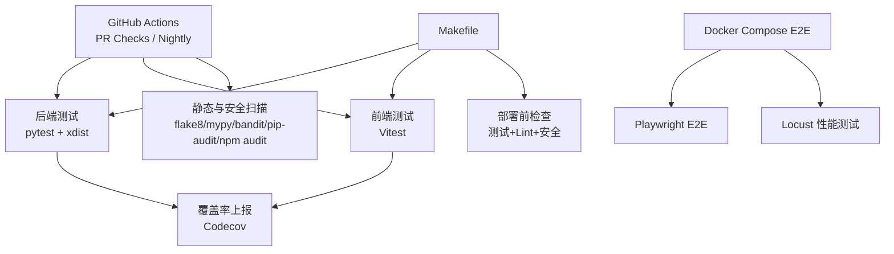
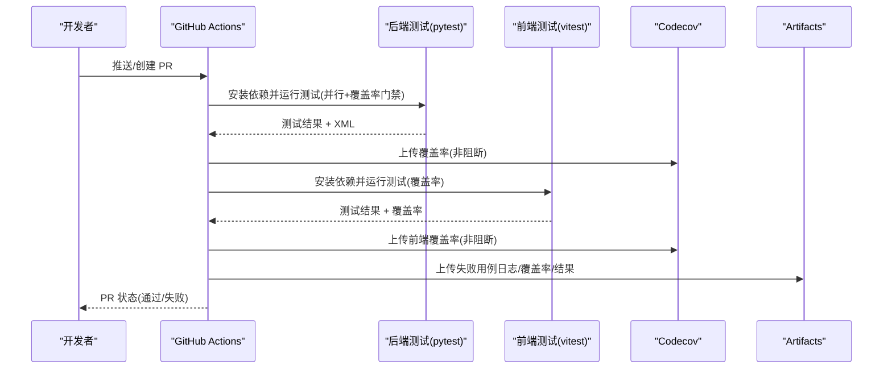
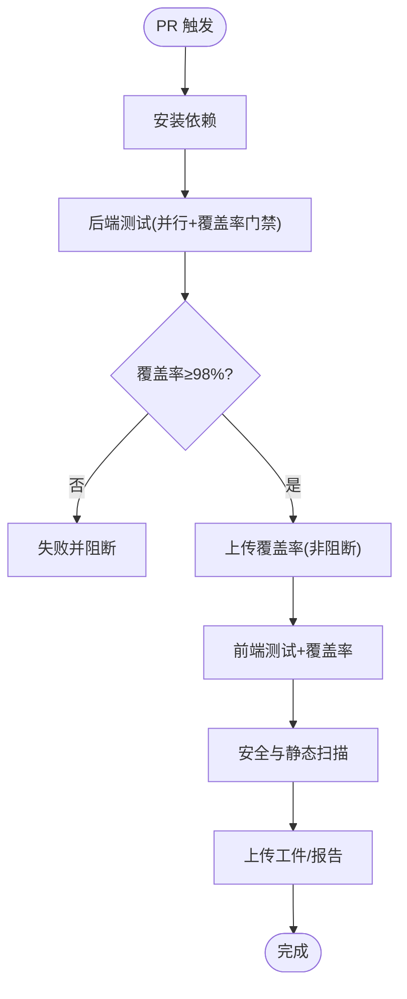
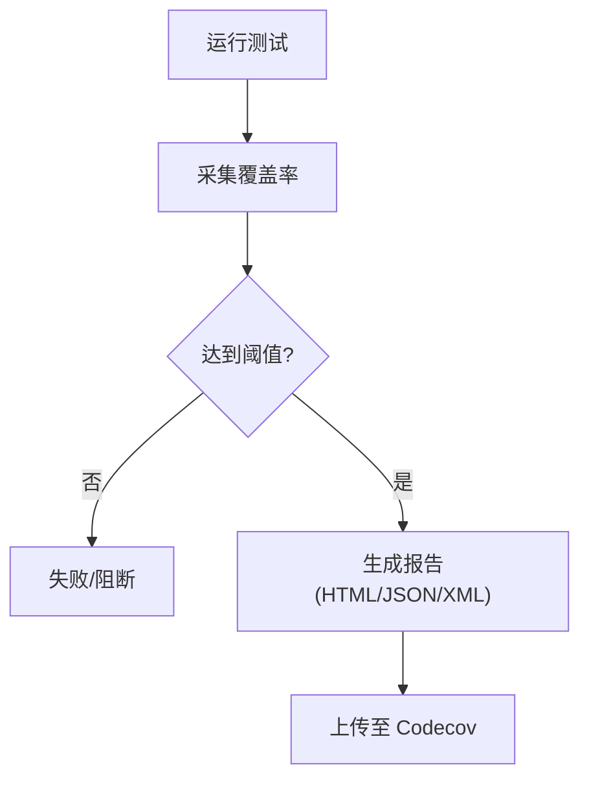
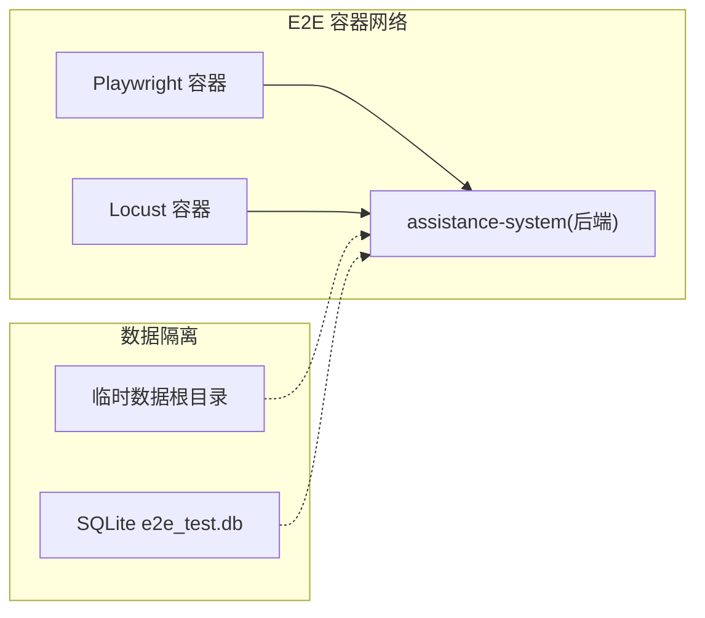
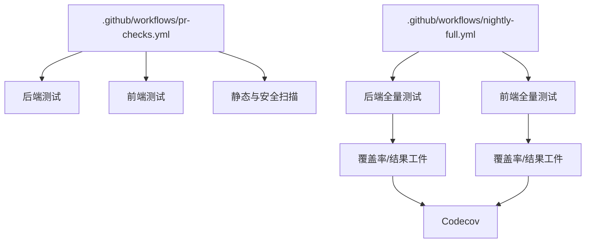

# 测试自动化

<cite>
**本文引用的文件**
- [pr-checks.yml](file://.github/workflows/pr-checks.yml)
- [nightly-full.yml](file://.github/workflows/nightly-full.yml)
- [pytest.ini](file://backend/pytest.ini)
- [.coveragerc](file://backend/.coveragerc)
- [pyproject.toml](file://backend/pyproject.toml)
- [conftest.py](file://backend/tests/conftest.py)
- [conftest_extended.py](file://backend/tests/conftest_extended.py)
- [playwright.config.ts](file://frontend/playwright.config.ts)
- [vitest.config.ts](file://frontend/vitest.config.ts)
- [docker-compose.e2e.yml](file://docker/docker-compose.e2e.yml)
- [Dockerfile](file://docker/Dockerfile)
- [Makefile](file://Makefile)
</cite>

## 目录
1. [简介](#简介)
2. [项目结构](#项目结构)
3. [核心组件](#核心组件)
4. [架构总览](#架构总览)
5. [详细组件分析](#详细组件分析)
6. [依赖关系分析](#依赖关系分析)
7. [性能考量](#性能考量)
8. [故障排查指南](#故障排查指南)
9. [结论](#结论)
10. [附录](#附录)

## 简介
本文件面向“乡村振兴系统”的测试自动化，系统性说明 CI/CD 流水线、自动化测试执行与上报、覆盖率收集与质量门禁、测试环境管理（容器化、数据准备、隔离）、并行执行策略、报告分析与趋势追踪，以及最佳实践。内容严格基于仓库中的 GitHub Actions 工作流、后端/前端测试配置、Docker 编排与 Makefile 等实际实现。

## 项目结构
测试相关的关键位置与职责：
- .github/workflows：CI 工作流定义（PR 检查、夜间全量）
- backend/pytest.ini、backend/.coveragerc、backend/pyproject.toml：后端测试运行器与覆盖率配置
- backend/tests/*：后端单元测试、集成测试、安全测试及 fixtures
- frontend/playwright.config.ts、frontend/vitest.config.ts：E2E 与单元/组件测试配置
- docker/docker-compose.e2e.yml：E2E 与性能测试的容器编排
- docker/Dockerfile：镜像构建（前后端产物打包）
- Makefile：本地一键测试、覆盖率、部署前检查

**图表来源**
- [pr-checks.yml:17-66](file://.github/workflows/pr-checks.yml#L17-L66)
- [nightly-full.yml:12-78](file://.github/workflows/nightly-full.yml#L12-L78)
- [docker-compose.e2e.yml:7-58](file://docker/docker-compose.e2e.yml#L7-L58)
- [Makefile:13-58](file://Makefile#L13-L58)

**章节来源**
- [pr-checks.yml:1-134](file://.github/workflows/pr-checks.yml#L1-L134)
- [nightly-full.yml:1-99](file://.github/workflows/nightly-full.yml#L1-L99)
- [Makefile:1-58](file://Makefile#L1-L58)

## 核心组件
- 后端测试框架与标记
  - pytest 入口与标记：slow/unit/integration/security/approval/e2e/stress/performance 等，便于选择性执行与分类管理
  - 异步模式：asyncio_mode=auto，统一协程测试行为
  - 警告过滤：针对第三方弃用与特定场景的良性告警进行精准过滤，避免噪音掩盖真实问题
- 覆盖率与质量门禁
  - coverage 源范围与排除规则，HTML/JSON/XML 多格式输出
  - 可覆盖集 100% 目标：通过 exclude_lines 豁免真正不可执行的行（如抽象方法、类型检查分支、__main__ 守卫等）
  - 质量门禁：CI 中 --cov-fail-under=98 作为阻断阈值；pyproject 中 fail_under=100 用于本地/工具链口径一致
- 测试夹具与环境隔离
  - 强制 UTF-8 编码、临时上传目录、内存数据库、路径重定向到会话级临时目录，确保并发测试互不干扰
  - 提供多种认证头与客户端夹具，支持不同角色权限场景
  - 扩展夹具：独立 SQLite 内存库、WAL 模式、组织级用户数据隔离
- 前端测试
  - Vitest：单线程执行、文件级并行关闭，避免 Windows 下 coverage 临时目录竞争；按模块设置覆盖率阈值
  - Playwright E2E：固定端口、独立数据库、浏览器 trace/screenshot 策略、重试与并行控制
- Docker 与编排
  - E2E 服务：Playwright 容器与 Locust 性能容器，依赖健康的前端/后端服务
  - 构建镜像：前后端分阶段构建，最终运行时包含必要依赖

**章节来源**
- [pytest.ini:1-39](file://backend/pytest.ini#L1-L39)
- [pyproject.toml:1-34](file://backend/pyproject.toml#L1-L34)
- [.coveragerc:1-18](file://backend/.coveragerc#L1-L18)
- [conftest.py:1-737](file://backend/tests/conftest.py#L1-L737)
- [conftest_extended.py:1-130](file://backend/tests/conftest_extended.py#L1-L130)
- [vitest.config.ts:1-104](file://frontend/vitest.config.ts#L1-L104)
- [playwright.config.ts:1-84](file://frontend/playwright.config.ts#L1-L84)
- [docker-compose.e2e.yml:1-63](file://docker/docker-compose.e2e.yml#L1-L63)
- [Dockerfile:1-173](file://docker/Dockerfile#L1-L173)

## 架构总览
CI 触发与任务分工：
- PR Checks：对 PR 进行快速验证，包括后端测试（带覆盖率门禁）、前端检查与测试、代码规范与安全扫描
- Nightly Full：每日全量测试，产出更丰富的覆盖率与测试结果工件，并生成质量汇总报告

**图表来源**
- [pr-checks.yml:17-66](file://.github/workflows/pr-checks.yml#L17-L66)
- [nightly-full.yml:20-49](file://.github/workflows/nightly-full.yml#L20-L49)

**章节来源**
- [pr-checks.yml:1-134](file://.github/workflows/pr-checks.yml#L1-L134)
- [nightly-full.yml:1-99](file://.github/workflows/nightly-full.yml#L1-L99)

## 详细组件分析

### CI/CD 流水线配置（GitHub Actions）
- PR Checks
  - 后端：安装依赖 → 并行运行 pytest（-n auto）→ 覆盖率 XML → 覆盖率门禁 --cov-fail-under=98 → 失败时重跑失败用例并写入注解 → 上传 Codecov（非阻断）
  - 前端：TypeScript 类型检查 → Lint 检查 → Vitest 运行并生成覆盖率 → 上传 Codecov
  - 安全与静态：flake8 零错误门禁、mypy 类型检查（非阻断）、bandit 安全扫描（低级别阻断）、pip-audit/npm audit 依赖漏洞扫描、SBOM 生成与上传
- Nightly Full
  - 后端：全量测试 + HTML/JSON/XML 覆盖率 + 失败重试 + 最慢用例统计 + JUnit 结果 → 上传工件与 Codecov
  - 前端：全量测试 + JUnit 结果 + 覆盖率 → 上传工件与 Codecov
  - 质量报告：汇总前后端结果并生成 Markdown 报告

**图表来源**
- [pr-checks.yml:17-66](file://.github/workflows/pr-checks.yml#L17-L66)
- [nightly-full.yml:20-49](file://.github/workflows/nightly-full.yml#L20-L49)

**章节来源**
- [pr-checks.yml:17-133](file://.github/workflows/pr-checks.yml#L17-L133)
- [nightly-full.yml:12-99](file://.github/workflows/nightly-full.yml#L12-L99)

### 自动化测试执行与结果上报
- 后端
  - 使用 pytest 并行执行（-n auto），结合 --reruns 提升稳定性
  - 覆盖率以 XML 形式上传至 Codecov；失败时额外打印最近失败用例以便定位
- 前端
  - Vitest 输出 JUnit 与覆盖率；在 nightly 中上传工件供后续分析
- 工件与报告
  - 测试结果 XML、覆盖率 HTML、质量报告均作为 artifacts 保留，便于回溯

**章节来源**
- [pr-checks.yml:23-44](file://.github/workflows/pr-checks.yml#L23-L44)
- [nightly-full.yml:20-78](file://.github/workflows/nightly-full.yml#L20-L78)

### 测试覆盖率收集与质量门禁
- 后端
  - 覆盖率源：app 包；排除测试与缓存目录
  - 报告：HTML/JSON/XML；精度与缺失展示开启
  - 门禁：CI 使用 --cov-fail-under=98；pyproject 中 fail_under=100 用于工具链口径一致
  - 豁免：exclude_lines 与 .coveragerc 共同定义可覆盖集，确保“可覆盖集 100%”目标合理
- 前端
  - 覆盖率：v8 provider，text/json/html 报告；按目录设置阈值（语句/分支/函数/行）
  - 排除：类型定义、配置文件、测试辅助等不参与覆盖率统计

**图表来源**
- [pyproject.toml:1-34](file://backend/pyproject.toml#L1-L34)
- [.coveragerc:1-18](file://backend/.coveragerc#L1-L18)
- [vitest.config.ts:37-87](file://frontend/vitest.config.ts#L37-L87)
- [pr-checks.yml:23-44](file://.github/workflows/pr-checks.yml#L23-L44)

**章节来源**
- [pyproject.toml:1-34](file://backend/pyproject.toml#L1-L34)
- [.coveragerc:1-18](file://backend/.coveragerc#L1-L18)
- [vitest.config.ts:37-87](file://frontend/vitest.config.ts#L37-L87)
- [pr-checks.yml:23-44](file://.github/workflows/pr-checks.yml#L23-L44)

### 测试环境管理（容器化、数据准备、隔离）
- 容器化 E2E
  - Playwright 容器：安装依赖与浏览器，挂载测试目录，依赖 assistance-system 健康后执行
  - Locust 性能容器：参数化并发与时长，暴露 UI 端口便于观察
- 数据准备与隔离
  - 后端 conftest 强制设置 DATABASE_URL 为相对路径，并通过 monkeypatch 将应用数据根目录重定向到会话级临时目录，避免污染真实开发库
  - 上传目录隔离：临时目录作为 UPLOAD_DIR，防止写盘冲突
  - 前端 E2E：webServer 启动后端与前端，使用独立 e2e_test.db，避免生产数据被修改
- 环境标准化
  - Dockerfile 分阶段构建，保证构建与运行环境一致
  - Makefile 提供统一的测试、覆盖率、部署前检查命令，减少环境差异

**图表来源**
- [docker-compose.e2e.yml:7-58](file://docker/docker-compose.e2e.yml#L7-L58)
- [playwright.config.ts:54-82](file://frontend/playwright.config.ts#L54-L82)
- [conftest.py:14-23,83-99:14-23](file://backend/tests/conftest.py#L14-L23)
- [conftest.py:83-99](file://backend/tests/conftest.py#L83-L99)

**章节来源**
- [docker-compose.e2e.yml:1-63](file://docker/docker-compose.e2e.yml#L1-L63)
- [playwright.config.ts:1-84](file://frontend/playwright.config.ts#L1-L84)
- [conftest.py:1-100](file://backend/tests/conftest.py#L1-L100)
- [Dockerfile:1-173](file://docker/Dockerfile#L1-L173)

### 测试并行执行（分布式、分片、并发优化）
- 后端
  - pytest-xdist 并行：-n auto，显著缩短全量用例时间；注释明确与 rerunfailures 的调度兼容选择
  - 用例集合顺序调整：污染敏感的用例提前执行，降低跨测试状态影响
- 前端
  - Vitest：单线程执行、关闭文件级并行以避免 coverage 临时目录竞争；retry=1 缓解时序抖动
  - Playwright：fullyParallel=true，但 workers=1 串行执行，避免共享 SQLite 导致的随机失败
- 建议
  - 对 IO 密集或共享资源敏感的测试保持串行或有限并行
  - 对纯计算/无副作用的测试启用更高并行度

**章节来源**
- [pr-checks.yml:23-35](file://.github/workflows/pr-checks.yml#L23-L35)
- [conftest.py:121-148](file://backend/tests/conftest.py#L121-L148)
- [vitest.config.ts:7-18](file://frontend/vitest.config.ts#L7-L18)
- [playwright.config.ts:19-24](file://frontend/playwright.config.ts#L19-L24)

### 测试报告分析（趋势、失败追踪、质量度量）
- 结果工件
  - 后端：JUnit XML、覆盖率 HTML/JSON/XML
  - 前端：JUnit XML、覆盖率目录
  - 质量报告：Nightly 生成 Markdown 汇总
- 失败用例追踪
  - PR Checks 失败时重跑失败用例并输出具体断言信息，便于快速定位
- 趋势与指标
  - Codecov 聚合覆盖率历史，结合 nightly 工件可离线归档
  - 通过 JUnit 结果可在平台侧做趋势分析（例如 GitHub Actions 的测试结果视图）

**章节来源**
- [nightly-full.yml:20-78](file://.github/workflows/nightly-full.yml#L20-L78)
- [pr-checks.yml:32-44](file://.github/workflows/pr-checks.yml#L32-L44)

### 测试自动化最佳实践
- 测试维护策略
  - 使用标记分类测试（unit/integration/security/e2e），按需执行
  - 污染敏感用例优先执行，降低状态泄漏风险
- 测试数据管理
  - 统一通过 fixtures 注入内存数据库与临时数据根目录，避免真实数据污染
  - E2E 使用独立数据库与固定端口，确保稳定复现
- 环境标准化
  - 通过 Docker 与 Makefile 固化环境与命令，减少“在我机器上能跑”的问题
  - CI 与本地保持一致的命令与阈值，避免“本地绿、CI 红”

**章节来源**
- [pytest.ini:7-16](file://backend/pytest.ini#L7-L16)
- [conftest.py:14-23,83-99:14-23](file://backend/tests/conftest.py#L14-L23)
- [playwright.config.ts:54-82](file://frontend/playwright.config.ts#L54-L82)
- [Makefile:13-58](file://Makefile#L13-L58)

## 依赖关系分析
- 工作流依赖
  - PR Checks：后端测试、前端检查/测试、静态与安全扫描相互独立，可并行执行
  - Nightly Full：后端与前端全量测试并行，quality-report 依赖两者结果
- 测试与覆盖率
  - 后端：pytest → coverage → Codecov
  - 前端：Vitest → 覆盖率 → Codecov
- 环境依赖
  - E2E：Playwright/Locust 依赖 assistance-system 健康；前端 webServer 启动后端与前端服务

**图表来源**
- [pr-checks.yml:17-133](file://.github/workflows/pr-checks.yml#L17-L133)
- [nightly-full.yml:12-99](file://.github/workflows/nightly-full.yml#L12-L99)

**章节来源**
- [pr-checks.yml:17-133](file://.github/workflows/pr-checks.yml#L17-L133)
- [nightly-full.yml:12-99](file://.github/workflows/nightly-full.yml#L12-L99)

## 性能考量
- 并行策略
  - 后端使用 xdist 并行，显著缩短全量用例时间；注意与某些插件的兼容性
  - 前端 Vitest 关闭文件级并行以避免 coverage 竞争；E2E 限制 worker 数避免共享资源冲突
- 资源隔离
  - 内存数据库与临时目录避免磁盘 IO 瓶颈与数据竞争
  - E2E 固定端口与独立数据库，避免端口占用与数据污染
- 报告开销
  - 仅在全量或需要时生成 HTML 覆盖率，PR 检查以 XML 为主，减少 IO 压力

[本节为通用指导，无需引用具体文件]

## 故障排查指南
- 常见失败原因
  - 覆盖率未达标：检查 --cov-fail-under 阈值与 exclude_lines 是否合理
  - 并发导致的数据竞争：确认是否启用了共享资源（如 SQLite）且未限制并行
  - 环境变量过长：Windows 环境下超长变量会导致 patch 失败，已在 conftest 中清理
  - 端口冲突：E2E 使用固定端口，若本机已有实例需调整
- 定位步骤
  - 查看 PR 失败时的“Report failed tests”输出，获取具体用例与断言
  - 下载 artifacts 中的 test-results.xml 与覆盖率 HTML 进行离线分析
  - 使用本地 make 命令复现：make test-backend/test-frontend/coverage/deploy-check

**章节来源**
- [pr-checks.yml:32-44](file://.github/workflows/pr-checks.yml#L32-L44)
- [conftest.py:56-67](file://backend/tests/conftest.py#L56-L67)
- [playwright.config.ts:54-82](file://frontend/playwright.config.ts#L54-L82)
- [Makefile:13-58](file://Makefile#L13-L58)

## 结论
本项目已建立完善的测试自动化体系：以 GitHub Actions 为核心的 CI 流水线，覆盖后端与前端测试、覆盖率门禁、静态与安全扫描；通过 Docker 与 Makefile 实现环境标准化与一键执行；借助 fixtures 与隔离策略保障测试稳定性与可重复性；通过工件与 Codecov 实现结果可追溯与趋势分析。建议在后续迭代中持续优化并行策略、完善覆盖率阈值与用例分类，并加强失败用例的回归与修复闭环。

[本节为总结性内容，无需引用具体文件]

## 附录
- 常用命令
  - 本地测试：make test
  - 后端测试：make test-backend
  - 前端测试：make test-frontend
  - 覆盖率：make coverage
  - 部署前检查：make deploy-check
  - E2E 测试（Docker）：make test-e2e-docker

**章节来源**
- [Makefile:13-58](file://Makefile#L13-L58)