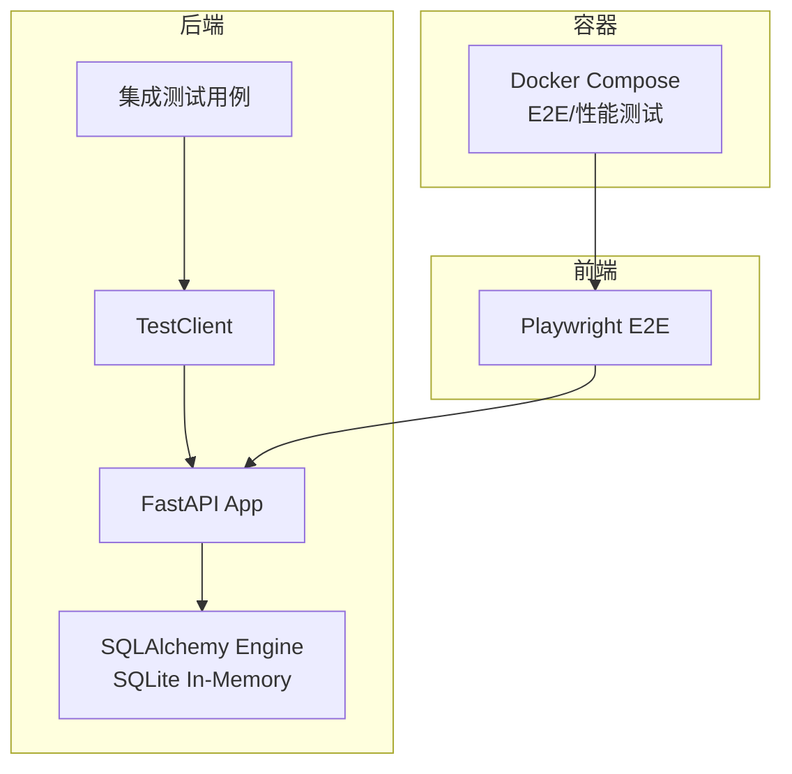
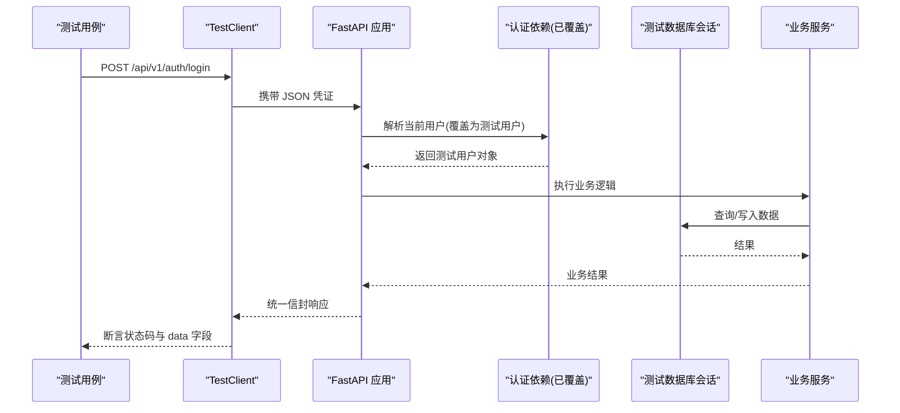
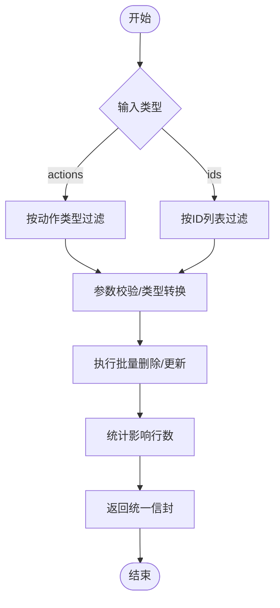
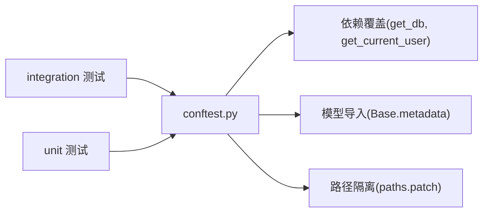

# 集成测试

<cite>
**本文引用的文件**
- [backend/tests/integration/conftest.py](file://backend/tests/integration/conftest.py)
- [backend/tests/conftest.py](file://backend/tests/conftest.py)
- [backend/tests/integration/test_auth_integration.py](file://backend/tests/integration/test_auth_integration.py)
- [backend/tests/integration/test_users_integration.py](file://backend/tests/integration/test_users_integration.py)
- [backend/tests/integration/test_audit_integration.py](file://backend/tests/integration/test_audit_integration.py)
- [backend/tests/test_batch_operations.py](file://backend/tests/test_batch_operations.py)
- [docker/docker-compose.e2e.yml](file://docker/docker-compose.e2e.yml)
- [frontend/tests/e2e/flows/message.spec.ts](file://frontend/tests/e2e/flows/message.spec.ts)
</cite>

## 目录
1. [简介](#简介)
2. [项目结构](#项目结构)
3. [核心组件](#核心组件)
4. [架构总览](#架构总览)
5. [详细组件分析](#详细组件分析)
6. [依赖关系分析](#依赖关系分析)
7. [性能考虑](#性能考虑)
8. [故障排查指南](#故障排查指南)
9. [结论](#结论)
10. [附录](#附录)

## 简介
本文件面向“集成测试”的编写与落地，覆盖以下目标：
- API 集成测试：使用 TestClient 发起 HTTP 请求、构造认证头、验证响应信封与业务字段。
- 数据库集成测试：基于内存 SQLite + SQLAlchemy 会话隔离，确保每个测试独立、可回滚。
- 外部服务集成测试：通过 Mock/桩替换外部依赖（如缓存、第三方接口），并给出契约测试建议。
- 异步 API 集成测试：结合 Playwright E2E 对 WebSocket/SSE/长连接进行端到端验证。
- 测试环境管理：Docker Compose 编排 E2E/性能测试容器，统一环境变量与数据准备。
- 最佳实践：测试数据策略、并发隔离、性能基线、故障注入等。
- 复杂业务场景：基于工作流与批量操作测试，演示跨模块、跨表的集成验证方法。

## 项目结构
后端集成测试集中在 backend/tests/integration，共享夹具在 conftest；根级 conftest 提供全局测试隔离（数据库、上传目录、路径重定向、模型导入）。前端 E2E 使用 Playwright，配合 Docker Compose 启动被测系统并执行浏览器自动化。

图表来源
- [backend/tests/integration/conftest.py:47-212](file://backend/tests/integration/conftest.py#L47-L212)
- [backend/tests/conftest.py:393-450](file://backend/tests/conftest.py#L393-L450)
- [docker/docker-compose.e2e.yml:7-35](file://docker/docker-compose.e2e.yml#L7-L35)

章节来源
- [backend/tests/integration/conftest.py:1-313](file://backend/tests/integration/conftest.py#L1-L313)
- [backend/tests/conftest.py:1-737](file://backend/tests/conftest.py#L1-L737)
- [docker/docker-compose.e2e.yml:1-63](file://docker/docker-compose.e2e.yml#L1-L63)

## 核心组件
- 测试客户端与依赖覆盖：通过 FastAPI TestClient 与 dependency_overrides 将 get_db、get_current_user 等依赖替换为测试实现，保证请求链路走内存库与模拟用户。
- 数据库夹具：创建内存 SQLite 引擎、会话工厂，并在每个测试前后建表/清理，必要时使用嵌套事务回滚。
- 认证夹具：生成管理员/普通用户、登录获取 token、构造 Authorization 请求头。
- E2E 环境：Docker Compose 启动被测服务，运行 Playwright 脚本验证页面与实时通信。

章节来源
- [backend/tests/integration/conftest.py:59-212](file://backend/tests/integration/conftest.py#L59-L212)
- [backend/tests/integration/conftest.py:215-313](file://backend/tests/integration/conftest.py#L215-L313)
- [backend/tests/conftest.py:393-450](file://backend/tests/conftest.py#L393-L450)
- [docker/docker-compose.e2e.yml:7-35](file://docker/docker-compose.e2e.yml#L7-L35)

## 架构总览
下图展示一次带认证的 API 集成测试调用链：测试用例通过 TestClient 发送请求，FastAPI 路由解析后进入业务逻辑，依赖被替换为测试数据库与会话，最终返回统一信封格式响应。

图表来源
- [backend/tests/integration/conftest.py:67-108](file://backend/tests/integration/conftest.py#L67-L108)
- [backend/tests/integration/conftest.py:131-173](file://backend/tests/integration/conftest.py#L131-L173)
- [backend/tests/integration/test_auth_integration.py:10-23](file://backend/tests/integration/test_auth_integration.py#L10-L23)

## 详细组件分析

### API 集成测试（TestClient、HTTP 请求模拟、响应验证）
- 使用 TestClient 直接调用 FastAPI 应用，无需启动真实服务器进程。
- 通过 fixture 注入 admin_token/user_token 和 headers，模拟不同角色访问受保护资源。
- 响应验证遵循统一信封格式，检查 status_code、data 字段、分页信息、错误消息关键字等。

示例要点（以源码路径为准）：
- 登录成功断言：状态码、code、message、data.user.role 等。
- 注册/登出/刷新令牌：覆盖正常与异常分支。
- 用户资料更新：断言部分更新与持久化生效。

章节来源
- [backend/tests/integration/test_auth_integration.py:10-169](file://backend/tests/integration/test_auth_integration.py#L10-L169)
- [backend/tests/integration/test_users_integration.py:10-55](file://backend/tests/integration/test_users_integration.py#L10-L55)
- [backend/tests/integration/test_users_integration.py:67-119](file://backend/tests/integration/test_users_integration.py#L67-L119)

### 数据库集成测试（隔离、数据准备、事务回滚）
- 隔离：每个测试前创建所有表，结束后 drop_all；同时恢复原始依赖覆盖与环境变量，避免污染。
- 数据准备：通过 fixtures 创建管理员/普通用户，或直接在测试中插入记录并 flush/refresh。
- 事务回滚：审计测试使用外层事务+嵌套 savepoint，测试结束统一 rollback，确保零残留。

关键实现位置：
- 内存引擎与会话工厂、依赖覆盖、鉴权覆盖。
- 审计测试中的 _engine/_db/_client 模块级夹具，以及 after_transaction_end 事件重启嵌套事务。

章节来源
- [backend/tests/integration/conftest.py:47-197](file://backend/tests/integration/conftest.py#L47-L197)
- [backend/tests/integration/test_audit_integration.py:26-85](file://backend/tests/integration/test_audit_integration.py#L26-L85)
- [backend/tests/integration/test_audit_integration.py:94-153](file://backend/tests/integration/test_audit_integration.py#L94-L153)

### 外部服务集成测试（Mock 服务器、WireMock、契约测试）
- 在本仓库中，后端集成测试主要通过依赖覆盖与内存库隔离外部副作用（如缓存、第三方调用）。
- 对于需要稳定契约的外部服务，建议使用 WireMock 或本地 Mock Server，固定响应模式，校验请求体/头部/状态码。
- 契约测试建议：
  - 定义消费者驱动契约（如 OpenAPI/JSON Schema），在服务端变更时触发契约校验。
  - 在 CI 中启动 Mock 服务，运行消费者测试，确保接口约定不被破坏。

（本节为通用实践说明，不直接引用具体代码文件）

### 异步 API 集成测试（WebSocket、SSE、长连接）
- 前端 E2E 使用 Playwright 监听 WebSocket 事件，验证页面加载时是否建立 ws 连接，并断言 URL 包含 ws 协议。
- 对于 SSE/长轮询，可在 E2E 中监听网络事件或订阅服务端推送通道，断言消息到达与 UI 更新。

章节来源
- [frontend/tests/e2e/flows/message.spec.ts:323-337](file://frontend/tests/e2e/flows/message.spec.ts#L323-L337)

### 测试环境管理（Docker 容器化、测试数据、环境配置）
- Docker Compose 提供 e2e-playwright 与 locust 性能测试容器，设置环境变量（E2E_BASE_URL、用户名密码等），挂载测试脚本与前端代码。
- 后端测试通过 conftest 强制设置 DATABASE_URL、UPLOAD_DIR、SECRET_KEY 等，确保进程内隔离。
- 建议在 CI 中使用 profiles 选择 e2e/performance/full 组合，按需拉起依赖服务。

章节来源
- [docker/docker-compose.e2e.yml:7-35](file://docker/docker-compose.e2e.yml#L7-L35)
- [backend/tests/conftest.py:6-27](file://backend/tests/conftest.py#L6-L27)
- [backend/tests/conftest.py:70-99](file://backend/tests/conftest.py#L70-L99)

### 复杂业务场景（工作流与批量操作）
- 批量删除审计日志：按 actions 列表或 ids 批量删除，支持字符串 ID 自动转换、空 actions 不删除、ids 优先级高于 actions。
- 批量更新/导出/验证：对指定表名与主键集合执行批量操作，断言成功计数与返回结构。
- 权限控制：非管理员调用批量删除应被拒绝（401/403），未认证访问也应受限。

图表来源
- [backend/tests/integration/test_audit_integration.py:182-303](file://backend/tests/integration/test_audit_integration.py#L182-L303)
- [backend/tests/test_batch_operations.py:41-117](file://backend/tests/test_batch_operations.py#L41-L117)

章节来源
- [backend/tests/integration/test_audit_integration.py:158-389](file://backend/tests/integration/test_audit_integration.py#L158-L389)
- [backend/tests/test_batch_operations.py:13-117](file://backend/tests/test_batch_operations.py#L13-L117)

## 依赖关系分析
- 测试夹具与应用的耦合点：dependency_overrides 覆盖 get_db、get_current_user、get_current_active_user，确保请求链路走测试数据库与模拟用户。
- 模型注册：导入 app.models 子模块，确保 Base.metadata 完整，避免懒加载导致的 mapper 初始化失败。
- 路径隔离：monkeypatch paths.get_project_backend_dir，将所有数据/备份/缓存/上传路径指向临时目录，避免污染真实环境。

图表来源
- [backend/tests/integration/conftest.py:131-173](file://backend/tests/integration/conftest.py#L131-L173)
- [backend/tests/conftest.py:101-113](file://backend/tests/conftest.py#L101-L113)
- [backend/tests/conftest.py:88-99](file://backend/tests/conftest.py#L88-L99)

章节来源
- [backend/tests/integration/conftest.py:131-173](file://backend/tests/integration/conftest.py#L131-L173)
- [backend/tests/conftest.py:88-113](file://backend/tests/conftest.py#L88-L113)

## 性能考虑
- 基准与指标：参考性能需求文档，设定 P95/P99 响应时间、吞吐量、错误率等验收标准。
- 工具与场景：使用 Locust 进行负载/压力测试，覆盖查询、分页、导出、搜索、快速请求等场景。
- 监控与稳定性：结合 7×24 小时稳定性脚本，持续观察 CPU/内存/磁盘/网络利用率，识别瓶颈与泄漏。
- 测试数据规模：在性能测试中准备足够的数据量（用户、项目、交易等），确保结果具备代表性。

章节来源
- [docs/03-开发文档/05-性能优化/性能需求.md:1-173](file://docs/03-开发文档/05-性能优化/性能需求.md#L1-L173)
- [docs/test-report-gb25000.md:148-199](file://docs/test-report-gb25000.md#L148-L199)

## 故障排查指南
- 数据库损坏/写错库：确认 DATABASE_URL 指向内存或隔离文件；确保任何模块导入前已设置环境变量；必要时清理遗留 test.db。
- 并发与事件循环敏感：将依赖 mock/TestClient 的测试提前执行，避免其他测试破坏事件循环或 mapper 状态。
- 认证失效：检查 dependency_overrides 是否正确覆盖 get_current_user/get_current_active_user；确认 token 生成与黑名单机制在测试下行为一致。
- 路径问题：若涉及备份/缓存/上传，确认 monkeypatch 生效，避免写入真实路径。

章节来源
- [backend/tests/conftest.py:42-49](file://backend/tests/conftest.py#L42-L49)
- [backend/tests/conftest.py:121-147](file://backend/tests/conftest.py#L121-L147)
- [backend/tests/integration/conftest.py:112-197](file://backend/tests/integration/conftest.py#L112-L197)

## 结论
本项目提供了完善的集成测试基础设施：通过 TestClient 与依赖覆盖实现 API 层集成测试；利用内存 SQLite 与事务回滚保障数据库隔离；借助 Docker Compose 与 Playwright 完成 E2E 与异步通信验证；并以批量操作与工作流测试覆盖复杂业务场景。配合性能需求与稳定性监控，可形成从单元到端到端的完整质量保障体系。

## 附录
- 常用夹具清单
  - client：FastAPI 测试客户端（无认证）
  - auth_client/client_with_mocked_auth：带模拟认证的客户端
  - admin_headers/user_headers：不同角色的 Authorization 头
  - db/real_db_session：内存数据库会话
  - admin_user/normal_user：测试用户数据
- 推荐实践
  - 测试数据策略：使用唯一后缀/UUID 避免冲突；优先使用工厂或夹具集中管理。
  - 并发隔离：autouse 夹具在每个测试前后清理全局状态与依赖覆盖。
  - 故障注入：通过 patch 外部依赖（如速率限制、缓存）验证异常分支。
  - 契约测试：对外部服务引入 WireMock，固定响应并校验请求契约。