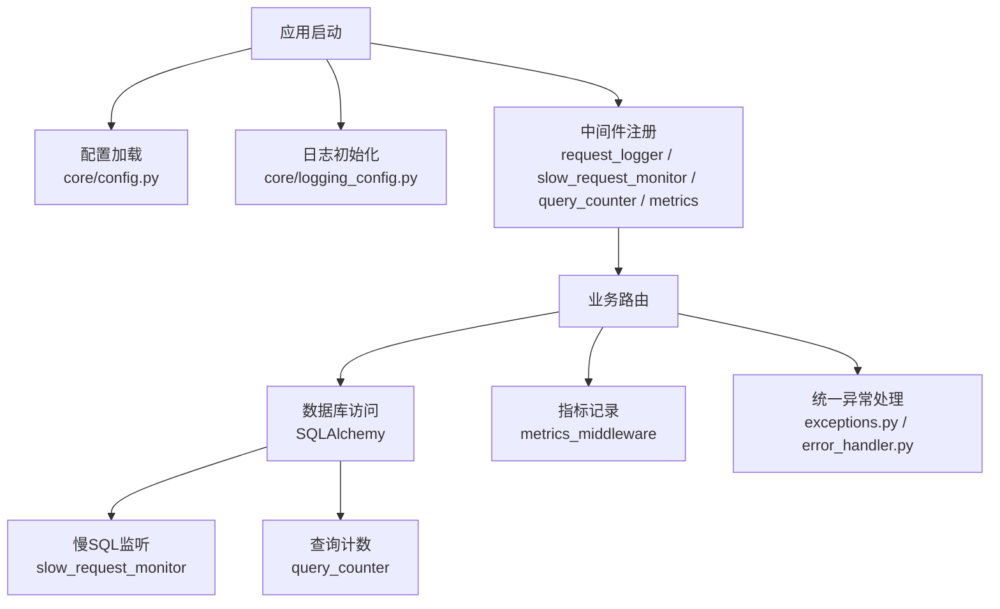
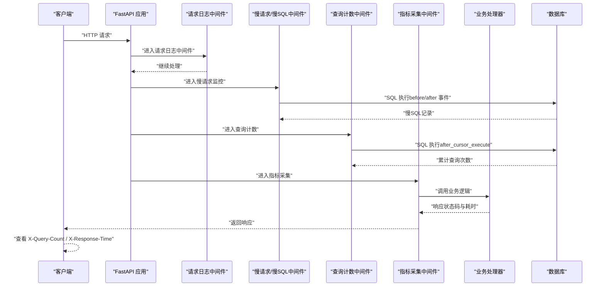
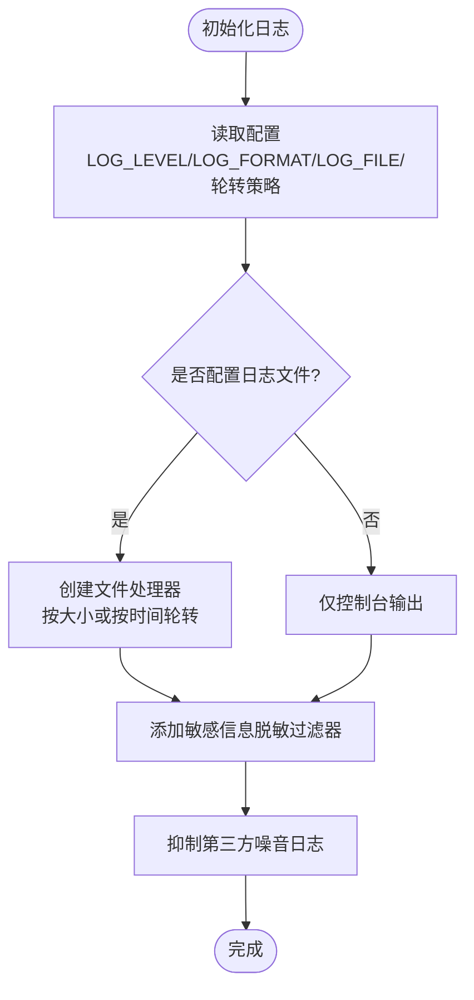
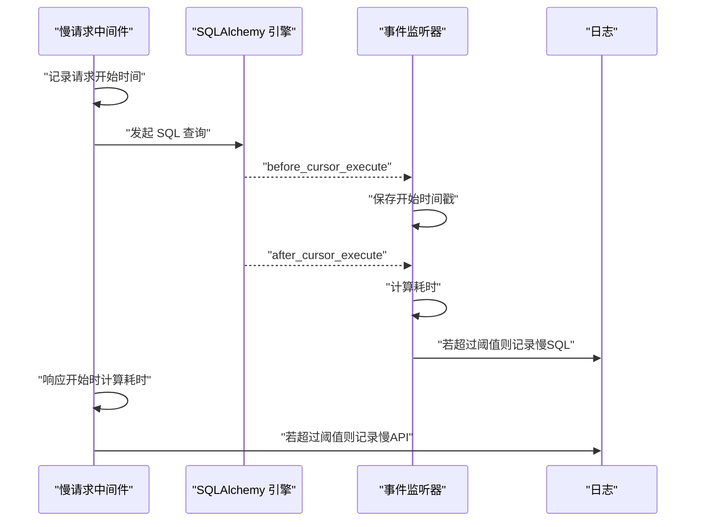
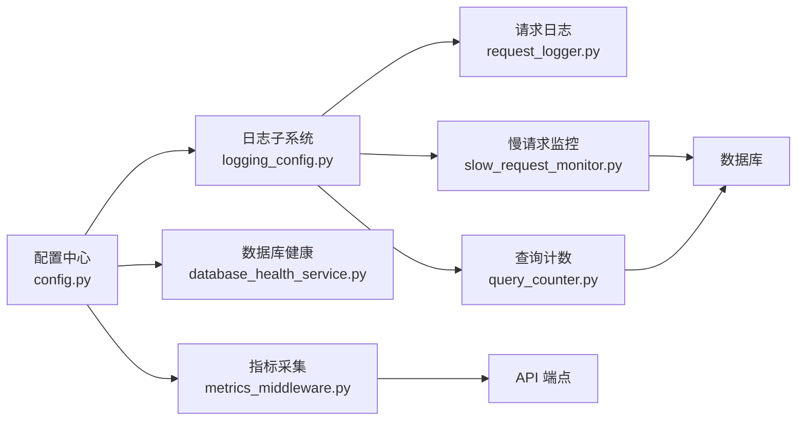

# 调试与故障排除

<cite>
**本文引用的文件**
- [backend/app/core/logging.py](file://backend/app/core/logging.py)
- [backend/app/core/logging_config.py](file://backend/app/core/logging_config.py)
- [backend/app/middleware/request_logger.py](file://backend/app/middleware/request_logger.py)
- [backend/app/middleware/slow_request_monitor.py](file://backend/app/middleware/slow_request_monitor.py)
- [backend/app/middleware/query_counter.py](file://backend/app/middleware/query_counter.py)
- [backend/app/middleware/metrics_middleware.py](file://backend/app/middleware/metrics_middleware.py)
- [backend/app/core/config.py](file://backend/app/core/config.py)
- [backend/scripts/performance_benchmark.py](file://backend/scripts/performance_benchmark.py)
- [backend/scripts/profile_api.py](file://backend/scripts/profile_api.py)
- [backend/app/services/database_health_service.py](file://backend/app/services/database_health_service.py)
- [backend/app/core/error_handler.py](file://backend/app/core/error_handler.py)
- [backend/app/core/exceptions.py](file://backend/app/core/exceptions.py)
- [backend/scripts/diagnose_issues.py](file://backend/scripts/diagnose_issues.py)
</cite>

## 目录
1. [简介](#简介)
2. [项目结构](#项目结构)
3. [核心组件](#核心组件)
4. [架构总览](#架构总览)
5. [详细组件分析](#详细组件分析)
6. [依赖关系分析](#依赖关系分析)
7. [性能考虑](#性能考虑)
8. [故障排查指南](#故障排查指南)
9. [结论](#结论)
10. [附录](#附录)

## 简介
本章节面向运维、开发与测试人员，提供针对该乡村振兴系统的调试与故障排除完整指南。内容覆盖：
- Python 调试工具使用（含 pdb、IDE 调试、远程调试）
- 日志系统配置与使用（级别、格式化、轮转、集中式收集）
- 性能分析与优化（剖析工具、内存泄漏检测、数据库查询优化）
- 常见问题诊断（数据库连接、内存溢出、CPU 占用过高）
- 监控告警配置（系统指标、应用性能、错误告警通知）
- 标准排查流程与工具链（日志分析、堆栈跟踪、根因分析方法）

## 项目结构
后端采用 FastAPI + SQLAlchemy 的模块化架构，围绕“中间件 + 服务 + 核心库”组织代码。与调试和故障排除直接相关的模块集中在以下位置：
- 日志与结构化输出：core/logging_config.py、core/logging.py
- 请求与慢 SQL 监控：middleware/request_logger.py、middleware/slow_request_monitor.py、middleware/query_counter.py
- 指标采集：middleware/metrics_middleware.py
- 配置中心：core/config.py（包含日志、数据库、监控等关键开关）
- 性能脚本：scripts/profile_api.py、scripts/performance_benchmark.py
- 数据库健康：services/database_health_service.py
- 异常处理：core/exceptions.py、core/error_handler.py
- 诊断脚本：scripts/diagnose_issues.py

**图表来源**
- [backend/app/core/config.py:161-168](file://backend/app/core/config.py#L161-L168)
- [backend/app/core/logging_config.py:161-274](file://backend/app/core/logging_config.py#L161-L274)
- [backend/app/middleware/request_logger.py:52-114](file://backend/app/middleware/request_logger.py#L52-L114)
- [backend/app/middleware/slow_request_monitor.py:55-132](file://backend/app/middleware/slow_request_monitor.py#L55-L132)
- [backend/app/middleware/query_counter.py:39-88](file://backend/app/middleware/query_counter.py#L39-L88)
- [backend/app/middleware/metrics_middleware.py:132-177](file://backend/app/middleware/metrics_middleware.py#L132-L177)
- [backend/app/core/exceptions.py:121-145](file://backend/app/core/exceptions.py#L121-L145)

**章节来源**
- [backend/app/core/config.py:161-168](file://backend/app/core/config.py#L161-L168)
- [backend/app/core/logging_config.py:161-274](file://backend/app/core/logging_config.py#L161-L274)

## 核心组件
- 日志子系统：提供 JSON/文本格式、敏感信息脱敏、按大小或时间轮转、控制台彩色输出。通过配置项控制级别、文件路径、轮转策略与备份数量。
- 请求日志中间件：记录 HTTP 方法、路径、查询参数、客户端 IP、User-Agent、状态码与耗时；跳过静态与健康检查路径。
- 慢请求与慢 SQL 监控：基于 ASGI 中间件与 SQLAlchemy 事件钩子，记录超过阈值的 API 与 SQL，并提供环形缓冲区与统计接口。
- 查询计数中间件：通过 contextvar 桥接 SQLAlchemy after_cursor_execute 事件，统计每个请求的 SQL 数量并写入响应头，超阈值告警。
- 指标采集中间件：在内存中维护请求计数、错误率、活跃请求数、端点耗时 Top 列表与慢请求记录，供外部系统拉取。
- 配置中心：集中管理日志、数据库、缓存、监控、告警等关键开关，支持环境变量与运行时路径修正。
- 数据库健康服务：周期性执行完整性检查、快速检查、VACUUM、索引检查与分析，提供健康状态与统计。
- 异常处理：统一业务异常类型与全局异常处理器，保证一致的错误响应格式与日志记录。

**章节来源**
- [backend/app/core/logging_config.py:75-140](file://backend/app/core/logging_config.py#L75-L140)
- [backend/app/middleware/request_logger.py:52-114](file://backend/app/middleware/request_logger.py#L52-L114)
- [backend/app/middleware/slow_request_monitor.py:55-132](file://backend/app/middleware/slow_request_monitor.py#L55-L132)
- [backend/app/middleware/query_counter.py:39-88](file://backend/app/middleware/query_counter.py#L39-L88)
- [backend/app/middleware/metrics_middleware.py:132-177](file://backend/app/middleware/metrics_middleware.py#L132-L177)
- [backend/app/core/config.py:161-168](file://backend/app/core/config.py#L161-L168)
- [backend/app/services/database_health_service.py:16-413](file://backend/app/services/database_health_service.py#L16-L413)
- [backend/app/core/exceptions.py:11-145](file://backend/app/core/exceptions.py#L11-L145)

## 架构总览
下图展示一次 HTTP 请求从进入应用到返回响应的关键路径，以及各中间件与服务的协作方式。

**图表来源**
- [backend/app/middleware/request_logger.py:52-114](file://backend/app/middleware/request_logger.py#L52-L114)
- [backend/app/middleware/slow_request_monitor.py:70-132](file://backend/app/middleware/slow_request_monitor.py#L70-L132)
- [backend/app/middleware/query_counter.py:39-88](file://backend/app/middleware/query_counter.py#L39-L88)
- [backend/app/middleware/metrics_middleware.py:132-177](file://backend/app/middleware/metrics_middleware.py#L132-L177)

## 详细组件分析

### 日志子系统
- 功能要点：
  - 支持 JSON 与文本两种格式；控制台在 TTY 下启用彩色输出。
  - 内置敏感数据过滤器，自动对身份证号、手机号、邮箱及常见密钥键值进行脱敏。
  - 支持按大小轮转（RotatingFileHandler）与按时间轮转（TimedRotatingFileHandler），并在 Windows 上重试避免 WinError 32。
  - 通过 init_logging 统一初始化，读取配置中心的 LOG_* 相关设置。
- 配置项（来自 Settings）：LOG_LEVEL、LOG_FILE、LOG_FORMAT、LOG_ROTATION、LOG_MAX_SIZE_MB、LOG_BACKUP_COUNT。
- 使用建议：
  - 开发环境可开启 DEBUG 级别；生产环境默认 INFO，关闭 DB_ECHO 防止敏感 SQL 落盘。
  - 集中式日志收集建议以 JSON 格式输出到 stdout 或文件，由日志采集器（如 Filebeat/Fluent Bit）转发至 ELK/Loki。

**图表来源**
- [backend/app/core/logging_config.py:161-274](file://backend/app/core/logging_config.py#L161-L274)
- [backend/app/core/config.py:161-168](file://backend/app/core/config.py#L161-L168)

**章节来源**
- [backend/app/core/logging_config.py:75-140](file://backend/app/core/logging_config.py#L75-L140)
- [backend/app/core/logging_config.py:161-274](file://backend/app/core/logging_config.py#L161-L274)
- [backend/app/core/config.py:161-168](file://backend/app/core/config.py#L161-L168)

### 请求日志中间件
- 功能要点：
  - 记录方法、路径、查询串、客户端 IP、User-Agent、状态码与耗时。
  - 跳过静态资源与健康检查路径，减少噪音。
  - 异常时记录错误信息与耗时，便于定位问题。
- 使用建议：
  - 结合日志轮转与集中式收集，用于审计与排障。
  - 如需更细粒度追踪，可在业务层增加结构化日志（trace_id）。

**章节来源**
- [backend/app/middleware/request_logger.py:52-114](file://backend/app/middleware/request_logger.py#L52-L114)

### 慢请求与慢 SQL 监控
- 功能要点：
  - 通过 ASGI 中间件记录超过阈值的 API 请求，并写入环形缓冲区与警告日志。
  - 通过 SQLAlchemy before/after_cursor_execute 事件捕获慢 SQL，记录语句片段与参数摘要。
  - 提供 get_slow_api_records、get_slow_sql_records、get_slow_stats 等接口用于诊断。
- 使用建议：
  - 调整 slow_api_ms 与 slow_sql_ms 阈值以适应不同环境。
  - 定期导出慢请求与慢 SQL 记录，配合索引优化与查询重构。

**图表来源**
- [backend/app/middleware/slow_request_monitor.py:70-132](file://backend/app/middleware/slow_request_monitor.py#L70-L132)

**章节来源**
- [backend/app/middleware/slow_request_monitor.py:55-132](file://backend/app/middleware/slow_request_monitor.py#L55-L132)

### 查询计数中间件
- 功能要点：
  - 使用 contextvar 将 SQLAlchemy after_cursor_execute 事件与当前请求上下文关联，累计查询次数。
  - 在响应头中注入 X-Query-Count 与 X-Response-Time，便于前端或网关侧观察。
  - 超过阈值时记录警告日志，辅助识别 N+1 查询问题。
- 使用建议：
  - 结合慢 SQL 监控，优先优化高查询次数的端点。
  - 对复杂报表类接口，考虑分页、预聚合与缓存。

**章节来源**
- [backend/app/middleware/query_counter.py:39-88](file://backend/app/middleware/query_counter.py#L39-L88)

### 指标采集中间件
- 功能要点：
  - 在内存中维护请求计数、错误计数、活跃请求数、平均耗时、Top 端点与慢请求列表。
  - 提供 get_summary 接口，便于暴露 /metrics 端点给监控系统抓取。
- 使用建议：
  - 在生产环境启用 METRICS_ENABLED，并通过 Prometheus/Grafana 可视化。
  - 关注错误率与慢请求占比，作为容量规划与扩容依据。

**章节来源**
- [backend/app/middleware/metrics_middleware.py:132-177](file://backend/app/middleware/metrics_middleware.py#L132-L177)

### 配置中心
- 功能要点：
  - 集中管理日志、数据库、缓存、监控、告警等配置项。
  - 支持环境变量与 .env 文件；生产环境强制关闭 DB_ECHO，保障安全。
  - 动态修正相对路径为绝对路径，避免权限问题。
- 使用建议：
  - 通过环境变量切换 LOG_LEVEL、LOG_FORMAT、LOG_ROTATION 等。
  - 根据部署环境调整 DB_POOL_SIZE、SLOW_QUERY_THRESHOLD_MS 等性能参数。

**章节来源**
- [backend/app/core/config.py:161-168](file://backend/app/core/config.py#L161-L168)
- [backend/app/core/config.py:296-363](file://backend/app/core/config.py#L296-L363)

### 数据库健康服务
- 功能要点：
  - 周期性执行完整性检查、快速检查、VACUUM、索引检查与分析。
  - 提供健康状态与统计信息，支持启动自检。
- 使用建议：
  - 在生产环境启用监控线程，定期检查数据库健康。
  - 当发现碎片化或索引异常时，及时执行 VACUUM 或重建索引。

**章节来源**
- [backend/app/services/database_health_service.py:16-413](file://backend/app/services/database_health_service.py#L16-L413)

### 异常处理
- 功能要点：
  - 定义统一的业务异常类型（BusinessError、ValidationError、NotFoundError 等）。
  - 注册全局异常处理器，确保一致的 JSON 错误响应格式与错误日志记录。
- 使用建议：
  - 在业务层抛出明确的异常类型，便于上层统一处理。
  - 结合日志与指标，实现错误告警与趋势分析。

**章节来源**
- [backend/app/core/exceptions.py:11-145](file://backend/app/core/exceptions.py#L11-L145)
- [backend/app/core/error_handler.py:38-108](file://backend/app/core/error_handler.py#L38-L108)

## 依赖关系分析
- 中间件之间松耦合，通过 ASGI 协议串联；每个中间件职责单一，便于独立测试与替换。
- 慢 SQL 监控与查询计数均依赖 SQLAlchemy 事件机制，需确保数据库引擎已初始化。
- 指标采集与慢请求监控共享“慢”概念但维度不同：前者侧重整体性能，后者聚焦具体 SQL。
- 配置中心被日志、数据库、监控等多处引用，是系统行为的关键枢纽。

**图表来源**
- [backend/app/core/config.py:161-168](file://backend/app/core/config.py#L161-L168)
- [backend/app/core/logging_config.py:161-274](file://backend/app/core/logging_config.py#L161-L274)
- [backend/app/middleware/slow_request_monitor.py:70-132](file://backend/app/middleware/slow_request_monitor.py#L70-L132)
- [backend/app/middleware/query_counter.py:39-88](file://backend/app/middleware/query_counter.py#L39-L88)
- [backend/app/middleware/metrics_middleware.py:132-177](file://backend/app/middleware/metrics_middleware.py#L132-L177)

**章节来源**
- [backend/app/core/config.py:161-168](file://backend/app/core/config.py#L161-L168)

## 性能考虑
- 性能剖析：
  - 使用 scripts/profile_api.py 对指定端点进行 cProfile 分析，生成 pstats 报告并用 snakeviz 可视化。
  - 使用 scripts/performance_benchmark.py 对典型 SQL 进行基准测试，对比优化前后性能。
- 内存泄漏检测：
  - 结合操作系统任务管理器或 Linux 的 top/htop、psutil 监控进程内存增长。
  - 使用 tracemalloc 或 memory_profiler 定位热点分配。
- 数据库查询优化：
  - 利用慢 SQL 监控与查询计数中间件识别瓶颈。
  - 通过数据库健康服务的索引检查与 ANALYZE 优化执行计划。
  - 合理设置 SLOW_QUERY_THRESHOLD_MS 与 DB_POOL_* 参数。

**章节来源**
- [backend/scripts/profile_api.py:67-167](file://backend/scripts/profile_api.py#L67-L167)
- [backend/scripts/performance_benchmark.py:21-149](file://backend/scripts/performance_benchmark.py#L21-L149)
- [backend/app/services/database_health_service.py:264-331](file://backend/app/services/database_health_service.py#L264-L331)

## 故障排查指南

### 调试工具使用
- pdb 调试器：
  - 在关键函数入口插入断点，运行程序后进入交互式调试。
  - 常用命令：n（下一步）、c（继续）、p（打印变量）、bt（回溯）。
- IDE 调试配置：
  - VS Code：配置 launch.json，设置断点与环境变量。
  - PyCharm：Run/Debug Configurations 中添加 Python 目标与环境变量。
- 远程调试：
  - 使用 debugpy 或 ptvsd 在远端进程附加调试器。
  - 注意网络与安全策略，限制调试端口访问。

### 日志系统配置与使用
- 日志级别：
  - 开发环境 DEBUG，生产环境 INFO；必要时临时提升级别定位问题。
- 格式化输出：
  - 生产建议使用 JSON 格式，便于集中式解析与检索。
- 日志轮转：
  - 按大小或时间轮转，避免磁盘占满；Windows 环境下使用 Safe*Handler 提高稳定性。
- 集中式日志收集：
  - 将 stdout 或文件日志通过采集器转发至 ELK/Loki，建立索引与告警规则。

**章节来源**
- [backend/app/core/logging_config.py:161-274](file://backend/app/core/logging_config.py#L161-L274)
- [backend/app/core/config.py:161-168](file://backend/app/core/config.py#L161-L168)

### 性能分析与优化
- 性能剖析工具：
  - cProfile + pstats + snakeviz 可视化函数耗时。
  - 使用 profile_api.py 批量分析核心端点。
- 内存泄漏检测：
  - 使用 tracemalloc 或 memory_profiler 定位内存增长热点。
  - 结合 GC 统计与对象生命周期分析。
- 数据库查询优化：
  - 通过慢 SQL 监控与查询计数中间件识别问题。
  - 优化索引、重写查询、引入缓存与分页。

**章节来源**
- [backend/scripts/profile_api.py:67-167](file://backend/scripts/profile_api.py#L67-L167)
- [backend/app/middleware/slow_request_monitor.py:70-132](file://backend/app/middleware/slow_request_monitor.py#L70-L132)
- [backend/app/middleware/query_counter.py:39-88](file://backend/app/middleware/query_counter.py#L39-L88)

### 常见问题诊断
- 数据库连接问题：
  - 检查 DATABASE_URL 与连接池参数；使用数据库健康服务进行快速检查。
  - 观察慢 SQL 与查询计数，识别连接耗尽原因。
- 内存溢出：
  - 监控进程内存使用，结合 tracemalloc 定位热点。
  - 优化大数据集处理，避免一次性加载全部结果。
- CPU 占用过高：
  - 使用 cProfile 剖析热点函数，优化算法复杂度。
  - 检查是否存在死循环或频繁重算。

**章节来源**
- [backend/app/services/database_health_service.py:186-222](file://backend/app/services/database_health_service.py#L186-L222)
- [backend/scripts/diagnose_issues.py:13-96](file://backend/scripts/diagnose_issues.py#L13-L96)

### 监控告警配置
- 系统指标监控：
  - 启用 METRICS_ENABLED，暴露 /metrics 端点，接入 Prometheus/Grafana。
- 应用性能监控：
  - 结合慢请求与慢 SQL 监控，设置阈值告警。
- 错误告警通知：
  - 配置 ALERT_WEBHOOK_URL 与 SMTP 参数，实现邮件或 Webhook 通知。

**章节来源**
- [backend/app/core/config.py:185-198](file://backend/app/core/config.py#L185-L198)
- [backend/app/middleware/metrics_middleware.py:132-177](file://backend/app/middleware/metrics_middleware.py#L132-L177)

### 标准排查流程与工具链
- 日志分析：
  - 通过日志级别与格式化输出，快速定位错误与异常。
  - 使用集中式日志平台进行检索与关联分析。
- 堆栈跟踪：
  - 利用全局异常处理器记录的堆栈信息，定位问题根源。
- 根因分析方法：
  - 结合慢 SQL 监控、查询计数与指标采集，逐步缩小范围。
  - 使用诊断脚本验证数据一致性与业务逻辑。

**章节来源**
- [backend/app/core/exceptions.py:121-145](file://backend/app/core/exceptions.py#L121-L145)
- [backend/scripts/diagnose_issues.py:13-96](file://backend/scripts/diagnose_issues.py#L13-L96)

## 结论
本指南围绕日志、监控、性能与异常处理构建了完整的调试与故障排除体系。通过中间件与服务的协同，系统能够实时感知性能瓶颈与异常状况，并提供丰富的诊断工具与脚本。建议在生产环境中启用集中式日志与指标采集，结合告警机制实现主动运维。

## 附录
- 常用命令参考：
  - 性能剖析：python backend/scripts/profile_api.py --endpoint /api/v1/funds --count 100 --output funds.pstats
  - 基准测试：python backend/scripts/performance_benchmark.py --iterations 10
  - 诊断脚本：python backend/scripts/diagnose_issues.py
- 配置项速查：
  - 日志：LOG_LEVEL、LOG_FILE、LOG_FORMAT、LOG_ROTATION、LOG_MAX_SIZE_MB、LOG_BACKUP_COUNT
  - 数据库：DATABASE_URL、DB_POOL_SIZE、SLOW_QUERY_THRESHOLD_MS
  - 监控：METRICS_ENABLED、METRICS_PORT
  - 告警：ALERT_WEBHOOK_URL、SMTP_*