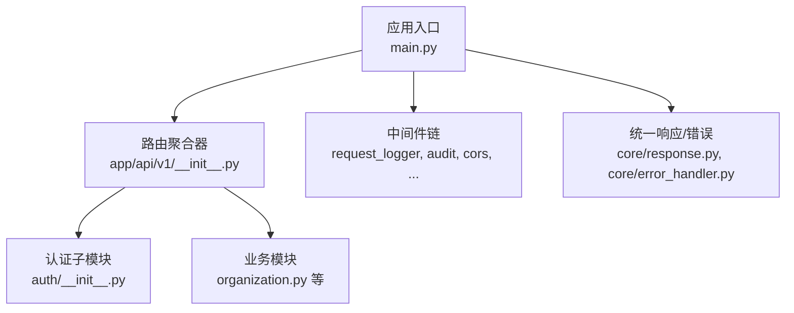
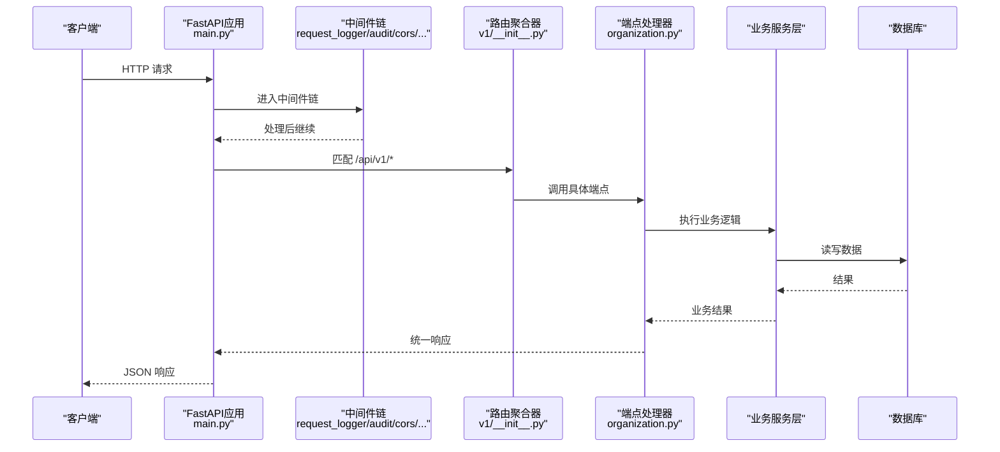
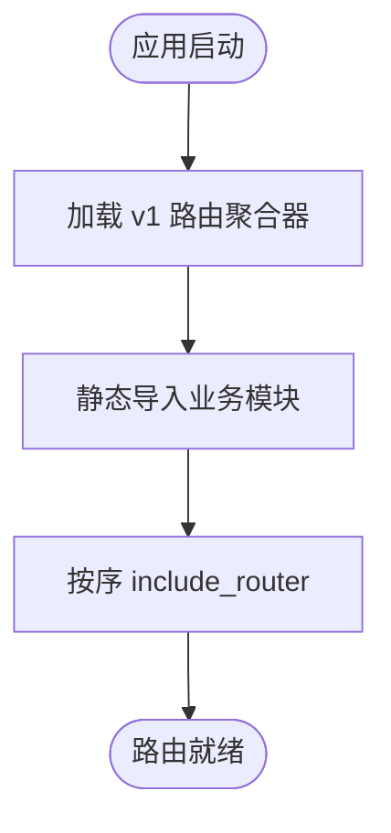
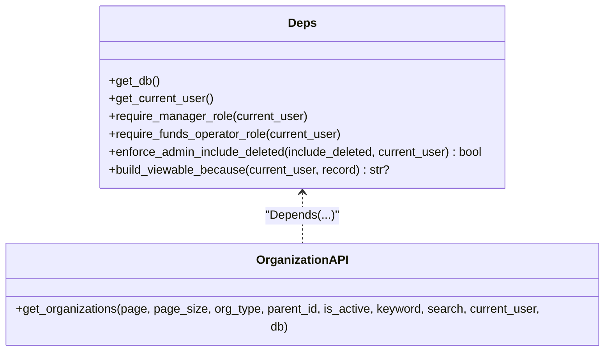
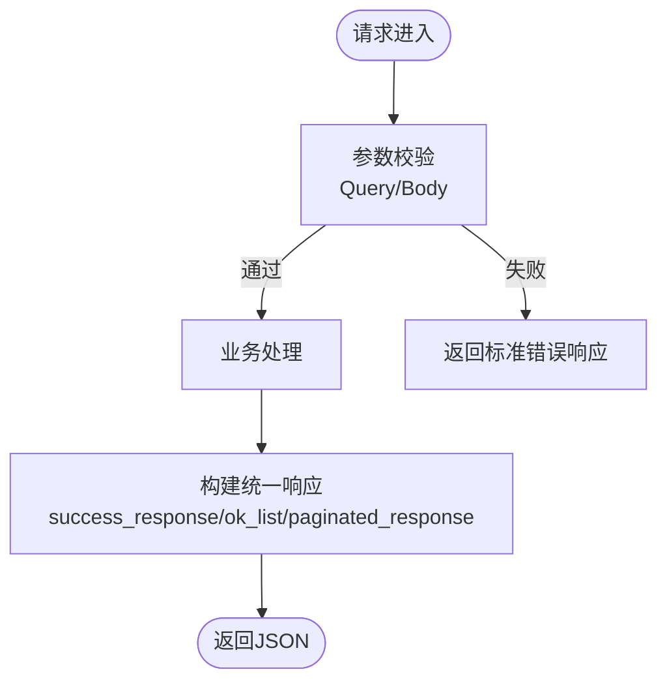
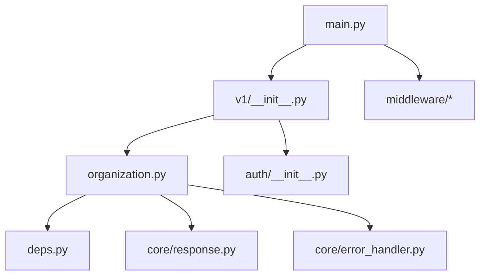

# API层设计

<cite>
**本文引用的文件**
- [backend/app/main.py](file://backend/app/main.py)
- [backend/app/api/__init__.py](file://backend/app/api/__init__.py)
- [backend/app/api/v1/__init__.py](file://backend/app/api/v1/__init__.py)
- [backend/app/api/v1/deps.py](file://backend/app/api/v1/deps.py)
- [backend/app/api/v1/auth/__init__.py](file://backend/app/api/v1/auth/__init__.py)
- [backend/app/api/v1/organization.py](file://backend/app/api/v1/organization.py)
- [backend/app/core/response.py](file://backend/app/core/response.py)
- [backend/app/core/error_handler.py](file://backend/app/core/error_handler.py)
- [backend/app/middleware/request_logger.py](file://backend/app/middleware/request_logger.py)
</cite>

## 目录
1. [简介](#简介)
2. [项目结构](#项目结构)
3. [核心组件](#核心组件)
4. [架构总览](#架构总览)
5. [详细组件分析](#详细组件分析)
6. [依赖关系分析](#依赖关系分析)
7. [性能考量](#性能考量)
8. [故障排查指南](#故障排查指南)
9. [结论](#结论)
10. [附录](#附录)

## 简介
本文件聚焦后端API层设计，围绕FastAPI路由组织、v1接口目录布局、请求参数验证、响应格式标准化、权限检查、错误处理、路由注册机制、依赖注入、中间件执行顺序展开。同时给出RESTful规范、版本控制策略、API文档自动生成实践，并提供创建新端点的步骤与示例路径，说明与业务服务层的交互模式以及异步操作和后台任务的处理方式。

## 项目结构
- 应用入口与生命周期：在应用启动时初始化数据库、迁移、监控、任务队列等，并统一注册异常处理器与中间件。
- 路由聚合：所有业务路由集中在 app.api.v1 下，通过统一的 v1/__init__.py 静态导入并按序注册到 api_v1_router（前缀 /api/v1）。
- 子模块包：认证、数据、导入导出、系统、监控等按功能划分到子目录，便于维护与扩展。
- 依赖注入：统一的数据库会话、当前用户、角色校验等依赖项集中在 deps.py 中暴露。
- 响应与错误：统一的成功/失败响应封装与错误构造器，保证前后端契约一致。
- 中间件：请求日志、审计、CORS、安全头、CSRF、驼峰转换、缓存头、请求体大小限制、慢请求监控、查询计数等。

图示来源
- [backend/app/main.py:100-181](file://backend/app/main.py#L100-L181)
- [backend/app/api/v1/__init__.py:29-148](file://backend/app/api/v1/__init__.py#L29-L148)
- [backend/app/api/v1/auth/__init__.py:16-24](file://backend/app/api/v1/auth/__init__.py#L16-L24)
- [backend/app/api/v1/organization.py:30-185](file://backend/app/api/v1/organization.py#L30-L185)
- [backend/app/core/response.py:63-178](file://backend/app/core/response.py#L63-L178)
- [backend/app/core/error_handler.py:38-108](file://backend/app/core/error_handler.py#L38-L108)

章节来源
- [backend/app/main.py:100-181](file://backend/app/main.py#L100-L181)
- [backend/app/api/__init__.py:1-6](file://backend/app/api/__init__.py#L1-L6)
- [backend/app/api/v1/__init__.py:29-148](file://backend/app/api/v1/__init__.py#L29-L148)

## 核心组件
- 路由注册机制
  - 在 main.py 中创建 FastAPI 实例，配置标题、版本、文档URL，并注册全局异常处理器。
  - 通过 include_router 将 v1 路由聚合器挂载到应用，实现 /api/v1/* 的统一前缀。
  - v1/__init__.py 使用静态导入各业务模块，确保打包环境可追踪且快速失败。
- 依赖注入
  - 数据库会话 get_db、当前用户 get_current_user、角色校验 require_manager_role 等集中在 deps.py。
  - 端点通过 Depends 声明式注入，避免硬编码获取逻辑。
- 请求参数验证
  - 使用 Pydantic 模型定义请求体与响应体；Query/Path 参数配合类型与约束进行自动校验。
- 响应格式标准化
  - success_response、ok_list、paginated_response 提供统一成功响应结构；error_response 提供统一错误结构。
- 权限检查
  - 基于角色的访问控制：require_manager_role、require_funds_operator_role、enforce_admin_include_deleted 等。
- 错误处理
  - 统一错误构造器与HTTP异常抛出；业务异常类集中管理。
- 中间件执行顺序
  - 添加顺序与执行顺序相反；从最外层到最内层依次执行，确保链路追踪、审计、日志、CORS、安全头等生效。

章节来源
- [backend/app/main.py:100-181](file://backend/app/main.py#L100-L181)
- [backend/app/api/v1/__init__.py:29-148](file://backend/app/api/v1/__init__.py#L29-L148)
- [backend/app/api/v1/deps.py:1-103](file://backend/app/api/v1/deps.py#L1-L103)
- [backend/app/core/response.py:63-178](file://backend/app/core/response.py#L63-L178)
- [backend/app/core/error_handler.py:38-108](file://backend/app/core/error_handler.py#L38-L108)

## 架构总览
下图展示一次典型请求的完整处理流程：从客户端进入，经过中间件链，到达路由处理器，调用服务层完成业务逻辑，最后以统一响应返回。

图示来源
- [backend/app/main.py:100-181](file://backend/app/main.py#L100-L181)
- [backend/app/api/v1/__init__.py:29-148](file://backend/app/api/v1/__init__.py#L29-L148)
- [backend/app/api/v1/organization.py:126-185](file://backend/app/api/v1/organization.py#L126-L185)

## 详细组件分析

### 路由注册与版本控制
- 版本策略：所有业务API统一位于 /api/v1，便于后续演进至 /api/v2 而不破坏现有客户端。
- 路由聚合：v1/__init__.py 静态导入各模块并按序注册，确保路由匹配优先级可控（如 supported_village_export 先于 supported_village）。
- 子模块包：认证相关路由聚合在 auth/__init__.py，包含登录、用户管理、RBAC、双因素等。

图示来源
- [backend/app/api/v1/__init__.py:29-148](file://backend/app/api/v1/__init__.py#L29-L148)
- [backend/app/api/v1/auth/__init__.py:16-24](file://backend/app/api/v1/auth/__init__.py#L16-L24)

章节来源
- [backend/app/api/v1/__init__.py:29-148](file://backend/app/api/v1/__init__.py#L29-L148)
- [backend/app/api/v1/auth/__init__.py:16-24](file://backend/app/api/v1/auth/__init__.py#L16-L24)

### 依赖注入与权限检查
- 依赖项集中管理：deps.py 暴露 get_db、get_current_user、角色校验函数。
- 权限策略：
  - require_manager_role：要求管理员或超级管理员。
  - require_funds_operator_role：允许 user 及以上角色操作经费管理，viewer 只读。
  - enforce_admin_include_deleted：非管理员传入 include_deleted=true 时静默降级为 False，防止越权查看软删记录。
  - build_viewable_because：为已软删记录生成可见性元数据，便于前端展示“admin”原因。

图示来源
- [backend/app/api/v1/deps.py:1-103](file://backend/app/api/v1/deps.py#L1-L103)
- [backend/app/api/v1/organization.py:126-185](file://backend/app/api/v1/organization.py#L126-L185)

章节来源
- [backend/app/api/v1/deps.py:1-103](file://backend/app/api/v1/deps.py#L1-L103)
- [backend/app/api/v1/organization.py:126-185](file://backend/app/api/v1/organization.py#L126-L185)

### 请求参数验证与响应标准化
- 请求参数验证：
  - Query 参数使用类型与范围约束（如 page ge=1、page_size ge=1 le=200），由Pydantic/FastAPI自动校验。
  - 请求体验证通过 Pydantic 模型（如 OrganizationCreate/OrganizationUpdate）定义字段与可选性。
- 响应标准化：
  - 成功列表响应使用 ok_list，统一返回 {code, message, success, data:{items,total,page,page_size}}。
  - 分页响应使用 paginated_response，附加 meta.pagination。
  - 错误响应使用 error_response，统一 {code, message, success, errors/detail}。

图示来源
- [backend/app/api/v1/organization.py:126-185](file://backend/app/api/v1/organization.py#L126-L185)
- [backend/app/core/response.py:63-178](file://backend/app/core/response.py#L63-L178)

章节来源
- [backend/app/api/v1/organization.py:126-185](file://backend/app/api/v1/organization.py#L126-L185)
- [backend/app/core/response.py:63-178](file://backend/app/core/response.py#L63-L178)

### 中间件执行顺序与作用
- 添加顺序（逆序执行）：
  - 查询计数、慢请求监控、Metrics、Audit、RequestLogger、CSRF（条件）、CamelToSnake、CacheHeaders、CORS、SecurityHeaders、BodySizeLimit、RequestID。
- 作用概览：
  - RequestID：链路追踪。
  - SecurityHeaders：安全响应头。
  - CORS：跨域配置。
  - CamelToSnake：前端 camelCase → 后端 snake_case 转换。
  - CSRF：表单提交保护（按需启用）。
  - RequestLogger：请求日志记录。
  - Audit：审计日志。
  - Metrics：指标收集。
  - BodySizeLimit：请求体大小限制。
  - CacheHeaders：缓存控制头。
  - SlowRequestMiddleware：慢请求监控。
  - QueryCounterMiddleware：SQL查询次数统计。

图示来源
- [backend/app/main.py:113-165](file://backend/app/main.py#L113-L165)
- [backend/app/middleware/request_logger.py:52-114](file://backend/app/middleware/request_logger.py#L52-L114)

章节来源
- [backend/app/main.py:113-165](file://backend/app/main.py#L113-L165)
- [backend/app/middleware/request_logger.py:52-114](file://backend/app/middleware/request_logger.py#L52-L114)

### RESTful设计与API文档
- RESTful规范：
  - 资源命名采用复数名词（如 organizations）。
  - 使用标准HTTP方法：GET/POST/PUT/PATCH/DELETE。
  - 查询参数用于过滤、排序、分页；路径参数用于标识资源。
- 版本控制：
  - URL前缀 /api/v1 作为版本隔离，便于未来升级。
- API文档自动生成：
  - FastAPI内置OpenAPI/Swagger UI/ReDoc，在DEBUG模式下启用 /docs 与 /redoc。

章节来源
- [backend/app/main.py:100-109](file://backend/app/main.py#L100-L109)
- [backend/app/api/v1/organization.py:30-185](file://backend/app/api/v1/organization.py#L30-L185)

### 创建新API端点的步骤与示例路径
- 步骤：
  1) 在对应业务模块文件中定义 Pydantic 请求/响应模型。
  2) 使用 router = APIRouter(prefix="/xxx", tags=["标签"]) 创建路由。
  3) 在端点函数中使用 Depends(get_db)、Depends(get_current_user) 注入依赖。
  4) 对 Query/Path 参数使用类型与约束进行验证。
  5) 调用业务服务层完成逻辑，并使用 success_response/ok_list/paginated_response 返回。
  6) 在 v1/__init__.py 中静态导入并 include_router。
- 示例参考路径：
  - 路径参数与查询参数：[backend/app/api/v1/organization.py:126-185](file://backend/app/api/v1/organization.py#L126-L185)
  - 请求体验证模型：[backend/app/api/v1/organization.py:45-98](file://backend/app/api/v1/organization.py#L45-L98)
  - 响应模型定义：[backend/app/api/v1/organization.py:92-121](file://backend/app/api/v1/organization.py#L92-L121)
  - 路由注册：[backend/app/api/v1/__init__.py:123-140](file://backend/app/api/v1/__init__.py#L123-L140)

章节来源
- [backend/app/api/v1/organization.py:45-185](file://backend/app/api/v1/organization.py#L45-L185)
- [backend/app/api/v1/__init__.py:123-140](file://backend/app/api/v1/__init__.py#L123-L140)

### 与业务服务层的交互模式
- 端点仅负责参数校验、权限检查、调用服务层、组装响应。
- 服务层封装复杂业务逻辑、事务、缓存、异步任务调度等。
- 示例：组织列表端点通过 OrganizationService 或直连ORM查询，再使用 ok_list 返回统一分页结构。

章节来源
- [backend/app/api/v1/organization.py:126-185](file://backend/app/api/v1/organization.py#L126-L185)

### 异步操作与后台任务
- 应用启动时初始化任务队列（task_queue.start），用于异步导出等后台任务。
- 端点可通过服务层触发后台任务，返回即时响应（如任务ID），前端轮询或事件通知获取结果。
- 生命周期管理：应用关闭时停止任务队列与各类监控。

章节来源
- [backend/app/main.py:68-98](file://backend/app/main.py#L68-L98)

## 依赖关系分析
- 耦合与内聚：
  - 路由层低耦合：仅依赖依赖注入与响应工具，不直接持有数据库连接。
  - 依赖集中：deps.py 统一管理认证、授权、数据库会话。
- 外部依赖：
  - FastAPI/Starlette：路由、中间件、ASGI协议。
  - Pydantic：请求/响应模型与校验。
  - SQLAlchemy：数据库访问（通过服务层或端点内查询）。
- 循环依赖：
  - 通过静态导入与分层避免循环引用；v1/__init__.py 显式导入各模块，确保启动时快速失败。

图示来源
- [backend/app/api/v1/__init__.py:29-148](file://backend/app/api/v1/__init__.py#L29-L148)
- [backend/app/api/v1/organization.py:126-185](file://backend/app/api/v1/organization.py#L126-L185)
- [backend/app/api/v1/deps.py:1-103](file://backend/app/api/v1/deps.py#L1-L103)
- [backend/app/core/response.py:63-178](file://backend/app/core/response.py#L63-L178)
- [backend/app/core/error_handler.py:38-108](file://backend/app/core/error_handler.py#L38-L108)
- [backend/app/main.py:100-181](file://backend/app/main.py#L100-L181)

章节来源
- [backend/app/api/v1/__init__.py:29-148](file://backend/app/api/v1/__init__.py#L29-L148)
- [backend/app/api/v1/organization.py:126-185](file://backend/app/api/v1/organization.py#L126-L185)
- [backend/app/api/v1/deps.py:1-103](file://backend/app/api/v1/deps.py#L1-L103)
- [backend/app/core/response.py:63-178](file://backend/app/core/response.py#L63-L178)
- [backend/app/core/error_handler.py:38-108](file://backend/app/core/error_handler.py#L38-L108)
- [backend/app/main.py:100-181](file://backend/app/main.py#L100-L181)

## 性能考量
- 中间件开销：尽量保持中间件轻量，避免阻塞I/O；慢请求监控有助于定位瓶颈。
- 查询优化：合理使用索引与分页；对高频只读列表使用缓存（如仪表盘缓存失效策略）。
- 响应体积：仅返回必要字段，避免大对象序列化。
- 异步任务：将耗时操作（导出、报表生成）放入后台任务队列，提升接口响应速度。

## 故障排查指南
- 常见问题：
  - 404：路径尾部斜杠重定向修复已在应用层处理；确认路由注册顺序与路径匹配。
  - 403：权限不足，检查依赖注入的角色校验逻辑。
  - 422：参数校验失败，检查Query/Path/Body模型定义与约束。
  - 500：服务端异常，查看日志与错误响应中的 detail。
- 调试建议：
  - 启用 /docs 查看接口定义与示例。
  - 使用 RequestLogger 输出请求/响应信息。
  - 结合慢请求监控与查询计数定位性能问题。

章节来源
- [backend/app/main.py:195-204](file://backend/app/main.py#L195-L204)
- [backend/app/api/v1/deps.py:19-72](file://backend/app/api/v1/deps.py#L19-L72)
- [backend/app/middleware/request_logger.py:52-114](file://backend/app/middleware/request_logger.py#L52-L114)
- [backend/app/core/error_handler.py:38-108](file://backend/app/core/error_handler.py#L38-L108)

## 结论
本API层设计通过清晰的路由组织、严格的参数验证、统一的响应格式、完善的权限与错误处理、合理的中间件链与依赖注入，构建了可扩展、易维护、高性能的RESTful接口体系。版本化前缀与自动文档提升了协作效率，异步任务与监控能力保障了生产稳定性。

## 附录
- 新增端点清单模板（示例路径）：
  - 路径参数：[backend/app/api/v1/organization.py:126-185](file://backend/app/api/v1/organization.py#L126-L185)
  - 查询参数：[backend/app/api/v1/organization.py:126-185](file://backend/app/api/v1/organization.py#L126-L185)
  - 请求体验证：[backend/app/api/v1/organization.py:45-98](file://backend/app/api/v1/organization.py#L45-L98)
  - 响应模型：[backend/app/api/v1/organization.py:92-121](file://backend/app/api/v1/organization.py#L92-L121)
  - 路由注册：[backend/app/api/v1/__init__.py:123-140](file://backend/app/api/v1/__init__.py#L123-L140)
- 中间件参考：
  - 请求日志：[backend/app/middleware/request_logger.py:52-114](file://backend/app/middleware/request_logger.py#L52-L114)
  - 应用中间件链：[backend/app/main.py:113-165](file://backend/app/main.py#L113-L165)
- 统一响应与错误：
  - 响应封装：[backend/app/core/response.py:63-178](file://backend/app/core/response.py#L63-L178)
  - 错误构造：[backend/app/core/error_handler.py:38-108](file://backend/app/core/error_handler.py#L38-L108)