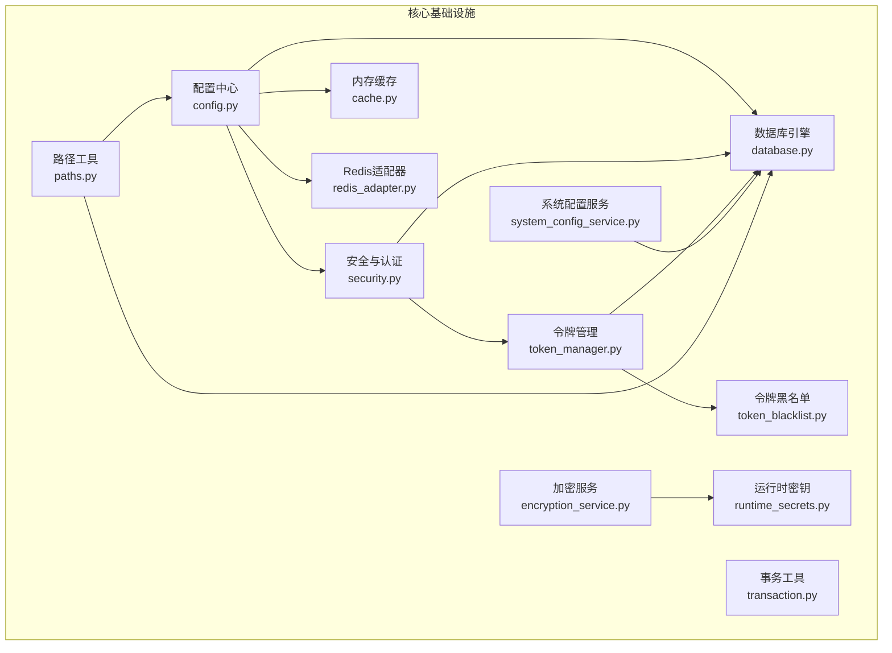
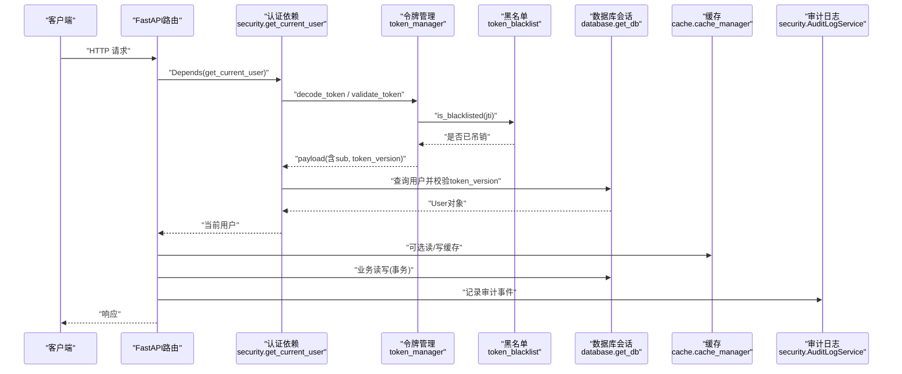
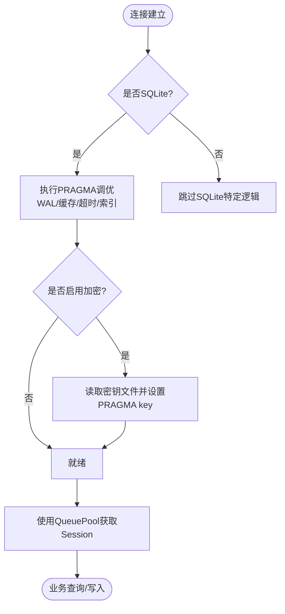
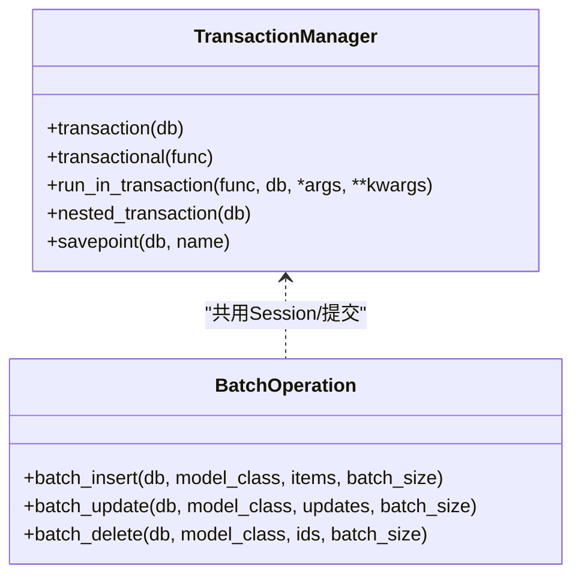
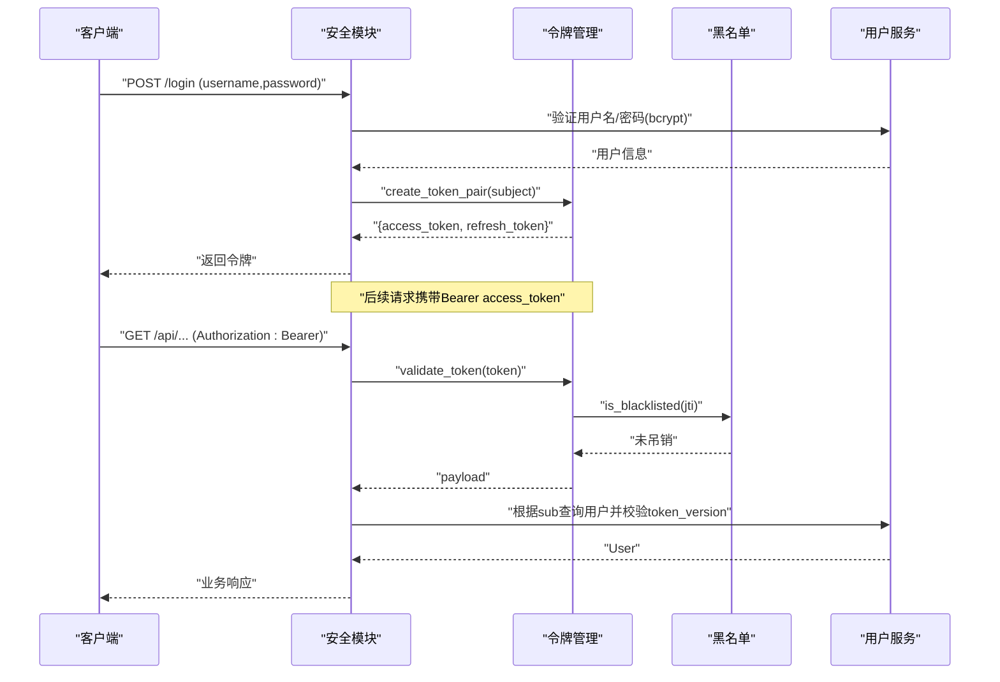
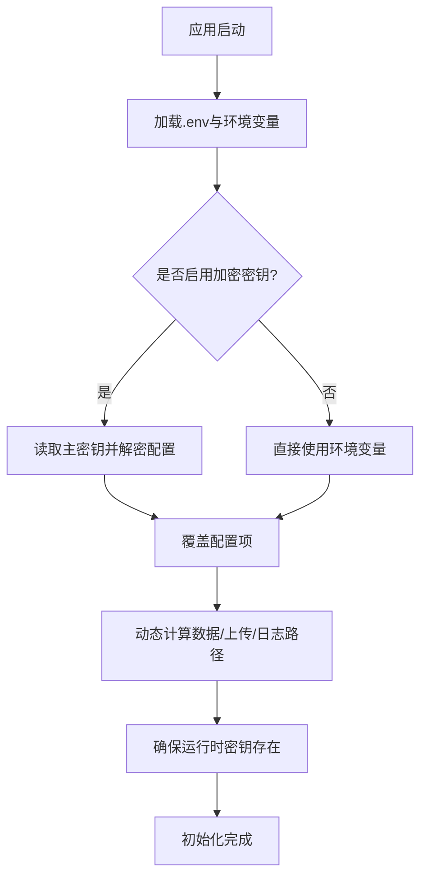
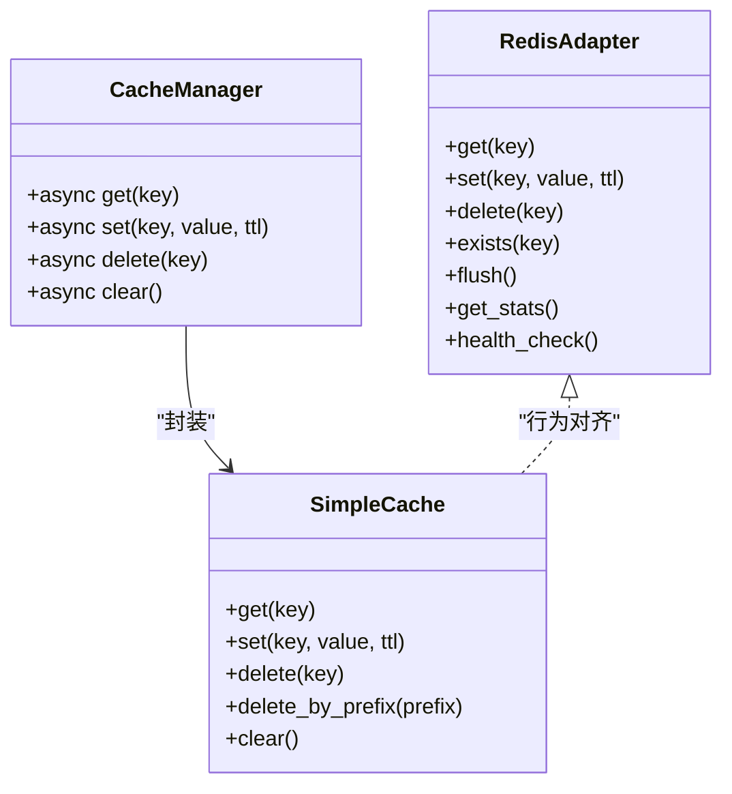
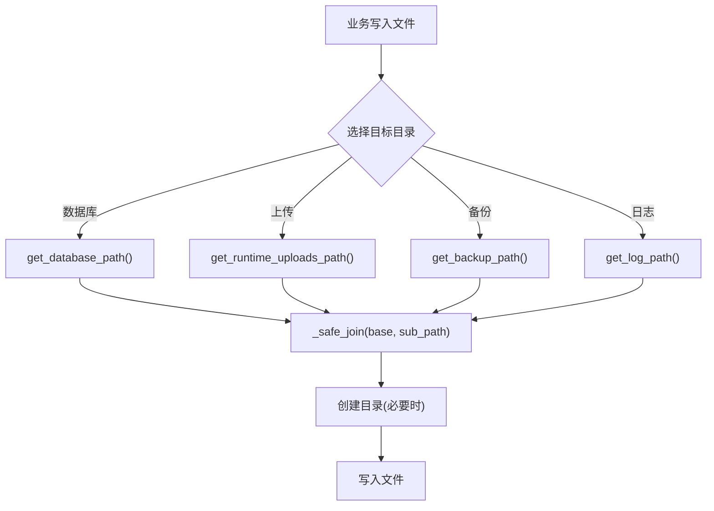
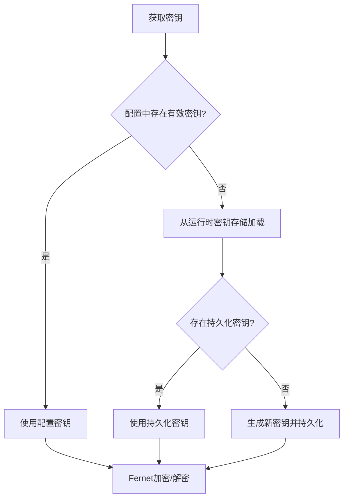
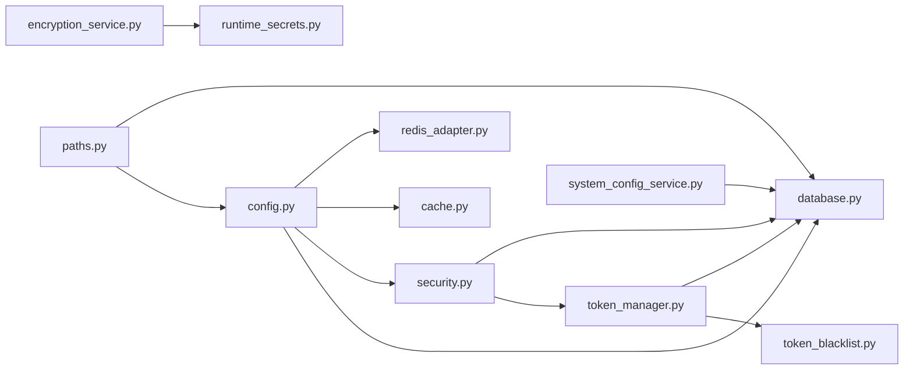

# 基础设施层

<cite>
**本文引用的文件**
- [database.py](file://backend/app/core/database.py)
- [config.py](file://backend/app/core/config.py)
- [security.py](file://backend/app/core/security.py)
- [token_manager.py](file://backend/app/core/token_manager.py)
- [token_blacklist.py](file://backend/app/core/token_blacklist.py)
- [transaction.py](file://backend/app/core/transaction.py)
- [redis_adapter.py](file://backend/app/core/redis_adapter.py)
- [cache.py](file://backend/app/core/cache.py)
- [system_config_service.py](file://backend/app/services/system_config_service.py)
- [system_config.py](file://backend/app/models/system_config.py)
- [runtime_secrets.py](file://backend/app/utils/runtime_secrets.py)
- [paths.py](file://backend/app/utils/paths.py)
- [encryption_service.py](file://backend/app/services/encryption_service.py)
</cite>

## 目录
1. [简介](#简介)
2. [项目结构](#项目结构)
3. [核心组件](#核心组件)
4. [架构总览](#架构总览)
5. [详细组件分析](#详细组件分析)
6. [依赖关系分析](#依赖关系分析)
7. [性能考量](#性能考量)
8. [故障排查指南](#故障排查指南)
9. [结论](#结论)
10. [附录：配置与示例](#附录配置与示例)

## 简介
本章节聚焦“基础设施层”的设计与实现，围绕数据库连接池与SQLAlchemy优化、安全认证（JWT、密码加密）、配置管理（环境变量读取与校验、配置文件策略）、缓存与消息队列抽象、外部API集成点、以及文件存储等能力进行系统化说明。目标是让上层业务以稳定、可观测、可扩展的方式使用这些基础能力，同时保证在离线单机场景下的健壮性与安全性。

## 项目结构
基础设施层主要位于 backend/app/core 与相关 services/utils 模块中，关键职责划分如下：
- 数据库与事务：database.py、transaction.py
- 配置与运行时密钥：config.py、runtime_secrets.py、paths.py
- 安全与认证：security.py、token_manager.py、token_blacklist.py
- 缓存与Redis适配：cache.py、redis_adapter.py
- 系统配置服务：system_config_service.py、system_config.py
- 加密与数据保护：encryption_service.py

图表来源
- [database.py:55-67](file://backend/app/core/database.py#L55-L67)
- [config.py:54-104](file://backend/app/core/config.py#L54-L104)
- [security.py:210-235](file://backend/app/core/security.py#L210-L235)
- [token_manager.py:64-127](file://backend/app/core/token_manager.py#L64-L127)
- [token_blacklist.py:27-70](file://backend/app/core/token_blacklist.py#L27-L70)
- [cache.py:14-137](file://backend/app/core/cache.py#L14-L137)
- [redis_adapter.py:7-43](file://backend/app/core/redis_adapter.py#L7-L43)
- [paths.py:90-139](file://backend/app/utils/paths.py#L90-L139)
- [runtime_secrets.py:20-93](file://backend/app/utils/runtime_secrets.py#L20-L93)
- [encryption_service.py:12-175](file://backend/app/services/encryption_service.py#L12-L175)
- [system_config_service.py:68-218](file://backend/app/services/system_config_service.py#L68-L218)

章节来源
- [database.py:1-343](file://backend/app/core/database.py#L1-L343)
- [config.py:1-383](file://backend/app/core/config.py#L1-L383)
- [security.py:1-713](file://backend/app/core/security.py#L1-L713)
- [token_manager.py:1-283](file://backend/app/core/token_manager.py#L1-L283)
- [token_blacklist.py:1-163](file://backend/app/core/token_blacklist.py#L1-L163)
- [transaction.py:1-457](file://backend/app/core/transaction.py#L1-L457)
- [redis_adapter.py:1-44](file://backend/app/core/redis_adapter.py#L1-L44)
- [cache.py:1-166](file://backend/app/core/cache.py#L1-L166)
- [system_config_service.py:1-266](file://backend/app/services/system_config_service.py#L1-L266)
- [system_config.py:1-51](file://backend/app/models/system_config.py#L1-L51)
- [runtime_secrets.py:1-179](file://backend/app/utils/runtime_secrets.py#L1-L179)
- [paths.py:1-324](file://backend/app/utils/paths.py#L1-L324)
- [encryption_service.py:1-261](file://backend/app/services/encryption_service.py#L1-L261)

## 核心组件
- 数据库连接池与SQLite深度优化：WAL模式、PRAGMA调优、长事务独占写协调器、磁盘空间检查、SQLCipher支持。
- 事务管理：上下文管理器、装饰器、保存点、批量操作、死锁重试。
- 安全认证：bcrypt密码哈希、JWT签发/验证/刷新/吊销、令牌类型校验、版本化强制下线、速率限制与安全头中间件。
- 配置管理：pydantic-settings加载.env、动态路径解析、生产环境安全降级、运行时密钥持久化。
- 缓存与消息队列：内存缓存SimpleCache与异步包装；Redis适配器在无Redis时提供无操作实现，便于统一调用。
- 系统配置服务：基于数据库的键值配置表，提供默认值、导入导出、初始化与热更新。
- 加密与数据保护：Fernet字段级加密、数据包加解密、密钥自动持久化与回退策略。
- 路径与文件存储：跨平台数据/上传/日志/备份目录统一抽象，防路径遍历。

章节来源
- [database.py:55-171](file://backend/app/core/database.py#L55-L171)
- [transaction.py:31-197](file://backend/app/core/transaction.py#L31-L197)
- [security.py:120-371](file://backend/app/core/security.py#L120-L371)
- [config.py:54-104](file://backend/app/core/config.py#L54-L104)
- [cache.py:14-137](file://backend/app/core/cache.py#L14-L137)
- [redis_adapter.py:7-43](file://backend/app/core/redis_adapter.py#L7-L43)
- [system_config_service.py:68-218](file://backend/app/services/system_config_service.py#L68-L218)
- [encryption_service.py:12-175](file://backend/app/services/encryption_service.py#L12-L175)
- [paths.py:90-324](file://backend/app/utils/paths.py#L90-L324)

## 架构总览
下图展示了请求从进入FastAPI到认证、鉴权、访问数据库与缓存、写入审计日志的关键路径，体现各基础设施组件的协作方式。

图表来源
- [security.py:243-336](file://backend/app/core/security.py#L243-L336)
- [token_manager.py:135-168](file://backend/app/core/token_manager.py#L135-L168)
- [token_blacklist.py:60-70](file://backend/app/core/token_blacklist.py#L60-L70)
- [database.py:174-186](file://backend/app/core/database.py#L174-L186)
- [cache.py:72-137](file://backend/app/core/cache.py#L72-L137)
- [security.py:644-687](file://backend/app/core/security.py#L644-L687)

## 详细组件分析

### 数据库连接池与SQLAlchemy优化
- 引擎与连接池：针对SQLite启用QueuePool，设置pool_size、max_overflow、pre_ping、recycle、timeout等参数，避免连接泄漏与资源争用。
- SQLite PRAGMA调优：每次连接建立时执行WAL、foreign_keys=ON、synchronous=NORMAL、busy_timeout、cache_size、mmap_size、temp_store、wal_autocheckpoint、automatic_index等，兼顾并发与性能。
- SQLCipher支持：当开启DB_ENCRYPTION_ENABLED时，启动时探测驱动并加载密钥文件，失败则fail-closed。
- 长事务协调器：SQLiteWriteCoordinator.exclusive_write()为长事务提供进程内互斥锁，避免大批量导入时的SQLITE_BUSY。
- 健康检查：check_disk_space用于备份/迁移前检测可用空间。

图表来源
- [database.py:78-171](file://backend/app/core/database.py#L78-L171)
- [database.py:198-289](file://backend/app/core/database.py#L198-L289)
- [database.py:292-343](file://backend/app/core/database.py#L292-L343)

章节来源
- [database.py:55-171](file://backend/app/core/database.py#L55-L171)
- [database.py:198-289](file://backend/app/core/database.py#L198-L289)
- [database.py:292-343](file://backend/app/core/database.py#L292-L343)

### 事务管理与批量操作
- 事务上下文与装饰器：TransactionManager.transaction、@transactional、with_transaction，确保异常时自动回滚，统一错误封装。
- 嵌套事务与保存点：nested_transaction、savepoint，支持复杂流程中的局部回滚。
- 批量操作：BatchOperation.batch_insert/update/delete，分批次flush与commit，控制内存占用。
- 死锁重试：retry_on_deadlock对SQLite/其他数据库的锁冲突进行指数退避式重试。

图表来源
- [transaction.py:48-197](file://backend/app/core/transaction.py#L48-L197)
- [transaction.py:365-457](file://backend/app/core/transaction.py#L365-L457)

章节来源
- [transaction.py:31-197](file://backend/app/core/transaction.py#L31-L197)
- [transaction.py:292-363](file://backend/app/core/transaction.py#L292-L363)
- [transaction.py:365-457](file://backend/app/core/transaction.py#L365-L457)

### 安全认证与JWT处理
- 密码哈希：使用passlib+bcrypt，兼容bcrypt版本差异，提供长度截断与异常保护。
- JWT签发与验证：create_access_token/create_refresh_token/decode_token；支持type校验、黑名单校验、token_version强制下线。
- 认证依赖：get_current_user从Authorization头提取Bearer token，解码后查库并注入审计上下文。
- 权限控制：require_admin基于角色或超级管理员判断。
- 速率限制：内置滑动窗口限流，防止暴力破解与滥用。
- 安全头中间件：统一添加X-Content-Type-Options、X-Frame-Options等响应头。

图表来源
- [security.py:120-371](file://backend/app/core/security.py#L120-L371)
- [token_manager.py:64-168](file://backend/app/core/token_manager.py#L64-L168)
- [token_blacklist.py:27-70](file://backend/app/core/token_blacklist.py#L27-L70)

章节来源
- [security.py:120-371](file://backend/app/core/security.py#L120-L371)
- [token_manager.py:64-168](file://backend/app/core/token_manager.py#L64-L168)
- [token_blacklist.py:27-70](file://backend/app/core/token_blacklist.py#L27-L70)

### 配置管理与环境变量
- 配置加载：pydantic_settings.BaseSettings从.env与环境变量加载，支持多文件路径与大小写不敏感。
- 动态路径：根据运行环境（打包/开发）计算data/uploads/logs/cache等目录，避免权限问题。
- 安全降级：生产环境强制关闭DB_ECHO，自动填充ENCRYPTION_KEY，避免明文泄露。
- 运行时密钥：ensure_runtime_secrets生成并持久化SECRET_KEY/CSRF_SECRET_KEY，保障签名安全。
- 系统配置服务：SystemConfigService提供键值配置存取、默认值、导入导出、初始化与热更新。

图表来源
- [config.py:54-104](file://backend/app/core/config.py#L54-L104)
- [config.py:243-364](file://backend/app/core/config.py#L243-L364)
- [runtime_secrets.py:20-93](file://backend/app/utils/runtime_secrets.py#L20-L93)
- [paths.py:90-139](file://backend/app/utils/paths.py#L90-L139)
- [system_config_service.py:68-218](file://backend/app/services/system_config_service.py#L68-L218)

章节来源
- [config.py:54-104](file://backend/app/core/config.py#L54-L104)
- [config.py:243-364](file://backend/app/core/config.py#L243-L364)
- [runtime_secrets.py:20-93](file://backend/app/utils/runtime_secrets.py#L20-L93)
- [paths.py:90-139](file://backend/app/utils/paths.py#L90-L139)
- [system_config_service.py:68-218](file://backend/app/services/system_config_service.py#L68-L218)

### 缓存与消息队列抽象
- 内存缓存：SimpleCache提供线程安全、按key TTL、LRU淘汰、统计命中/缺失；CacheManager提供异步接口。
- Redis适配器：在无Redis部署下提供内存版适配器，对外暴露一致API（get/set/delete/exists/flush/stats/health_check），便于统一接入。
- 扩展点：通过替换redis_adapter实例即可切换至真实Redis后端，保持业务代码不变。

图表来源
- [cache.py:14-137](file://backend/app/core/cache.py#L14-L137)
- [redis_adapter.py:7-43](file://backend/app/core/redis_adapter.py#L7-L43)

章节来源
- [cache.py:14-137](file://backend/app/core/cache.py#L14-L137)
- [redis_adapter.py:7-43](file://backend/app/core/redis_adapter.py#L7-L43)

### 文件存储与路径管理
- 统一路径抽象：get_app_data_dir/get_data_path/get_uploads_path/get_backup_path/get_log_path等，屏蔽平台差异。
- 安全拼接：_safe_join防止路径遍历攻击。
- 运行时上传根：get_runtime_uploads_path优先环境变量，其次settings，最后传统推断，避免路径双源分叉。
- 数据库路径：get_database_path优先DATABASE_URL，其次settings.DATABASE_URL，最后兜底默认路径。

图表来源
- [paths.py:90-139](file://backend/app/utils/paths.py#L90-L139)
- [paths.py:142-155](file://backend/app/utils/paths.py#L142-L155)
- [paths.py:194-213](file://backend/app/utils/paths.py#L194-L213)
- [paths.py:216-247](file://backend/app/utils/paths.py#L216-L247)
- [paths.py:272-301](file://backend/app/utils/paths.py#L272-L301)
- [paths.py:304-324](file://backend/app/utils/paths.py#L304-L324)

章节来源
- [paths.py:20-48](file://backend/app/utils/paths.py#L20-L48)
- [paths.py:90-139](file://backend/app/utils/paths.py#L90-L139)
- [paths.py:194-213](file://backend/app/utils/paths.py#L194-L213)
- [paths.py:216-247](file://backend/app/utils/paths.py#L216-L247)
- [paths.py:272-301](file://backend/app/utils/paths.py#L272-L301)
- [paths.py:304-324](file://backend/app/utils/paths.py#L304-L324)

### 加密与数据保护
- 字段级加密：encrypt_field/decrypt_field使用Fernet，密钥优先级：配置→运行时密钥存储→自动生成并持久化。
- 数据包加解密：DataPackageEncryption支持文件与字节级加解密，提供便捷函数。
- 密钥管理：get_or_create_secret确保密钥持久化，避免重启丢失。

图表来源
- [encryption_service.py:12-175](file://backend/app/services/encryption_service.py#L12-L175)
- [encryption_service.py:181-224](file://backend/app/services/encryption_service.py#L181-L224)
- [runtime_secrets.py:95-134](file://backend/app/utils/runtime_secrets.py#L95-L134)

章节来源
- [encryption_service.py:12-175](file://backend/app/services/encryption_service.py#L12-L175)
- [encryption_service.py:181-224](file://backend/app/services/encryption_service.py#L181-L224)
- [runtime_secrets.py:95-134](file://backend/app/utils/runtime_secrets.py#L95-L134)

## 依赖关系分析
- 松耦合设计：各组件通过配置中心与接口抽象解耦，如Redis适配器与缓存模块、令牌管理与黑名单、路径工具与配置。
- 循环依赖规避：延迟导入（如security中导入database、token_manager中导入security）避免启动阶段循环依赖。
- 外部依赖最小化：离线场景下Redis为可选，内存缓存与内存黑名单满足基本需求；数据库采用SQLite，降低部署复杂度。

图表来源
- [config.py:54-104](file://backend/app/core/config.py#L54-L104)
- [security.py:210-235](file://backend/app/core/security.py#L210-L235)
- [token_manager.py:36-56](file://backend/app/core/token_manager.py#L36-L56)
- [paths.py:90-139](file://backend/app/utils/paths.py#L90-L139)
- [encryption_service.py:181-224](file://backend/app/services/encryption_service.py#L181-L224)
- [system_config_service.py:68-218](file://backend/app/services/system_config_service.py#L68-L218)

章节来源
- [config.py:54-104](file://backend/app/core/config.py#L54-L104)
- [security.py:210-235](file://backend/app/core/security.py#L210-L235)
- [token_manager.py:36-56](file://backend/app/core/token_manager.py#L36-L56)
- [paths.py:90-139](file://backend/app/utils/paths.py#L90-L139)
- [encryption_service.py:181-224](file://backend/app/services/encryption_service.py#L181-L224)
- [system_config_service.py:68-218](file://backend/app/services/system_config_service.py#L68-L218)

## 性能考量
- 数据库：WAL模式提升并发读性能；PRAGMA tune缓存与映射大小；长事务独占写避免阻塞；连接池预检与回收减少失效连接。
- 事务：批量操作分片flush降低内存峰值；死锁重试提高稳定性。
- 缓存：SimpleCache按TTL与最大容量控制内存；命中统计辅助调优。
- 安全：bcrypt轮次可调；JWT短时效+黑名单快速下线；速率限制防滥用。
- 路径：统一路径避免重复IO与权限错误；日志与备份分离便于清理。

[本节为通用指导，无需具体文件引用]

## 故障排查指南
- 登录失败或令牌无效：检查JWT算法与密钥一致性、黑名单状态、token_version是否匹配。
- 数据库繁忙或SQLITE_BUSY：确认是否使用exclusive_write包裹长事务；调整busy_timeout与连接池参数。
- 磁盘空间不足：使用check_disk_space在备份/迁移前检查；监控日志目录增长。
- 配置异常：核对.env与运行时密钥文件；生产环境确认DB_ECHO已关闭、ENCRYPTION_KEY已配置。
- 缓存不可用：确认Redis适配器健康检查；如无Redis，使用内存缓存替代。
- 路径错误：使用get_*_path系列函数，避免硬编码相对路径；检查_safe_join是否抛出路径遍历异常。

章节来源
- [security.py:243-336](file://backend/app/core/security.py#L243-L336)
- [token_manager.py:135-168](file://backend/app/core/token_manager.py#L135-L168)
- [token_blacklist.py:60-70](file://backend/app/core/token_blacklist.py#L60-L70)
- [database.py:198-289](file://backend/app/core/database.py#L198-L289)
- [database.py:292-343](file://backend/app/core/database.py#L292-L343)
- [paths.py:20-48](file://backend/app/utils/paths.py#L20-L48)

## 结论
本基础设施层以配置为中心、以安全为底线、以性能为目标，提供了数据库连接池与SQLite深度优化、事务管理、JWT认证与令牌生命周期管理、缓存与Redis抽象、系统配置服务、加密与数据保护、以及跨平台路径与文件存储能力。通过统一的接口与抽象，上层业务可以稳定地复用这些能力，并在不同部署环境下保持一致的行为与安全性。

[本节为总结性内容，无需具体文件引用]

## 附录：配置与示例
- 配置数据库连接
  - 通过环境变量或.env设置DATABASE_URL；如需SQLite加密，启用DB_ENCRYPTION_ENABLED并准备密钥文件。
  - 参考路径：[database.py:55-67](file://backend/app/core/database.py#L55-L67)、[database.py:78-171](file://backend/app/core/database.py#L78-L171)
- 实现用户认证
  - 使用get_password_hash/verify_password进行密码哈希与校验；使用create_access_token/create_refresh_token签发令牌；通过get_current_user进行认证与鉴权。
  - 参考路径：[security.py:120-371](file://backend/app/core/security.py#L120-L371)、[token_manager.py:64-168](file://backend/app/core/token_manager.py#L64-L168)
- 管理系统配置
  - 使用SystemConfigService初始化默认配置、读取/写入键值、导入导出JSON。
  - 参考路径：[system_config_service.py:68-218](file://backend/app/services/system_config_service.py#L68-L218)、[system_config.py:11-26](file://backend/app/models/system_config.py#L11-L26)
- 使用缓存与Redis抽象
  - 通过cache.cache_manager进行异步缓存操作；在需要时替换redis_adapter为真实Redis实现。
  - 参考路径：[cache.py:72-137](file://backend/app/core/cache.py#L72-L137)、[redis_adapter.py:7-43](file://backend/app/core/redis_adapter.py#L7-L43)
- 文件存储与路径
  - 使用get_runtime_uploads_path/get_database_path等统一获取路径，避免权限与路径穿越问题。
  - 参考路径：[paths.py:194-213](file://backend/app/utils/paths.py#L194-L213)、[paths.py:216-247](file://backend/app/utils/paths.py#L216-L247)

章节来源
- [database.py:55-67](file://backend/app/core/database.py#L55-L67)
- [database.py:78-171](file://backend/app/core/database.py#L78-L171)
- [security.py:120-371](file://backend/app/core/security.py#L120-L371)
- [token_manager.py:64-168](file://backend/app/core/token_manager.py#L64-L168)
- [system_config_service.py:68-218](file://backend/app/services/system_config_service.py#L68-L218)
- [system_config.py:11-26](file://backend/app/models/system_config.py#L11-L26)
- [cache.py:72-137](file://backend/app/core/cache.py#L72-L137)
- [redis_adapter.py:7-43](file://backend/app/core/redis_adapter.py#L7-L43)
- [paths.py:194-213](file://backend/app/utils/paths.py#L194-L213)
- [paths.py:216-247](file://backend/app/utils/paths.py#L216-L247)