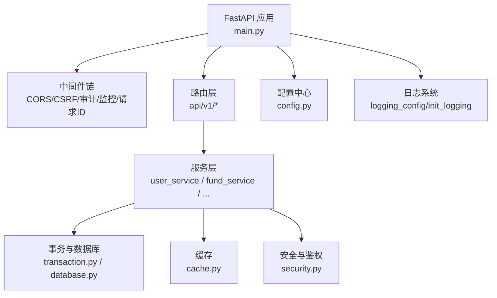
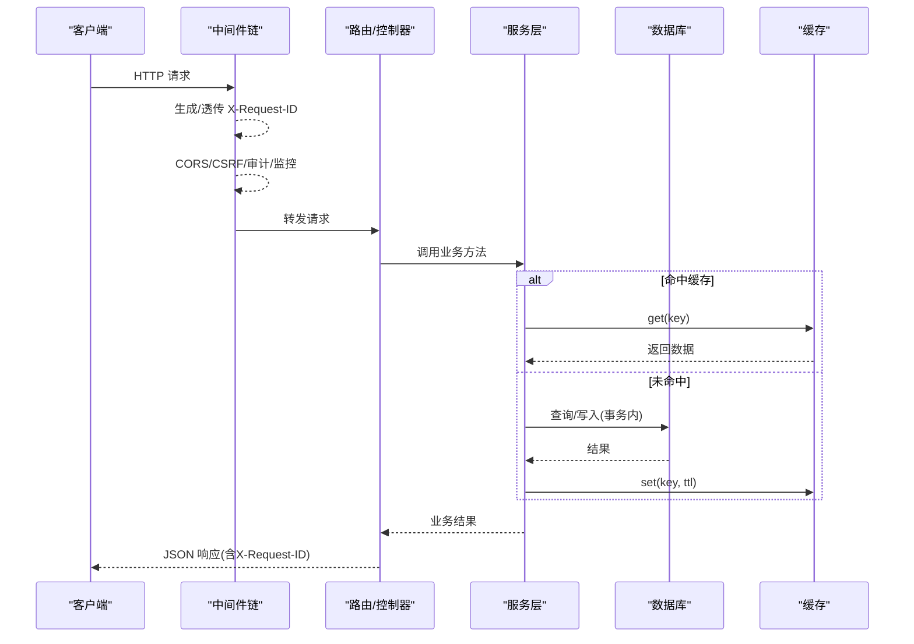
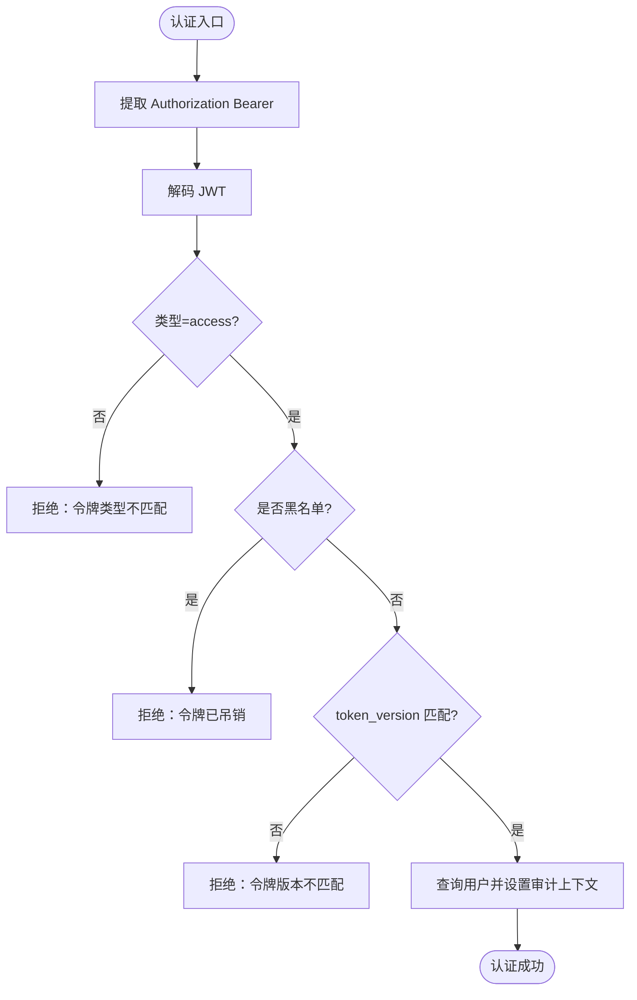
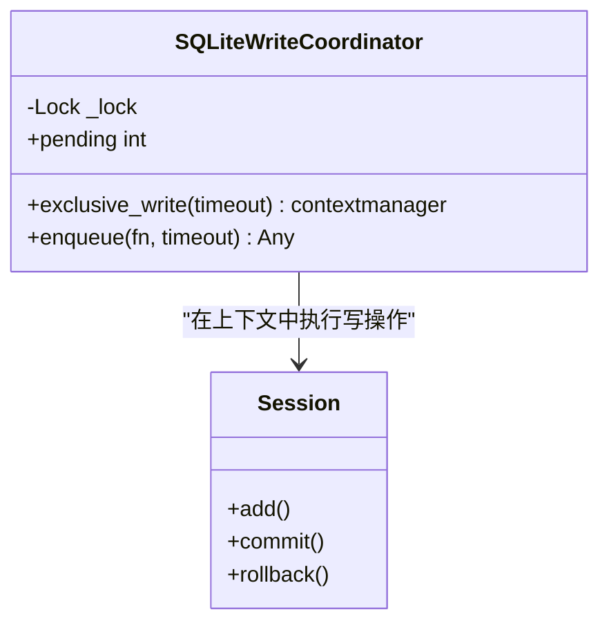
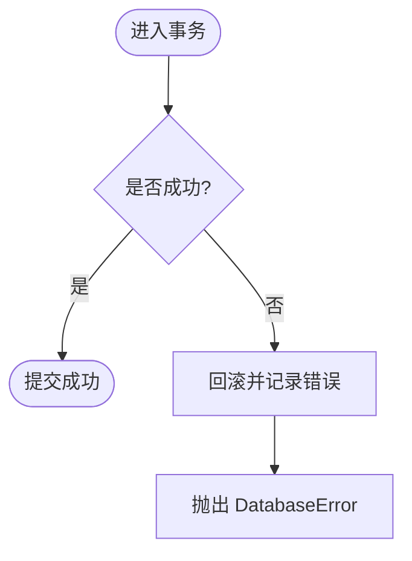
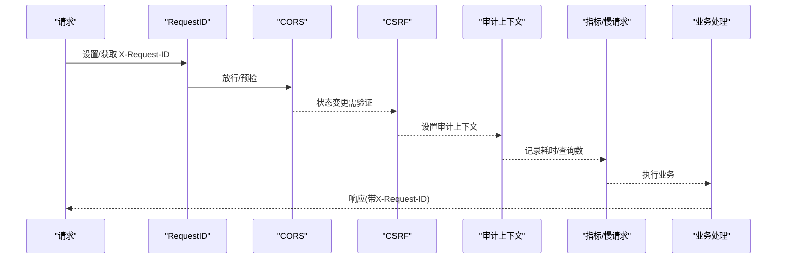
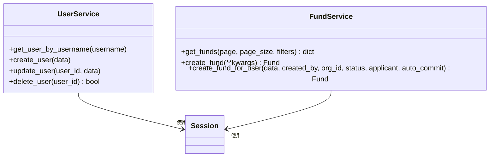
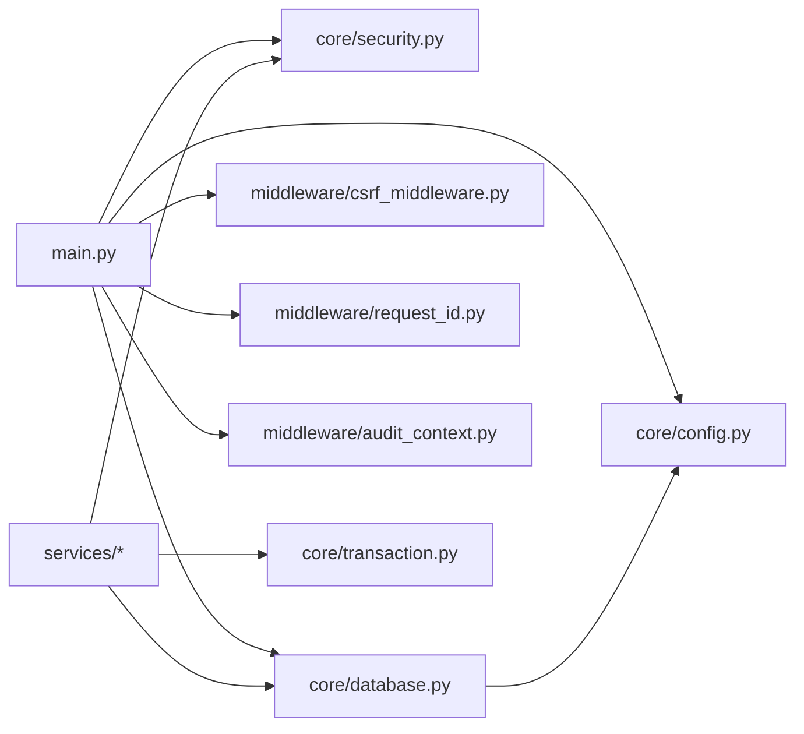

# 应用层架构

<cite>
**本文引用的文件**
- [backend/app/main.py](file://backend/app/main.py)
- [backend/app/core/config.py](file://backend/app/core/config.py)
- [backend/app/core/security.py](file://backend/app/core/security.py)
- [backend/app/core/database.py](file://backend/app/core/database.py)
- [backend/app/core/logging.py](file://backend/app/core/logging.py)
- [backend/app/middleware/csrf_middleware.py](file://backend/app/middleware/csrf_middleware.py)
- [backend/app/middleware/request_id.py](file://backend/app/middleware/request_id.py)
- [backend/app/middleware/audit_context.py](file://backend/app/middleware/audit_context.py)
- [backend/app/core/cache.py](file://backend/app/core/cache.py)
- [backend/app/core/transaction.py](file://backend/app/core/transaction.py)
- [backend/app/services/user_service.py](file://backend/app/services/user_service.py)
- [backend/app/services/fund_service.py](file://backend/app/services/fund_service.py)
- [backend/app/core/exceptions.py](file://backend/app/core/exceptions.py)
</cite>

## 目录
1. [简介](#简介)
2. [项目结构](#项目结构)
3. [核心组件](#核心组件)
4. [架构总览](#架构总览)
5. [详细组件分析](#详细组件分析)
6. [依赖关系分析](#依赖关系分析)
7. [性能考虑](#性能考虑)
8. [故障排查指南](#故障排查指南)
9. [结论](#结论)
10. [附录：示例与最佳实践](#附录示例与最佳实践)

## 简介
本文件面向“乡村振兴帮扶管理信息系统”的应用层架构，聚焦服务层设计模式、业务逻辑封装、跨领域用例协调、以及配置管理、安全认证、数据库连接、日志记录、缓存机制等核心模块。同时说明中间件（CORS、CSRF、请求审计、性能监控、请求ID追踪）的职责与协作方式，并提供事务管理、异常处理、依赖注入、单元测试模拟策略与性能优化技巧，辅以具体代码路径指引。

## 项目结构
后端采用 FastAPI + SQLAlchemy 的层次化架构：
- 入口与装配：main.py 负责应用生命周期、中间件注册、路由挂载、静态资源与 SPA fallback。
- 核心能力：core 提供配置、安全、数据库、事务、缓存、异常、日志等横切能力。
- 中间件：middleware 实现 CORS、CSRF、请求审计上下文、请求ID追踪、慢请求监控、查询计数等。
- 服务层：services 按领域划分（用户、经费、审批、AI、备份等），封装业务规则与跨域编排。
- 数据模型与接口：models/schemas/interfaces 定义实体、DTO 与契约。
- 测试：tests 覆盖单元、集成与安全测试。

图表来源
- [backend/app/main.py:100-181](file://backend/app/main.py#L100-L181)
- [backend/app/core/config.py:54-206](file://backend/app/core/config.py#L54-L206)
- [backend/app/core/database.py:53-67](file://backend/app/core/database.py#L53-L67)

章节来源
- [backend/app/main.py:100-181](file://backend/app/main.py#L100-L181)
- [backend/app/core/config.py:54-206](file://backend/app/core/config.py#L54-L206)

## 核心组件
- 配置管理：集中式 Settings，支持环境变量、加密密钥、路径动态解析、生产环境安全基线强制。
- 安全认证：JWT 签发/校验、密码哈希、速率限制、安全响应头、黑名单校验、令牌版本控制。
- 数据库连接：SQLite 深度调优（WAL、PRAGMA、连接池）、长事务独占写协调器、磁盘空间检查。
- 日志记录：统一初始化、JSON 格式、请求ID注入、敏感信息脱敏。
- 缓存机制：线程安全内存缓存、TTL、异步包装、装饰器缓存。
- 事务管理：上下文管理器、装饰器、保存点、批量操作、死锁重试。
- 异常处理：统一异常体系、全局处理器、参数校验错误标准化。

章节来源
- [backend/app/core/config.py:54-206](file://backend/app/core/config.py#L54-L206)
- [backend/app/core/security.py:210-336](file://backend/app/core/security.py#L210-L336)
- [backend/app/core/database.py:53-158](file://backend/app/core/database.py#L53-L158)
- [backend/app/core/logging.py:1-24](file://backend/app/core/logging.py#L1-L24)
- [backend/app/core/cache.py:14-137](file://backend/app/core/cache.py#L14-L137)
- [backend/app/core/transaction.py:48-197](file://backend/app/core/transaction.py#L48-L197)
- [backend/app/core/exceptions.py:11-145](file://backend/app/core/exceptions.py#L11-L145)

## 架构总览
请求从进入 FastAPI 开始，依次经过请求ID、安全头、CORS、驼峰转换、CSRF、请求日志、审计、慢请求监控、查询计数、指标收集等中间件，再进入路由与服务层；服务层通过事务工具与数据库交互，必要时使用缓存与外部服务；异常由全局处理器统一收敛为 JSON 响应。

图表来源
- [backend/app/main.py:113-165](file://backend/app/main.py#L113-L165)
- [backend/app/middleware/request_id.py:40-119](file://backend/app/middleware/request_id.py#L40-L119)
- [backend/app/middleware/csrf_middleware.py:177-284](file://backend/app/middleware/csrf_middleware.py#L177-L284)
- [backend/app/core/cache.py:72-137](file://backend/app/core/cache.py#L72-L137)
- [backend/app/core/transaction.py:31-197](file://backend/app/core/transaction.py#L31-L197)

## 详细组件分析

### 配置管理（Settings）
- 集中读取环境变量与 .env，支持加密密钥加载、运行时密钥持久化。
- 动态计算默认路径（数据目录、上传目录、导出目录、日志目录），适配 Windows 安装版权限问题。
- 生产环境安全基线：强制关闭 DB_ECHO、自动生成本机独立加密密钥。
- 提供 CORS、CSRF、速率限制、缓存、监控等开关与阈值。

章节来源
- [backend/app/core/config.py:54-206](file://backend/app/core/config.py#L54-L206)
- [backend/app/core/config.py:243-383](file://backend/app/core/config.py#L243-L383)

### 安全认证
- JWT：access/refresh token 签发与解码，类型校验，黑名单校验，token_version 强制下线。
- 密码：bcrypt 哈希，兼容 bcrypt 版本差异，长度截断保护。
- 速率限制：滑动窗口内存限流，防暴力破解。
- 安全头：X-Content-Type-Options、X-Frame-Options、Referrer-Policy 等。
- 输入清洗：SQL 注入模式检测与基础清理。

图表来源
- [backend/app/core/security.py:210-336](file://backend/app/core/security.py#L210-L336)

章节来源
- [backend/app/core/security.py:120-149](file://backend/app/core/security.py#L120-L149)
- [backend/app/core/security.py:210-336](file://backend/app/core/security.py#L210-L336)
- [backend/app/core/security.py:414-517](file://backend/app/core/security.py#L414-L517)
- [backend/app/core/security.py:598-637](file://backend/app/core/security.py#L598-L637)

### 数据库连接与优化
- SQLite WAL 模式、外键约束、busy_timeout、缓存与 mmap 调优、自动索引、连接关闭时 optimize。
- 连接池 QueuePool 配置，避免过多连接导致文件锁竞争。
- 长事务独占写协调器：exclusive_write 防止 SQLITE_BUSY，保障大批量导入一致性。
- 磁盘空间检查：备份前容量评估。

图表来源
- [backend/app/core/database.py:198-289](file://backend/app/core/database.py#L198-L289)

章节来源
- [backend/app/core/database.py:53-158](file://backend/app/core/database.py#L53-L158)
- [backend/app/core/database.py:174-187](file://backend/app/core/database.py#L174-L187)
- [backend/app/core/database.py:198-289](file://backend/app/core/database.py#L198-L289)
- [backend/app/core/database.py:292-343](file://backend/app/core/database.py#L292-L343)

### 日志记录
- 统一初始化 logging_config.init_logging()，JSON 格式，轮转与保留策略。
- 请求ID注入：通过 RequestIDLogFilter 将 request_id 附加到每条日志。
- 敏感字段脱敏：sanitize_log_data 过滤 password/token/key 等。

章节来源
- [backend/app/core/logging.py:1-24](file://backend/app/core/logging.py#L1-L24)
- [backend/app/middleware/request_id.py:122-128](file://backend/app/middleware/request_id.py#L122-L128)
- [backend/app/core/security.py:180-203](file://backend/app/core/security.py#L180-L203)

### 缓存机制
- SimpleCache：线程安全、每键 TTL、LRU 淘汰、统计命中率。
- CacheManager：异步包装，便于在协程中使用。
- cached 装饰器：对同步/异步函数透明缓存，支持自定义 key_builder。

章节来源
- [backend/app/core/cache.py:14-137](file://backend/app/core/cache.py#L14-L137)

### 事务管理
- TransactionManager：上下文管理器 transaction、装饰器 transactional、嵌套事务 nested_transaction、保存点 savepoint。
- safe_commit：提交失败自动回滚并记录日志。
- with_transaction：隔离级别与只读事务控制（非 SQLite 生效）。
- retry_on_deadlock：死锁重试。
- BatchOperation：批量插入/更新/删除。

图表来源
- [backend/app/core/transaction.py:48-197](file://backend/app/core/transaction.py#L48-L197)
- [backend/app/core/transaction.py:200-234](file://backend/app/core/transaction.py#L200-L234)
- [backend/app/core/transaction.py:292-362](file://backend/app/core/transaction.py#L292-L362)
- [backend/app/core/transaction.py:365-457](file://backend/app/core/transaction.py#L365-L457)

章节来源
- [backend/app/core/transaction.py:48-197](file://backend/app/core/transaction.py#L48-L197)
- [backend/app/core/transaction.py:200-234](file://backend/app/core/transaction.py#L200-L234)
- [backend/app/core/transaction.py:292-362](file://backend/app/core/transaction.py#L292-L362)
- [backend/app/core/transaction.py:365-457](file://backend/app/core/transaction.py#L365-L457)

### 中间件功能
- CORS：允许源、方法、头部、凭证、暴露头、最大缓存时间。
- CSRF：HMAC 签名增强、过期检测、豁免路径、可信代理 IP 透传。
- 请求审计：AuditContext 存储当前用户ID与请求ID，供审计事件写入。
- 性能监控：MetricsMiddleware、SlowRequestMiddleware、QueryCounterMiddleware。
- 请求ID追踪：RequestIDMiddleware 生成/透传 X-Request-ID，慢请求告警。

图表来源
- [backend/app/main.py:113-165](file://backend/app/main.py#L113-L165)
- [backend/app/middleware/csrf_middleware.py:177-284](file://backend/app/middleware/csrf_middleware.py#L177-L284)
- [backend/app/middleware/audit_context.py:15-58](file://backend/app/middleware/audit_context.py#L15-L58)
- [backend/app/middleware/request_id.py:40-119](file://backend/app/middleware/request_id.py#L40-L119)

章节来源
- [backend/app/main.py:113-165](file://backend/app/main.py#L113-L165)
- [backend/app/middleware/csrf_middleware.py:177-284](file://backend/app/middleware/csrf_middleware.py#L177-L284)
- [backend/app/middleware/audit_context.py:15-58](file://backend/app/middleware/audit_context.py#L15-L58)
- [backend/app/middleware/request_id.py:40-119](file://backend/app/middleware/request_id.py#L40-L119)

### 服务层设计与跨领域用例
- 用户服务：CRUD、角色归一化、密码哈希、分页查询、搜索。
- 经费服务：分页列表（joinedload/selectinload 解决 N+1）、创建/更新、编号生成、金额字段量化、auto_commit 控制复杂流程事务边界。
- 跨领域编排：服务间通过依赖注入共享 Session，结合事务工具保证一致性；必要时借助缓存减少重复查询。

图表来源
- [backend/app/services/user_service.py:20-124](file://backend/app/services/user_service.py#L20-L124)
- [backend/app/services/fund_service.py:29-200](file://backend/app/services/fund_service.py#L29-L200)

章节来源
- [backend/app/services/user_service.py:20-124](file://backend/app/services/user_service.py#L20-L124)
- [backend/app/services/fund_service.py:29-200](file://backend/app/services/fund_service.py#L29-L200)

### 依赖注入与单元测试模拟
- 依赖注入：FastAPI Depends 注入当前用户、Session；服务构造注入 db。
- 单元测试模拟：
  - 使用 pytest-mock 或 unittest.mock 替换 Service 中的 Session、缓存、外部服务。
  - 针对事务：mock safe_commit 或使用内存数据库（SQLite in-memory）验证回滚行为。
  - 针对中间件：使用 TestClient 发送请求，断言响应头与状态码。
  - 针对鉴权：mock decode_token、is_blacklisted、get_current_user。

章节来源
- [backend/app/core/security.py:243-336](file://backend/app/core/security.py#L243-L336)
- [backend/app/core/database.py:174-187](file://backend/app/core/database.py#L174-L187)
- [backend/app/core/transaction.py:200-234](file://backend/app/core/transaction.py#L200-L234)

### 性能优化技巧
- 数据库：WAL、PRAGMA 调优、连接池、批量操作、N+1 消除（joinedload/selectinload）。
- 缓存：热点数据缓存、装饰器缓存、合理 TTL。
- 中间件：慢请求监控、查询计数、缓存头（静态资源长期缓存）。
- 启动期：懒加载路由、按需导入、健康检查暴露迁移状态。

章节来源
- [backend/app/core/database.py:53-158](file://backend/app/core/database.py#L53-L158)
- [backend/app/services/fund_service.py:55-99](file://backend/app/services/fund_service.py#L55-L99)
- [backend/app/core/cache.py:98-137](file://backend/app/core/cache.py#L98-L137)
- [backend/app/main.py:175-181](file://backend/app/main.py#L175-L181)

## 依赖关系分析
- main.py 依赖 core（配置、安全、异常、日志）、middleware（CORS、CSRF、审计、监控、请求ID）、services（任务队列、审计事件）。
- services 依赖 core（事务、数据库、安全、常量）、models（实体）、utils（辅助）。
- middleware 依赖 core（配置、常量）与 starlette/fastapi。

图表来源
- [backend/app/main.py:100-181](file://backend/app/main.py#L100-L181)
- [backend/app/core/config.py:54-206](file://backend/app/core/config.py#L54-L206)
- [backend/app/core/database.py:53-67](file://backend/app/core/database.py#L53-L67)
- [backend/app/middleware/csrf_middleware.py:177-284](file://backend/app/middleware/csrf_middleware.py#L177-L284)
- [backend/app/middleware/request_id.py:40-119](file://backend/app/middleware/request_id.py#L40-L119)
- [backend/app/middleware/audit_context.py:15-58](file://backend/app/middleware/audit_context.py#L15-L58)

章节来源
- [backend/app/main.py:100-181](file://backend/app/main.py#L100-L181)
- [backend/app/core/config.py:54-206](file://backend/app/core/config.py#L54-L206)
- [backend/app/core/database.py:53-67](file://backend/app/core/database.py#L53-L67)

## 性能考虑
- 数据库层面：WAL 模式、PRAGMA 优化、连接池大小与超时、批量操作、N+1 查询优化。
- 缓存层面：热点数据缓存、TTL 控制、LRU 淘汰、异步访问封装。
- 中间件层面：慢请求阈值、查询计数、静态资源缓存头。
- 启动与路由：懒加载路由、按需导入、健康检查暴露迁移状态。
- 安全与性能平衡：生产环境禁用 SQL echo、严格代理信任策略。

[本节为通用指导，不直接分析具体文件]

## 故障排查指南
- 认证失败：检查 JWT 类型、黑名单、token_version 是否匹配；查看安全模块日志。
- CSRF 失败：确认前端是否正确获取并携带 X-CSRF-Token；检查豁免路径与过期时间。
- 数据库繁忙：长事务使用 exclusive_write；调整 busy_timeout；检查并发导入任务。
- 慢请求：通过 RequestID 与 SlowRequestMiddleware 定位瓶颈；结合 QueryCounter 分析 SQL 次数。
- 异常统一：AppError/BusinessError/DatabaseError 被全局处理器捕获，返回标准 JSON。

章节来源
- [backend/app/core/security.py:210-336](file://backend/app/core/security.py#L210-L336)
- [backend/app/middleware/csrf_middleware.py:177-284](file://backend/app/middleware/csrf_middleware.py#L177-L284)
- [backend/app/core/database.py:198-289](file://backend/app/core/database.py#L198-L289)
- [backend/app/middleware/request_id.py:40-119](file://backend/app/middleware/request_id.py#L40-L119)
- [backend/app/core/exceptions.py:121-145](file://backend/app/core/exceptions.py#L121-L145)

## 结论
该应用层以 FastAPI 为核心，通过清晰的中间件链、稳健的安全与事务机制、高性能的 SQLite 调优与缓存策略，实现了高内聚、低耦合的服务层架构。配置管理集中化、日志与监控完善、异常处理统一，为复杂业务流程提供了可靠支撑。建议在新业务中遵循现有模式：服务层封装业务规则、使用事务工具保证一致性、利用缓存提升性能、通过中间件完成横切关注点。

[本节为总结性内容，不直接分析具体文件]

## 附录：示例与最佳实践

- 编写业务服务（用户服务示例）
  - 通过依赖注入获取 Session，进行 CRUD 操作，使用 safe_commit 确保提交安全。
  - 参考路径：[backend/app/services/user_service.py:20-124](file://backend/app/services/user_service.py#L20-L124)

- 配置中间件（CORS/CSRF/请求ID）
  - 在 main.py 中按顺序注册中间件，确保执行顺序正确。
  - 参考路径：[backend/app/main.py:113-165](file://backend/app/main.py#L113-L165)

- 处理复杂业务流程（经费创建与编号生成）
  - 使用 auto_commit 控制事务边界，结合 joinedload/selectinload 优化查询。
  - 参考路径：[backend/app/services/fund_service.py:114-185](file://backend/app/services/fund_service.py#L114-L185)

- 事务管理与批量操作
  - 使用 transaction/nested_transaction/savepoint 管理事务范围；使用 BatchOperation 进行批量写入。
  - 参考路径：[backend/app/core/transaction.py:48-197](file://backend/app/core/transaction.py#L48-L197), [backend/app/core/transaction.py:365-457](file://backend/app/core/transaction.py#L365-L457)

- 缓存使用
  - 使用 @cached 装饰器或 CacheManager 对热点数据进行缓存，设置合理 TTL。
  - 参考路径：[backend/app/core/cache.py:98-137](file://backend/app/core/cache.py#L98-L137)

- 异常处理
  - 抛出 AppError/BusinessError/DatabaseError，由全局处理器统一返回 JSON。
  - 参考路径：[backend/app/core/exceptions.py:11-145](file://backend/app/core/exceptions.py#L11-L145)