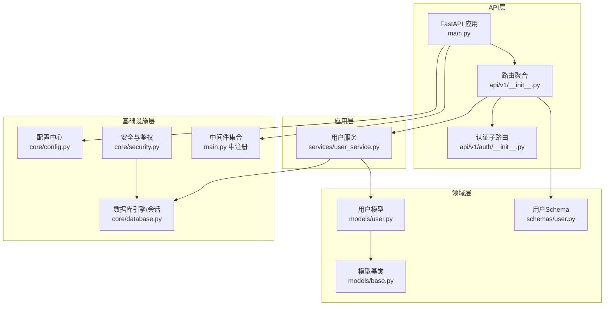
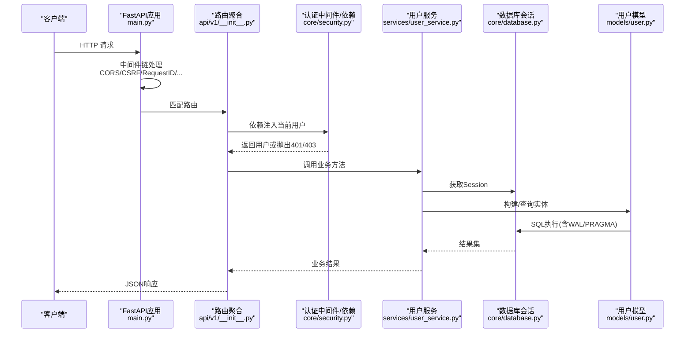
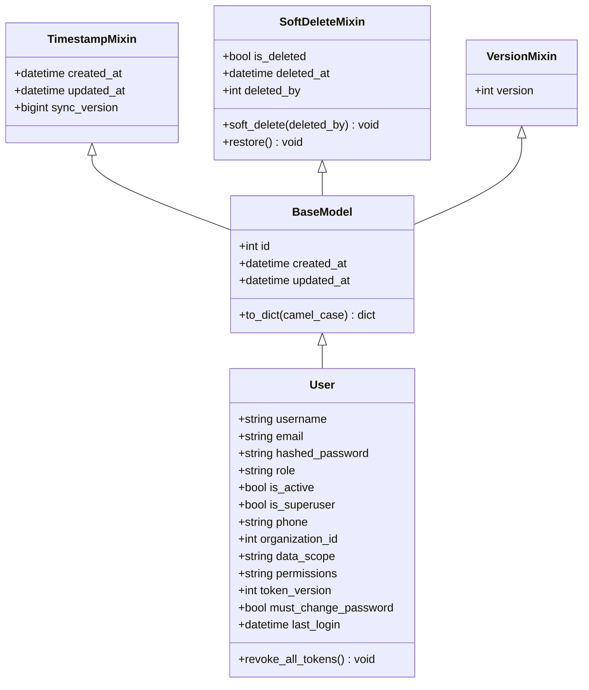
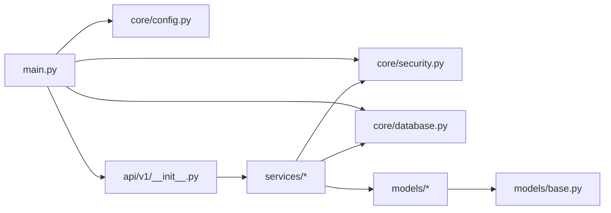

# 项目结构说明

<cite>
**本文引用的文件**
- [backend/app/main.py](file://backend/app/main.py)
- [backend/app/core/config.py](file://backend/app/core/config.py)
- [backend/app/core/database.py](file://backend/app/core/database.py)
- [backend/app/core/security.py](file://backend/app/core/security.py)
- [backend/app/api/v1/__init__.py](file://backend/app/api/v1/__init__.py)
- [backend/app/models/base.py](file://backend/app/models/base.py)
- [backend/app/models/user.py](file://backend/app/models/user.py)
- [backend/app/schemas/user.py](file://backend/app/schemas/user.py)
- [backend/app/services/user_service.py](file://backend/app/services/user_service.py)
- [backend/app/api/v1/auth/__init__.py](file://backend/app/api/v1/auth/__init__.py)
</cite>

## 目录
1. [简介](#简介)
2. [项目结构](#项目结构)
3. [核心组件](#核心组件)
4. [架构总览](#架构总览)
5. [详细组件分析](#详细组件分析)
6. [依赖关系分析](#依赖关系分析)
7. [性能考量](#性能考量)
8. [故障排查指南](#故障排查指南)
9. [结论](#结论)
10. [附录](#附录)

## 简介
本说明围绕后端项目的DDD分层组织方式，系统阐述API层、应用层、领域层、基础设施层的职责划分；解释FastAPI应用入口、路由注册机制与中间件配置；梳理models的ORM模型设计、schemas的数据验证模式、services的业务逻辑封装；并说明core核心模块在配置管理、安全认证、数据库连接方面的实现。文末提供各模块间的依赖关系图与代码组织规范，帮助开发者理解整体架构并遵循统一的代码结构标准。

## 项目结构
后端采用典型的分层架构：
- API层（app/api）：对外暴露HTTP接口，负责请求解析、参数校验、调用服务层、返回响应。
- 应用层（app/services）：编排业务用例，协调领域对象与基础设施，承载跨实体的业务流程。
- 领域层（app/models + app/schemas）：定义数据模型与数据契约，表达领域实体、值对象及约束。
- 基础设施层（app/core + middleware）：提供配置、数据库、安全、日志、缓存、中间件等横切能力。

图表来源
- [backend/app/main.py:100-181](file://backend/app/main.py#L100-L181)
- [backend/app/api/v1/__init__.py:29-140](file://backend/app/api/v1/__init__.py#L29-L140)
- [backend/app/api/v1/auth/__init__.py:16-22](file://backend/app/api/v1/auth/__init__.py#L16-L22)
- [backend/app/services/user_service.py:20-118](file://backend/app/services/user_service.py#L20-L118)
- [backend/app/models/user.py:26-85](file://backend/app/models/user.py#L26-L85)
- [backend/app/models/base.py:19-185](file://backend/app/models/base.py#L19-L185)
- [backend/app/schemas/user.py:9-53](file://backend/app/schemas/user.py#L9-L53)
- [backend/app/core/config.py:54-206](file://backend/app/core/config.py#L54-L206)
- [backend/app/core/database.py:55-67](file://backend/app/core/database.py#L55-L67)
- [backend/app/core/security.py:243-347](file://backend/app/core/security.py#L243-L347)

章节来源
- [backend/app/main.py:100-181](file://backend/app/main.py#L100-L181)
- [backend/app/api/v1/__init__.py:29-140](file://backend/app/api/v1/__init__.py#L29-L140)

## 核心组件
- FastAPI应用入口与生命周期
  - 应用实例化、异常处理器注册、中间件链装配、路由加载、静态资源挂载、SPA回退。
  - 启动时初始化数据库表、执行Alembic迁移、创建索引、恢复Token黑名单、默认管理员种子、任务队列与监控调度。
- 配置管理
  - 基于Pydantic Settings的环境变量驱动配置，支持加密密钥、路径动态计算、生产环境安全加固。
- 数据库连接与优化
  - SQLAlchemy Engine/Session，SQLite WAL/PRAGMA调优，写入协调器避免长事务冲突，磁盘空间检查。
- 安全与认证
  - JWT签发/校验、密码哈希、速率限制、安全响应头中间件、审计日志、令牌黑名单与版本控制。
- 路由与中间件
  - 统一路由聚合、按序注册业务模块；中间件覆盖CORS、CSRF、驼峰转换、请求ID、慢请求监控、查询计数、缓存头等。

章节来源
- [backend/app/main.py:68-181](file://backend/app/main.py#L68-L181)
- [backend/app/core/config.py:54-206](file://backend/app/core/config.py#L54-L206)
- [backend/app/core/database.py:55-158](file://backend/app/core/database.py#L55-L158)
- [backend/app/core/security.py:210-347](file://backend/app/core/security.py#L210-L347)
- [backend/app/api/v1/__init__.py:29-140](file://backend/app/api/v1/__init__.py#L29-L140)

## 架构总览
下图展示从请求进入FastAPI到落库的完整链路，体现分层职责与关键横切关注点。

图表来源
- [backend/app/main.py:113-165](file://backend/app/main.py#L113-L165)
- [backend/app/api/v1/__init__.py:102-140](file://backend/app/api/v1/__init__.py#L102-L140)
- [backend/app/core/security.py:243-347](file://backend/app/core/security.py#L243-L347)
- [backend/app/services/user_service.py:20-118](file://backend/app/services/user_service.py#L20-L118)
- [backend/app/core/database.py:55-158](file://backend/app/core/database.py#L55-L158)
- [backend/app/models/user.py:26-85](file://backend/app/models/user.py#L26-L85)

## 详细组件分析

### API层：路由注册与中间件
- 路由注册
  - 通过集中式聚合器将认证、数据、导入导出、系统、监控等子路由以及大量业务模块静态导入并按序注册，保证打包可追踪与快速失败。
  - 认证子路由进一步聚合auth/users/rbac/two_factor等子模块。
- 中间件配置
  - 顺序明确：查询计数→慢请求监控→指标→审计→请求日志→CSRF→驼峰转换→缓存头→CORS→安全头→请求ID。
  - 额外全局中间件：强制UTF-8字符集、尾部斜杠重定向。
- SPA与静态资源
  - 根据前端构建产物挂载assets/images/static，并提供index.html的SPA回退与版本JSON。

章节来源
- [backend/app/api/v1/__init__.py:29-140](file://backend/app/api/v1/__init__.py#L29-L140)
- [backend/app/api/v1/auth/__init__.py:16-22](file://backend/app/api/v1/auth/__init__.py#L16-L22)
- [backend/app/main.py:113-181](file://backend/app/main.py#L113-L181)
- [backend/app/main.py:207-377](file://backend/app/main.py#L207-L377)

### 应用层：服务编排与业务逻辑
- 用户服务示例
  - 提供按用户名/邮箱/ID查询、分页列表、创建/更新/删除等能力，使用安全模块进行密码哈希，并通过事务工具提交变更。
  - 查询条件组合灵活，支持角色、激活状态、模糊搜索。
- 服务与依赖
  - 通过依赖注入获取数据库会话，延迟导入模型以避免循环依赖。
  - 所有写操作经统一事务提交，确保一致性。

章节来源
- [backend/app/services/user_service.py:20-118](file://backend/app/services/user_service.py#L20-L118)
- [backend/app/core/security.py:130-148](file://backend/app/core/security.py#L130-L148)

### 领域层：ORM模型与数据契约
- ORM模型
  - 基类提供通用字段、时间戳、软删除、乐观锁、字典序列化等能力。
  - 用户模型包含身份、权限、组织关联、敏感字段加密存储、Token版本等。
- Schema验证
  - 使用Pydantic定义输入输出契约，如用户创建/更新/响应，内置长度、必填等校验。

图表来源
- [backend/app/models/base.py:19-185](file://backend/app/models/base.py#L19-L185)
- [backend/app/models/user.py:26-85](file://backend/app/models/user.py#L26-L85)

章节来源
- [backend/app/models/base.py:19-185](file://backend/app/models/base.py#L19-L185)
- [backend/app/models/user.py:26-85](file://backend/app/models/user.py#L26-L85)
- [backend/app/schemas/user.py:9-53](file://backend/app/schemas/user.py#L9-L53)

### 基础设施层：配置、安全、数据库
- 配置管理
  - 环境变量驱动，自动计算数据/缓存/上传/导出路径，生产环境强制关闭SQL日志与字段加密弱配置，支持加密密钥文件加载。
- 数据库连接
  - SQLite WAL模式、PRAGMA优化、连接池参数、长事务独占写协调器、磁盘空间检查。
- 安全与认证
  - JWT签发/解码、Bearer依赖、黑名单校验、令牌版本控制、密码策略、速率限制、安全响应头、审计日志。

章节来源
- [backend/app/core/config.py:54-206](file://backend/app/core/config.py#L54-L206)
- [backend/app/core/config.py:243-364](file://backend/app/core/config.py#L243-L364)
- [backend/app/core/database.py:55-158](file://backend/app/core/database.py#L55-L158)
- [backend/app/core/database.py:198-285](file://backend/app/core/database.py#L198-L285)
- [backend/app/core/security.py:210-347](file://backend/app/core/security.py#L210-L347)
- [backend/app/core/security.py:598-637](file://backend/app/core/security.py#L598-L637)

## 依赖关系分析
- 模块耦合
  - main.py依赖core（配置、安全、日志）、middleware、api路由聚合；路由聚合静态导入业务模块，形成强内聚、低耦合。
  - services依赖core（安全、事务、常量）与models；models仅依赖base与SQLAlchemy。
- 外部依赖
  - FastAPI/Starlette、SQLAlchemy、Alembic、JWT、Passlib、Pydantic Settings等。
- 潜在循环
  - 通过延迟导入（如services中按需import models）避免循环依赖。

图表来源
- [backend/app/main.py:100-181](file://backend/app/main.py#L100-L181)
- [backend/app/api/v1/__init__.py:29-140](file://backend/app/api/v1/__init__.py#L29-L140)
- [backend/app/services/user_service.py:20-118](file://backend/app/services/user_service.py#L20-L118)
- [backend/app/models/base.py:19-185](file://backend/app/models/base.py#L19-L185)

章节来源
- [backend/app/main.py:100-181](file://backend/app/main.py#L100-L181)
- [backend/app/api/v1/__init__.py:29-140](file://backend/app/api/v1/__init__.py#L29-L140)

## 性能考量
- 数据库
  - SQLite WAL+PRAGMA优化提升并发读写；连接池大小与超时合理配置；长事务使用独占写协调器避免忙锁。
- 中间件
  - 查询计数与慢请求监控便于定位瓶颈；缓存头减少重复请求。
- 启动流程
  - 路由静态导入与懒加载结合，缩短启动时间；迁移失败在生产环境fail-loud，开发环境容错降级。

[本节为通用指导，不直接分析具体文件]

## 故障排查指南
- 启动阶段
  - 若迁移失败，查看健康端点中的migration字段与日志错误类型；生产环境会中止启动以避免schema漂移。
  - 若Token黑名单加载失败，不影响主流程但需记录警告。
- 认证问题
  - 401/403：检查Bearer Token是否有效、是否在黑名单、token_version是否匹配、用户是否禁用。
- 数据库问题
  - SQLITE_BUSY：长事务场景使用exclusive_write上下文；检查busy_timeout与连接池配置。
  - 磁盘空间不足：使用磁盘空间检查函数评估可用空间。

章节来源
- [backend/app/main.py:237-262](file://backend/app/main.py#L237-L262)
- [backend/app/main.py:436-507](file://backend/app/main.py#L436-L507)
- [backend/app/core/security.py:243-347](file://backend/app/core/security.py#L243-L347)
- [backend/app/core/database.py:198-285](file://backend/app/core/database.py#L198-L285)
- [backend/app/core/database.py:292-343](file://backend/app/core/database.py#L292-L343)

## 结论
本项目以清晰的DDD分层组织代码，API层专注路由与协议适配，应用层编排业务用例，领域层表达数据与约束，基础设施层提供配置、安全与数据库能力。通过集中式路由注册、严格的中间件链、健壮的数据库优化与安全机制，系统在单机离线场景下具备高可用性与可维护性。建议新增功能遵循现有分层与命名约定，优先使用服务层封装业务逻辑，并通过schemas进行输入输出契约管理。

[本节为总结性内容，不直接分析具体文件]

## 附录
- 代码组织规范
  - API层：每个业务域一个路由模块，集中聚合于v1/__init__.py，按序注册。
  - 应用层：按领域或服务维度组织service文件，单一职责，依赖注入数据库会话。
  - 领域层：每个实体一个model文件，复用base混入；对应schema文件定义请求/响应契约。
  - 基础设施层：core下按能力拆分（config、database、security等），中间件按功能独立文件。
- 最佳实践
  - 使用Pydantic严格校验输入；敏感字段使用加密类型；写操作走事务提交；长事务使用独占写协调器；生产环境关闭SQL日志与弱配置。

[本节为通用指导，不直接分析具体文件]