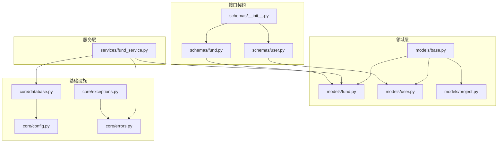
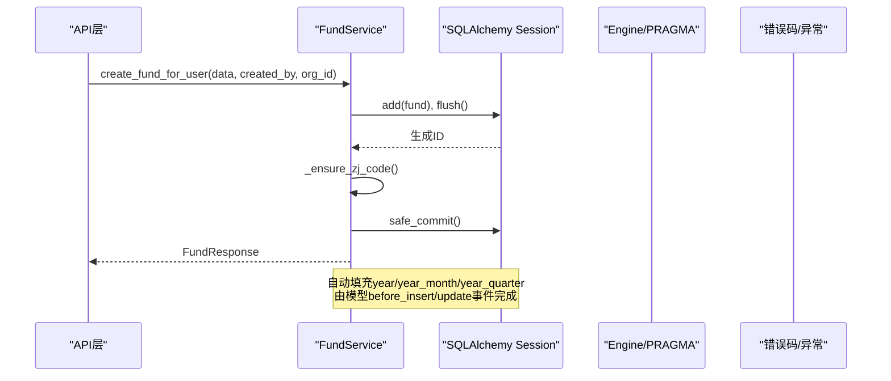
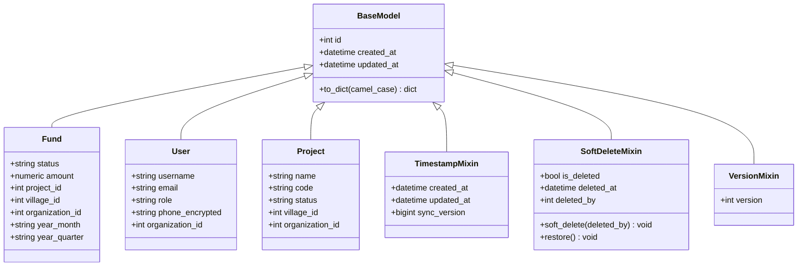
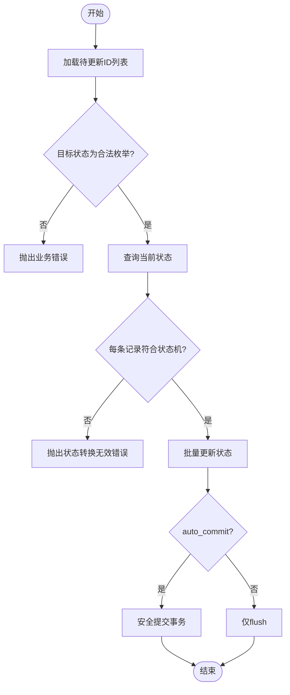
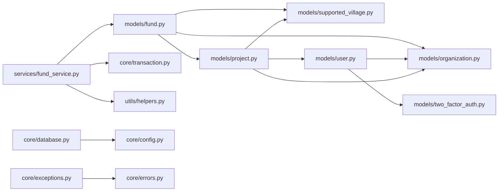

# 领域层实现

<cite>
**本文引用的文件**
- [backend/app/models/base.py](file://backend/app/models/base.py)
- [backend/app/core/database.py](file://backend/app/core/database.py)
- [backend/app/schemas/__init__.py](file://backend/app/schemas/__init__.py)
- [backend/app/schemas/fund.py](file://backend/app/schemas/fund.py)
- [backend/app/schemas/user.py](file://backend/app/schemas/user.py)
- [backend/app/models/fund.py](file://backend/app/models/fund.py)
- [backend/app/models/user.py](file://backend/app/models/user.py)
- [backend/app/models/project.py](file://backend/app/models/project.py)
- [backend/app/services/fund_service.py](file://backend/app/services/fund_service.py)
- [backend/app/core/config.py](file://backend/app/core/config.py)
- [backend/app/core/errors.py](file://backend/app/core/errors.py)
- [backend/app/core/exceptions.py](file://backend/app/core/exceptions.py)
</cite>

## 目录
1. [简介](#简介)
2. [项目结构](#项目结构)
3. [核心组件](#核心组件)
4. [架构总览](#架构总览)
5. [详细组件分析](#详细组件分析)
6. [依赖关系分析](#依赖关系分析)
7. [性能考虑](#性能考虑)
8. [故障排查指南](#故障排查指南)
9. [结论](#结论)
10. [附录](#附录)

## 简介
本章节面向领域层实现，聚焦 ORM 模型设计原则、实体关系映射、数据验证规则；阐述 Pydantic Schema 的定义方式与输入输出结构化验证；说明领域事件与工作流封装、业务规则集中化、值对象的使用场景；覆盖数据库表结构设计、索引优化策略、数据完整性约束；并通过具体代码路径展示如何定义领域模型、实现数据验证、处理复杂业务规则；最后解释与基础设施层的解耦方式及接口抽象。

## 项目结构
后端采用分层组织：
- 领域模型（models）：使用 SQLAlchemy 声明式模型，提供基础混入（时间戳、软删除、乐观锁）、PII 透明加密类型等。
- 服务层（services）：聚合根操作与业务规则（如经费状态机、批量更新）。
- 接口契约（schemas）：Pydantic 模型用于请求/响应校验与序列化。
- 基础设施（core）：数据库引擎配置、事务封装、错误码与异常、配置加载。

图表来源
- [backend/app/models/base.py:1-185](file://backend/app/models/base.py#L1-L185)
- [backend/app/models/fund.py:1-299](file://backend/app/models/fund.py#L1-L299)
- [backend/app/models/user.py:1-152](file://backend/app/models/user.py#L1-L152)
- [backend/app/models/project.py:1-200](file://backend/app/models/project.py#L1-L200)
- [backend/app/services/fund_service.py:1-304](file://backend/app/services/fund_service.py#L1-L304)
- [backend/app/schemas/fund.py:1-148](file://backend/app/schemas/fund.py#L1-L148)
- [backend/app/schemas/user.py:1-53](file://backend/app/schemas/user.py#L1-L53)
- [backend/app/schemas/__init__.py:1-53](file://backend/app/schemas/__init__.py#L1-L53)
- [backend/app/core/database.py:1-343](file://backend/app/core/database.py#L1-L343)
- [backend/app/core/config.py:1-383](file://backend/app/core/config.py#L1-L383)
- [backend/app/core/errors.py:1-176](file://backend/app/core/errors.py#L1-L176)
- [backend/app/core/exceptions.py:1-145](file://backend/app/core/exceptions.py#L1-L145)

章节来源
- [backend/app/models/base.py:1-185](file://backend/app/models/base.py#L1-L185)
- [backend/app/core/database.py:1-343](file://backend/app/core/database.py#L1-L343)
- [backend/app/schemas/__init__.py:1-53](file://backend/app/schemas/__init__.py#L1-L53)

## 核心组件
- ORM 基类与混入：统一 id、时间戳、同步版本号、软删除、乐观锁、PII 字段透明加密。
- 数据库引擎与连接：SQLite WAL、PRAGMA 调优、长事务独占写协调器、会话注入。
- 领域模型：Fund、User、Project 等，包含枚举、外键、复合索引、冗余聚合字段。
- Pydantic Schema：Create/Update/Response 分层，字段校验、枚举约束、from_attributes。
- 服务层：FundService 聚合根操作、状态机、批量更新、N+1 优化、事务控制。
- 配置与错误：Settings 集中管理、错误码与消息、统一异常处理器。

章节来源
- [backend/app/models/base.py:1-185](file://backend/app/models/base.py#L1-L185)
- [backend/app/core/database.py:1-343](file://backend/app/core/database.py#L1-L343)
- [backend/app/models/fund.py:1-299](file://backend/app/models/fund.py#L1-L299)
- [backend/app/schemas/fund.py:1-148](file://backend/app/schemas/fund.py#L1-L148)
- [backend/app/services/fund_service.py:1-304](file://backend/app/services/fund_service.py#L1-L304)
- [backend/app/core/config.py:1-383](file://backend/app/core/config.py#L1-L383)
- [backend/app/core/errors.py:1-176](file://backend/app/core/errors.py#L1-L176)
- [backend/app/core/exceptions.py:1-145](file://backend/app/core/exceptions.py#L1-L145)

## 架构总览
领域层通过服务层暴露业务能力，使用 Pydantic Schema 作为边界契约，ORM 模型负责持久化，基础设施提供数据库、配置与错误处理。

图表来源
- [backend/app/services/fund_service.py:114-185](file://backend/app/services/fund_service.py#L114-L185)
- [backend/app/models/fund.py:199-226](file://backend/app/models/fund.py#L199-L226)
- [backend/app/core/database.py:174-186](file://backend/app/core/database.py#L174-L186)
- [backend/app/core/errors.py:1-176](file://backend/app/core/errors.py#L1-L176)

## 详细组件分析

### ORM 模型设计原则与实体关系映射
- 基类与混入
  - BaseModel：id + 时间戳 + to_dict(camelCase)。
  - TimestampMixin：created_at/updated_at/sync_version（更新时自增，支持增量同步）。
  - SoftDeleteMixin：is_deleted/deleted_at/deleted_by 与便捷方法 soft_delete()/restore()。
  - VersionMixin：version 乐观锁。
  - EncryptedText：PII 字段透明加解密（写入加密、读取解密），兼容 SQLite。
- 实体关系
  - Fund 关联 Project、SupportedVillage、Organization；多外键与级联删除。
  - User 关联 Organization、TwoFactorAuth；敏感字段 phone 使用 EncryptedText。
  - Project 关联 User、SupportedVillage、Organization；大量复合索引优化查询。
- 数据完整性
  - 外键约束（ondelete CASCADE/SET NULL）。
  - 唯一约束（如 users.username、projects.code）。
  - 非空与默认值约束。
  - 软删标记 is_active/deleted_at 配合查询过滤。

图表来源
- [backend/app/models/base.py:1-185](file://backend/app/models/base.py#L1-L185)
- [backend/app/models/fund.py:61-167](file://backend/app/models/fund.py#L61-L167)
- [backend/app/models/user.py:26-152](file://backend/app/models/user.py#L26-L152)
- [backend/app/models/project.py:47-175](file://backend/app/models/project.py#L47-L175)

章节来源
- [backend/app/models/base.py:1-185](file://backend/app/models/base.py#L1-L185)
- [backend/app/models/fund.py:1-299](file://backend/app/models/fund.py#L1-L299)
- [backend/app/models/user.py:1-152](file://backend/app/models/user.py#L1-L152)
- [backend/app/models/project.py:1-200](file://backend/app/models/project.py#L1-L200)

### Pydantic Schema 定义与数据验证
- 分层模型：Base/Create/Update/Response/ListResponse，明确输入输出边界。
- 字段校验：长度、范围、必填、枚举类型（复用领域枚举或本地回退）。
- 从属性映射：ConfigDict(from_attributes=True) 便于将 ORM 实例转为响应。
- 动态注册：schemas/__init__.py 按模块名导入并导出所有 BaseModel 子类，便于统一注册。

示例路径（不直接展示代码内容）：
- 经费创建/更新/响应：[backend/app/schemas/fund.py:41-127](file://backend/app/schemas/fund.py#L41-L127)
- 用户创建/更新/响应：[backend/app/schemas/user.py:9-53](file://backend/app/schemas/user.py#L9-L53)
- Schema 动态注册：[backend/app/schemas/__init__.py:15-50](file://backend/app/schemas/__init__.py#L15-L50)

章节来源
- [backend/app/schemas/fund.py:1-148](file://backend/app/schemas/fund.py#L1-L148)
- [backend/app/schemas/user.py:1-53](file://backend/app/schemas/user.py#L1-L53)
- [backend/app/schemas/__init__.py:1-53](file://backend/app/schemas/__init__.py#L1-L53)

### 领域事件与工作流封装
- 领域事件（基于 SQLAlchemy 事件监听）：
  - Fund before_insert/before_update 自动计算 year/year_month/year_quarter，避免在查询中使用函数导致无法命中索引。
  - TimestampMixin before_update 自动递增 sync_version，支撑增量同步过滤。
- 工作流封装：
  - FundService.FUND_TRANSITIONS 定义合法状态流转白名单。
  - batch_update_status 批量校验当前状态→目标状态是否合法，非法则整体拒绝（原子性）。
  - 金额字段量化：quantize_money_fields 保证精度一致。

图表来源
- [backend/app/services/fund_service.py:230-288](file://backend/app/services/fund_service.py#L230-L288)
- [backend/app/models/fund.py:199-226](file://backend/app/models/fund.py#L199-L226)
- [backend/app/models/base.py:94-106](file://backend/app/models/base.py#L94-L106)

章节来源
- [backend/app/services/fund_service.py:230-288](file://backend/app/services/fund_service.py#L230-L288)
- [backend/app/models/fund.py:199-226](file://backend/app/models/fund.py#L199-L226)
- [backend/app/models/base.py:94-106](file://backend/app/models/base.py#L94-L106)

### 值对象的使用场景
- 金额数值：使用 Numeric(15,4) 存储，并在服务层进行量化（quantize_money_fields），确保一致性。
- 日期/时间：date/datetime 类型，结合字符串解析与规范化（_parse_date_value），避免类型不一致导致的错误。
- 枚举：FundType/FundSource/FundStatus、ProjectType/ProjectStatus 等，限制取值空间，增强可读性与可维护性。
- PII 字段：EncryptedText 作为值对象封装敏感数据的透明加解密。

章节来源
- [backend/app/models/fund.py:88-167](file://backend/app/models/fund.py#L88-L167)
- [backend/app/models/user.py:49-50](file://backend/app/models/user.py#L49-L50)
- [backend/app/models/base.py:23-45](file://backend/app/models/base.py#L23-L45)
- [backend/app/services/fund_service.py:153-155](file://backend/app/services/fund_service.py#L153-L155)

### 数据库表结构设计、索引优化与完整性约束
- 表设计要点
  - 主键与外键：id 自增主键；多外键 ondelete 策略（CASCADE/SET NULL）保障引用完整性。
  - 软删与审计：is_active/deleted_at；deleted_by 审计追踪。
  - 冗余聚合字段：year/year_month/year_quarter 替代运行时函数，提升 GROUP BY 性能。
- 索引策略
  - 单列索引：status、fund_type、fund_source、project_id、village_id、date 等。
  - 复合索引：project_id+status、village_id+status、status+date、status+fund_type、year_month+status、year+fund_source 等。
  - 项目表复合索引：status+type、status+created_at、village_id+status、organization_id+status 等。
- 完整性约束
  - 唯一约束：users.username、projects.code。
  - 非空与默认值：金额默认 0、状态默认值、布尔标志位。
  - 外键约束：强制引用完整性。

章节来源
- [backend/app/models/fund.py:66-86](file://backend/app/models/fund.py#L66-L86)
- [backend/app/models/project.py:52-68](file://backend/app/models/project.py#L52-L68)
- [backend/app/models/user.py:31-35](file://backend/app/models/user.py#L31-L35)

### 与基础设施层的解耦与接口抽象
- 数据库访问
  - 通过 get_db() 提供 Session 注入，异常时 rollback，finally close，隔离资源管理。
  - SQLiteWriteCoordinator.exclusive_write() 对长事务加进程内互斥锁，避免 SQLITE_BUSY。
- 配置管理
  - Settings 集中管理环境变量与默认值，生产环境强制关闭 DB_ECHO，动态路径解析。
- 错误处理
  - ErrorCode 统一错误码；AppError/BusinessError/ValidationError 等异常类型；全局异常处理器统一返回格式。
- 接口抽象
  - schemas 作为 API 契约，屏蔽内部模型细节；服务层只依赖模型与基础设施接口，不感知 HTTP。

章节来源
- [backend/app/core/database.py:174-289](file://backend/app/core/database.py#L174-L289)
- [backend/app/core/config.py:54-383](file://backend/app/core/config.py#L54-L383)
- [backend/app/core/errors.py:10-176](file://backend/app/core/errors.py#L10-L176)
- [backend/app/core/exceptions.py:11-145](file://backend/app/core/exceptions.py#L11-L145)

## 依赖关系分析
- 模型依赖
  - Fund 依赖 Project、SupportedVillage、Organization（延迟导入避免循环）。
  - User 依赖 Organization、TwoFactorAuth。
  - Project 依赖 User、SupportedVillage、Organization。
- 服务依赖
  - FundService 依赖 models.fund、core.transaction、utils.helpers。
- 基础设施依赖
  - database.py 依赖 config.settings 与中间件 query_counter。
  - exceptions.py 依赖 errors.ErrorCode。

图表来源
- [backend/app/models/fund.py:293-299](file://backend/app/models/fund.py#L293-L299)
- [backend/app/models/user.py:17-22](file://backend/app/models/user.py#L17-L22)
- [backend/app/models/project.py:167-175](file://backend/app/models/project.py#L167-L175)
- [backend/app/services/fund_service.py:12-25](file://backend/app/services/fund_service.py#L12-L25)
- [backend/app/core/database.py:22-27](file://backend/app/core/database.py#L22-L27)
- [backend/app/core/exceptions.py:43-44](file://backend/app/core/exceptions.py#L43-L44)

章节来源
- [backend/app/models/fund.py:293-299](file://backend/app/models/fund.py#L293-L299)
- [backend/app/models/user.py:17-22](file://backend/app/models/user.py#L17-L22)
- [backend/app/models/project.py:167-175](file://backend/app/models/project.py#L167-L175)
- [backend/app/services/fund_service.py:12-25](file://backend/app/services/fund_service.py#L12-L25)
- [backend/app/core/database.py:22-27](file://backend/app/core/database.py#L22-L27)
- [backend/app/core/exceptions.py:43-44](file://backend/app/core/exceptions.py#L43-L44)

## 性能考虑
- 数据库层面
  - WAL 模式、NORMAL 同步、busy_timeout=10s、cache_size/mmap_size 调优、临时存储内存化、自动索引开启、WAL checkpoint。
  - 长事务使用 exclusive_write() 获取独占锁，避免 SQLITE_BUSY。
- 查询优化
  - 预加载 joinedload/selectinload 消除 N+1。
  - 冗余聚合字段 year/year_month/year_quarter 使 GROUP BY 走索引。
  - 复合索引覆盖常见过滤组合。
- 应用层面
  - 批量更新使用 bulk update 减少往返。
  - 金额字段量化保证精度与比较效率。
  - 生产环境禁用 DB_ECHO 防止日志泄露。

章节来源
- [backend/app/core/database.py:78-157](file://backend/app/core/database.py#L78-L157)
- [backend/app/core/database.py:198-289](file://backend/app/core/database.py#L198-L289)
- [backend/app/services/fund_service.py:55-99](file://backend/app/services/fund_service.py#L55-L99)
- [backend/app/models/fund.py:156-160](file://backend/app/models/fund.py#L156-L160)
- [backend/app/core/config.py:301-309](file://backend/app/core/config.py#L301-L309)

## 故障排查指南
- 参数验证失败
  - Pydantic 验证错误会被统一处理器捕获，返回 422 与错误详情。
- 业务规则违反
  - 状态机非法流转会抛出业务错误，携带错误码与消息。
- 数据库写入冲突
  - SQLite 并发写入冲突可通过 exclusive_write() 包裹长事务解决。
- 配置问题
  - 生产环境强制关闭 DB_ECHO；加密密钥缺失会启动时报错。

章节来源
- [backend/app/core/exceptions.py:121-145](file://backend/app/core/exceptions.py#L121-L145)
- [backend/app/core/errors.py:90-142](file://backend/app/core/errors.py#L90-L142)
- [backend/app/core/database.py:212-236](file://backend/app/core/database.py#L212-L236)
- [backend/app/core/config.py:301-329](file://backend/app/core/config.py#L301-L329)

## 结论
该领域层实现以 SQLAlchemy 模型为核心，结合 Pydantic Schema 构建清晰的输入输出契约；通过服务层封装业务规则与状态机，利用数据库事件与索引优化提升性能；基础设施层提供健壮的数据库配置、错误处理与配置管理。整体架构强调解耦与可维护性，适合复杂业务场景下的扩展与演进。

## 附录
- 关键代码路径参考
  - 模型基类与混入：[backend/app/models/base.py:1-185](file://backend/app/models/base.py#L1-L185)
  - 经费模型与事件：[backend/app/models/fund.py:61-226](file://backend/app/models/fund.py#L61-L226)
  - 用户模型与加密字段：[backend/app/models/user.py:26-152](file://backend/app/models/user.py#L26-L152)
  - 项目模型与索引：[backend/app/models/project.py:47-175](file://backend/app/models/project.py#L47-L175)
  - 经费服务与状态机：[backend/app/services/fund_service.py:29-288](file://backend/app/services/fund_service.py#L29-L288)
  - 经费Schema校验：[backend/app/schemas/fund.py:41-127](file://backend/app/schemas/fund.py#L41-L127)
  - 用户Schema校验：[backend/app/schemas/user.py:9-53](file://backend/app/schemas/user.py#L9-L53)
  - 数据库引擎与协调器：[backend/app/core/database.py:55-289](file://backend/app/core/database.py#L55-L289)
  - 配置与运行时密钥：[backend/app/core/config.py:54-383](file://backend/app/core/config.py#L54-L383)
  - 错误码与异常：[backend/app/core/errors.py:10-176](file://backend/app/core/errors.py#L10-L176), [backend/app/core/exceptions.py:11-145](file://backend/app/core/exceptions.py#L11-L145)