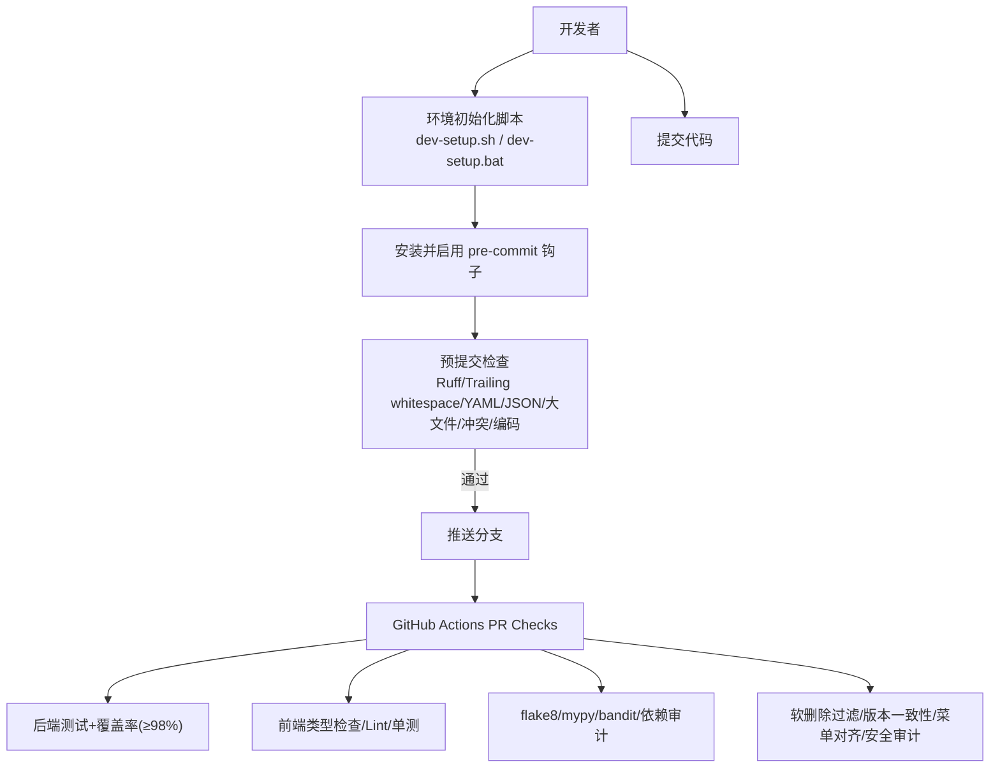
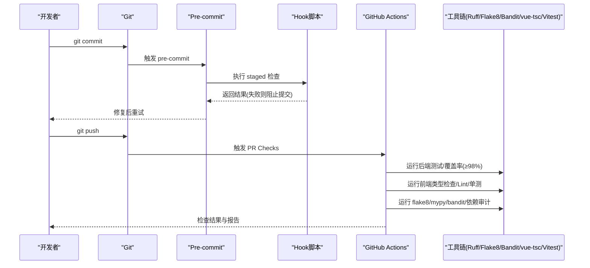
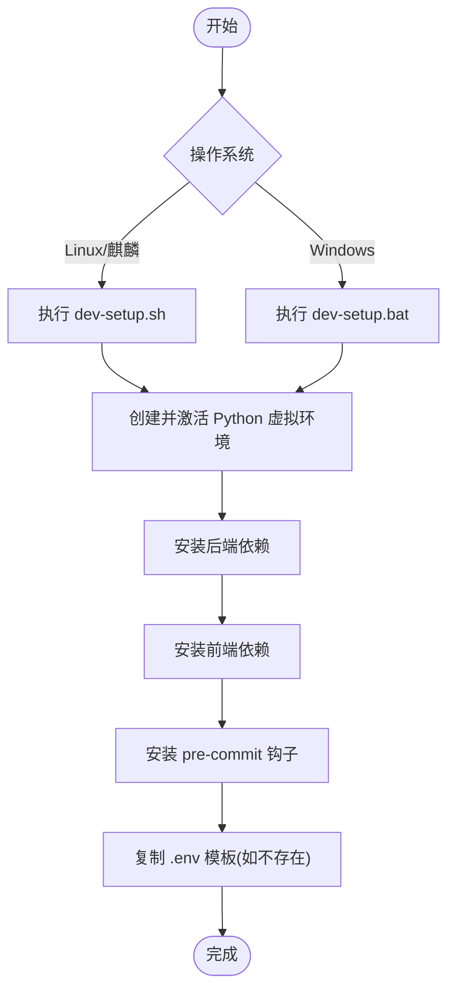
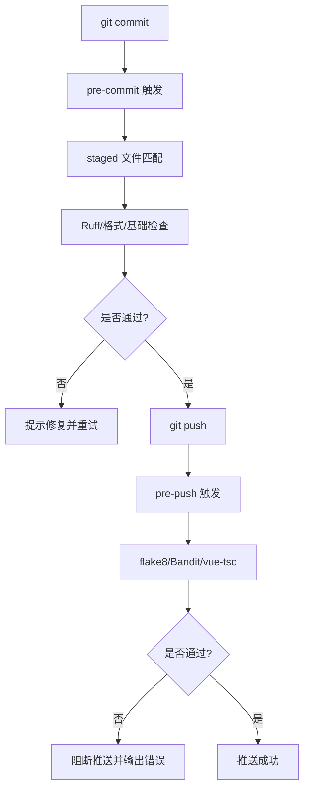
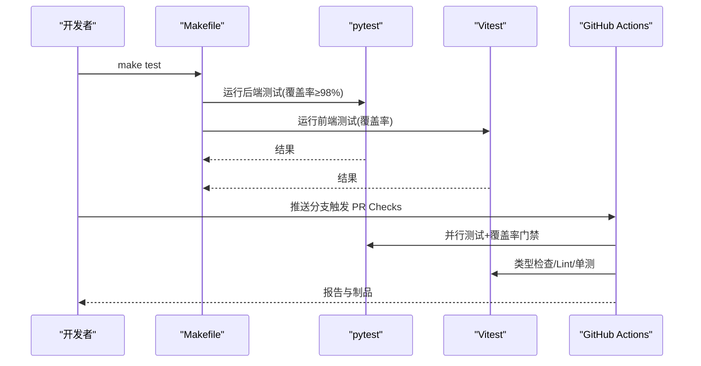
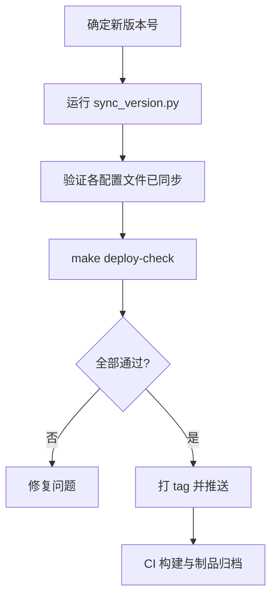
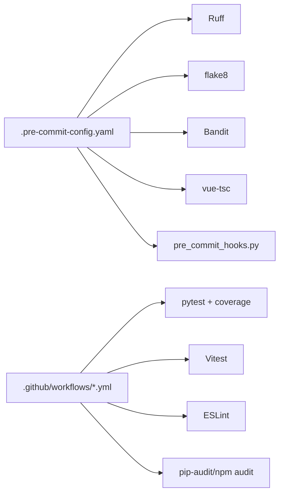

# 开发工作流程

<cite>
**本文引用的文件**
- [scripts/dev-setup.sh](file://scripts/dev-setup.sh)
- [scripts/dev-setup.bat](file://scripts/dev-setup.bat)
- [.pre-commit-config.yaml](file://.pre-commit-config.yaml)
- [scripts/pre_commit_hooks.py](file://scripts/pre_commit_hooks.py)
- [backend/.flake8](file://backend/.flake8)
- [backend/pytest.ini](file://backend/pytest.ini)
- [backend/pyproject.toml](file://backend/pyproject.toml)
- [Makefile](file://Makefile)
- [.github/workflows/pr-checks.yml](file://.github/workflows/pr-checks.yml)
- [.github/workflows/nightly-full.yml](file://.github/workflows/nightly-full.yml)
- [frontend/package.json](file://frontend/package.json)
- [CONTRIBUTING.md](file://CONTRIBUTING.md)
- [scripts/sync_version.py](file://scripts/sync_version.py)
- [backend/version.json](file://backend/version.json)
</cite>

## 目录
1. [简介](#简介)
2. [项目结构](#项目结构)
3. [核心组件](#核心组件)
4. [架构总览](#架构总览)
5. [详细组件分析](#详细组件分析)
6. [依赖关系分析](#依赖关系分析)
7. [性能与质量门禁](#性能与质量门禁)
8. [故障排查指南](#故障排查指南)
9. [结论](#结论)
10. [附录](#附录)

## 简介
本指南面向团队开发者，覆盖从本地环境初始化、Git 分支与提交规范、预提交钩子与代码质量检查（FLAKE8、Ruff）、自动化测试流程、代码审查、版本发布到持续集成（CI）的完整工作流。目标是帮助团队建立高效、稳定、可复现的协作开发流程。

## 项目结构
仓库采用前后端分离与多平台构建：
- 后端：Python FastAPI，使用 Alembic 管理数据库迁移，pytest + coverage 进行单元测试与覆盖率门禁
- 前端：Vue 3 + TypeScript + Vite，使用 ESLint、vue-tsc、Vitest 进行类型检查、Lint 与单测
- 构建与发布：Makefile 统一入口，支持 Windows 安装包、DEB 包、麒麟 ARM64 单机版；GitHub Actions 负责 PR 检查与夜间全量测试
- 质量门禁：pre-commit 在提交前执行快速检查，push 阶段执行更严格的全量检查；CI 中执行 flake8、bandit、mypy、依赖漏洞扫描等

**图示来源**
- [.pre-commit-config.yaml:1-116](file://.pre-commit-config.yaml#L1-L116)
- [.github/workflows/pr-checks.yml:1-134](file://.github/workflows/pr-checks.yml#L1-L134)

**章节来源**
- [scripts/dev-setup.sh:1-50](file://scripts/dev-setup.sh#L1-L50)
- [scripts/dev-setup.bat:1-71](file://scripts/dev-setup.bat#L1-L71)
- [.pre-commit-config.yaml:1-116](file://.pre-commit-config.yaml#L1-L116)
- [.github/workflows/pr-checks.yml:1-134](file://.github/workflows/pr-checks.yml#L1-L134)

## 核心组件
- 环境初始化：提供跨平台脚本一键创建 Python 虚拟环境、安装前后端依赖、安装 pre-commit 钩子、生成 .env 模板
- 预提交钩子：基于 .pre-commit-config.yaml，结合 Ruff、flake8、Bandit、vue-tsc 及自定义脚本，实现“快速局部检查 + 严格全量检查”
- 测试体系：后端 pytest + coverage（覆盖率门禁 ≥98%），前端 Vitest + vue-tsc + ESLint；Makefile 统一入口
- CI 流水线：PR 触发并行任务（后端测试、前端检查、Lint/安全、静态分析），夜间全量测试产出报告与覆盖率
- 版本管理：统一版本号同步脚本，确保 package.json、config、.env、constants、version.json 一致

**章节来源**
- [scripts/dev-setup.sh:1-50](file://scripts/dev-setup.sh#L1-L50)
- [scripts/dev-setup.bat:1-71](file://scripts/dev-setup.bat#L1-L71)
- [.pre-commit-config.yaml:1-116](file://.pre-commit-config.yaml#L1-L116)
- [scripts/pre_commit_hooks.py:1-39](file://scripts/pre_commit_hooks.py#L1-L39)
- [backend/pytest.ini:1-39](file://backend/pytest.ini#L1-L39)
- [backend/pyproject.toml:1-34](file://backend/pyproject.toml#L1-L34)
- [Makefile:1-341](file://Makefile#L1-L341)
- [.github/workflows/pr-checks.yml:1-134](file://.github/workflows/pr-checks.yml#L1-L134)
- [.github/workflows/nightly-full.yml:1-99](file://.github/workflows/nightly-full.yml#L1-L99)
- [scripts/sync_version.py:1-164](file://scripts/sync_version.py#L1-L164)
- [backend/version.json:1-16](file://backend/version.json#L1-L16)

## 架构总览
下图展示一次典型提交到合并的质量门控路径：

**图示来源**
- [.pre-commit-config.yaml:1-116](file://.pre-commit-config.yaml#L1-L116)
- [.github/workflows/pr-checks.yml:1-134](file://.github/workflows/pr-checks.yml#L1-L134)

## 详细组件分析

### 开发环境初始化
- Linux/麒麟：使用 scripts/dev-setup.sh，自动创建 Python 虚拟环境、安装后端依赖、安装前端依赖、安装 pre-commit 钩子、复制 .env 模板
- Windows：使用 scripts/dev-setup.bat，功能同上，适配 Windows 命令与路径
- 启动方式：后端 uvicorn 或 start.py，前端 npm run dev

**图示来源**
- [scripts/dev-setup.sh:1-50](file://scripts/dev-setup.sh#L1-L50)
- [scripts/dev-setup.bat:1-71](file://scripts/dev-setup.bat#L1-L71)

**章节来源**
- [scripts/dev-setup.sh:1-50](file://scripts/dev-setup.sh#L1-L50)
- [scripts/dev-setup.bat:1-71](file://scripts/dev-setup.bat#L1-L71)

### Git 分支管理与提交规范
- 分支策略：建议以 feature/your-feature-name 命名功能分支，提交至 main 分支发起 PR
- 提交信息：遵循语义化提交（feat/fix/refactor/docs/test/build/chore）
- 贡献流程：Fork → 创建分支 → 编写代码与测试 → 运行测试 → 提交 → 推送 → 创建 PR

**章节来源**
- [CONTRIBUTING.md:1-55](file://CONTRIBUTING.md#L1-L55)

### 预提交钩子配置与执行流程
- 快速检查（pre-commit）：空白行、文件结尾、YAML/JSON、大文件、合并冲突、换行符、Ruff 格式化/修复、Dockerfile RUN tail 检查、硬编码样式检查、Electron 语法检查、损坏文件扫描、CSS 变量拼写检查、tokens 双源同步校验
- 严格检查（pre-push）：flake8、Bandit 安全扫描、vue-tsc 类型检查
- 跨平台兼容：通过 scripts/pre_commit_hooks.py 调用 Python/Node 工具，避免 bash-only 限制

**图示来源**
- [.pre-commit-config.yaml:1-116](file://.pre-commit-config.yaml#L1-L116)
- [scripts/pre_commit_hooks.py:1-39](file://scripts/pre_commit_hooks.py#L1-L39)

**章节来源**
- [.pre-commit-config.yaml:1-116](file://.pre-commit-config.yaml#L1-L116)
- [scripts/pre_commit_hooks.py:1-39](file://scripts/pre_commit_hooks.py#L1-L39)

### 代码质量检查工具（FLAKE8、Ruff）
- Ruff：在 pre-commit 中对 backend 代码进行快速 lint 与自动修复（排除 alembic 迁移）
- FLAKE8：在 pre-push 阶段对 backend/app 进行严格检查，最大行宽 120，忽略切片相关误报
- Bandit：安全扫描，pre-push 与 CI 均执行，低级别问题阻断
- Vue TSC：前端类型检查，pre-push 与 CI 均执行

**章节来源**
- [.pre-commit-config.yaml:25-31](file://.pre-commit-config.yaml#L25-L31)
- [.pre-commit-config.yaml:82-94](file://.pre-commit-config.yaml#L82-L94)
- [backend/.flake8:1-5](file://backend/.flake8#L1-L5)
- [scripts/pre_commit_hooks.py:25-34](file://scripts/pre_commit_hooks.py#L25-L34)
- [.github/workflows/pr-checks.yml:68-82](file://.github/workflows/pr-checks.yml#L68-L82)

### 自动化测试流程
- 后端测试：pytest 并行执行，覆盖率门禁 ≥98%，失败重跑两次，上传覆盖率与测试结果
- 前端测试：Vitest 运行单测与覆盖率，ESLint 检查，vue-tsc 类型检查
- Makefile：统一入口 test、coverage、deploy-check、security、clean 等目标
- Nightly：每日凌晨全量测试，产出 HTML/JSON/XML 覆盖率与测试结果

**图示来源**
- [Makefile:1-341](file://Makefile#L1-L341)
- [.github/workflows/pr-checks.yml:17-66](file://.github/workflows/pr-checks.yml#L17-L66)
- [.github/workflows/nightly-full.yml:12-78](file://.github/workflows/nightly-full.yml#L12-L78)

**章节来源**
- [backend/pytest.ini:1-39](file://backend/pytest.ini#L1-L39)
- [backend/pyproject.toml:1-34](file://backend/pyproject.toml#L1-L34)
- [Makefile:1-341](file://Makefile#L1-L341)
- [.github/workflows/pr-checks.yml:17-66](file://.github/workflows/pr-checks.yml#L17-L66)
- [.github/workflows/nightly-full.yml:12-78](file://.github/workflows/nightly-full.yml#L12-L78)

### 代码审查流程
- 通过 Pull Request 进行代码审查，CI 必须全部通过（测试、覆盖率、Lint、安全扫描）
- 建议在 PR 描述中包含变更说明、影响范围、测试覆盖情况
- 审查通过后合并至 main 分支

**章节来源**
- [CONTRIBUTING.md:5-13](file://CONTRIBUTING.md#L5-L13)
- [.github/workflows/pr-checks.yml:1-134](file://.github/workflows/pr-checks.yml#L1-L134)

### 版本发布流程
- 版本号权威来源：根 package.json 的 version
- 同步脚本：scripts/sync_version.py 将版本号同步到 config.py、package.json、NSIS 脚本、.env.example、constants.ts、backend/version.json
- 发布步骤建议：
  1) 更新版本号（脚本或手动）
  2) 运行 deploy-check 确保测试、Lint、安全扫描通过
  3) 打 tag 并推送，触发 CI 构建与制品归档
  4) 生成 SBOM 与许可证清单供合规审查

**图示来源**
- [scripts/sync_version.py:1-164](file://scripts/sync_version.py#L1-L164)
- [Makefile:44-58](file://Makefile#L44-L58)
- [backend/version.json:1-16](file://backend/version.json#L1-L16)

**章节来源**
- [scripts/sync_version.py:1-164](file://scripts/sync_version.py#L1-L164)
- [Makefile:44-58](file://Makefile#L44-L58)
- [backend/version.json:1-16](file://backend/version.json#L1-L16)

### 持续集成配置
- PR Checks：并行执行后端测试（覆盖率≥98%）、前端类型检查/Lint/单测、flake8/mypy/bandit、依赖漏洞审计、静态分析（软删除过滤、版本一致性、菜单对齐、安全审计）
- Nightly Full：每日全量测试，产出覆盖率 HTML/JSON/XML 与测试结果，生成质量报告
- 产物与报告：上传 Codecov、Junit XML、HTML 覆盖率、SBOM 许可证清单

**章节来源**
- [.github/workflows/pr-checks.yml:1-134](file://.github/workflows/pr-checks.yml#L1-L134)
- [.github/workflows/nightly-full.yml:1-99](file://.github/workflows/nightly-full.yml#L1-L99)

## 依赖关系分析
- 预提交钩子依赖：Ruff、flake8、Bandit、vue-tsc 以及自定义 Python/Node 脚本
- 测试依赖：pytest、pytest-cov、pytest-asyncio、Vitest、ESLint、vue-tsc
- 构建依赖：electron-builder、PyInstaller、Docker Buildx
- CI 依赖：Actions、Codecov、pip-audit、npm audit

**图示来源**
- [.pre-commit-config.yaml:1-116](file://.pre-commit-config.yaml#L1-L116)
- [.github/workflows/pr-checks.yml:1-134](file://.github/workflows/pr-checks.yml#L1-L134)

**章节来源**
- [.pre-commit-config.yaml:1-116](file://.pre-commit-config.yaml#L1-L116)
- [.github/workflows/pr-checks.yml:1-134](file://.github/workflows/pr-checks.yml#L1-L134)

## 性能与质量门禁
- 覆盖率门禁：后端 ≥98%（CI 真实阻断），本地可通过 Makefile 的 coverage 目标生成报告
- 并行测试：pytest -n auto 提升速度；Nightly 使用 xdist 并行，避免超时取消
- 前端类型检查：vue-tsc --noEmit 在 CI 与本地均执行，保证类型安全
- 安全扫描：Bandit 低级别问题阻断；依赖漏洞审计仅提示（不阻断合并/构建）

**章节来源**
- [backend/pyproject.toml:1-34](file://backend/pyproject.toml#L1-L34)
- [Makefile:38-42](file://Makefile#L38-L42)
- [.github/workflows/pr-checks.yml:17-82](file://.github/workflows/pr-checks.yml#L17-L82)
- [.github/workflows/nightly-full.yml:20-49](file://.github/workflows/nightly-full.yml#L20-L49)

## 故障排查指南
- 预提交失败
  - 现象：提交被阻止，提示 Ruff/flake8/vue-tsc 错误
  - 处理：根据错误信息修复代码，必要时运行对应工具的自动修复（如 Ruff --fix、ESLint --fix）
  - 参考：[.pre-commit-config.yaml:25-109](file://.pre-commit-config.yaml#L25-L109)
- 测试失败
  - 现象：pytest 或 Vitest 报错，覆盖率未达标
  - 处理：定位失败用例，补充断言或修复逻辑；使用 --lf 重跑失败用例；确认覆盖率门槛
  - 参考：[backend/pytest.ini:1-39](file://backend/pytest.ini#L1-L39)、[Makefile:13-20](file://Makefile#L13-L20)
- CI 失败
  - 现象：PR Checks 或 Nightly 失败
  - 处理：查看具体 job 日志，优先解决覆盖率与 Lint/类型错误；依赖漏洞可先评估风险
  - 参考：[.github/workflows/pr-checks.yml:17-134](file://.github/workflows/pr-checks.yml#L17-L134)
- 版本不一致
  - 现象：UI 显示版本与后端不一致
  - 处理：运行 sync_version.py 同步版本号；检查 package.json、config.py、.env、constants.ts、version.json
  - 参考：[scripts/sync_version.py:1-164](file://scripts/sync_version.py#L1-L164)、[backend/version.json:1-16](file://backend/version.json#L1-L16)

**章节来源**
- [.pre-commit-config.yaml:25-109](file://.pre-commit-config.yaml#L25-L109)
- [backend/pytest.ini:1-39](file://backend/pytest.ini#L1-L39)
- [Makefile:13-20](file://Makefile#L13-L20)
- [.github/workflows/pr-checks.yml:17-134](file://.github/workflows/pr-checks.yml#L17-L134)
- [scripts/sync_version.py:1-164](file://scripts/sync_version.py#L1-L164)
- [backend/version.json:1-16](file://backend/version.json#L1-L16)

## 结论
通过统一的初始化脚本、严格的预提交钩子、完善的测试与覆盖率门禁、以及稳定的 CI 流水线，本项目实现了从本地到远端的端到端质量保障。建议团队严格遵守分支与提交规范，充分利用 Makefile 与 CI 提供的质量工具，持续提升代码质量与交付效率。

## 附录
- 常用命令
  - 初始化：scripts/dev-setup.sh 或 scripts/dev-setup.bat
  - 运行测试：make test 或 cd backend && python -m pytest tests/ -v
  - 生成覆盖率：make coverage 或 cd backend && python -m pytest --cov=app --cov-report=html --cov-fail-under=98
  - 部署前检查：make deploy-check
  - 安全扫描：make security
  - 清理产物：make clean
- 前端脚本
  - 类型检查：npm run type-check
  - Lint 检查：npm run lint:check
  - 单测：npm run test
  - 覆盖率：npm run test:coverage

**章节来源**
- [Makefile:1-341](file://Makefile#L1-L341)
- [frontend/package.json:1-73](file://frontend/package.json#L1-L73)