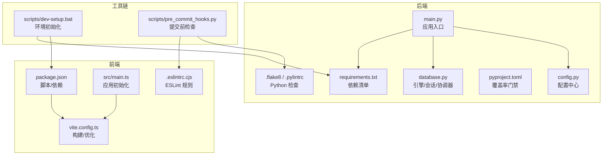
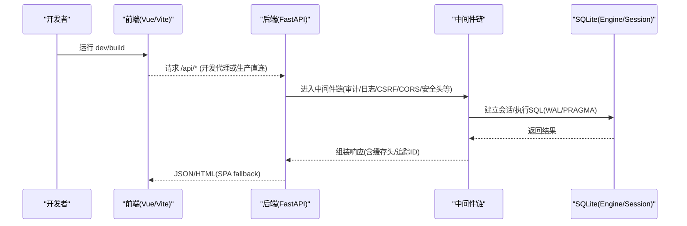
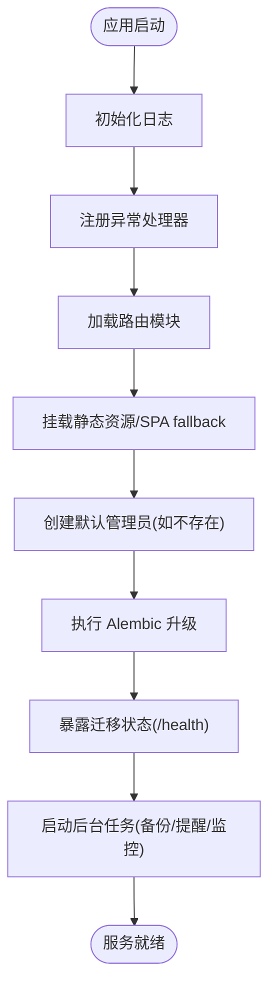
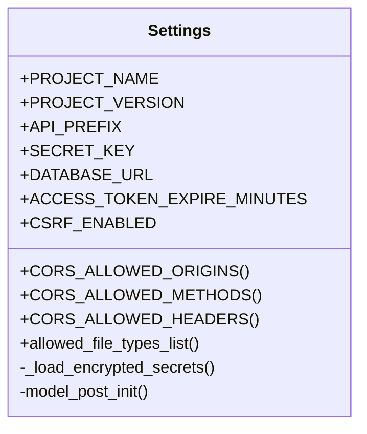
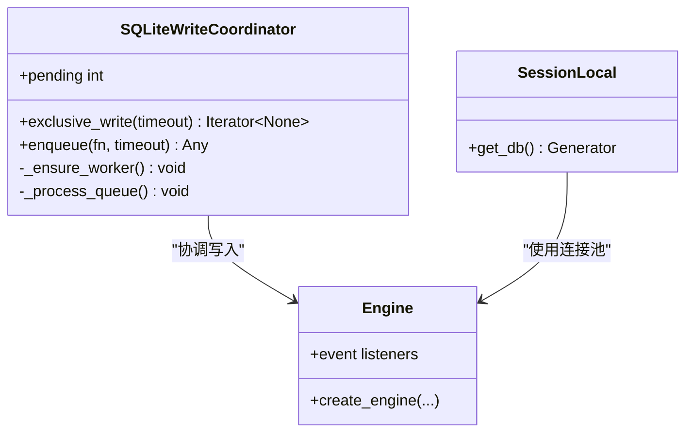
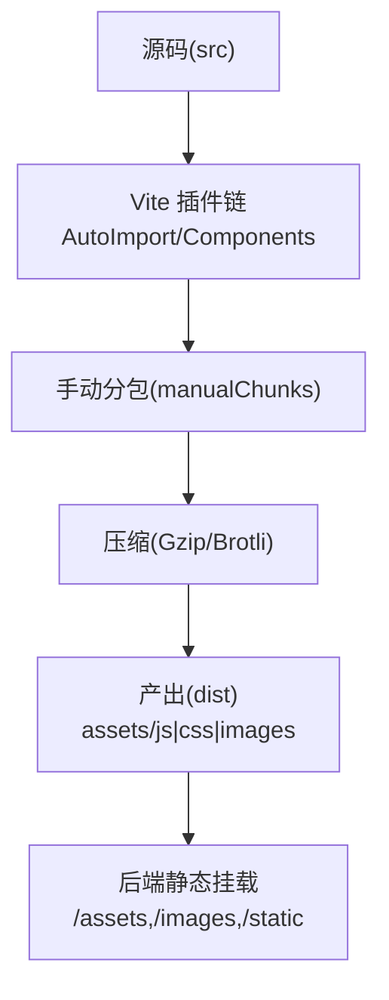
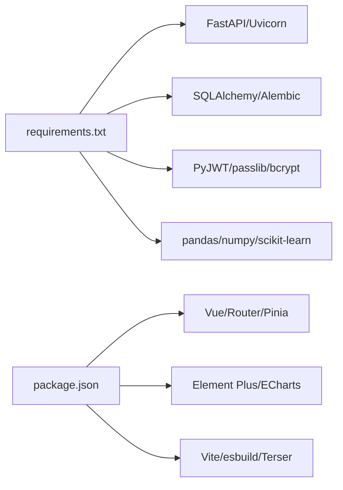

# 开发指南

<cite>
**本文引用的文件**
- [backend/app/main.py](file://backend/app/main.py)
- [backend/app/core/config.py](file://backend/app/core/config.py)
- [backend/app/core/database.py](file://backend/app/core/database.py)
- [backend/pyproject.toml](file://backend/pyproject.toml)
- [backend/requirements.txt](file://backend/requirements.txt)
- [backend/.flake8](file://backend/.flake8)
- [backend/.pylintrc](file://backend/.pylintrc)
- [frontend/package.json](file://frontend/package.json)
- [frontend/vite.config.ts](file://frontend/vite.config.ts)
- [frontend/src/main.ts](file://frontend/src/main.ts)
- [frontend/.eslintrc.cjs](file://frontend/.eslintrc.cjs)
- [scripts/dev-setup.bat](file://scripts/dev-setup.bat)
- [scripts/pre_commit_hooks.py](file://scripts/pre_commit_hooks.py)
- [README.md](file://README.md)
- [CONTRIBUTING.md](file://CONTRIBUTING.md)
</cite>

## 目录
1. [简介](#简介)
2. [项目结构](#项目结构)
3. [核心组件](#核心组件)
4. [架构总览](#架构总览)
5. [详细组件分析](#详细组件分析)
6. [依赖关系分析](#依赖关系分析)
7. [性能与可维护性](#性能与可维护性)
8. [故障排查指南](#故障排查指南)
9. [结论](#结论)
10. [附录：常用命令与规范速查](#附录：常用命令与规范速查)

## 简介
本指南面向后端（FastAPI）与前端（Vue 3 + TypeScript）开发者，提供从环境搭建、配置管理、代码风格到调试测试的一站式开发规范。目标是帮助团队快速上手、统一标准、提升质量与效率。

## 项目结构
- 后端采用 FastAPI + SQLAlchemy，使用 SQLite 作为单机数据库；通过 Alembic 进行迁移，并具备自动补列兜底能力。
- 前端基于 Vue 3 + Vite，使用 Element Plus 组件库与 Pinia 状态管理，构建产物由后端静态托管。
- 根脚本提供一键初始化开发环境与启动流程，配合 pre-commit 钩子保障提交质量。

**图示来源**
- [backend/app/main.py:98-179](file://backend/app/main.py#L98-L179)
- [backend/app/core/config.py:54-183](file://backend/app/core/config.py#L54-L183)
- [backend/app/core/database.py:55-67](file://backend/app/core/database.py#L55-L67)
- [backend/requirements.txt:1-137](file://backend/requirements.txt#L1-L137)
- [backend/pyproject.toml:1-34](file://backend/pyproject.toml#L1-L34)
- [frontend/package.json:1-73](file://frontend/package.json#L1-L73)
- [frontend/vite.config.ts:55-154](file://frontend/vite.config.ts#L55-L154)
- [frontend/src/main.ts:8-66](file://frontend/src/main.ts#L8-L66)
- [scripts/dev-setup.bat:10-69](file://scripts/dev-setup.bat#L10-L69)
- [scripts/pre_commit_hooks.py:25-34](file://scripts/pre_commit_hooks.py#L25-L34)

**章节来源**
- [README.md:30-88](file://README.md#L30-L88)
- [scripts/dev-setup.bat:10-69](file://scripts/dev-setup.bat#L10-L69)

## 核心组件
- 后端应用入口与中间件链：负责路由加载、安全头、CORS、CSRF、审计、请求日志、慢请求监控、查询计数、缓存头等。
- 配置中心：集中读取环境变量与 .env，动态计算路径与安全策略，生产环境强制关闭敏感日志输出。
- 数据库层：SQLite 深度调优（WAL、PRAGMA）、连接池、长事务独占写协调器、磁盘空间检查。
- 前端工程化：Vite 构建优化（分包、压缩、懒加载）、Element Plus 按需引入、全局错误处理与主题注入。
- 质量门禁：覆盖率门禁、flake8/bandit、ESLint、vue-tsc、pre-commit 钩子。

**章节来源**
- [backend/app/main.py:111-179](file://backend/app/main.py#L111-L179)
- [backend/app/core/config.py:54-183](file://backend/app/core/config.py#L54-L183)
- [backend/app/core/database.py:78-157](file://backend/app/core/database.py#L78-L157)
- [frontend/vite.config.ts:101-154](file://frontend/vite.config.ts#L101-L154)
- [backend/pyproject.toml:1-34](file://backend/pyproject.toml#L1-L34)

## 架构总览
后端以 FastAPI 为中心，通过中间件链对请求进行安全、审计、性能与格式转换等处理；路由模块挂载业务 API；启动时完成数据库初始化、迁移、默认管理员创建与后台任务调度。前端通过 Vite 构建，静态资源由后端在运行时挂载并提供 SPA fallback。

**图示来源**
- [backend/app/main.py:111-179](file://backend/app/main.py#L111-L179)
- [backend/app/core/database.py:78-157](file://backend/app/core/database.py#L78-L157)
- [frontend/vite.config.ts:190-206](file://frontend/vite.config.ts#L190-L206)

## 详细组件分析

### 后端应用启动与生命周期
- 启动阶段：初始化日志、注册异常处理器、加载路由、挂载静态资源、启动后台任务（备份、提醒、健康监控等）。
- 迁移与健康：编程式执行 Alembic upgrade head，失败时记录状态并通过 /health 暴露；生产环境迁移失败中止启动。
- 默认管理员：首次启动创建超级管理员，强制首次登录修改密码。

**图示来源**
- [backend/app/main.py:66-107](file://backend/app/main.py#L66-L107)
- [backend/app/main.py:235-257](file://backend/app/main.py#L235-L257)
- [backend/app/main.py:431-500](file://backend/app/main.py#L431-L500)
- [backend/app/main.py:666-739](file://backend/app/main.py#L666-L739)

**章节来源**
- [backend/app/main.py:66-107](file://backend/app/main.py#L66-L107)
- [backend/app/main.py:235-257](file://backend/app/main.py#L235-L257)
- [backend/app/main.py:431-500](file://backend/app/main.py#L431-L500)
- [backend/app/main.py:666-739](file://backend/app/main.py#L666-L739)

### 配置与环境变量
- 配置来源：优先读取 .env 与系统环境变量，支持加密密钥文件加载。
- 关键开关：DEBUG、ENVIRONMENT、CSRF_ENABLED、RATE_LIMIT_ENABLED、ENABLE_AUTO_MIGRATION、DB_ECHO（生产强制关闭）。
- 路径动态化：数据目录、上传目录、导出目录、日志目录根据运行环境自动解析为绝对路径，避免权限问题。

**图示来源**
- [backend/app/core/config.py:54-183](file://backend/app/core/config.py#L54-L183)
- [backend/app/core/config.py:208-241](file://backend/app/core/config.py#L208-L241)
- [backend/app/core/config.py:296-363](file://backend/app/core/config.py#L296-L363)

**章节来源**
- [backend/app/core/config.py:54-183](file://backend/app/core/config.py#L54-L183)
- [backend/app/core/config.py:296-363](file://backend/app/core/config.py#L296-L363)

### 数据库与写入协调器
- 引擎与会话：针对 SQLite 启用 WAL、外键约束、busy_timeout、内存缓存与 mmap 调优；连接池参数可配。
- 写入协调器：长事务使用 exclusive_write 获取进程内独占锁，避免 SQLITE_BUSY；短事务走 WAL 并发。
- 磁盘检查：提供剩余空间检测，用于备份/导入前校验。

**图示来源**
- [backend/app/core/database.py:55-67](file://backend/app/core/database.py#L55-L67)
- [backend/app/core/database.py:78-157](file://backend/app/core/database.py#L78-L157)
- [backend/app/core/database.py:198-289](file://backend/app/core/database.py#L198-L289)
- [backend/app/core/database.py:308-343](file://backend/app/core/database.py#L308-L343)

**章节来源**
- [backend/app/core/database.py:55-67](file://backend/app/core/database.py#L55-L67)
- [backend/app/core/database.py:78-157](file://backend/app/core/database.py#L78-L157)
- [backend/app/core/database.py:198-289](file://backend/app/core/database.py#L198-L289)
- [backend/app/core/database.py:308-343](file://backend/app/core/database.py#L308-L343)

### 前端工程化与最佳实践
- 构建优化：手动分包（vue-core、pinia、echarts、xlsx 等），Gzip/Brotli 压缩，CSS 代码分割，资源命名带 hash。
- 按需引入：Element Plus 组件与图标按需加载，减少首屏体积。
- 开发体验：SPA fallback、代理 /api 与 /uploads、SCSS 全局变量注入、dev sourcemap。
- 类型与质量：vue-tsc 类型检查、ESLint 严格规则、禁止 response.data.success 双重解包。

**图示来源**
- [frontend/vite.config.ts:101-154](file://frontend/vite.config.ts#L101-L154)
- [frontend/vite.config.ts:288-410](file://frontend/vite.config.ts#L288-L410)
- [backend/app/main.py:290-371](file://backend/app/main.py#L290-L371)

**章节来源**
- [frontend/vite.config.ts:101-154](file://frontend/vite.config.ts#L101-L154)
- [frontend/vite.config.ts:288-410](file://frontend/vite.config.ts#L288-L410)
- [backend/app/main.py:290-371](file://backend/app/main.py#L290-L371)

### 代码风格与命名规范
- Python：PEP 8，行宽 120；函数/类/模块需 docstring；使用 Pydantic 模型校验请求/响应。
- Vue/TS：使用 <script setup lang="ts">；组件 PascalCase；模板避免复杂表达式；vue-tsc 严格模式。
- 提交信息：语义化 commit（feat/fix/refactor/docs/test/build/chore）。

**章节来源**
- [CONTRIBUTING.md:29-48](file://CONTRIBUTING.md#L29-L48)
- [backend/.flake8:1-5](file://backend/.flake8#L1-L5)
- [backend/.pylintrc:1-67](file://backend/.pylintrc#L1-L67)

### 调试技巧
- 后端：
  - 使用 /health 查看版本与迁移状态；开启 DEBUG 可访问 /docs 与 /redoc。
  - 通过慢请求监控与查询计数定位瓶颈；必要时临时开启 DB_ECHO 观察 SQL。
- 前端：
  - 开发服务器端口 5173，代理 /api 至后端；构建后通过 vite preview 预览。
  - 使用浏览器网络面板与 Source Map 定位问题；注意生产环境移除 console/debugger。

**章节来源**
- [backend/app/main.py:98-107](file://backend/app/main.py#L98-L107)
- [backend/app/main.py:235-257](file://backend/app/main.py#L235-L257)
- [backend/app/core/config.py:301-309](file://backend/app/core/config.py#L301-L309)
- [frontend/vite.config.ts:175-206](file://frontend/vite.config.ts#L175-L206)
- [frontend/vite.config.ts:221-265](file://frontend/vite.config.ts#L221-L265)

### 测试编写方法
- 后端：pytest 组织单元/集成/安全测试；覆盖率目标 100%（pyproject.toml 中 fail_under=100）。
- 前端：Vitest 单元测试，Playwright E2E；npm test 与 npm run test:coverage 生成报告。
- 建议：新功能覆盖边界与异常分支；集成测试覆盖关键 API 路径。

**章节来源**
- [backend/pyproject.toml:1-34](file://backend/pyproject.toml#L1-L34)
- [frontend/package.json:13-18](file://frontend/package.json#L13-L18)
- [README.md:93-126](file://README.md#L93-L126)

### 代码质量检查工具
- 后端：flake8（行宽 120）、bandit（安全扫描）、pylint（复杂度/设计指标）。
- 前端：ESLint 严格规则（禁止 response.data.success 双重解包）、vue-tsc 类型检查、prettier 格式化。
- 提交前：pre-commit 钩子统一执行 flake8、bandit、vue-tsc。

**章节来源**
- [backend/.flake8:1-5](file://backend/.flake8#L1-L5)
- [backend/.pylintrc:1-67](file://backend/.pylintrc#L1-L67)
- [frontend/.eslintrc.cjs:19-35](file://frontend/.eslintrc.cjs#L19-L35)
- [scripts/pre_commit_hooks.py:25-34](file://scripts/pre_commit_hooks.py#L25-L34)

## 依赖关系分析
- 后端依赖集中在 requirements.txt，框架与数据库、认证、数据处理、日志监控等分层清晰。
- 前端依赖在 package.json，构建与开发工具分离，运行时依赖精简。
- 构建与打包：Vite 分包策略将大型库独立 chunk，降低首屏体积；后端通过 Alembic 管理数据库变更。

**图示来源**
- [backend/requirements.txt:1-137](file://backend/requirements.txt#L1-L137)
- [frontend/package.json:26-68](file://frontend/package.json#L26-L68)

**章节来源**
- [backend/requirements.txt:1-137](file://backend/requirements.txt#L1-L137)
- [frontend/package.json:26-68](file://frontend/package.json#L26-L68)

## 性能与可维护性
- 数据库：WAL + PRAGMA 调优 + 连接池 + 长事务独占写，兼顾并发与一致性。
- 构建：分包与压缩、懒加载重型库（图表/表格），减少首屏体积与加载时间。
- 可观测性：慢请求监控、查询计数、审计日志、健康检查端点。
- 可维护性：Alembic 迁移、覆盖率门禁、严格的 lint 与类型检查、清晰的模块划分。

[本节为通用指导，不直接分析具体文件]

## 故障排查指南
- 启动失败：
  - 检查 .env 与 SECRET_KEY、CSRF_SECRET_KEY 是否已自动生成或配置。
  - 确认数据库路径与权限，必要时设置 ENABLE_AUTO_MIGRATION 允许自动补列。
- 迁移异常：
  - 查看 /health 的 migration 字段；生产环境迁移失败会中止启动，需修复迁移脚本后重试。
- 前端白屏：
  - 确认构建产物存在且被后端正确挂载；检查 SPA fallback 与 base 路径配置。
- 性能问题：
  - 通过慢请求监控与查询计数定位热点接口；必要时调整 DB_POOL_* 与 PRAGMA 参数。

**章节来源**
- [backend/app/core/config.py:296-363](file://backend/app/core/config.py#L296-L363)
- [backend/app/main.py:235-257](file://backend/app/main.py#L235-L257)
- [backend/app/main.py:290-371](file://backend/app/main.py#L290-L371)
- [backend/app/core/database.py:78-157](file://backend/app/core/database.py#L78-L157)

## 结论
本项目在后端与前端均建立了完善的工程化体系：统一的配置管理、严格的代码质量门禁、健壮的数据库与构建优化、以及完善的调试与测试支撑。遵循本指南可显著提升开发效率与交付质量。

[本节为总结性内容，不直接分析具体文件]

## 附录：常用命令与规范速查
- 环境初始化
  - Windows: scripts\dev-setup.bat
  - Linux: bash scripts/dev-setup.sh
- 启动服务
  - 后端: cd backend && python start.py
  - 前端: cd frontend && npm run dev
- 测试与覆盖率
  - 后端: cd backend && pytest tests/ -q --tb=short
  - 前端: cd frontend && npm test 与 npm run test:coverage
- 代码检查
  - 后端: flake8 app/ --max-line-length=120; bandit -r app/
  - 前端: npm run lint; npm run type-check
- 构建
  - 前端: npm run build; npm run preview
  - 全量: make build-win-x64 / make build-kylin

**章节来源**
- [scripts/dev-setup.bat:10-69](file://scripts/dev-setup.bat#L10-L69)
- [README.md:42-59](file://README.md#L42-L59)
- [README.md:108-144](file://README.md#L108-L144)
- [frontend/package.json:7-19](file://frontend/package.json#L7-L19)
- [backend/pyproject.toml:1-34](file://backend/pyproject.toml#L1-L34)