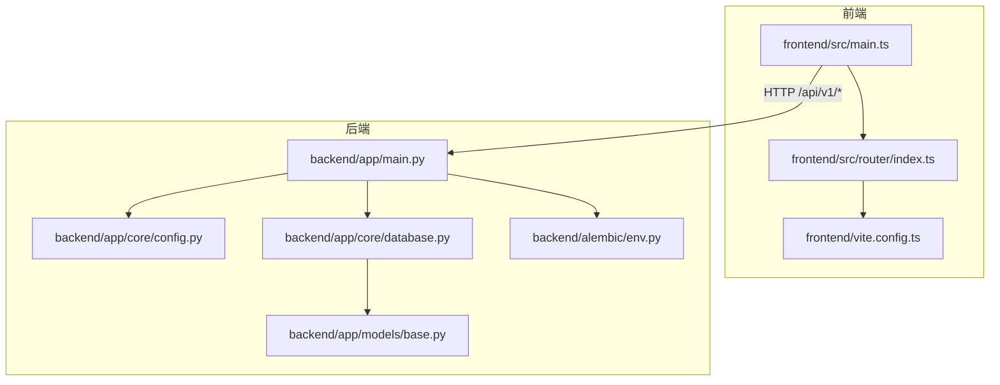
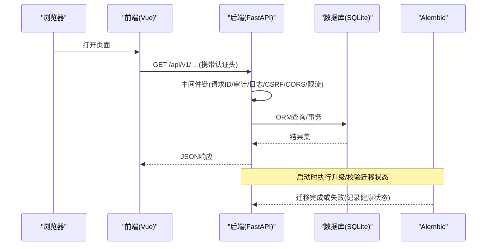
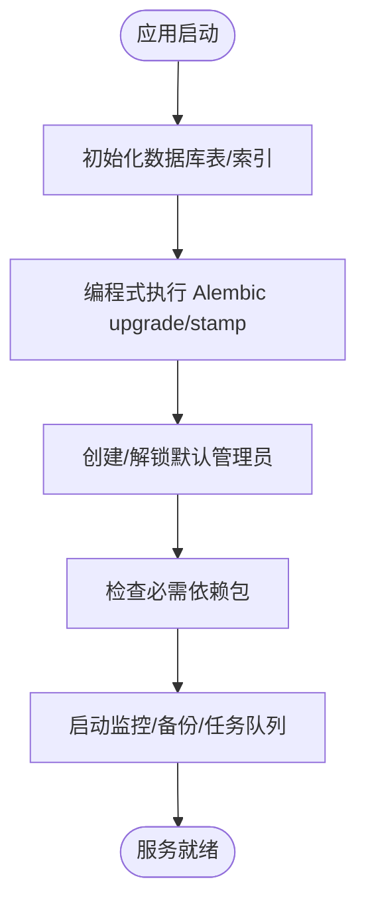
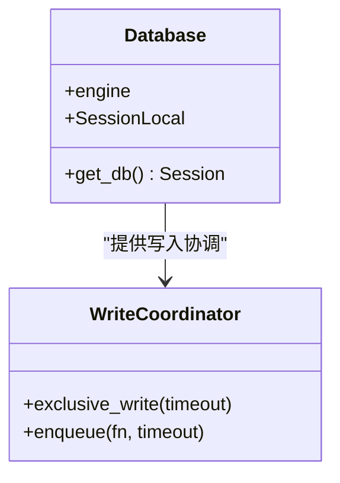
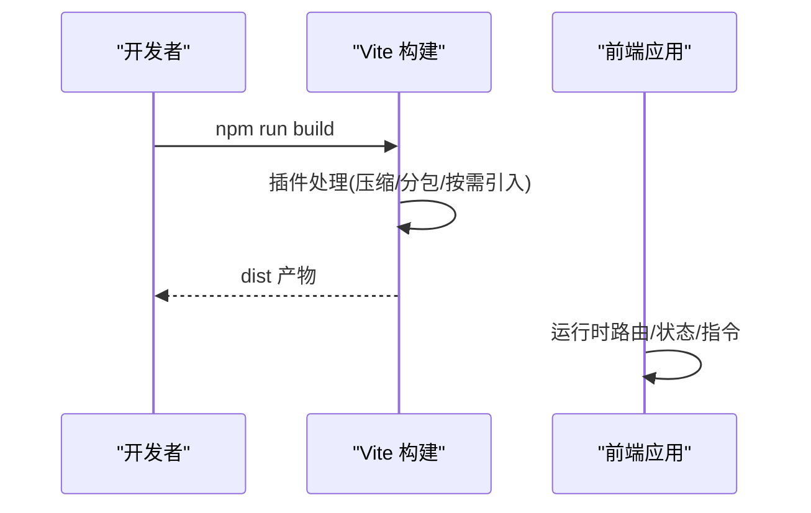
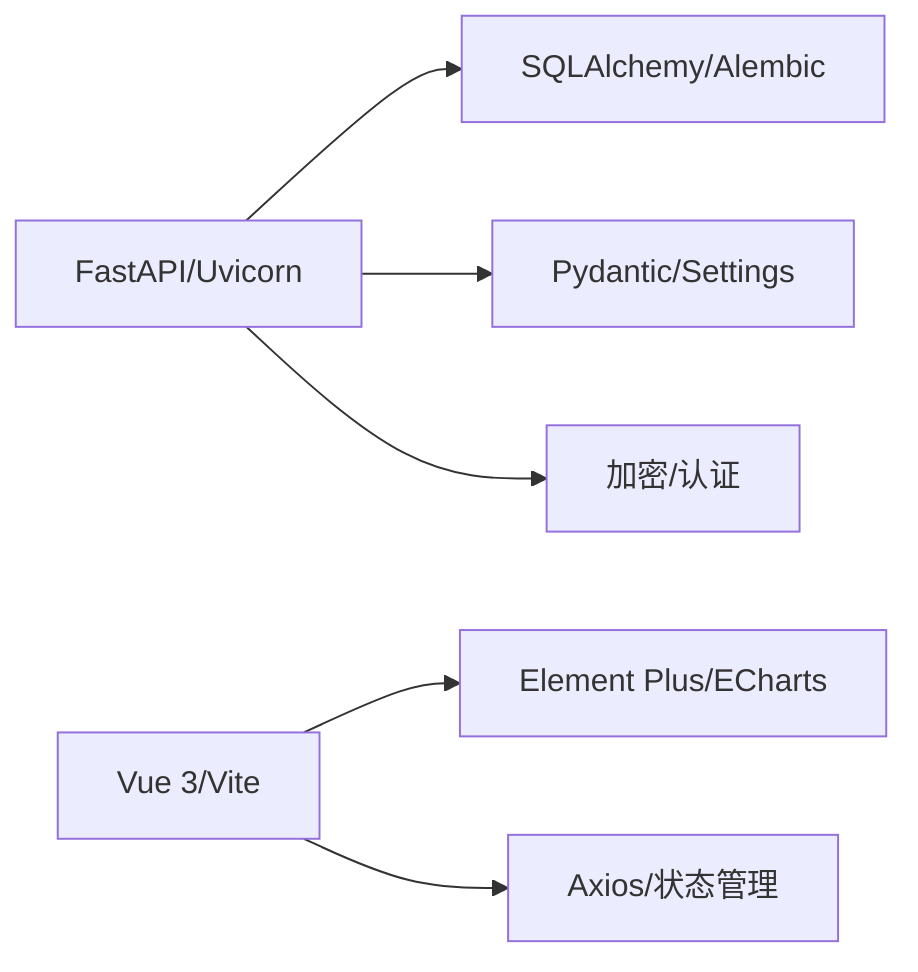

# 开发者指南

<cite>
**本文引用的文件**
- [backend/app/main.py](file://backend/app/main.py)
- [backend/app/core/config.py](file://backend/app/core/config.py)
- [backend/app/core/database.py](file://backend/app/core/database.py)
- [backend/alembic/env.py](file://backend/alembic/env.py)
- [backend/app/models/base.py](file://backend/app/models/base.py)
- [frontend/src/main.ts](file://frontend/src/main.ts)
- [frontend/vite.config.ts](file://frontend/vite.config.ts)
- [frontend/src/router/index.ts](file://frontend/src/router/index.ts)
- [backend/requirements.txt](file://backend/requirements.txt)
- [frontend/package.json](file://frontend/package.json)
</cite>

## 目录
1. [简介](#简介)
2. [项目结构](#项目结构)
3. [核心组件](#核心组件)
4. [架构总览](#架构总览)
5. [详细组件分析](#详细组件分析)
6. [依赖关系分析](#依赖关系分析)
7. [性能考量](#性能考量)
8. [故障排查指南](#故障排查指南)
9. [结论](#结论)
10. [附录](#附录)

## 简介
本指南面向后端与前端开发者，系统性说明帮扶管理信息系统的整体架构、代码组织、开发规范与实践。内容涵盖：
- 后端 FastAPI 应用启动、中间件链、数据库与迁移、安全与权限、API 设计
- 前端 Vue 3 + Vite 工程化、路由与状态管理、构建优化与调试
- 数据库设计模式（ORM、迁移、索引）
- API 接口设计规范（版本化、鉴权、错误码、分页）
- 开发环境搭建、调试技巧、测试编写、代码质量检查
- 常见开发场景与最佳实践

## 项目结构
仓库采用前后端分离的工程组织：
- backend：FastAPI 后端服务，包含 API、模型、服务、中间件、配置、迁移、脚本与测试
- frontend：Vue 3 + TypeScript + Vite 前端工程，包含路由、视图、组件、状态、样式与构建配置
- electron：桌面端打包入口（可选）
- deploy/docker/nginx：部署与容器化相关资源
- docs：产品与开发文档

**图表来源**
- [backend/app/main.py:98-179](file://backend/app/main.py#L98-L179)
- [backend/app/core/config.py:54-183](file://backend/app/core/config.py#L54-L183)
- [backend/app/core/database.py:55-67](file://backend/app/core/database.py#L55-L67)
- [backend/alembic/env.py:26-42](file://backend/alembic/env.py#L26-L42)
- [backend/app/models/base.py:19-20](file://backend/app/models/base.py#L19-L20)
- [frontend/src/main.ts:46-66](file://frontend/src/main.ts#L46-L66)
- [frontend/vite.config.ts:55-154](file://frontend/vite.config.ts#L55-L154)

**章节来源**
- [backend/app/main.py:98-179](file://backend/app/main.py#L98-L179)
- [frontend/src/main.ts:46-66](file://frontend/src/main.ts#L46-L66)
- [frontend/vite.config.ts:55-154](file://frontend/vite.config.ts#L55-L154)

## 核心组件
- 后端应用入口与生命周期：FastAPI 实例创建、异常处理器注册、中间件链、路由挂载、静态资源与 SPA fallback、健康检查、定时任务与监控
- 配置中心：基于 pydantic-settings 的环境配置，支持加密密钥、数据库、CORS、CSRF、速率限制、日志等
- 数据库层：SQLAlchemy 引擎与连接池、SQLite PRAGMA 调优、写入协调器、磁盘空间检查
- 数据模型基类：Base、时间戳混入、软删除混入、乐观锁版本号、字典转换
- 迁移系统：Alembic 在线/离线模式，兼容自动补列机制
- 前端应用：Vue 3 应用初始化、全局指令、Pinia、路由、主题与样式注入、错误处理
- 构建与优化：Vite 插件、按需引入、分包策略、压缩与预加载

**章节来源**
- [backend/app/main.py:66-179](file://backend/app/main.py#L66-L179)
- [backend/app/core/config.py:54-183](file://backend/app/core/config.py#L54-L183)
- [backend/app/core/database.py:55-187](file://backend/app/core/database.py#L55-L187)
- [backend/app/models/base.py:19-185](file://backend/app/models/base.py#L19-L185)
- [backend/alembic/env.py:45-110](file://backend/alembic/env.py#L45-L110)
- [frontend/src/main.ts:8-66](file://frontend/src/main.ts#L8-L66)
- [frontend/vite.config.ts:55-472](file://frontend/vite.config.ts#L55-L472)

## 架构总览
系统采用“前端 SPA + 后端 RESTful API”的解耦架构。前端通过 Vite 构建并托管于后端静态目录或独立服务器；后端以 FastAPI 提供统一 API，使用 SQLAlchemy 访问 SQLite（可切换其他数据库），并通过 Alembic 管理数据库变更。

**图表来源**
- [backend/app/main.py:111-179](file://backend/app/main.py#L111-L179)
- [backend/app/core/database.py:174-187](file://backend/app/core/database.py#L174-L187)
- [backend/alembic/env.py:79-110](file://backend/alembic/env.py#L79-L110)
- [backend/app/main.py:235-257](file://backend/app/main.py#L235-L257)

## 详细组件分析

### 后端 FastAPI 应用与中间件链
- 应用生命周期：启动时初始化数据库表、恢复 Token 黑名单、检查版本变更、种子管理员、检查依赖包、启动监控与备份调度、启动任务队列；关闭时有序停止
- 中间件顺序（从外到内）：请求ID → 安全头 → CORS → 驼峰转蛇形 → CSRF → 请求日志 → 审计 → 慢请求/查询计数 → 指标
- 静态资源与 SPA：按策略为带 hash 的资源设置长期缓存，index.html 不缓存以保证更新
- 健康检查：暴露版本、构建信息与迁移状态（是否达到 head）

**图表来源**
- [backend/app/main.py:66-96](file://backend/app/main.py#L66-L96)
- [backend/app/main.py:397-428](file://backend/app/main.py#L397-L428)
- [backend/app/main.py:431-500](file://backend/app/main.py#L431-L500)
- [backend/app/main.py:666-739](file://backend/app/main.py#L666-L739)
- [backend/app/main.py:742-761](file://backend/app/main.py#L742-L761)

**章节来源**
- [backend/app/main.py:66-179](file://backend/app/main.py#L66-L179)
- [backend/app/main.py:235-378](file://backend/app/main.py#L235-L378)

### 配置与环境变量
- 使用 pydantic-settings 集中管理配置，支持多环境 .env 文件
- 关键配置项：项目名/版本、API 前缀、SECRET_KEY、数据库 URL、连接池参数、CORS/CSRF、速率限制、日志、上传导出路径、缓存、监控、告警、自动迁移开关
- 生产环境强制关闭 SQL echo，动态生成并持久化加密密钥，路径规范化避免权限问题

**章节来源**
- [backend/app/core/config.py:54-183](file://backend/app/core/config.py#L54-L183)
- [backend/app/core/config.py:243-383](file://backend/app/core/config.py#L243-L383)

### 数据库与 ORM
- 引擎与连接池：针对 SQLite 启用 WAL、NORMAL 同步、busy_timeout、内存临时存储、自动索引、PRAGMA optimize
- 会话管理：get_db 依赖注入，异常时回滚并关闭连接
- 写入协调器：exclusive_write 上下文管理器用于长事务独占写，避免 SQLITE_BUSY
- 磁盘空间检查：备份/导入前检测可用空间

**图表来源**
- [backend/app/core/database.py:55-67](file://backend/app/core/database.py#L55-L67)
- [backend/app/core/database.py:174-187](file://backend/app/core/database.py#L174-L187)
- [backend/app/core/database.py:198-289](file://backend/app/core/database.py#L198-L289)

**章节来源**
- [backend/app/core/database.py:70-187](file://backend/app/core/database.py#L70-L187)
- [backend/app/core/database.py:198-289](file://backend/app/core/database.py#L198-L289)
- [backend/app/core/database.py:292-343](file://backend/app/core/database.py#L292-L343)

### 数据模型与基类
- Base 声明式基类，提供 to_dict 扩展
- TimestampMixin：created_at/updated_at/sync_version，并在更新时自动递增 sync_version
- SoftDeleteMixin：is_deleted/deleted_at/deleted_by，提供 soft_delete/restore
- VersionMixin：version 乐观锁
- BaseModel：id + 时间戳，to_dict 支持 camelCase

**章节来源**
- [backend/app/models/base.py:19-185](file://backend/app/models/base.py#L19-L185)

### 数据库迁移（Alembic）
- 在线/离线模式：根据 context 选择运行方式
- 与自动补列共存：在 autogenerate 前执行 _migrate_missing_columns，避免重复 DDL
- 目标元数据：Base.metadata，确保所有模型已注册

**章节来源**
- [backend/alembic/env.py:45-110](file://backend/alembic/env.py#L45-L110)

### 前端 Vue 3 应用与构建
- 应用初始化：挂载 Pinia、Router、全局指令（权限、水印）、全局错误处理、消息默认配置
- 路由：模块化定义，懒加载视图，公共路由与主布局子路由清晰划分
- 构建优化：按需引入 Element Plus、Gzip/Brotli 压缩、手动分包（vue-core、echarts、xlsx 等）、资源命名与缓存策略、SourceMap 控制

**图表来源**
- [frontend/src/main.ts:8-66](file://frontend/src/main.ts#L8-L66)
- [frontend/vite.config.ts:55-472](file://frontend/vite.config.ts#L55-L472)
- [frontend/src/router/index.ts:1-800](file://frontend/src/router/index.ts#L1-L800)

**章节来源**
- [frontend/src/main.ts:8-66](file://frontend/src/main.ts#L8-L66)
- [frontend/vite.config.ts:55-472](file://frontend/vite.config.ts#L55-L472)
- [frontend/src/router/index.ts:1-800](file://frontend/src/router/index.ts#L1-L800)

### API 接口设计规范
- 版本化：统一前缀 /api/v1，便于演进与兼容
- 鉴权与安全：JWT 令牌、CSRF（可配置）、CORS、速率限制、安全响应头
- 错误处理：统一异常处理器，返回结构化错误信息
- 分页与过滤：建议通过查询参数实现列表分页与筛选
- 幂等与重试：对写操作建议使用幂等键或唯一约束，客户端侧合理重试
- 文档：开发环境开启 /docs 与 /redoc，生产环境关闭

**章节来源**
- [backend/app/main.py:98-107](file://backend/app/main.py#L98-L107)
- [backend/app/main.py:111-179](file://backend/app/main.py#L111-L179)

## 依赖关系分析
- 后端依赖：FastAPI、Uvicorn、SQLAlchemy、Alembic、Pydantic、加密库、数据处理库、日志监控等
- 前端依赖：Vue 3、Vue Router、Pinia、Element Plus、ECharts、Axios、构建工具链
- 构建与发布：Vite 插件、压缩、分包、类型检查、测试框架

**图表来源**
- [backend/requirements.txt:1-137](file://backend/requirements.txt#L1-L137)
- [frontend/package.json:26-68](file://frontend/package.json#L26-L68)

**章节来源**
- [backend/requirements.txt:1-137](file://backend/requirements.txt#L1-L137)
- [frontend/package.json:26-68](file://frontend/package.json#L26-L68)

## 性能考量
- 数据库：WAL 模式、连接池大小与超时、PRAGMA 调优、批量写入与长事务隔离、索引优化
- 后端：中间件最小化开销、慢请求监控、查询计数、异步任务队列
- 前端：按需引入、分包策略、资源压缩、懒加载、缓存策略
- 构建：SourceMap 仅在开发启用、移除 console/debugger、死代码消除

[本节为通用指导，无需特定文件引用]

## 故障排查指南
- 迁移失败：查看 /health 中 migration.at_head 与 error，确认 alembic current/heads；生产环境迁移失败会中止启动以避免 schema 漂移风险
- 数据库锁定：长事务使用 exclusive_write；短事务依赖 busy_timeout 自动重试；必要时降低并发或拆分任务
- 登录与权限：检查 JWT、CSRF、CORS 配置；确认用户未被锁定；验证角色/菜单权限
- 前端路由：SPA fallback 需保证 index.html 不被缓存；开发代理 /api 指向后端端口
- 构建问题：按需引入未生效时检查 resolver 配置；分包过大时调整 manualChunks

**章节来源**
- [backend/app/main.py:235-257](file://backend/app/main.py#L235-L257)
- [backend/app/main.py:431-500](file://backend/app/main.py#L431-L500)
- [backend/app/core/database.py:198-289](file://backend/app/core/database.py#L198-L289)
- [frontend/vite.config.ts:29-53](file://frontend/vite.config.ts#L29-L53)
- [frontend/vite.config.ts:286-410](file://frontend/vite.config.ts#L286-L410)

## 结论
本项目采用成熟的 FastAPI + Vue 3 技术栈，具备完善的配置管理、数据库迁移、安全与监控能力。通过清晰的模块划分、中间件链与构建优化，既保证了开发效率，也兼顾了生产环境的稳定性与性能。遵循本指南中的规范与实践，可快速上手并高效迭代。

[本节为总结性内容，无需特定文件引用]

## 附录

### 开发环境搭建
- 后端
  - 安装 Python 依赖：pip install -r backend/requirements.txt
  - 配置环境变量：复制 .env 模板，设置 DATABASE_URL、SECRET_KEY、CORS/CSRF 等
  - 启动服务：uvicorn 或项目启动脚本；首次启动会自动建表与迁移
- 前端
  - 安装 Node.js 与依赖：npm ci
  - 开发模式：npm run dev（Vite 默认 5173 端口，代理 /api 至后端）
  - 构建：npm run build（输出到 dist，供后端静态托管）

**章节来源**
- [backend/requirements.txt:1-137](file://backend/requirements.txt#L1-L137)
- [frontend/package.json:7-19](file://frontend/package.json#L7-L19)
- [frontend/vite.config.ts:175-206](file://frontend/vite.config.ts#L175-L206)

### 调试技巧
- 后端
  - 开启 DEBUG 模式以启用 /docs 与 OpenAPI
  - 使用慢请求监控与查询计数定位瓶颈
  - 健康检查 /health 查看迁移状态与版本信息
- 前端
  - 使用浏览器网络面板观察 API 调用与响应
  - 检查路由守卫与权限指令是否正确拦截
  - 构建后使用 vite preview 预览生产行为

**章节来源**
- [backend/app/main.py:98-107](file://backend/app/main.py#L98-L107)
- [backend/app/main.py:111-179](file://backend/app/main.py#L111-L179)
- [backend/app/main.py:235-257](file://backend/app/main.py#L235-L257)
- [frontend/vite.config.ts:175-206](file://frontend/vite.config.ts#L175-L206)

### 测试编写
- 后端：使用 pytest 进行单元与集成测试，覆盖 API、服务、中间件与数据库交互
- 前端：使用 Vitest 进行单元测试，Playwright 进行端到端测试
- 覆盖率：结合 coverage 与 CI 门禁保障质量

[本节为通用指导，无需特定文件引用]

### 代码质量检查
- 后端：flake8、pylint、bandit、mypy（可选）
- 前端：ESLint、Prettier、TypeScript 类型检查
- 提交钩子：pre-commit 统一格式化与检查

**章节来源**
- [frontend/package.json:16-19](file://frontend/package.json#L16-L19)

### 常见开发场景与最佳实践
- 新增 API
  - 在 app/api/v1 下按模块创建路由文件，注册到主路由器
  - 使用 Pydantic Schema 校验输入输出，统一错误响应格式
  - 添加鉴权与权限校验，记录审计日志
- 新增数据模型
  - 继承 BaseModel，合理使用混入（时间戳、软删除、版本号）
  - 生成 Alembic 迁移脚本，避免依赖自动补列
  - 为高频查询字段添加索引
- 前端页面
  - 使用路由懒加载与组件按需引入，减少首屏体积
  - 统一表单与列表页样式，提升一致性
  - 使用 Pinia 管理状态，避免跨组件状态污染

[本节为通用指导，无需特定文件引用]