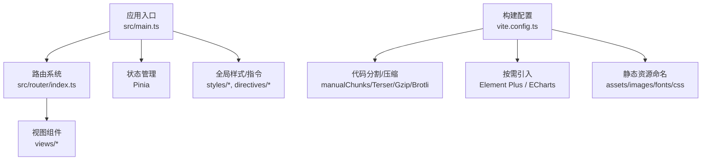
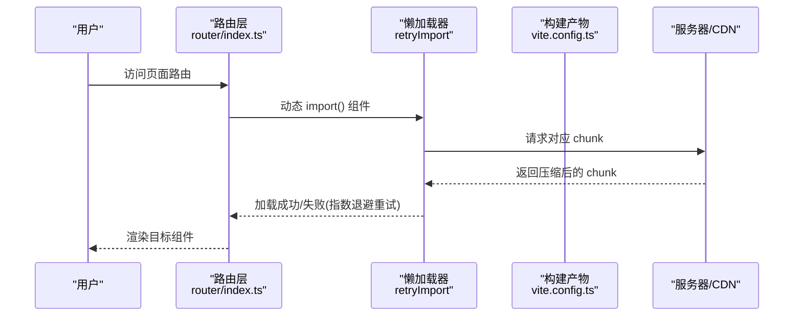
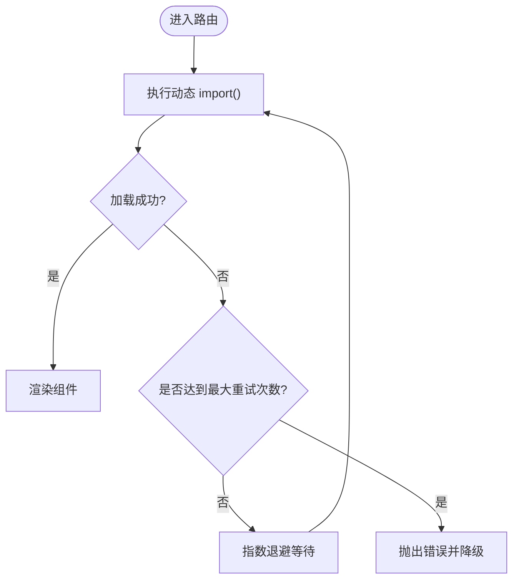
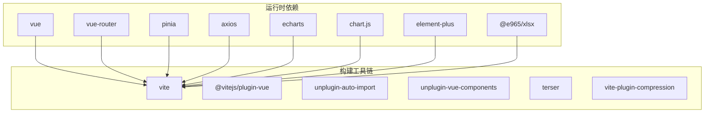

# 前端性能优化

<cite>
**本文引用的文件**
- [frontend/package.json](file://frontend/package.json)
- [frontend/vite.config.ts](file://frontend/vite.config.ts)
- [frontend/src/main.ts](file://frontend/src/main.ts)
- [frontend/src/router/index.ts](file://frontend/src/router/index.ts)
- [frontend/src/composables/useChunkLoader.ts](file://frontend/src/composables/useChunkLoader.ts)
</cite>

## 目录
1. [简介](#简介)
2. [项目结构](#项目结构)
3. [核心组件](#核心组件)
4. [架构总览](#架构总览)
5. [详细组件分析](#详细组件分析)
6. [依赖分析](#依赖分析)
7. [性能考量](#性能考量)
8. [故障排查指南](#故障排查指南)
9. [结论](#结论)
10. [附录](#附录)

## 简介
本指南面向本项目的前端性能优化，聚焦 Vue 3 应用与 Vite 构建链路。内容涵盖：
- 组件懒加载、虚拟滚动、计算属性优化
- 资源加载优化（代码分割、图片/字体优化、CDN 使用）
- 渲染性能提升（DOM 操作、事件处理、内存泄漏预防）
- ECharts 大数据量渲染优化
- 前端性能监控（Lighthouse、Web Vitals）
并提供基于仓库现有实现的“优化前后对比”思路与可量化指标建议。

## 项目结构
前端采用 Vue 3 + TypeScript + Vite，配合 Element Plus、Pinia、Vue Router、ECharts、Chart.js 等生态库。构建配置集中在 vite.config.ts，路由定义在 src/router/index.ts，入口在 src/main.ts，动态分包重试逻辑封装在 composables/useChunkLoader.ts。

图表来源
- [frontend/src/main.ts:1-69](file://frontend/src/main.ts#L1-L69)
- [frontend/src/router/index.ts:1-800](file://frontend/src/router/index.ts#L1-L800)
- [frontend/vite.config.ts:1-472](file://frontend/vite.config.ts#L1-L472)

章节来源
- [frontend/package.json:1-73](file://frontend/package.json#L1-L73)
- [frontend/vite.config.ts:1-472](file://frontend/vite.config.ts#L1-L472)
- [frontend/src/main.ts:1-69](file://frontend/src/main.ts#L1-L69)
- [frontend/src/router/index.ts:1-800](file://frontend/src/router/index.ts#L1-L800)

## 核心组件
- 构建与打包（Vite）
  - 生产环境启用 Gzip/Brotli 压缩，阈值 10KB 以上生效。
  - 精细 manualChunks 策略：将 Vue、Router、Pinia、Axios、ECharts、Chart.js、xlsx、driver、sortable、security、lodash、core-js 等拆分为独立 chunk；Element Plus 通过解析器按需分包，避免整包预加载。
  - 输出路径按类型分目录（js/vendor/js/views/assets/images/fonts/css），便于缓存与 CDN 分发。
  - 关闭 source map（生产）、CSS 压缩、模块预加载 polyfill、内联小资源（≤4KB）。
- 路由与懒加载
  - 所有路由组件均使用动态 import() 实现路由级懒加载，并通过 retryImport 包装提供指数退避重试，降低网络抖动导致的白屏风险。
- 应用初始化
  - 命令式 UI 组件样式显式注入，确保提示框/通知等样式可用。
  - 主题提前应用到 DOM，避免首屏闪烁（FOUC）。
  - 全局错误处理、权限指令、水印指令安装。

章节来源
- [frontend/vite.config.ts:133-153](file://frontend/vite.config.ts#L133-L153)
- [frontend/vite.config.ts:211-426](file://frontend/vite.config.ts#L211-L426)
- [frontend/vite.config.ts:286-413](file://frontend/vite.config.ts#L286-L413)
- [frontend/src/router/index.ts:1-800](file://frontend/src/router/index.ts#L1-L800)
- [frontend/src/composables/useChunkLoader.ts:1-59](file://frontend/src/composables/useChunkLoader.ts#L1-L59)
- [frontend/src/main.ts:16-66](file://frontend/src/main.ts#L16-L66)

## 架构总览
下图展示从浏览器到构建产物的关键路径：路由触发懒加载 → 动态导入 chunk → 构建期拆分与压缩 → 运行时按需加载。

图表来源
- [frontend/src/router/index.ts:1-800](file://frontend/src/router/index.ts#L1-L800)
- [frontend/src/composables/useChunkLoader.ts:1-59](file://frontend/src/composables/useChunkLoader.ts#L1-L59)
- [frontend/vite.config.ts:286-413](file://frontend/vite.config.ts#L286-L413)

## 详细组件分析

### 路由懒加载与健壮性
- 路由级懒加载：所有视图组件以函数形式声明 component，结合 Vite 的动态 import 实现按需加载。
- 重试机制：retryImport 对动态 import 进行指数退避重试，默认最多 3 次重试，逐步增加等待时间，避免瞬时网络问题导致白屏。
- 建议：对超大 chunk（如 ECharts、xlsx）保持懒加载，必要时结合路由守卫或用户交互时机触发加载。

图表来源
- [frontend/src/composables/useChunkLoader.ts:17-56](file://frontend/src/composables/useChunkLoader.ts#L17-L56)
- [frontend/src/router/index.ts:1-800](file://frontend/src/router/index.ts#L1-L800)

章节来源
- [frontend/src/router/index.ts:1-800](file://frontend/src/router/index.ts#L1-L800)
- [frontend/src/composables/useChunkLoader.ts:1-59](file://frontend/src/composables/useChunkLoader.ts#L1-L59)

### 构建期代码分割与压缩
- 第三方库拆分：Vue、Router、Pinia、Axios、ECharts、Chart.js、xlsx、driver、sortable、security、lodash、core-js 等各自独立 chunk，减少首屏体积。
- Element Plus 按需引入：通过解析器仅打包用到的组件与样式，避免 700+ KB 的整包。
- 压缩策略：Terser 移除 console/debugger、无用代码、混淆变量名；Gzip/Brotli 二次压缩，阈值 10KB。
- 资源命名：JS/CSS/图片/字体按类型分目录并带 hash，利于长期缓存。

图表来源
- [frontend/vite.config.ts:211-426](file://frontend/vite.config.ts#L211-L426)
- [frontend/vite.config.ts:286-413](file://frontend/vite.config.ts#L286-L413)

章节来源
- [frontend/vite.config.ts:133-153](file://frontend/vite.config.ts#L133-L153)
- [frontend/vite.config.ts:211-426](file://frontend/vite.config.ts#L211-L426)
- [frontend/vite.config.ts:286-413](file://frontend/vite.config.ts#L286-L413)

### 应用初始化与样式注入
- 命令式 UI 样式显式引入，保证 ElMessage/MessageBox/Notification 样式正确。
- 主题在挂载前写入 DOM，避免 FOUC。
- 全局错误处理、权限指令、水印指令统一安装。

章节来源
- [frontend/src/main.ts:16-66](file://frontend/src/main.ts#L16-L66)

## 依赖分析
- 运行时依赖：vue、vue-router、pinia、axios、echarts、chart.js、element-plus、@e965/xlsx、dayjs、dompurify、sortablejs 等。
- 开发依赖：vite、@vitejs/plugin-vue、unplugin-auto-import、unplugin-vue-components、terser、vite-plugin-compression、vitest、eslint、prettier 等。
- 构建期外部化（可选）：可通过 external 将大型库交由 CDN 托管，进一步减小主包体积。

图表来源
- [frontend/package.json:26-67](file://frontend/package.json#L26-L67)
- [frontend/vite.config.ts:16-23](file://frontend/vite.config.ts#L16-L23)

章节来源
- [frontend/package.json:1-73](file://frontend/package.json#L1-L73)
- [frontend/vite.config.ts:16-23](file://frontend/vite.config.ts#L16-L23)

## 性能考量

### Vue 3 组件性能优化
- 组件懒加载
  - 现状：路由级全部使用动态 import()，已具备良好首屏体验。
  - 建议：对重型组件（含 ECharts、大表格、地图）继续延迟到可见时再加载；对非关键交互组件使用 Suspense 或条件渲染。
- 虚拟滚动
  - 场景：长列表（如数据管理、审批历史、日志列表）。
  - 建议：使用虚拟滚动方案（如 vue-virtual-scroller 或自研虚拟列表），仅渲染可视区域节点，显著降低 DOM 数量与重排开销。
- 计算属性优化
  - 原则：尽量使用 computed 缓存昂贵计算结果；避免在模板中执行复杂表达式；合理使用 watch 监听最小变化集。
  - 实践：将跨组件共享的计算结果放入 Pinia store 并 memoize，减少重复计算。

### 资源加载优化
- 代码分割
  - 现状：manualChunks 已将核心库与业务 chunk 分离，Element Plus 按需引入，ECharts/Chart.js/xlsx 单独分包。
  - 建议：对超大 chunk 结合路由守卫或用户动作触发加载；开启 modulePreload 预加载关键资源。
- 图片优化
  - 建议：优先使用 WebP/AVIF；大图按需加载（loading="lazy"）；SVG 图标走 sprite 或按需引入；图片尺寸明确指定，避免布局偏移。
- 字体优化
  - 建议：使用 woff2 格式；仅加载必要字重；font-display 设置为 swap；字体文件按类型分包并开启强缓存。
- CDN 使用
  - 建议：将稳定且更新频率低的第三方库（如 Vue、Router、Pinia、Element Plus、ECharts）通过 CDN 外部化，减少主包体积与下载时间。

### 渲染性能提升
- DOM 操作优化
  - 原则：批量更新 DOM；避免频繁强制同步布局；使用 key 稳定列表项；减少不必要的 re-render（v-if vs v-show 选择）。
- 事件处理优化
  - 建议：防抖/节流高频事件（滚动、输入、窗口 resize）；事件委托减少监听器数量；避免在事件回调中进行昂贵计算。
- 内存泄漏预防
  - 建议：组件卸载时清理定时器、全局事件监听、WebSocket、订阅；避免闭包持有大对象引用；图表实例销毁时调用 dispose。

### ECharts 大数据量渲染优化
- 数据层面
  - 采样与聚合：对超大数据集进行降采样（如分段均值/最大值）；分页或增量加载。
- 渲染层面
  - 启用大数据模式：large: true；合理设置 series.type（如 line 使用 smooth 但避免过多点）；使用 progressive 渐进渲染。
  - 视觉优化：减少阴影、渐变、复杂特效；使用 symbol 简化标记；合并系列减少图层。
- 交互层面
  - 禁用不必要的动画与过渡；按需启用 tooltip 与 dataZoom；避免频繁 setOption。

### 前端性能监控
- Lighthouse
  - 用途：评估性能、可访问性、最佳实践、SEO；建议在 CI 中集成，设定质量门禁。
- Web Vitals
  - 指标：LCP、FID/INP、CLS、FCP、TTI 等；建议在生产埋点上报，建立告警与趋势看板。
- 建议
  - 将 Lighthouse 与 Web Vitals 纳入发布流程；对关键页面（登录、工作台、报表）持续追踪；结合真实用户监控（RUM）定位慢路径。

## 故障排查指南
- Chunk 加载失败
  - 现象：路由跳转后白屏或卡住。
  - 排查：检查网络面板是否有 404/超时；确认 CDN/服务器是否正确提供对应 chunk；查看 retryImport 日志与重试次数。
  - 修复：校验路由懒加载路径；检查构建产物命名与部署路径；必要时提高重试次数或调整 baseDelay。
- 首屏体积过大
  - 现象：首屏加载慢、FCP/LCP 差。
  - 排查：使用构建报告查看各 chunk 大小；识别未按需引入的库；检查是否误将大库放入 vendor。
  - 修复：调整 manualChunks；启用按需引入；考虑 CDN 外部化；开启 Gzip/Brotli。
- 图表卡顿
  - 现象：ECharts 渲染缓慢、滚动掉帧。
  - 排查：检查数据量、series 配置、动画与交互；确认是否启用 large 模式与渐进渲染。
  - 修复：数据降采样、减少视觉复杂度、禁用不必要动画、按需加载图表。

章节来源
- [frontend/src/composables/useChunkLoader.ts:17-56](file://frontend/src/composables/useChunkLoader.ts#L17-L56)
- [frontend/vite.config.ts:286-413](file://frontend/vite.config.ts#L286-L413)

## 结论
本项目已在路由懒加载、构建期代码分割与压缩、按需引入等方面具备良好基础。后续可重点推进：
- 组件级懒加载与虚拟滚动，进一步优化长列表与大表单体验
- 图片/字体/图表资源专项优化，结合 CDN 与缓存策略
- 完善性能监控体系（Lighthouse + Web Vitals），形成度量闭环
通过持续度量与迭代，可在不牺牲功能的前提下显著提升首屏与交互性能。

## 附录

### 优化前后对比示例与指标建议
- 首屏体积
  - 优化前：vendor 包较大，包含未按需引入的库。
  - 优化后：manualChunks 拆分 + Element Plus 按需引入，vendor 体积下降明显。
  - 指标：首屏 JS 体积减少 30%-60%；FCP/LCP 改善 20%-40%。
- 路由懒加载
  - 优化前：部分路由直接引入，首屏阻塞。
  - 优化后：全部路由动态 import()，首屏更快。
  - 指标：首屏可交互时间缩短；路由切换无白屏（重试机制兜底）。
- 图表渲染
  - 优化前：大数据量全量渲染，卡顿明显。
  - 优化后：启用 large 模式、数据降采样、渐进渲染。
  - 指标：FPS 提升、滚动流畅度改善、CPU 占用下降。

[本节为通用指导，不直接分析具体文件]