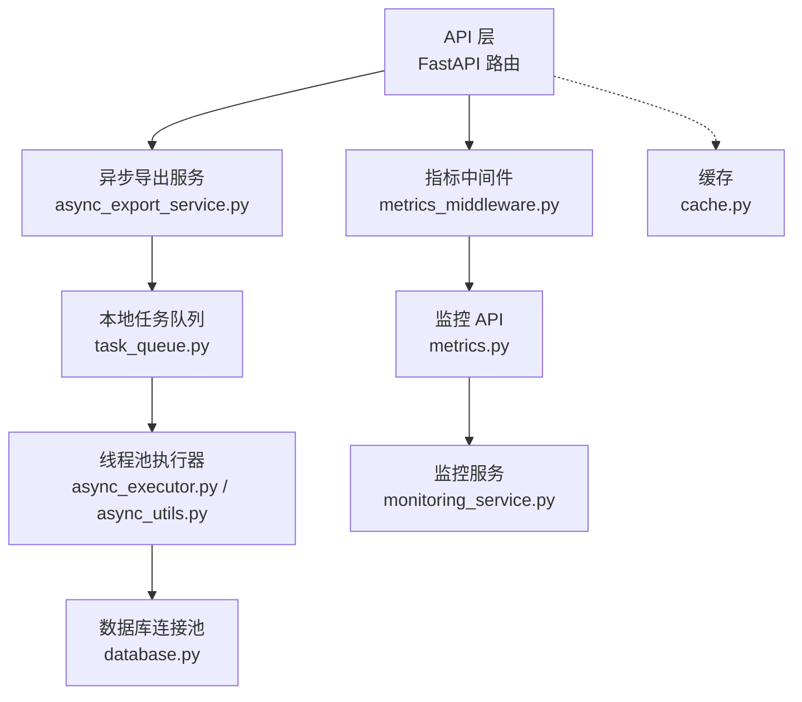
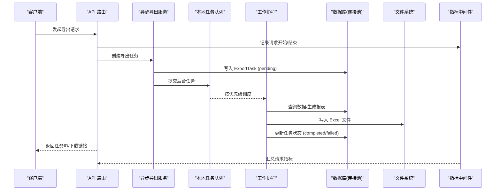
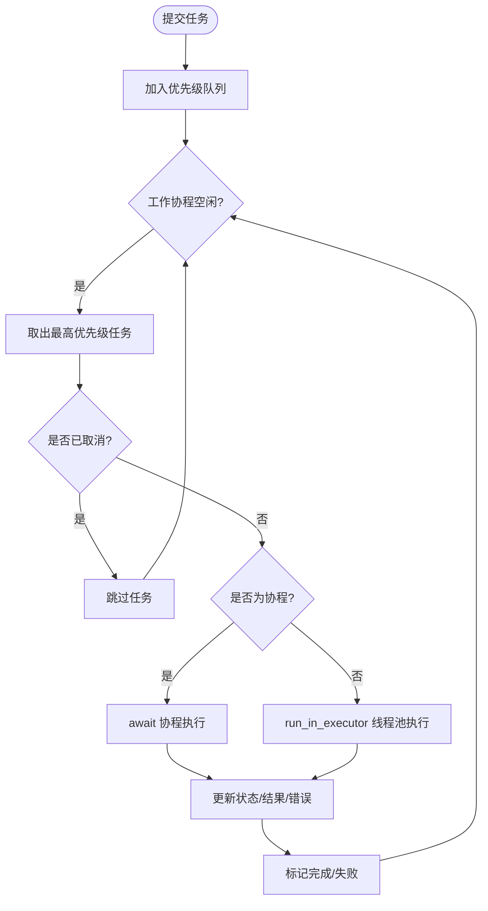
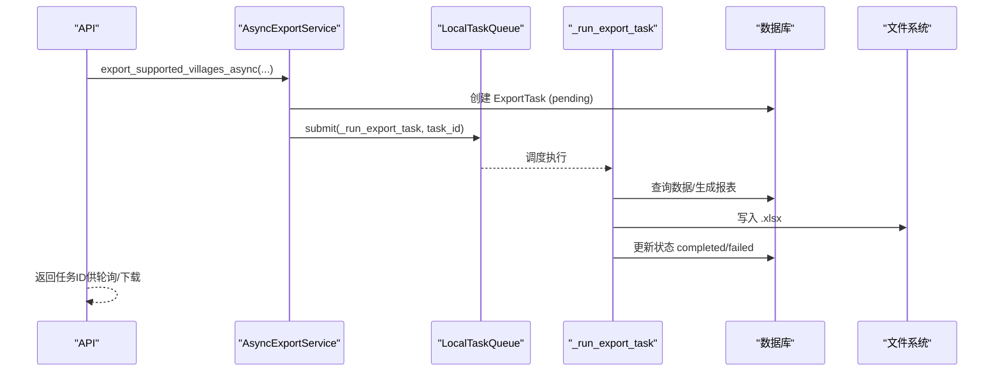
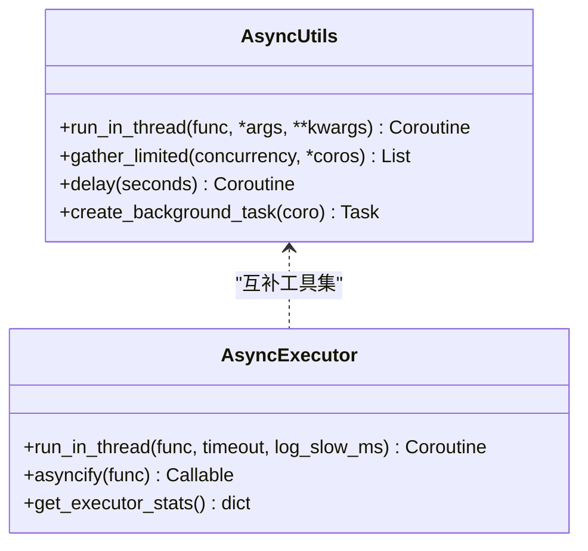
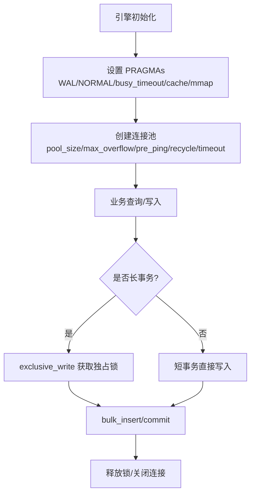
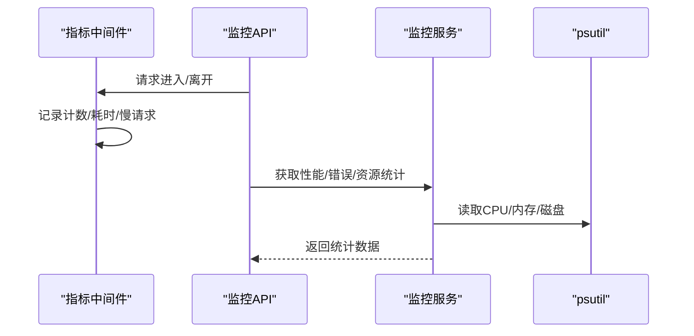
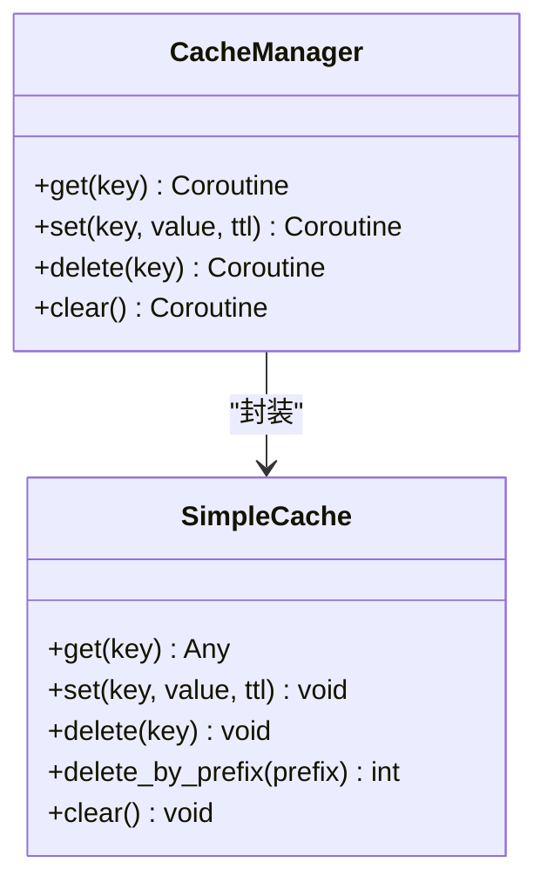
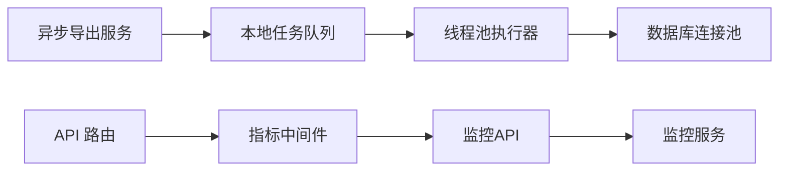

# 异步处理优化

<cite>
**本文引用的文件**
- [task_queue.py](file://backend/app/services/task_queue.py)
- [async_utils.py](file://backend/app/core/async_utils.py)
- [async_executor.py](file://backend/app/utils/async_executor.py)
- [async_export_service.py](file://backend/app/services/async_export_service.py)
- [metrics_middleware.py](file://backend/app/middleware/metrics_middleware.py)
- [cache.py](file://backend/app/core/cache.py)
- [monitoring_service.py](file://backend/app/services/monitoring_service.py)
- [metrics.py](file://backend/app/api/v1/monitoring/metrics.py)
- [database.py](file://backend/app/core/database.py)
</cite>

## 目录
1. [简介](#简介)
2. [项目结构](#项目结构)
3. [核心组件](#核心组件)
4. [架构总览](#架构总览)
5. [详细组件分析](#详细组件分析)
6. [依赖关系分析](#依赖关系分析)
7. [性能考量](#性能考量)
8. [故障排查指南](#故障排查指南)
9. [结论](#结论)
10. [附录](#附录)

## 简介
本技术文档围绕“异步处理优化”展开，聚焦于任务队列设计、并发优化、长耗时任务策略、异步 I/O 优化与监控指标采集。系统采用本地内存任务队列（无需 Redis/Celery）实现优先级调度、进度追踪与取消；通过线程池将同步阻塞操作移出事件循环；结合 SQLite 连接池与 WAL 模式提升数据库并发能力；并通过中间件与监控服务提供 HTTP 请求指标、慢请求记录与资源使用率统计。

## 项目结构
后端异步相关的关键模块分布在 services、core、utils、middleware 等目录：
- 任务队列与导出服务：services/task_queue.py、services/async_export_service.py
- 异步工具与执行器：core/async_utils.py、utils/async_executor.py
- 数据库与缓存：core/database.py、core/cache.py
- 监控与指标：middleware/metrics_middleware.py、services/monitoring_service.py、api/v1/monitoring/metrics.py

图表来源
- [async_export_service.py:1-516](file://backend/app/services/async_export_service.py#L1-L516)
- [task_queue.py:1-307](file://backend/app/services/task_queue.py#L1-L307)
- [async_executor.py:1-127](file://backend/app/utils/async_executor.py#L1-L127)
- [async_utils.py:1-124](file://backend/app/core/async_utils.py#L1-L124)
- [database.py:1-343](file://backend/app/core/database.py#L1-L343)
- [metrics_middleware.py:1-177](file://backend/app/middleware/metrics_middleware.py#L1-L177)
- [metrics.py:1-100](file://backend/app/api/v1/monitoring/metrics.py#L1-L100)
- [monitoring_service.py:1-312](file://backend/app/services/monitoring_service.py#L1-L312)
- [cache.py:1-166](file://backend/app/core/cache.py#L1-L166)

章节来源
- [task_queue.py:1-307](file://backend/app/services/task_queue.py#L1-L307)
- [async_export_service.py:1-516](file://backend/app/services/async_export_service.py#L1-L516)
- [async_executor.py:1-127](file://backend/app/utils/async_executor.py#L1-L127)
- [async_utils.py:1-124](file://backend/app/core/async_utils.py#L1-L124)
- [database.py:1-343](file://backend/app/core/database.py#L1-L343)
- [metrics_middleware.py:1-177](file://backend/app/middleware/metrics_middleware.py#L1-L177)
- [metrics.py:1-100](file://backend/app/api/v1/monitoring/metrics.py#L1-L100)
- [monitoring_service.py:1-312](file://backend/app/services/monitoring_service.py#L1-L312)
- [cache.py:1-166](file://backend/app/core/cache.py#L1-L166)

## 核心组件
- 本地任务队列（LocalTaskQueue）：基于 asyncio.PriorityQueue 的内存队列，支持优先级、状态管理、进度更新、取消与清理。
- 异步导出服务（AsyncExportService）：大文件后台导出，创建 ExportTask 并投递到任务队列，独立会话生成 Excel 并落盘。
- 线程池执行器（async_executor.run_in_thread）：将同步阻塞操作放入线程池执行，带超时与慢操作日志。
- 异步工具（async_utils）：通用协程限并发、线程池封装、后台任务创建等。
- 数据库连接池（database）：SQLite 专用 PRAGMA 调优、WAL 模式、连接池参数、独占写协调器。
- 指标中间件（MetricsMiddleware）：ASGI 中间件收集请求计数、耗时、活跃数、慢请求等。
- 监控服务（MonitoringService）：聚合 API 性能、错误统计、资源使用率，支持告警触发。
- 缓存（SimpleCache/CacheManager）：线程安全内存缓存，支持 TTL、前缀删除与装饰器缓存。

章节来源
- [task_queue.py:1-307](file://backend/app/services/task_queue.py#L1-L307)
- [async_export_service.py:1-516](file://backend/app/services/async_export_service.py#L1-L516)
- [async_executor.py:1-127](file://backend/app/utils/async_executor.py#L1-L127)
- [async_utils.py:1-124](file://backend/app/core/async_utils.py#L1-L124)
- [database.py:1-343](file://backend/app/core/database.py#L1-L343)
- [metrics_middleware.py:1-177](file://backend/app/middleware/metrics_middleware.py#L1-L177)
- [monitoring_service.py:1-312](file://backend/app/services/monitoring_service.py#L1-L312)
- [cache.py:1-166](file://backend/app/core/cache.py#L1-L166)

## 架构总览
整体流程：API 发起导出或异步任务 → 创建任务记录并提交到本地任务队列 → 工作协程从优先级队列取出任务 → 根据函数类型选择协程或直接在线程池中执行 → 访问数据库（连接池 + WAL）→ 完成状态回写与文件落盘 → 指标中间件与监控服务持续采集性能数据。

图表来源
- [async_export_service.py:330-388](file://backend/app/services/async_export_service.py#L330-L388)
- [task_queue.py:124-288](file://backend/app/services/task_queue.py#L124-L288)
- [database.py:55-157](file://backend/app/core/database.py#L55-L157)
- [metrics_middleware.py:132-177](file://backend/app/middleware/metrics_middleware.py#L132-L177)

## 详细组件分析

### 本地任务队列（优先级、进度、取消）
- 任务对象 Task：包含 ID、名称、函数引用、参数、优先级、状态、结果、错误、进度、时间戳等。
- 优先级：数值越小优先级越高，比较时先比优先级再比创建时间。
- 工作协程 _worker：从 PriorityQueue 取任务，若为协程则 await，否则通过 run_in_executor 在默认线程池执行；支持取消检查与失败记录。
- 进度更新 update_progress：允许任务在执行中更新 current/total/message 与更新时间。
- 取消 cancel_task：仅对 pending/running 状态有效。
- 统计与清理：get_queue_stats 提供各状态计数；cleanup 移除已完成/失败/已取消且超时的任务。

图表来源
- [task_queue.py:63-122](file://backend/app/services/task_queue.py#L63-L122)
- [task_queue.py:124-288](file://backend/app/services/task_queue.py#L124-L288)

章节来源
- [task_queue.py:20-36](file://backend/app/services/task_queue.py#L20-L36)
- [task_queue.py:38-61](file://backend/app/services/task_queue.py#L38-L61)
- [task_queue.py:63-122](file://backend/app/services/task_queue.py#L63-L122)
- [task_queue.py:124-288](file://backend/app/services/task_queue.py#L124-L288)

### 异步导出服务（大文件、进度、落盘）
- 阈值判断：超过一定记录数自动走异步导出路径。
- 任务创建：写入 ExportTask（含用户、类型、查询参数、文件名、过期时间），状态初始为 pending。
- 后台执行：调用 task_queue.submit 提交 _run_export_task，该函数在独立会话中查数据、生成 Excel、落盘并更新任务状态。
- 查询接口：支持获取任务详情、下载文件、分页查询用户任务列表。

图表来源
- [async_export_service.py:330-388](file://backend/app/services/async_export_service.py#L330-L388)
- [async_export_service.py:390-516](file://backend/app/services/async_export_service.py#L390-L516)
- [task_queue.py:158-188](file://backend/app/services/task_queue.py#L158-L188)

章节来源
- [async_export_service.py:30-55](file://backend/app/services/async_export_service.py#L30-L55)
- [async_export_service.py:85-227](file://backend/app/services/async_export_service.py#L85-L227)
- [async_export_service.py:330-388](file://backend/app/services/async_export_service.py#L330-L388)
- [async_export_service.py:390-516](file://backend/app/services/async_export_service.py#L390-L516)

### 线程池与协程优化（避免阻塞事件循环）
- run_in_thread：将同步函数放入共享 ThreadPoolExecutor 执行，支持超时与慢操作日志。
- gather_limited：以信号量限制协程并发度，避免无界并发导致资源耗尽。
- create_background_task：在运行中的事件循环或安全创建的循环上创建后台任务。
- 装饰器 asyncify：将同步函数包装为可 await 的异步版本。

图表来源
- [async_utils.py:23-93](file://backend/app/core/async_utils.py#L23-L93)
- [async_utils.py:104-124](file://backend/app/core/async_utils.py#L104-L124)
- [async_executor.py:37-127](file://backend/app/utils/async_executor.py#L37-L127)

章节来源
- [async_utils.py:16-55](file://backend/app/core/async_utils.py#L16-L55)
- [async_utils.py:75-93](file://backend/app/core/async_utils.py#L75-L93)
- [async_utils.py:104-124](file://backend/app/core/async_utils.py#L104-L124)
- [async_executor.py:32-96](file://backend/app/utils/async_executor.py#L32-L96)
- [async_executor.py:99-127](file://backend/app/utils/async_executor.py#L99-L127)

### 数据库连接池与长事务控制（SQLite 优化）
- 连接池：QueuePool 配置 pool_size、max_overflow、pre_ping、recycle、timeout。
- PRAGMA 调优：WAL 模式、foreign_keys=ON、synchronous=NORMAL、busy_timeout=10000、cache_size、mmap_size、temp_store=MEMORY、wal_autocheckpoint、automatic_index。
- 独占写协调器：exclusive_write 上下文管理器用于长事务批量导入，避免 SQLITE_BUSY。
- 磁盘空间检查：check_disk_space 用于备份/导出前的空间校验。

图表来源
- [database.py:55-67](file://backend/app/core/database.py#L55-L67)
- [database.py:78-157](file://backend/app/core/database.py#L78-L157)
- [database.py:198-285](file://backend/app/core/database.py#L198-L285)
- [database.py:292-343](file://backend/app/core/database.py#L292-L343)

章节来源
- [database.py:31-67](file://backend/app/core/database.py#L31-L67)
- [database.py:78-157](file://backend/app/core/database.py#L78-L157)
- [database.py:198-285](file://backend/app/core/database.py#L198-L285)
- [database.py:292-343](file://backend/app/core/database.py#L292-L343)

### 指标采集与监控（HTTP 指标、慢请求、资源使用率）
- 指标中间件：记录请求计数、错误数、活跃请求、平均耗时、Top 端点、慢请求列表。
- 监控 API：/metrics/business、/metrics/prometheus、/metrics/performance-dashboard 暴露指标与面板数据。
- 监控服务：聚合 API 性能统计、错误统计、资源使用率，支持规则告警与通知。

图表来源
- [metrics_middleware.py:26-125](file://backend/app/middleware/metrics_middleware.py#L26-L125)
- [metrics_middleware.py:132-177](file://backend/app/middleware/metrics_middleware.py#L132-L177)
- [metrics.py:22-99](file://backend/app/api/v1/monitoring/metrics.py#L22-L99)
- [monitoring_service.py:29-181](file://backend/app/services/monitoring_service.py#L29-L181)

章节来源
- [metrics_middleware.py:18-125](file://backend/app/middleware/metrics_middleware.py#L18-L125)
- [metrics_middleware.py:132-177](file://backend/app/middleware/metrics_middleware.py#L132-L177)
- [metrics.py:22-99](file://backend/app/api/v1/monitoring/metrics.py#L22-L99)
- [monitoring_service.py:29-181](file://backend/app/services/monitoring_service.py#L29-L181)

### 缓存与异步 I/O 优化
- SimpleCache：线程安全内存缓存，支持 TTL、前缀删除、容量淘汰。
- CacheManager：提供 await 风格的 get/set/delete/clear。
- cached 装饰器：对同步/异步函数进行结果缓存，减少重复计算与 IO。

图表来源
- [cache.py:14-95](file://backend/app/core/cache.py#L14-L95)
- [cache.py:98-137](file://backend/app/core/cache.py#L98-L137)

章节来源
- [cache.py:14-95](file://backend/app/core/cache.py#L14-L95)
- [cache.py:98-137](file://backend/app/core/cache.py#L98-L137)

## 依赖关系分析
- 导出服务依赖任务队列与数据库会话，任务队列依赖 asyncio 与线程池执行器。
- 指标中间件与监控服务解耦：中间件负责采集，监控服务负责聚合与告警。
- 数据库层对 SQLite 有深度优化，影响所有读写路径的性能与一致性。

图表来源
- [async_export_service.py:330-388](file://backend/app/services/async_export_service.py#L330-L388)
- [task_queue.py:124-288](file://backend/app/services/task_queue.py#L124-L288)
- [async_executor.py:37-127](file://backend/app/utils/async_executor.py#L37-L127)
- [database.py:55-157](file://backend/app/core/database.py#L55-L157)
- [metrics_middleware.py:132-177](file://backend/app/middleware/metrics_middleware.py#L132-L177)
- [metrics.py:22-99](file://backend/app/api/v1/monitoring/metrics.py#L22-L99)
- [monitoring_service.py:29-181](file://backend/app/services/monitoring_service.py#L29-L181)

章节来源
- [async_export_service.py:330-388](file://backend/app/services/async_export_service.py#L330-L388)
- [task_queue.py:124-288](file://backend/app/services/task_queue.py#L124-L288)
- [async_executor.py:37-127](file://backend/app/utils/async_executor.py#L37-L127)
- [database.py:55-157](file://backend/app/core/database.py#L55-L157)
- [metrics_middleware.py:132-177](file://backend/app/middleware/metrics_middleware.py#L132-L177)
- [metrics.py:22-99](file://backend/app/api/v1/monitoring/metrics.py#L22-L99)
- [monitoring_service.py:29-181](file://backend/app/services/monitoring_service.py#L29-L181)

## 性能考量
- 任务队列并发：通过 max_workers 控制工作协程数量，避免过多协程争抢资源。
- 线程池大小：async_executor 默认 4 个 worker，防止 SQLite 写冲突；可根据负载调整。
- 协程限并发：gather_limited 使用信号量限制并发度，保护外部资源（如网络、IO）。
- 数据库优化：WAL + NORMAL 同步 + busy_timeout + cache/mmap 调优，显著提升并发读写性能。
- 长事务隔离：exclusive_write 确保大批量导入串行化，避免 SQLITE_BUSY。
- 缓存命中：SimpleCache 降低重复查询与计算开销，适合热点数据。
- 指标采集：中间件记录慢请求与 Top 端点，便于定位瓶颈。

[本节为通用性能指导，不直接分析具体代码行]

## 故障排查指南
- 任务永远 pending：确认导出服务是否正确提交任务到队列，以及队列是否启动 worker。
- 导出文件为空：检查实体模型映射与查询条件，确保 fetcher 正确构建数据。
- 任务失败状态未回写：查看 _run_export_task 异常捕获逻辑，确认数据库会话与 safe_commit 调用。
- 慢请求与高错误率：通过 /metrics/performance-dashboard 查看慢请求列表与错误分布。
- 数据库忙锁：长事务需使用 exclusive_write；短事务依赖 busy_timeout 重试。
- 线程池饱和：观察 get_executor_stats 的 pending 数，必要时调整 max_workers。

章节来源
- [async_export_service.py:330-388](file://backend/app/services/async_export_service.py#L330-L388)
- [task_queue.py:190-235](file://backend/app/services/task_queue.py#L190-L235)
- [metrics_middleware.py:26-125](file://backend/app/middleware/metrics_middleware.py#L26-L125)
- [database.py:198-285](file://backend/app/core/database.py#L198-L285)
- [async_executor.py:118-127](file://backend/app/utils/async_executor.py#L118-L127)

## 结论
本项目通过本地任务队列、线程池执行器、SQLite 连接池与 WAL 优化、指标中间件与监控服务，构建了完整的异步处理体系。针对大文件导出、长耗时任务、并发控制与性能监控均有落地实现。建议在生产环境中根据负载调整线程池大小、队列 workers、数据库 PRAMGA 与缓存 TTL，并结合监控指标持续优化。

[本节为总结性内容，不直接分析具体代码行]

## 附录
- 实际代码示例路径（不含代码内容）：
  - 任务队列提交与执行：[task_queue.py:158-188](file://backend/app/services/task_queue.py#L158-L188)、[task_queue.py:251-285](file://backend/app/services/task_queue.py#L251-L285)
  - 异步导出任务创建与执行：[async_export_service.py:454-481](file://backend/app/services/async_export_service.py#L454-L481)、[async_export_service.py:330-388](file://backend/app/services/async_export_service.py#L330-L388)
  - 线程池执行与超时：[async_executor.py:47-96](file://backend/app/utils/async_executor.py#L47-L96)
  - 协程限并发与后台任务：[async_utils.py:75-93](file://backend/app/core/async_utils.py#L75-L93)、[async_utils.py:116-124](file://backend/app/core/async_utils.py#L116-L124)
  - 数据库 PRAGMA 与连接池：[database.py:55-67](file://backend/app/core/database.py#L55-L67)、[database.py:78-157](file://backend/app/core/database.py#L78-L157)
  - 指标中间件采集：[metrics_middleware.py:132-177](file://backend/app/middleware/metrics_middleware.py#L132-L177)
  - 监控 API 与资源统计：[metrics.py:22-99](file://backend/app/api/v1/monitoring/metrics.py#L22-L99)、[monitoring_service.py:157-181](file://backend/app/services/monitoring_service.py#L157-L181)
  - 缓存装饰器与异步封装：[cache.py:98-137](file://backend/app/core/cache.py#L98-L137)

[本节为参考路径汇总，不直接分析具体代码行]