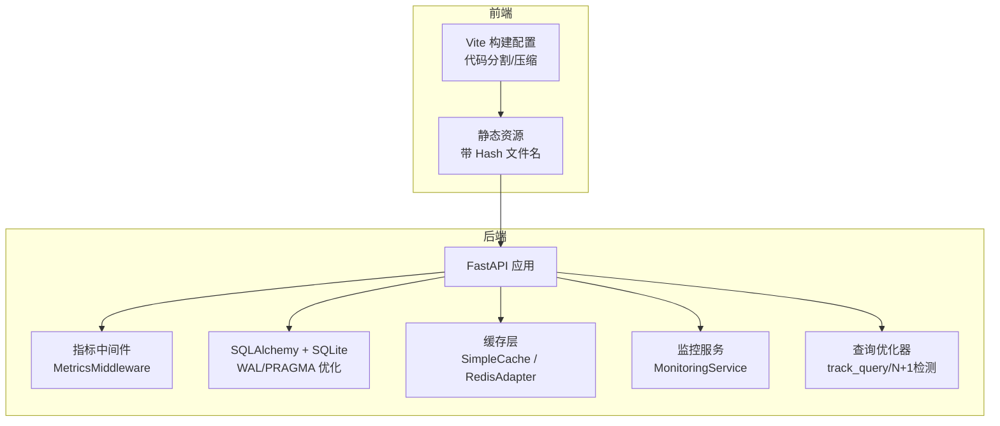
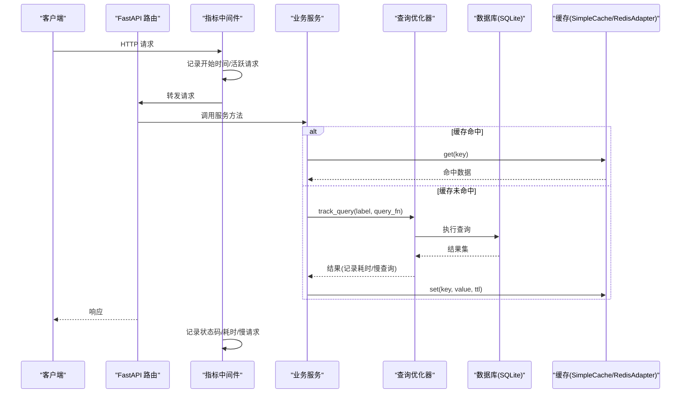
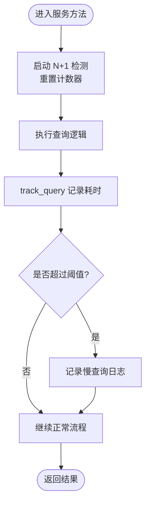
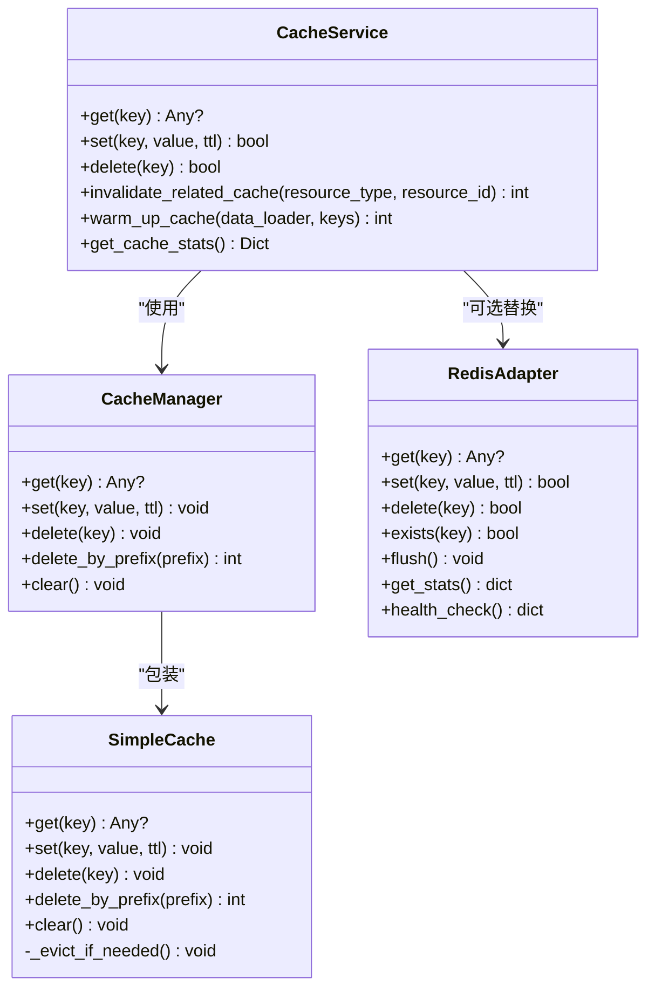
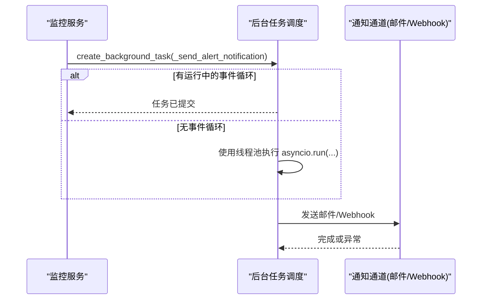
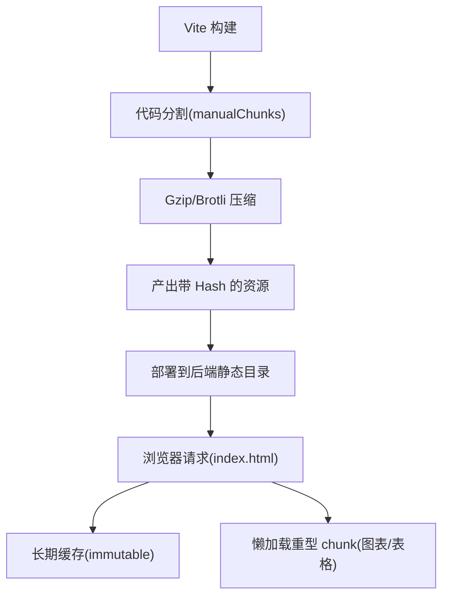
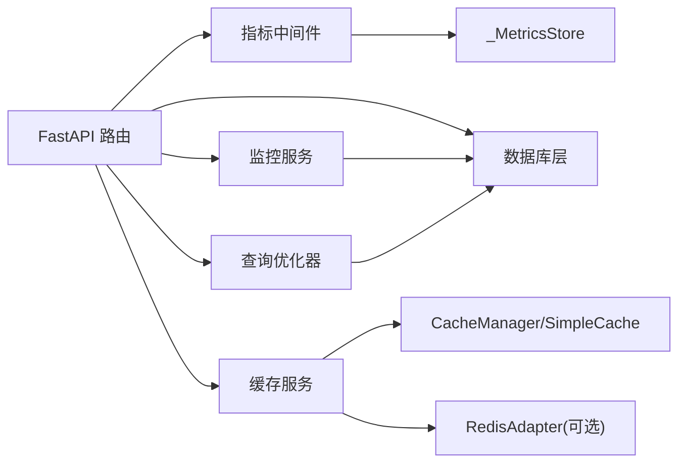

# 性能优化指南

<cite>
**本文引用的文件**
- [backend/app/core/cache.py](file://backend/app/core/cache.py)
- [backend/app/services/cache_service.py](file://backend/app/services/cache_service.py)
- [backend/app/core/query_optimizer.py](file://backend/app/core/query_optimizer.py)
- [backend/app/middleware/metrics_middleware.py](file://backend/app/middleware/metrics_middleware.py)
- [backend/app/services/monitoring_service.py](file://backend/app/services/monitoring_service.py)
- [backend/app/core/database.py](file://backend/app/core/database.py)
- [backend/app/core/redis_adapter.py](file://backend/app/core/redis_adapter.py)
- [backend/scripts/performance_benchmark.py](file://backend/scripts/performance_benchmark.py)
- [frontend/vite.config.ts](file://frontend/vite.config.ts)
- [backend/app/main.py](file://backend/app/main.py)
- [scripts/audit_static_assets.py](file://scripts/audit_static_assets.py)
</cite>

## 目录
1. [引言](#引言)
2. [项目结构](#项目结构)
3. [核心组件](#核心组件)
4. [架构总览](#架构总览)
5. [详细组件分析](#详细组件分析)
6. [依赖关系分析](#依赖关系分析)
7. [性能考量与优化策略](#性能考量与优化策略)
8. [故障排查指南](#故障排查指南)
9. [结论](#结论)
10. [附录](#附录)

## 引言
本指南面向系统性能监控、瓶颈识别与优化策略制定，覆盖数据库查询优化、缓存机制实现、异步处理方案、前端资源加载与渲染优化、性能测试与基准工具使用、指标监控、内存管理、并发处理与负载均衡等高级技术。文档基于仓库现有实现进行系统化梳理，并提供可操作的实践建议与可视化图示，帮助团队持续优化系统性能。

## 项目结构
后端采用 FastAPI + SQLAlchemy 的架构，内置 SQLite 深度调优（WAL、PRAGMA 优化）、请求级指标采集中间件、慢查询追踪与 N+1 检测、多级缓存（进程内 SimpleCache + 可选 Redis 适配器）以及监控服务。前端基于 Vite，具备按需引入、代码分割、Gzip/Brotli 压缩、静态资源长期缓存等能力。

**图表来源**
- [backend/app/middleware/metrics_middleware.py:132-177](file://backend/app/middleware/metrics_middleware.py#L132-L177)
- [backend/app/core/database.py:78-157](file://backend/app/core/database.py#L78-L157)
- [backend/app/core/cache.py:14-95](file://backend/app/core/cache.py#L14-L95)
- [backend/app/services/monitoring_service.py:26-83](file://backend/app/services/monitoring_service.py#L26-L83)
- [backend/app/core/query_optimizer.py:62-108](file://backend/app/core/query_optimizer.py#L62-L108)
- [frontend/vite.config.ts:211-426](file://frontend/vite.config.ts#L211-L426)

**章节来源**
- [backend/app/core/database.py:78-157](file://backend/app/core/database.py#L78-L157)
- [backend/app/middleware/metrics_middleware.py:132-177](file://backend/app/middleware/metrics_middleware.py#L132-L177)
- [backend/app/core/cache.py:14-95](file://backend/app/core/cache.py#L14-L95)
- [backend/app/services/monitoring_service.py:26-83](file://backend/app/services/monitoring_service.py#L26-L83)
- [backend/app/core/query_optimizer.py:62-108](file://backend/app/core/query_optimizer.py#L62-L108)
- [frontend/vite.config.ts:211-426](file://frontend/vite.config.ts#L211-L426)

## 核心组件
- 数据库引擎与连接：SQLite WAL、PRAGMA 调优、长事务独占写协调器，避免 SQLITE_BUSY 并提升并发读写性能。
- 查询优化与监控：分页、慢查询记录、N+1 检测装饰器，辅助定位低效查询。
- 缓存体系：进程内 SimpleCache（线程安全、TTL、容量淘汰），CacheManager 提供 async 接口；可选 RedisAdapter（离线模式为内存适配）。
- 指标采集：ASGI 中间件统计请求数、错误率、平均耗时、活跃请求、Top 端点与慢请求列表。
- 监控服务：聚合 API 响应时间百分位、错误率、资源使用率，支持告警规则与通知。
- 前端构建：Vite 按需引入、手动分包、Gzip/Brotli 压缩、资源长期缓存与预加载。

**章节来源**
- [backend/app/core/database.py:78-157](file://backend/app/core/database.py#L78-L157)
- [backend/app/core/query_optimizer.py:23-49](file://backend/app/core/query_optimizer.py#L23-L49)
- [backend/app/core/query_optimizer.py:62-108](file://backend/app/core/query_optimizer.py#L62-L108)
- [backend/app/core/query_optimizer.py:137-177](file://backend/app/core/query_optimizer.py#L137-L177)
- [backend/app/core/cache.py:14-95](file://backend/app/core/cache.py#L14-L95)
- [backend/app/core/redis_adapter.py:7-43](file://backend/app/core/redis_adapter.py#L7-L43)
- [backend/app/middleware/metrics_middleware.py:26-125](file://backend/app/middleware/metrics_middleware.py#L26-L125)
- [backend/app/services/monitoring_service.py:26-83](file://backend/app/services/monitoring_service.py#L26-L83)
- [frontend/vite.config.ts:133-153](file://frontend/vite.config.ts#L133-L153)
- [frontend/vite.config.ts:286-410](file://frontend/vite.config.ts#L286-L410)

## 架构总览
下图展示一次典型请求从进入后端到返回响应的关键路径，包含指标采集、数据库访问、缓存命中/未命中、慢查询记录与监控聚合。

**图表来源**
- [backend/app/middleware/metrics_middleware.py:142-177](file://backend/app/middleware/metrics_middleware.py#L142-L177)
- [backend/app/core/query_optimizer.py:62-93](file://backend/app/core/query_optimizer.py#L62-L93)
- [backend/app/core/cache.py:24-42](file://backend/app/core/cache.py#L24-L42)
- [backend/app/core/database.py:78-157](file://backend/app/core/database.py#L78-L157)

## 详细组件分析

### 数据库查询优化与索引
- 分页与限制：提供 paginate 工具，限制 page_size 上限，避免大页导致性能退化。
- 慢查询追踪：track_query 记录每次查询耗时，超过阈值输出警告并写入日志队列，便于后续分析。
- N+1 检测：analyze_n_plus_one 装饰器在函数执行前后统计 SQL 执行次数，超过阈值发出警告，提示需改用 eager loading。
- SQLite 调优：启用 WAL、NORMAL 同步、busy_timeout、cache_size、mmap_size、自动临时索引、optimize 等 PRAGMAs，显著提升并发与查询性能。
- 长事务协调：exclusive_write 上下文管理器串行化长事务写入，避免 SQLITE_BUSY 中断。

**图表来源**
- [backend/app/core/query_optimizer.py:62-93](file://backend/app/core/query_optimizer.py#L62-L93)
- [backend/app/core/query_optimizer.py:137-177](file://backend/app/core/query_optimizer.py#L137-L177)

**章节来源**
- [backend/app/core/query_optimizer.py:23-49](file://backend/app/core/query_optimizer.py#L23-L49)
- [backend/app/core/query_optimizer.py:62-108](file://backend/app/core/query_optimizer.py#L62-L108)
- [backend/app/core/query_optimizer.py:137-177](file://backend/app/core/query_optimizer.py#L137-L177)
- [backend/app/core/database.py:78-157](file://backend/app/core/database.py#L78-L157)
- [backend/app/core/database.py:211-236](file://backend/app/core/database.py#L211-L236)

### 缓存机制实现
- 进程内缓存：SimpleCache 提供线程安全的 get/set/delete/clear 与 TTL 过期清理、容量淘汰（FIFO 风格）。
- 异步封装：CacheManager 提供 awaitable 接口，便于在异步服务中统一使用。
- 高级缓存服务：CacheService 封装键生成、失效策略、预热、统计；EntityCacheManager 提供实体维度缓存操作。
- 离线兼容：RedisAdapter 在无 Redis 场景下以内存字典模拟，保证功能一致性与可观测性。

**图表来源**
- [backend/app/core/cache.py:14-95](file://backend/app/core/cache.py#L14-L95)
- [backend/app/services/cache_service.py:37-227](file://backend/app/services/cache_service.py#L37-L227)
- [backend/app/core/redis_adapter.py:7-43](file://backend/app/core/redis_adapter.py#L7-L43)

**章节来源**
- [backend/app/core/cache.py:14-95](file://backend/app/core/cache.py#L14-L95)
- [backend/app/services/cache_service.py:37-227](file://backend/app/services/cache_service.py#L37-L227)
- [backend/app/core/redis_adapter.py:7-43](file://backend/app/core/redis_adapter.py#L7-L43)

### 异步处理方案
- 后台任务：监控服务通过 create_background_task 发送告警通知，若无事件循环则回退到线程池执行，确保通知不阻塞主流程。
- 长事务写入：SQLiteWriteCoordinator.exclusive_write 提供上下文管理器，串行化长事务，避免锁竞争导致的失败。

**图表来源**
- [backend/app/services/monitoring_service.py:274-283](file://backend/app/services/monitoring_service.py#L274-L283)
- [backend/app/core/database.py:211-236](file://backend/app/core/database.py#L211-L236)

**章节来源**
- [backend/app/services/monitoring_service.py:274-283](file://backend/app/services/monitoring_service.py#L274-L283)
- [backend/app/core/database.py:211-236](file://backend/app/core/database.py#L211-L236)

### 前端性能优化与资源加载
- 构建优化：启用 Gzip/Brotli 压缩、CSS 代码分割、terser 优化、模块预加载 polyfill。
- 代码分割：manualChunks 将 Vue、Router、Pinia、ECharts、xlsx、axios、lodash 等独立分包，避免首屏臃肿。
- 静态资源缓存：生产环境通过 FastAPI 挂载静态资源并设置长期缓存（immutable），配合 Vite 内容哈希实现浏览器强缓存。
- 资源审计：脚本扫描 index.html 与 JS 动态 import，对比实际文件，发现缺失或未引用资源，辅助瘦身。

**图表来源**
- [frontend/vite.config.ts:133-153](file://frontend/vite.config.ts#L133-L153)
- [frontend/vite.config.ts:286-410](file://frontend/vite.config.ts#L286-L410)
- [backend/app/main.py:295-303](file://backend/app/main.py#L295-L303)
- [scripts/audit_static_assets.py:67-87](file://scripts/audit_static_assets.py#L67-L87)
- [scripts/audit_static_assets.py:216-270](file://scripts/audit_static_assets.py#L216-L270)

**章节来源**
- [frontend/vite.config.ts:211-426](file://frontend/vite.config.ts#L211-L426)
- [backend/app/main.py:295-303](file://backend/app/main.py#L295-L303)
- [scripts/audit_static_assets.py:67-87](file://scripts/audit_static_assets.py#L67-L87)
- [scripts/audit_static_assets.py:216-270](file://scripts/audit_static_assets.py#L216-L270)

## 依赖关系分析
后端各组件之间的耦合关系如下：
- 指标中间件依赖全局 _MetricsStore，记录请求指标并暴露摘要。
- 监控服务依赖数据库模型 APIMetric、AlertRule、AlertHistory，计算百分位与错误率，触发告警。
- 查询优化器依赖 SQLAlchemy Query，提供分页与慢查询记录。
- 缓存服务依赖 CacheManager（SimpleCache）与可选 RedisAdapter。
- 数据库层通过事件监听注入 PRAGMA 调优与 N+1 计数回调。

**图表来源**
- [backend/app/middleware/metrics_middleware.py:26-125](file://backend/app/middleware/metrics_middleware.py#L26-L125)
- [backend/app/services/monitoring_service.py:26-83](file://backend/app/services/monitoring_service.py#L26-L83)
- [backend/app/core/query_optimizer.py:62-108](file://backend/app/core/query_optimizer.py#L62-L108)
- [backend/app/core/cache.py:72-95](file://backend/app/core/cache.py#L72-L95)
- [backend/app/core/redis_adapter.py:7-43](file://backend/app/core/redis_adapter.py#L7-L43)

**章节来源**
- [backend/app/middleware/metrics_middleware.py:26-125](file://backend/app/middleware/metrics_middleware.py#L26-L125)
- [backend/app/services/monitoring_service.py:26-83](file://backend/app/services/monitoring_service.py#L26-L83)
- [backend/app/core/query_optimizer.py:62-108](file://backend/app/core/query_optimizer.py#L62-L108)
- [backend/app/core/cache.py:72-95](file://backend/app/core/cache.py#L72-L95)
- [backend/app/core/redis_adapter.py:7-43](file://backend/app/core/redis_adapter.py#L7-L43)

## 性能考量与优化策略
- 数据库查询优化
  - 使用 paginate 控制每页大小，避免全表扫描与大偏移量。
  - 通过 track_query 与慢查询阈值快速定位热点 SQL。
  - 使用 analyze_n_plus_one 检测 N+1 问题，结合 eager loading 减少查询次数。
  - 利用 SQLite WAL、PRAGMA 优化与 exclusive_write 提升并发与稳定性。
- 缓存机制
  - 对读多写少的数据使用 SimpleCache，合理设置 TTL 与容量上限。
  - 使用 CacheService 的 invalidate_related_cache 与 warm_up_cache 保障一致性并降低冷启动延迟。
  - 在分布式场景可替换为 RedisAdapter，保持接口一致。
- 异步处理
  - 将耗时任务（如告警通知、报表导出）放入后台任务，避免阻塞请求链路。
  - 长事务写入使用 exclusive_write 串行化，避免锁冲突。
- 前端优化
  - 启用按需引入与 manualChunks，拆分重型库（图表、表格）为懒加载 chunk。
  - 生产构建启用 Gzip/Brotli 压缩，减少传输体积。
  - 使用带 Hash 的静态资源与 immutable 缓存策略，提升浏览器缓存命中率。
  - 使用资源审计脚本检查缺失与未引用资源，持续瘦身。
- 指标监控与基准测试
  - 通过 MetricsMiddleware 获取请求级指标（平均耗时、错误率、Top 端点、慢请求）。
  - 使用 MonitoringService 聚合 API 响应时间百分位与错误率，配置告警规则。
  - 使用 performance_benchmark.py 对典型 SQL 进行基准测试，评估优化效果。

[本节为通用指导，无需具体文件来源]

## 故障排查指南
- 慢查询与 N+1
  - 查看慢查询日志与 get_slow_queries 返回，定位耗时 SQL。
  - 对被装饰的方法使用 analyze_n_plus_one，观察数据库查询次数是否异常。
- 缓存命中率低
  - 检查 TTL 设置是否过短，键命名是否合理。
  - 使用 CacheService.get_cache_stats 与 SimpleCache 内部统计（hits/misses）评估命中率。
- 前端资源加载异常
  - 使用 audit_static_assets.py 检查 index.html 与 JS 动态 import 引用与实际文件的一致性。
  - 确认生产环境静态资源由后端正确挂载并设置长期缓存。
- 数据库锁与写入失败
  - 长事务写入使用 exclusive_write，避免 SQLITE_BUSY。
  - 检查 busy_timeout 与 WAL 配置是否生效。

**章节来源**
- [backend/app/core/query_optimizer.py:62-108](file://backend/app/core/query_optimizer.py#L62-L108)
- [backend/app/core/query_optimizer.py:137-177](file://backend/app/core/query_optimizer.py#L137-L177)
- [backend/app/core/cache.py:24-42](file://backend/app/core/cache.py#L24-L42)
- [backend/app/services/cache_service.py:215-227](file://backend/app/services/cache_service.py#L215-L227)
- [scripts/audit_static_assets.py:216-270](file://scripts/audit_static_assets.py#L216-L270)
- [backend/app/core/database.py:211-236](file://backend/app/core/database.py#L211-L236)

## 结论
本指南基于仓库现有实现，系统性地总结了后端数据库优化、缓存与监控、前端构建与资源加载、异步处理与基准测试等关键性能优化点。通过指标中间件与监控服务持续观测系统健康度，结合查询优化与缓存策略，可有效降低延迟、提升吞吐与用户体验。建议在生产环境中定期运行基准测试与资源审计，持续迭代优化。

[本节为总结性内容，无需具体文件来源]

## 附录
- 常用命令与工具
  - 后端基准测试：python backend/scripts/performance_benchmark.py [--iterations N]
  - 前端资源审计：python scripts/audit_static_assets.py [--quick/--verbose]
  - 构建产物检查：npm run build，关注 chunk 大小与压缩后体积
- 关键配置项参考
  - 数据库：WAL、PRAGMA cache_size/mmap_size/busy_timeout
  - 缓存：SimpleCache max_size、TTL、容量淘汰策略
  - 前端：manualChunks、compression、modulePreload、assetsInlineLimit

[本节为补充信息，无需具体文件来源]