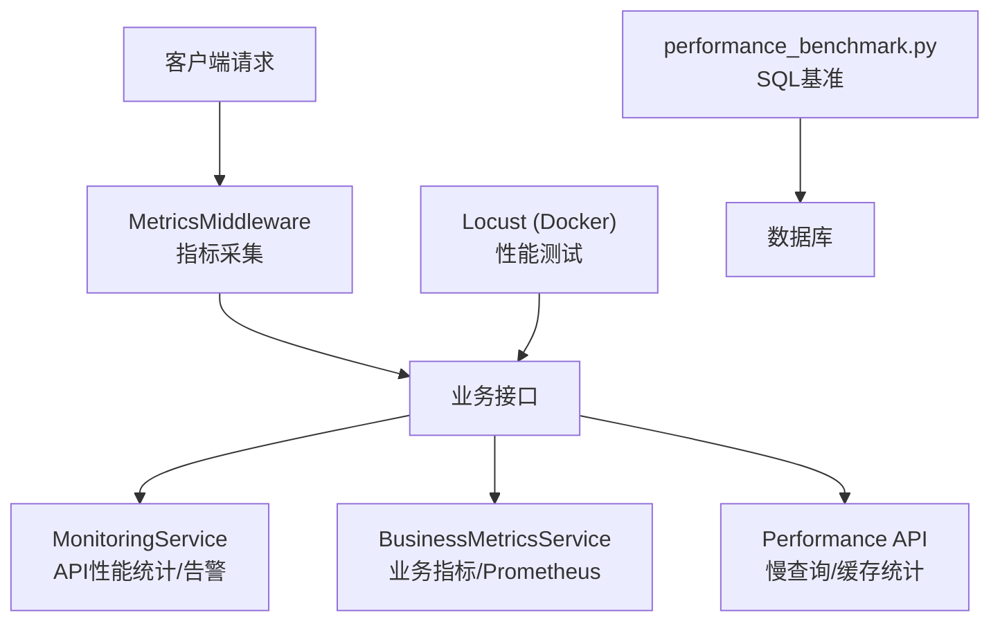
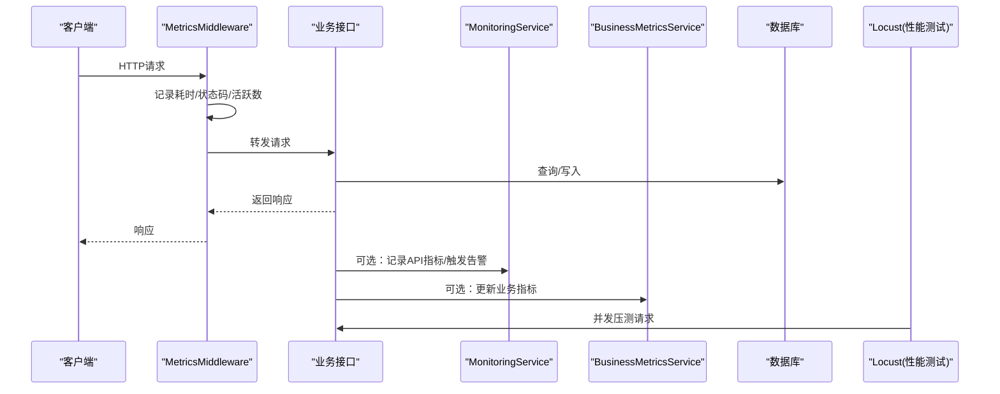
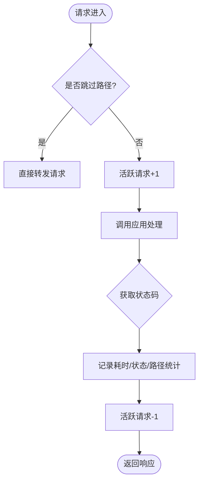
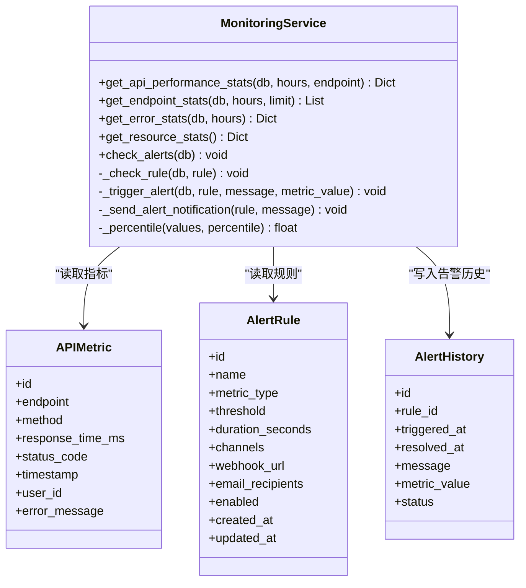
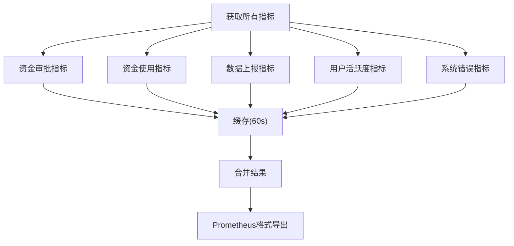
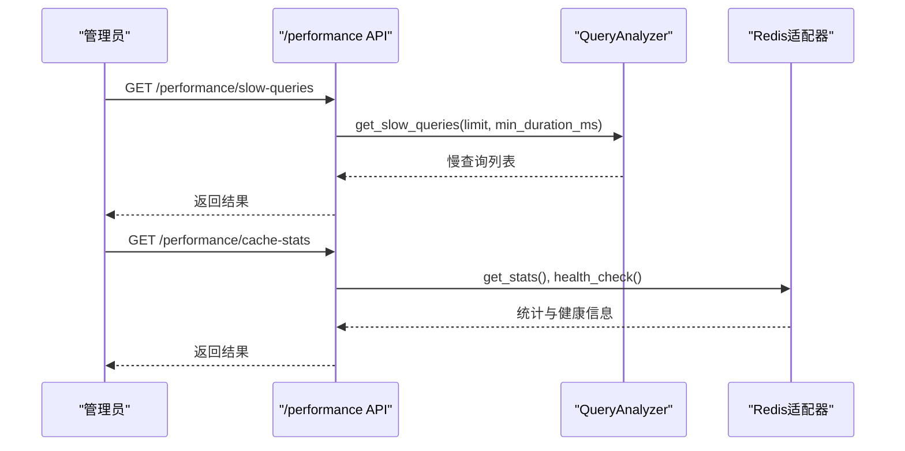
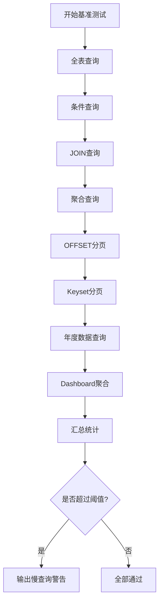
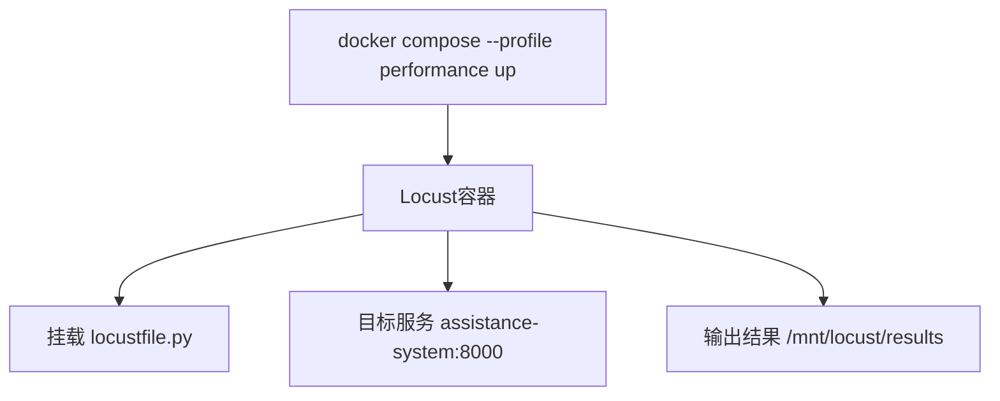
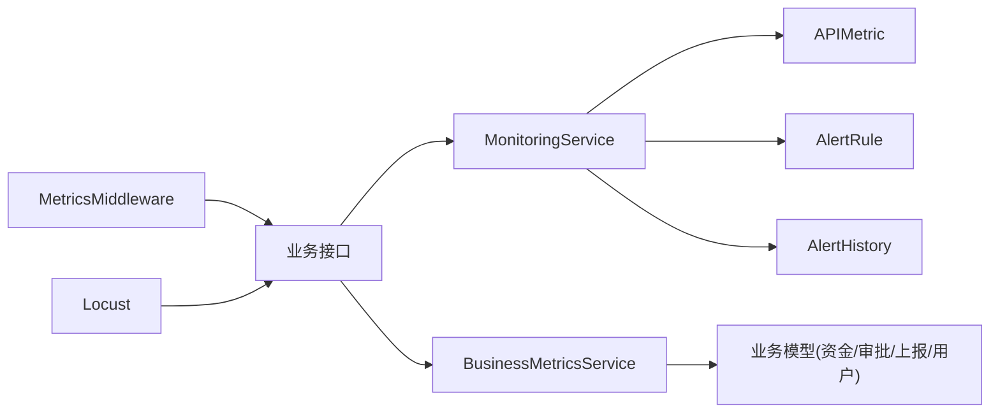

# 性能监控与测试

<cite>
**本文引用的文件**
- [backend/scripts/performance_benchmark.py](file://backend/scripts/performance_benchmark.py)
- [backend/app/services/monitoring_service.py](file://backend/app/services/monitoring_service.py)
- [backend/app/middleware/metrics_middleware.py](file://backend/app/middleware/metrics_middleware.py)
- [backend/app/api/v1/performance.py](file://backend/app/api/v1/performance.py)
- [backend/app/api/v1/monitoring/metrics.py](file://backend/app/api/v1/monitoring/metrics.py)
- [backend/app/services/business_metrics_service.py](file://backend/app/services/business_metrics_service.py)
- [backend/app/models/monitoring.py](file://backend/app/models/monitoring.py)
- [docker/docker-compose.e2e.yml](file://docker/docker-compose.e2e.yml)
- [docs/test-report-gb25000.md](file://docs/test-report-gb25000.md)
- [docs/03-开发文档/05-性能优化/性能需求.md](file://docs/03-开发文档/05-性能优化/性能需求.md)
</cite>

## 目录
1. [简介](#简介)
2. [项目结构](#项目结构)
3. [核心组件](#核心组件)
4. [架构总览](#架构总览)
5. [详细组件分析](#详细组件分析)
6. [依赖关系分析](#依赖关系分析)
7. [性能考虑](#性能考虑)
8. [故障排查指南](#故障排查指南)
9. [结论](#结论)
10. [附录](#附录)

## 简介
本指南面向“性能监控与测试”的落地实施，覆盖以下目标：
- 搭建可观测的性能监控体系：APM指标采集、自定义业务指标、日志与慢查询分析。
- 建立基准与压力测试方法：负载测试、压力测试、耐久性测试的设计与执行。
- 定位性能瓶颈：CPU/内存剖析、数据库慢查询与N+1问题识别。
- 工具实战：Locust/JMeter/Gatling在CI/CD中的使用方式（以Locust为主）。
- 告警机制：阈值配置、通知策略、避免重复告警。
- 测试用例模板与报告生成：基于现有脚本与文档形成标准化流程。

## 项目结构
本项目在后端提供了完整的性能监控与测试能力：
- 指标采集中间件：ASGI层记录请求耗时、错误率、活跃请求数等。
- 监控服务：聚合API性能统计、资源使用、告警规则检查与通知。
- 业务指标服务：资金审批、拨付率、上报完成率、用户活跃度、系统错误率等，并支持Prometheus导出。
- 性能分析API：慢查询列表、查询统计、缓存统计与清理。
- 基准脚本：SQLite查询性能对比与慢查询阈值检查。
- Docker编排：集成Locust进行性能测试。
- 文档：性能需求与验收标准、GB/T 25000.51-2016报告参考。

**图示来源**
- [backend/app/middleware/metrics_middleware.py:1-177](file://backend/app/middleware/metrics_middleware.py#L1-L177)
- [backend/app/services/monitoring_service.py:1-312](file://backend/app/services/monitoring_service.py#L1-L312)
- [backend/app/services/business_metrics_service.py:1-376](file://backend/app/services/business_metrics_service.py#L1-L376)
- [backend/app/api/v1/performance.py:1-118](file://backend/app/api/v1/performance.py#L1-L118)
- [backend/scripts/performance_benchmark.py:1-149](file://backend/scripts/performance_benchmark.py#L1-L149)
- [docker/docker-compose.e2e.yml:1-62](file://docker/docker-compose.e2e.yml#L1-L62)

**章节来源**
- [backend/app/middleware/metrics_middleware.py:1-177](file://backend/app/middleware/metrics_middleware.py#L1-L177)
- [backend/app/services/monitoring_service.py:1-312](file://backend/app/services/monitoring_service.py#L1-L312)
- [backend/app/services/business_metrics_service.py:1-376](file://backend/app/services/business_metrics_service.py#L1-L376)
- [backend/app/api/v1/performance.py:1-118](file://backend/app/api/v1/performance.py#L1-L118)
- [backend/scripts/performance_benchmark.py:1-149](file://backend/scripts/performance_benchmark.py#L1-L149)
- [docker/docker-compose.e2e.yml:1-62](file://docker/docker-compose.e2e.yml#L1-L62)
- [docs/test-report-gb25000.md:148-199](file://docs/test-report-gb25000.md#L148-L199)
- [docs/03-开发文档/05-性能优化/性能需求.md:1-173](file://docs/03-开发文档/05-性能优化/性能需求.md#L1-L173)

## 核心组件
- 指标采集中间件（MetricsMiddleware）
  - 记录请求计数、错误计数、活跃请求、按路径耗时、慢请求列表。
  - 提供汇总接口用于性能面板展示。
- 监控服务（MonitoringService）
  - 计算API响应时间百分位、错误率、端点统计。
  - 资源使用统计（CPU/内存/磁盘）。
  - 告警规则检查与通知（邮件/Webhook），防重复触发。
- 业务指标服务（BusinessMetricsService）
  - 资金审批成功率、待审批数量、平均审批时长。
  - 资金使用率、状态分布。
  - 数据上报完成率与及时率。
  - 用户活跃度与新增用户。
  - 系统错误率与24小时请求量。
  - Prometheus格式导出。
- 性能分析API（/performance）
  - 慢查询列表、查询统计、缓存统计与清理。
- 基准脚本（performance_benchmark.py）
  - 多类SQL查询性能对比，输出平均/最小/最大耗时与行数。
  - 慢查询阈值检查。
- Docker Locust集成
  - 通过profile启动性能测试容器，挂载locustfile并运行无头模式。

**章节来源**
- [backend/app/middleware/metrics_middleware.py:1-177](file://backend/app/middleware/metrics_middleware.py#L1-L177)
- [backend/app/services/monitoring_service.py:1-312](file://backend/app/services/monitoring_service.py#L1-L312)
- [backend/app/services/business_metrics_service.py:1-376](file://backend/app/services/business_metrics_service.py#L1-L376)
- [backend/app/api/v1/performance.py:1-118](file://backend/app/api/v1/performance.py#L1-L118)
- [backend/scripts/performance_benchmark.py:1-149](file://backend/scripts/performance_benchmark.py#L1-L149)
- [docker/docker-compose.e2e.yml:1-62](file://docker/docker-compose.e2e.yml#L1-L62)

## 架构总览
下图展示了从请求进入、指标采集、到监控与告警的整体链路，以及性能测试与基准脚本的接入点。

**图示来源**
- [backend/app/middleware/metrics_middleware.py:1-177](file://backend/app/middleware/metrics_middleware.py#L1-L177)
- [backend/app/services/monitoring_service.py:1-312](file://backend/app/services/monitoring_service.py#L1-L312)
- [backend/app/services/business_metrics_service.py:1-376](file://backend/app/services/business_metrics_service.py#L1-L376)
- [docker/docker-compose.e2e.yml:1-62](file://docker/docker-compose.e2e.yml#L1-L62)

## 详细组件分析

### 指标采集中间件（MetricsMiddleware）
- 功能要点
  - 跳过健康检查与指标自身接口，避免自采样干扰。
  - 记录每个请求的耗时、状态码、活跃请求数。
  - 维护按路径的耗时统计与Top端点。
  - 记录慢请求（默认阈值1秒，最多保留100条）。
- 关键数据结构
  - _MetricsStore：线程安全存储，包含request_count、error_count、active_requests、path_durations、slow_requests等。
- 复杂度与性能
  - 记录操作为O(1)，Top端点排序为O(k log k)（k为路径数）。
  - 慢请求列表采用环形缓冲，避免无限增长。
- 错误处理
  - 异常路径记录为500状态并计入错误计数。
- 可视化

**图示来源**
- [backend/app/middleware/metrics_middleware.py:1-177](file://backend/app/middleware/metrics_middleware.py#L1-L177)

**章节来源**
- [backend/app/middleware/metrics_middleware.py:1-177](file://backend/app/middleware/metrics_middleware.py#L1-L177)

### 监控服务（MonitoringService）
- 功能要点
  - API性能统计：总请求、平均响应时间、P50/P95/P99、错误率。
  - 端点统计：按endpoint分组，统计请求量、平均耗时、错误数与错误率。
  - 资源统计：CPU、内存、磁盘使用率。
  - 告警规则检查：响应时间、错误率、资源使用率三类指标。
  - 告警通知：邮件与Webhook异步发送，避免阻塞主流程；防重复触发。
- 数据模型
  - APIMetric：API指标表（endpoint、method、response_time_ms、status_code、timestamp、user_id、error_message）。
  - AlertRule：告警规则（metric_type、threshold、duration_seconds、channels、webhook_url、email_recipients、enabled）。
  - AlertHistory：告警历史（rule_id、triggered_at、resolved_at、message、metric_value、status）。
- 复杂度与性能
  - 统计查询使用聚合函数，注意时间范围索引（timestamp已建索引）。
  - 告警检查周期性执行，避免高频IO。
- 可视化

**图示来源**
- [backend/app/services/monitoring_service.py:1-312](file://backend/app/services/monitoring_service.py#L1-L312)
- [backend/app/models/monitoring.py:1-84](file://backend/app/models/monitoring.py#L1-L84)

**章节来源**
- [backend/app/services/monitoring_service.py:1-312](file://backend/app/services/monitoring_service.py#L1-L312)
- [backend/app/models/monitoring.py:1-84](file://backend/app/models/monitoring.py#L1-L84)

### 业务指标服务（BusinessMetricsService）
- 功能要点
  - 资金审批指标：成功率、待审批数、平均审批时长。
  - 资金使用指标：拨付率、状态分布。
  - 数据上报指标：完成率、及时率。
  - 用户活跃度：7天活跃用户、30天新增用户、活动率。
  - 系统错误指标：24小时总请求、错误请求、错误率。
  - Prometheus导出：将指标转换为Prometheus文本格式。
- 缓存策略
  - 内存缓存TTL=60秒，降低数据库压力。
- 可视化

**图示来源**
- [backend/app/services/business_metrics_service.py:1-376](file://backend/app/services/business_metrics_service.py#L1-L376)

**章节来源**
- [backend/app/services/business_metrics_service.py:1-376](file://backend/app/services/business_metrics_service.py#L1-L376)

### 性能分析API（/performance）
- 功能要点
  - 慢查询列表：支持限制条数与最小耗时过滤，需管理员权限。
  - 查询统计：慢查询总数、平均/最大/最小耗时、分位数。
  - 缓存统计：Redis适配器统计与健康检查。
  - 清空缓存：管理员操作。
- 权限控制
  - 仅超级用户可访问相关接口。
- 可视化

**图示来源**
- [backend/app/api/v1/performance.py:1-118](file://backend/app/api/v1/performance.py#L1-L118)

**章节来源**
- [backend/app/api/v1/performance.py:1-118](file://backend/app/api/v1/performance.py#L1-L118)

### 基准脚本（performance_benchmark.py）
- 功能要点
  - 对多种SQL场景进行多次迭代执行，输出平均/最小/最大耗时与行数。
  - 场景包括全表查询、条件查询、JOIN、聚合、OFFSET分页、Keyset分页、年度数据查询、Dashboard聚合。
  - 慢查询阈值检查：根据配置阈值判断是否存在慢查询。
- 使用建议
  - 在测试环境执行，对比优化前后差异。
  - 结合数据库索引与查询计划进行分析。
- 可视化

**图示来源**
- [backend/scripts/performance_benchmark.py:1-149](file://backend/scripts/performance_benchmark.py#L1-L149)

**章节来源**
- [backend/scripts/performance_benchmark.py:1-149](file://backend/scripts/performance_benchmark.py#L1-L149)

### Docker Locust集成
- 功能要点
  - 通过profile启动Locust容器，挂载locustfile并运行无头模式。
  - 环境变量配置目标主机、并发用户数、生成速率与运行时长。
  - 端口映射便于查看Web UI（可选）。
- 使用建议
  - 在CI/CD中作为性能门禁，失败则阻断发布。
  - 结合报告输出（CSV/HTML）进行趋势分析。
- 可视化

**图示来源**
- [docker/docker-compose.e2e.yml:1-62](file://docker/docker-compose.e2e.yml#L1-L62)

**章节来源**
- [docker/docker-compose.e2e.yml:1-62](file://docker/docker-compose.e2e.yml#L1-L62)

## 依赖关系分析
- 中间件与API
  - MetricsMiddleware为全局单例，被FastAPI应用注册后拦截HTTP请求。
  - /metrics与/performance API分别暴露系统级与业务级指标。
- 服务与模型
  - MonitoringService依赖APIMetric、AlertRule、AlertHistory进行统计与告警。
  - BusinessMetricsService依赖业务模型（资金、审批、上报、用户）计算指标。
- 外部集成
  - 告警通知通过邮件与Webhook发送。
  - 性能测试通过Docker Compose集成Locust。

**图示来源**
- [backend/app/middleware/metrics_middleware.py:1-177](file://backend/app/middleware/metrics_middleware.py#L1-L177)
- [backend/app/services/monitoring_service.py:1-312](file://backend/app/services/monitoring_service.py#L1-L312)
- [backend/app/services/business_metrics_service.py:1-376](file://backend/app/services/business_metrics_service.py#L1-L376)
- [backend/app/models/monitoring.py:1-84](file://backend/app/models/monitoring.py#L1-L84)
- [docker/docker-compose.e2e.yml:1-62](file://docker/docker-compose.e2e.yml#L1-L62)

**章节来源**
- [backend/app/middleware/metrics_middleware.py:1-177](file://backend/app/middleware/metrics_middleware.py#L1-L177)
- [backend/app/services/monitoring_service.py:1-312](file://backend/app/services/monitoring_service.py#L1-L312)
- [backend/app/services/business_metrics_service.py:1-376](file://backend/app/services/business_metrics_service.py#L1-L376)
- [backend/app/models/monitoring.py:1-84](file://backend/app/models/monitoring.py#L1-L84)
- [docker/docker-compose.e2e.yml:1-62](file://docker/docker-compose.e2e.yml#L1-L62)

## 性能考虑
- 指标采集开销
  - 中间件记录为轻量级内存操作，避免频繁IO；Top端点排序仅在汇总时执行。
  - 慢请求列表固定容量，防止内存膨胀。
- 数据库查询优化
  - 使用聚合查询减少往返次数；确保timestamp等字段有索引。
  - 基准脚本对比不同分页策略（OFFSET vs Keyset），优先选择Keyset以提升深分页性能。
- 缓存与节流
  - 业务指标服务内置内存缓存（TTL=60s），降低数据库压力。
  - 告警检查周期化执行，避免高频触发。
- 资源监控
  - 通过psutil获取CPU/内存/磁盘使用率，设置合理阈值。
- 测试环境与数据
  - 参照性能需求文档设定基准环境与数据规模，确保测试结果可比性。

[本节为通用指导，不直接分析具体文件]

## 故障排查指南
- 慢查询定位
  - 使用/performance/slow-queries获取慢查询列表，结合最小耗时过滤。
  - 使用/performance/query-stats查看统计信息（总数、平均/最大/最小耗时、分位数）。
  - 使用基准脚本对比优化前后性能，识别最慢查询。
- N+1问题检测
  - 通过查询分析器检测重复相似查询，结合上下文标识识别N+1。
- 告警误报与重复
  - 监控服务在触发告警前检查未解决告警，避免重复通知。
  - 调整阈值与持续时间参数，平衡灵敏度与稳定性。
- 资源瓶颈
  - 通过/get_resource_stats或性能面板观察CPU/内存/磁盘使用率。
  - 针对高CPU场景，优化热点代码与数据库查询。
- 性能测试失败
  - 检查Locust容器配置（并发、生成速率、运行时长）与目标服务健康状态。
  - 查看测试结果（CSV/HTML）定位失败接口与错误类型。

**章节来源**
- [backend/app/api/v1/performance.py:1-118](file://backend/app/api/v1/performance.py#L1-L118)
- [backend/scripts/performance_benchmark.py:1-149](file://backend/scripts/performance_benchmark.py#L1-L149)
- [backend/app/services/monitoring_service.py:1-312](file://backend/app/services/monitoring_service.py#L1-L312)
- [docker/docker-compose.e2e.yml:1-62](file://docker/docker-compose.e2e.yml#L1-L62)

## 结论
本项目已具备完善的性能监控与测试能力：
- 指标采集与可视化：中间件+API+业务指标服务，支持Prometheus导出。
- 告警机制：规则化阈值检查与多渠道通知，防重复触发。
- 基准与压测：SQL基准脚本与Locust集成，支持CI/CD门禁。
- 诊断工具：慢查询、查询统计、缓存统计与清理。
建议在生产环境持续运行监控与告警，定期执行基准与压测，结合报告驱动性能优化。

[本节为总结，不直接分析具体文件]

## 附录

### 性能监控体系搭建清单
- 启用指标采集中间件，确认跳过健康检查与指标接口。
- 配置监控服务告警规则（响应时间、错误率、资源使用率）。
- 暴露业务指标与Prometheus端点，对接Grafana/Prometheus。
- 部署Locust容器，编写locustfile并集成CI/CD。
- 定期执行基准脚本，对比优化效果。

**章节来源**
- [backend/app/middleware/metrics_middleware.py:1-177](file://backend/app/middleware/metrics_middleware.py#L1-L177)
- [backend/app/services/monitoring_service.py:1-312](file://backend/app/services/monitoring_service.py#L1-L312)
- [backend/app/services/business_metrics_service.py:1-376](file://backend/app/services/business_metrics_service.py#L1-L376)
- [docker/docker-compose.e2e.yml:1-62](file://docker/docker-compose.e2e.yml#L1-L62)
- [backend/scripts/performance_benchmark.py:1-149](file://backend/scripts/performance_benchmark.py#L1-L149)

### 基准测试方法与实践
- 负载测试：模拟预期负载，验证P95响应时间与吞吐量。
- 压力测试：逐步增加并发，观察系统拐点与降级行为。
- 耐久性测试：长时间运行（如7×24小时），监控内存泄漏与稳定性。
- 峰值测试：突发流量冲击，验证弹性与恢复能力。
- 扩展性测试：增加资源（CPU/内存/实例），评估线性提升。

**章节来源**
- [docs/03-开发文档/05-性能优化/性能需求.md:126-173](file://docs/03-开发文档/05-性能优化/性能需求.md#L126-L173)

### 性能测试工具使用指南（Locust实战）
- 本地运行（Web UI）：指定host与locustfile。
- 无头模式（CI/CD）：设置并发、生成速率、运行时长，输出CSV/HTML报告。
- Docker模式：通过profile启动，挂载locustfile并运行。
- 场景设计：日常查询、大数据分页、导出、搜索筛选、快速压力请求。

**章节来源**
- [docs/test-report-gb25000.md:148-199](file://docs/test-report-gb25000.md#L148-L199)
- [docker/docker-compose.e2e.yml:1-62](file://docker/docker-compose.e2e.yml#L1-L62)

### 性能告警机制配置
- 阈值设置：响应时间、错误率、CPU使用率等。
- 通知策略：邮件与Webhook，支持多通道。
- 防重复触发：已有未解决告警不重复创建。
- 后台任务：异步发送通知，避免阻塞主流程。

**章节来源**
- [backend/app/services/monitoring_service.py:184-312](file://backend/app/services/monitoring_service.py#L184-L312)

### 性能测试用例模板与报告生成
- 用例模板：定义场景、权重、并发、持续时间、断言（P95、错误率、吞吐量）。
- 报告生成：Locust输出CSV/HTML，结合GB/T 25000.51-2016标准整理验收项。
- 趋势分析：定期归档报告，对比版本间变化。

**章节来源**
- [docs/test-report-gb25000.md:148-199](file://docs/test-report-gb25000.md#L148-L199)