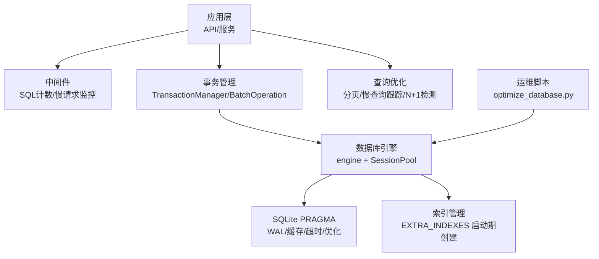
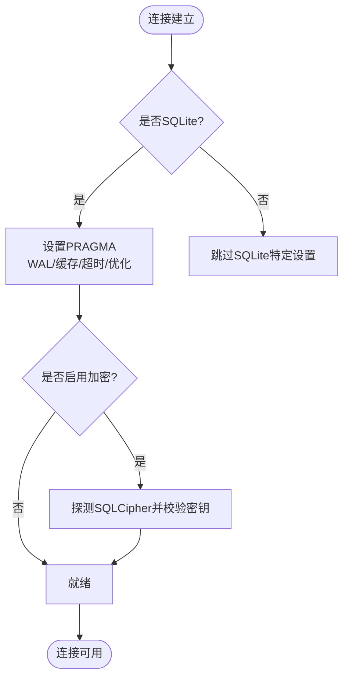
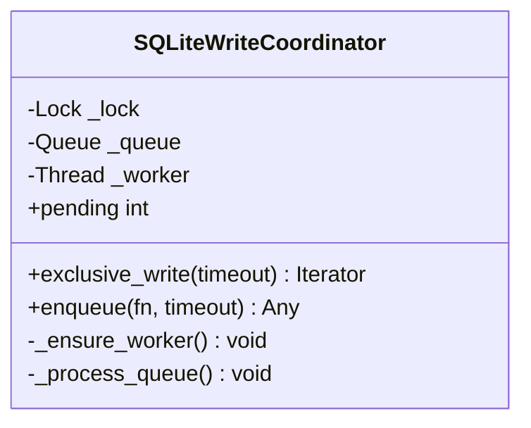
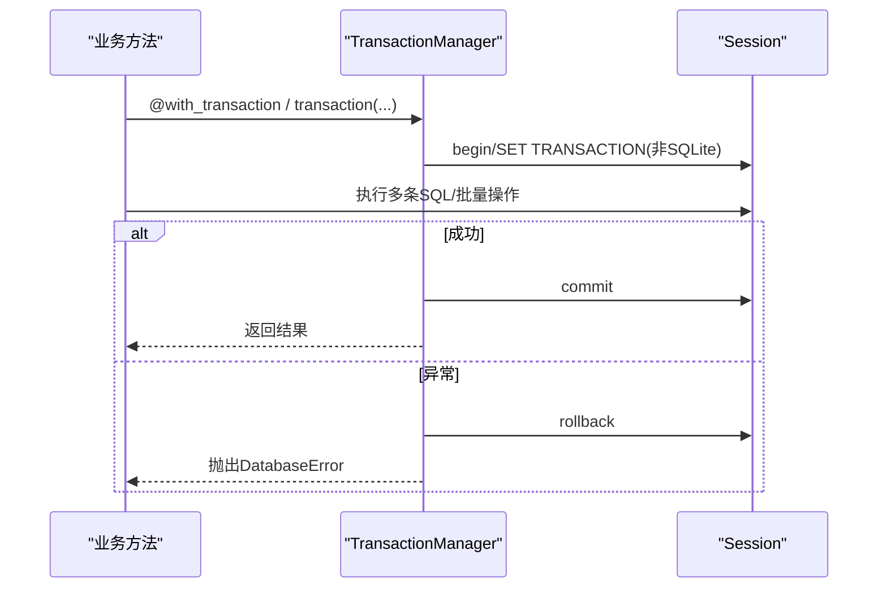
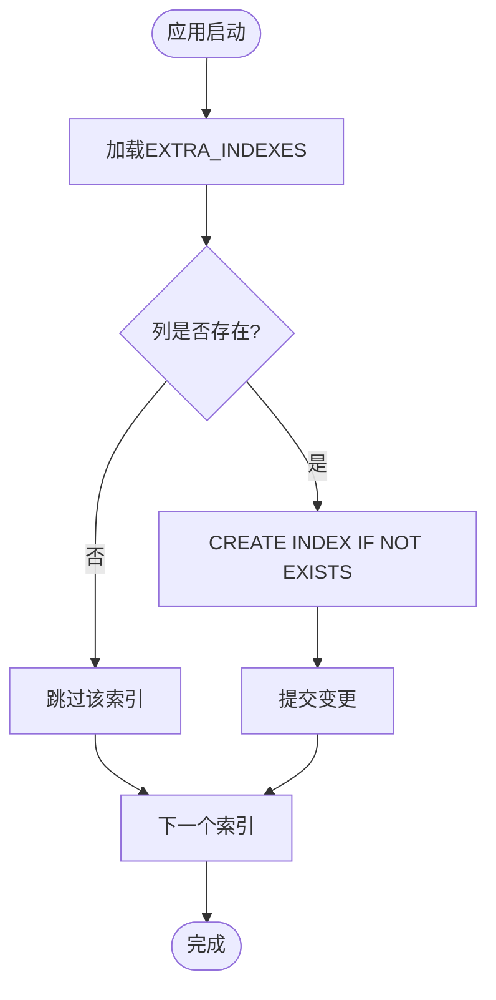
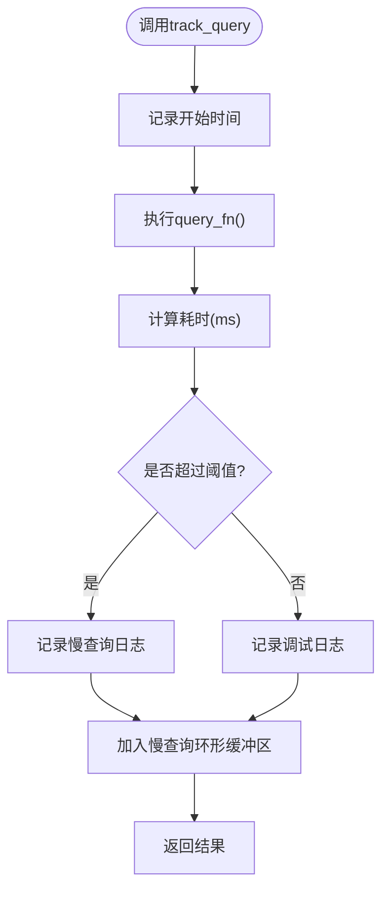
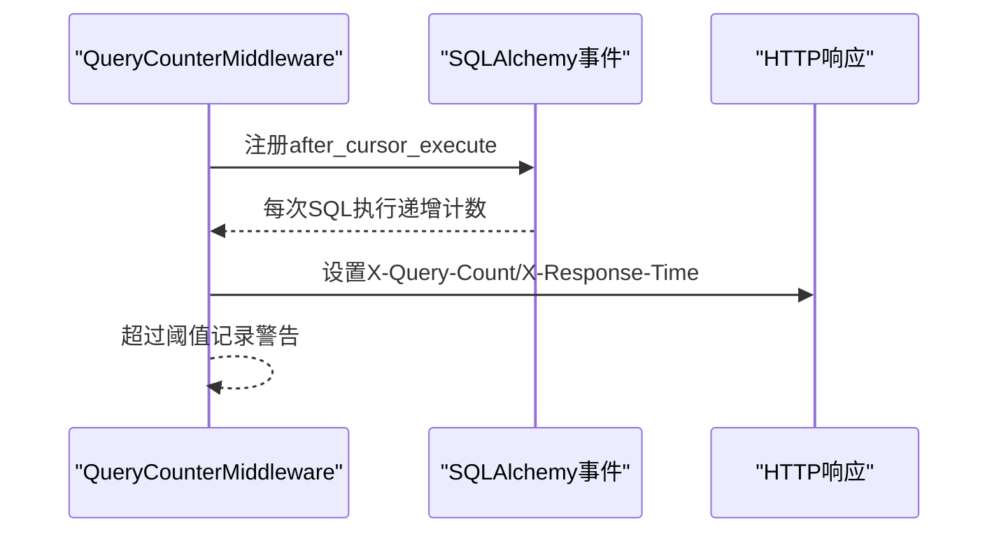
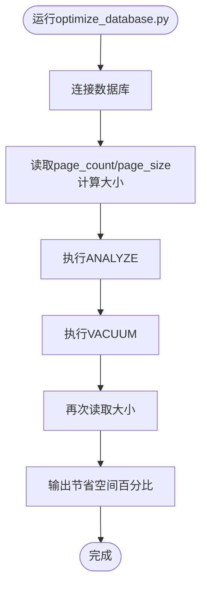
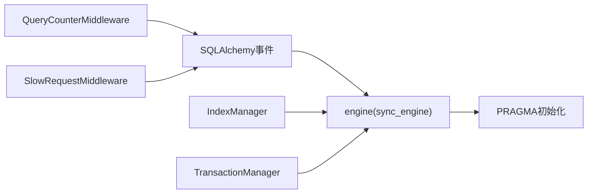

# 数据库性能优化

<cite>
**本文引用的文件**
- [backend/app/core/database.py](file://backend/app/core/database.py)
- [backend/app/core/query_optimizer.py](file://backend/app/core/query_optimizer.py)
- [backend/app/core/transaction.py](file://backend/app/core/transaction.py)
- [backend/app/core/database_indexes.py](file://backend/app/core/database_indexes.py)
- [backend/app/middleware/query_counter.py](file://backend/app/middleware/query_counter.py)
- [backend/app/middleware/slow_request_monitor.py](file://backend/app/middleware/slow_request_monitor.py)
- [backend/scripts/optimize_database.py](file://backend/scripts/optimize_database.py)
- [backend/app/services/batch_import_optimizer.py](file://backend/app/services/batch_import_optimizer.py)
</cite>

## 目录
1. [简介](#简介)
2. [项目结构](#项目结构)
3. [核心组件](#核心组件)
4. [架构总览](#架构总览)
5. [详细组件分析](#详细组件分析)
6. [依赖关系分析](#依赖关系分析)
7. [性能考量](#性能考量)
8. [故障排查指南](#故障排查指南)
9. [结论](#结论)
10. [附录](#附录)

## 简介
本技术文档面向乡村振兴系统的数据库性能优化，聚焦 SQLite 场景下的查询优化、索引设计、连接池与事务管理、批量操作、以及 VACUUM/PRAGMA/ANALYZE 等维护手段。文档结合仓库中的实际实现，给出可操作的优化策略、监控方案与排障建议，帮助读者在单机/多机物理协同环境下获得稳定且高效的数据库访问体验。

## 项目结构
围绕数据库性能优化的关键代码分布在以下模块：
- 数据库引擎与 PRAGMA 调优、写入协调器：backend/app/core/database.py
- 查询优化与慢查询追踪：backend/app/core/query_optimizer.py
- 事务管理与批量操作：backend/app/core/transaction.py
- 索引定义与启动期补建：backend/app/core/database_indexes.py
- 请求级 SQL 计数与 N+1 检测：backend/app/middleware/query_counter.py
- 慢请求与慢 SQL 监控中间件：backend/app/middleware/slow_request_monitor.py
- 数据库维护脚本（VACUUM/ANALYZE）：backend/scripts/optimize_database.py
- Excel 批量导入优化：backend/app/services/batch_import_optimizer.py



图表来源
- [backend/app/core/database.py:55-157](file://backend/app/core/database.py#L55-L157)
- [backend/app/core/database_indexes.py:59-95](file://backend/app/core/database_indexes.py#L59-L95)
- [backend/app/middleware/query_counter.py:39-77](file://backend/app/middleware/query_counter.py#L39-L77)
- [backend/app/middleware/slow_request_monitor.py:55-132](file://backend/app/middleware/slow_request_monitor.py#L55-L132)
- [backend/scripts/optimize_database.py:40-102](file://backend/scripts/optimize_database.py#L40-L102)

章节来源
- [backend/app/core/database.py:55-157](file://backend/app/core/database.py#L55-L157)
- [backend/app/core/database_indexes.py:59-95](file://backend/app/core/database_indexes.py#L59-L95)
- [backend/app/middleware/query_counter.py:39-77](file://backend/app/middleware/query_counter.py#L39-L77)
- [backend/app/middleware/slow_request_monitor.py:55-132](file://backend/app/middleware/slow_request_monitor.py#L55-L132)
- [backend/scripts/optimize_database.py:40-102](file://backend/scripts/optimize_database.py#L40-L102)

## 核心组件
- 数据库引擎与 PRAGMA 调优：启用 WAL、外键约束、NORMAL 同步、busy_timeout、cache_size、mmap_size、临时存储内存化、自动索引、连接关闭时 optimize；支持 SQLCipher 加密探测与密钥校验。
- 写入协调器：提供 exclusive_write 独占写上下文，避免长事务被 busy_timeout 截断并减少 SQLITE_BUSY。
- 事务管理：统一事务上下文、保存点、只读/隔离级别设置（非 SQLite）、死锁重试、安全提交 safe_commit。
- 批量操作：bulk_insert_mappings/bulk_update_mappings/delete 分批执行，flush 控制内存占用。
- 查询优化：分页工具、慢查询跟踪、N+1 检测装饰器。
- 索引管理：启动期校验并创建 EXTRA_INDEXES 中定义的索引，统计表行数。
- 监控中间件：SQL 计数（X-Query-Count）、慢 API/慢 SQL 记录与告警。
- 维护脚本：ANALYZE/VACUUM 与 PRAGMA 配置，输出优化前后大小对比。
- 导入优化：pandas 向量化读取 Excel，回退 openpyxl，配合 bulk 插入。

章节来源
- [backend/app/core/database.py:78-171](file://backend/app/core/database.py#L78-L171)
- [backend/app/core/database.py:198-289](file://backend/app/core/database.py#L198-L289)
- [backend/app/core/transaction.py:48-197](file://backend/app/core/transaction.py#L48-L197)
- [backend/app/core/transaction.py:365-457](file://backend/app/core/transaction.py#L365-L457)
- [backend/app/core/query_optimizer.py:23-49](file://backend/app/core/query_optimizer.py#L23-L49)
- [backend/app/core/query_optimizer.py:62-108](file://backend/app/core/query_optimizer.py#L62-L108)
- [backend/app/core/query_optimizer.py:137-177](file://backend/app/core/query_optimizer.py#L137-L177)
- [backend/app/core/database_indexes.py:59-95](file://backend/app/core/database_indexes.py#L59-L95)
- [backend/app/middleware/query_counter.py:39-77](file://backend/app/middleware/query_counter.py#L39-L77)
- [backend/app/middleware/slow_request_monitor.py:55-132](file://backend/app/middleware/slow_request_monitor.py#L55-L132)
- [backend/scripts/optimize_database.py:40-102](file://backend/scripts/optimize_database.py#L40-L102)
- [backend/app/services/batch_import_optimizer.py:26-73](file://backend/app/services/batch_import_optimizer.py#L26-L73)

## 架构总览
下图展示了从请求进入、中间件计数与慢请求监控，到事务与批量操作、索引与 PRAGMA 调优的完整链路。

```mermaid
sequenceDiagram
participant Client as "客户端"
participant MW as "中间件(计数/慢请求)"
participant TX as "事务管理器"
participant DB as "数据库引擎(SQLite)"
participant IDX as "索引管理"
participant OPT as "维护脚本"
Client->>MW : HTTP 请求
MW->>DB : 建立会话/执行SQL
DB-->>MW : 返回结果(含X-Query-Count)
MW-->>Client : 响应(含耗时/查询数)
TX->>DB : 事务/批量操作
DB->>IDX : 启动期创建/验证索引
OPT->>DB : ANALYZE/VACUUM/PRAGMA
```

图表来源
- [backend/app/middleware/query_counter.py:39-77](file://backend/app/middleware/query_counter.py#L39-L77)
- [backend/app/middleware/slow_request_monitor.py:55-132](file://backend/app/middleware/slow_request_monitor.py#L55-L132)
- [backend/app/core/transaction.py:48-197](file://backend/app/core/transaction.py#L48-L197)
- [backend/app/core/database_indexes.py:59-95](file://backend/app/core/database_indexes.py#L59-L95)
- [backend/scripts/optimize_database.py:40-102](file://backend/scripts/optimize_database.py#L40-L102)

## 详细组件分析

### 数据库引擎与 PRAGMA 调优
- 连接池：针对 SQLite 使用 QueuePool，限制连接数，开启 pool_pre_ping、pool_recycle、pool_timeout，降低文件锁竞争。
- PRAGMA 初始化：WAL、foreign_keys=ON、synchronous=NORMAL、busy_timeout=10000、cache_size/mmap_size、temp_store=MEMORY、wal_autocheckpoint、automatic_index=ON。
- 连接关闭优化：PRAGMA optimize。
- 加密支持：SQLCipher 探测与密钥校验，fail-fast。



图表来源
- [backend/app/core/database.py:78-157](file://backend/app/core/database.py#L78-L157)
- [backend/app/core/database.py:160-171](file://backend/app/core/database.py#L160-L171)

章节来源
- [backend/app/core/database.py:55-157](file://backend/app/core/database.py#L55-L157)
- [backend/app/core/database.py:160-171](file://backend/app/core/database.py#L160-L171)

### 写入协调器（长事务保护）
- exclusive_write：进程内互斥锁，避免长事务被 busy_timeout 中断，防止 SQLITE_BUSY。
- 兼容队列：保留 enqueue 以兼容旧版串行写入。



图表来源
- [backend/app/core/database.py:198-289](file://backend/app/core/database.py#L198-L289)

章节来源
- [backend/app/core/database.py:198-289](file://backend/app/core/database.py#L198-L289)

### 事务管理与批量操作
- 事务上下文：transaction/nested_transaction/savepoint，异常时自动 rollback。
- 高级装饰器：with_transaction 支持隔离级别与只读（非 SQLite）。
- 死锁重试：retry_on_deadlock 对包含 lock/deadlock 的错误进行有限重试。
- 批量操作：BatchOperation 提供 batch_insert/batch_update/batch_delete，按批次 flush 控制内存。



图表来源
- [backend/app/core/transaction.py:48-197](file://backend/app/core/transaction.py#L48-L197)
- [backend/app/core/transaction.py:292-319](file://backend/app/core/transaction.py#L292-L319)
- [backend/app/core/transaction.py:322-362](file://backend/app/core/transaction.py#L322-L362)
- [backend/app/core/transaction.py:365-457](file://backend/app/core/transaction.py#L365-L457)

章节来源
- [backend/app/core/transaction.py:48-197](file://backend/app/core/transaction.py#L48-L197)
- [backend/app/core/transaction.py:292-319](file://backend/app/core/transaction.py#L292-L319)
- [backend/app/core/transaction.py:322-362](file://backend/app/core/transaction.py#L322-L362)
- [backend/app/core/transaction.py:365-457](file://backend/app/core/transaction.py#L365-L457)

### 索引设计与启动期补建
- 索引清单：EXTRA_INDEXES 集中管理 FK、状态/日期等高频过滤列的索引。
- 启动期创建：create_indexes 校验列存在性后幂等创建；drop_indexes 删除；analyze_table_stats 收集行数统计。



图表来源
- [backend/app/core/database_indexes.py:59-95](file://backend/app/core/database_indexes.py#L59-L95)

章节来源
- [backend/app/core/database_indexes.py:59-95](file://backend/app/core/database_indexes.py#L59-L95)
- [backend/app/core/database_indexes.py:98-148](file://backend/app/core/database_indexes.py#L98-L148)

### 查询优化与慢查询识别
- 分页：paginate 封装 count/offset/limit，限制最大页大小。
- 慢查询跟踪：track_query 记录执行时间，超过阈值告警；get_slow_queries 获取最近慢查询。
- N+1 检测：@analyze_n_plus_one 统计单次调用内的查询次数，超阈值告警。



图表来源
- [backend/app/core/query_optimizer.py:62-108](file://backend/app/core/query_optimizer.py#L62-L108)

章节来源
- [backend/app/core/query_optimizer.py:23-49](file://backend/app/core/query_optimizer.py#L23-L49)
- [backend/app/core/query_optimizer.py:62-108](file://backend/app/core/query_optimizer.py#L62-L108)
- [backend/app/core/query_optimizer.py:137-177](file://backend/app/core/query_optimizer.py#L137-L177)

### 监控中间件：SQL 计数与慢请求
- SQL 计数：after_cursor_execute 事件递增计数器，响应头 X-Query-Count 暴露；超过阈值告警。
- 慢请求/慢 SQL：SlowRequestMiddleware 记录慢 API 与慢 SQL，提供查询接口与统计摘要。



图表来源
- [backend/app/middleware/query_counter.py:30-77](file://backend/app/middleware/query_counter.py#L30-L77)
- [backend/app/middleware/slow_request_monitor.py:70-101](file://backend/app/middleware/slow_request_monitor.py#L70-L101)
- [backend/app/middleware/slow_request_monitor.py:103-132](file://backend/app/middleware/slow_request_monitor.py#L103-L132)

章节来源
- [backend/app/middleware/query_counter.py:30-77](file://backend/app/middleware/query_counter.py#L30-L77)
- [backend/app/middleware/slow_request_monitor.py:55-132](file://backend/app/middleware/slow_request_monitor.py#L55-L132)

### 维护脚本：VACUUM/ANALYZE/PRAGMA
- 功能：执行 ANALYZE 更新统计信息，VACUUM 回收空间整理碎片，打印优化前后数据库大小。
- PRAGMA：连接时设置 WAL、synchronous、cache_size、temp_store、foreign_keys、busy_timeout、mmap_size。



图表来源
- [backend/scripts/optimize_database.py:40-102](file://backend/scripts/optimize_database.py#L40-L102)

章节来源
- [backend/scripts/optimize_database.py:40-102](file://backend/scripts/optimize_database.py#L40-L102)

### Excel 批量导入优化
- pandas 快速读取：read_excel_raw 使用 dtype=object/keep_default_na=False，空值对齐 None。
- 回退机制：pandas 不可用时使用 openpyxl 逐行读取。
- 配合 bulk 插入：与 BatchOperation 或 bulk_insert_mappings 组合提升导入吞吐。

章节来源
- [backend/app/services/batch_import_optimizer.py:26-73](file://backend/app/services/batch_import_optimizer.py#L26-L73)
- [backend/app/core/transaction.py:365-457](file://backend/app/core/transaction.py#L365-L457)

## 依赖关系分析
- 中间件依赖 SQLAlchemy 事件监听，通过 engine.sync_engine 安装 before/after 钩子。
- 数据库引擎在连接时注入 PRAGMA，影响所有后续查询计划与行为。
- 索引管理在启动期依赖 engine 与 inspect，确保模型与物理结构一致。
- 事务模块依赖 database.get_db 与 IS_SQLITE 判断，避免在不支持的数据库上执行 SET TRANSACTION。



图表来源
- [backend/app/middleware/query_counter.py:30-77](file://backend/app/middleware/query_counter.py#L30-L77)
- [backend/app/middleware/slow_request_monitor.py:70-101](file://backend/app/middleware/slow_request_monitor.py#L70-L101)
- [backend/app/core/database.py:78-157](file://backend/app/core/database.py#L78-L157)
- [backend/app/core/database_indexes.py:59-95](file://backend/app/core/database_indexes.py#L59-L95)
- [backend/app/core/transaction.py:236-245](file://backend/app/core/transaction.py#L236-L245)

章节来源
- [backend/app/middleware/query_counter.py:30-77](file://backend/app/middleware/query_counter.py#L30-L77)
- [backend/app/middleware/slow_request_monitor.py:70-101](file://backend/app/middleware/slow_request_monitor.py#L70-L101)
- [backend/app/core/database.py:78-157](file://backend/app/core/database.py#L78-L157)
- [backend/app/core/database_indexes.py:59-95](file://backend/app/core/database_indexes.py#L59-L95)
- [backend/app/core/transaction.py:236-245](file://backend/app/core/transaction.py#L236-L245)

## 性能考量
- 连接池参数：合理设置 pool_size、max_overflow、pool_recycle、pool_timeout，避免过多连接导致文件锁竞争。
- WAL 模式：读写并发不阻塞，适合高并发读场景；配合 NORMAL 同步平衡安全与性能。
- 内存与缓存：cache_size 与 mmap_size 根据机器内存调整；temp_store=MEMORY 加速临时对象。
- 长事务保护：使用 exclusive_write 包裹大批量导入/更新，避免 SQLITE_BUSY。
- 批量操作：bulk_insert_mappings/bulk_update_mappings 分批 flush，控制内存峰值。
- 索引策略：为高频 WHERE/ORDER BY/FK 列建立索引，减少全表扫描与 JOIN 成本。
- 维护周期：定期 ANALYZE 更新统计，VACUUM 回收空间；生产环境建议在低峰期执行。
- 监控指标：关注 X-Query-Count、慢 API/慢 SQL 记录，定位 N+1 与热点查询。

[本节为通用指导，无需具体文件引用]

## 故障排查指南
- 慢查询定位：
  - 使用 track_query 包装关键查询函数，观察慢查询日志与 get_slow_queries。
  - 借助 @analyze_n_plus_one 检测 N+1 问题，结合中间件的 X-Query-Count 确认单请求 SQL 数量。
- 慢请求/慢 SQL：
  - SlowRequestMiddleware 记录慢 API 与慢 SQL，可通过 get_slow_api_records/get_slow_sql_records 获取最近记录。
- 连接与锁问题：
  - 检查 PRAGMA busy_timeout 与 exclusive_write 的使用，避免长事务被中断。
  - 若出现 SQLITE_BUSY，考虑扩大 busy_timeout 或改用独占写上下文。
- 索引缺失：
  - 使用 analyze_table_stats 查看表行数，结合慢查询 SQL 判断是否需要新增索引。
  - 通过 create_indexes 启动期补建 EXTRA_INDEXES 中的索引。
- 数据一致性：
  - 使用 TransactionManager 的事务上下文与 savepoint，确保异常时回滚。
  - 使用 safe_commit 替代裸 db.commit()，避免提交失败导致的脏状态。

章节来源
- [backend/app/core/query_optimizer.py:62-108](file://backend/app/core/query_optimizer.py#L62-L108)
- [backend/app/core/query_optimizer.py:137-177](file://backend/app/core/query_optimizer.py#L137-L177)
- [backend/app/middleware/slow_request_monitor.py:32-52](file://backend/app/middleware/slow_request_monitor.py#L32-L52)
- [backend/app/core/database.py:198-289](file://backend/app/core/database.py#L198-L289)
- [backend/app/core/database_indexes.py:121-148](file://backend/app/core/database_indexes.py#L121-L148)
- [backend/app/core/transaction.py:200-234](file://backend/app/core/transaction.py#L200-L234)

## 结论
本项目在 SQLite 场景下提供了完整的数据库性能优化方案：从连接池与 PRAGMA 调优、事务与批量操作、索引启动期补建，到慢查询与 N+1 检测、慢请求/慢 SQL 监控，以及 VACUUM/ANALYZE 维护脚本。通过中间件与工具链的配合，能够持续发现并优化性能瓶颈，保障系统在单机/多机物理协同环境下的稳定性与高效性。

[本节为总结，无需具体文件引用]

## 附录
- 常用 PRAGMA 参考：journal_mode=WAL、synchronous=NORMAL、busy_timeout、cache_size、mmap_size、temp_store=MEMORY、wal_autocheckpoint、automatic_index=ON。
- 维护命令：ANALYZE、VACUUM。
- 监控指标：X-Query-Count、慢 API/慢 SQL 记录、慢查询列表。
- 批量导入：pandas read_excel_raw + bulk_insert_mappings，必要时使用 openpyxl 回退。

[本节为补充说明，无需具体文件引用]