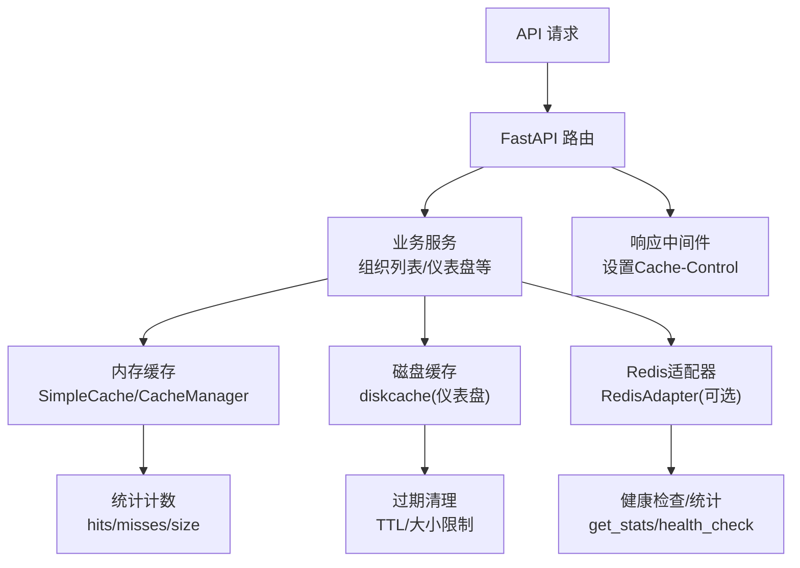
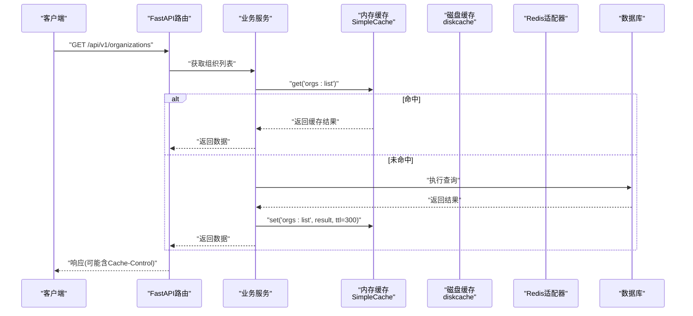
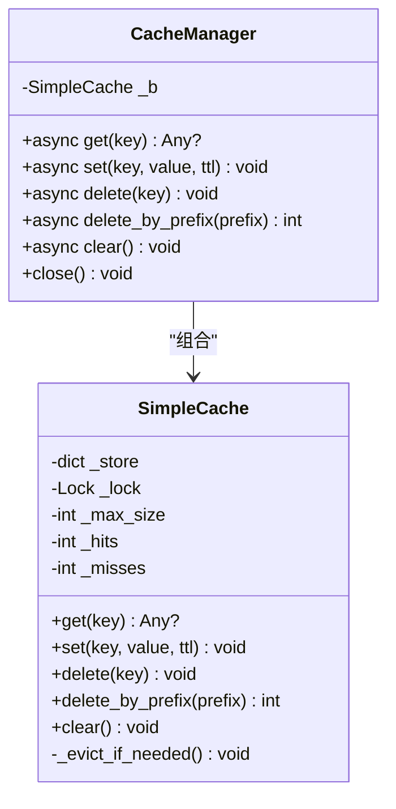
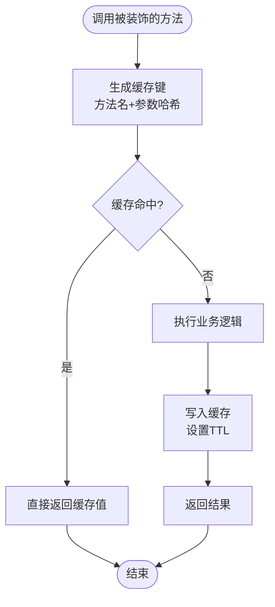
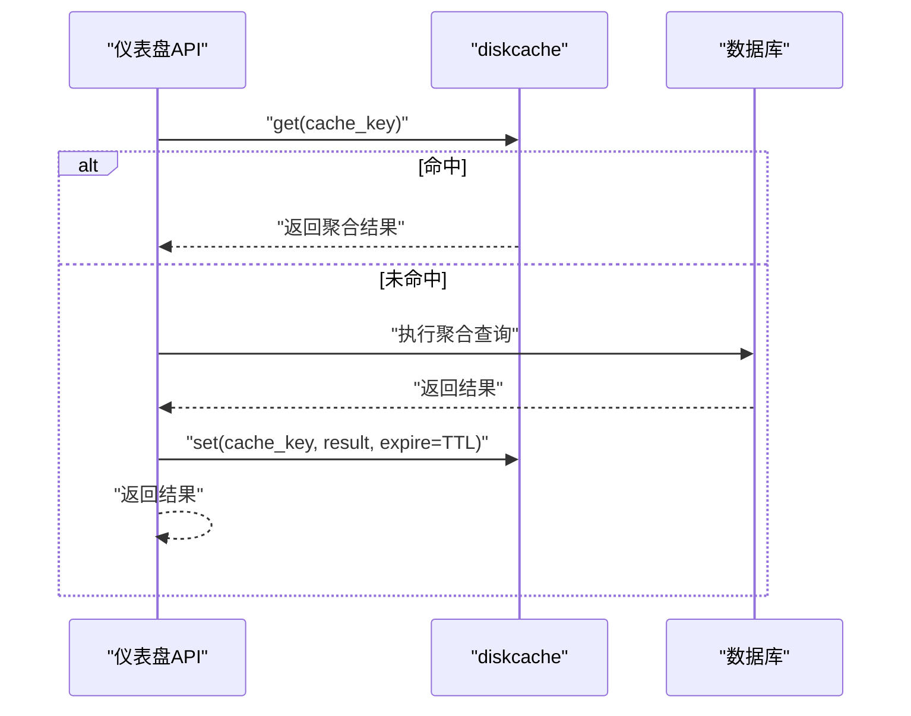
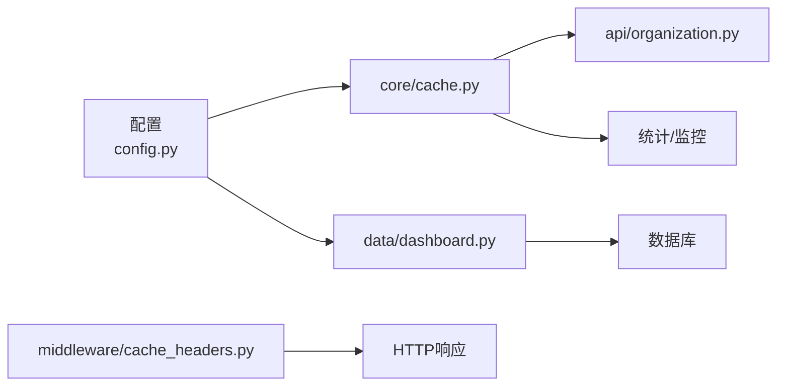

# 缓存机制优化

<cite>
**本文引用的文件**
- [backend/app/core/cache.py](file://backend/app/core/cache.py)
- [backend/app/services/cache_service.py](file://backend/app/services/cache_service.py)
- [backend/app/core/redis_adapter.py](file://backend/app/core/redis_adapter.py)
- [backend/app/middleware/cache_headers.py](file://backend/app/middleware/cache_headers.py)
- [backend/app/api/v1/system/cache.py](file://backend/app/api/v1/system/cache.py)
- [backend/app/api/v1/data/data/dashboard.py](file://backend/app/api/v1/data/data/dashboard.py)
- [backend/app/api/v1/organization.py](file://backend/app/api/v1/organization.py)
- [backend/app/core/config.py](file://backend/app/core/config.py)
</cite>

## 目录
1. [简介](#简介)
2. [项目结构](#项目结构)
3. [核心组件](#核心组件)
4. [架构总览](#架构总览)
5. [详细组件分析](#详细组件分析)
6. [依赖关系分析](#依赖关系分析)
7. [性能考量](#性能考量)
8. [故障排查指南](#故障排查指南)
9. [结论](#结论)
10. [附录：最佳实践与示例路径](#附录：最佳实践与示例路径)

## 简介
本指南面向“帮扶管理信息系统”后端，提供多级缓存架构的完整实现方案与落地建议。内容涵盖内存缓存、Redis（可选）、浏览器缓存的分层设计；LRU/LFU/TTL等策略的应用场景；一致性保障（失效、同步、并发控制）；性能监控（命中率、内存使用、预热）；以及在不同业务场景下的最佳实践与代码路径指引。

## 项目结构
系统已内置可插拔的缓存基础设施：
- 进程内内存缓存：SimpleCache + CacheManager（线程安全、支持TTL、统计计数）
- 磁盘缓存：dashboard模块使用diskcache（按目录隔离、大小限制、TTL）
- Redis适配器：RedisAdapter（离线模式为内存占位，便于统一接入）
- 浏览器缓存：中间件对静态/低变数据添加Cache-Control头
- 配置开关：全局CACHE_ENABLED、默认TTL、最大容量等

图表来源
- [backend/app/core/cache.py:14-96](file://backend/app/core/cache.py#L14-L96)
- [backend/app/api/v1/data/data/dashboard.py:44-90](file://backend/app/api/v1/data/data/dashboard.py#L44-L90)
- [backend/app/core/redis_adapter.py:7-43](file://backend/app/core/redis_adapter.py#L7-L43)
- [backend/app/middleware/cache_headers.py:8-30](file://backend/app/middleware/cache_headers.py#L8-L30)

章节来源
- [backend/app/core/cache.py:14-96](file://backend/app/core/cache.py#L14-L96)
- [backend/app/api/v1/data/data/dashboard.py:44-90](file://backend/app/api/v1/data/data/dashboard.py#L44-L90)
- [backend/app/core/redis_adapter.py:7-43](file://backend/app/core/redis_adapter.py#L7-L43)
- [backend/app/middleware/cache_headers.py:8-30](file://backend/app/middleware/cache_headers.py#L8-L30)

## 核心组件
- SimpleCache：线程安全的进程内缓存，支持TTL、按插入顺序淘汰（近似FIFO），维护命中/未命中计数与估算大小。
- CacheManager：异步包装器，提供await风格的get/set/delete接口，便于在协程中透明使用。
- CacheService：封装常用操作（get/set/delete/exists/pattern clear/invalidate_related_cache/warm_up_cache），并提供装饰器@cached/@cache_result/@cache_invalidate和EntityCacheManager用于实体级缓存。
- RedisAdapter：离线模式下的内存占位实现，提供get/set/delete/exists/flush/get_stats/health_check，便于统一接入。
- 浏览器缓存中间件：根据路径前缀规则为响应附加Cache-Control头，减少重复请求。
- 仪表盘磁盘缓存：基于diskcache的本地持久化缓存，带大小限制与TTL，适合较重聚合查询结果。

章节来源
- [backend/app/core/cache.py:14-137](file://backend/app/core/cache.py#L14-L137)
- [backend/app/services/cache_service.py:20-477](file://backend/app/services/cache_service.py#L20-L477)
- [backend/app/core/redis_adapter.py:7-43](file://backend/app/core/redis_adapter.py#L7-L43)
- [backend/app/middleware/cache_headers.py:8-30](file://backend/app/middleware/cache_headers.py#L8-L30)
- [backend/app/api/v1/data/data/dashboard.py:44-90](file://backend/app/api/v1/data/data/dashboard.py#L44-L90)

## 架构总览
下图展示请求从进入API到命中各级缓存的完整流程，并体现失效与监控点。

图表来源
- [backend/app/api/v1/organization.py:139-182](file://backend/app/api/v1/organization.py#L139-L182)
- [backend/app/core/cache.py:72-96](file://backend/app/core/cache.py#L72-L96)
- [backend/app/middleware/cache_headers.py:20-30](file://backend/app/middleware/cache_headers.py#L20-L30)

## 详细组件分析

### 内存缓存：SimpleCache 与 CacheManager
- 线程安全：通过锁保护读写，避免并发竞争。
- TTL支持：每个键记录过期时间，读取时自动清理过期项。
- 淘汰策略：当达到max_size时，删除最早插入的键（近似FIFO）。若需严格LRU/LFU，可在SimpleCache内部维护访问频次或最近访问时间，并在_evict_if_needed中选择最久未用或最少使用的键。
- 统计能力：维护_hits/_misses，便于计算命中率。

图表来源
- [backend/app/core/cache.py:14-96](file://backend/app/core/cache.py#L14-L96)
- [backend/app/core/cache.py:72-96](file://backend/app/core/cache.py#L72-L96)

章节来源
- [backend/app/core/cache.py:14-96](file://backend/app/core/cache.py#L14-L96)

### 高级缓存服务：CacheService 与装饰器
- 统一封装：get/set/delete/exists/clear_pattern/invalidate_related_cache/warm_up_cache。
- 装饰器：
  - @cached：对函数结果进行缓存，支持自定义key生成与TTL。
  - @cache_result：同步/异步兼容的结果缓存装饰器。
  - @cache_invalidate：写操作后自动失效相关缓存。
- EntityCacheManager：针对实体（如village/fund/user）提供统一的list/stats/detail缓存键管理与批量失效。

图表来源
- [backend/app/services/cache_service.py:259-308](file://backend/app/services/cache_service.py#L259-L308)
- [backend/app/services/cache_service.py:311-358](file://backend/app/services/cache_service.py#L311-L358)
- [backend/app/services/cache_service.py:361-403](file://backend/app/services/cache_service.py#L361-L403)
- [backend/app/services/cache_service.py:427-473](file://backend/app/services/cache_service.py#L427-L473)

章节来源
- [backend/app/services/cache_service.py:20-477](file://backend/app/services/cache_service.py#L20-L477)

### 磁盘缓存：仪表盘聚合查询
- 使用diskcache将复杂聚合结果落盘，设置大小限制与TTL，降低数据库压力。
- 提供安全读/写封装，异常降级不影响主流程。
- 提供invalidate_dashboard_cache供数据变更后统一清理。

图表来源
- [backend/app/api/v1/data/data/dashboard.py:44-90](file://backend/app/api/v1/data/data/dashboard.py#L44-L90)

章节来源
- [backend/app/api/v1/data/data/dashboard.py:44-90](file://backend/app/api/v1/data/data/dashboard.py#L44-L90)

### Redis适配器（可选）
- 当前为内存占位实现，便于在不启用Redis的场景下保持接口一致。
- 提供get_stats/health_check，便于后续扩展真实Redis连接时复用监控与健康检查逻辑。

章节来源
- [backend/app/core/redis_adapter.py:7-43](file://backend/app/core/redis_adapter.py#L7-L43)

### 浏览器缓存：Cache-Control中间件
- 对特定路径前缀（如筛选选项、组织树、静态资源）设置Cache-Control，减少重复请求。
- 对统计/概览类端点不缓存，确保数据变更立即可见。

章节来源
- [backend/app/middleware/cache_headers.py:8-30](file://backend/app/middleware/cache_headers.py#L8-L30)

### 业务场景中的缓存应用
- 组织列表：无过滤条件的默认列表请求使用内存缓存（TTL=300秒），写操作后统一失效。
- 仪表盘：聚合查询结果使用diskcache缓存（TTL=120秒），数据变更后清空。
- 用户选项：静态选项数据使用装饰器缓存（TTL=3600秒）。

章节来源
- [backend/app/api/v1/organization.py:139-182](file://backend/app/api/v1/organization.py#L139-L182)
- [backend/app/api/v1/auth/users.py:113-114](file://backend/app/api/v1/auth/users.py#L113-L114)

## 依赖关系分析
- 配置驱动：CACHE_ENABLED、CACHE_DEFAULT_TTL、CACHE_MAX_SIZE等决定缓存行为。
- 模块耦合：
  - 业务API依赖CacheManager进行读写。
  - 仪表盘模块独立使用diskcache，并通过invalidate_dashboard_cache暴露失效入口。
  - 中间件对响应头进行统一处理，与业务解耦。
  - RedisAdapter作为可选后端，便于未来切换或扩展。

图表来源
- [backend/app/core/config.py:114-183](file://backend/app/core/config.py#L114-L183)
- [backend/app/core/cache.py:135-137](file://backend/app/core/cache.py#L135-L137)
- [backend/app/api/v1/data/data/dashboard.py:44-90](file://backend/app/api/v1/data/data/dashboard.py#L44-L90)
- [backend/app/middleware/cache_headers.py:8-30](file://backend/app/middleware/cache_headers.py#L8-L30)

章节来源
- [backend/app/core/config.py:114-183](file://backend/app/core/config.py#L114-L183)

## 性能考量
- 命中率与未命中率：SimpleCache维护_hits/_misses，可通过系统缓存统计接口查看命中率与估算内存占用。
- 内存使用：SimpleCache按max_size限制条目数，避免无限增长；仪表盘diskcache设置大小限制与TTL，防止磁盘膨胀。
- 预热策略：CacheService提供warm_up_cache，可在启动或低峰期预加载热点数据。
- 并发控制：SimpleCache使用线程锁保证一致性；CacheManager提供异步接口，避免阻塞事件循环。
- 浏览器缓存：对静态/低变数据设置Cache-Control，减少网络与服务器负载。

章节来源
- [backend/app/api/v1/system/cache.py:23-62](file://backend/app/api/v1/system/cache.py#L23-L62)
- [backend/app/api/v1/data/data/dashboard.py:44-90](file://backend/app/api/v1/data/data/dashboard.py#L44-L90)
- [backend/app/services/cache_service.py:188-213](file://backend/app/services/cache_service.py#L188-L213)
- [backend/app/core/cache.py:14-96](file://backend/app/core/cache.py#L14-L96)

## 故障排查指南
- 缓存统计不可用：确认CACHE_ENABLED为True且SimpleCache已初始化；通过系统缓存统计接口查看命中率与内存占用。
- 缓存未生效：检查对应API是否命中缓存条件（如组织列表仅默认分页命中）；确认TTL设置合理。
- 数据不一致：确认写操作后是否调用失效逻辑（如组织列表写操作后删除"orgs:list"）；仪表盘数据变更后调用invalidate_dashboard_cache。
- 浏览器缓存导致数据不更新：确认响应头是否包含no-cache；对统计/概览类端点避免缓存。

章节来源
- [backend/app/api/v1/system/cache.py:23-99](file://backend/app/api/v1/system/cache.py#L23-L99)
- [backend/app/api/v1/organization.py:139-182](file://backend/app/api/v1/organization.py#L139-L182)
- [backend/app/api/v1/data/data/dashboard.py:82-90](file://backend/app/api/v1/data/data/dashboard.py#L82-L90)
- [backend/app/middleware/cache_headers.py:8-30](file://backend/app/middleware/cache_headers.py#L8-L30)

## 结论
本项目已具备完善的缓存基础：进程内内存缓存、可选Redis适配、磁盘缓存与浏览器缓存协同工作。通过合理的TTL、失效策略与监控手段，可有效提升系统性能与稳定性。建议在关键业务路径引入装饰器与EntityCacheManager统一管理缓存键与失效，结合预热与监控持续优化命中率与资源占用。

## 附录：最佳实践与示例路径
- 选择算法
  - LRU：适用于热点数据频繁访问但集合有限的场景。可在SimpleCache._evict_if_needed中改为基于最近访问时间淘汰。
  - LFU：适用于访问频率差异明显的场景。可在SimpleCache中维护频次计数器，淘汰最少使用项。
  - TTL：对所有缓存键设置合理TTL，避免脏数据长期驻留。
- 一致性保障
  - 失效策略：写操作后显式删除相关键或使用@cache_invalidate装饰器。
  - 数据同步：对强一致需求，优先走数据库；对最终一致，使用缓存+失效。
  - 并发控制：使用SimpleCache的线程锁；异步场景使用CacheManager。
- 性能监控
  - 命中率：通过系统缓存统计接口获取hits/misses与hit_rate。
  - 内存使用：估算缓存大小，监控SimpleCache._store规模。
  - 预热：使用warm_up_cache在启动或低峰期预加载热点数据。
- 代码示例路径
  - 内存缓存基础：[backend/app/core/cache.py:14-96](file://backend/app/core/cache.py#L14-L96)
  - 高级缓存服务与装饰器：[backend/app/services/cache_service.py:20-477](file://backend/app/services/cache_service.py#L20-L477)
  - 仪表盘磁盘缓存：[backend/app/api/v1/data/data/dashboard.py:44-90](file://backend/app/api/v1/data/data/dashboard.py#L44-L90)
  - 浏览器缓存中间件：[backend/app/middleware/cache_headers.py:8-30](file://backend/app/middleware/cache_headers.py#L8-L30)
  - 组织列表缓存应用：[backend/app/api/v1/organization.py:139-182](file://backend/app/api/v1/organization.py#L139-L182)
  - 配置项（TTL/大小/开关）：[backend/app/core/config.py:114-183](file://backend/app/core/config.py#L114-L183)