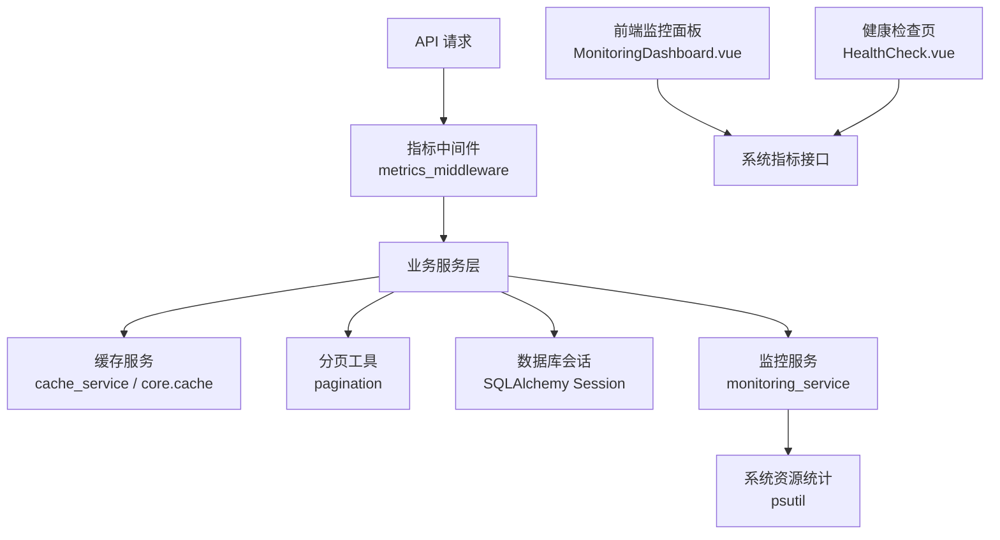
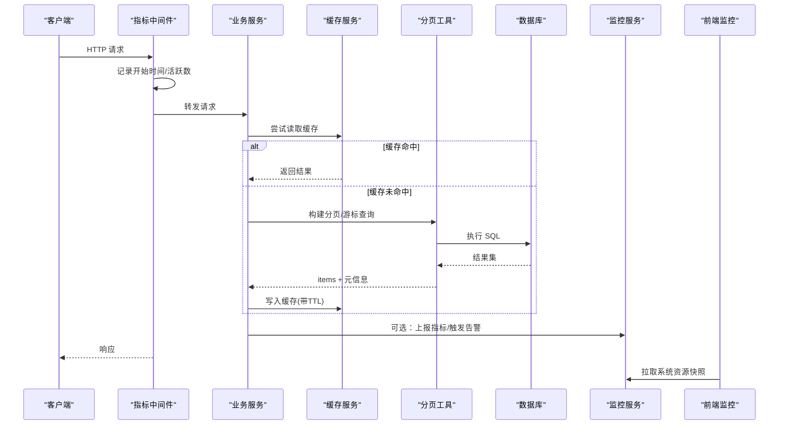
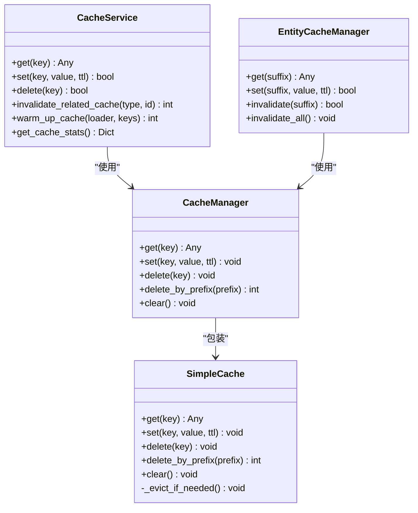
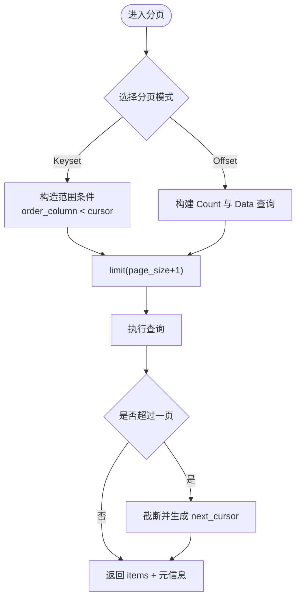
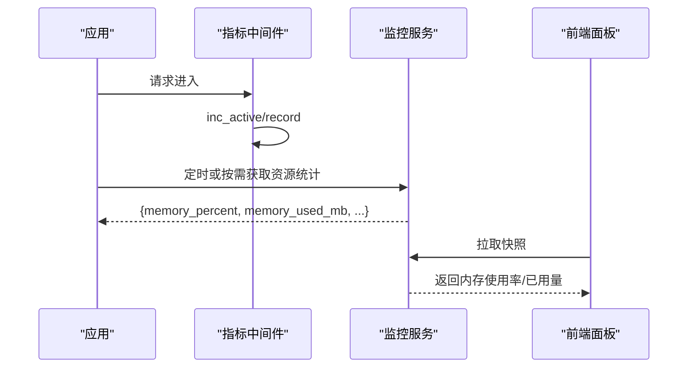
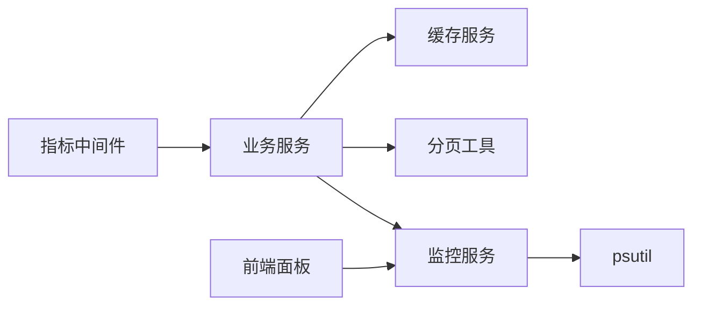

# 内存使用调优

<cite>
**本文引用的文件**
- [backend/app/core/cache.py](file://backend/app/core/cache.py)
- [backend/app/services/cache_service.py](file://backend/app/services/cache_service.py)
- [backend/app/utils/pagination.py](file://backend/app/utils/pagination.py)
- [backend/app/middleware/metrics_middleware.py](file://backend/app/middleware/metrics_middleware.py)
- [backend/app/services/monitoring_service.py](file://backend/app/services/monitoring_service.py)
- [backend/app/models/monitoring.py](file://backend/app/models/monitoring.py)
- [backend/scripts/performance_benchmark.py](file://backend/scripts/performance_benchmark.py)
- [frontend/src/views/system/MonitoringDashboard.vue](file://frontend/src/views/system/MonitoringDashboard.vue)
- [frontend/src/views/system/HealthCheck.vue](file://frontend/src/views/system/HealthCheck.vue)
</cite>

## 目录
1. [简介](#简介)
2. [项目结构](#项目结构)
3. [核心组件](#核心组件)
4. [架构总览](#架构总览)
5. [详细组件分析](#详细组件分析)
6. [依赖关系分析](#依赖关系分析)
7. [性能与内存考量](#性能与内存考量)
8. [故障排查指南](#故障排查指南)
9. [结论](#结论)
10. [附录](#附录)

## 简介
本文件面向后端 Python 服务，围绕“内存使用调优”提供系统化方案：从对象生命周期、缓存与分页策略、大对象处理、到泄漏检测与监控告警。结合仓库中已有的内存缓存实现、分页工具、指标采集中间件与系统资源监控能力，给出可落地的优化路径与最佳实践。

## 项目结构
与内存调优直接相关的代码主要分布在以下模块：
- 内存缓存与键管理：core.cache、services.cache_service
- 数据分页与游标：utils.pagination
- 运行时指标采集：middleware.metrics_middleware
- 系统资源监控与告警：services.monitoring_service、models.monitoring
- 前端展示与阈值判断：frontend MonitoringDashboard.vue、HealthCheck.vue
- 基准测试脚本（辅助定位慢查询与潜在内存压力）：scripts.performance_benchmark.py

图表来源
- [backend/app/middleware/metrics_middleware.py:1-177](file://backend/app/middleware/metrics_middleware.py#L1-L177)
- [backend/app/services/cache_service.py:1-477](file://backend/app/services/cache_service.py#L1-L477)
- [backend/app/core/cache.py:1-166](file://backend/app/core/cache.py#L1-L166)
- [backend/app/utils/pagination.py:1-227](file://backend/app/utils/pagination.py#L1-L227)
- [backend/app/services/monitoring_service.py:1-312](file://backend/app/services/monitoring_service.py#L1-L312)
- [frontend/src/views/system/MonitoringDashboard.vue:389-551](file://frontend/src/views/system/MonitoringDashboard.vue#L389-L551)
- [frontend/src/views/system/HealthCheck.vue:344-366](file://frontend/src/views/system/HealthCheck.vue#L344-L366)

章节来源
- [backend/app/core/cache.py:1-166](file://backend/app/core/cache.py#L1-L166)
- [backend/app/services/cache_service.py:1-477](file://backend/app/services/cache_service.py#L1-L477)
- [backend/app/utils/pagination.py:1-227](file://backend/app/utils/pagination.py#L1-L227)
- [backend/app/middleware/metrics_middleware.py:1-177](file://backend/app/middleware/metrics_middleware.py#L1-L177)
- [backend/app/services/monitoring_service.py:1-312](file://backend/app/services/monitoring_service.py#L1-L312)
- [frontend/src/views/system/MonitoringDashboard.vue:389-551](file://frontend/src/views/system/MonitoringDashboard.vue#L389-L551)
- [frontend/src/views/system/HealthCheck.vue:344-366](file://frontend/src/views/system/HealthCheck.vue#L344-L366)

## 核心组件
- 内存缓存 SimpleCache/CacheManager：线程安全、按 key TTL、容量上限与 LRU 式淘汰；提供装饰器 cached/cache_result 简化接入。
- 缓存服务 CacheService：统一封装 get/set/delete/失效/预热，维护命中/未命中统计，支持实体级缓存管理器 EntityCacheManager。
- 分页工具 pagination：Keyset 游标分页（O(log N)）与 Offset 分页（分离 Count/Data），避免深分页导致的内存与 CPU 抖动。
- 指标中间件 metrics_middleware：ASGI 原生记录请求计数、错误率、活跃请求、慢请求等，供 /metrics 查询。
- 监控服务 monitoring_service：通过 psutil 获取 CPU/内存/磁盘使用率，支撑告警规则与前端健康卡。
- 模型 monitoring：持久化 API 指标与告警规则/历史，便于回溯与审计。

章节来源
- [backend/app/core/cache.py:14-137](file://backend/app/core/cache.py#L14-L137)
- [backend/app/services/cache_service.py:20-477](file://backend/app/services/cache_service.py#L20-L477)
- [backend/app/utils/pagination.py:25-227](file://backend/app/utils/pagination.py#L25-L227)
- [backend/app/middleware/metrics_middleware.py:26-177](file://backend/app/middleware/metrics_middleware.py#L26-L177)
- [backend/app/services/monitoring_service.py:26-312](file://backend/app/services/monitoring_service.py#L26-L312)
- [backend/app/models/monitoring.py:22-84](file://backend/app/models/monitoring.py#L22-L84)

## 架构总览
下图展示了请求进入后，指标采集、缓存、分页、监控的协作关系，以及前端如何消费这些指标。

图表来源
- [backend/app/middleware/metrics_middleware.py:132-177](file://backend/app/middleware/metrics_middleware.py#L132-L177)
- [backend/app/services/cache_service.py:44-110](file://backend/app/services/cache_service.py#L44-L110)
- [backend/app/utils/pagination.py:62-154](file://backend/app/utils/pagination.py#L62-L154)
- [backend/app/services/monitoring_service.py:157-181](file://backend/app/services/monitoring_service.py#L157-L181)
- [frontend/src/views/system/MonitoringDashboard.vue:504-551](file://frontend/src/views/system/MonitoringDashboard.vue#L504-L551)

## 详细组件分析

### 内存缓存与对象生命周期
- 线程安全与容量控制：SimpleCache 使用锁保护 dict，设置 max_size，并在写入时进行淘汰，避免无限增长导致 RSS 上升。
- TTL 与过期清理：get 时检查过期并删除，减少无效对象驻留。
- 装饰器接入：cached/cache_result 自动计算 key、命中/未命中分支、写回缓存，降低开发者心智负担。
- 实体缓存管理器：EntityCacheManager 为不同实体提供统一的 get/set/invalidate，便于批量失效列表/统计/详情缓存。

图表来源
- [backend/app/core/cache.py:14-137](file://backend/app/core/cache.py#L14-L137)
- [backend/app/services/cache_service.py:37-477](file://backend/app/services/cache_service.py#L37-L477)

章节来源
- [backend/app/core/cache.py:14-137](file://backend/app/core/cache.py#L14-L137)
- [backend/app/services/cache_service.py:37-477](file://backend/app/services/cache_service.py#L37-L477)

### 分页与大对象处理策略
- Keyset 游标分页：基于排序列的范围过滤，避免 OFFSET 深分页的全表扫描与额外内存占用；支持 has_more 与 next_cursor，适合无限滚动场景。
- Offset 分页：Count 与 Data 查询分离，eager_loads 仅作用于数据查询，减少重复行与内存膨胀；限制最大 page_size，防止单页过大。
- 流式/延迟加载建议：对超大结果集优先采用 Keyset 分页；若必须全量处理，建议使用生成器逐条消费，避免一次性加载到内存。

图表来源
- [backend/app/utils/pagination.py:62-154](file://backend/app/utils/pagination.py#L62-L154)
- [backend/app/utils/pagination.py:161-227](file://backend/app/utils/pagination.py#L161-L227)

章节来源
- [backend/app/utils/pagination.py:62-154](file://backend/app/utils/pagination.py#L62-L154)
- [backend/app/utils/pagination.py:161-227](file://backend/app/utils/pagination.py#L161-L227)

### 指标采集与内存监控
- 指标中间件：在 ASGI 层记录请求计数、错误率、活跃请求、慢请求等，不阻塞主流程，内存开销可控。
- 监控服务：通过 psutil 获取 CPU/内存/磁盘使用率，暴露给前端健康卡与告警规则。
- 前端展示：MonitoringDashboard.vue 与 HealthCheck.vue 将内存使用率、已用/总量 MB 可视化，并设置阈值告警。

图表来源
- [backend/app/middleware/metrics_middleware.py:26-129](file://backend/app/middleware/metrics_middleware.py#L26-L129)
- [backend/app/services/monitoring_service.py:157-181](file://backend/app/services/monitoring_service.py#L157-L181)
- [frontend/src/views/system/MonitoringDashboard.vue:504-551](file://frontend/src/views/system/MonitoringDashboard.vue#L504-L551)
- [frontend/src/views/system/HealthCheck.vue:356-366](file://frontend/src/views/system/HealthCheck.vue#L356-L366)

章节来源
- [backend/app/middleware/metrics_middleware.py:26-177](file://backend/app/middleware/metrics_middleware.py#L26-L177)
- [backend/app/services/monitoring_service.py:157-181](file://backend/app/services/monitoring_service.py#L157-L181)
- [frontend/src/views/system/MonitoringDashboard.vue:504-551](file://frontend/src/views/system/MonitoringDashboard.vue#L504-L551)
- [frontend/src/views/system/HealthCheck.vue:356-366](file://frontend/src/views/system/HealthCheck.vue#L356-L366)

### 缓存与内存泄漏防护
- 合理 TTL：热点数据短 TTL，低频数据长 TTL；避免长期驻留的大对象。
- 容量上限与淘汰：SimpleCache 的 max_size 与 _evict_if_needed 保证内存不会无限增长。
- 精准失效：更新操作后调用 invalidate_related_cache 或 EntityCacheManager.invalidate_all，避免脏读与冗余对象堆积。
- 预热策略：启动或低峰期 warm_up_cache 预加载必要数据，降低突发流量下的瞬时内存峰值。

章节来源
- [backend/app/core/cache.py:17-70](file://backend/app/core/cache.py#L17-L70)
- [backend/app/services/cache_service.py:150-213](file://backend/app/services/cache_service.py#L150-L213)
- [backend/app/services/cache_service.py:427-473](file://backend/app/services/cache_service.py#L427-L473)

### 基准与回归验证
- performance_benchmark.py 提供常见查询的耗时对比，包括 OFFSET 与 Keyset 分页，帮助识别可能导致内存压力的慢查询与深分页。
- 建议在变更分页策略或缓存策略后运行基准，确保平均耗时与最慢查询在阈值内。

章节来源
- [backend/scripts/performance_benchmark.py:91-103](file://backend/scripts/performance_benchmark.py#L91-L103)
- [backend/scripts/performance_benchmark.py:123-144](file://backend/scripts/performance_benchmark.py#L123-L144)

## 依赖关系分析
- 中间件与业务解耦：指标采集不侵入业务逻辑，降低耦合度。
- 缓存与分页协同：缓存命中可跳过分页与 DB 访问；未命中时通过分页控制单次内存占用。
- 监控与告警闭环：监控服务收集资源指标，前端可视化并支持阈值告警，形成“观测—告警—处置”闭环。

图表来源
- [backend/app/middleware/metrics_middleware.py:132-177](file://backend/app/middleware/metrics_middleware.py#L132-L177)
- [backend/app/services/cache_service.py:37-110](file://backend/app/services/cache_service.py#L37-L110)
- [backend/app/utils/pagination.py:62-154](file://backend/app/utils/pagination.py#L62-L154)
- [backend/app/services/monitoring_service.py:157-181](file://backend/app/services/monitoring_service.py#L157-L181)

章节来源
- [backend/app/middleware/metrics_middleware.py:132-177](file://backend/app/middleware/metrics_middleware.py#L132-L177)
- [backend/app/services/cache_service.py:37-110](file://backend/app/services/cache_service.py#L37-L110)
- [backend/app/utils/pagination.py:62-154](file://backend/app/utils/pagination.py#L62-L154)
- [backend/app/services/monitoring_service.py:157-181](file://backend/app/services/monitoring_service.py#L157-L181)

## 性能与内存考量
- 对象生命周期与垃圾回收
  - 引用计数为主、分代 GC 为辅：Python 默认使用引用计数，循环引用由 GC 周期清理。建议显式释放大对象引用、及时关闭连接、避免全局持有大对象。
  - 循环引用处理：尽量使用弱引用或拆分强引用环；必要时触发 gc.collect()（谨慎使用，避免抖动）。
- 大对象处理策略
  - 流式处理：对大文件/大数据集使用生成器逐条处理，避免一次性加载。
  - 分页加载：优先 Keyset 分页；如必须 OFFSET，限制 page_size 并分离 Count/Data。
  - 延迟加载：仅在需要时加载关联数据，配合 eager_loads 精确控制。
- 内存泄漏检测与修复
  - 工具：tracemalloc、objgraph、memory_profiler、py-spy、valgrind（Linux）。
  - 常见模式：全局缓存无 TTL/上限、事件回调未注销、闭包捕获大对象、数据库连接未释放、Session 未 close。
  - 修复要点：加 TTL/上限、显式清理、使用上下文管理器、定期 flush/close。
- 监控与告警
  - 指标：RSS、堆内存、对象数量、活跃请求、慢请求。
  - 采集：psutil 获取系统内存；中间件记录请求级指标；前端展示阈值状态。
  - 告警：基于监控服务配置规则，超阈触发通知。

[本节为通用指导，不直接分析具体文件]

## 故障排查指南
- 症状：内存持续增长、OOM 或频繁 GC
  - 检查缓存：确认 SimpleCache.max_size 与 TTL 是否合理；查看 CacheService 的命中/未命中统计。
  - 检查分页：是否存在深 OFFSET 或未限制 page_size；改用 Keyset 分页。
  - 检查连接与会话：数据库连接是否复用、Session 是否正确关闭。
- 症状：CPU 飙升伴随内存抖动
  - 检查指标中间件的慢请求与错误率；定位热点端点。
  - 使用 performance_benchmark.py 复现并对比优化前后。
- 症状：前端显示内存使用率高
  - 核对 MonitoringDashboard.vue 阈值与数据来源；确认 psutil 可用性与异常降级。

章节来源
- [backend/app/core/cache.py:17-70](file://backend/app/core/cache.py#L17-L70)
- [backend/app/services/cache_service.py:44-110](file://backend/app/services/cache_service.py#L44-L110)
- [backend/app/utils/pagination.py:62-154](file://backend/app/utils/pagination.py#L62-L154)
- [backend/app/middleware/metrics_middleware.py:26-129](file://backend/app/middleware/metrics_middleware.py#L26-L129)
- [backend/scripts/performance_benchmark.py:91-103](file://backend/scripts/performance_benchmark.py#L91-L103)
- [frontend/src/views/system/MonitoringDashboard.vue:504-551](file://frontend/src/views/system/MonitoringDashboard.vue#L504-L551)

## 结论
本项目已具备完善的内存缓存、分页与监控基础。通过合理设置缓存 TTL/上限、采用 Keyset 分页、规范对象生命周期管理，并结合指标采集与告警，可有效控制内存使用、降低峰值、提升稳定性。建议在关键变更前后运行基准测试，持续验证优化效果。

## 附录
- 快速清单
  - 为所有缓存设置 TTL 与上限
  - 优先使用 Keyset 分页，限制 page_size
  - 更新操作后及时失效相关缓存
  - 使用中间件与监控服务观察内存与慢请求
  - 定期运行基准测试，回归验证
- 参考实现路径
  - 缓存：backend/app/core/cache.py、backend/app/services/cache_service.py
  - 分页：backend/app/utils/pagination.py
  - 指标：backend/app/middleware/metrics_middleware.py
  - 监控：backend/app/services/monitoring_service.py、backend/app/models/monitoring.py
  - 前端：frontend/src/views/system/MonitoringDashboard.vue、frontend/src/views/system/HealthCheck.vue
  - 基准：backend/scripts/performance_benchmark.py