# 性能优化策略

<cite>
**本文引用的文件**
- [backend/app/core/database.py](file://backend/app/core/database.py)
- [backend/app/core/query_optimizer.py](file://backend/app/core/query_optimizer.py)
- [backend/app/core/cache.py](file://backend/app/core/cache.py)
- [backend/app/core/database_indexes.py](file://backend/app/core/database_indexes.py)
- [backend/app/services/query_analyzer_service.py](file://backend/app/services/query_analyzer_service.py)
- [backend/app/middleware/slow_request_monitor.py](file://backend/app/middleware/slow_request_monitor.py)
- [backend/app/middleware/query_counter.py](file://backend/app/middleware/query_counter.py)
- [backend/scripts/analyze_queries.py](file://backend/scripts/analyze_queries.py)
- [backend/scripts/performance_benchmark.py](file://backend/scripts/performance_benchmark.py)
- [backend/app/services/batch_service.py](file://backend/app/services/batch_service.py)
- [backend/app/services/database_health_service.py](file://backend/app/services/database_health_service.py)
- [docs/03-开发文档/05-性能优化/性能需求.md](file://docs/03-开发文档/05-性能优化/性能需求.md)
- [docs/test-report-gb25000.md](file://docs/test-report-gb25000.md)
</cite>

## 目录
1. [简介](#简介)
2. [项目结构](#项目结构)
3. [核心组件](#核心组件)
4. [架构总览](#架构总览)
5. [详细组件分析](#详细组件分析)
6. [依赖关系分析](#依赖关系分析)
7. [性能考量](#性能考量)
8. [故障排查指南](#故障排查指南)
9. [结论](#结论)
10. [附录](#附录)

## 简介
本文件面向数据库性能优化，覆盖查询优化、索引设计、缓存机制、慢查询分析与执行计划解读、连接池与批量操作、内存调优、监控指标与基准测试、容量规划与分库分表/读写分离等主题。内容基于仓库中现有实现与脚本进行系统化梳理，帮助读者快速定位瓶颈并落地优化措施。

## 项目结构
本项目在数据库层围绕 SQLite 深度优化，并通过中间件与服务提供慢查询监控、N+1 检测、索引管理与健康检查能力；配套脚本用于查询计划分析与基准测试。

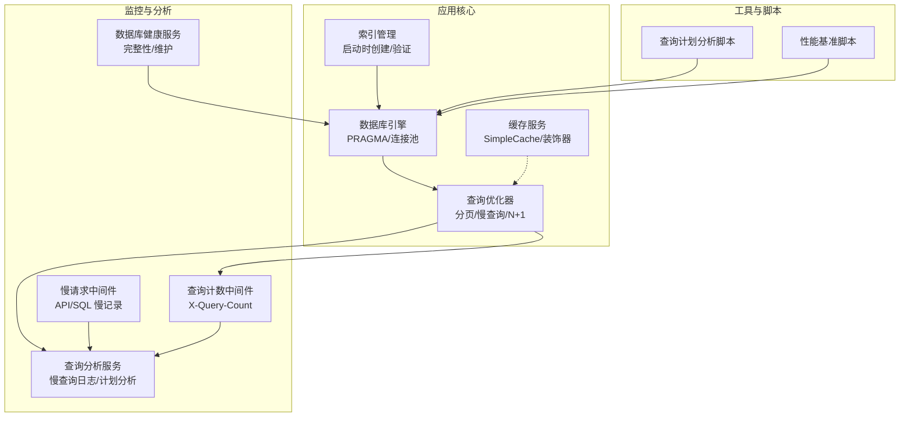

图表来源
- [backend/app/core/database.py:55-65](file://backend/app/core/database.py#L55-L65)
- [backend/app/core/query_optimizer.py:23-49](file://backend/app/core/query_optimizer.py#L23-L49)
- [backend/app/core/cache.py:14-61](file://backend/app/core/cache.py#L14-L61)
- [backend/app/core/database_indexes.py:59-95](file://backend/app/core/database_indexes.py#L59-L95)
- [backend/app/middleware/slow_request_monitor.py:55-132](file://backend/app/middleware/slow_request_monitor.py#L55-L132)
- [backend/app/middleware/query_counter.py:39-77](file://backend/app/middleware/query_counter.py#L39-L77)
- [backend/app/services/query_analyzer_service.py:17-149](file://backend/app/services/query_analyzer_service.py#L17-L149)
- [backend/app/services/database_health_service.py:16-114](file://backend/app/services/database_health_service.py#L16-L114)
- [backend/scripts/analyze_queries.py:75-131](file://backend/scripts/analyze_queries.py#L75-L131)
- [backend/scripts/performance_benchmark.py:21-43](file://backend/scripts/performance_benchmark.py#L21-L43)

章节来源
- [backend/app/core/database.py:1-187](file://backend/app/core/database.py#L1-L187)
- [backend/app/core/query_optimizer.py:1-177](file://backend/app/core/query_optimizer.py#L1-L177)
- [backend/app/core/cache.py:1-166](file://backend/app/core/cache.py#L1-L166)
- [backend/app/core/database_indexes.py:1-148](file://backend/app/core/database_indexes.py#L1-L148)
- [backend/app/middleware/slow_request_monitor.py:1-132](file://backend/app/middleware/slow_request_monitor.py#L1-L132)
- [backend/app/middleware/query_counter.py:1-88](file://backend/app/middleware/query_counter.py#L1-L88)
- [backend/app/services/query_analyzer_service.py:1-160](file://backend/app/services/query_analyzer_service.py#L1-L160)
- [backend/app/services/database_health_service.py:1-114](file://backend/app/services/database_health_service.py#L1-L114)
- [backend/scripts/analyze_queries.py:1-193](file://backend/scripts/analyze_queries.py#L1-L193)
- [backend/scripts/performance_benchmark.py:1-149](file://backend/scripts/performance_benchmark.py#L1-L149)

## 核心组件
- 数据库引擎与 PRAGMA 调优：启用 WAL、NORMAL 同步、busy_timeout、cache_size、mmap_size、临时存储内存化、自动索引、WAL 自动 checkpoint，并在连接关闭时执行 optimize。
- 写入协调器：针对长事务/大批量导入提供独占写锁，避免 SQLITE_BUSY。
- 查询优化器：分页封装、慢查询跟踪、N+1 检测（基于每请求 SQL 计数）。
- 缓存服务：线程安全内存缓存，支持 TTL、前缀删除、异步包装与装饰器。
- 索引管理：启动时校验并创建额外索引，统计信息分析。
- 监控与分析：慢请求中间件记录 API/SQL 慢调用；查询计数中间件输出 X-Query-Count；查询分析服务记录慢查询、计算百分位、分析 EXPLAIN 计划、检测 N+1。
- 健康服务：周期性完整性检查、快速检查、VACUUM 维护。
- 工具脚本：查询计划分析、索引覆盖检查、推荐索引生成；性能基准测试对比不同查询模式。

章节来源
- [backend/app/core/database.py:78-171](file://backend/app/core/database.py#L78-L171)
- [backend/app/core/database.py:198-289](file://backend/app/core/database.py#L198-L289)
- [backend/app/core/query_optimizer.py:23-177](file://backend/app/core/query_optimizer.py#L23-L177)
- [backend/app/core/cache.py:14-145](file://backend/app/core/cache.py#L14-L145)
- [backend/app/core/database_indexes.py:14-148](file://backend/app/core/database_indexes.py#L14-L148)
- [backend/app/middleware/slow_request_monitor.py:55-132](file://backend/app/middleware/slow_request_monitor.py#L55-L132)
- [backend/app/middleware/query_counter.py:39-88](file://backend/app/middleware/query_counter.py#L39-L88)
- [backend/app/services/query_analyzer_service.py:17-160](file://backend/app/services/query_analyzer_service.py#L17-L160)
- [backend/app/services/database_health_service.py:16-114](file://backend/app/services/database_health_service.py#L16-L114)
- [backend/scripts/analyze_queries.py:75-192](file://backend/scripts/analyze_queries.py#L75-L192)
- [backend/scripts/performance_benchmark.py:21-149](file://backend/scripts/performance_benchmark.py#L21-L149)

## 架构总览
下图展示从请求进入、SQL 执行到监控与优化的完整链路。

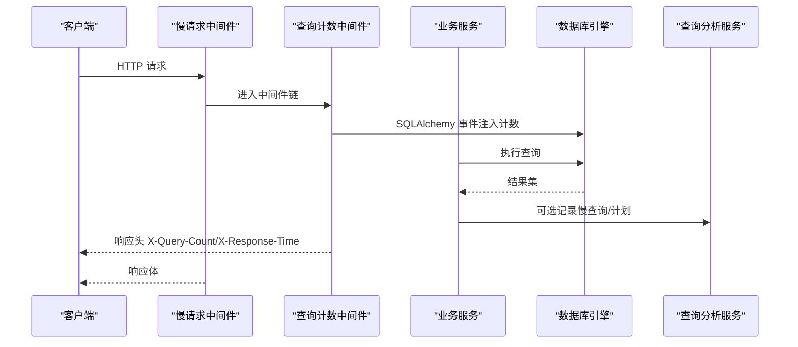

图表来源
- [backend/app/middleware/slow_request_monitor.py:103-132](file://backend/app/middleware/slow_request_monitor.py#L103-L132)
- [backend/app/middleware/query_counter.py:47-77](file://backend/app/middleware/query_counter.py#L47-L77)
- [backend/app/core/database.py:70-76](file://backend/app/core/database.py#L70-L76)
- [backend/app/services/query_analyzer_service.py:25-149](file://backend/app/services/query_analyzer_service.py#L25-L149)

## 详细组件分析

### 数据库引擎与连接池
- 连接池：使用 QueuePool，配置 pool_size、max_overflow、pool_pre_ping、pool_recycle、pool_timeout，适配 SQLite 并发场景。
- PRAGMA 调优：journal_mode=WAL、synchronous=NORMAL、busy_timeout=10000、cache_size、mmap_size、temp_store=MEMORY、automatic_index=ON、wal_autocheckpoint=1000；连接关闭时执行 PRAGMA optimize。
- 加密支持：当启用 DB_ENCRYPTION_ENABLED 时探测 SQLCipher，读取密钥文件并校验，失败则快速失败。
- 写入协调器：exclusive_write() 提供进程内互斥锁，避免长事务被 busy_timeout 截断；兼容旧 enqueue 队列。

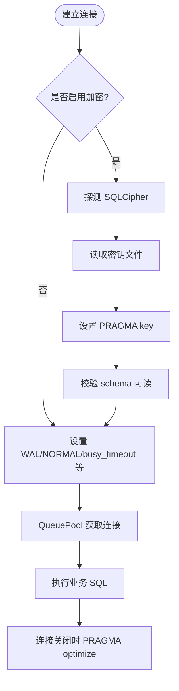

图表来源
- [backend/app/core/database.py:78-171](file://backend/app/core/database.py#L78-L171)
- [backend/app/core/database.py:55-65](file://backend/app/core/database.py#L55-L65)
- [backend/app/core/database.py:198-289](file://backend/app/core/database.py#L198-L289)

章节来源
- [backend/app/core/database.py:1-187](file://backend/app/core/database.py#L1-L187)
- [backend/app/core/database.py:198-289](file://backend/app/core/database.py#L198-L289)

### 查询优化与分页
- 分页：统一 paginate 封装，限制 page_size 上限，返回 items、total、pages。
- 慢查询跟踪：track_query 记录耗时，超过阈值告警，保留最近 500 条。
- N+1 检测：通过 per-thread 计数器与 after_cursor_execute 事件累计，超过阈值告警。

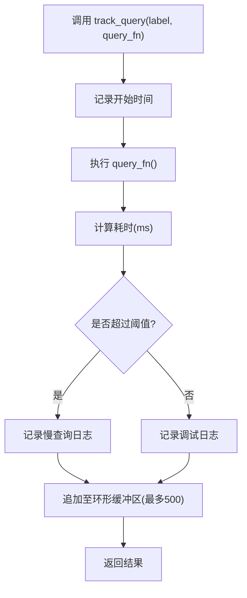

图表来源
- [backend/app/core/query_optimizer.py:62-93](file://backend/app/core/query_optimizer.py#L62-L93)
- [backend/app/core/query_optimizer.py:137-177](file://backend/app/core/query_optimizer.py#L137-L177)

章节来源
- [backend/app/core/query_optimizer.py:23-177](file://backend/app/core/query_optimizer.py#L23-L177)

### 缓存机制
- SimpleCache：线程安全字典 + 过期时间，支持 get/set/delete/delete_by_prefix/clear，LRU 淘汰。
- CacheManager：异步包装，支持 await cache.get/set。
- cached 装饰器：对同步/异步函数透明缓存，支持自定义 key_builder。

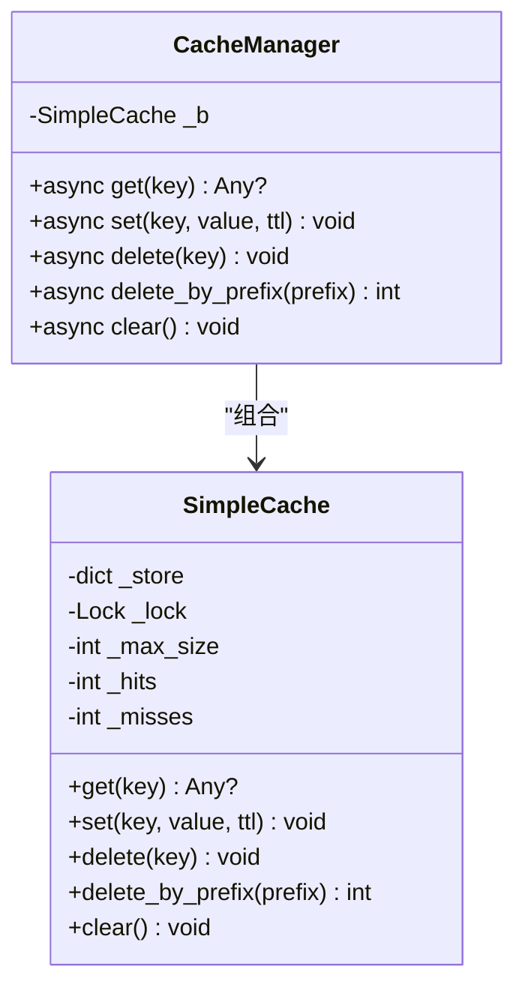

图表来源
- [backend/app/core/cache.py:14-95](file://backend/app/core/cache.py#L14-L95)
- [backend/app/core/cache.py:98-145](file://backend/app/core/cache.py#L98-L145)

章节来源
- [backend/app/core/cache.py:1-166](file://backend/app/core/cache.py#L1-L166)

### 索引设计与维护
- 运行时索引：EXTRA_INDEXES 定义常用过滤/排序列的索引，启动时 CREATE INDEX IF NOT EXISTS 幂等创建。
- 统计信息：ANALYZE 后收集各表行数，辅助评估索引效果。
- 建议索引：脚本根据高频查询生成覆盖索引建议，减少回表。

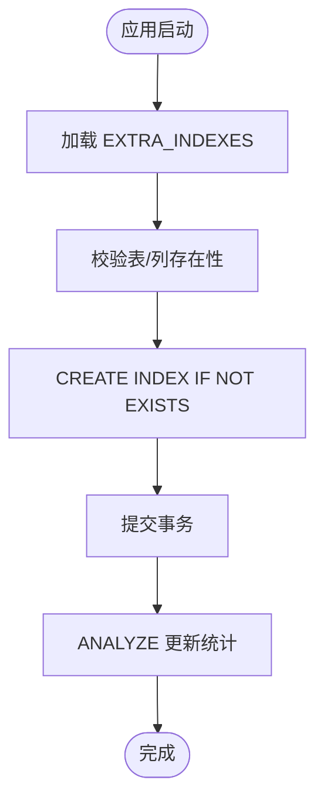

图表来源
- [backend/app/core/database_indexes.py:14-95](file://backend/app/core/database_indexes.py#L14-L95)
- [backend/app/core/database_indexes.py:121-148](file://backend/app/core/database_indexes.py#L121-L148)
- [backend/scripts/analyze_queries.py:166-185](file://backend/scripts/analyze_queries.py#L166-L185)

章节来源
- [backend/app/core/database_indexes.py:1-148](file://backend/app/core/database_indexes.py#L1-L148)
- [backend/scripts/analyze_queries.py:1-193](file://backend/scripts/analyze_queries.py#L1-L193)

### 慢查询分析与执行计划
- 慢查询日志：QueryAnalyzer.log_slow_query 记录 SQL、耗时、参数、解释计划片段，支持按最小耗时过滤与分页。
- 统计指标：平均、最大、最小、p50/p95/p99 百分位。
- N+1 检测：基于查询签名与时间窗口内的重复次数告警。
- 执行计划：SQLite 下通过 EXPLAIN QUERY PLAN 解析 SCAN/INDEX 使用情况。

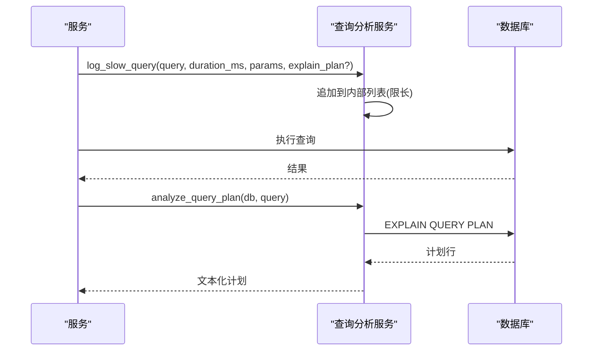

图表来源
- [backend/app/services/query_analyzer_service.py:25-149](file://backend/app/services/query_analyzer_service.py#L25-L149)

章节来源
- [backend/app/services/query_analyzer_service.py:1-160](file://backend/app/services/query_analyzer_service.py#L1-L160)

### 监控指标与中间件
- 慢请求中间件：记录慢 API 与慢 SQL，环形缓冲保存最近 200 条，提供统计摘要。
- 查询计数中间件：每个请求结束后将 SQL 数量写入响应头 X-Query-Count，超阈值告警。
- 数据库健康服务：周期性完整性检查、快速检查、VACUUM 维护，守护线程可停止。

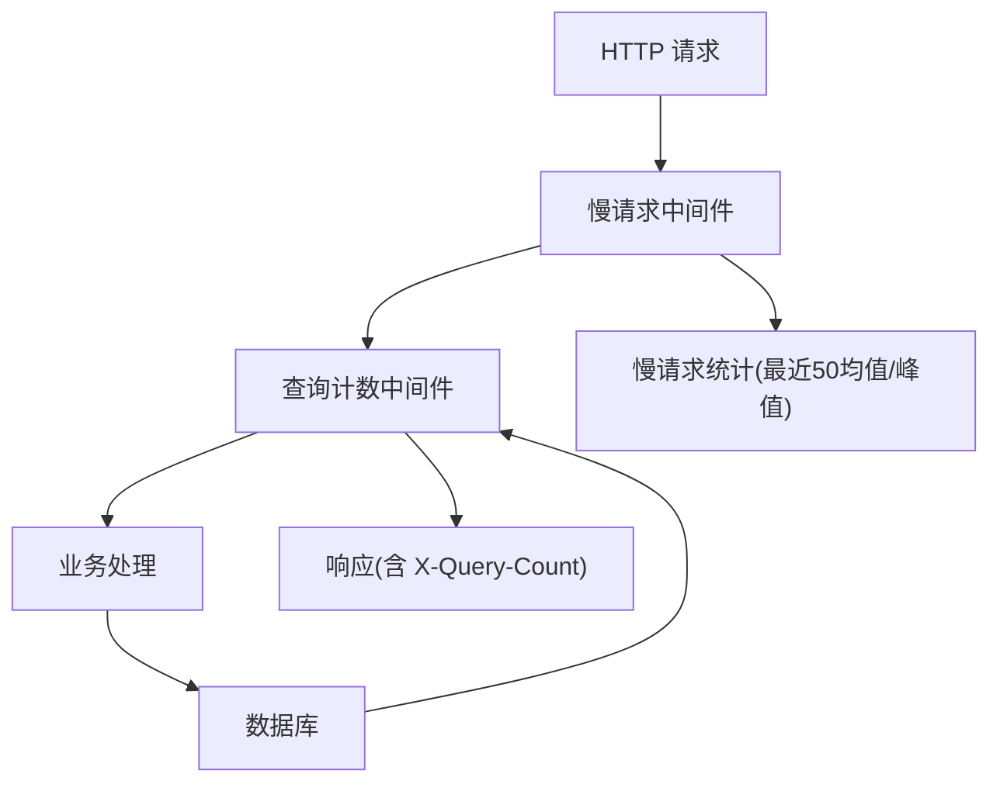

图表来源
- [backend/app/middleware/slow_request_monitor.py:55-132](file://backend/app/middleware/slow_request_monitor.py#L55-L132)
- [backend/app/middleware/query_counter.py:39-88](file://backend/app/middleware/query_counter.py#L39-L88)
- [backend/app/services/database_health_service.py:80-114](file://backend/app/services/database_health_service.py#L80-L114)

章节来源
- [backend/app/middleware/slow_request_monitor.py:1-132](file://backend/app/middleware/slow_request_monitor.py#L1-L132)
- [backend/app/middleware/query_counter.py:1-88](file://backend/app/middleware/query_counter.py#L1-L88)
- [backend/app/services/database_health_service.py:1-114](file://backend/app/services/database_health_service.py#L1-L114)

### 批量操作优化
- BatchService：批量更新/删除/导出，使用 in_ 条件批量查询避免 N+1，支持软删除与组织数据隔离。
- 安全控制：禁止敏感字段更新，保护表白名单拦截。
- 事务提交：统一 safe_commit，确保一致性。

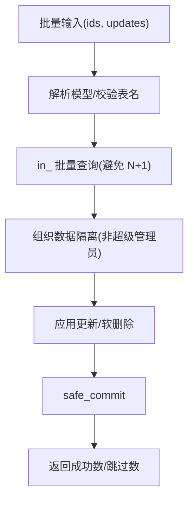

图表来源
- [backend/app/services/batch_service.py:142-204](file://backend/app/services/batch_service.py#L142-L204)

章节来源
- [backend/app/services/batch_service.py:1-244](file://backend/app/services/batch_service.py#L1-L244)

### 基准测试与容量规划
- 基准脚本：对比全表扫描、条件查询、JOIN、聚合、深分页与 Keyset 分页、年度数据查询、Dashboard 聚合等场景的平均/最小/最大耗时。
- 容量规划参考：性能需求文档定义了 CPU/内存/磁盘/网络目标与吞吐要求，结合基准结果制定扩容策略。

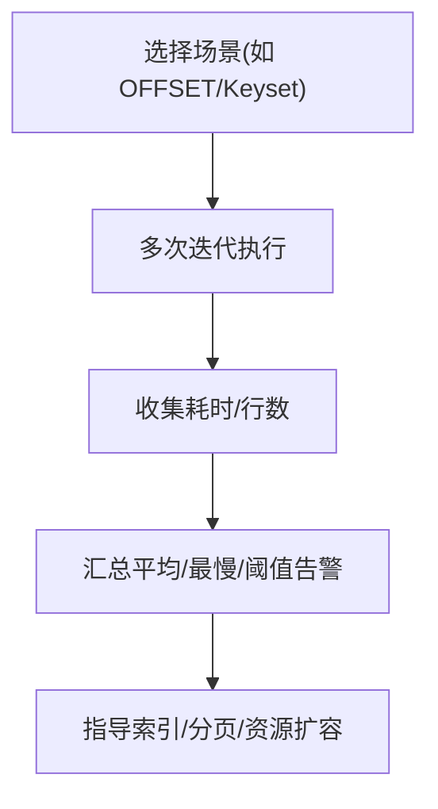

图表来源
- [backend/scripts/performance_benchmark.py:21-149](file://backend/scripts/performance_benchmark.py#L21-L149)
- [docs/03-开发文档/05-性能优化/性能需求.md:1-173](file://docs/03-开发文档/05-性能优化/性能需求.md#L1-L173)

章节来源
- [backend/scripts/performance_benchmark.py:1-149](file://backend/scripts/performance_benchmark.py#L1-L149)
- [docs/03-开发文档/05-性能优化/性能需求.md:1-173](file://docs/03-开发文档/05-性能优化/性能需求.md#L1-L173)

## 依赖关系分析
- 中间件依赖数据库引擎事件以捕获 SQL 执行前后时机。
- 查询分析服务依赖 SQLAlchemy Session 执行 EXPLAIN。
- 索引管理依赖 engine 连接执行 DDL。
- 健康服务独立运行守护线程，定期访问数据库执行维护任务。

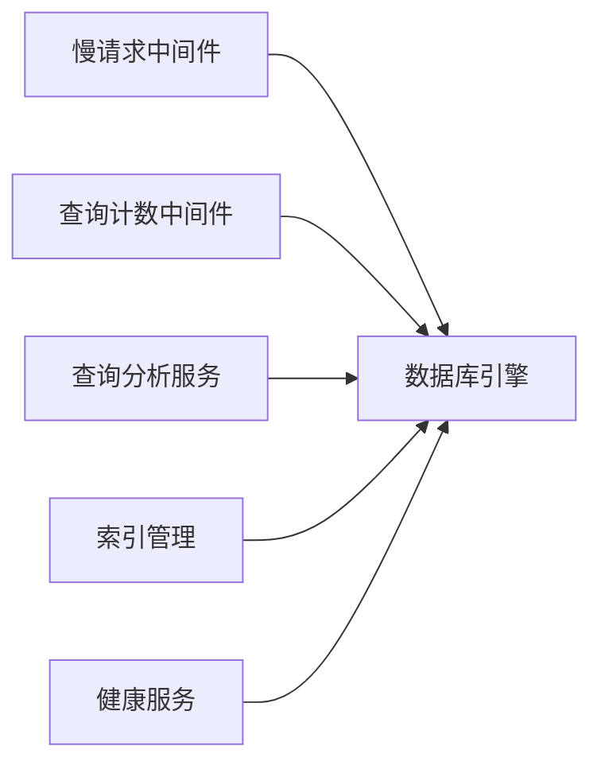

图表来源
- [backend/app/middleware/slow_request_monitor.py:70-101](file://backend/app/middleware/slow_request_monitor.py#L70-L101)
- [backend/app/middleware/query_counter.py:30-37](file://backend/app/middleware/query_counter.py#L30-L37)
- [backend/app/services/query_analyzer_service.py:130-144](file://backend/app/services/query_analyzer_service.py#L130-L144)
- [backend/app/core/database_indexes.py:73-95](file://backend/app/core/database_indexes.py#L73-L95)
- [backend/app/services/database_health_service.py:80-114](file://backend/app/services/database_health_service.py#L80-L114)

章节来源
- [backend/app/middleware/slow_request_monitor.py:1-132](file://backend/app/middleware/slow_request_monitor.py#L1-L132)
- [backend/app/middleware/query_counter.py:1-88](file://backend/app/middleware/query_counter.py#L1-L88)
- [backend/app/services/query_analyzer_service.py:1-160](file://backend/app/services/query_analyzer_service.py#L1-L160)
- [backend/app/core/database_indexes.py:1-148](file://backend/app/core/database_indexes.py#L1-L148)
- [backend/app/services/database_health_service.py:1-114](file://backend/app/services/database_health_service.py#L1-L114)

## 性能考量
- 查询优化
  - 优先使用覆盖索引与合适 WHERE/ORDER BY 列，避免全表扫描。
  - 深分页改用 Keyset 分页，降低 OFFSET 成本。
  - 聚合查询尽量利用复合索引减少回表。
- 索引设计
  - 为高频过滤/排序列建索引；外键列建议加索引以提升 JOIN 性能。
  - 启动时幂等创建索引，配合 ANALYZE 更新统计。
- 缓存机制
  - 热点读路径使用 SimpleCache，合理设置 TTL；写多读少慎用缓存。
  - 使用 cached 装饰器简化方法级缓存。
- 慢查询与执行计划
  - 通过慢请求中间件与查询分析服务定位慢 SQL；结合 EXPLAIN 识别 SCAN。
  - 关注 p95/p99 延迟，设定阈值告警。
- 连接池与批量
  - 调整 pool_size/max_overflow/recycle/timeout 匹配负载。
  - 批量更新/删除使用 in_ 条件与事务提交，避免 N+1。
- 内存与磁盘
  - 合理设置 cache_size/mmap_size；监控 WAL 文件大小与磁盘空间。
  - 定期 VACUUM 与 ANALYZE 保持统计信息新鲜。
- 监控与基准
  - 使用基准脚本对比优化前后差异；依据性能需求文档设定 KPI。
  - 健康服务周期性检查完整性与慢查询趋势。

[本节为通用指导，不直接分析具体文件]

## 故障排查指南
- 慢查询定位
  - 查看慢请求中间件的最近慢 API/SQL 记录，结合查询分析服务的慢查询列表与统计。
  - 使用 EXPLAIN QUERY PLAN 分析执行计划，识别 SCAN 与缺失索引。
- N+1 问题
  - 观察 X-Query-Count 响应头与查询计数中间件告警；使用 @analyze_n_plus_one 装饰器定位方法。
- 连接与锁争用
  - 若出现 SQLITE_BUSY，检查长事务是否使用 exclusive_write；调整 busy_timeout 与连接池参数。
- 健康与维护
  - 健康服务报告完整性错误、慢查询与锁超时；必要时触发 VACUUM。
- 基准回归
  - 运行性能基准脚本，对比历史基线，定位退化查询。

章节来源
- [backend/app/middleware/slow_request_monitor.py:32-52](file://backend/app/middleware/slow_request_monitor.py#L32-L52)
- [backend/app/middleware/query_counter.py:61-77](file://backend/app/middleware/query_counter.py#L61-L77)
- [backend/app/services/query_analyzer_service.py:49-93](file://backend/app/services/query_analyzer_service.py#L49-L93)
- [backend/app/core/database.py:141-157](file://backend/app/core/database.py#L141-L157)
- [backend/app/services/database_health_service.py:100-114](file://backend/app/services/database_health_service.py#L100-L114)
- [backend/scripts/performance_benchmark.py:123-149](file://backend/scripts/performance_benchmark.py#L123-L149)

## 结论
本项目已具备完善的数据库性能优化基础设施：SQLite 深度调优、索引管理、缓存、慢查询与 N+1 检测、健康维护与基准测试。建议在生产环境中持续采集慢查询与执行计划，结合基准脚本与性能需求文档，滚动优化查询与索引，并按需扩展连接池与缓存策略。对于更大规模场景，可考虑引入分库分表与读写分离方案，并结合监控指标进行容量规划。

[本节为总结性内容，不直接分析具体文件]

## 附录
- 关键配置与环境变量
  - SQLITE_MMAP_SIZE、SQLITE_CACHE_SIZE：控制内存映射与缓存大小。
  - DB_POOL_*：连接池相关参数。
  - DB_ENCRYPTION_ENABLED：启用 SQLCipher 加密。
- 常用命令与脚本
  - 查询计划分析：backend/scripts/analyze_queries.py
  - 性能基准：backend/scripts/performance_benchmark.py
  - 索引创建/删除：backend/app/core/database_indexes.py
- 监控指标参考
  - 慢请求阈值、WAL 文件大小、完整性检查、文件句柄/线程数、磁盘空间、API 响应时间趋势。

章节来源
- [backend/app/core/database.py:44-46](file://backend/app/core/database.py#L44-L46)
- [backend/app/core/database.py:55-65](file://backend/app/core/database.py#L55-L65)
- [backend/app/core/database.py:89-131](file://backend/app/core/database.py#L89-L131)
- [backend/scripts/analyze_queries.py:75-192](file://backend/scripts/analyze_queries.py#L75-L192)
- [backend/scripts/performance_benchmark.py:46-149](file://backend/scripts/performance_benchmark.py#L46-L149)
- [docs/test-report-gb25000.md:201-261](file://docs/test-report-gb25000.md#L201-L261)