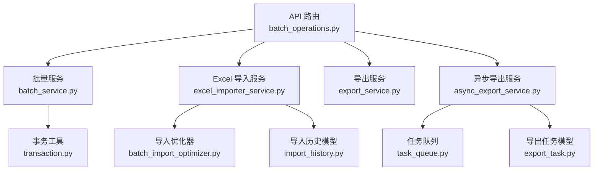
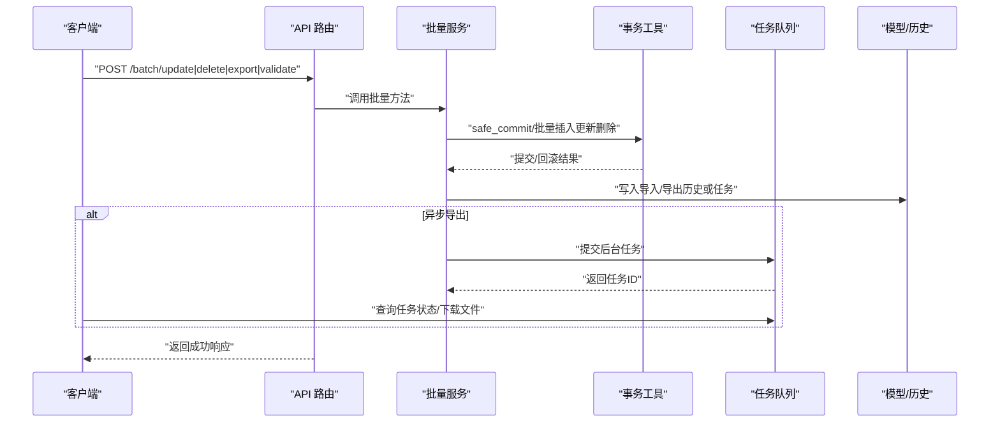
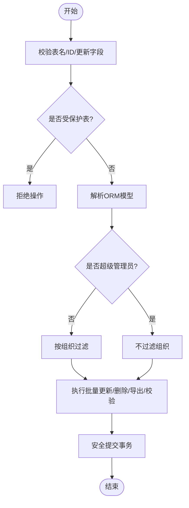
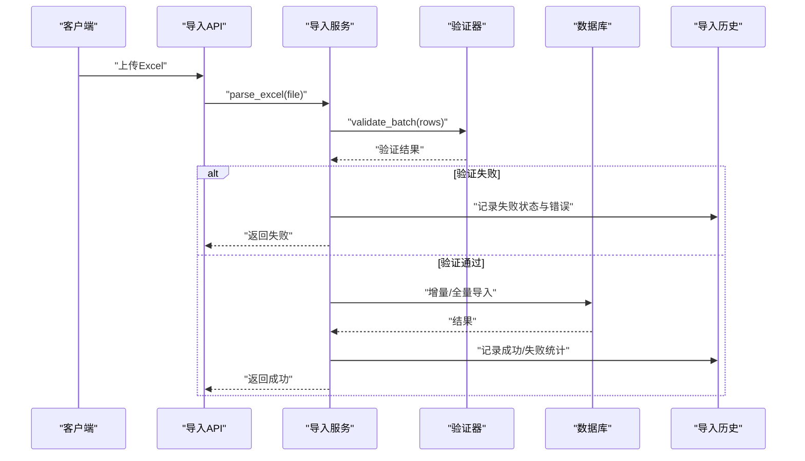
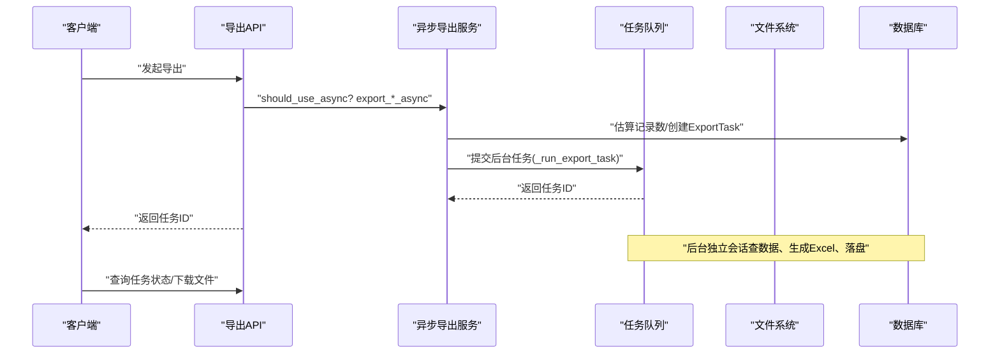
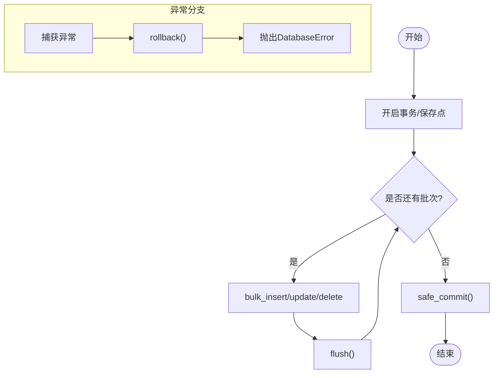
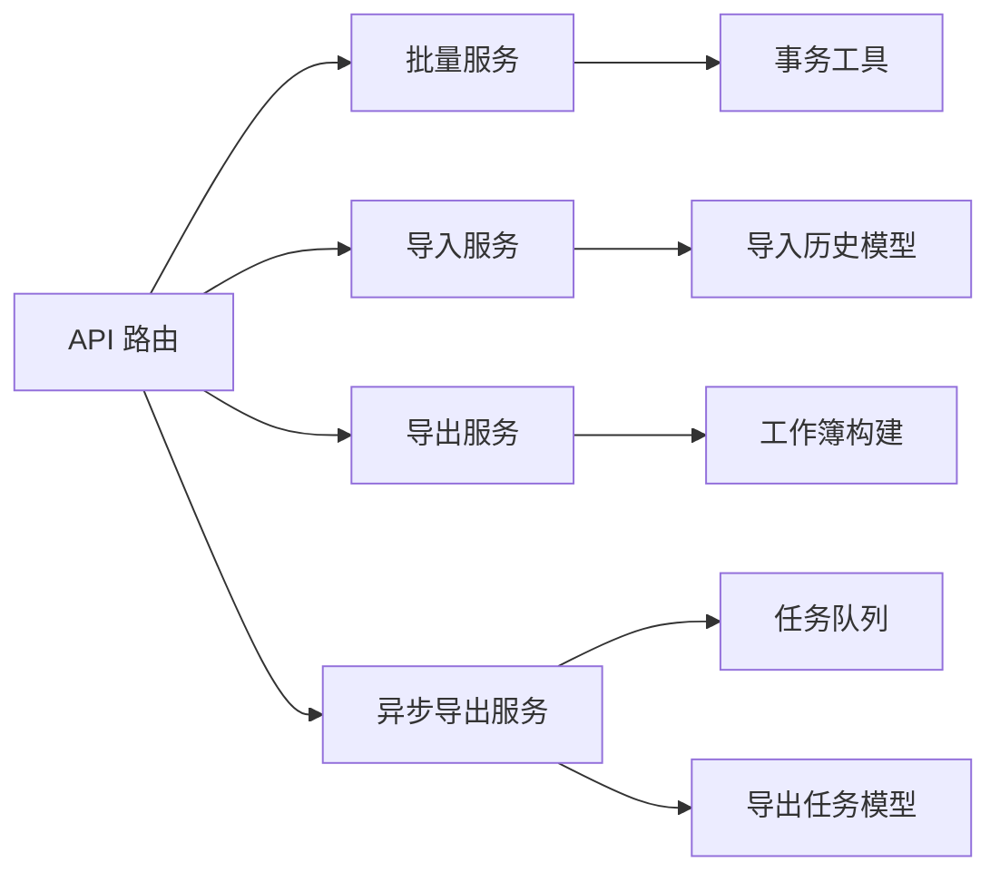

# 批量操作优化

<cite>
**本文引用的文件**
- [backend/app/api/v1/batch_operations.py](file://backend/app/api/v1/batch_operations.py)
- [backend/app/services/batch_service.py](file://backend/app/services/batch_service.py)
- [backend/app/services/batch_import_optimizer.py](file://backend/app/services/batch_import_optimizer.py)
- [backend/app/services/excel_importer_service.py](file://backend/app/services/excel_importer_service.py)
- [backend/app/services/export_service.py](file://backend/app/services/export_service.py)
- [backend/app/services/async_export_service.py](file://backend/app/services/async_export_service.py)
- [backend/app/core/transaction.py](file://backend/app/core/transaction.py)
- [backend/app/models/import_history.py](file://backend/app/models/import_history.py)
- [backend/app/models/export_task.py](file://backend/app/models/export_task.py)
- [backend/app/services/task_queue.py](file://backend/app/services/task_queue.py)
</cite>

## 目录
1. [简介](#简介)
2. [项目结构](#项目结构)
3. [核心组件](#核心组件)
4. [架构总览](#架构总览)
5. [详细组件分析](#详细组件分析)
6. [依赖关系分析](#依赖关系分析)
7. [性能考量](#性能考量)
8. [故障排查指南](#故障排查指南)
9. [结论](#结论)
10. [附录：百万级数据实操建议](#附录：百万级数据实操建议)

## 简介
本文件面向“批量操作优化”的专业文档目标，围绕批量插入、更新、删除的性能优化技术（事务边界控制、批量大小调优、内存使用优化），大数据量处理策略（分块处理、流式处理、异步批处理），以及批量导入导出优化方案（数据验证、错误处理、进度跟踪）进行系统化说明。并结合仓库中现有实现，给出百万级数据场景下的实践建议与可落地的代码路径指引。

## 项目结构
本项目在后端采用分层设计：API 路由层负责入参校验与权限控制；服务层封装业务逻辑与数据库交互；核心模块提供事务管理、任务队列等通用能力；模型层定义导入/导出历史与任务状态。批量相关的关键路径包括：
- 批量操作 API：统一入口，限制单次批量规模，过滤敏感字段，记录审计日志
- 批量服务：表名白名单、数据隔离、批量更新/删除/导出/校验
- Excel 导入：pandas 快速读取 + openpyxl 回退，增量/全量模式，导入历史追踪
- 导出服务：同步/异步导出，大文件后台生成与下载
- 事务工具：安全提交、批量插入/更新/删除、保存点与重试
- 任务队列：本地内存队列，支持优先级、进度、取消

**图表来源**
- [backend/app/api/v1/batch_operations.py:1-259](file://backend/app/api/v1/batch_operations.py#L1-L259)
- [backend/app/services/batch_service.py:1-244](file://backend/app/services/batch_service.py#L1-L244)
- [backend/app/services/excel_importer_service.py:1-800](file://backend/app/services/excel_importer_service.py#L1-L800)
- [backend/app/services/export_service.py:1-190](file://backend/app/services/export_service.py#L1-L190)
- [backend/app/services/async_export_service.py:1-516](file://backend/app/services/async_export_service.py#L1-L516)
- [backend/app/services/batch_import_optimizer.py:1-73](file://backend/app/services/batch_import_optimizer.py#L1-L73)
- [backend/app/core/transaction.py:1-457](file://backend/app/core/transaction.py#L1-L457)
- [backend/app/models/import_history.py:1-107](file://backend/app/models/import_history.py#L1-L107)
- [backend/app/models/export_task.py:1-121](file://backend/app/models/export_task.py#L1-L121)
- [backend/app/services/task_queue.py:1-307](file://backend/app/services/task_queue.py#L1-L307)

**章节来源**
- [backend/app/api/v1/batch_operations.py:1-259](file://backend/app/api/v1/batch_operations.py#L1-L259)
- [backend/app/services/batch_service.py:1-244](file://backend/app/services/batch_service.py#L1-L244)
- [backend/app/services/excel_importer_service.py:1-800](file://backend/app/services/excel_importer_service.py#L1-L800)
- [backend/app/services/export_service.py:1-190](file://backend/app/services/export_service.py#L1-L190)
- [backend/app/services/async_export_service.py:1-516](file://backend/app/services/async_export_service.py#L1-L516)
- [backend/app/services/batch_import_optimizer.py:1-73](file://backend/app/services/batch_import_optimizer.py#L1-L73)
- [backend/app/core/transaction.py:1-457](file://backend/app/core/transaction.py#L1-L457)
- [backend/app/models/import_history.py:1-107](file://backend/app/models/import_history.py#L1-L107)
- [backend/app/models/export_task.py:1-121](file://backend/app/models/export_task.py#L1-L121)
- [backend/app/services/task_queue.py:1-307](file://backend/app/services/task_queue.py#L1-L307)

## 核心组件
- 批量操作 API：对表名、ID 列表、更新字段进行严格校验，限制单次批量规模，避免敏感字段被批量修改，并写入审计日志。
- 批量服务：维护表名白名单与保护表，解析 ORM 模型，执行批量更新/删除/导出/校验，支持数据隔离（组织维度）。
- Excel 导入服务：优先 pandas 快速读取，自动探测表头，支持增量/全量模式，导入失败时回滚并记录错误详情。
- 导出服务：构建工作簿、样式化输出、多 sheet 综合报表；异步导出通过任务队列后台执行，持久化文件并更新任务状态。
- 事务工具：提供 safe_commit、批量插入/更新/删除、保存点、死锁重试等能力，确保大批量操作的原子性与一致性。
- 任务队列：本地内存队列，支持优先级调度、进度追踪、任务取消，为异步导出提供执行环境。

**章节来源**
- [backend/app/api/v1/batch_operations.py:23-119](file://backend/app/api/v1/batch_operations.py#L23-L119)
- [backend/app/services/batch_service.py:8-80](file://backend/app/services/batch_service.py#L8-L80)
- [backend/app/services/excel_importer_service.py:91-166](file://backend/app/services/excel_importer_service.py#L91-L166)
- [backend/app/services/export_service.py:10-186](file://backend/app/services/export_service.py#L10-L186)
- [backend/app/services/async_export_service.py:330-387](file://backend/app/services/async_export_service.py#L330-L387)
- [backend/app/core/transaction.py:365-457](file://backend/app/core/transaction.py#L365-L457)
- [backend/app/services/task_queue.py:124-288](file://backend/app/services/task_queue.py#L124-L288)

## 架构总览
批量操作的整体流程如下：
- 请求进入 API 路由，完成鉴权与参数校验
- 路由调用服务层执行具体批量逻辑（更新/删除/导出/校验）
- 导入/导出涉及文件解析、数据验证、批量写入/生成
- 事务工具保障数据一致性与异常回滚
- 异步导出通过任务队列后台执行，完成后落盘并提供下载

**图表来源**
- [backend/app/api/v1/batch_operations.py:121-245](file://backend/app/api/v1/batch_operations.py#L121-L245)
- [backend/app/services/batch_service.py:138-239](file://backend/app/services/batch_service.py#L138-L239)
- [backend/app/core/transaction.py:200-234](file://backend/app/core/transaction.py#L200-L234)
- [backend/app/services/async_export_service.py:454-481](file://backend/app/services/async_export_service.py#L454-L481)
- [backend/app/services/task_queue.py:158-188](file://backend/app/services/task_queue.py#L158-L188)
- [backend/app/models/import_history.py:33-107](file://backend/app/models/import_history.py#L33-L107)
- [backend/app/models/export_task.py:28-121](file://backend/app/models/export_task.py#L28-L121)

## 详细组件分析

### 批量更新/删除/导出/校验（BatchService）
- 表名白名单与保护表：防止越权访问与提权通道
- 数据隔离：非超级管理员仅能操作所属组织数据
- 批量查询替代逐条 GET：避免 N+1 问题
- 软删除策略：优先 is_active/is_deleted，否则物理删除
- 导出：当前为简化实现，可扩展为真实数据导出

**图表来源**
- [backend/app/services/batch_service.py:104-113](file://backend/app/services/batch_service.py#L104-L113)
- [backend/app/services/batch_service.py:142-204](file://backend/app/services/batch_service.py#L142-L204)
- [backend/app/services/batch_service.py:206-239](file://backend/app/services/batch_service.py#L206-L239)

**章节来源**
- [backend/app/services/batch_service.py:8-80](file://backend/app/services/batch_service.py#L8-L80)
- [backend/app/services/batch_service.py:138-239](file://backend/app/services/batch_service.py#L138-L239)

### Excel 导入服务（ExcelImporterService）
- 解析：优先 pandas 快速读取，openpyxl 回退；自动探测表头行，兼容官方模板装饰标题区
- 验证：数据校验与重复检查，失败即中止并记录错误详情
- 模式：增量导入跳过已存在记录；全量覆盖先清空再导入
- 历史：创建 ImportHistory 记录，记录总行数、成功/失败行数、错误详情

**图表来源**
- [backend/app/services/excel_importer_service.py:114-166](file://backend/app/services/excel_importer_service.py#L114-L166)
- [backend/app/services/excel_importer_service.py:223-343](file://backend/app/services/excel_importer_service.py#L223-L343)
- [backend/app/models/import_history.py:33-107](file://backend/app/models/import_history.py#L33-L107)

**章节来源**
- [backend/app/services/excel_importer_service.py:91-166](file://backend/app/services/excel_importer_service.py#L91-L166)
- [backend/app/services/excel_importer_service.py:223-343](file://backend/app/services/excel_importer_service.py#L223-L343)
- [backend/app/models/import_history.py:33-107](file://backend/app/models/import_history.py#L33-L107)

### 异步导出服务（AsyncExportService）
- 阈值判断：超过阈值则走异步导出，避免阻塞请求
- 真实查库：按实体类型与筛选条件查询数据，生成对应工作簿
- 后台执行：通过任务队列在工作线程中生成文件、落盘、更新任务状态
- 进度追踪：任务状态从 pending → processing → completed/failed，支持过期时间

**图表来源**
- [backend/app/services/async_export_service.py:390-481](file://backend/app/services/async_export_service.py#L390-L481)
- [backend/app/services/async_export_service.py:330-387](file://backend/app/services/async_export_service.py#L330-L387)
- [backend/app/models/export_task.py:28-121](file://backend/app/models/export_task.py#L28-L121)
- [backend/app/services/task_queue.py:158-188](file://backend/app/services/task_queue.py#L158-L188)

**章节来源**
- [backend/app/services/async_export_service.py:330-387](file://backend/app/services/async_export_service.py#L330-L387)
- [backend/app/services/async_export_service.py:390-481](file://backend/app/services/async_export_service.py#L390-L481)
- [backend/app/models/export_task.py:28-121](file://backend/app/models/export_task.py#L28-L121)

### 事务与批量工具（TransactionManager & BatchOperation）
- safe_commit：提交失败自动回滚并记录日志，保证会话不处于脏状态
- 批量插入/更新/删除：分批次 bulk 操作，每批 flush，最终 commit
- 保存点与嵌套事务：支持局部回滚与复杂事务编排
- 死锁重试：对锁定冲突进行有限次重试

**图表来源**
- [backend/app/core/transaction.py:200-234](file://backend/app/core/transaction.py#L200-L234)
- [backend/app/core/transaction.py:365-457](file://backend/app/core/transaction.py#L365-L457)
- [backend/app/core/transaction.py:143-189](file://backend/app/core/transaction.py#L143-L189)
- [backend/app/core/transaction.py:322-362](file://backend/app/core/transaction.py#L322-L362)

**章节来源**
- [backend/app/core/transaction.py:200-234](file://backend/app/core/transaction.py#L200-L234)
- [backend/app/core/transaction.py:365-457](file://backend/app/core/transaction.py#L365-L457)

## 依赖关系分析
- API 路由依赖批量服务与权限工具，负责入参校验与审计日志
- 批量服务依赖事务工具与 ORM 模型，执行批量更新/删除/导出/校验
- 导入服务依赖验证器与导入历史模型，记录导入过程与结果
- 异步导出服务依赖任务队列与导出任务模型，后台生成文件并更新状态
- 导出服务提供 Excel 构建能力，供同步与异步导出复用

**图表来源**
- [backend/app/api/v1/batch_operations.py:1-259](file://backend/app/api/v1/batch_operations.py#L1-L259)
- [backend/app/services/batch_service.py:1-244](file://backend/app/services/batch_service.py#L1-L244)
- [backend/app/services/excel_importer_service.py:1-800](file://backend/app/services/excel_importer_service.py#L1-L800)
- [backend/app/services/export_service.py:1-190](file://backend/app/services/export_service.py#L1-L190)
- [backend/app/services/async_export_service.py:1-516](file://backend/app/services/async_export_service.py#L1-L516)
- [backend/app/core/transaction.py:1-457](file://backend/app/core/transaction.py#L1-L457)
- [backend/app/models/import_history.py:1-107](file://backend/app/models/import_history.py#L1-L107)
- [backend/app/models/export_task.py:1-121](file://backend/app/models/export_task.py#L1-L121)
- [backend/app/services/task_queue.py:1-307](file://backend/app/services/task_queue.py#L1-L307)

**章节来源**
- [backend/app/api/v1/batch_operations.py:1-259](file://backend/app/api/v1/batch_operations.py#L1-L259)
- [backend/app/services/batch_service.py:1-244](file://backend/app/services/batch_service.py#L1-L244)
- [backend/app/services/excel_importer_service.py:1-800](file://backend/app/services/excel_importer_service.py#L1-L800)
- [backend/app/services/export_service.py:1-190](file://backend/app/services/export_service.py#L1-L190)
- [backend/app/services/async_export_service.py:1-516](file://backend/app/services/async_export_service.py#L1-L516)
- [backend/app/core/transaction.py:1-457](file://backend/app/core/transaction.py#L1-L457)
- [backend/app/models/import_history.py:1-107](file://backend/app/models/import_history.py#L1-L107)
- [backend/app/models/export_task.py:1-121](file://backend/app/models/export_task.py#L1-L121)
- [backend/app/services/task_queue.py:1-307](file://backend/app/services/task_queue.py#L1-L307)

## 性能考量
- 事务边界控制
  - 使用 safe_commit 包裹批量提交，确保失败回滚与日志记录
  - 对大批量操作采用分批次 flush，降低内存占用
  - 必要时使用保存点实现局部回滚，提高容错性
- 批量大小调优
  - 批量插入/更新/删除默认批次大小可配置（如 500/1000），根据数据库与硬件调整
  - API 层限制单次批量 ID 数量（如 1000/5000），防止超大请求导致超时或内存溢出
- 内存使用优化
  - 导入阶段优先 pandas 快速读取，减少对象创建开销
  - 导出阶段按实体类型分页/限制最大记录数（如 MAX_EXPORT_ROWS），避免一次性加载全部数据
  - 异步导出将耗时操作移出请求线程，降低主线程压力
- 大数据量处理策略
  - 分块处理：导入/导出均按批次处理，逐步 flush/commit
  - 流式处理：读取 Excel 时采用迭代器模式，避免整表驻留内存
  - 异步批处理：超过阈值的导出走异步任务队列，后台生成文件并落盘
- 索引与查询优化
  - 导入/导出查询按需添加过滤条件，避免全表扫描
  - 导入历史与导出任务表建立必要索引，提升查询效率

[本节为通用性能指导，不直接分析具体文件]

## 故障排查指南
- 导入失败
  - 检查导入历史记录的 status 与 error_details，定位具体行与字段错误
  - 确认数据校验规则与重复检测逻辑是否符合预期
- 导出不可用
  - 检查异步导出任务状态是否为 completed，是否存在过期或未落盘
  - 确认任务队列是否启动，worker 是否正常执行
- 批量更新/删除失败
  - 查看事务提交是否触发 rollback，检查数据库错误日志
  - 确认表名白名单与保护表限制，避免非法操作
- 内存溢出
  - 调整批量大小与最大导出记录数
  - 启用异步导出，避免同步阻塞与内存峰值过高

**章节来源**
- [backend/app/models/import_history.py:33-107](file://backend/app/models/import_history.py#L33-L107)
- [backend/app/models/export_task.py:28-121](file://backend/app/models/export_task.py#L28-L121)
- [backend/app/services/async_export_service.py:330-387](file://backend/app/services/async_export_service.py#L330-L387)
- [backend/app/core/transaction.py:200-234](file://backend/app/core/transaction.py#L200-L234)

## 结论
本项目在批量操作方面提供了完善的基础设施：API 层严格校验与权限控制，服务层实现批量更新/删除/导出/校验，导入服务支持快速读取与增量/全量模式，导出服务支持同步与异步导出，事务工具保障数据一致性与异常回滚，任务队列支撑后台处理与进度追踪。结合分块处理、流式处理与异步批处理策略，可有效应对百万级数据的批量操作需求，避免内存溢出与性能瓶颈。

[本节为总结性内容，不直接分析具体文件]

## 附录：百万级数据实操建议
- 批量插入
  - 使用批量插入工具，设置合理批次大小（如 500-1000），每批 flush，最终 commit
  - 参考路径：[批量插入实现:365-399](file://backend/app/core/transaction.py#L365-L399)
- 批量更新
  - 使用批量更新映射，避免逐条查询与更新，减少 N+1 问题
  - 参考路径：[批量更新实现:400-428](file://backend/app/core/transaction.py#L400-L428)
- 批量删除
  - 使用 in 条件批量删除，避免逐条删除带来的性能损耗
  - 参考路径：[批量删除实现:429-457](file://backend/app/core/transaction.py#L429-L457)
- 导入优化
  - 优先 pandas 快速读取，openpyxl 回退；自动探测表头，跳过示例行
  - 增量导入预加载已存在名称集合，避免重复插入
  - 参考路径：[导入服务解析与导入逻辑:114-166](file://backend/app/services/excel_importer_service.py#L114-L166), [导入主流程:223-343](file://backend/app/services/excel_importer_service.py#L223-L343)
- 导出优化
  - 超过阈值走异步导出，后台生成文件并落盘，支持进度查询与下载
  - 限制最大导出记录数，避免一次性加载全部数据
  - 参考路径：[异步导出服务:390-481](file://backend/app/services/async_export_service.py#L390-L481), [导出服务:10-186](file://backend/app/services/export_service.py#L10-L186)
- 事务与回滚
  - 使用 safe_commit 确保提交失败回滚，记录日志
  - 使用保存点实现局部回滚，提高容错性
  - 参考路径：[安全提交:200-234](file://backend/app/core/transaction.py#L200-L234), [保存点:143-189](file://backend/app/core/transaction.py#L143-L189)
- 进度跟踪
  - 导入历史与导出任务模型记录状态与错误详情，便于前端展示与运维排查
  - 参考路径：[导入历史模型:33-107](file://backend/app/models/import_history.py#L33-L107), [导出任务模型:28-121](file://backend/app/models/export_task.py#L28-L121)

[本节为实操建议，引用具体文件路径作为代码片段指引]