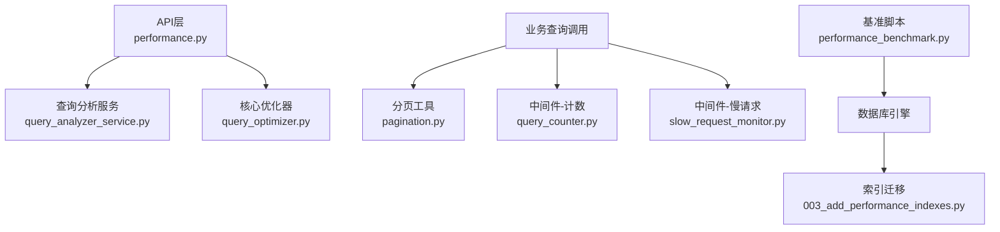
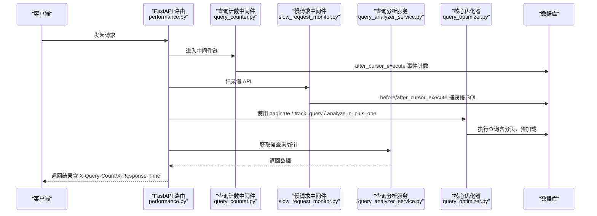
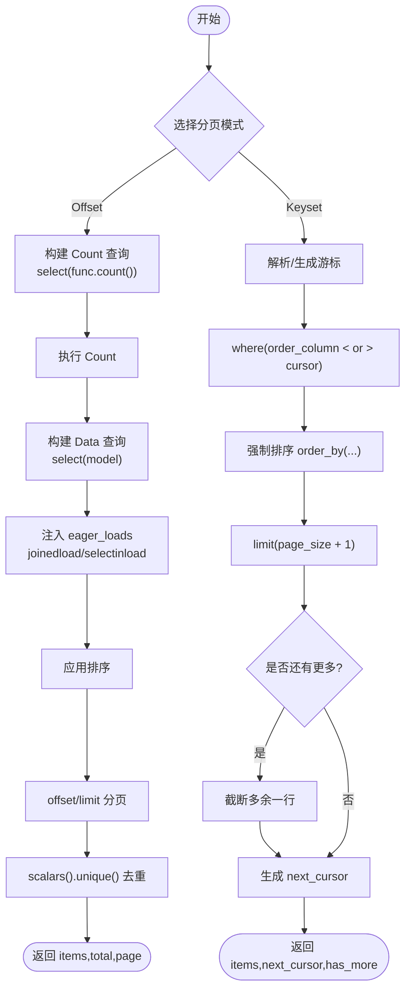
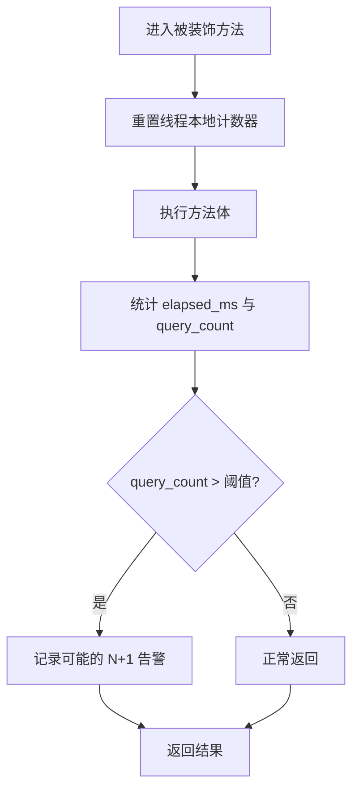
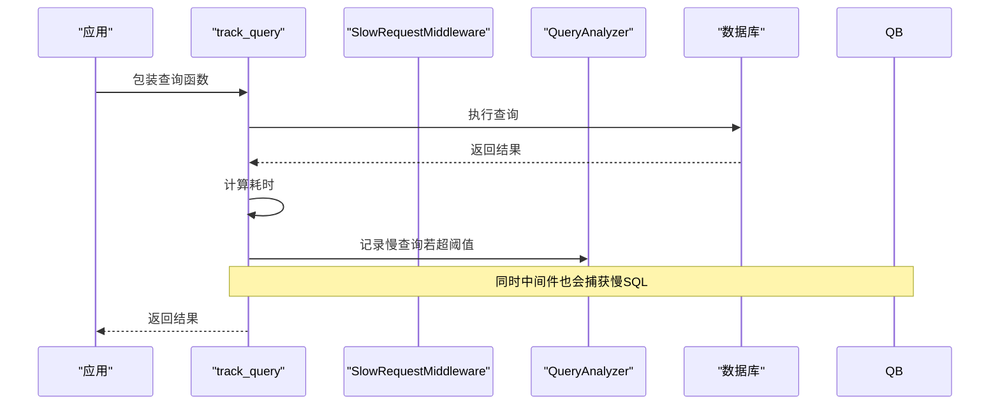
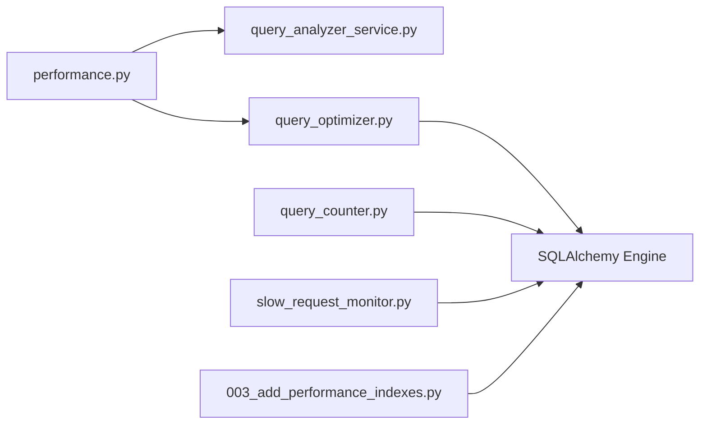

# 查询优化技术

<cite>
**本文引用的文件**
- [backend/app/core/query_optimizer.py](file://backend/app/core/query_optimizer.py)
- [backend/app/utils/pagination.py](file://backend/app/utils/pagination.py)
- [backend/app/services/query_analyzer_service.py](file://backend/app/services/query_analyzer_service.py)
- [backend/app/middleware/query_counter.py](file://backend/app/middleware/query_counter.py)
- [backend/app/middleware/slow_request_monitor.py](file://backend/app/middleware/slow_request_monitor.py)
- [backend/app/api/v1/performance.py](file://backend/app/api/v1/performance.py)
- [backend/scripts/performance_benchmark.py](file://backend/scripts/performance_benchmark.py)
- [backend/alembic/versions/003_add_performance_indexes.py](file://backend/alembic/versions/003_add_performance_indexes.py)
- [backend/tests/unit/test_pagination_utils.py](file://backend/tests/unit/test_pagination_utils.py)
- [backend/tests/unit/test_coverage_gap_batch1.py](file://backend/tests/unit/test_coverage_gap_batch1.py)
- [backend/tests/unit/test_performance_api.py](file://backend/tests/unit/test_performance_api.py)
</cite>

## 目录
1. [简介](#简介)
2. [项目结构](#项目结构)
3. [核心组件](#核心组件)
4. [架构总览](#架构总览)
5. [详细组件分析](#详细组件分析)
6. [依赖关系分析](#依赖关系分析)
7. [性能考量](#性能考量)
8. [故障排查指南](#故障排查指南)
9. [结论](#结论)
10. [附录](#附录)

## 简介
本文件面向后端开发者与运维人员，系统化阐述本项目中基于 SQLAlchemy 的查询优化实践与监控体系。内容覆盖：
- 分页查询优化（Offset 与 Keyset）
- 懒加载与预加载策略（joinedload/selectinload）
- N+1 查询问题的检测与治理
- 慢查询监控机制（执行时间统计、阈值配置、日志记录）
- 查询分析工具（计数器、基准测试、查询计划解读）
- 实际高效查询范式与常见陷阱规避

## 项目结构
围绕“查询优化”的相关代码主要分布在以下模块：
- 核心优化与监控：core/query_optimizer.py
- 分页工具：utils/pagination.py
- 查询分析服务：services/query_analyzer_service.py
- 中间件：middleware/query_counter.py、middleware/slow_request_monitor.py
- 性能 API：api/v1/performance.py
- 基准脚本：scripts/performance_benchmark.py
- 索引迁移：alembic/versions/003_add_performance_indexes.py
- 单元测试：tests/unit/*（验证分页、N+1 检测、性能 API 行为）

图表来源
- [backend/app/api/v1/performance.py:1-118](file://backend/app/api/v1/performance.py#L1-L118)
- [backend/app/services/query_analyzer_service.py:1-160](file://backend/app/services/query_analyzer_service.py#L1-L160)
- [backend/app/core/query_optimizer.py:1-177](file://backend/app/core/query_optimizer.py#L1-L177)
- [backend/app/utils/pagination.py:1-227](file://backend/app/utils/pagination.py#L1-L227)
- [backend/app/middleware/query_counter.py:1-88](file://backend/app/middleware/query_counter.py#L1-L88)
- [backend/app/middleware/slow_request_monitor.py:1-132](file://backend/app/middleware/slow_request_monitor.py#L1-L132)
- [backend/alembic/versions/003_add_performance_indexes.py:1-119](file://backend/alembic/versions/003_add_performance_indexes.py#L1-L119)
- [backend/scripts/performance_benchmark.py:1-149](file://backend/scripts/performance_benchmark.py#L1-L149)

章节来源
- [backend/app/api/v1/performance.py:1-118](file://backend/app/api/v1/performance.py#L1-L118)
- [backend/app/core/query_optimizer.py:1-177](file://backend/app/core/query_optimizer.py#L1-L177)
- [backend/app/utils/pagination.py:1-227](file://backend/app/utils/pagination.py#L1-L227)
- [backend/app/services/query_analyzer_service.py:1-160](file://backend/app/services/query_analyzer_service.py#L1-L160)
- [backend/app/middleware/query_counter.py:1-88](file://backend/app/middleware/query_counter.py#L1-L88)
- [backend/app/middleware/slow_request_monitor.py:1-132](file://backend/app/middleware/slow_request_monitor.py#L1-L132)
- [backend/alembic/versions/003_add_performance_indexes.py:1-119](file://backend/alembic/versions/003_add_performance_indexes.py#L1-L119)
- [backend/scripts/performance_benchmark.py:1-149](file://backend/scripts/performance_benchmark.py#L1-L149)

## 核心组件
- 分页工具（SQLAlchemy 2.0）
  - keyset_paginate：基于游标的高性能分页，适合大数据量与无限滚动场景，避免 OFFSET 深分页退化。
  - paginate_query：传统 Offset 分页，分离 Count 与 Data 查询，支持 eager_loads 注入与 unique() 去重，解决 joinedload 导致的重复行问题。
- 查询优化器
  - paginate：对 ORM Query 的分页封装，提供安全页大小与总页数计算。
  - track_query：以装饰器或包装函数形式统计单次查询耗时，超过阈值记录慢查询并维护最近 500 条。
  - analyze_n_plus_one：通过线程本地计数器统计方法内 SQL 次数，超阈告警潜在 N+1。
- 查询分析服务
  - QueryAnalyzer：慢查询日志、N+1 检测（基于相似查询签名与时间窗口）、查询计划分析（SQLite EXPLAIN QUERY PLAN）。
- 中间件
  - QueryCounterMiddleware：基于 after_cursor_execute 事件统计每请求 SQL 数量，写入响应头 X-Query-Count，超阈值告警。
  - SlowRequestMiddleware：ASGI 层记录慢 API；通过 SQLAlchemy before/after_cursor_execute 捕获慢 SQL 并落盘环形缓冲。
- 性能 API
  - /performance/slow-queries、/performance/query-stats、/performance/cache-*：管理员权限接口，暴露慢查询与统计信息。
- 基准脚本
  - performance_benchmark.py：对比不同查询模式（全表、条件、JOIN、聚合、OFFSET vs Keyset）的性能，并与配置阈值比对。

章节来源
- [backend/app/utils/pagination.py:1-227](file://backend/app/utils/pagination.py#L1-L227)
- [backend/app/core/query_optimizer.py:1-177](file://backend/app/core/query_optimizer.py#L1-L177)
- [backend/app/services/query_analyzer_service.py:1-160](file://backend/app/services/query_analyzer_service.py#L1-L160)
- [backend/app/middleware/query_counter.py:1-88](file://backend/app/middleware/query_counter.py#L1-L88)
- [backend/app/middleware/slow_request_monitor.py:1-132](file://backend/app/middleware/slow_request_monitor.py#L1-L132)
- [backend/app/api/v1/performance.py:1-118](file://backend/app/api/v1/performance.py#L1-L118)
- [backend/scripts/performance_benchmark.py:1-149](file://backend/scripts/performance_benchmark.py#L1-L149)

## 架构总览
下图展示了从请求进入、查询构建、执行到监控与可视化的完整链路。

图表来源
- [backend/app/middleware/query_counter.py:1-88](file://backend/app/middleware/query_counter.py#L1-L88)
- [backend/app/middleware/slow_request_monitor.py:1-132](file://backend/app/middleware/slow_request_monitor.py#L1-L132)
- [backend/app/core/query_optimizer.py:1-177](file://backend/app/core/query_optimizer.py#L1-L177)
- [backend/app/services/query_analyzer_service.py:1-160](file://backend/app/services/query_analyzer_service.py#L1-L160)
- [backend/app/api/v1/performance.py:1-118](file://backend/app/api/v1/performance.py#L1-L118)

## 详细组件分析

### 分页查询优化（Offset 与 Keyset）
- Offset 分页（paginate_query）
  - 将 Count 与 Data 查询分离，避免 eager_loads 影响 count 性能。
  - 在 Data 查询中注入 joinedload/selectinload，并使用 scalars().unique() 去重，防止笛卡尔积导致的数据重复。
  - 支持 filters、order_by、max_page_size 等参数，保证边界安全。
- Keyset 分页（keyset_paginate）
  - 基于游标的范围过滤（where order_column < cursor_value），始终利用索引进行 O(log N + page_size) 查找。
  - 可选 calculate_total=False 以跳过 Count 查询，适用于无限滚动列表。
  - 自动处理下一页游标生成与 has_more 判断。

图表来源
- [backend/app/utils/pagination.py:62-154](file://backend/app/utils/pagination.py#L62-L154)
- [backend/app/utils/pagination.py:161-227](file://backend/app/utils/pagination.py#L161-L227)

章节来源
- [backend/app/utils/pagination.py:1-227](file://backend/app/utils/pagination.py#L1-L227)
- [backend/tests/unit/test_pagination_utils.py:289-330](file://backend/tests/unit/test_pagination_utils.py#L289-L330)
- [backend/tests/unit/test_utils_full_coverage.py:134-163](file://backend/tests/unit/test_utils_full_coverage.py#L134-L163)

### 懒加载与预加载策略
- 推荐做法
  - 列表页：优先使用 selectinload 批量加载关联对象，减少 N+1。
  - 详情页：按需使用 joinedload 提升单条读取性能。
  - 在 paginate_query 中统一注入 eager_loads，确保 Count 不受影响。
- 注意事项
  - joinedload 可能导致多表 JOIN 产生重复行，需配合 unique() 去重。
  - 大字段或图片附件建议延迟加载或单独接口获取，避免主查询膨胀。

章节来源
- [backend/app/utils/pagination.py:193-219](file://backend/app/utils/pagination.py#L193-L219)

### N+1 查询问题的检测与解决
- 检测手段
  - analyze_n_plus_one：装饰器统计方法内 SQL 次数，超过阈值告警。
  - QueryCounterMiddleware：每个请求结束后汇总 SQL 次数，超阈值告警并写入响应头。
  - QueryAnalyzer.detect_n_plus_one：基于查询签名与时间窗口识别短时间内重复执行相似查询。
- 解决思路
  - 使用 selectinload/joinedload 预加载关联。
  - 拆分复杂查询为多次简单查询后在内存组装。
  - 使用 Keyset 分页替代深层 OFFSET。

图表来源
- [backend/app/core/query_optimizer.py:137-177](file://backend/app/core/query_optimizer.py#L137-L177)
- [backend/app/middleware/query_counter.py:39-77](file://backend/app/middleware/query_counter.py#L39-L77)
- [backend/app/services/query_analyzer_service.py:95-128](file://backend/app/services/query_analyzer_service.py#L95-L128)

章节来源
- [backend/app/core/query_optimizer.py:111-177](file://backend/app/core/query_optimizer.py#L111-L177)
- [backend/app/middleware/query_counter.py:1-88](file://backend/app/middleware/query_counter.py#L1-L88)
- [backend/app/services/query_analyzer_service.py:95-128](file://backend/app/services/query_analyzer_service.py#L95-L128)
- [backend/tests/unit/test_coverage_gap_batch1.py:1004-1048](file://backend/tests/unit/test_coverage_gap_batch1.py#L1004-L1048)

### 慢查询监控机制
- 实现原理
  - track_query：测量单次查询耗时，超过阈值记录慢查询并维护最近 500 条。
  - SlowRequestMiddleware：通过 SQLAlchemy before/after_cursor_execute 捕获慢 SQL，按阈值记录到环形缓冲。
  - QueryAnalyzer：集中存储慢查询、计算百分位统计、清理过期缓存。
- 阈值配置
  - 全局默认阈值：200ms（可覆盖）。
  - 中间件阈值：慢 API 500ms、慢 SQL 200ms（可配置）。
- 日志与可视化
  - 警告日志输出关键信息（耗时、SQL片段、参数前若干字符）。
  - 通过 /performance/slow-queries 与 /performance/query-stats 暴露数据。

图表来源
- [backend/app/core/query_optimizer.py:52-108](file://backend/app/core/query_optimizer.py#L52-L108)
- [backend/app/middleware/slow_request_monitor.py:55-132](file://backend/app/middleware/slow_request_monitor.py#L55-L132)
- [backend/app/services/query_analyzer_service.py:25-82](file://backend/app/services/query_analyzer_service.py#L25-L82)

章节来源
- [backend/app/core/query_optimizer.py:52-108](file://backend/app/core/query_optimizer.py#L52-L108)
- [backend/app/middleware/slow_request_monitor.py:1-132](file://backend/app/middleware/slow_request_monitor.py#L1-L132)
- [backend/app/services/query_analyzer_service.py:1-160](file://backend/app/services/query_analyzer_service.py#L1-L160)
- [backend/app/api/v1/performance.py:19-77](file://backend/app/api/v1/performance.py#L19-L77)

### 查询分析工具使用方法
- 查询计数器
  - 自动：QueryCounterMiddleware 在每个请求结束时统计 SQL 次数，写入 X-Query-Count。
  - 手动：analyze_n_plus_one 装饰器用于定位具体方法的 N+1 风险。
- 性能基准测试
  - 运行 backend/scripts/performance_benchmark.py 对比不同查询模式，输出平均/最小/最大耗时与行数，并与配置阈值比较。
- 查询计划解读
  - QueryAnalyzer.analyze_query_plan：针对 SQLite 使用 EXPLAIN QUERY PLAN 输出扫描/连接方式，辅助定位缺失索引或低效计划。

章节来源
- [backend/app/middleware/query_counter.py:1-88](file://backend/app/middleware/query_counter.py#L1-L88)
- [backend/app/core/query_optimizer.py:137-177](file://backend/app/core/query_optimizer.py#L137-L177)
- [backend/scripts/performance_benchmark.py:1-149](file://backend/scripts/performance_benchmark.py#L1-L149)
- [backend/app/services/query_analyzer_service.py:130-144](file://backend/app/services/query_analyzer_service.py#L130-L144)

### 高效查询示例与最佳实践
- 列表页分页
  - 使用 paginate_query，传入 filters、eager_loads、order_by，确保 Count 与 Data 分离且去重。
  - 大数据量或无限滚动优先使用 keyset_paginate，关闭 calculate_total 以提升吞吐。
- 预加载策略
  - 列表页使用 selectinload 批量加载关联；详情页使用 joinedload 减少往返。
  - 注意 joinedload 可能产生重复行，务必使用 scalars().unique()。
- 避免常见陷阱
  - 避免在循环中访问未预加载的关联对象（触发 N+1）。
  - 避免无索引列的排序与过滤；必要时添加合适索引。
  - 避免在大结果集上使用 deep OFFSET；改用 Keyset。
- 索引优化
  - 参考 alembic 迁移中的常用索引（如用户、村庄、项目、资金、审计日志、消息、年度数据等），结合查询热点补充复合索引。

章节来源
- [backend/app/utils/pagination.py:62-227](file://backend/app/utils/pagination.py#L62-L227)
- [backend/alembic/versions/003_add_performance_indexes.py:18-71](file://backend/alembic/versions/003_add_performance_indexes.py#L18-L71)

## 依赖关系分析
- 组件耦合
  - API 层依赖 QueryAnalyzer 暴露慢查询与统计。
  - 中间件通过 SQLAlchemy 事件钩子与引擎交互，解耦于业务逻辑。
  - 分页工具与核心优化器相互独立，便于在不同场景复用。
- 外部依赖
  - SQLAlchemy 事件（before/after_cursor_execute）用于无侵入监控。
  - SQLite 的 PRAGMA/EXPLAIN 能力用于健康检查与计划分析。
- 循环依赖
  - 当前未发现直接循环依赖；各模块职责清晰。

图表来源
- [backend/app/api/v1/performance.py:1-118](file://backend/app/api/v1/performance.py#L1-L118)
- [backend/app/services/query_analyzer_service.py:1-160](file://backend/app/services/query_analyzer_service.py#L1-L160)
- [backend/app/core/query_optimizer.py:1-177](file://backend/app/core/query_optimizer.py#L1-L177)
- [backend/app/middleware/query_counter.py:1-88](file://backend/app/middleware/query_counter.py#L1-L88)
- [backend/app/middleware/slow_request_monitor.py:1-132](file://backend/app/middleware/slow_request_monitor.py#L1-L132)
- [backend/alembic/versions/003_add_performance_indexes.py:1-119](file://backend/alembic/versions/003_add_performance_indexes.py#L1-L119)

章节来源
- [backend/app/api/v1/performance.py:1-118](file://backend/app/api/v1/performance.py#L1-L118)
- [backend/app/services/query_analyzer_service.py:1-160](file://backend/app/services/query_analyzer_service.py#L1-L160)
- [backend/app/core/query_optimizer.py:1-177](file://backend/app/core/query_optimizer.py#L1-L177)
- [backend/app/middleware/query_counter.py:1-88](file://backend/app/middleware/query_counter.py#L1-L88)
- [backend/app/middleware/slow_request_monitor.py:1-132](file://backend/app/middleware/slow_request_monitor.py#L1-L132)
- [backend/alembic/versions/003_add_performance_indexes.py:1-119](file://backend/alembic/versions/003_add_performance_indexes.py#L1-L119)

## 性能考量
- 分页选择
  - 小数据集/后台管理：Offset 分页更直观。
  - 大数据集/无限滚动：Keyset 分页稳定高效。
- 预加载粒度
  - 仅加载必要字段与关联，避免冗余数据传输。
- 索引设计
  - 高频过滤/排序列建立索引；复合索引匹配查询谓词顺序。
- 监控与基线
  - 使用基准脚本建立性能基线，持续回归评估变更影响。
- 资源保护
  - 限制 max_page_size，防止恶意大页请求。
  - 慢查询环形缓冲限制长度，避免内存增长。

[本节为通用指导，不直接分析具体文件]

## 故障排查指南
- 现象：某接口响应缓慢
  - 查看响应头 X-Query-Count 与 X-Response-Time，确认是否 SQL 过多或整体耗时高。
  - 通过 /performance/slow-queries 筛选 min_duration_ms，定位最慢查询。
  - 使用 QueryAnalyzer.analyze_query_plan 分析执行计划，检查是否存在全表扫描或缺失索引。
- 现象：N+1 告警频繁
  - 使用 @analyze_n_plus_one 装饰目标方法，观察 query_count 与耗时。
  - 在分页查询中注入合适的 eager_loads，或使用 selectinload 批量加载。
- 现象：分页数据重复
  - 检查是否在 joinedload 后使用了 scalars().unique() 去重。
- 现象：慢查询过多
  - 调整慢查询阈值（track_query 的 threshold_ms、中间件的 slow_sql_ms/slow_api_ms）。
  - 审查索引与查询条件，必要时增加复合索引。

章节来源
- [backend/app/middleware/query_counter.py:39-77](file://backend/app/middleware/query_counter.py#L39-L77)
- [backend/app/api/v1/performance.py:19-77](file://backend/app/api/v1/performance.py#L19-L77)
- [backend/app/services/query_analyzer_service.py:25-82](file://backend/app/services/query_analyzer_service.py#L25-L82)
- [backend/app/core/query_optimizer.py:62-108](file://backend/app/core/query_optimizer.py#L62-L108)
- [backend/tests/unit/test_performance_api.py:66-173](file://backend/tests/unit/test_performance_api.py#L66-L173)

## 结论
本项目构建了完整的查询优化与监控闭环：以分页工具与预加载策略为基础，结合中间件与核心优化器的无侵入监控，辅以查询分析服务与性能 API 提供可视化诊断，并通过基准脚本与索引迁移保障长期性能。遵循本文的最佳实践，可有效降低 N+1 风险、提升列表与复杂查询吞吐，并在生产环境中快速定位与治理慢查询。

## 附录
- 常用命令
  - 运行基准测试：python backend/scripts/performance_benchmark.py [--iterations N]
  - 查看慢查询：GET /api/v1/performance/slow-queries?limit=100&min_duration_ms=200
  - 查看统计：GET /api/v1/performance/query-stats
- 关键配置项
  - 慢查询阈值：track_query 默认 200ms；中间件默认慢 API 500ms、慢 SQL 200ms。
  - 分页上限：max_page_size 建议根据业务设定（默认 200）。
- 相关测试
  - 分页功能与边界用例：test_pagination_utils.py、test_utils_full_coverage.py
  - N+1 检测与统计：test_coverage_gap_batch1.py
  - 性能 API 行为：test_performance_api.py

章节来源
- [backend/scripts/performance_benchmark.py:1-149](file://backend/scripts/performance_benchmark.py#L1-L149)
- [backend/app/api/v1/performance.py:19-77](file://backend/app/api/v1/performance.py#L19-L77)
- [backend/tests/unit/test_pagination_utils.py:289-330](file://backend/tests/unit/test_pagination_utils.py#L289-L330)
- [backend/tests/unit/test_utils_full_coverage.py:134-163](file://backend/tests/unit/test_utils_full_coverage.py#L134-L163)
- [backend/tests/unit/test_coverage_gap_batch1.py:942-1048](file://backend/tests/unit/test_coverage_gap_batch1.py#L942-L1048)
- [backend/tests/unit/test_performance_api.py:66-173](file://backend/tests/unit/test_performance_api.py#L66-L173)