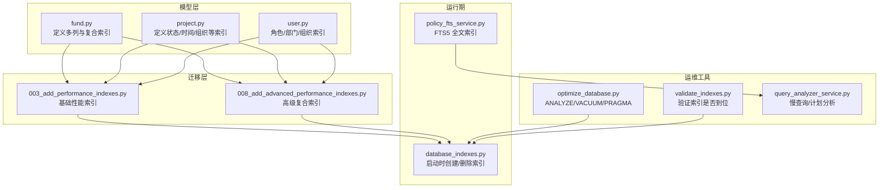
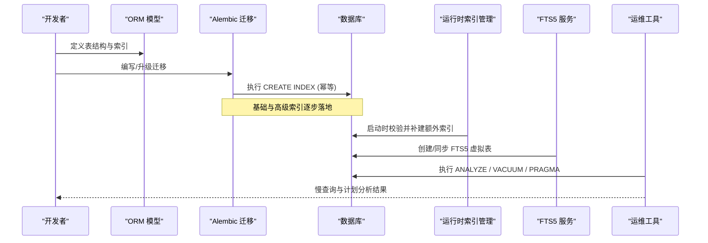
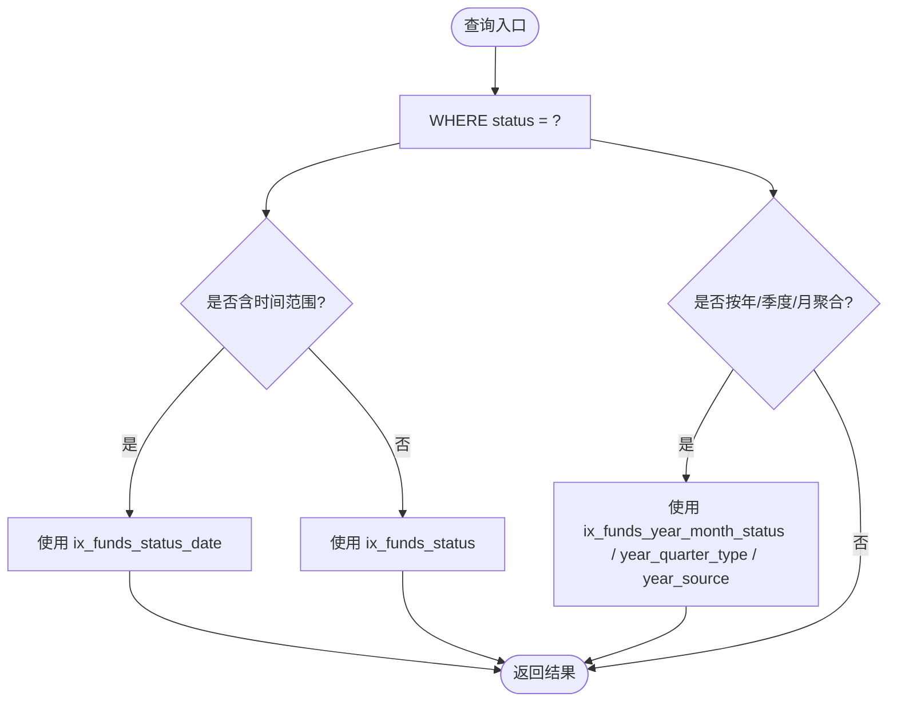
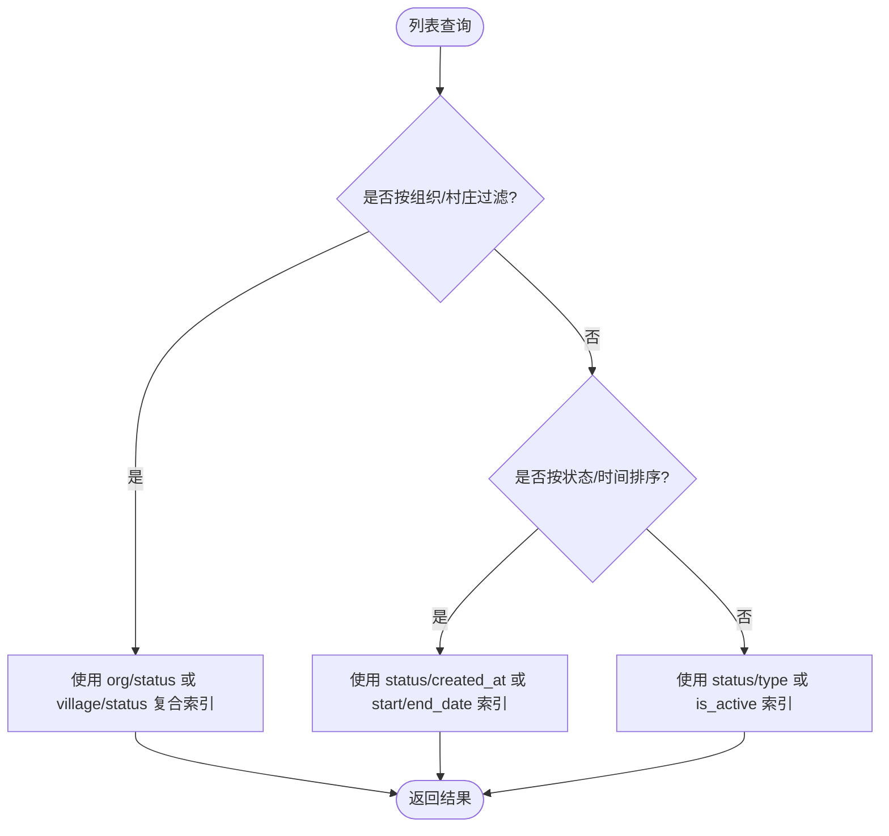
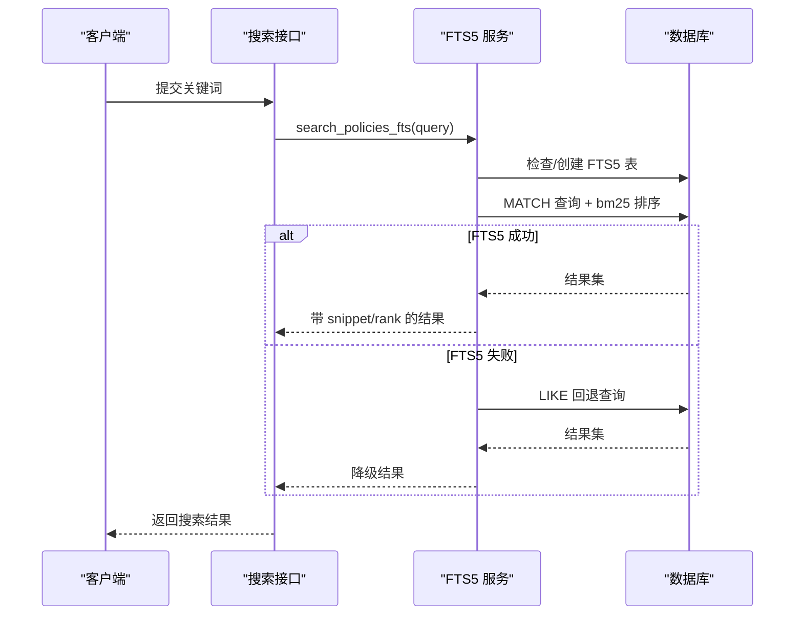
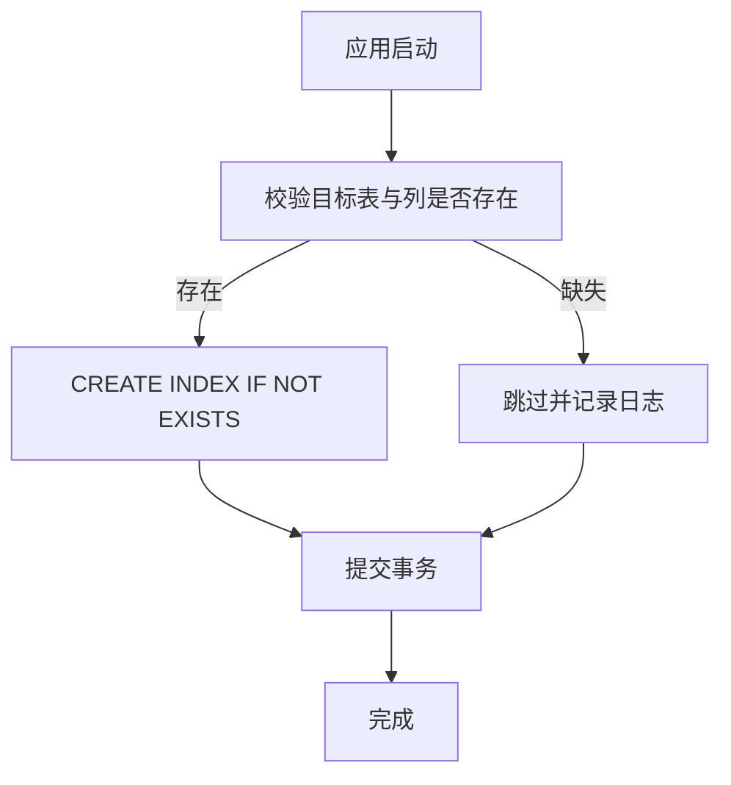
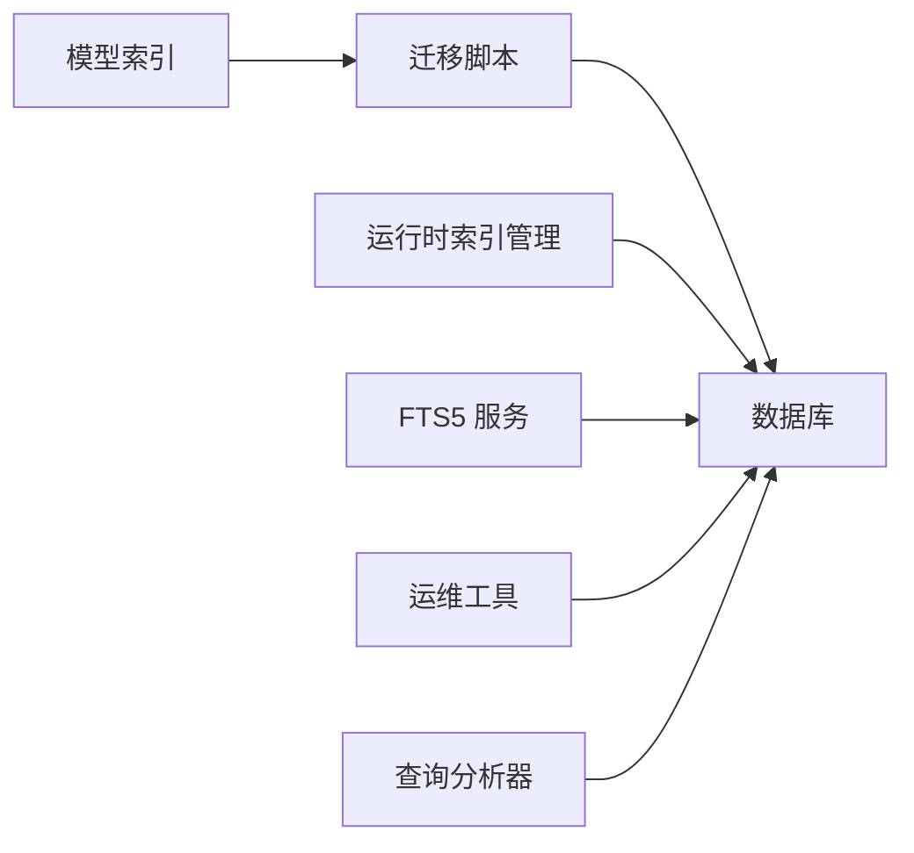

# 索引设计策略

<cite>
**本文引用的文件**
- [backend/app/core/database_indexes.py](file://backend/app/core/database_indexes.py)
- [backend/alembic/versions/003_add_performance_indexes.py](file://backend/alembic/versions/003_add_performance_indexes.py)
- [backend/alembic/versions/008_add_advanced_performance_indexes.py](file://backend/alembic/versions/008_add_advanced_performance_indexes.py)
- [backend/scripts/validate_indexes.py](file://backend/scripts/validate_indexes.py)
- [backend/app/models/fund.py](file://backend/app/models/fund.py)
- [backend/app/models/project.py](file://backend/app/models/project.py)
- [backend/app/models/user.py](file://backend/app/models/user.py)
- [backend/app/services/policy_fts_service.py](file://backend/app/services/policy_fts_service.py)
- [backend/scripts/optimize_database.py](file://backend/scripts/optimize_database.py)
- [backend/app/services/query_analyzer_service.py](file://backend/app/services/query_analyzer_service.py)
</cite>

## 目录
1. [引言](#引言)
2. [项目结构](#项目结构)
3. [核心组件](#核心组件)
4. [架构总览](#架构总览)
5. [详细组件分析](#详细组件分析)
6. [依赖关系分析](#依赖关系分析)
7. [性能考量](#性能考量)
8. [故障排查指南](#故障排查指南)
9. [结论](#结论)
10. [附录](#附录)

## 引言
本文件面向数据库索引设计与优化，结合本项目实际代码与迁移脚本，系统阐述：
- 索引类型选择原则（B-tree、哈希、全文）及适用场景
- 复合索引设计模式（前缀匹配、覆盖索引、选择性）的优化效果
- 索引维护策略（重建、统计分析、空间回收）
- 基于具体表结构的索引设计方案，并展示如何优化常见查询模式
- 索引对插入/更新性能的影响与平衡策略

## 项目结构
本项目在模型层通过 SQLAlchemy 的 Index 声明单列与复合索引；在 Alembic 迁移中集中添加历史与高级性能索引；在运行时通过启动脚本补建额外索引；并提供全文检索 FTS5 能力与数据库优化脚本。

**图表来源**
- [backend/app/models/fund.py:66-86](file://backend/app/models/fund.py#L66-L86)
- [backend/app/models/project.py:52-68](file://backend/app/models/project.py#L52-L68)
- [backend/app/models/user.py:31-35](file://backend/app/models/user.py#L31-L35)
- [backend/alembic/versions/003_add_performance_indexes.py:18-71](file://backend/alembic/versions/003_add_performance_indexes.py#L18-L71)
- [backend/alembic/versions/008_add_advanced_performance_indexes.py:34-76](file://backend/alembic/versions/008_add_advanced_performance_indexes.py#L34-L76)
- [backend/app/core/database_indexes.py:14-46](file://backend/app/core/database_indexes.py#L14-L46)
- [backend/app/services/policy_fts_service.py:17-35](file://backend/app/services/policy_fts_service.py#L17-L35)
- [backend/scripts/optimize_database.py:40-102](file://backend/scripts/optimize_database.py#L40-L102)
- [backend/scripts/validate_indexes.py:16-110](file://backend/scripts/validate_indexes.py#L16-L110)
- [backend/app/services/query_analyzer_service.py:130-144](file://backend/app/services/query_analyzer_service.py#L130-L144)

**章节来源**
- [backend/app/models/fund.py:66-86](file://backend/app/models/fund.py#L66-L86)
- [backend/app/models/project.py:52-68](file://backend/app/models/project.py#L52-L68)
- [backend/app/models/user.py:31-35](file://backend/app/models/user.py#L31-L35)
- [backend/alembic/versions/003_add_performance_indexes.py:18-71](file://backend/alembic/versions/003_add_performance_indexes.py#L18-L71)
- [backend/alembic/versions/008_add_advanced_performance_indexes.py:34-76](file://backend/alembic/versions/008_add_advanced_performance_indexes.py#L34-L76)
- [backend/app/core/database_indexes.py:14-46](file://backend/app/core/database_indexes.py#L14-L46)
- [backend/app/services/policy_fts_service.py:17-35](file://backend/app/services/policy_fts_service.py#L17-L35)
- [backend/scripts/optimize_database.py:40-102](file://backend/scripts/optimize_database.py#L40-L102)
- [backend/scripts/validate_indexes.py:16-110](file://backend/scripts/validate_indexes.py#L16-L110)
- [backend/app/services/query_analyzer_service.py:130-144](file://backend/app/services/query_analyzer_service.py#L130-L144)

## 核心组件
- 模型索引声明：在 ORM 模型的 __table_args__ 中集中声明单列与复合索引，贴合业务过滤与排序需求。
- 迁移索引管理：通过 Alembic 版本化地添加基础与高级索引，具备幂等性与回滚能力。
- 运行时索引补建：应用启动时校验并创建“额外运行时索引”，确保关键列有索引可用。
- 全文检索：使用 SQLite FTS5 虚拟表实现政策全文搜索，支持 BM25 排序与片段高亮，失败自动降级为 LIKE。
- 数据库优化：提供 ANALYZE、VACUUM 与 PRAGMA 配置，提升统计准确性与 I/O 性能。
- 查询分析：记录慢查询、检测 N+1、输出 EXPLAIN QUERY PLAN，辅助定位索引缺失或不当。

**章节来源**
- [backend/app/models/fund.py:66-86](file://backend/app/models/fund.py#L66-L86)
- [backend/alembic/versions/003_add_performance_indexes.py:18-71](file://backend/alembic/versions/003_add_performance_indexes.py#L18-L71)
- [backend/alembic/versions/008_add_advanced_performance_indexes.py:34-76](file://backend/alembic/versions/008_add_advanced_performance_indexes.py#L34-L76)
- [backend/app/core/database_indexes.py:59-95](file://backend/app/core/database_indexes.py#L59-L95)
- [backend/app/services/policy_fts_service.py:39-107](file://backend/app/services/policy_fts_service.py#L39-L107)
- [backend/scripts/optimize_database.py:40-102](file://backend/scripts/optimize_database.py#L40-L102)
- [backend/app/services/query_analyzer_service.py:17-149](file://backend/app/services/query_analyzer_service.py#L17-L149)

## 架构总览
下图展示了从模型到迁移、再到运行期索引管理与全文检索的整体流程，以及运维工具的介入点。

**图表来源**
- [backend/app/models/fund.py:66-86](file://backend/app/models/fund.py#L66-L86)
- [backend/alembic/versions/003_add_performance_indexes.py:18-71](file://backend/alembic/versions/003_add_performance_indexes.py#L18-L71)
- [backend/alembic/versions/008_add_advanced_performance_indexes.py:34-76](file://backend/alembic/versions/008_add_advanced_performance_indexes.py#L34-L76)
- [backend/app/core/database_indexes.py:59-95](file://backend/app/core/database_indexes.py#L59-L95)
- [backend/app/services/policy_fts_service.py:17-35](file://backend/app/services/policy_fts_service.py#L17-L35)
- [backend/scripts/optimize_database.py:40-102](file://backend/scripts/optimize_database.py#L40-L102)

## 详细组件分析

### 组件A：经费表（funds）索引设计
- 单列索引：status、fund_type、fund_source、project_id、village_id、date、is_active，支撑按状态/类型/来源/关联实体/时间的快速过滤。
- 复合索引：
  - project_id + status：按项目筛选后按状态过滤
  - village_id + status：按帮扶村筛选后按状态过滤
  - status + date：按状态与时间范围过滤/排序
  - status + fund_type：按状态与细分类别聚合
  - year_month + status、year_quarter + fund_type、year + fund_source：大屏统计“杀手级”索引，直接命中 GROUP BY 聚合
- 冗余字段：year、year_month、year_quarter 用于替代函数计算，使 GROUP BY 走索引，避免全表扫描。

**图表来源**
- [backend/app/models/fund.py:66-86](file://backend/app/models/fund.py#L66-L86)
- [backend/app/models/fund.py:156-160](file://backend/app/models/fund.py#L156-L160)

**章节来源**
- [backend/app/models/fund.py:66-86](file://backend/app/models/fund.py#L66-L86)
- [backend/app/models/fund.py:156-160](file://backend/app/models/fund.py#L156-L160)

### 组件B：项目表（projects）索引设计
- 单列索引：status、type、village_id、organization_id、created_by、start_date、end_date、is_active，覆盖状态筛选、时间范围、组织/村庄维度。
- 复合索引：
  - status + type：按类型与状态组合过滤
  - status + created_at：按状态与时间排序
  - village_id + status：村庄级别项目过滤
  - organization_id + status：组织数据权限过滤
  - status + village_id：与 village_id + status 互补，适配不同前缀匹配
- 迁移补充：高级索引 idx_projects_village_status_date、idx_projects_org_status 进一步优化列表与统计查询。

**图表来源**
- [backend/app/models/project.py:52-68](file://backend/app/models/project.py#L52-L68)
- [backend/alembic/versions/008_add_advanced_performance_indexes.py:41-44](file://backend/alembic/versions/008_add_advanced_performance_indexes.py#L41-L44)

**章节来源**
- [backend/app/models/project.py:52-68](file://backend/app/models/project.py#L52-L68)
- [backend/alembic/versions/008_add_advanced_performance_indexes.py:41-44](file://backend/alembic/versions/008_add_advanced_performance_indexes.py#L41-L44)

### 组件C：用户表（users）索引设计
- 单列索引：username、email、department、organization_id，支撑登录、邮箱查找、部门/组织筛选。
- 复合索引：role + is_active、role + department、organization_id + role，用于权限检查与组织内用户列表。
- 迁移补充：idx_users_org_role、idx_users_active_role 进一步提升权限与活跃用户查询效率。

**章节来源**
- [backend/app/models/user.py:31-35](file://backend/app/models/user.py#L31-L35)
- [backend/alembic/versions/008_add_advanced_performance_indexes.py:55-57](file://backend/alembic/versions/008_add_advanced_performance_indexes.py#L55-L57)

### 组件D：全文检索（FTS5）
- 使用 SQLite FTS5 虚拟表 policies_fts，字段包含标题、内容、摘要、关键词，tokenize=unicode61。
- 搜索流程：优先 FTS5 匹配并按 BM25 排序，失败自动降级为 LIKE 模糊匹配。
- 同步机制：新增/更新/删除政策时同步至 FTS 表，保证一致性。

**图表来源**
- [backend/app/services/policy_fts_service.py:17-35](file://backend/app/services/policy_fts_service.py#L17-L35)
- [backend/app/services/policy_fts_service.py:39-107](file://backend/app/services/policy_fts_service.py#L39-L107)
- [backend/app/services/policy_fts_service.py:110-142](file://backend/app/services/policy_fts_service.py#L110-L142)

**章节来源**
- [backend/app/services/policy_fts_service.py:17-35](file://backend/app/services/policy_fts_service.py#L17-L35)
- [backend/app/services/policy_fts_service.py:39-107](file://backend/app/services/policy_fts_service.py#L39-L107)
- [backend/app/services/policy_fts_service.py:110-142](file://backend/app/services/policy_fts_service.py#L110-L142)

### 组件E：运行时索引补建与维护
- 启动时校验并创建“额外运行时索引”，确保 FK 列、状态/日期列等高频过滤列具备索引。
- 提供 drop_indexes 用于清理，analyze_table_stats 用于收集行数统计。
- 迁移脚本提供基础与高级索引，具备幂等性（表/列/索引存在则跳过）。

**图表来源**
- [backend/app/core/database_indexes.py:49-95](file://backend/app/core/database_indexes.py#L49-L95)
- [backend/app/core/database_indexes.py:98-118](file://backend/app/core/database_indexes.py#L98-L118)
- [backend/app/core/database_indexes.py:121-147](file://backend/app/core/database_indexes.py#L121-L147)
- [backend/alembic/versions/003_add_performance_indexes.py:61-71](file://backend/alembic/versions/003_add_performance_indexes.py#L61-L71)
- [backend/alembic/versions/008_add_advanced_performance_indexes.py:18-29](file://backend/alembic/versions/008_add_advanced_performance_indexes.py#L18-L29)

**章节来源**
- [backend/app/core/database_indexes.py:49-95](file://backend/app/core/database_indexes.py#L49-L95)
- [backend/app/core/database_indexes.py:98-118](file://backend/app/core/database_indexes.py#L98-L118)
- [backend/app/core/database_indexes.py:121-147](file://backend/app/core/database_indexes.py#L121-L147)
- [backend/alembic/versions/003_add_performance_indexes.py:61-71](file://backend/alembic/versions/003_add_performance_indexes.py#L61-L71)
- [backend/alembic/versions/008_add_advanced_performance_indexes.py:18-29](file://backend/alembic/versions/008_add_advanced_performance_indexes.py#L18-L29)

### 组件F：查询分析与慢查询诊断
- 记录慢查询、统计分位值、检测 N+1 查询。
- 支持 EXPLAIN QUERY PLAN 分析查询计划，定位全表扫描或索引未命中。
- 暴露性能监控 API，便于管理员查看慢查询与统计。

**章节来源**
- [backend/app/services/query_analyzer_service.py:17-149](file://backend/app/services/query_analyzer_service.py#L17-L149)
- [backend/app/api/v1/performance.py:19-49](file://backend/app/api/v1/performance.py#L19-L49)

## 依赖关系分析
- 模型与迁移：模型中的索引声明与迁移脚本共同构成索引基线；迁移负责历史兼容与增量演进。
- 运行期与迁移：运行时索引补建作为兜底，确保关键列始终有索引可用。
- 全文检索与主表：FTS5 虚拟表与主表 policies 保持同步，保障搜索一致性与可用性。
- 运维工具与数据库：optimize_database 通过 PRAGMA、ANALYZE、VACUUM 优化存储与统计信息；validate_indexes 校验迁移是否生效。

**图表来源**
- [backend/app/models/fund.py:66-86](file://backend/app/models/fund.py#L66-L86)
- [backend/alembic/versions/003_add_performance_indexes.py:18-71](file://backend/alembic/versions/003_add_performance_indexes.py#L18-L71)
- [backend/alembic/versions/008_add_advanced_performance_indexes.py:34-76](file://backend/alembic/versions/008_add_advanced_performance_indexes.py#L34-L76)
- [backend/app/core/database_indexes.py:59-95](file://backend/app/core/database_indexes.py#L59-L95)
- [backend/app/services/policy_fts_service.py:17-35](file://backend/app/services/policy_fts_service.py#L17-L35)
- [backend/scripts/optimize_database.py:40-102](file://backend/scripts/optimize_database.py#L40-L102)
- [backend/scripts/validate_indexes.py:16-110](file://backend/scripts/validate_indexes.py#L16-L110)
- [backend/app/services/query_analyzer_service.py:130-144](file://backend/app/services/query_analyzer_service.py#L130-L144)

**章节来源**
- [backend/app/models/fund.py:66-86](file://backend/app/models/fund.py#L66-L86)
- [backend/alembic/versions/003_add_performance_indexes.py:18-71](file://backend/alembic/versions/003_add_performance_indexes.py#L18-L71)
- [backend/alembic/versions/008_add_advanced_performance_indexes.py:34-76](file://backend/alembic/versions/008_add_advanced_performance_indexes.py#L34-L76)
- [backend/app/core/database_indexes.py:59-95](file://backend/app/core/database_indexes.py#L59-L95)
- [backend/app/services/policy_fts_service.py:17-35](file://backend/app/services/policy_fts_service.py#L17-L35)
- [backend/scripts/optimize_database.py:40-102](file://backend/scripts/optimize_database.py#L40-L102)
- [backend/scripts/validate_indexes.py:16-110](file://backend/scripts/validate_indexes.py#L16-L110)
- [backend/app/services/query_analyzer_service.py:130-144](file://backend/app/services/query_analyzer_service.py#L130-L144)

## 性能考量
- 索引类型选择原则
  - B-tree 索引：适用于等值、范围、排序与复合前缀匹配。本项目大量使用 B-tree 索引（默认），如 status、date、组织/村庄维度等。
  - 哈希索引：适合等值查询且无需范围/排序的场景。SQLite 默认不暴露通用哈希索引，本项目以 B-tree 为主；若未来引入支持哈希的引擎，可考虑将高基数等值列（如 token）建立哈希索引。
  - 全文索引：使用 FTS5 实现语义搜索与 BM25 排序，失败自动降级 LIKE，兼顾性能与鲁棒性。
- 复合索引设计模式
  - 前缀匹配：复合索引的前几列必须出现在 WHERE 条件中才能命中，例如 village_id + status 需先按 village_id 过滤。
  - 覆盖索引：当 SELECT 列与 WHERE/ORDER BY 列均能在索引中找到，可减少回表。本项目通过冗余字段（year、year_month、year_quarter）与复合索引配合，减少函数计算与回表。
  - 选择性：高选择性列（如唯一键、低重复度字段）更适合作为索引首列；低选择性列（如布尔标记）更适合放在复合索引的后部或与高选择性列组合。
- 索引维护策略
  - 统计分析：定期执行 ANALYZE 更新统计信息，帮助优化器选择更优计划。
  - 空间回收：执行 VACUUM 回收碎片空间，减小文件大小。
  - PRAGMA 调优：WAL 模式、NORMAL 同步、增大缓存、临时表内存存储、外键约束、busy_timeout、mmap_size 等。
- 插入/更新影响与平衡
  - 写入放大：每增加一个索引都会增加 INSERT/UPDATE/DELETE 的开销。应仅针对高频查询路径添加必要索引。
  - 批量写入：大批量导入时建议暂时禁用非必要索引，导入后再重建，以减少写放大。
  - 监控与评估：通过慢查询与 EXPLAIN QUERY PLAN 持续评估索引收益，及时移除低效或冗余索引。

[本节为通用指导，不直接分析具体文件]

## 故障排查指南
- 索引未生效
  - 使用 validate_indexes.py 检查迁移是否已应用，确认预期索引是否存在。
  - 使用 query_analyzer_service 的 analyze_query_plan 查看 EXPLAIN QUERY PLAN，识别 SCAN 或未命中索引。
- 搜索不可用
  - FTS5 失败会降级为 LIKE，但性能下降。检查 ensure_fts_table 是否成功创建并同步数据。
- 数据库膨胀与慢查询
  - 执行 optimize_database.py 进行 ANALYZE 与 VACUUM，观察页面数变化与查询耗时改善。
- 启动时索引创建失败
  - 检查 database_indexes.py 的 EXTRA_INDEXES 中列名是否与当前表结构一致，关注日志中的缺失列提示。

**章节来源**
- [backend/scripts/validate_indexes.py:16-110](file://backend/scripts/validate_indexes.py#L16-L110)
- [backend/app/services/query_analyzer_service.py:130-144](file://backend/app/services/query_analyzer_service.py#L130-L144)
- [backend/app/services/policy_fts_service.py:17-35](file://backend/app/services/policy_fts_service.py#L17-L35)
- [backend/scripts/optimize_database.py:40-102](file://backend/scripts/optimize_database.py#L40-L102)
- [backend/app/core/database_indexes.py:73-95](file://backend/app/core/database_indexes.py#L73-L95)

## 结论
本项目通过模型声明、迁移版本化、运行期补建与全文检索等多层次手段，构建了稳健高效的索引体系。结合 ANALYZE/VACUUM 与查询分析工具，能够持续优化读性能并控制写放大。建议在新增查询路径时同步评估索引收益，遵循“少而精”的原则，避免过度索引带来的写入成本。

[本节为总结，不直接分析具体文件]

## 附录
- 常见查询模式与对应索引建议
  - 按状态与时间范围过滤：使用 status + date 复合索引（funds）
  - 按组织/村庄维度过滤：使用 organization_id + status 或 village_id + status（projects/funds）
  - 大屏统计聚合：使用 year/year_month/year_quarter + 状态/类型/来源（funds）
  - 全文搜索：使用 FTS5（policies）
  - 登录/邮箱查找：username/email 单列索引（users）
- 索引命名规范
  - 单列：ix_表名_列名（如 ix_funds_status）
  - 复合：ix_表名_列1_列2（如 ix_funds_project_status）
- 迁移与验证
  - 使用 alembic upgrade head 应用迁移
  - 使用 validate_indexes.py 验证索引是否到位

[本节为补充说明，不直接分析具体文件]