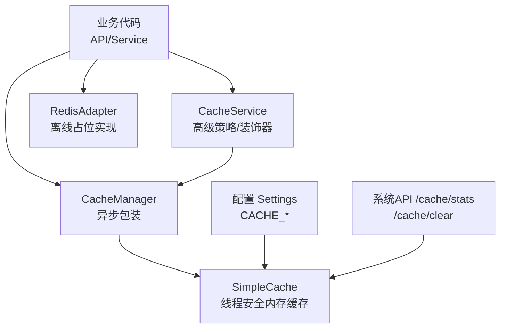
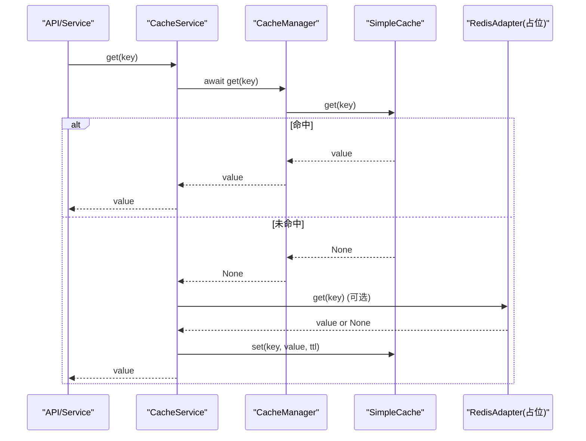
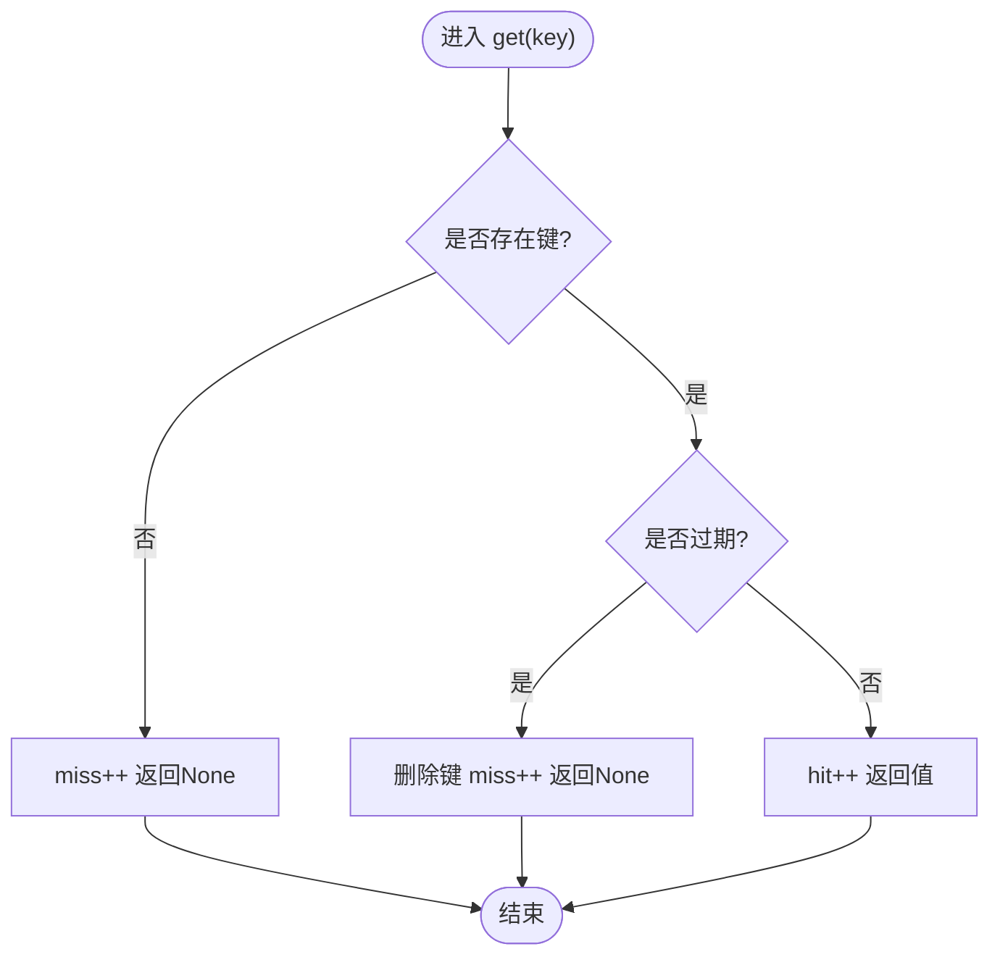
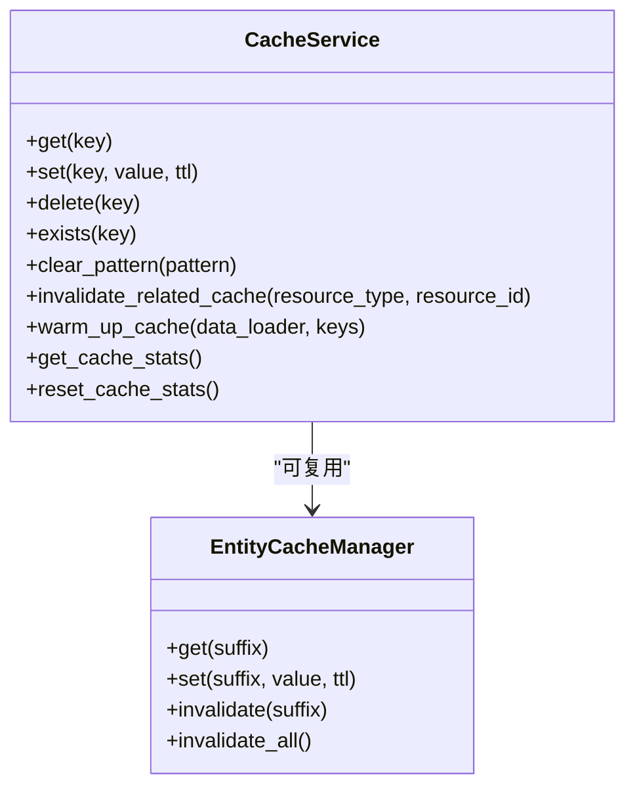
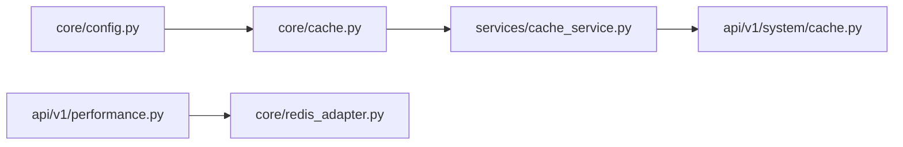

# 缓存机制实现

<cite>
**本文引用的文件**
- [backend/app/core/cache.py](file://backend/app/core/cache.py)
- [backend/app/services/cache_service.py](file://backend/app/services/cache_service.py)
- [backend/app/api/v1/system/cache.py](file://backend/app/api/v1/system/cache.py)
- [backend/app/core/redis_adapter.py](file://backend/app/core/redis_adapter.py)
- [backend/app/core/config.py](file://backend/app/core/config.py)
- [backend/app/api/v1/performance.py](file://backend/app/api/v1/performance.py)
</cite>

## 目录
1. [简介](#简介)
2. [项目结构](#项目结构)
3. [核心组件](#核心组件)
4. [架构总览](#架构总览)
5. [详细组件分析](#详细组件分析)
6. [依赖关系分析](#依赖关系分析)
7. [性能考量](#性能考量)
8. [故障排查指南](#故障排查指南)
9. [结论](#结论)
10. [附录：使用模式与最佳实践](#附录：使用模式与最佳实践)

## 简介
本文件围绕后端缓存机制的实现进行系统化说明，覆盖内存缓存、Redis适配层、数据库查询缓存的层次化设计；解释LRU/TTL/写穿透/写回等策略的应用场景；给出一致性保障（数据同步、失效策略、并发控制）方案；并提供监控与调优指南（命中率统计、内存优化、分布式扩展）以及具体使用模式与最佳实践。

## 项目结构
当前仓库在后端实现了以“进程内内存缓存”为核心的轻量级缓存体系，并通过统一的适配器抽象为未来接入Redis预留了空间。关键位置如下：
- 内存缓存与异步包装：backend/app/core/cache.py
- 高级缓存服务与装饰器：backend/app/services/cache_service.py
- 缓存管理API（统计/清理）：backend/app/api/v1/system/cache.py
- Redis适配器（离线占位实现）：backend/app/core/redis_adapter.py
- 配置项（TTL、容量、开关）：backend/app/core/config.py
- 性能接口中的缓存统计入口：backend/app/api/v1/performance.py

图表来源
- [backend/app/core/cache.py:14-95](file://backend/app/core/cache.py#L14-L95)
- [backend/app/services/cache_service.py:37-127](file://backend/app/services/cache_service.py#L37-L127)
- [backend/app/core/redis_adapter.py:7-43](file://backend/app/core/redis_adapter.py#L7-L43)
- [backend/app/core/config.py:180-184](file://backend/app/core/config.py#L180-L184)
- [backend/app/api/v1/system/cache.py:23-99](file://backend/app/api/v1/system/cache.py#L23-L99)

章节来源
- [backend/app/core/cache.py:14-95](file://backend/app/core/cache.py#L14-L95)
- [backend/app/services/cache_service.py:37-127](file://backend/app/services/cache_service.py#L37-L127)
- [backend/app/core/redis_adapter.py:7-43](file://backend/app/core/redis_adapter.py#L7-L43)
- [backend/app/core/config.py:180-184](file://backend/app/core/config.py#L180-L184)
- [backend/app/api/v1/system/cache.py:23-99](file://backend/app/api/v1/system/cache.py#L23-L99)

## 核心组件
- SimpleCache：线程安全的进程内字典缓存，支持每键TTL、按前缀删除、容量淘汰（先进先出）、命中/未命中计数。
- CacheManager：对SimpleCache的异步封装，提供await风格的get/set/delete/clear/close。
- CacheService：高级缓存服务，提供统一存取、模式清除、相关缓存失效、预热、统计、以及多种装饰器（@cached/@cache_result/@cache_invalidate）。
- RedisAdapter：离线部署下的内存占位实现，具备get/set/delete/exists/flush/get_stats/health_check等接口，便于后续替换为真实Redis。
- 配置项：CACHE_ENABLED、CACHE_DEFAULT_TTL、CACHE_MAX_SIZE、REDIS_ENABLED等。

章节来源
- [backend/app/core/cache.py:14-145](file://backend/app/core/cache.py#L14-L145)
- [backend/app/services/cache_service.py:20-227](file://backend/app/services/cache_service.py#L20-L227)
- [backend/app/core/redis_adapter.py:7-43](file://backend/app/core/redis_adapter.py#L7-L43)
- [backend/app/core/config.py:180-184](file://backend/app/core/config.py#L180-L184)

## 架构总览
系统采用“内存优先 + 可选分布式”的分层缓存架构：
- L1 内存缓存：SimpleCache，低延迟、线程安全、支持TTL和容量淘汰。
- L2 分布式缓存：通过RedisAdapter抽象，当前为离线占位实现，可无缝切换至Redis。
- 数据库查询缓存：通过装饰器与CacheService在业务层组合使用，形成读多写少场景的缓存策略。

图表来源
- [backend/app/services/cache_service.py:44-127](file://backend/app/services/cache_service.py#L44-L127)
- [backend/app/core/cache.py:72-95](file://backend/app/core/cache.py#L72-L95)
- [backend/app/core/redis_adapter.py:13-25](file://backend/app/core/redis_adapter.py#L13-L25)

## 详细组件分析

### SimpleCache（内存缓存）
- 功能要点
  - 线程安全：内部使用互斥锁保护读写。
  - TTL：每个条目记录过期时间，读取时若过期则删除并计miss。
  - 容量淘汰：达到max_size时，移除最早插入的键（FIFO式淘汰）。
  - 统计：维护_hits/_misses用于命中率计算。
  - 批量操作：delete_by_prefix支持按前缀批量删除。
- 复杂度
  - get/set/delete：均摊O(1)。
  - delete_by_prefix：O(n)，n为匹配键数量。
- 适用场景
  - 单进程高并发读多写少的热点数据缓存。
  - 需要快速失效与精确TTL控制的场景。

图表来源
- [backend/app/core/cache.py:24-36](file://backend/app/core/cache.py#L24-L36)

章节来源
- [backend/app/core/cache.py:14-70](file://backend/app/core/cache.py#L14-L70)

### CacheManager（异步包装）
- 作用：将同步的SimpleCache暴露为异步接口，便于在async函数中await调用。
- 能力：get/set/delete/delete_by_prefix/clear/close。

章节来源
- [backend/app/core/cache.py:72-95](file://backend/app/core/cache.py#L72-L95)

### CacheService（高级缓存服务）
- 统一存取：get/set/delete/exists/clear_pattern/invalidate_related_cache/warm_up_cache。
- 装饰器：
  - @cached：基于函数签名生成key，支持自定义key_func/key_prefix，自动缓存非空结果。
  - @cache_result：兼容同步/异步函数的结果缓存。
  - @cache_invalidate：写后失效相关资源缓存（如user:xxx、user:list、stats:user:xxx）。
- 指标：内部维护hits/misses/sets/deletes，便于统计。
- 实体管理器：EntityCacheManager提供按实体的便捷存取与批量失效。

图表来源
- [backend/app/services/cache_service.py:37-227](file://backend/app/services/cache_service.py#L37-L227)
- [backend/app/services/cache_service.py:427-473](file://backend/app/services/cache_service.py#L427-L473)

章节来源
- [backend/app/services/cache_service.py:37-227](file://backend/app/services/cache_service.py#L37-L227)
- [backend/app/services/cache_service.py:427-473](file://backend/app/services/cache_service.py#L427-L473)

### RedisAdapter（分布式缓存适配层）
- 当前实现：离线内存占位，具备get/set/delete/exists/flush/get_stats/health_check。
- 扩展点：可按需替换为真实Redis客户端，保持接口一致，从而在不改动上层逻辑的情况下启用分布式缓存。

章节来源
- [backend/app/core/redis_adapter.py:7-43](file://backend/app/core/redis_adapter.py#L7-L43)

### 配置项（Settings）
- CACHE_ENABLED：是否启用缓存。
- CACHE_DEFAULT_TTL：默认TTL（秒）。
- CACHE_MAX_SIZE：内存缓存最大条目数。
- REDIS_ENABLED：是否启用Redis（当前默认关闭）。

章节来源
- [backend/app/core/config.py:180-184](file://backend/app/core/config.py#L180-L184)

## 依赖关系分析
- 模块耦合
  - cache_service依赖core.cache提供的CacheManager/SimpleCache。
  - system/cache API直接访问default_cache与cache_manager进行统计与清理。
  - performance API通过redis_adapter获取统计与健康状态。
- 外部依赖
  - 当前无外部缓存依赖（Redis为可选且默认关闭），满足离线单机部署需求。

图表来源
- [backend/app/core/cache.py:135-145](file://backend/app/core/cache.py#L135-L145)
- [backend/app/services/cache_service.py:13-15](file://backend/app/services/cache_service.py#L13-L15)
- [backend/app/api/v1/system/cache.py:12-16](file://backend/app/api/v1/system/cache.py#L12-L16)
- [backend/app/api/v1/performance.py:92-95](file://backend/app/api/v1/performance.py#L92-L95)
- [backend/app/core/config.py:180-184](file://backend/app/core/config.py#L180-L184)

章节来源
- [backend/app/core/cache.py:135-145](file://backend/app/core/cache.py#L135-L145)
- [backend/app/services/cache_service.py:13-15](file://backend/app/services/cache_service.py#L13-L15)
- [backend/app/api/v1/system/cache.py:12-16](file://backend/app/api/v1/system/cache.py#L12-L16)
- [backend/app/api/v1/performance.py:92-95](file://backend/app/api/v1/performance.py#L92-L95)
- [backend/app/core/config.py:180-184](file://backend/app/core/config.py#L180-L184)

## 性能考量
- 命中率统计
  - SimpleCache内置_hits/_misses，system/cache的/stats接口可计算命中率与估算内存占用。
  - CacheService维护自身hits/misses/sets/deletes，便于分层观察。
- 内存使用优化
  - 合理设置CACHE_MAX_SIZE避免OOM；结合TTL减少常驻键数量。
  - 使用delete_by_prefix或invalidate_related_cache进行精准失效，降低无效键堆积。
- 分布式扩展
  - 通过RedisAdapter抽象，可在生产环境开启REDIS_ENABLED并替换为真实Redis，实现跨进程/多实例共享缓存。
- 并发控制
  - SimpleCache使用线程锁保证并发安全；在高并发下注意锁竞争，必要时拆分缓存域或引入分片。

章节来源
- [backend/app/api/v1/system/cache.py:23-62](file://backend/app/api/v1/system/cache.py#L23-L62)
- [backend/app/core/cache.py:14-70](file://backend/app/core/cache.py#L14-L70)
- [backend/app/services/cache_service.py:44-127](file://backend/app/services/cache_service.py#L44-L127)

## 故障排查指南
- 常见问题
  - 命中率低：检查TTL是否过短、key生成是否唯一、是否存在大量冷数据。
  - 内存增长：检查是否缺少失效逻辑、是否误用长TTL、是否未使用批量失效。
  - 缓存不一致：确认写路径是否调用@cache_invalidate或显式invalidate_related_cache。
- 定位手段
  - 使用/system/cache/stats查看命中率、键数量、估算大小。
  - 使用/system/cache/clear重置缓存并观察恢复情况。
  - 使用performance的缓存统计接口查看Redis适配器健康与统计（当前为内存占位）。

章节来源
- [backend/app/api/v1/system/cache.py:23-99](file://backend/app/api/v1/system/cache.py#L23-L99)
- [backend/app/api/v1/performance.py:80-118](file://backend/app/api/v1/performance.py#L80-L118)

## 结论
本项目实现了稳定可靠的进程内内存缓存，并通过CacheService提供了丰富的策略与工具方法，满足大多数读多写少场景的性能需求。同时，通过RedisAdapter抽象为未来分布式缓存预留了平滑升级路径。建议在生产环境中根据负载特征调整TTL与容量，并结合失效策略与监控指标持续优化。

## 附录：使用模式与最佳实践
- 读多写少热点数据
  - 使用@cached或@cache_result包裹查询函数，设置合理的TTL。
  - 对列表/统计类数据使用较短TTL，避免频繁刷新。
- 写后失效
  - 使用@cache_invalidate或在写成功后调用invalidate_related_cache，确保一致性。
- 批量失效
  - 使用delete_by_prefix或EntityCacheManager.invalidate_all进行批量清理。
- 预热
  - 启动或定时任务中使用warm_up_cache预加载热点数据，降低首访延迟。
- 监控与调优
  - 定期查看/system/cache/stats，关注命中率与内存占用。
  - 根据业务峰值调整CACHE_MAX_SIZE与TTL，必要时切换到Redis。

章节来源
- [backend/app/services/cache_service.py:259-403](file://backend/app/services/cache_service.py#L259-L403)
- [backend/app/api/v1/system/cache.py:23-99](file://backend/app/api/v1/system/cache.py#L23-L99)