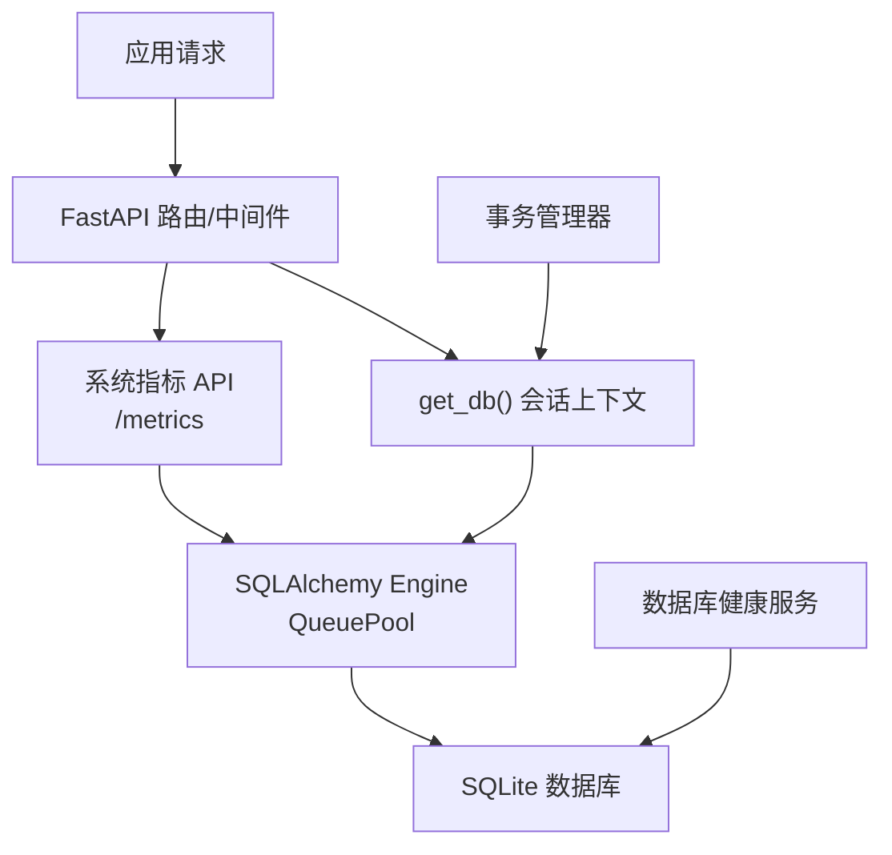
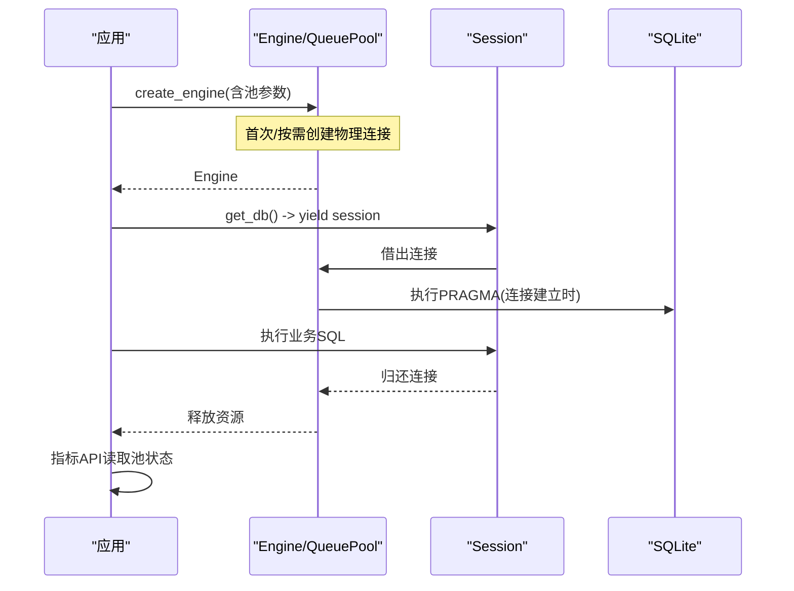
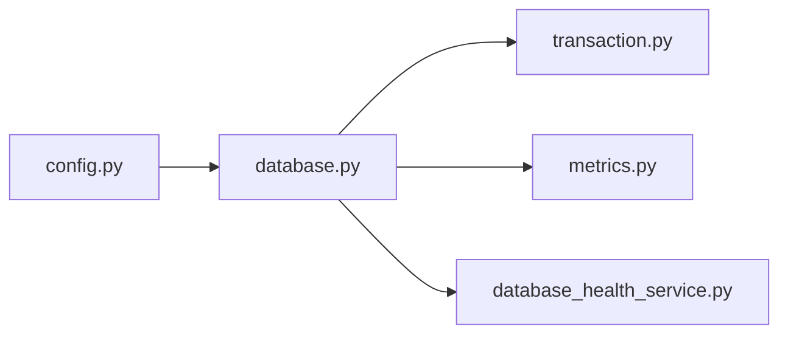

# 连接池配置

<cite>
**本文引用的文件**
- [backend/app/core/database.py](file://backend/app/core/database.py)
- [backend/app/core/config.py](file://backend/app/core/config.py)
- [backend/app/core/transaction.py](file://backend/app/core/transaction.py)
- [backend/app/api/v1/system/metrics.py](file://backend/app/api/v1/system/metrics.py)
- [backend/app/services/database_health_service.py](file://backend/app/services/database_health_service.py)
</cite>

## 目录
1. [简介](#简介)
2. [项目结构](#项目结构)
3. [核心组件](#核心组件)
4. [架构总览](#架构总览)
5. [详细组件分析](#详细组件分析)
6. [依赖关系分析](#依赖关系分析)
7. [性能与调优](#性能与调优)
8. [故障恢复与降级](#故障恢复与降级)
9. [监控方案](#监控方案)
10. [结论](#结论)

## 简介
本文件围绕数据库连接池的配置、工作原理与运维实践，结合代码实现给出可操作的指南。重点覆盖：
- 连接生命周期管理（获取、使用、归还、回收）
- 空闲连接处理与健康检查
- 连接泄漏防护与事务边界
- 参数调优（最大/最小连接数、溢出、超时、回收周期等）
- 监控指标（活跃连接数、等待时间、慢查询、健康状态）
- 高并发优化策略与故障恢复/降级机制

## 项目结构
本项目在 SQLite 场景下通过 SQLAlchemy 的 QueuePool 构建连接池，并在应用启动时注入 PRAGMA 优化；同时提供事务管理工具、系统指标 API 和数据库健康服务，形成“连接池—事务—监控”的闭环。

图表来源
- [backend/app/core/database.py:55-67](file://backend/app/core/database.py#L55-L67)
- [backend/app/api/v1/system/metrics.py:123-137](file://backend/app/api/v1/system/metrics.py#L123-L137)
- [backend/app/core/transaction.py:31-73](file://backend/app/core/transaction.py#L31-L73)

章节来源
- [backend/app/core/database.py:55-67](file://backend/app/core/database.py#L55-L67)
- [backend/app/core/config.py:95-104](file://backend/app/core/config.py#L95-L104)
- [backend/app/api/v1/system/metrics.py:123-137](file://backend/app/api/v1/system/metrics.py#L123-L137)

## 核心组件
- 引擎与连接池：基于 SQLAlchemy 创建 Engine，并针对 SQLite 启用 QueuePool，设置 pool_size、max_overflow、pool_pre_ping、pool_recycle、pool_timeout 等关键参数。
- 会话管理：SessionLocal + get_db() 生成器，确保请求级会话的生命周期与异常回滚。
- 事务管理：统一的事务上下文、装饰器、保存点、批量操作与安全提交。
- 监控与诊断：系统指标 API 暴露连接池状态；数据库健康服务执行完整性检查、VACUUM、索引检查等。

章节来源
- [backend/app/core/database.py:55-67](file://backend/app/core/database.py#L55-L67)
- [backend/app/core/database.py:174-186](file://backend/app/core/database.py#L174-L186)
- [backend/app/core/transaction.py:48-197](file://backend/app/core/transaction.py#L48-L197)
- [backend/app/api/v1/system/metrics.py:123-137](file://backend/app/api/v1/system/metrics.py#L123-L137)
- [backend/app/services/database_health_service.py:16-47](file://backend/app/services/database_health_service.py#L16-L47)

## 架构总览
连接池从 Engine 初始化开始，经由 Session 提供给业务层；每次连接建立时自动执行 SQLite PRAGMA 优化；关闭时触发 optimize；系统指标 API 定期读取池状态；健康服务周期性维护数据库。

图表来源
- [backend/app/core/database.py:55-67](file://backend/app/core/database.py#L55-L67)
- [backend/app/core/database.py:78-157](file://backend/app/core/database.py#L78-L157)
- [backend/app/api/v1/system/metrics.py:123-137](file://backend/app/api/v1/system/metrics.py#L123-L137)

## 详细组件分析

### 连接池与引擎配置
- 连接池类型：SQLite 使用 QueuePool，其他数据库走默认池。
- 关键参数来源：
  - DB_POOL_SIZE：基础连接数
  - DB_MAX_OVERFLOW：临时溢出连接上限
  - DB_POOL_TIMEOUT：获取连接的等待超时
  - DB_POOL_RECYCLE：连接复用周期
  - DB_POOL_PRE_PING：连接健康检查
  - DB_ECHO：SQL 日志开关（生产强制关闭）
- 连接参数：SQLite 禁用线程检查以支持多线程/协程环境。

章节来源
- [backend/app/core/database.py:55-67](file://backend/app/core/database.py#L55-L67)
- [backend/app/core/config.py:95-104](file://backend/app/core/config.py#L95-L104)
- [backend/app/core/config.py:301-309](file://backend/app/core/config.py#L301-L309)

### 连接生命周期与空闲处理
- 新建连接：事件监听 connect 时执行 PRAGMA 优化（WAL、同步模式、缓存、mmap、busy_timeout、自动 checkpoint、自动索引等）。
- 使用连接：通过 Session 借出，业务完成后归还。
- 空闲连接：按 pool_recycle 周期回收，避免长驻连接导致资源占用或锁竞争。
- 健康检查：pool_pre_ping 在借出前探测连接有效性，失败则重建。

章节来源
- [backend/app/core/database.py:78-157](file://backend/app/core/database.py#L78-L157)
- [backend/app/core/database.py:55-67](file://backend/app/core/database.py#L55-L67)

### 连接泄漏防护与事务边界
- 会话上下文：get_db() 在异常时显式 rollback，finally 中 close，避免脏事务残留。
- 安全提交：safe_commit 封装 commit，失败时自动 rollback 并记录日志。
- 事务工具：提供上下文管理器、装饰器、保存点、批量操作，统一异常处理与回滚语义。

章节来源
- [backend/app/core/database.py:174-186](file://backend/app/core/database.py#L174-L186)
- [backend/app/core/transaction.py:200-233](file://backend/app/core/transaction.py#L200-L233)
- [backend/app/core/transaction.py:48-197](file://backend/app/core/transaction.py#L48-L197)

### 写入协调器（SQLite 长事务保护）
- exclusive_write：进程内独占写锁，防止长事务被 busy_timeout 截断，同时不阻塞短事务读。
- 队列兼容：保留 enqueue 能力用于旧版串行写入，但新代码建议使用 exclusive_write 配合后台任务。

章节来源
- [backend/app/core/database.py:198-285](file://backend/app/core/database.py#L198-L285)

### 监控与指标
- 系统指标 API：暴露连接池 size、checkedin、overflow、connections_in_use 等。
- 数据库指标 API：表数量、关键表行数统计、数据库文件大小等。
- 健康服务：周期性完整性检查、快速检查、VACUUM、索引检查与分析。

章节来源
- [backend/app/api/v1/system/metrics.py:123-137](file://backend/app/api/v1/system/metrics.py#L123-L137)
- [backend/app/api/v1/system/metrics.py:209-273](file://backend/app/api/v1/system/metrics.py#L209-L273)
- [backend/app/services/database_health_service.py:80-133](file://backend/app/services/database_health_service.py#L80-L133)
- [backend/app/services/database_health_service.py:135-184](file://backend/app/services/database_health_service.py#L135-L184)
- [backend/app/services/database_health_service.py:224-262](file://backend/app/services/database_health_service.py#L224-L262)

## 依赖关系分析
- database.py 依赖 config.py 提供的 settings（包含连接池参数）。
- transaction.py 依赖 database.py 的 get_db 与 IS_SQLITE。
- metrics.py 依赖 engine.pool 暴露连接池状态。
- database_health_service.py 直接访问数据库文件路径并执行 PRAGMA/VACUUM。

图表来源
- [backend/app/core/config.py:95-104](file://backend/app/core/config.py#L95-L104)
- [backend/app/core/database.py:55-67](file://backend/app/core/database.py#L55-L67)
- [backend/app/core/transaction.py:16-18](file://backend/app/core/transaction.py#L16-L18)
- [backend/app/api/v1/system/metrics.py:16-20](file://backend/app/api/v1/system/metrics.py#L16-L20)
- [backend/app/services/database_health_service.py:48-78](file://backend/app/services/database_health_service.py#L48-L78)

章节来源
- [backend/app/core/config.py:95-104](file://backend/app/core/config.py#L95-L104)
- [backend/app/core/database.py:55-67](file://backend/app/core/database.py#L55-L67)
- [backend/app/core/transaction.py:16-18](file://backend/app/core/transaction.py#L16-L18)
- [backend/app/api/v1/system/metrics.py:16-20](file://backend/app/api/v1/system/metrics.py#L16-L20)
- [backend/app/services/database_health_service.py:48-78](file://backend/app/services/database_health_service.py#L48-L78)

## 性能与调优

### 连接池参数调优建议
- 最大连接数（DB_POOL_SIZE）：根据并发请求峰值与单请求平均耗时估算。当前默认 40，压测表明 30 连接在 50+ 并发会排队耗尽，已扩大至 40 留余量。
- 溢出连接（DB_MAX_OVERFLOW）：应对突发流量，建议设置为 DB_POOL_SIZE 的 30%-50%。当前默认 20。
- 等待超时（DB_POOL_TIMEOUT）：控制获取连接的最大等待时间，避免请求长时间阻塞。当前默认 30 秒。
- 连接回收（DB_POOL_RECYCLE）：定时回收连接，避免长事务导致的连接占用。当前默认 3600 秒。
- 健康检查（DB_POOL_PRE_PING）：开启以在借出连接前探测有效性，减少坏连接带来的重试开销。
- SQL 日志（DB_ECHO）：开发调试开启，生产环境强制关闭以防敏感信息泄露。

章节来源
- [backend/app/core/config.py:95-104](file://backend/app/core/config.py#L95-L104)
- [backend/app/core/config.py:301-309](file://backend/app/core/config.py#L301-L309)
- [backend/app/core/database.py:55-67](file://backend/app/core/database.py#L55-L67)

### 空闲连接与 WAL 优化
- WAL 模式：提升并发读写能力，降低写阻塞。
- 同步模式 NORMAL：兼顾数据安全与写入性能。
- 内存与缓存：cache_size、mmap_size、temp_store=MEMORY 提升查询性能。
- busy_timeout：放宽到 10 秒，缓解大事务下的 SQLITE_BUSY。
- 自动 checkpoint：wal_autocheckpoint=1000 控制 WAL 增长。

章节来源
- [backend/app/core/database.py:78-157](file://backend/app/core/database.py#L78-L157)

### 高并发场景优化策略
- 短事务优先：常规 CRUD 走 WAL + busy_timeout 自动重试，无需额外加锁。
- 长事务独占写：使用 exclusive_write 包裹大批量导入/更新，避免长事务被中断。
- 批量操作：使用 BatchOperation 分批 flush/commit，控制内存与锁持有时间。
- 连接池扩容：在高并发峰值期适当提高 DB_POOL_SIZE 与 DB_MAX_OVERFLOW。
- 慢查询治理：结合指标 API 与慢查询阈值（SLOW_QUERY_THRESHOLD_MS）定位热点。

章节来源
- [backend/app/core/database.py:198-285](file://backend/app/core/database.py#L198-L285)
- [backend/app/core/transaction.py:365-457](file://backend/app/core/transaction.py#L365-L457)
- [backend/app/core/config.py:95-104](file://backend/app/core/config.py#L95-L104)

## 故障恢复与降级

### 连接泄漏防护
- 会话级异常回滚：get_db() 捕获异常后 rollback，避免脏事务污染后续复用。
- 安全提交：safe_commit 在 commit 失败时自动 rollback 并记录日志。
- 事务边界：统一使用事务上下文/装饰器，确保异常路径一定回滚。

章节来源
- [backend/app/core/database.py:174-186](file://backend/app/core/database.py#L174-L186)
- [backend/app/core/transaction.py:200-233](file://backend/app/core/transaction.py#L200-L233)
- [backend/app/core/transaction.py:48-197](file://backend/app/core/transaction.py#L48-L197)

### 连接池不可用降级
- 指标采集降级：当 engine.pool 不可用时，系统指标返回 unavailable，不影响主流程。
- 健康检查容错：健康服务各方法均捕获异常并返回错误状态，避免影响主业务。

章节来源
- [backend/app/api/v1/system/metrics.py:123-137](file://backend/app/api/v1/system/metrics.py#L123-L137)
- [backend/app/services/database_health_service.py:135-184](file://backend/app/services/database_health_service.py#L135-L184)

### 死锁与锁等待处理
- busy_timeout：放宽锁等待时间，降低 SQLITE_BUSY 失败率。
- 独占写：长事务使用 exclusive_write 串行化写入，避免并发冲突。
- 重试机制：事务层提供 retry_on_deadlock 装饰器，对死锁进行有限重试。

章节来源
- [backend/app/core/database.py:141-142](file://backend/app/core/database.py#L141-L142)
- [backend/app/core/database.py:211-236](file://backend/app/core/database.py#L211-L236)
- [backend/app/core/transaction.py:322-362](file://backend/app/core/transaction.py#L322-L362)

## 监控方案

### 连接池监控指标
- 活跃连接数：connections_in_use = size - checkedin
- 连接池规模：size、overflow
- 连接状态：status（connected/unavailable）

章节来源
- [backend/app/api/v1/system/metrics.py:123-137](file://backend/app/api/v1/system/metrics.py#L123-L137)

### 等待时间与慢查询分析
- 慢查询阈值：SLOW_QUERY_THRESHOLD_MS 控制慢查询判定。
- 指标 API：/metrics/performance 提供 CPU/内存/磁盘等系统指标，辅助定位瓶颈。
- 历史指标：/metrics/history 可拉取历史监控数据，用于趋势分析。

章节来源
- [backend/app/core/config.py:95-104](file://backend/app/core/config.py#L95-L104)
- [backend/app/api/v1/system/metrics.py:148-206](file://backend/app/api/v1/system/metrics.py#L148-L206)
- [backend/app/api/v1/system/metrics.py:276-330](file://backend/app/api/v1/system/metrics.py#L276-L330)

### 数据库健康与维护
- 完整性检查：定期 PRAGMA integrity_check，发现损坏及时告警。
- VACUUM 优化：周期性压缩数据库文件，释放碎片空间。
- 索引检查：验证索引完整性，必要时重建。
- 统计信息：ANALYZE 更新统计，优化查询计划。

章节来源
- [backend/app/services/database_health_service.py:135-184](file://backend/app/services/database_health_service.py#L135-L184)
- [backend/app/services/database_health_service.py:224-262](file://backend/app/services/database_health_service.py#L224-L262)
- [backend/app/services/database_health_service.py:264-331](file://backend/app/services/database_health_service.py#L264-L331)

## 结论
本项目通过 SQLAlchemy QueuePool 为 SQLite 提供了稳定的连接池能力，并结合 PRAGMA 优化、事务管理与健康服务，形成了完整的连接生命周期与监控体系。在高并发场景下，建议合理配置连接池参数、采用短事务与批量操作、使用独占写保护长事务，并通过指标 API 与健康服务持续观测与优化。遇到连接池不可用或健康问题时，系统具备降级与容错能力，保障主业务流程稳定运行。